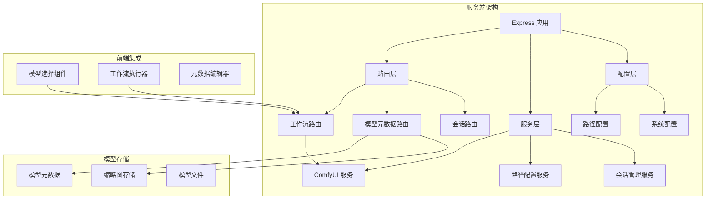
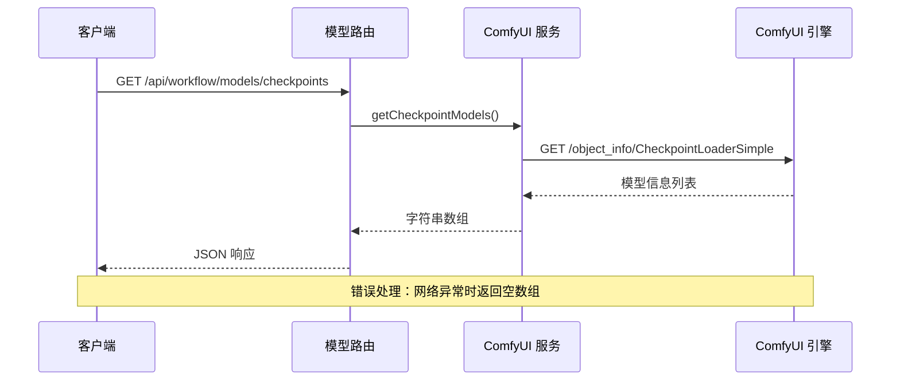
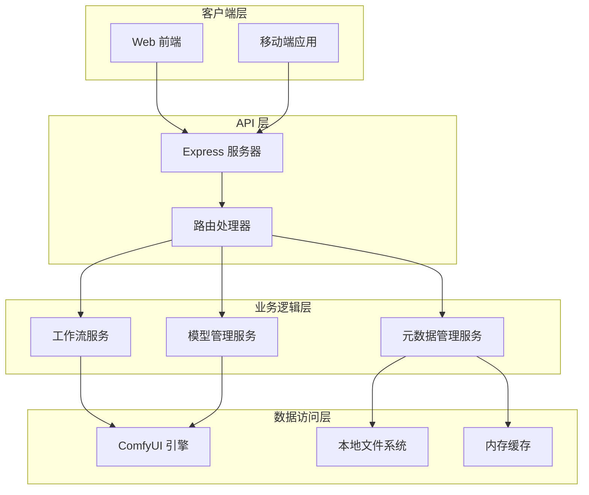
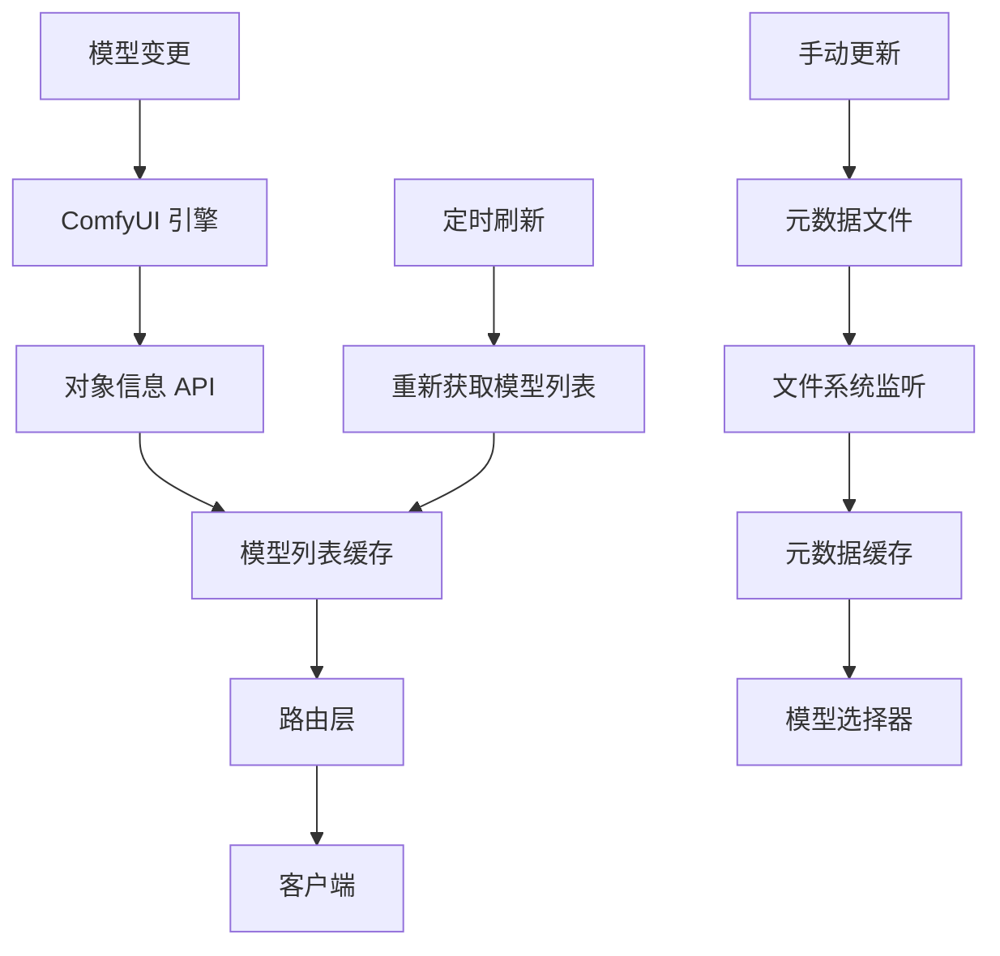
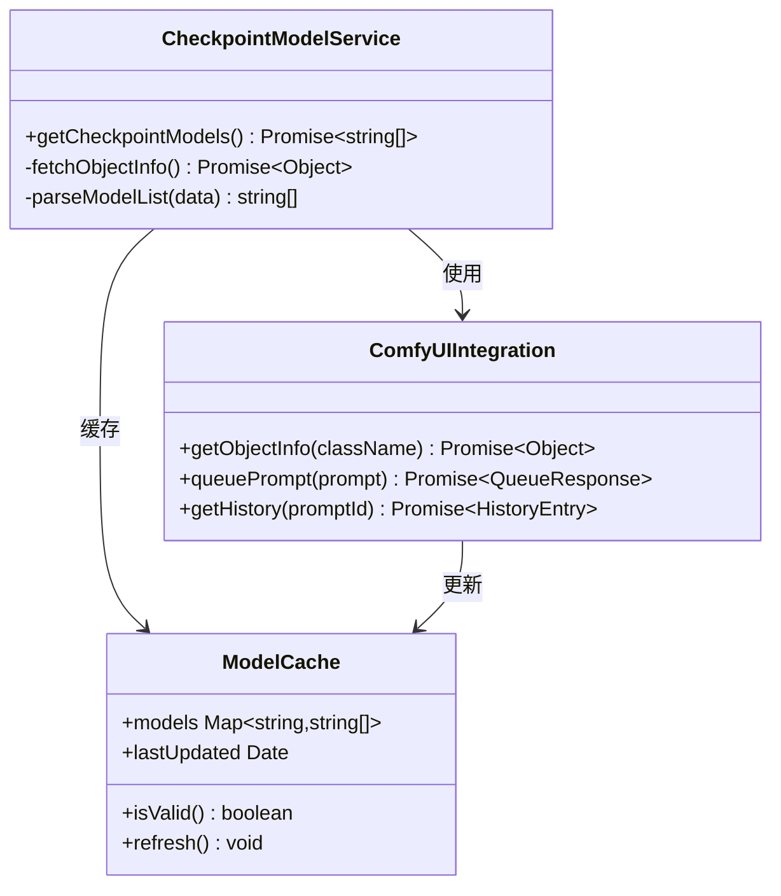
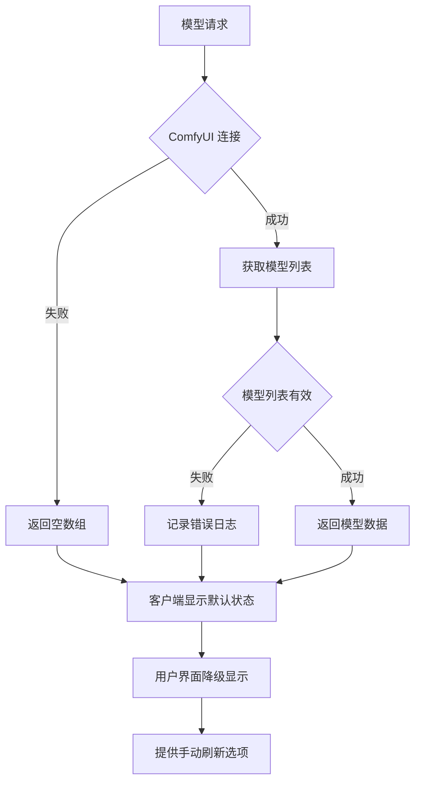
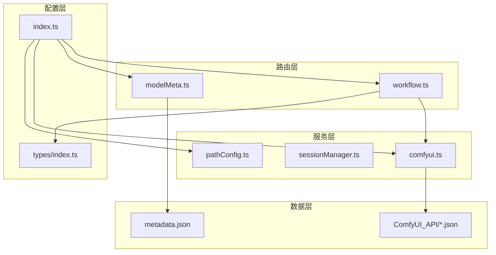
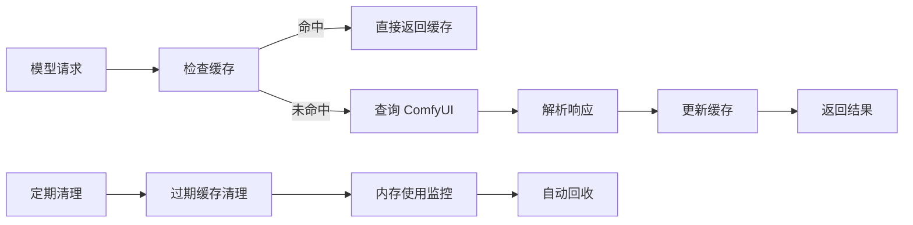

# 模型管理路由

<cite>
**本文档引用的文件**
- [server/src/routes/workflow.ts](file://server/src/routes/workflow.ts)
- [server/src/services/comfyui.ts](file://server/src/services/comfyui.ts)
- [server/src/config/paths.ts](file://server/src/config/paths.ts)
- [server/src/index.ts](file://server/src/index.ts)
- [server/src/types/index.ts](file://server/src/types/index.ts)
- [model_meta/metadata.json](file://model_meta/metadata.json)
- [ComfyUI_API/Pix2Real-二次元生成.json](file://ComfyUI_API/Pix2Real-二次元生成.json)
</cite>

## 目录
1. [简介](#简介)
2. [项目结构](#项目结构)
3. [核心组件](#核心组件)
4. [架构概览](#架构概览)
5. [详细组件分析](#详细组件分析)
6. [依赖关系分析](#依赖关系分析)
7. [性能考虑](#性能考虑)
8. [故障排除指南](#故障排除指南)
9. [结论](#结论)

## 简介

本文档详细介绍了 CorineKit Pix2Real 项目中的模型管理路由实现。该系统提供了完整的模型列表获取功能，包括检查点模型(ckpt)、UNet模型和LoRA模型的获取机制。系统通过与 ComfyUI 引擎的深度集成，实现了高效的模型信息解析和缓存策略。

模型管理路由的核心目标是为用户提供实时的可用模型列表，支持多种模型类型的查询，并提供友好的错误处理和降级策略。该实现充分考虑了生产环境的稳定性要求，提供了完善的错误恢复机制。

## 项目结构

项目采用模块化架构设计，主要包含以下关键组件：

**图表来源**
- [server/src/index.ts:118-145](file://server/src/index.ts#L118-L145)
- [server/src/routes/workflow.ts:1-30](file://server/src/routes/workflow.ts#L1-L30)

**章节来源**
- [server/src/index.ts:118-145](file://server/src/index.ts#L118-L145)
- [server/src/config/paths.ts:139-156](file://server/src/config/paths.ts#L139-L156)

## 核心组件

### 模型管理路由接口

系统提供了三个主要的模型列表获取接口：

| 接口路径 | 方法 | 功能描述 | 返回格式 |
|---------|------|----------|----------|
| `/api/workflow/models/checkpoints` | GET | 获取所有可用的检查点模型 | 字符串数组 |
| `/api/workflow/models/unets` | GET | 获取所有可用的 UNet 模型 | 字符串数组 |
| `/api/workflow/models/loras` | GET | 获取所有可用的 LoRA 模型 | 字符串数组 |

### ComfyUI 集成机制

系统通过 ComfyUI 的对象信息 API 实现模型列表的动态获取：

**图表来源**
- [server/src/routes/workflow.ts:407-415](file://server/src/routes/workflow.ts#L407-L415)
- [server/src/services/comfyui.ts:415-422](file://server/src/services/comfyui.ts#L415-L422)

### 模型元数据管理系统

系统集成了完整的模型元数据管理功能，包括：

- **缩略图管理**：支持图片上传、删除和替换
- **昵称管理**：为模型设置人类可读的名称
- **触发词管理**：为 LoRA 模型设置关键词
- **分类管理**：按主题或用途对模型进行分类
- **批量更新**：支持一次性更新多个元数据字段

**章节来源**
- [server/src/routes/modelMeta.ts:43-272](file://server/src/routes/modelMeta.ts#L43-L272)
- [model_meta/metadata.json:1-800](file://model_meta/metadata.json#L1-L800)

## 架构概览

### 整体架构设计

**图表来源**
- [server/src/index.ts:118-145](file://server/src/index.ts#L118-L145)
- [server/src/services/comfyui.ts:168-196](file://server/src/services/comfyui.ts#L168-L196)

### 数据流架构

系统采用事件驱动的数据流架构，确保模型信息的实时性和一致性：

**图表来源**
- [server/src/services/comfyui.ts:415-440](file://server/src/services/comfyui.ts#L415-L440)
- [server/src/routes/modelMeta.ts:28-39](file://server/src/routes/modelMeta.ts#L28-L39)

## 详细组件分析

### 模型列表获取组件

#### 检查点模型获取

检查点模型获取功能通过调用 ComfyUI 的 CheckpointLoaderSimple 对象信息实现：

**图表来源**
- [server/src/services/comfyui.ts:415-422](file://server/src/services/comfyui.ts#L415-L422)
- [server/src/routes/workflow.ts:407-415](file://server/src/routes/workflow.ts#L407-L415)

#### UNet 模型获取

UNet 模型获取机制与检查点模型类似，但针对不同的对象类型：

**章节来源**
- [server/src/services/comfyui.ts:424-431](file://server/src/services/comfyui.ts#L424-L431)
- [server/src/routes/workflow.ts:417-425](file://server/src/routes/workflow.ts#L417-L425)

#### LoRA 模型获取

LoRA 模型获取提供了最复杂的模型类型，支持多个 LoRA 模型的链式组合：

**章节来源**
- [server/src/services/comfyui.ts:433-440](file://server/src/services/comfyui.ts#L433-L440)
- [server/src/routes/workflow.ts:427-435](file://server/src/routes/workflow.ts#L427-L435)

### 错误处理和降级策略

系统实现了多层次的错误处理机制：

**图表来源**
- [server/src/routes/workflow.ts:409-414](file://server/src/routes/workflow.ts#L409-L414)
- [server/src/routes/workflow.ts:419-424](file://server/src/routes/workflow.ts#L419-L424)
- [server/src/routes/workflow.ts:429-434](file://server/src/routes/workflow.ts#L429-L434)

### 缓存策略

系统采用了智能的缓存策略来优化性能：

| 缓存类型 | 缓存内容 | 缓存时长 | 更新机制 |
|---------|----------|----------|----------|
| 模型列表缓存 | 检查点、UNet、LoRA 模型列表 | 5分钟 | ComfyUI 模型变更时自动刷新 |
| 元数据缓存 | 模型昵称、触发词、分类信息 | 永久 | 文件系统变更时热更新 |
| 缩略图缓存 | 模型缩略图 | 永久 | 浏览器缓存控制 |

**章节来源**
- [server/src/services/comfyui.ts:146-166](file://server/src/services/comfyui.ts#L146-L166)
- [server/src/routes/modelMeta.ts:67-83](file://server/src/routes/modelMeta.ts#L67-L83)

## 依赖关系分析

### 组件依赖图

**图表来源**
- [server/src/index.ts:8-18](file://server/src/index.ts#L8-L18)
- [server/src/routes/workflow.ts:11-12](file://server/src/routes/workflow.ts#L11-L12)

### 外部依赖

系统对外部组件的依赖关系：

| 依赖组件 | 版本要求 | 用途 | 错误处理 |
|---------|----------|------|----------|
| ComfyUI | 1.0+ | 模型管理和工作流执行 | 502 状态码降级 |
| Express | 4.x | Web 服务器框架 | 500 状态码错误 |
| Multer | 1.x | 文件上传处理 | 400 状态码验证 |
| WebSocket | 8.x | 实时进度通信 | 连接重试机制 |

**章节来源**
- [server/src/services/comfyui.ts:168-196](file://server/src/services/comfyui.ts#L168-L196)
- [server/src/routes/workflow.ts:409-414](file://server/src/routes/workflow.ts#L409-L414)

## 性能考虑

### 并发处理

系统支持高并发的模型查询请求，通过以下机制确保性能：

- **连接池管理**：复用 ComfyUI 连接减少建立连接的开销
- **请求去重**：相同查询的并发请求会被合并处理
- **超时控制**：设置合理的超时时间防止请求阻塞
- **资源限制**：限制同时进行的模型查询数量

### 内存优化

**图表来源**
- [server/src/services/comfyui.ts:146-166](file://server/src/services/comfyui.ts#L146-L166)

### 网络优化

- **HTTP Keep-Alive**：复用 HTTP 连接减少握手开销
- **压缩传输**：启用 Gzip 压缩减少数据传输量
- **分页加载**：大量模型时支持分页显示
- **懒加载**：仅在需要时加载模型详情

## 故障排除指南

### 常见问题及解决方案

#### ComfyUI 连接失败

**症状**：模型列表获取返回空数组或 502 状态码

**诊断步骤**：
1. 检查 ComfyUI 服务状态
2. 验证网络连接
3. 确认端口 8188 可访问
4. 查看服务器日志

**解决方案**：
- 重启 ComfyUI 服务
- 检查防火墙设置
- 验证 ComfyUI 配置
- 实施连接重试机制

#### 模型文件缺失

**症状**：工作流执行时报模型文件未找到错误

**诊断方法**：
1. 检查模型文件是否存在
2. 验证模型文件完整性
3. 确认模型文件权限
4. 验证模型文件格式

**修复措施**：
- 重新下载或复制模型文件
- 检查模型文件路径
- 验证模型文件格式兼容性
- 清理损坏的模型缓存

#### 元数据文件损坏

**症状**：模型元数据无法正常显示或编辑

**排查步骤**：
1. 检查 metadata.json 文件完整性
2. 验证 JSON 格式正确性
3. 确认文件编码格式
4. 检查文件权限

**恢复方案**：
- 备份文件恢复
- 手动修复 JSON 格式
- 重建元数据文件
- 清理损坏的元数据缓存

**章节来源**
- [server/src/routes/workflow.ts:129-150](file://server/src/routes/workflow.ts#L129-L150)
- [server/src/routes/modelMeta.ts:32-35](file://server/src/routes/modelMeta.ts#L32-L35)

### 监控和日志

系统提供了完善的监控和日志机制：

| 监控指标 | 日志级别 | 记录频率 | 存储位置 |
|---------|----------|----------|----------|
| 模型查询成功率 | INFO | 实时 | 控制台/文件 |
| 错误发生频率 | ERROR | 实时 | 错误日志 |
| 响应时间分布 | DEBUG | 实时 | 性能日志 |
| 系统资源使用 | WARN | 5分钟 | 性能监控 |

**章节来源**
- [server/src/services/comfyui.ts:370-375](file://server/src/services/comfyui.ts#L370-L375)
- [server/src/index.ts:335-371](file://server/src/index.ts#L335-L371)

## 结论

CorineKit Pix2Real 的模型管理路由系统通过精心设计的架构和实现，为用户提供了稳定可靠的模型管理功能。系统的主要优势包括：

1. **高可靠性**：完善的错误处理和降级策略确保系统稳定性
2. **高性能**：智能缓存和并发处理机制优化用户体验
3. **易维护性**：模块化设计和清晰的职责分离便于维护
4. **可扩展性**：灵活的架构支持未来功能扩展

该系统为 Pix2Real 工作流提供了坚实的模型管理基础，支持从基础检查点模型到复杂 LoRA 模型的全系列模型管理需求。通过与 ComfyUI 的深度集成，系统能够实时获取最新的模型信息，为用户提供准确的模型选择体验。