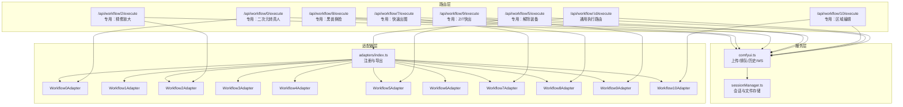
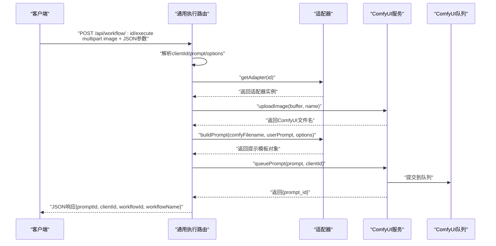
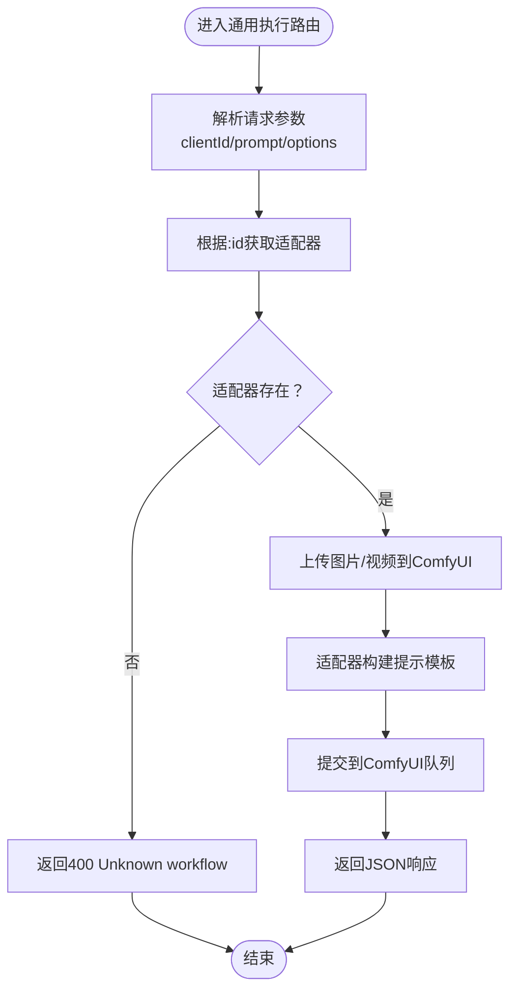
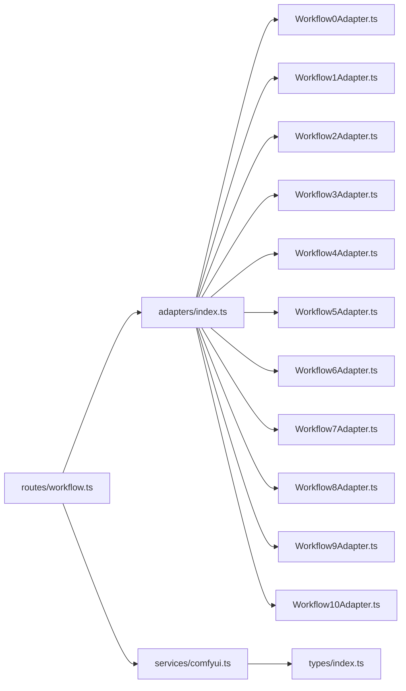

# 通用工作流执行

<cite>
**本文引用的文件**
- [workflow.ts](file://server/src/routes/workflow.ts)
- [index.ts](file://server/src/adapters/index.ts)
- [BaseAdapter.ts](file://server/src/adapters/BaseAdapter.ts)
- [comfyui.ts](file://server/src/services/comfyui.ts)
- [index.ts](file://server/src/types/index.ts)
- [Workflow0Adapter.ts](file://server/src/adapters/Workflow0Adapter.ts)
- [Workflow2Adapter.ts](file://server/src/adapters/Workflow2Adapter.ts)
- [Workflow7Adapter.ts](file://server/src/adapters/Workflow7Adapter.ts)
- [Workflow9Adapter.ts](file://server/src/adapters/Workflow9Adapter.ts)
- [Workflow1Adapter.ts](file://server/src/adapters/Workflow1Adapter.ts)
- [Workflow3Adapter.ts](file://server/src/adapters/Workflow3Adapter.ts)
- [Workflow4Adapter.ts](file://server/src/adapters/Workflow4Adapter.ts)
- [Workflow5Adapter.ts](file://server/src/adapters/Workflow5Adapter.ts)
- [Workflow6Adapter.ts](file://server/src/adapters/Workflow6Adapter.ts)
- [sessionManager.ts](file://server/src/services/sessionManager.ts)
</cite>

## 目录
1. [简介](#简介)
2. [项目结构](#项目结构)
3. [核心组件](#核心组件)
4. [架构总览](#架构总览)
5. [详细组件分析](#详细组件分析)
6. [依赖关系分析](#依赖关系分析)
7. [性能考量](#性能考量)
8. [故障排查指南](#故障排查指南)
9. [结论](#结论)
10. [附录](#附录)

## 简介
本文档围绕 CorineKit Pix2Real 的“通用工作流执行”机制展开，重点阐述以下内容：
- 通用工作流执行路由的设计与实现，包括动态适配器模式的工作原理与扩展方式
- 文件上传处理流程、参数解析与验证规则
- 如何通过通用路由支持任意工作流 ID 的动态执行（请求参数格式、响应结构、错误处理）
- 专用工作流路由与通用路由的差异与优势
- 具体代码示例路径，帮助开发者快速扩展新的工作流类型

## 项目结构
后端采用 Express 路由 + 适配器模式 + ComfyUI 服务层的分层架构：
- 路由层：集中定义工作流执行接口，包括通用路由与专用路由
- 适配器层：为不同工作流提供模板与参数装配逻辑
- 服务层：封装 ComfyUI 的上传、排队、历史查询、WebSocket 进度回调等操作
- 类型定义：统一接口契约，保证路由与适配器之间的类型安全

图表来源
- [workflow.ts:750-799](file://server/src/routes/workflow.ts#L750-L799)
- [index.ts:14-30](file://server/src/adapters/index.ts#L14-L30)
- [comfyui.ts:168-196](file://server/src/services/comfyui.ts#L168-L196)
- [sessionManager.ts:11-18](file://server/src/services/sessionManager.ts#L11-L18)

章节来源
- [workflow.ts:152-161](file://server/src/routes/workflow.ts#L152-L161)
- [index.ts:14-30](file://server/src/adapters/index.ts#L14-L30)

## 核心组件
- 通用执行路由：通过动态适配器模式，支持任意工作流 ID 的执行，适用于大多数图像类工作流
- 专用执行路由：针对特定工作流的复杂参数或特殊输入（如多文件上传、参考图管理、视频处理等）
- 适配器接口：统一的构建提示模板方法，屏蔽具体工作流细节
- ComfyUI 服务：负责与 ComfyUI 交互，包括上传、排队、历史查询与 WebSocket 进度回调
- 类型系统：定义工作流适配器契约、事件与响应结构，确保前后端一致

章节来源
- [workflow.ts:750-799](file://server/src/routes/workflow.ts#L750-L799)
- [index.ts:28-30](file://server/src/adapters/index.ts#L28-L30)
- [comfyui.ts:168-196](file://server/src/services/comfyui.ts#L168-L196)
- [index.ts:1-8](file://server/src/types/index.ts#L1-L8)

## 架构总览
通用工作流执行的核心流程如下：
1. 客户端向通用路由提交请求（上传单张图片，携带工作流 ID、clientId、prompt、options 等）
2. 路由根据工作流 ID 获取对应适配器
3. 适配器读取对应工作流的 JSON 模板，注入上传后的文件名、随机种子、用户提示词与可选参数
4. 路由调用服务层将提示模板提交到 ComfyUI 队列
5. 服务层返回 prompt_id，路由以标准 JSON 响应客户端

图表来源
- [workflow.ts:750-799](file://server/src/routes/workflow.ts#L750-L799)
- [comfyui.ts:9-25](file://server/src/services/comfyui.ts#L9-L25)
- [comfyui.ts:168-196](file://server/src/services/comfyui.ts#L168-L196)
- [index.ts:28-30](file://server/src/adapters/index.ts#L28-L30)

## 详细组件分析

### 通用执行路由（动态适配器模式）
- 路由定义：接收 multipart/form-data 图片与 JSON 参数，解析 clientId、prompt、options
- 适配器选择：通过工作流 ID 从适配器注册表中获取对应适配器
- 文件上传：根据工作流 ID 判断上传为图片或视频；图片上传后得到文件名，用于模板节点注入
- 提示模板构建：调用适配器的 buildPrompt 方法，注入用户提示词与可选参数
- 提交队列：将提示模板与 clientId 发送到 ComfyUI 队列，返回 prompt_id

图表来源
- [workflow.ts:750-799](file://server/src/routes/workflow.ts#L750-L799)

章节来源
- [workflow.ts:750-799](file://server/src/routes/workflow.ts#L750-L799)

### 专用执行路由与通用路由的差异
- 专用路由用于处理复杂场景或特殊输入：
  - 多文件上传（如解除装备、区域编辑需要原图与蒙版）
  - 参考图管理（如快速出图的 PRO 版本需要参考图）
  - 视频处理（如图生视频、视频补帧）
  - 特定参数组合（如换脸、二次元转真人等）
- 通用路由适合大多数图像类工作流，参数简单、可扩展性强

章节来源
- [workflow.ts:163-215](file://server/src/routes/workflow.ts#L163-L215)
- [workflow.ts:217-267](file://server/src/routes/workflow.ts#L217-L267)
- [workflow.ts:269-405](file://server/src/routes/workflow.ts#L269-L405)
- [workflow.ts:485-593](file://server/src/routes/workflow.ts#L485-L593)
- [workflow.ts:595-642](file://server/src/routes/workflow.ts#L595-L642)
- [workflow.ts:644-687](file://server/src/routes/workflow.ts#L644-L687)
- [workflow.ts:689-748](file://server/src/routes/workflow.ts#L689-L748)

### 适配器接口与实现
- 接口定义：包含 id、name、needsPrompt、basePrompt、outputDir 以及 buildPrompt 方法
- 实现要点：
  - 读取对应工作流的 JSON 模板文件
  - 注入上传后的文件名到模板节点
  - 设置随机种子
  - 根据 needsPrompt 与用户输入拼接最终提示词
  - 对于需要可选参数的工作流（如图生视频、视频补帧），从 options 中读取并注入

```mermaid
classDiagram
class WorkflowAdapter {
+number id
+string name
+boolean needsPrompt
+string basePrompt
+string outputDir
+buildPrompt(imageName, userPrompt?, options?) object
}
class Workflow0Adapter {
+buildPrompt(imageName, userPrompt?) object
}
class Workflow1Adapter {
+buildPrompt(imageName, userPrompt?) object
}
class Workflow2Adapter {
+buildPrompt(imageName) object
}
class Workflow3Adapter {
+buildPrompt(imageName, userPrompt?, options?) object
}
class Workflow4Adapter {
+buildPrompt(videoName, _, options?) object
}
class Workflow5Adapter {
+buildPrompt() object
}
class Workflow6Adapter {
+buildPrompt(imageName, userPrompt?) object
}
class Workflow7Adapter {
+buildPrompt() object
}
class Workflow8Adapter
class Workflow9Adapter {
+buildPrompt() object
}
class Workflow10Adapter
WorkflowAdapter <|.. Workflow0Adapter
WorkflowAdapter <|.. Workflow1Adapter
WorkflowAdapter <|.. Workflow2Adapter
WorkflowAdapter <|.. Workflow3Adapter
WorkflowAdapter <|.. Workflow4Adapter
WorkflowAdapter <|.. Workflow5Adapter
WorkflowAdapter <|.. Workflow6Adapter
WorkflowAdapter <|.. Workflow7Adapter
WorkflowAdapter <|.. Workflow8Adapter
WorkflowAdapter <|.. Workflow9Adapter
WorkflowAdapter <|.. Workflow10Adapter
```

图表来源
- [index.ts:1-8](file://server/src/types/index.ts#L1-L8)
- [Workflow0Adapter.ts:9-34](file://server/src/adapters/Workflow0Adapter.ts#L9-L34)
- [Workflow1Adapter.ts:9-35](file://server/src/adapters/Workflow1Adapter.ts#L9-L35)
- [Workflow2Adapter.ts:9-27](file://server/src/adapters/Workflow2Adapter.ts#L9-L27)
- [Workflow3Adapter.ts:9-40](file://server/src/adapters/Workflow3Adapter.ts#L9-L40)
- [Workflow4Adapter.ts:9-27](file://server/src/adapters/Workflow4Adapter.ts#L9-L27)
- [Workflow5Adapter.ts:4-14](file://server/src/adapters/Workflow5Adapter.ts#L4-L14)
- [Workflow6Adapter.ts:9-35](file://server/src/adapters/Workflow6Adapter.ts#L9-L35)
- [Workflow7Adapter.ts:3-13](file://server/src/adapters/Workflow7Adapter.ts#L3-L13)
- [Workflow9Adapter.ts:3-13](file://server/src/adapters/Workflow9Adapter.ts#L3-L13)
- [index.ts:14-26](file://server/src/adapters/index.ts#L14-L26)

章节来源
- [index.ts:1-8](file://server/src/types/index.ts#L1-L8)
- [Workflow0Adapter.ts:9-34](file://server/src/adapters/Workflow0Adapter.ts#L9-L34)
- [Workflow1Adapter.ts:9-35](file://server/src/adapters/Workflow1Adapter.ts#L9-L35)
- [Workflow2Adapter.ts:9-27](file://server/src/adapters/Workflow2Adapter.ts#L9-L27)
- [Workflow3Adapter.ts:9-40](file://server/src/adapters/Workflow3Adapter.ts#L9-L40)
- [Workflow4Adapter.ts:9-27](file://server/src/adapters/Workflow4Adapter.ts#L9-L27)
- [Workflow5Adapter.ts:4-14](file://server/src/adapters/Workflow5Adapter.ts#L4-L14)
- [Workflow6Adapter.ts:9-35](file://server/src/adapters/Workflow6Adapter.ts#L9-L35)
- [Workflow7Adapter.ts:3-13](file://server/src/adapters/Workflow7Adapter.ts#L3-L13)
- [Workflow9Adapter.ts:3-13](file://server/src/adapters/Workflow9Adapter.ts#L3-L13)
- [index.ts:14-26](file://server/src/adapters/index.ts#L14-L26)

### 文件上传处理流程
- 通用路由：使用单文件上传，根据工作流 ID 判断上传为图片或视频
- 专用路由：
  - 多文件上传：如解除装备、区域编辑同时需要原图与蒙版
  - 单文件上传：如换脸需要目标图与人脸图
  - 参考图上传：快速出图的 PRO 版本需要参考图，提供上传、查看、删除接口
- 上传到 ComfyUI：统一通过服务层上传接口，返回文件名供模板注入

章节来源
- [workflow.ts:750-799](file://server/src/routes/workflow.ts#L750-L799)
- [workflow.ts:121-124](file://server/src/routes/workflow.ts#L121-L124)
- [workflow.ts:596-597](file://server/src/routes/workflow.ts#L596-L597)
- [workflow.ts:438-483](file://server/src/routes/workflow.ts#L438-L483)
- [comfyui.ts:9-25](file://server/src/services/comfyui.ts#L9-L25)
- [comfyui.ts:27-45](file://server/src/services/comfyui.ts#L27-L45)

### 参数解析与验证规则
- 通用路由：
  - 必填：clientId
  - 可选：prompt（字符串）、options（JSON 字符串，会被解析为对象）
  - 上传：单文件（图片或视频）
- 专用路由：
  - 解除装备/区域编辑：要求同时提供 image 与 mask
  - 快速出图（PRO）：当包含 referenceImage 时，需校验参考图文件是否存在
  - ZIT快出：需要 unetModel、shiftEnabled、shift、prompt、width、height、steps、cfg、sampler、scheduler 等参数
  - 黑兽换脸：需要 targetImage 与 faceImage
  - 二次元转真人/精修放大：支持多种模型选择（如 qwen/klein/seedvr2/sd/remacri 等）

章节来源
- [workflow.ts:750-799](file://server/src/routes/workflow.ts#L750-L799)
- [workflow.ts:163-215](file://server/src/routes/workflow.ts#L163-L215)
- [workflow.ts:217-267](file://server/src/routes/workflow.ts#L217-L267)
- [workflow.ts:269-405](file://server/src/routes/workflow.ts#L269-L405)
- [workflow.ts:485-593](file://server/src/routes/workflow.ts#L485-L593)
- [workflow.ts:595-642](file://server/src/routes/workflow.ts#L595-L642)
- [workflow.ts:644-687](file://server/src/routes/workflow.ts#L644-L687)
- [workflow.ts:689-748](file://server/src/routes/workflow.ts#L689-L748)

### 请求参数格式与响应结构
- 通用路由请求：
  - Content-Type：multipart/form-data 或 application/json
  - 表单字段：image（二进制）、clientId（必填）、prompt（可选）、options（可选，JSON 字符串）
- 专用路由请求：
  - 根据路由语义，可能包含多个文件字段或多组参数
- 统一响应：
  - 成功：JSON 包含 promptId、clientId、workflowId、workflowName
  - 失败：JSON 包含 error 字段，错误信息经友好化处理

章节来源
- [workflow.ts:750-799](file://server/src/routes/workflow.ts#L750-L799)
- [workflow.ts:163-215](file://server/src/routes/workflow.ts#L163-L215)
- [workflow.ts:217-267](file://server/src/routes/workflow.ts#L217-L267)
- [workflow.ts:269-405](file://server/src/routes/workflow.ts#L269-L405)
- [workflow.ts:485-593](file://server/src/routes/workflow.ts#L485-L593)
- [workflow.ts:595-642](file://server/src/routes/workflow.ts#L595-L642)
- [workflow.ts:644-687](file://server/src/routes/workflow.ts#L644-L687)
- [workflow.ts:689-748](file://server/src/routes/workflow.ts#L689-L748)
- [workflow.ts:129-150](file://server/src/routes/workflow.ts#L129-L150)

### 错误处理机制
- 友好化错误映射：将 ComfyUI 的内部错误消息转换为用户可理解的提示
- 通用错误处理：捕获异常并返回 500，包含友好错误信息
- 参数缺失：对必填参数进行显式校验并返回 400

章节来源
- [workflow.ts:129-150](file://server/src/routes/workflow.ts#L129-L150)
- [workflow.ts:750-799](file://server/src/routes/workflow.ts#L750-L799)

### 如何扩展新的工作流类型
步骤概览：
1. 在适配器目录新增一个适配器文件，实现接口中的所有属性与方法
2. 在适配器注册表中导出并注册该适配器
3. 如需专用路由，可在路由层新增对应路径与处理逻辑；否则复用通用路由
4. 准备工作流对应的 JSON 模板文件，并在适配器中读取与注入参数
5. 测试：通过通用路由或专用路由提交测试请求，验证输出结果

示例路径（不展示具体代码内容）：
- 新增适配器文件：[WorkflowXAdapter.ts](file://server/src/adapters/WorkflowXAdapter.ts)
- 注册适配器：[adapters/index.ts:14-30](file://server/src/adapters/index.ts#L14-L30)
- 通用路由调用适配器：[routes/workflow.ts:750-799](file://server/src/routes/workflow.ts#L750-L799)
- 适配器模板读取与参数注入：[Workflow0Adapter.ts:16-33](file://server/src/adapters/Workflow0Adapter.ts#L16-L33)

章节来源
- [index.ts:14-30](file://server/src/adapters/index.ts#L14-L30)
- [workflow.ts:750-799](file://server/src/routes/workflow.ts#L750-L799)
- [Workflow0Adapter.ts:16-33](file://server/src/adapters/Workflow0Adapter.ts#L16-L33)

## 依赖关系分析
- 路由层依赖适配器注册表与服务层
- 适配器层依赖模板文件与类型定义
- 服务层依赖 ComfyUI API 与 WebSocket
- 类型定义贯穿全栈，确保接口一致性

图表来源
- [workflow.ts:1-15](file://server/src/routes/workflow.ts#L1-L15)
- [index.ts:1-13](file://server/src/adapters/index.ts#L1-L13)
- [comfyui.ts:1-8](file://server/src/services/comfyui.ts#L1-L8)
- [index.ts:1-8](file://server/src/types/index.ts#L1-L8)

章节来源
- [workflow.ts:1-15](file://server/src/routes/workflow.ts#L1-L15)
- [index.ts:1-13](file://server/src/adapters/index.ts#L1-L13)
- [comfyui.ts:1-8](file://server/src/services/comfyui.ts#L1-L8)
- [index.ts:1-8](file://server/src/types/index.ts#L1-L8)

## 性能考量
- 节点权重与进度估算：服务层维护节点权重表，结合采样器步数与 tiled 采样估算总权重，用于阶段化进度展示
- WebSocket 进度回调：通过连接 ComfyUI WebSocket，实时推送进度、节点执行、缓存跳过与完成信号
- 队列优先级：支持重新排队以提升目标任务优先级

章节来源
- [comfyui.ts:58-144](file://server/src/services/comfyui.ts#L58-L144)
- [comfyui.ts:265-375](file://server/src/services/comfyui.ts#L265-L375)
- [comfyui.ts:442-471](file://server/src/services/comfyui.ts#L442-L471)

## 故障排查指南
- 常见错误与定位：
  - 适配器不存在：检查工作流 ID 与注册表映射
  - 文件上传失败：确认上传接口返回与 ComfyUI 服务状态
  - 队列提交失败：检查 ComfyUI 是否正常运行与网络连通性
  - 友好化错误：查看错误映射逻辑，定位具体模型或节点问题
- 日志与调试：
  - 路由层捕获异常并记录错误日志
  - 服务层对 HTTP 请求失败抛出明确错误
  - WebSocket 连接错误与执行错误均有回调处理

章节来源
- [workflow.ts:129-150](file://server/src/routes/workflow.ts#L129-L150)
- [workflow.ts:750-799](file://server/src/routes/workflow.ts#L750-L799)
- [comfyui.ts:168-196](file://server/src/services/comfyui.ts#L168-L196)
- [comfyui.ts:370-375](file://server/src/services/comfyui.ts#L370-L375)

## 结论
通用工作流执行路由通过动态适配器模式实现了高度可扩展的工作流体系：
- 通用路由简化了大多数图像类工作流的接入成本，参数统一、易于扩展
- 专用路由保留了对复杂场景的精细控制能力
- 适配器层将模板与参数装配逻辑抽象出来，便于维护与演进
- 服务层提供了完善的上传、排队、历史与进度回调能力，支撑完整的执行链路

## 附录
- 会话与文件存储：服务层提供会话目录结构与文件保存接口，便于后续集成会话管理功能
- 模型列表：路由层提供获取可用 Checkpoint、UNET、LoRA 模型的接口，辅助前端选择

章节来源
- [sessionManager.ts:11-18](file://server/src/services/sessionManager.ts#L11-L18)
- [sessionManager.ts:22-48](file://server/src/services/sessionManager.ts#L22-L48)
- [workflow.ts:407-435](file://server/src/routes/workflow.ts#L407-L435)