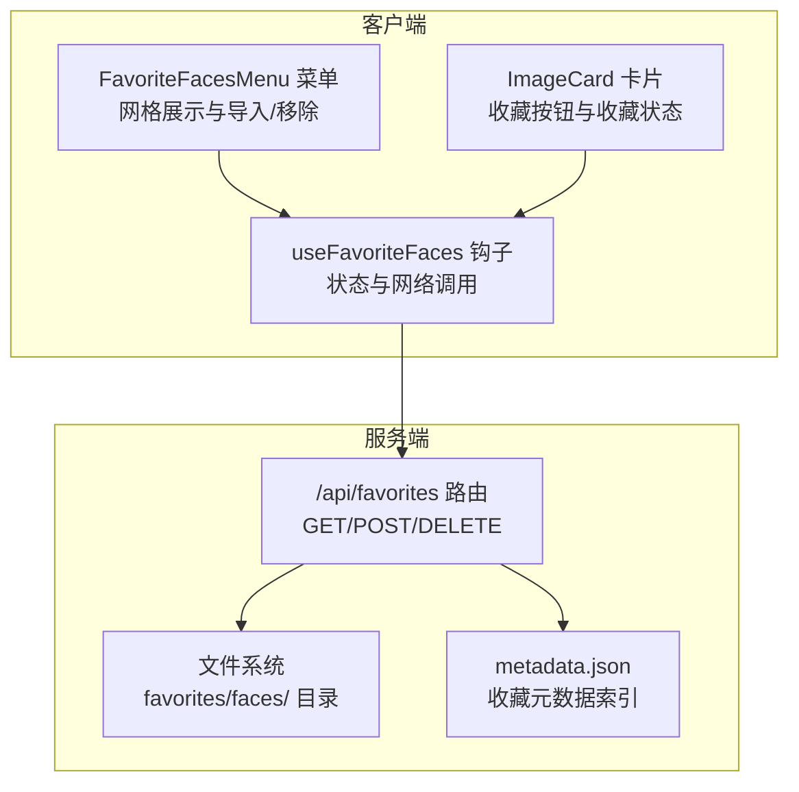
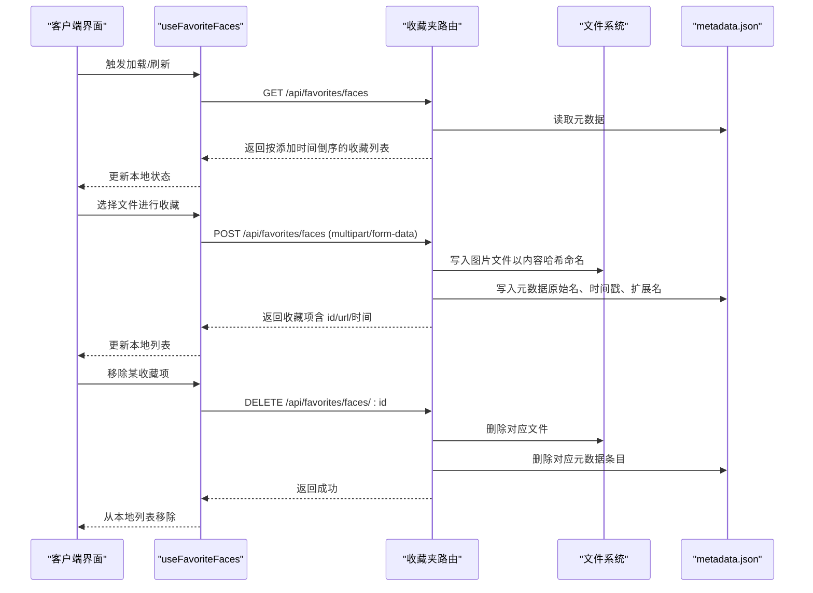
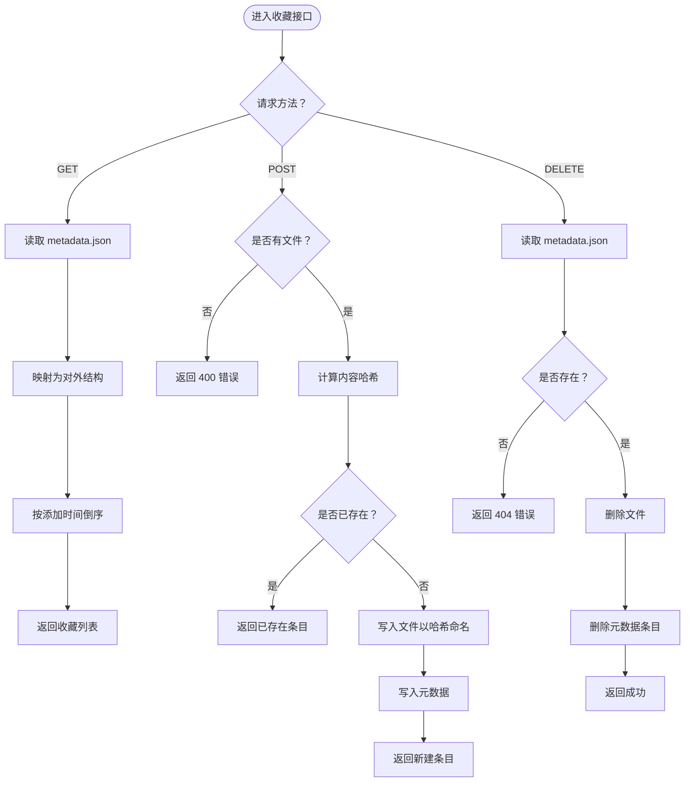
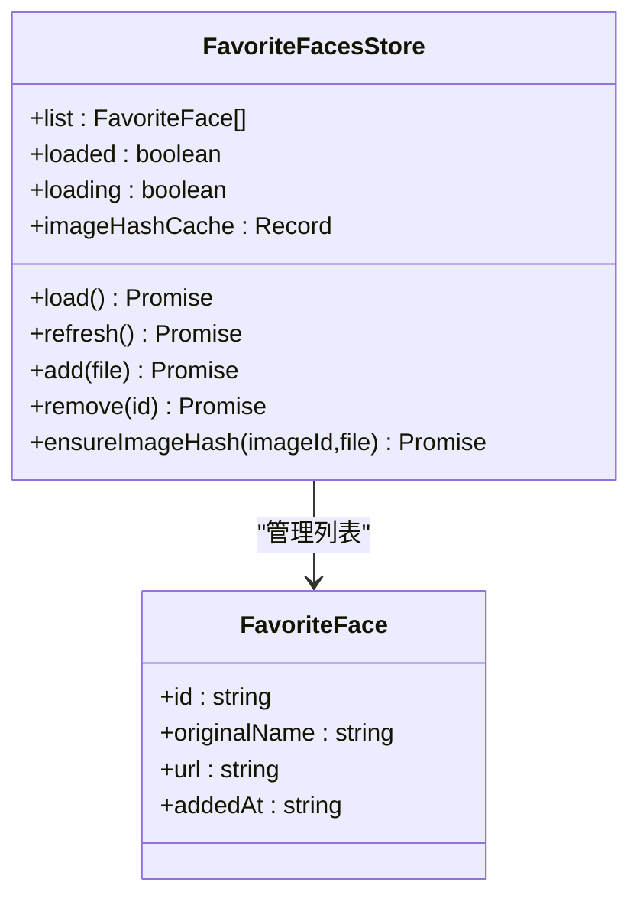
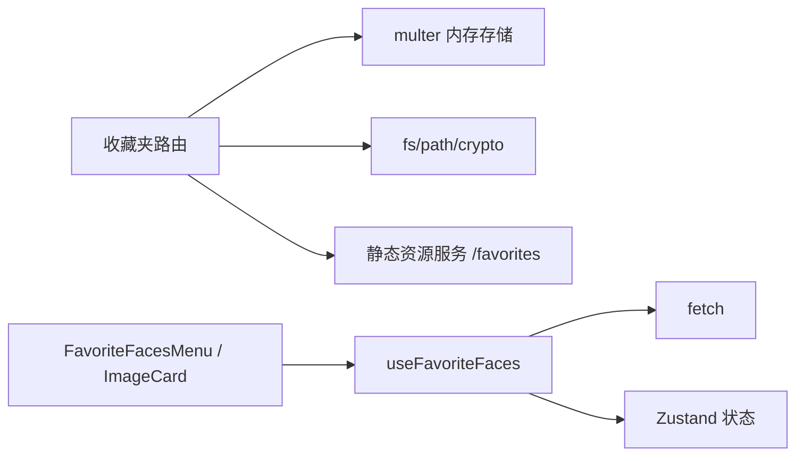

# 收藏夹路由

<cite>
**本文引用的文件**
- [server/src/routes/favorites.ts](file://server/src/routes/favorites.ts)
- [server/src/index.ts](file://server/src/index.ts)
- [client/src/hooks/useFavoriteFaces.ts](file://client/src/hooks/useFavoriteFaces.ts)
- [client/src/components/FavoriteFacesMenu.tsx](file://client/src/components/FavoriteFacesMenu.tsx)
- [client/src/components/ImageCard.tsx](file://client/src/components/ImageCard.tsx)
- [server/src/services/comfyui.ts](file://server/src/services/comfyui.ts)
- [server/src/types/index.ts](file://server/src/types/index.ts)
</cite>

## 目录
1. [简介](#简介)
2. [项目结构](#项目结构)
3. [核心组件](#核心组件)
4. [架构总览](#架构总览)
5. [详细组件分析](#详细组件分析)
6. [依赖分析](#依赖分析)
7. [性能考虑](#性能考虑)
8. [故障排查指南](#故障排查指南)
9. [结论](#结论)
10. [附录](#附录)

## 简介
本文件面向 CorineKit Pix2Real 的“收藏夹”功能，聚焦于收藏夹路由的实现与使用，覆盖以下主题：
- 收藏项的添加、删除、列表获取与排序管理
- 收藏数据的存储结构、索引策略与查询优化
- 收藏夹与工作流、模型及提示词的关联关系
- 收藏夹路由的完整 API 规范，含事务性与并发控制说明
- 收藏夹同步、备份与恢复、性能优化建议

## 项目结构
收藏夹功能由服务端路由与客户端状态/视图共同组成：
- 服务端：Express 路由负责文件与元数据持久化，静态资源服务提供已收藏图片访问
- 客户端：Zustand 状态管理维护收藏列表与去重缓存，React 组件提供收藏菜单与导入入口

图表来源
- [server/src/routes/favorites.ts:1-114](file://server/src/routes/favorites.ts#L1-L114)
- [server/src/index.ts:143-145](file://server/src/index.ts#L143-L145)
- [client/src/hooks/useFavoriteFaces.ts:1-110](file://client/src/hooks/useFavoriteFaces.ts#L1-L110)
- [client/src/components/FavoriteFacesMenu.tsx:1-211](file://client/src/components/FavoriteFacesMenu.tsx#L1-L211)
- [client/src/components/ImageCard.tsx:150-151](file://client/src/components/ImageCard.tsx#L150-L151)

章节来源
- [server/src/routes/favorites.ts:1-114](file://server/src/routes/favorites.ts#L1-L114)
- [server/src/index.ts:143-145](file://server/src/index.ts#L143-L145)
- [client/src/hooks/useFavoriteFaces.ts:1-110](file://client/src/hooks/useFavoriteFaces.ts#L1-L110)
- [client/src/components/FavoriteFacesMenu.tsx:1-211](file://client/src/components/FavoriteFacesMenu.tsx#L1-L211)
- [client/src/components/ImageCard.tsx:150-151](file://client/src/components/ImageCard.tsx#L150-L151)

## 核心组件
- 服务端收藏夹路由
  - 路由挂载：/api/favorites
  - 存储位置：项目根 favorites/faces/，元数据文件 metadata.json
  - 数据模型：以文件内容哈希作为唯一标识，避免重复；元数据包含原始文件名、添加时间、扩展名
  - 接口：
    - GET /api/favorites/faces：返回按添加时间倒序的收藏列表
    - POST /api/favorites/faces：上传二进制图像，自动去重并写入文件与元数据
    - DELETE /api/favorites/faces/:id：按 id 删除文件与元数据
- 客户端收藏夹状态
  - 使用 Zustand 维护列表、加载状态与图片哈希缓存
  - 提供加载、刷新、添加、移除、惰性计算图片哈希等方法
  - UI 组件支持从收藏夹导入到工作流、移除收藏

章节来源
- [server/src/routes/favorites.ts:52-111](file://server/src/routes/favorites.ts#L52-L111)
- [client/src/hooks/useFavoriteFaces.ts:10-109](file://client/src/hooks/useFavoriteFaces.ts#L10-L109)

## 架构总览
收藏夹的前后端交互流程如下：

图表来源
- [server/src/routes/favorites.ts:52-111](file://server/src/routes/favorites.ts#L52-L111)
- [client/src/hooks/useFavoriteFaces.ts:41-97](file://client/src/hooks/useFavoriteFaces.ts#L41-L97)

## 详细组件分析

### 服务端收藏夹路由实现
- 路由定义与中间件
  - 使用 Express Router，multer 内存存储接收二进制文件
  - 初始化时确保收藏目录存在
- 数据模型与序列化
  - 元数据结构包含原始文件名、添加时间、扩展名
  - 元数据以 JSON 文件形式存储，键为文件内容哈希
- 列表获取
  - 读取元数据，映射为对外统一结构，按添加时间倒序
- 添加收藏
  - 计算文件内容哈希作为 id，若已存在则直接返回
  - 写入文件与元数据，扩展名取自原始文件名或默认 png
- 删除收藏
  - 读取元数据，定位文件路径，尝试删除文件，更新元数据

图表来源
- [server/src/routes/favorites.ts:52-111](file://server/src/routes/favorites.ts#L52-L111)

章节来源
- [server/src/routes/favorites.ts:14-111](file://server/src/routes/favorites.ts#L14-L111)

### 客户端收藏夹状态与 UI
- 状态模型
  - 列表、加载状态、是否已加载、图片哈希缓存（imageId → SHA-256）
- 关键方法
  - load/refresh：拉取服务端列表
  - add：上传文件，自动去重，更新本地列表
  - remove：删除收藏，更新本地列表
  - ensureImageHash：惰性计算并缓存图片哈希
- UI 组件
  - FavoriteFacesMenu：收藏夹菜单，支持导入与移除
  - ImageCard：卡片内收藏按钮与收藏状态联动

图表来源
- [client/src/hooks/useFavoriteFaces.ts:3-25](file://client/src/hooks/useFavoriteFaces.ts#L3-L25)

章节来源
- [client/src/hooks/useFavoriteFaces.ts:10-109](file://client/src/hooks/useFavoriteFaces.ts#L10-L109)
- [client/src/components/FavoriteFacesMenu.tsx:12-147](file://client/src/components/FavoriteFacesMenu.tsx#L12-L147)
- [client/src/components/ImageCard.tsx:150-151](file://client/src/components/ImageCard.tsx#L150-L151)

### 收藏夹与工作流、模型、提示词的关联
- 收藏夹与工作流
  - 收藏夹提供图片导入能力：通过收藏菜单将收藏项导入到工作流中进行后续处理
  - 图片导入后可参与工作流执行，进度与输出通过 WebSocket 通道与 ComfyUI 通信
- 收藏夹与模型
  - 收藏图片本身不直接绑定模型；但导入后的生成任务会使用工作流中配置的模型
- 收藏夹与提示词
  - 收藏图片可用于提示词反推等辅助功能，具体行为由工作流侧实现（例如反推提示词接口）

章节来源
- [client/src/components/FavoriteFacesMenu.tsx:134-140](file://client/src/components/FavoriteFacesMenu.tsx#L134-L140)
- [server/src/services/comfyui.ts:168-196](file://server/src/services/comfyui.ts#L168-L196)
- [server/src/types/index.ts:42-51](file://server/src/types/index.ts#L42-L51)

## 依赖分析
- 服务端
  - 路由依赖：multer（内存存储）、fs/path/crypto、静态资源服务
  - 与主程序集成：在服务器入口注册 /api/favorites 与 /favorites 静态目录
- 客户端
  - 依赖：Zustand（状态管理）、fetch（HTTP 请求）、React（组件）
  - 与 UI 集成：收藏菜单、卡片收藏按钮

图表来源
- [server/src/routes/favorites.ts:1-114](file://server/src/routes/favorites.ts#L1-L114)
- [server/src/index.ts:143-145](file://server/src/index.ts#L143-L145)
- [client/src/hooks/useFavoriteFaces.ts:1-110](file://client/src/hooks/useFavoriteFaces.ts#L1-L110)

章节来源
- [server/src/routes/favorites.ts:1-114](file://server/src/routes/favorites.ts#L1-L114)
- [server/src/index.ts:143-145](file://server/src/index.ts#L143-L145)
- [client/src/hooks/useFavoriteFaces.ts:1-110](file://client/src/hooks/useFavoriteFaces.ts#L1-L110)

## 性能考虑
- 存储与索引
  - 采用内容哈希作为文件名与索引键，天然去重，避免重复写入与元数据膨胀
  - 元数据仅包含少量必要字段，JSON 读写成本低
- 查询与排序
  - 列表读取为 O(n) 元数据解析，排序为 O(n log n)，n 为收藏数量
  - 对于大量收藏，可考虑：
    - 引入分页或游标分页
    - 增加按时间范围的筛选参数
    - 将元数据迁移到轻量数据库（如 SQLite）以支持更复杂查询
- 并发与一致性
  - 当前实现为单文件 JSON 顺序读写，无锁机制
  - 并发写入可能导致元数据覆盖或损坏；建议：
    - 使用文件锁或原子写入（先写临时文件再 rename）
    - 对关键路径增加幂等校验（如哈希存在即返回）
- I/O 优化
  - 图片写入使用内存存储，适合中小规模上传；大规模上传建议：
    - 采用流式写入或临时目录 + 后台落盘
    - 增加压缩或格式标准化（如统一 PNG/JPEG）

[本节为通用性能建议，不直接分析特定文件]

## 故障排查指南
- 常见错误与处理
  - 上传无文件：返回 400，检查前端 multipart 表单是否正确构造
  - 删除不存在的 id：返回 404，确认 id 是否来自最新列表
  - 文件删除失败：记录错误日志但不影响元数据更新，检查文件权限与路径
- 并发问题
  - 多实例或多进程同时写入 metadata.json 可能导致竞态
  - 建议：单实例部署或引入分布式锁/队列串行化写入
- 客户端状态不同步
  - 本地列表与服务端不一致：调用 refresh 或重新 load
  - 图片哈希缓存异常：调用 ensureImageHash 重新计算
- 与工作流集成
  - 导入收藏图片后无法生成：检查工作流配置与模型可用性
  - 进度与输出：通过 WebSocket 事件流确认 ComfyUI 状态

章节来源
- [server/src/routes/favorites.ts:64-67](file://server/src/routes/favorites.ts#L64-L67)
- [server/src/routes/favorites.ts:96-98](file://server/src/routes/favorites.ts#L96-L98)
- [client/src/hooks/useFavoriteFaces.ts:41-97](file://client/src/hooks/useFavoriteFaces.ts#L41-L97)

## 结论
- 收藏夹路由以简单高效的方式实现了“内容去重 + 时间排序”的收藏管理
- 客户端通过状态钩子与 UI 组件提供了良好的收藏导入体验
- 当前实现具备基本的并发风险与扩展瓶颈，建议在生产环境引入原子写入与数据库化元数据，以提升可靠性与可扩展性

[本节为总结性内容，不直接分析特定文件]

## 附录

### 收藏夹路由 API 规范
- 基础路径
  - /api/favorites
- 列表获取
  - 方法：GET
  - 路径：/api/favorites/faces
  - 成功响应：数组，元素包含 id、originalName、url、addedAt
  - 排序：addedAt 降序
- 添加收藏
  - 方法：POST
  - 路径：/api/favorites/faces
  - 请求体：multipart/form-data，字段 image 为文件
  - 成功响应：单个收藏项对象（id、originalName、url、addedAt）
  - 去重：若内容哈希已存在，直接返回现有条目
- 删除收藏
  - 方法：DELETE
  - 路径：/api/favorites/faces/:id
  - 成功响应：{ success: true }
  - 404：id 不存在

章节来源
- [server/src/routes/favorites.ts:52-111](file://server/src/routes/favorites.ts#L52-L111)

### 事务性与并发控制
- 事务性
  - 服务端未使用数据库事务；添加/删除为两步操作（写文件 + 写元数据）
- 并发控制
  - 未内置锁；建议：
    - 写入前检查哈希存在性
    - 使用原子写入（临时文件 + rename）
    - 对关键路径增加幂等校验

章节来源
- [server/src/routes/favorites.ts:68-87](file://server/src/routes/favorites.ts#L68-L87)
- [server/src/routes/favorites.ts:92-111](file://server/src/routes/favorites.ts#L92-L111)

### 收藏夹同步、备份与恢复
- 同步
  - 通过 /api/favorites/faces 的列表接口实现客户端与服务端的同步
- 备份
  - 备份 favorites/faces/ 目录与 metadata.json
- 恢复
  - 恢复目录与元数据文件后，重启服务端即可恢复

章节来源
- [server/src/routes/favorites.ts:9-12](file://server/src/routes/favorites.ts#L9-L12)
- [server/src/index.ts:145](file://server/src/index.ts#L145)