# 模型元数据路由

<cite>
**本文档引用的文件**
- [server/src/routes/modelMeta.ts](file://server/src/routes/modelMeta.ts)
- [model_meta/metadata.json](file://model_meta/metadata.json)
- [server/src/services/comfyui.ts](file://server/src/services/comfyui.ts)
- [server/src/types/index.ts](file://server/src/types/index.ts)
- [client/src/hooks/useModelMetadata.ts](file://client/src/hooks/useModelMetadata.ts)
- [server/src/index.ts](file://server/src/index.ts)
- [server/src/scripts/autoFillMetadata.ts](file://server/src/scripts/autoFillMetadata.ts)
- [server/src/config/paths.ts](file://server/src/config/paths.ts)
- [server/src/routes/workflow.ts](file://server/src/routes/workflow.ts)
- [client/vite.config.ts](file://client/vite.config.ts)
</cite>

## 目录
1. [简介](#简介)
2. [项目结构](#项目结构)
3. [核心组件](#核心组件)
4. [架构概览](#架构概览)
5. [详细组件分析](#详细组件分析)
6. [依赖分析](#依赖分析)
7. [性能考虑](#性能考虑)
8. [故障排除指南](#故障排除指南)
9. [结论](#结论)
10. [附录](#附录)

## 简介

CorineKit Pix2Real 的模型元数据路由是一个专门用于管理 AI 模型元数据的 API 系统。该系统提供了完整的模型信息管理功能，包括模型信息的获取、更新和搜索功能。系统支持多种元数据字段，如昵称、触发词、分类、描述、关键词、兼容模型、推荐强度等，并提供了缩略图上传、删除和管理功能。

该路由系统采用 Express.js 构建，使用 JSON 文件作为持久化存储，结合客户端 React Hook 实现响应式的数据管理。系统还集成了 ComfyUI 工作流引擎，实现了模型发现、版本管理和依赖关系处理的技术实现。

## 项目结构

模型元数据路由位于服务器端的路由模块中，与客户端的 React Hook 形成完整的前后端交互体系：

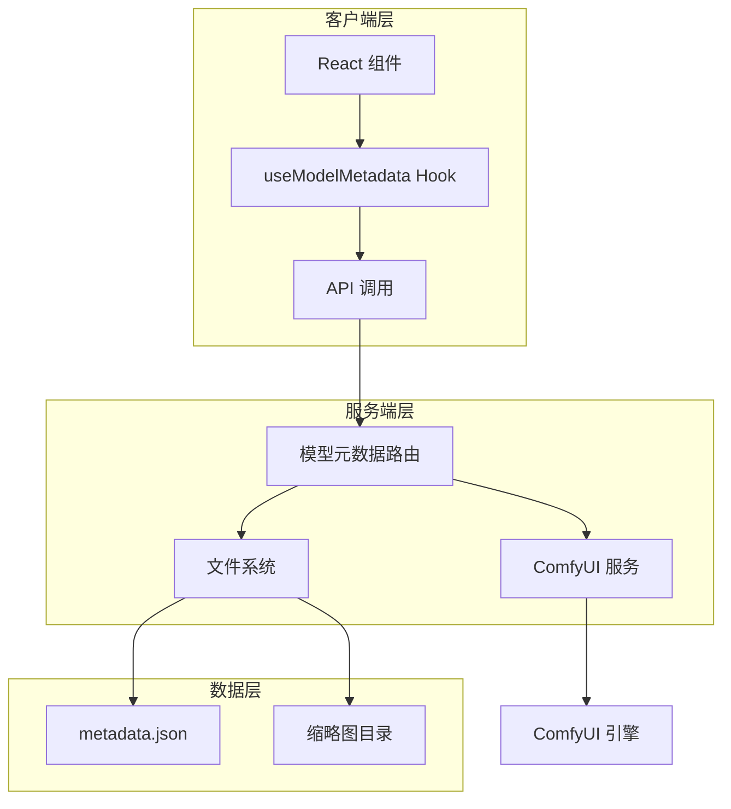

**图表来源**
- [server/src/routes/modelMeta.ts:1-272](file://server/src/routes/modelMeta.ts#L1-L272)
- [client/src/hooks/useModelMetadata.ts:1-254](file://client/src/hooks/useModelMetadata.ts#L1-L254)

**章节来源**
- [server/src/routes/modelMeta.ts:1-272](file://server/src/routes/modelMeta.ts#L1-L272)
- [client/src/hooks/useModelMetadata.ts:1-254](file://client/src/hooks/useModelMetadata.ts#L1-L254)

## 核心组件

### 数据模型结构

模型元数据采用键值对结构，以模型文件路径为键，包含多个元数据字段的对象为值：

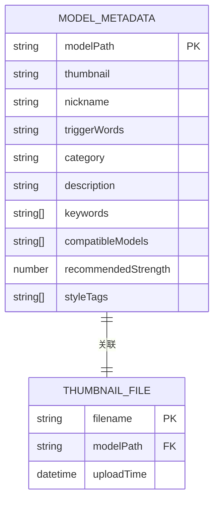

**图表来源**
- [model_meta/metadata.json:1-800](file://model_meta/metadata.json#L1-L800)

### API 接口规范

系统提供以下主要 API 接口：

| 方法 | 路径 | 描述 | 请求体 | 响应 |
|------|------|------|--------|------|
| GET | `/api/models/metadata` | 获取所有模型元数据 | 无 | 元数据对象 |
| POST | `/api/models/metadata/thumbnail` | 上传缩略图 | multipart/form-data | {ok: boolean, thumbnail: string} |
| POST | `/api/models/metadata/nickname` | 设置昵称 | {modelPath: string, nickname: string} | {ok: boolean} |
| DELETE | `/api/models/metadata/thumbnail` | 删除缩略图 | {modelPath: string} | {ok: boolean} |
| DELETE | `/api/models/metadata/nickname` | 删除昵称 | {modelPath: string} | {ok: boolean} |
| POST | `/api/models/metadata/trigger-words` | 设置触发词 | {modelPath: string, triggerWords: string} | {ok: boolean} |
| DELETE | `/api/models/metadata/trigger-words` | 删除触发词 | {modelPath: string} | {ok: boolean} |
| POST | `/api/models/metadata/category` | 设置分类 | {modelPath: string, category: string} | {ok: boolean} |
| DELETE | `/api/models/metadata/category` | 删除分类 | {modelPath: string} | {ok: boolean} |
| PUT | `/api/models/metadata/update` | 批量更新元数据 | {modelPath: string, fields: object} | {ok: boolean} |

**章节来源**
- [server/src/routes/modelMeta.ts:43-269](file://server/src/routes/modelMeta.ts#L43-L269)

## 架构概览

模型元数据路由采用分层架构设计，实现了清晰的关注点分离：

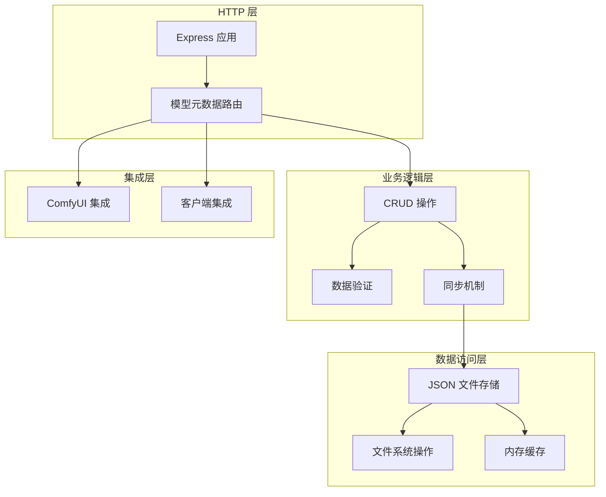

**图表来源**
- [server/src/index.ts:118-145](file://server/src/index.ts#L118-L145)
- [server/src/routes/modelMeta.ts:28-39](file://server/src/routes/modelMeta.ts#L28-L39)

## 详细组件分析

### 路由实现组件

#### 基础 CRUD 操作

路由系统实现了完整的 CRUD 操作，每个操作都有明确的职责分工：

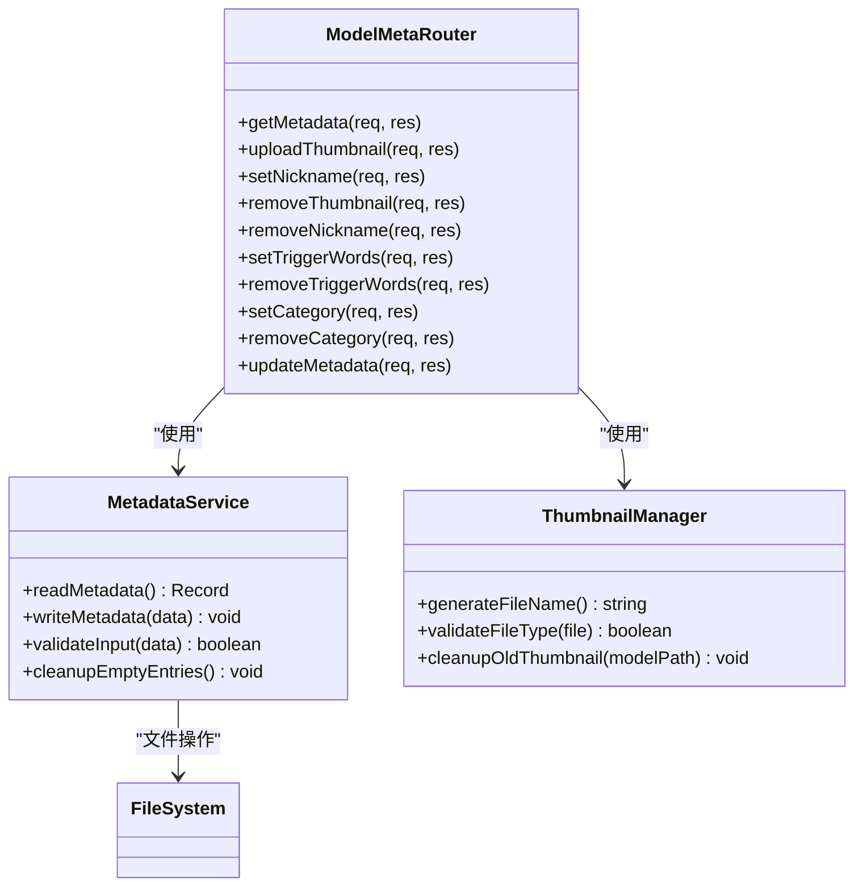

**图表来源**
- [server/src/routes/modelMeta.ts:41-272](file://server/src/routes/modelMeta.ts#L41-L272)

#### 数据验证与清理机制

系统实现了多层次的数据验证和清理机制：

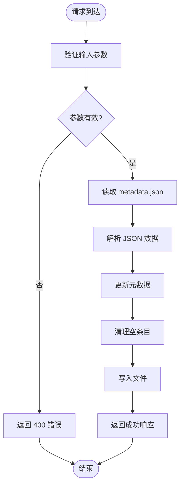

**图表来源**
- [server/src/routes/modelMeta.ts:28-39](file://server/src/routes/modelMeta.ts#L28-L39)

**章节来源**
- [server/src/routes/modelMeta.ts:28-269](file://server/src/routes/modelMeta.ts#L28-L269)

### 客户端集成组件

#### React Hook 实现

客户端使用 React Hook 实现响应式的元数据管理：

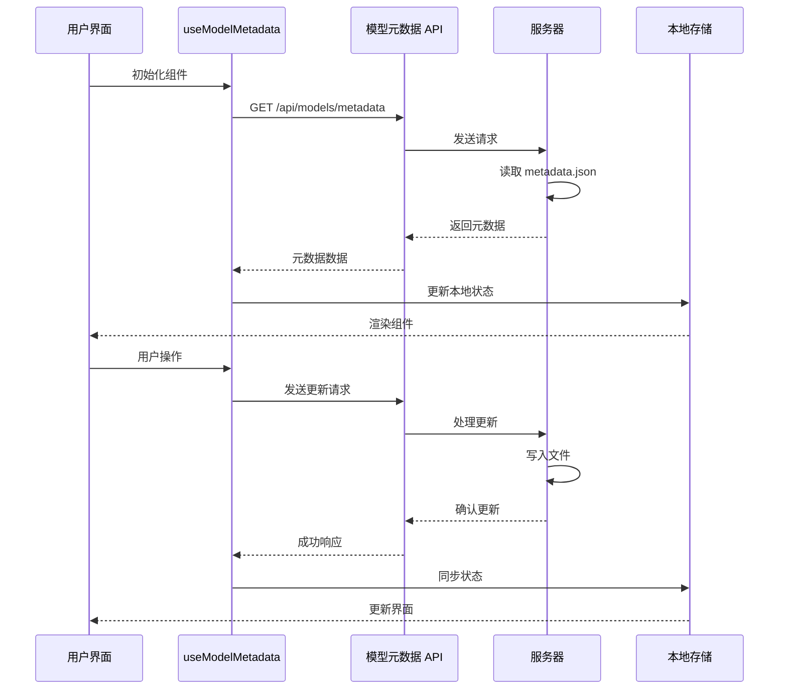

**图表来源**
- [client/src/hooks/useModelMetadata.ts:16-254](file://client/src/hooks/useModelMetadata.ts#L16-L254)

#### 缓存策略

客户端实现了智能的缓存策略，减少不必要的网络请求：

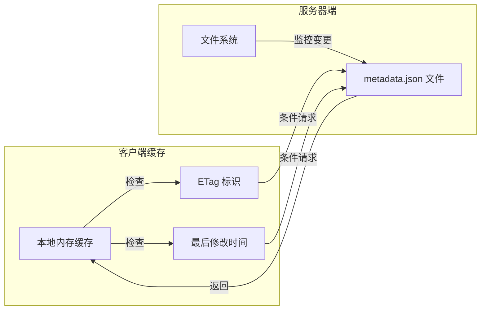

**图表来源**
- [client/src/hooks/useModelMetadata.ts:19-33](file://client/src/hooks/useModelMetadata.ts#L19-L33)

**章节来源**
- [client/src/hooks/useModelMetadata.ts:16-254](file://client/src/hooks/useModelMetadata.ts#L16-L254)

### 数据同步机制

#### 文件系统同步

系统实现了可靠的文件系统同步机制：

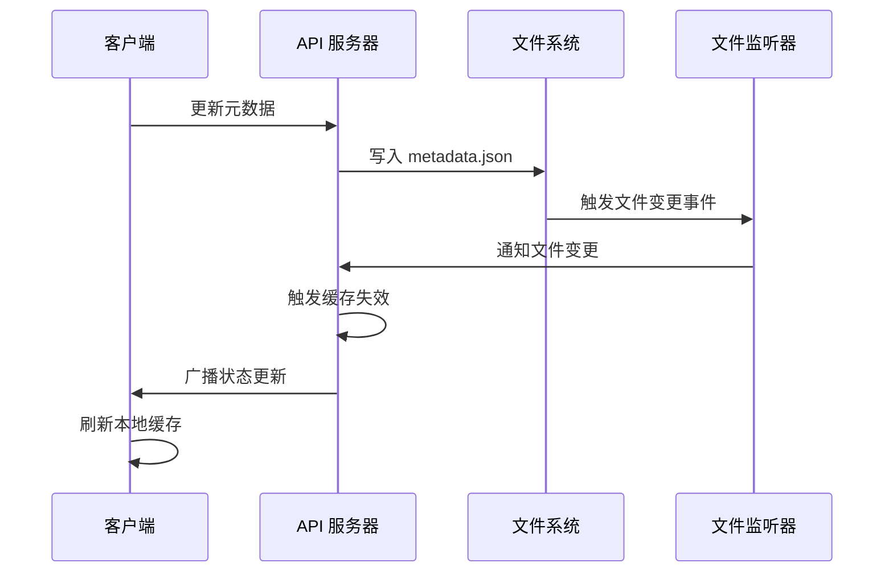

**图表来源**
- [server/src/routes/modelMeta.ts:37-39](file://server/src/routes/modelMeta.ts#L37-L39)

#### 版本控制与冲突解决

系统具备基本的版本控制能力：

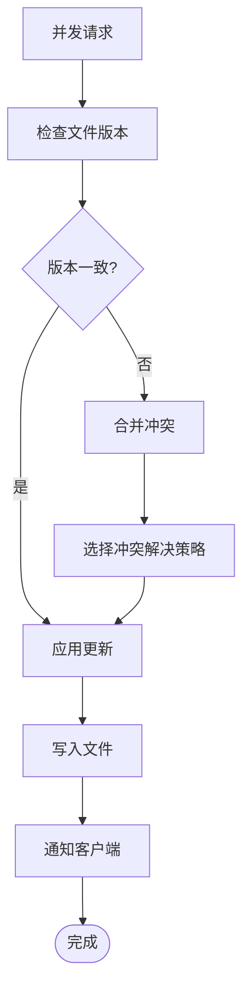

**章节来源**
- [server/src/routes/modelMeta.ts:37-39](file://server/src/routes/modelMeta.ts#L37-L39)

### 模型发现与版本管理

#### 自动模型发现

系统集成了自动模型发现功能：

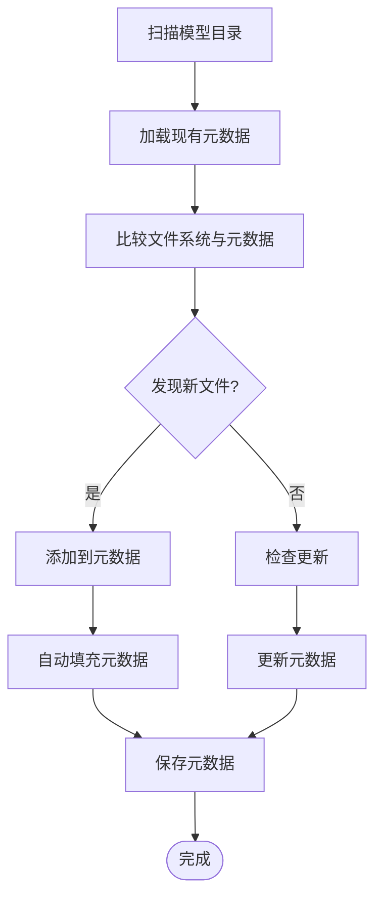

**图表来源**
- [server/src/scripts/autoFillMetadata.ts:200-257](file://server/src/scripts/autoFillMetadata.ts#L200-L257)

#### 版本管理策略

系统实现了智能的版本管理策略：

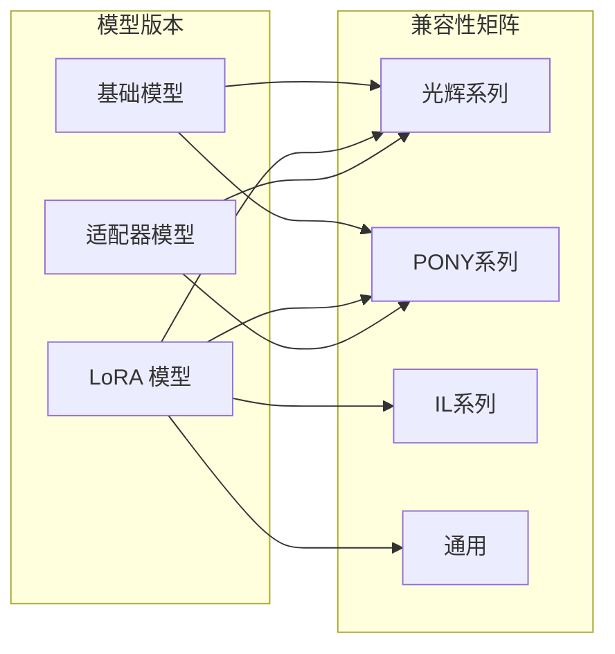

**图表来源**
- [server/src/scripts/autoFillMetadata.ts:127-135](file://server/src/scripts/autoFillMetadata.ts#L127-L135)

**章节来源**
- [server/src/scripts/autoFillMetadata.ts:17-257](file://server/src/scripts/autoFillMetadata.ts#L17-L257)

## 依赖分析

### 外部依赖关系

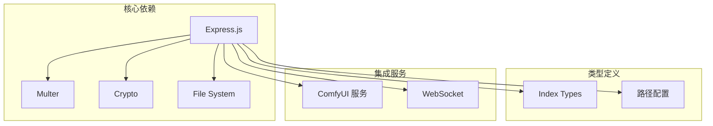

**图表来源**
- [server/src/index.ts:1-516](file://server/src/index.ts#L1-L516)

### 内部模块依赖

系统内部模块之间存在清晰的依赖关系：

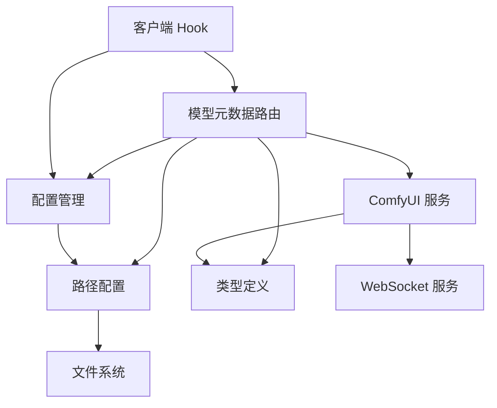

**图表来源**
- [server/src/routes/modelMeta.ts:1-272](file://server/src/routes/modelMeta.ts#L1-L272)

**章节来源**
- [server/src/index.ts:1-516](file://server/src/index.ts#L1-L516)

## 性能考虑

### 缓存策略

系统采用了多层次的缓存策略来优化性能：

1. **客户端缓存**：React Hook 实现本地状态缓存
2. **内存缓存**：服务器端内存中的元数据缓存
3. **文件系统缓存**：操作系统级别的文件系统缓存

### 并发控制

系统实现了基本的并发控制机制：

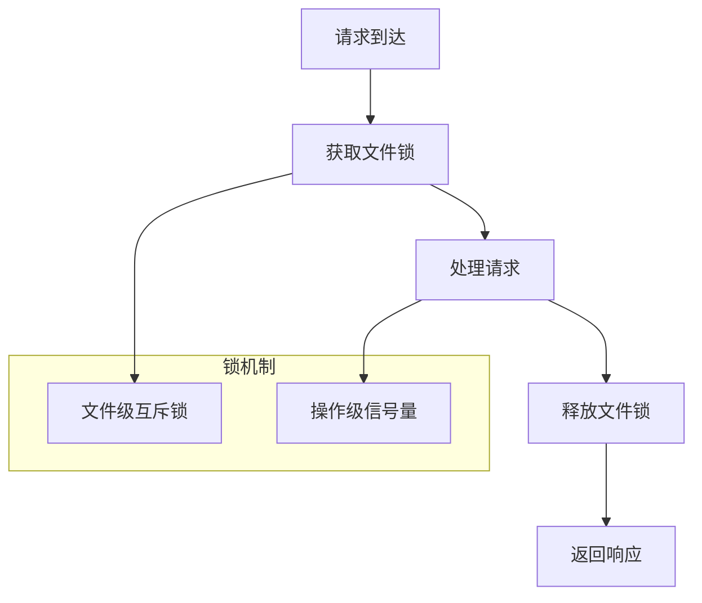

### 性能优化建议

1. **批量操作**：对于频繁的元数据更新，建议使用批量更新接口
2. **缓存失效**：实现更精细的缓存失效策略
3. **异步处理**：对于大型文件上传，考虑异步处理机制
4. **连接池**：优化数据库连接池配置（如果未来引入数据库）

## 故障排除指南

### 常见问题诊断

#### 文件权限问题

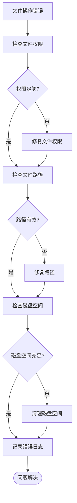

#### 网络连接问题

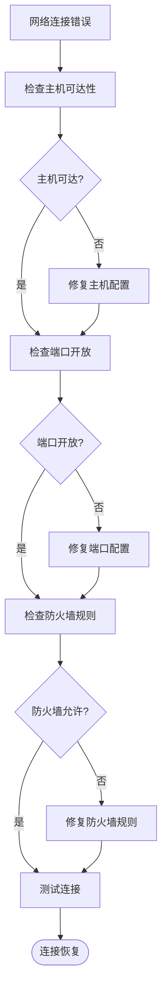

**章节来源**
- [server/src/routes/modelMeta.ts:264-268](file://server/src/routes/modelMeta.ts#L264-L268)

### 日志记录与监控

系统实现了完善的日志记录机制：

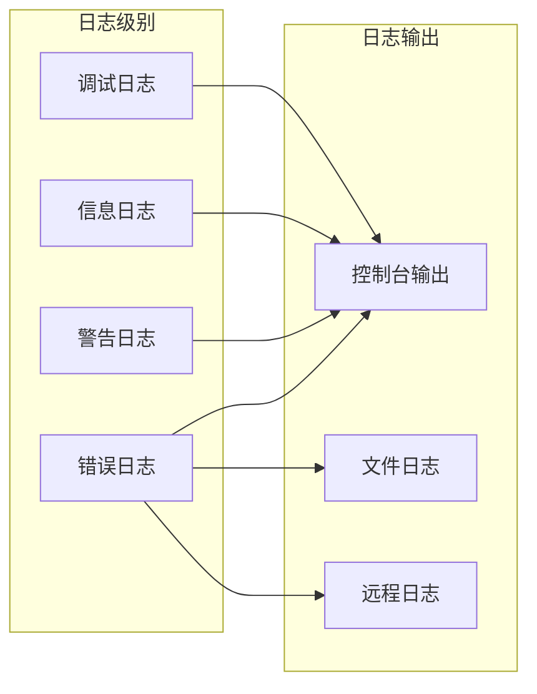

## 结论

CorineKit Pix2Real 的模型元数据路由系统是一个设计良好、功能完整的解决方案。系统具有以下特点：

1. **模块化设计**：清晰的分层架构，职责分离明确
2. **数据完整性**：完善的验证和清理机制
3. **用户体验**：响应式的客户端集成
4. **可扩展性**：支持未来的功能扩展和性能优化
5. **可靠性**：健壮的错误处理和故障恢复机制

该系统为 AI 模型的元数据管理提供了坚实的基础，支持模型发现、版本管理和依赖关系处理等核心功能。通过合理的架构设计和实现策略，系统能够满足当前和未来的需求。

## 附录

### API 使用示例

#### 获取所有模型元数据
```javascript
// 客户端调用示例
const response = await fetch('/api/models/metadata');
const metadata = await response.json();
```

#### 更新模型元数据
```javascript
// 客户端调用示例
const response = await fetch('/api/models/metadata/update', {
  method: 'PUT',
  headers: { 'Content-Type': 'application/json' },
  body: JSON.stringify({
    modelPath: 'path/to/model.safetensors',
    fields: {
      nickname: '新昵称',
      description: '模型描述',
      keywords: ['关键词1', '关键词2']
    }
  })
});
```

### 配置选项

系统支持以下配置选项：

- **模型元数据文件路径**：`model_meta/metadata.json`
- **缩略图存储目录**：`model_meta/thumbnails/`
- **最大文件大小**：默认 50MB
- **支持的文件类型**：JPG, JPEG, PNG, WEBP, GIF
- **缓存策略**：客户端本地缓存 + 服务器端内存缓存

### 扩展建议

1. **数据库迁移**：考虑迁移到数据库以支持更复杂的查询和索引
2. **实时同步**：实现 WebSocket 实现实时元数据同步
3. **版本历史**：添加元数据版本历史记录功能
4. **权限控制**：实现基于角色的访问控制
5. **审计日志**：添加完整的操作审计日志