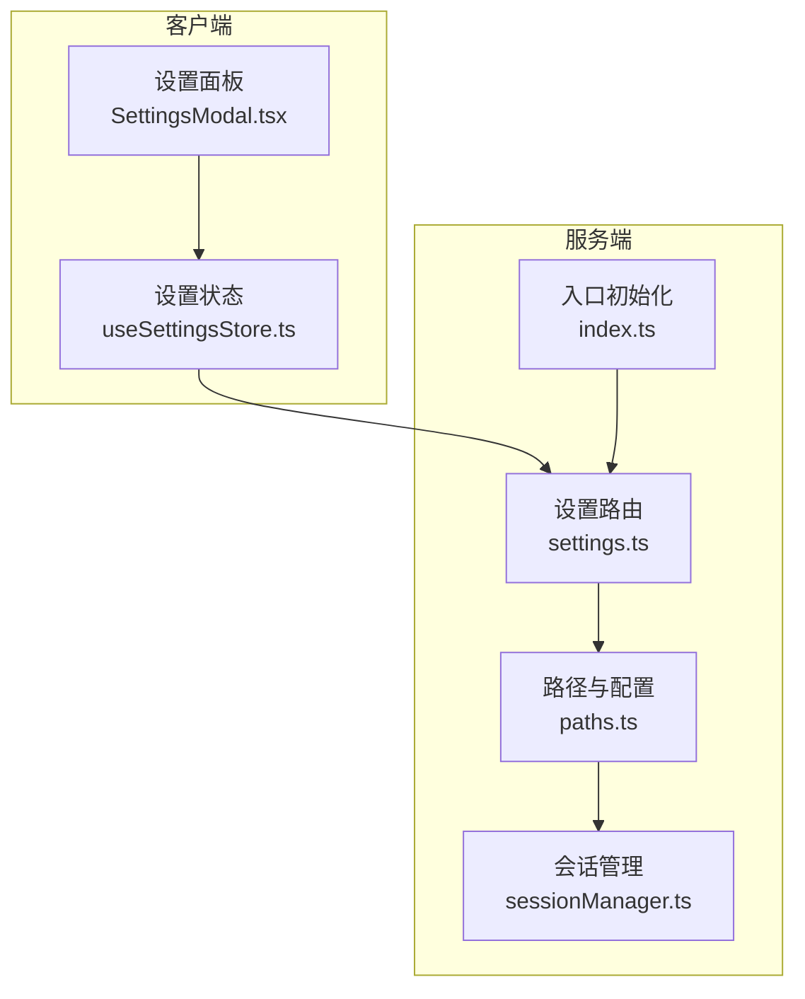
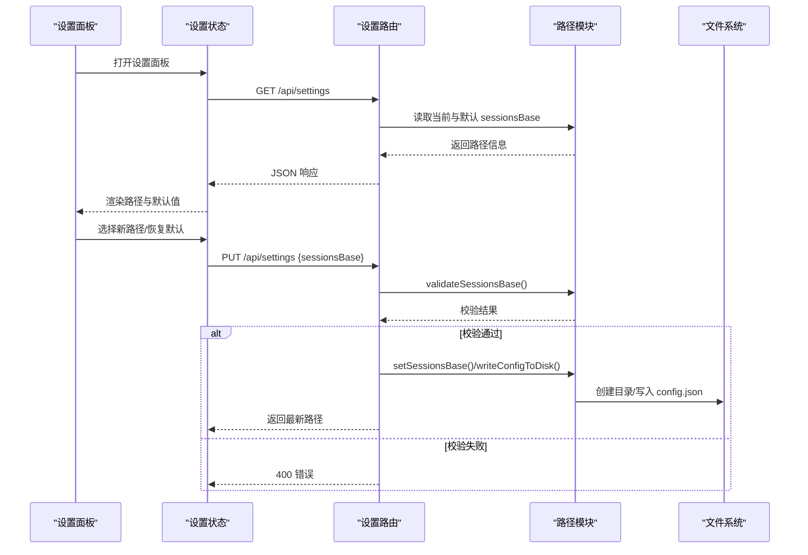
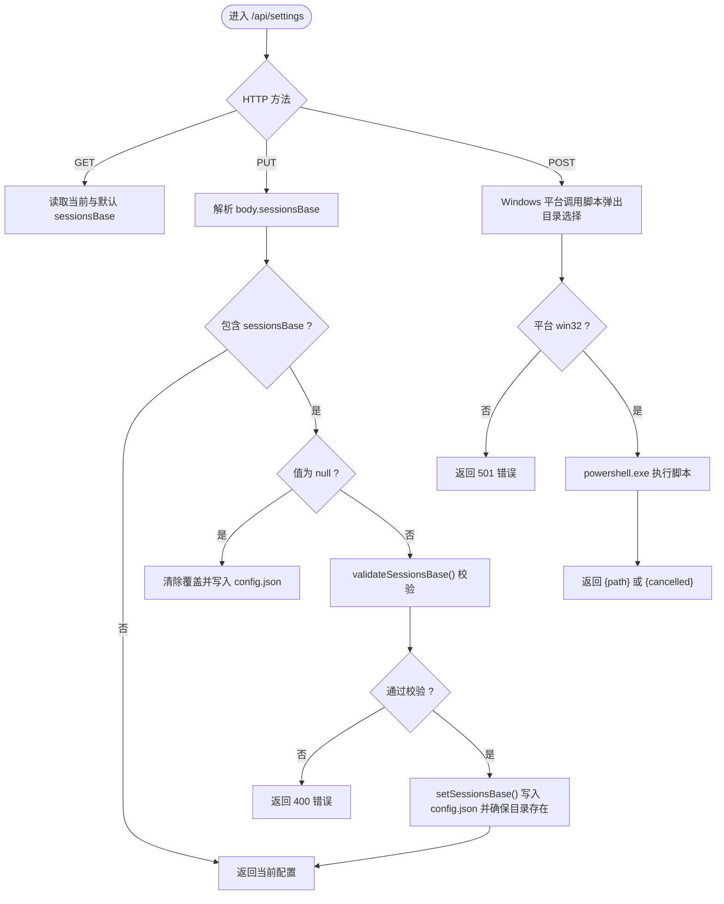
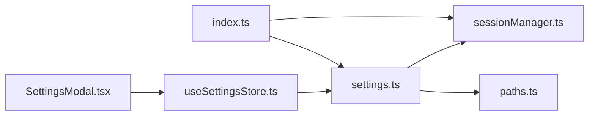

# 设置管理路由

<cite>
**本文引用的文件**
- [settings.ts](file://server/src/routes/settings.ts)
- [paths.ts](file://server/src/config/paths.ts)
- [sessionManager.ts](file://server/src/services/sessionManager.ts)
- [useSettingsStore.ts](file://client/src/hooks/useSettingsStore.ts)
- [SettingsModal.tsx](file://client/src/components/SettingsModal.tsx)
- [index.ts](file://server/src/index.ts)
- [profileService.ts](file://server/src/services/profileService.ts)
</cite>

## 目录
1. [简介](#简介)
2. [项目结构](#项目结构)
3. [核心组件](#核心组件)
4. [架构总览](#架构总览)
5. [详细组件分析](#详细组件分析)
6. [依赖关系分析](#依赖关系分析)
7. [性能考量](#性能考量)
8. [故障排查指南](#故障排查指南)
9. [结论](#结论)
10. [附录](#附录)

## 简介
本文件面向 CorineKit Pix2Real 的“设置管理路由”，系统性阐述应用设置的存储、读取与更新流程，涵盖设置项的数据结构、验证规则与默认值处理，以及分类管理与持久化策略。文档还提供完整的 API 规范（增删改查与批量更新）、设置迁移与版本兼容性建议，以及错误处理最佳实践，帮助开发者与运维人员高效理解与维护设置体系。

## 项目结构
设置管理路由位于后端 Express 路由层，前端通过 Zustand 状态管理与后端交互，形成“前端 UI + 前端状态 + 后端路由 + 文件系统”的闭环。

图表来源
- [settings.ts:1-106](file://server/src/routes/settings.ts#L1-L106)
- [paths.ts:1-156](file://server/src/config/paths.ts#L1-L156)
- [sessionManager.ts:1-539](file://server/src/services/sessionManager.ts#L1-L539)
- [index.ts:102-144](file://server/src/index.ts#L102-L144)

章节来源
- [settings.ts:1-106](file://server/src/routes/settings.ts#L1-L106)
- [paths.ts:1-156](file://server/src/config/paths.ts#L1-L156)
- [index.ts:102-144](file://server/src/index.ts#L102-L144)

## 核心组件
- 后端设置路由：提供读取与更新服务端配置的能力，当前聚焦于 sessionsBase 路径的管理。
- 路径与配置模块：集中管理项目根、数据根、默认 sessionsBase 与覆盖逻辑，负责持久化到 config.json。
- 会话管理模块：提供运行时动态获取 sessionsBase 的能力，确保设置面板切换后即时生效。
- 前端设置状态：Zustand 管理本地 UI 设置与服务端 sessionsBase，封装加载与更新逻辑。
- 设置面板组件：提供 UI 展示与交互，支持浏览目录、恢复默认、确认切换等。

章节来源
- [settings.ts:21-67](file://server/src/routes/settings.ts#L21-L67)
- [paths.ts:24-100](file://server/src/config/paths.ts#L24-L100)
- [sessionManager.ts:1-18](file://server/src/services/sessionManager.ts#L1-L18)
- [useSettingsStore.ts:19-52](file://client/src/hooks/useSettingsStore.ts#L19-L52)
- [SettingsModal.tsx:117-234](file://client/src/components/SettingsModal.tsx#L117-L234)

## 架构总览
设置管理的端到端流程如下：
- 客户端打开设置面板时，从后端读取当前 sessionsBase 与默认路径。
- 用户选择新路径或恢复默认路径，前端发起 PUT 请求更新后端配置。
- 后端进行路径合法性校验，写入 config.json 并确保目录存在。
- 会话相关功能在运行时通过 getSessionsBase 获取最新路径，无需重启。

图表来源
- [settings.ts:21-67](file://server/src/routes/settings.ts#L21-L67)
- [paths.ts:106-137](file://server/src/config/paths.ts#L106-L137)
- [paths.ts:58-66](file://server/src/config/paths.ts#L58-L66)

## 详细组件分析

### 后端设置路由（/api/settings）
- GET /api/settings：返回当前 sessionsBase 与默认 sessionsBase。
- PUT /api/settings：接收 { sessionsBase?: string | null }，支持：
  - 字符串：绝对路径，先校验再写入覆盖。
  - null：清除覆盖，恢复默认路径。
- POST /api/settings/browse-folder：仅 Windows 平台，调用 PowerShell 脚本弹出原生目录选择器，返回用户选择的路径或取消状态。

图表来源
- [settings.ts:21-103](file://server/src/routes/settings.ts#L21-L103)
- [paths.ts:106-137](file://server/src/config/paths.ts#L106-L137)

章节来源
- [settings.ts:21-103](file://server/src/routes/settings.ts#L21-L103)

### 路径与配置模块（paths.ts）
- 数据结构
  - DiskConfig：仅包含 sessionsBase（可选绝对路径）。
  - 运行时：sessionsBaseOverride（覆盖值）与 diskConfig（磁盘配置）。
- 关键函数
  - loadConfigFromDisk()：读取 config.json，解析并设置覆盖值。
  - writeConfigToDisk()：将内存中的 diskConfig 写回 config.json。
  - getSessionsBase()/getDefaultSessionsBase()：返回当前 sessionsBase 或默认路径。
  - setSessionsBase(absOrNull)：设置覆盖值并写入磁盘，确保目录存在。
  - validateSessionsBase(candidate)：校验非空、绝对路径、不可嵌套在 tab-* 子目录、可创建目录且可写。
- 默认值处理
  - 默认 sessionsBase = 项目根/sessions。
  - 未找到 config.json 或字段缺失时，使用默认值。
- 版本兼容性
  - 新增字段时，读取时忽略未知字段，保持向后兼容。
  - 写入时仅写入已知字段，避免破坏旧版本配置。

章节来源
- [paths.ts:24-100](file://server/src/config/paths.ts#L24-L100)
- [paths.ts:106-137](file://server/src/config/paths.ts#L106-L137)

### 会话管理模块（sessionManager.ts）
- 运行时动态获取 sessionsBase：确保设置面板切换后，后续读写均使用新路径。
- 会话目录结构：每个会话包含 tab-0~5 的 input/masks/output 子目录。
- 会话状态持久化：session.json 记录会话元数据与状态。
- 会话文件访问：通过 /api/session-files/{sessionId}/... 动态路由访问 sessionsBase。

章节来源
- [sessionManager.ts:1-18](file://server/src/services/sessionManager.ts#L1-L18)
- [sessionManager.ts:102-133](file://server/src/services/sessionManager.ts#L102-L133)
- [index.ts:137-139](file://server/src/index.ts#L137-L139)

### 前端设置状态（useSettingsStore.ts）
- 状态字段
  - UI 设置：如 reversePromptModel、llmModel、startupBehavior、dropdownMenuStyle、desktopNotifyOnComplete、diceMixPreset、diceRefMode、diceRatioMode、diceContentPolicy、diceTemperature、taskExecutionMode、settingsOpen。
  - 服务端托管设置：sessionsBase、defaultSessionsBase、sessionsPathLoaded。
- 默认值处理
  - 优先从 localStorage 读取，不存在则使用内置默认值。
  - 对部分枚举类型进行边界保护，确保默认值有效。
- 加载与更新
  - loadSessionsPath()：GET /api/settings。
  - updateSessionsPath(value)：PUT /api/settings，返回 {ok:true} 或 {ok:false,error}。

章节来源
- [useSettingsStore.ts:19-83](file://client/src/hooks/useSettingsStore.ts#L19-L83)
- [useSettingsStore.ts:140-176](file://client/src/hooks/useSettingsStore.ts#L140-L176)

### 设置面板组件（SettingsModal.tsx）
- 分类导航：工作流、随机生成、会话、通知、提示词管理、我的偏好。
- 会话路径管理
  - 浏览选择：POST /api/settings/browse-folder，弹出 Windows 目录选择器。
  - 应用并重载：切换后清理本地会话标记并刷新页面。
  - 恢复默认：将 sessionsBase 设为 null，回到默认路径。
- 其他设置项：通过 SegmentedControl 与本地存储联动，实时更新 UI 与本地持久化。

章节来源
- [SettingsModal.tsx:117-234](file://client/src/components/SettingsModal.tsx#L117-L234)
- [SettingsModal.tsx:325-556](file://client/src/components/SettingsModal.tsx#L325-L556)

### 用户偏好画像（profileService.ts）
- 用途：基于 sessionsBase 下的历史生成记录构建用户偏好画像，供 UI 与智能推荐使用。
- 与设置的关系：依赖 sessionsBase 作为数据源根目录，设置变更后，画像统计范围随之变化。
- 数据结构：包含模型偏好、LoRA 偏好、参数偏好、风格特征、使用统计、常用组合等。

章节来源
- [profileService.ts:77-250](file://server/src/services/profileService.ts#L77-L250)

## 依赖关系分析

图表来源
- [settings.ts:1-17](file://server/src/routes/settings.ts#L1-L17)
- [paths.ts:1-13](file://server/src/config/paths.ts#L1-L13)
- [sessionManager.ts:1-7](file://server/src/services/sessionManager.ts#L1-L7)
- [index.ts:14-14](file://server/src/index.ts#L14-L14)
- [useSettingsStore.ts:1-1](file://client/src/hooks/useSettingsStore.ts#L1-L1)
- [SettingsModal.tsx:1-7](file://client/src/components/SettingsModal.tsx#L1-L7)

章节来源
- [index.ts:14-14](file://server/src/index.ts#L14-L14)
- [settings.ts:1-17](file://server/src/routes/settings.ts#L1-L17)

## 性能考量
- 路径校验成本：validateSessionsBase() 包含目录创建与写入探测，建议在用户确认后异步执行，避免阻塞 UI。
- 磁盘写入：setSessionsBase() 每次更新都会写入 config.json，建议合并频繁变更，减少 I/O。
- 会话读写：sessionManager.ts 的 I/O 操作集中在 sessionsBase 目录，确保目录权限正确可显著降低失败率。
- WebSocket 与静态路由：/api/session-files 动态指向 sessionsBase，避免重启即可生效，减少维护成本。

## 故障排查指南
- 400 错误：sessionsBase 校验失败
  - 可能原因：非绝对路径、路径为空、嵌套在 tab-* 子目录、目录不可创建或不可写。
  - 处理建议：检查路径合法性与权限，确保目标目录存在且可写。
- 500 错误：写入 config.json 失败
  - 可能原因：磁盘权限不足、磁盘空间不足、文件被占用。
  - 处理建议：检查文件权限与磁盘空间，关闭占用进程后重试。
- 501 错误：平台不支持原生目录选择
  - 可能原因：非 Windows 平台。
  - 处理建议：在非 Windows 平台上提供替代方案（如自定义对话框）。
- 目录选择器返回 cancelled
  - 可能原因：用户取消选择。
  - 处理建议：提示用户重新选择或保持当前路径不变。
- 切换路径后会话丢失
  - 可能原因：新路径下无历史会话数据。
  - 处理建议：在设置面板提示用户注意迁移，或提供迁移工具。

章节来源
- [settings.ts:33-67](file://server/src/routes/settings.ts#L33-L67)
- [paths.ts:106-137](file://server/src/config/paths.ts#L106-L137)

## 结论
设置管理路由以最小化设计实现了“服务端配置读取与更新 + 前端 UI 交互 + 文件系统持久化”的闭环。当前聚焦于 sessionsBase 路径的管理，具备良好的默认值处理、严格的路径校验与可靠的持久化策略。建议后续扩展更多服务端配置项时，遵循现有模式：集中化配置、严格的校验、最小化的 API 表面、完善的错误处理与版本兼容性保障。

## 附录

### API 规范（设置管理路由）
- GET /api/settings
  - 描述：读取当前服务端配置（sessionsBase 与默认 sessionsBase）。
  - 成功响应：包含 sessionsBase 与 defaultSessionsBase 的 JSON 对象。
  - 错误：无错误码定义，通常为 200 成功。
- PUT /api/settings
  - 描述：更新服务端配置。
  - 请求体：{ sessionsBase?: string | null }
    - 字符串：绝对路径，切换为自定义路径。
    - null：恢复默认路径。
  - 成功响应：返回最新的 sessionsBase 与 defaultSessionsBase。
  - 错误：
    - 400：sessionsBase 必须为字符串或 null；或校验失败（路径非法、不可写等）。
    - 500：写入失败或内部异常。
- POST /api/settings/browse-folder
  - 描述：弹出 Windows 原生目录选择器。
  - 请求体：{ initialPath?: string }（可选，初始路径）。
  - 成功响应：
    - { path: string }：用户选择的路径。
    - { cancelled: true }：用户取消。
  - 错误：
    - 501：非 Windows 平台。
    - 500：脚本执行失败或超时。

章节来源
- [settings.ts:21-103](file://server/src/routes/settings.ts#L21-L103)

### 设置项数据结构与默认值
- 服务端托管设置
  - sessionsBase：当前生效的 sessions 根目录（绝对路径），可为 null（表示使用默认）。
  - defaultSessionsBase：默认 sessions 根目录（绝对路径）。
- 前端 UI 设置（默认值来自本地存储）
  - reversePromptModel：默认 Qwen3VL。
  - llmModel：默认 local。
  - startupBehavior：默认 restore。
  - dropdownMenuStyle：默认 classic。
  - desktopNotifyOnComplete：默认启用。
  - diceMixPreset：默认 balanced。
  - diceRefMode：默认 auto。
  - diceRatioMode：默认 auto。
  - diceContentPolicy：默认 mixed。
  - diceTemperature：默认 medium。
  - taskExecutionMode：默认 manual。
  - settingsOpen：默认 false。

章节来源
- [useSettingsStore.ts:55-83](file://client/src/hooks/useSettingsStore.ts#L55-L83)
- [paths.ts:70-76](file://server/src/config/paths.ts#L70-L76)

### 分类管理与持久化策略
- 分类
  - UI 设置：与界面交互与偏好相关的设置，存储于本地存储，随用户切换而改变。
  - 服务端设置：与应用运行环境相关的设置，当前为 sessionsBase，存储于 config.json。
- 持久化
  - UI 设置：localStorage。
  - 服务端设置：config.json（paths.ts 写入）。
- 生效时机
  - UI 设置即时生效。
  - 服务端设置（sessionsBase）在下次读取时生效，会话相关功能通过 getSessionsBase() 动态获取最新值。

章节来源
- [paths.ts:24-66](file://server/src/config/paths.ts#L24-L66)
- [sessionManager.ts:1-7](file://server/src/services/sessionManager.ts#L1-L7)

### 设置迁移与版本兼容性建议
- 新增字段
  - 读取时忽略未知字段，写入时仅写入已知字段，保证向后兼容。
- 删除字段
  - 读取时忽略，写入时不包含，避免破坏旧版本。
- 字段重命名
  - 提供迁移脚本，读取旧字段并写入新字段，随后删除旧字段。
- 路径迁移
  - 切换 sessionsBase 后，建议提供迁移工具或提示用户手动迁移历史数据。
- 版本控制
  - 在 config.json 中加入版本号字段，升级时根据版本执行迁移逻辑。

章节来源
- [paths.ts:35-56](file://server/src/config/paths.ts#L35-L56)
- [paths.ts:58-66](file://server/src/config/paths.ts#L58-L66)