# 路由系统设计

<cite>
**本文档引用的文件**
- [server/src/index.ts](file://server/src/index.ts)
- [server/src/routes/workflow.ts](file://server/src/routes/workflow.ts)
- [server/src/routes/session.ts](file://server/src/routes/session.ts)
- [server/src/routes/output.ts](file://server/src/routes/output.ts)
- [server/src/routes/agent.ts](file://server/src/routes/agent.ts)
- [server/src/routes/settings.ts](file://server/src/routes/settings.ts)
- [server/src/routes/modelMeta.ts](file://server/src/routes/modelMeta.ts)
- [server/src/routes/favorites.ts](file://server/src/routes/favorites.ts)
- [server/src/services/sessionManager.ts](file://server/src/services/sessionManager.ts)
- [server/src/services/comfyui.ts](file://server/src/services/comfyui.ts)
</cite>

## 目录
1. [简介](#简介)
2. [项目结构概览](#项目结构概览)
3. [核心组件架构](#核心组件架构)
4. [工作流路由系统](#工作流路由系统)
5. [会话管理路由](#会话管理路由)
6. [输出文件路由](#输出文件路由)
7. [AI Agent 路由](#ai-agent-路由)
8. [设置管理路由](#设置管理路由)
9. [模型元数据路由](#模型元数据路由)
10. [收藏夹路由](#收藏夹路由)
11. [错误处理与状态码](#错误处理与状态码)
12. [性能考虑](#性能考虑)
13. [故障排除指南](#故障排除指南)
14. [结论](#结论)

## 简介

CorineKit Pix2Real 是一个基于 ComfyUI 的 AI 图像生成系统，提供了完整的 RESTful API 路由体系。该系统通过精心设计的路由架构，实现了从工作流执行、会话管理到 AI Agent 对话的全方位功能支持。

系统采用模块化设计，每个路由模块负责特定的功能领域，通过统一的错误处理机制和标准化的响应格式，确保了系统的稳定性和可维护性。

## 项目结构概览

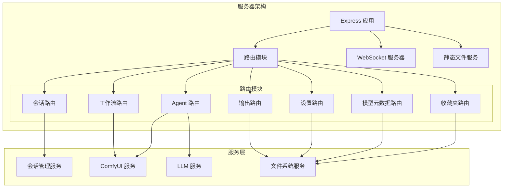
```mermaid
graph TB
subgraph "服务器架构"
A[Express 应用] --> B[路由模块]
A --> C[WebSocket 服务器]
A --> D[静态文件服务]
subgraph "路由模块"
E[工作流路由]
F[会话路由]
G[输出路由]
H[Agent 路由]
I[设置路由]
J[模型元数据路由]
K[收藏夹路由]
end
B --> E
B --> F
B --> G
B --> H
B --> I
B --> J
B --> K
end
subgraph "服务层"
L[会话管理服务]
M[ComfyUI 服务]
N[LLM 服务]
O[文件系统服务]
end
E --> M
F --> L
G --> O
H --> N
H --> M
I --> O
J --> O
K --> O
```

**图表来源**
- [server/src/index.ts:118-145](file://server/src/index.ts#L118-L145)

**章节来源**
- [server/src/index.ts:118-145](file://server/src/index.ts#L118-L145)

## 核心组件架构

### 服务器初始化与中间件

系统使用 Express.js 作为主要的 Web 框架，配置了 CORS 支持、JSON 请求体解析和静态文件服务。

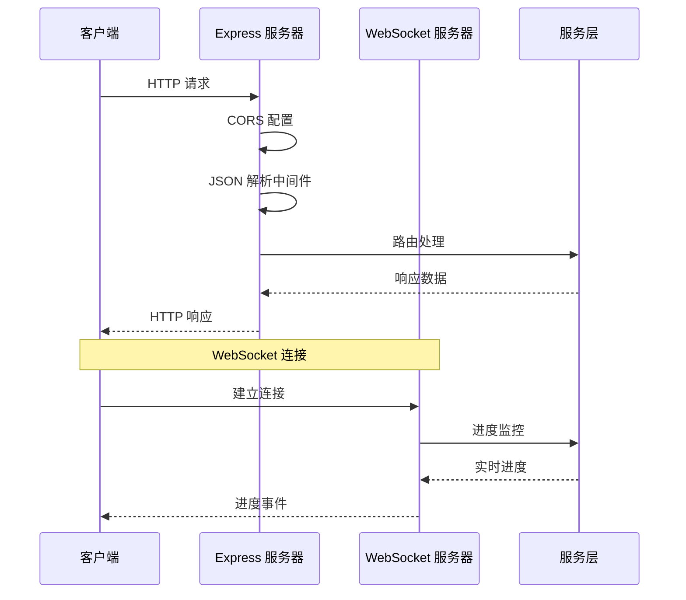
```mermaid
sequenceDiagram
participant Client as 客户端
participant Server as Express 服务器
participant WS as WebSocket 服务器
participant Services as 服务层
Client->>Server : HTTP 请求
Server->>Server : CORS 配置
Server->>Server : JSON 解析中间件
Server->>Services : 路由处理
Services-->>Server : 响应数据
Server-->>Client : HTTP 响应
Note over Client,WS : WebSocket 连接
Client->>WS : 建立连接
WS->>Services : 进度监控
Services-->>WS : 实时进度
WS-->>Client : 进度事件
```

**图表来源**
- [server/src/index.ts:121-159](file://server/src/index.ts#L121-L159)

### WebSocket 进度监控系统

系统实现了强大的 WebSocket 进度监控机制，能够实时跟踪 ComfyUI 工作流的执行进度。

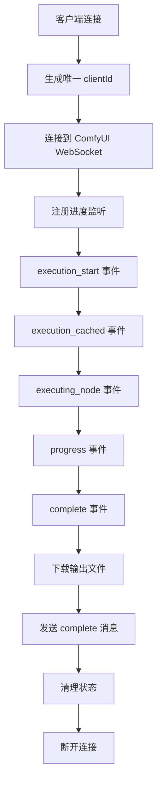
```mermaid
flowchart TD
A[客户端连接] --> B[生成唯一 clientId]
B --> C[连接到 ComfyUI WebSocket]
C --> D[注册进度监听]
D --> E[execution_start 事件]
E --> F[execution_cached 事件]
F --> G[executing_node 事件]
G --> H[progress 事件]
H --> I[complete 事件]
I --> J[下载输出文件]
J --> K[发送 complete 消息]
K --> L[清理状态]
L --> M[断开连接]
```

**图表来源**
- [server/src/index.ts:168-494](file://server/src/index.ts#L168-L494)

**章节来源**
- [server/src/index.ts:121-159](file://server/src/index.ts#L121-L159)
- [server/src/index.ts:168-494](file://server/src/index.ts#L168-L494)

## 工作流路由系统

### 路由概览

工作流路由系统提供了 11 种不同的工作流执行接口，涵盖了从基础的文本到图像生成到复杂的图像处理任务。

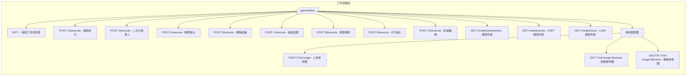
```mermaid
graph LR
subgraph "工作流路由"
A[/api/workflow/] --> B[GET / - 获取工作流列表]
A --> C[POST /:id/execute - 通用执行]
A --> D[POST /0/execute - 二次元转真人]
A --> E[POST /2/execute - 精修放大]
A --> F[POST /5/execute - 解除装备]
A --> G[POST /7/execute - 快速出图]
A --> H[POST /8/execute - 黑兽换脸]
A --> I[POST /9/execute - ZIT快出]
A --> J[POST /10/execute - 区域编辑]
A --> K[GET /models/checkpoints - 模型列表]
A --> L[GET /models/unets - UNET 模型列表]
A --> M[GET /models/loras - LoRA 模型列表]
A --> N[参考图管理]
N --> O[POST /7/ref-image - 上传参考图]
N --> P[GET /7/ref-image/:filename - 获取参考图]
N --> Q[DELETE /7/ref-image/:filename - 删除参考图]
end
```

**图表来源**
- [server/src/routes/workflow.ts:152-799](file://server/src/routes/workflow.ts#L152-L799)

### 工作流执行流程

每个工作流都遵循统一的执行模式：文件上传 → 参数验证 → 模板构建 → ComfyUI 提交 → 响应返回。

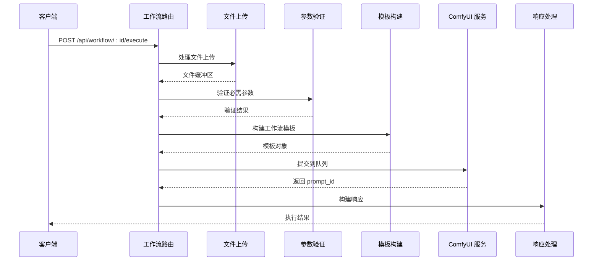
```mermaid
sequenceDiagram
participant Client as 客户端
participant Route as 工作流路由
participant Upload as 文件上传
participant Validate as 参数验证
participant Template as 模板构建
participant ComfyUI as ComfyUI 服务
participant Response as 响应处理
Client->>Route : POST /api/workflow/ : id/execute
Route->>Upload : 处理文件上传
Upload-->>Route : 文件缓冲区
Route->>Validate : 验证必需参数
Validate-->>Route : 验证结果
Route->>Template : 构建工作流模板
Template-->>Route : 模板对象
Route->>ComfyUI : 提交到队列
ComfyUI-->>Route : 返回 prompt_id
Route->>Response : 构建响应
Response-->>Client : 执行结果
```

**图表来源**
- [server/src/routes/workflow.ts:750-799](file://server/src/routes/workflow.ts#L750-L799)

### 参数验证机制

工作流路由实现了多层次的参数验证，确保请求的安全性和有效性。

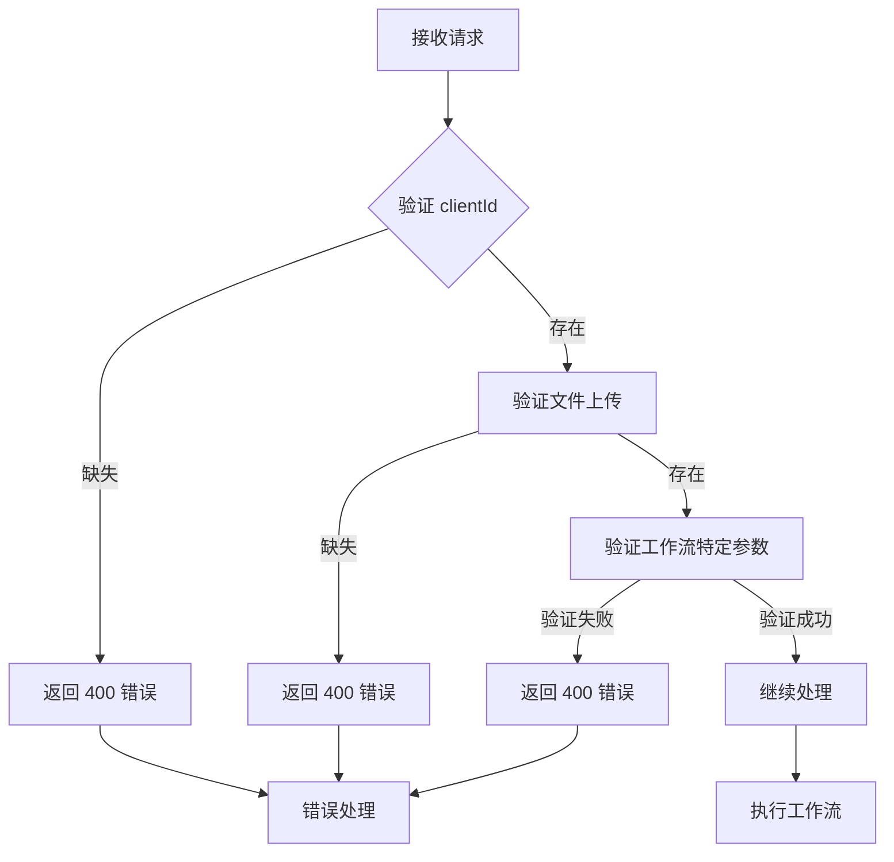
```mermaid
flowchart TD
A[接收请求] --> B{验证 clientId}
B --> |缺失| C[返回 400 错误]
B --> |存在| D[验证文件上传]
D --> |缺失| E[返回 400 错误]
D --> |存在| F[验证工作流特定参数]
F --> |验证失败| G[返回 400 错误]
F --> |验证成功| H[继续处理]
C --> I[错误处理]
E --> I
G --> I
H --> J[执行工作流]
```

**图表来源**
- [server/src/routes/workflow.ts:164-215](file://server/src/routes/workflow.ts#L164-L215)

**章节来源**
- [server/src/routes/workflow.ts:152-799](file://server/src/routes/workflow.ts#L152-L799)

## 会话管理路由

### 会话生命周期管理

会话管理路由提供了完整的会话生命周期管理功能，包括创建、读取、更新、删除和状态同步。

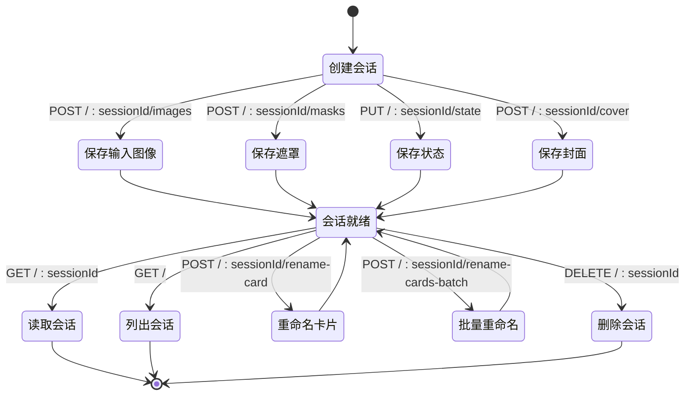
```mermaid
stateDiagram-v2
[*] --> 创建会话
创建会话 --> 保存输入图像 : POST / : sessionId/images
创建会话 --> 保存遮罩 : POST / : sessionId/masks
创建会话 --> 保存状态 : PUT / : sessionId/state
创建会话 --> 保存封面 : POST / : sessionId/cover
保存输入图像 --> 会话就绪
保存遮罩 --> 会话就绪
保存状态 --> 会话就绪
保存封面 --> 会话就绪
会话就绪 --> 读取会话 : GET / : sessionId
会话就绪 --> 列出会话 : GET /
会话就绪 --> 重命名卡片 : POST / : sessionId/rename-card
会话就绪 --> 批量重命名 : POST / : sessionId/rename-cards-batch
读取会话 --> [*]
列出会话 --> [*]
重命名卡片 --> 会话就绪
批量重命名 --> 会话就绪
会话就绪 --> 删除会话 : DELETE / : sessionId
删除会话 --> [*]
```

**图表来源**
- [server/src/routes/session.ts:21-162](file://server/src/routes/session.ts#L21-L162)

### 文件上传与存储

会话管理实现了灵活的文件上传机制，支持多种文件类型的处理和存储。

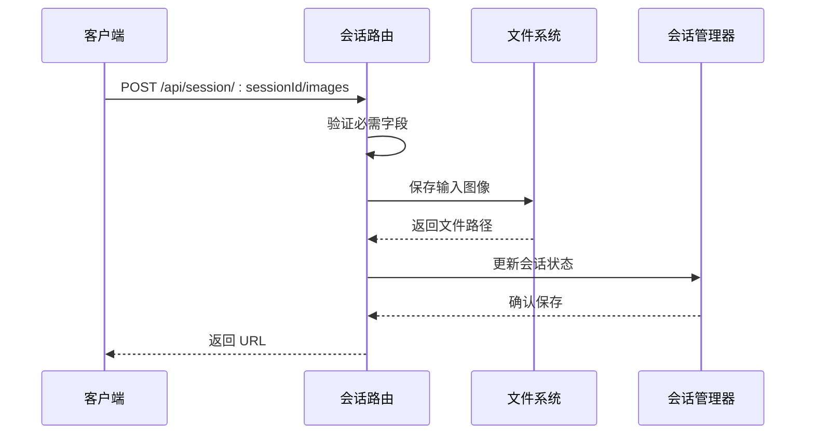
```mermaid
sequenceDiagram
participant Client as 客户端
participant SessionRoute as 会话路由
participant FS as 文件系统
participant SessionManager as 会话管理器
Client->>SessionRoute : POST /api/session/ : sessionId/images
SessionRoute->>SessionRoute : 验证必需字段
SessionRoute->>FS : 保存输入图像
FS-->>SessionRoute : 返回文件路径
SessionRoute->>SessionManager : 更新会话状态
SessionManager-->>SessionRoute : 确认保存
SessionRoute-->>Client : 返回 URL
```

**图表来源**
- [server/src/routes/session.ts:21-36](file://server/src/routes/session.ts#L21-L36)

**章节来源**
- [server/src/routes/session.ts:21-162](file://server/src/routes/session.ts#L21-L162)

## 输出文件路由

### 输出文件管理

输出文件路由提供了对生成文件的统一管理和访问接口。

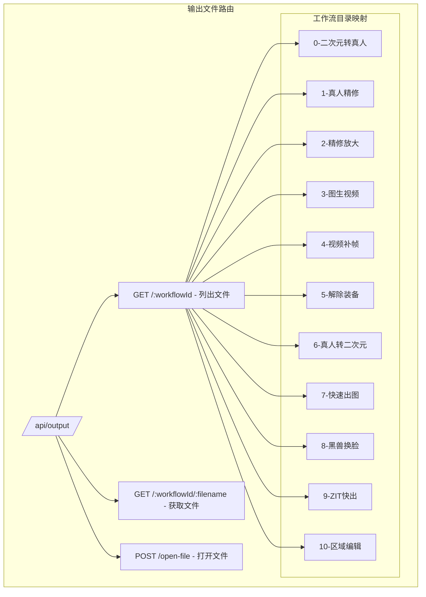
```mermaid
graph TD
subgraph "输出文件路由"
A[/api/output/] --> B[GET /:workflowId - 列出文件]
A --> C[GET /:workflowId/:filename - 获取文件]
A --> D[POST /open-file - 打开文件]
subgraph "工作流目录映射"
E[0-二次元转真人]
F[1-真人精修]
G[2-精修放大]
H[3-图生视频]
I[4-视频补帧]
J[5-解除装备]
K[6-真人转二次元]
L[7-快速出图]
M[8-黑兽换脸]
N[9-ZIT快出]
O[10-区域编辑]
end
B --> E
B --> F
B --> G
B --> H
B --> I
B --> J
B --> K
B --> L
B --> M
B --> N
B --> O
end
```

**图表来源**
- [server/src/routes/output.ts:27-78](file://server/src/routes/output.ts#L27-L78)

### 文件打开功能

系统提供了跨平台的文件打开功能，支持在不同操作系统上使用默认应用程序打开文件。

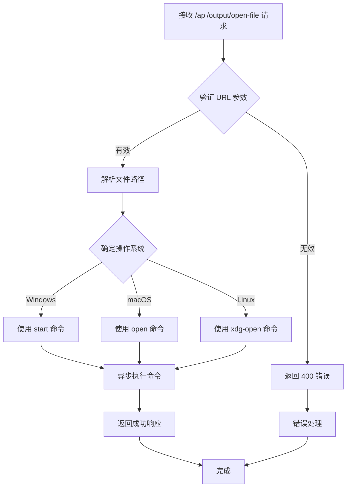
```mermaid
flowchart TD
A[接收 /api/output/open-file 请求] --> B{验证 URL 参数}
B --> |无效| C[返回 400 错误]
B --> |有效| D[解析文件路径]
D --> E{确定操作系统}
E --> |Windows| F[使用 start 命令]
E --> |macOS| G[使用 open 命令]
E --> |Linux| H[使用 xdg-open 命令]
F --> I[异步执行命令]
G --> I
H --> I
I --> J[返回成功响应]
C --> K[错误处理]
J --> L[完成]
K --> L
```

**图表来源**
- [server/src/routes/output.ts:80-136](file://server/src/routes/output.ts#L80-L136)

**章节来源**
- [server/src/routes/output.ts:27-136](file://server/src/routes/output.ts#L27-L136)

## AI Agent 路由

### Agent 系统架构

AI Agent 路由系统实现了智能对话、意图解析和批量随机生成等功能。

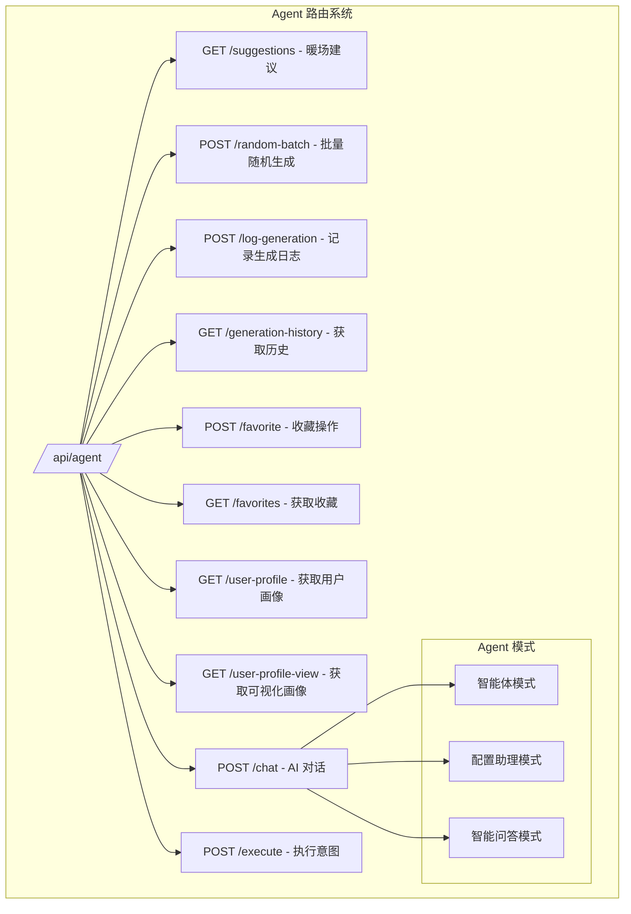
```mermaid
graph TB
subgraph "Agent 路由系统"
A[/api/agent/] --> B[GET /suggestions - 暖场建议]
A --> C[POST /random-batch - 批量随机生成]
A --> D[POST /log-generation - 记录生成日志]
A --> E[GET /generation-history - 获取历史]
A --> F[POST /favorite - 收藏操作]
A --> G[GET /favorites - 获取收藏]
A --> H[GET /user-profile - 获取用户画像]
A --> I[GET /user-profile-view - 获取可视化画像]
A --> J[POST /chat - AI 对话]
A --> K[POST /execute - 执行意图]
subgraph "Agent 模式"
L[智能体模式]
M[配置助理模式]
N[智能问答模式]
end
J --> L
J --> M
J --> N
end
```

**图表来源**
- [server/src/routes/agent.ts:613-1737](file://server/src/routes/agent.ts#L613-L1737)

### 智能对话流程

Agent 的对话系统支持多种模式，通过统一的接口处理不同的对话场景。

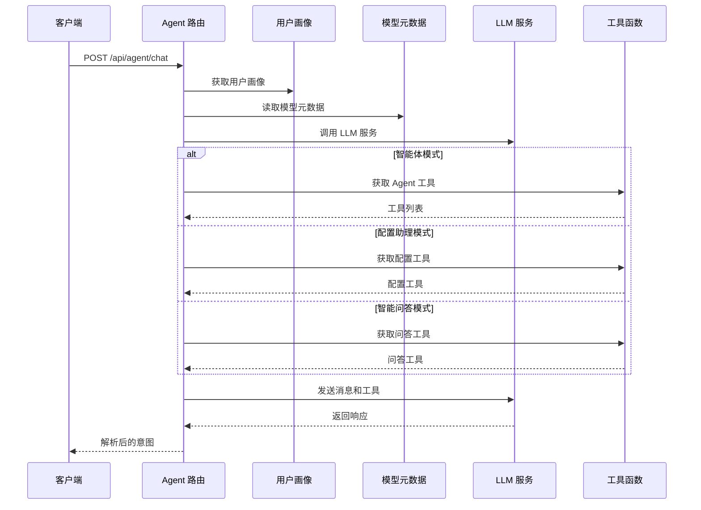
```mermaid
sequenceDiagram
participant Client as 客户端
participant AgentRoute as Agent 路由
participant Profile as 用户画像
participant Metadata as 模型元数据
participant LLM as LLM 服务
participant Tools as 工具函数
Client->>AgentRoute : POST /api/agent/chat
AgentRoute->>Profile : 获取用户画像
AgentRoute->>Metadata : 读取模型元数据
AgentRoute->>LLM : 调用 LLM 服务
alt 智能体模式
AgentRoute->>Tools : 获取 Agent 工具
Tools-->>AgentRoute : 工具列表
else 配置助理模式
AgentRoute->>Tools : 获取配置工具
Tools-->>AgentRoute : 配置工具
else 智能问答模式
AgentRoute->>Tools : 获取问答工具
Tools-->>AgentRoute : 问答工具
end
AgentRoute->>LLM : 发送消息和工具
LLM-->>AgentRoute : 返回响应
AgentRoute-->>Client : 解析后的意图
```

**图表来源**
- [server/src/routes/agent.ts:1317-1737](file://server/src/routes/agent.ts#L1317-L1737)

### 批量随机生成

系统提供了强大的批量随机生成功能，支持三种不同的档位策略。

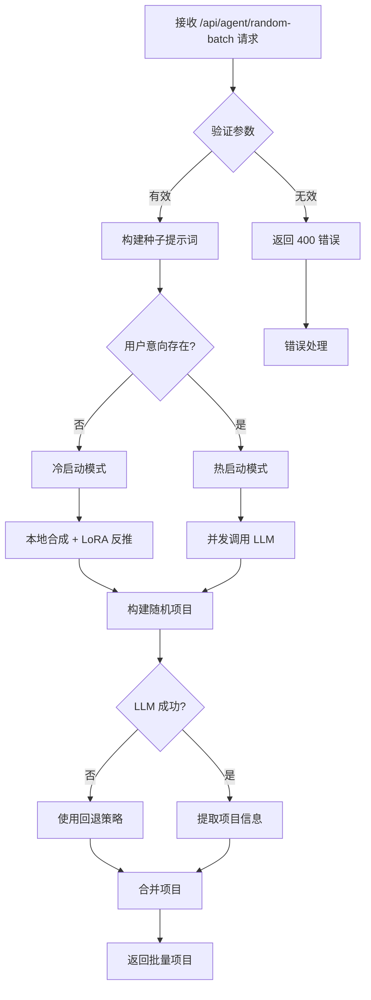
```mermaid
flowchart TD
A[接收 /api/agent/random-batch 请求] --> B{验证参数}
B --> |无效| C[返回 400 错误]
B --> |有效| D[构建种子提示词]
D --> E{用户意向存在?}
E --> |否| F[冷启动模式]
E --> |是| G[热启动模式]
F --> H[本地合成 + LoRA 反推]
G --> I[并发调用 LLM]
H --> J[构建随机项目]
I --> J
J --> K{LLM 成功?}
K --> |否| L[使用回退策略]
K --> |是| M[提取项目信息]
L --> N[合并项目]
M --> N
N --> O[返回批量项目]
C --> P[错误处理]
```

**图表来源**
- [server/src/routes/agent.ts:1026-1161](file://server/src/routes/agent.ts#L1026-L1161)

**章节来源**
- [server/src/routes/agent.ts:613-1737](file://server/src/routes/agent.ts#L613-L1737)

## 设置管理路由

### 设置系统架构

设置管理路由提供了对服务器配置的集中管理功能。

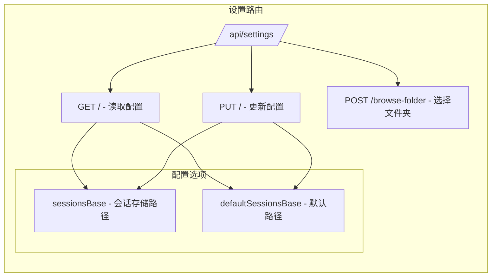
```mermaid
graph LR
subgraph "设置路由"
A[/api/settings/] --> B[GET / - 读取配置]
A --> C[PUT / - 更新配置]
A --> D[POST /browse-folder - 选择文件夹]
subgraph "配置选项"
E[sessionsBase - 会话存储路径]
F[defaultSessionsBase - 默认路径]
end
B --> E
B --> F
C --> E
C --> F
end
```

**图表来源**
- [server/src/routes/settings.ts:21-105](file://server/src/routes/settings.ts#L21-L105)

### 文件夹选择功能

系统提供了跨平台的文件夹选择功能，支持 Windows 平台的原生对话框。

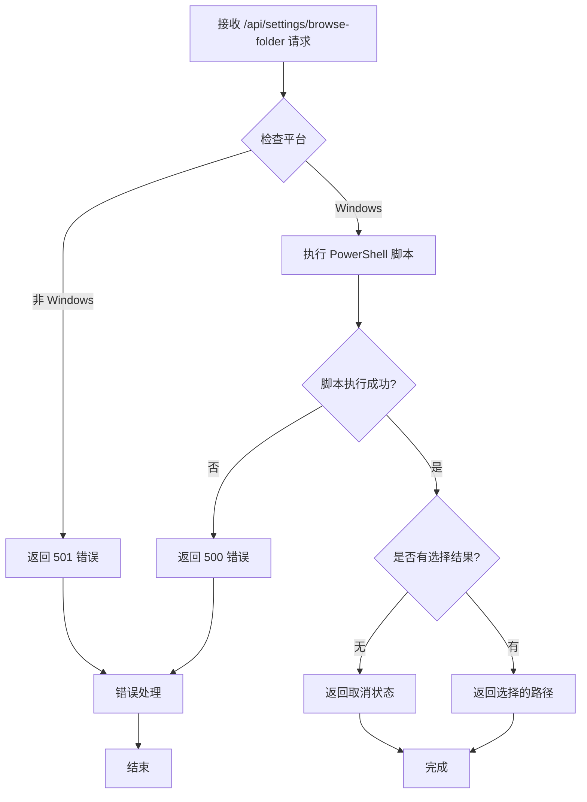
```mermaid
flowchart TD
A[接收 /api/settings/browse-folder 请求] --> B{检查平台}
B --> |非 Windows| C[返回 501 错误]
B --> |Windows| D[执行 PowerShell 脚本]
D --> E{脚本执行成功?}
E --> |否| F[返回 500 错误]
E --> |是| G{是否有选择结果?}
G --> |无| H[返回取消状态]
G --> |有| I[返回选择的路径]
C --> J[错误处理]
F --> J
H --> K[完成]
I --> K
J --> L[结束]
```

**图表来源**
- [server/src/routes/settings.ts:69-103](file://server/src/routes/settings.ts#L69-L103)

**章节来源**
- [server/src/routes/settings.ts:21-105](file://server/src/routes/settings.ts#L21-L105)

## 模型元数据路由

### 元数据管理系统

模型元数据路由提供了对模型信息的完整管理功能，包括缩略图、昵称、触发词和分类等。

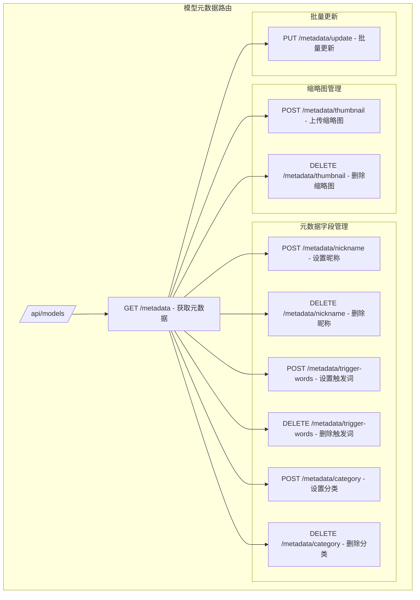
```mermaid
graph TB
subgraph "模型元数据路由"
A[/api/models/] --> B[GET /metadata - 获取元数据]
subgraph "缩略图管理"
C[POST /metadata/thumbnail - 上传缩略图]
D[DELETE /metadata/thumbnail - 删除缩略图]
end
subgraph "元数据字段管理"
E[POST /metadata/nickname - 设置昵称]
F[DELETE /metadata/nickname - 删除昵称]
G[POST /metadata/trigger-words - 设置触发词]
H[DELETE /metadata/trigger-words - 删除触发词]
I[POST /metadata/category - 设置分类]
J[DELETE /metadata/category - 删除分类]
end
subgraph "批量更新"
K[PUT /metadata/update - 批量更新]
end
B --> C
B --> D
B --> E
B --> F
B --> G
B --> H
B --> I
B --> J
B --> K
end
```

**图表来源**
- [server/src/routes/modelMeta.ts:43-271](file://server/src/routes/modelMeta.ts#L43-L271)

### 元数据存储结构

系统使用 JSON 文件存储模型元数据，支持多种元数据字段的管理。

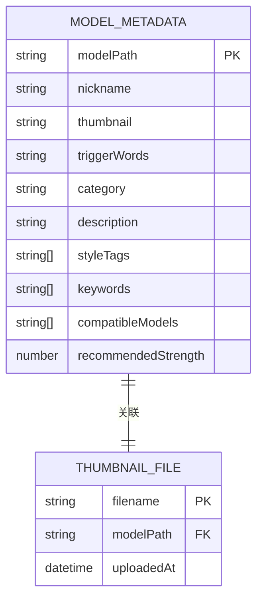
```mermaid
erDiagram
MODEL_METADATA {
string modelPath PK
string nickname
string thumbnail
string triggerWords
string category
string description
string[] styleTags
string[] keywords
string[] compatibleModels
number recommendedStrength
}
THUMBNAIL_FILE {
string filename PK
string modelPath FK
datetime uploadedAt
}
MODEL_METADATA ||--|| THUMBNAIL_FILE : "关联"
```

**图表来源**
- [server/src/routes/modelMeta.ts:28-39](file://server/src/routes/modelMeta.ts#L28-L39)

**章节来源**
- [server/src/routes/modelMeta.ts:43-271](file://server/src/routes/modelMeta.ts#L43-L271)

## 收藏夹路由

### 收藏夹系统

收藏夹路由提供了对用户收藏内容的管理功能，特别是人脸收藏功能。

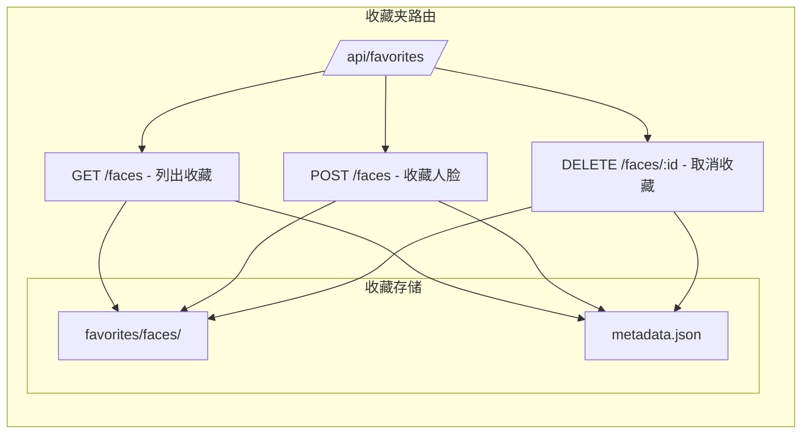
```mermaid
graph LR
subgraph "收藏夹路由"
A[/api/favorites/] --> B[GET /faces - 列出收藏]
A --> C[POST /faces - 收藏人脸]
A --> D[DELETE /faces/:id - 取消收藏]
subgraph "收藏存储"
E[favorites/faces/]
F[metadata.json]
end
B --> E
B --> F
C --> E
C --> F
D --> E
D --> F
end
```

**图表来源**
- [server/src/routes/favorites.ts:52-111](file://server/src/routes/favorites.ts#L52-L111)

### 人脸收藏机制

系统使用 SHA-256 哈希作为唯一标识符，确保收藏内容的去重和唯一性。

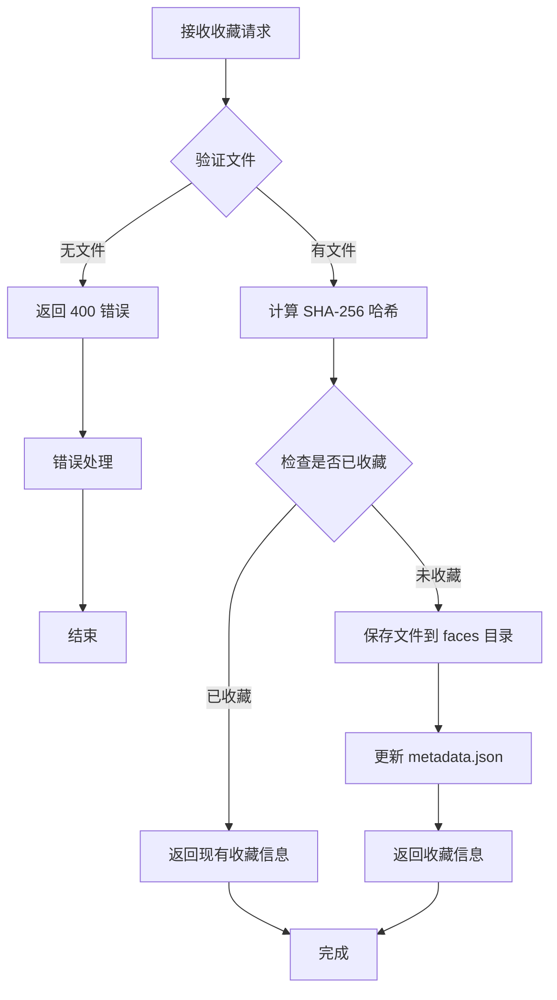
```mermaid
flowchart TD
A[接收收藏请求] --> B{验证文件}
B --> |无文件| C[返回 400 错误]
B --> |有文件| D[计算 SHA-256 哈希]
D --> E{检查是否已收藏}
E --> |已收藏| F[返回现有收藏信息]
E --> |未收藏| G[保存文件到 faces 目录]
G --> H[更新 metadata.json]
H --> I[返回收藏信息]
C --> J[错误处理]
F --> K[完成]
I --> K
J --> L[结束]
```

**图表来源**
- [server/src/routes/favorites.ts:62-89](file://server/src/routes/favorites.ts#L62-L89)

**章节来源**
- [server/src/routes/favorites.ts:52-111](file://server/src/routes/favorites.ts#L52-L111)

## 错误处理与状态码

### 统一错误处理机制

系统实现了统一的错误处理机制，确保所有路由都能提供一致的错误响应格式。

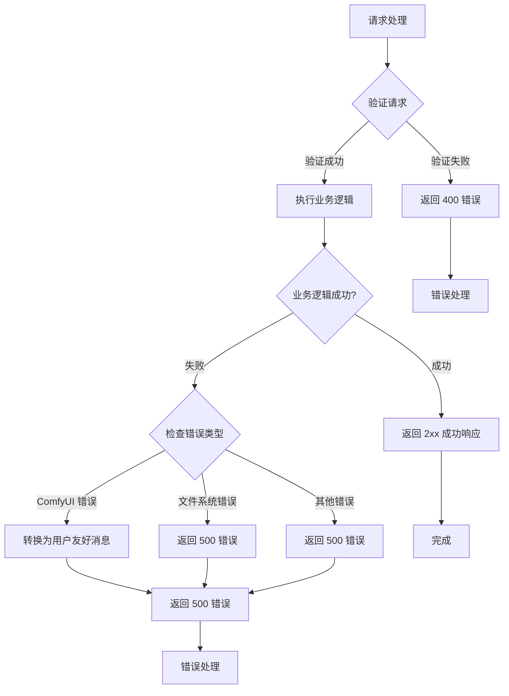
```mermaid
flowchart TD
A[请求处理] --> B{验证请求}
B --> |验证失败| C[返回 400 错误]
B --> |验证成功| D[执行业务逻辑]
D --> E{业务逻辑成功?}
E --> |成功| F[返回 2xx 成功响应]
E --> |失败| G{检查错误类型}
G --> |ComfyUI 错误| H[转换为用户友好消息]
G --> |文件系统错误| I[返回 500 错误]
G --> |其他错误| J[返回 500 错误]
H --> K[返回 500 错误]
I --> K
J --> K
C --> L[错误处理]
F --> M[完成]
K --> N[错误处理]
```

**图表来源**
- [server/src/routes/workflow.ts:126-150](file://server/src/routes/workflow.ts#L126-L150)

### 错误响应格式

所有错误响应都遵循统一的 JSON 格式，包含详细的错误信息。

| 状态码 | 描述 | 响应格式 |
|--------|------|----------|
| 200 | 成功 | `{ ok: true }` 或 `{ success: true }` |
| 400 | 请求参数错误 | `{ error: "错误描述" }` |
| 404 | 资源未找到 | `{ error: "错误描述" }` |
| 500 | 服务器内部错误 | `{ error: "错误描述" }` |
| 501 | 功能未实现 | `{ error: "错误描述" }` |

**章节来源**
- [server/src/routes/workflow.ts:126-150](file://server/src/routes/workflow.ts#L126-L150)

## 性能考虑

### WebSocket 进度优化

系统通过 WebSocket 实现实时进度监控，采用了多种优化策略：

1. **事件缓冲机制**：在客户端连接之前捕获的进度事件会被缓冲，确保客户端连接后能收到完整的进度信息
2. **权重化进度计算**：基于节点类型和执行步骤计算权重，提供更准确的全局进度
3. **多轮场景支持**：支持 tiled sampler 等多轮执行场景的进度追踪

### 文件上传优化

工作流路由实现了高效的文件上传处理：

1. **内存存储**：使用 multer 的内存存储策略，减少磁盘 I/O
2. **文件类型验证**：严格的文件类型验证，防止恶意文件上传
3. **尺寸限制**：合理的文件大小限制，平衡质量与性能

### 缓存策略

Agent 路由实现了元数据缓存机制：

- **缓存 TTL**：元数据缓存 1 分钟，平衡新鲜度与性能
- **按需加载**：只有在需要时才读取和解析元数据文件

## 故障排除指南

### 常见问题诊断

#### ComfyUI 连接问题

**症状**：工作流执行失败，返回 "Queue prompt failed" 错误

**解决方案**：
1. 检查 ComfyUI 服务是否正常运行
2. 验证 ComfyUI URL 配置是否正确
3. 确认防火墙设置允许本地连接

#### 文件上传失败

**症状**：上传文件时返回 500 错误

**解决方案**：
1. 检查磁盘空间是否充足
2. 验证文件权限设置
3. 确认文件大小未超过限制

#### WebSocket 连接中断

**症状**：进度监控中断，无法获取实时进度

**解决方案**：
1. 检查网络连接稳定性
2. 验证 WebSocket 端口是否被防火墙阻止
3. 确认客户端与服务器的时间同步

### 日志分析

系统提供了详细的日志记录，有助于问题诊断：

- **服务器启动日志**：显示服务器配置和启动状态
- **路由处理日志**：记录每个请求的处理过程
- **WebSocket 事件日志**：跟踪进度事件的传递
- **错误日志**：记录异常情况和错误详情

**章节来源**
- [server/src/routes/workflow.ts:211-215](file://server/src/routes/workflow.ts#L211-L215)
- [server/src/routes/agent.ts:1733-1736](file://server/src/routes/agent.ts#L1733-L1736)

## 结论

CorineKit Pix2Real 的路由系统展现了现代 Web 应用的良好实践，具有以下特点：

1. **模块化设计**：每个路由模块职责明确，便于维护和扩展
2. **统一接口**：标准化的响应格式和错误处理机制
3. **实时交互**：通过 WebSocket 提供流畅的用户体验
4. **安全性**：多层次的参数验证和错误处理
5. **可扩展性**：清晰的架构设计支持功能扩展

该路由系统为 AI 图像生成应用提供了坚实的基础，通过精心设计的 API 接口和完善的错误处理机制，确保了系统的稳定性和可靠性。无论是开发者还是最终用户，都能从中获得良好的使用体验。