# 输出文件路由

<cite>
**本文档引用的文件**
- [server/src/routes/output.ts](file://server/src/routes/output.ts)
- [server/src/config/paths.ts](file://server/src/config/paths.ts)
- [server/src/services/sessionManager.ts](file://server/src/services/sessionManager.ts)
- [server/src/services/comfyui.ts](file://server/src/services/comfyui.ts)
- [server/src/types/index.ts](file://server/src/types/index.ts)
- [server/src/index.ts](file://server/src/index.ts)
- [server/src/routers/workflow.ts](file://server/src/routes/workflow.ts)
</cite>

## 目录
1. [简介](#简介)
2. [项目结构](#项目结构)
3. [核心组件](#核心组件)
4. [架构概览](#架构概览)
5. [详细组件分析](#详细组件分析)
6. [依赖关系分析](#依赖关系分析)
7. [性能考虑](#性能考虑)
8. [故障排除指南](#故障排除指南)
9. [结论](#结论)

## 简介

CorineKit Pix2Real 的输出文件路由系统负责管理 AI 工作流生成的所有输出文件。该系统提供了完整的文件生命周期管理，包括文件上传、下载、删除、列表获取和文件打开功能。系统采用分层架构设计，将不同类型的输出文件组织在特定的工作流目录中，并通过统一的 API 接口提供访问。

输出文件路由的核心目标是：
- 提供安全的文件访问控制
- 实现高效的文件存储和检索
- 支持多种文件格式和大小
- 确保文件操作的可靠性和一致性

## 项目结构

输出文件路由系统位于服务器端的路由层，与工作流执行、会话管理和文件存储服务紧密集成。

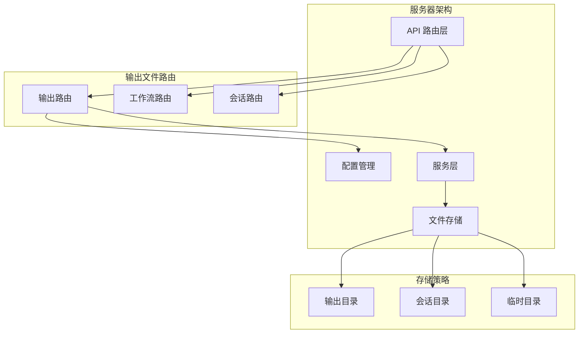

**图表来源**
- [server/src/routes/output.ts:1-139](file://server/src/routes/output.ts#L1-L139)
- [server/src/index.ts:129-146](file://server/src/index.ts#L129-L146)

**章节来源**
- [server/src/routes/output.ts:1-139](file://server/src/routes/output.ts#L1-L139)
- [server/src/index.ts:118-146](file://server/src/index.ts#L118-L146)

## 核心组件

输出文件路由系统由多个核心组件构成，每个组件负责特定的功能领域：

### 路由控制器
- **输出路由处理器**：处理所有输出文件相关的 HTTP 请求
- **工作流路由**：协调文件上传和下载流程
- **会话路由**：管理会话相关的文件操作

### 存储管理层
- **路径配置系统**：集中管理所有文件路径和配置
- **会话文件管理**：处理会话相关的文件存储
- **输出文件管理**：专门处理工作流输出文件

### 安全控制层
- **文件访问控制**：验证文件访问权限
- **路径解析安全**：防止路径遍历攻击
- **文件类型验证**：确保只处理允许的文件类型

**章节来源**
- [server/src/routes/output.ts:13-25](file://server/src/routes/output.ts#L13-L25)
- [server/src/config/paths.ts:141-156](file://server/src/config/paths.ts#L141-L156)

## 架构概览

输出文件路由系统采用分层架构设计，确保了良好的模块分离和可维护性。

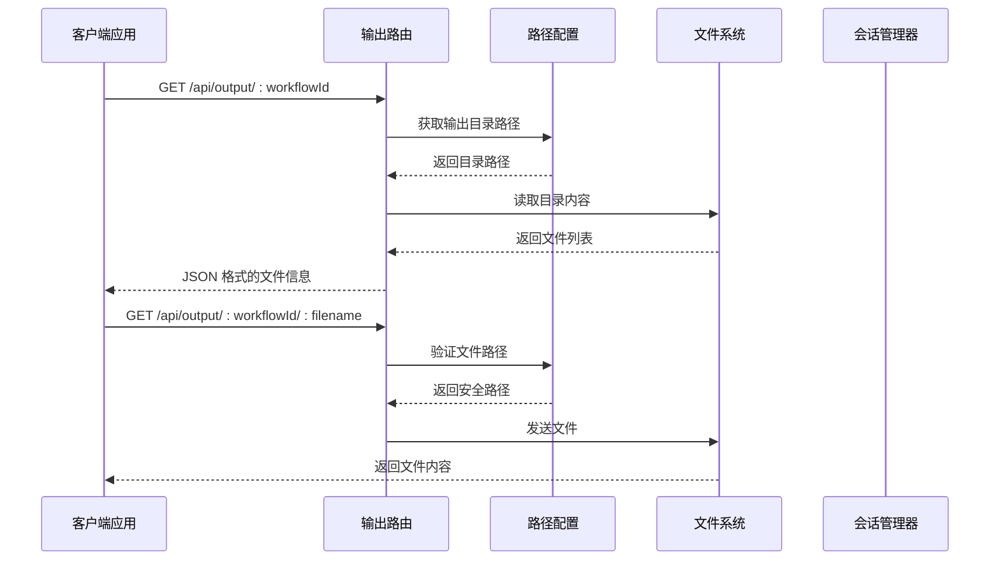

**图表来源**
- [server/src/routes/output.ts:27-78](file://server/src/routes/output.ts#L27-L78)
- [server/src/config/paths.ts:141-156](file://server/src/config/paths.ts#L141-L156)

## 详细组件分析

### 输出路由处理器

输出路由处理器是系统的核心组件，负责处理所有与输出文件相关的请求。

#### 路由定义和工作流映射

系统支持 11 种不同的工作流类型，每种工作流都有对应的输出目录：

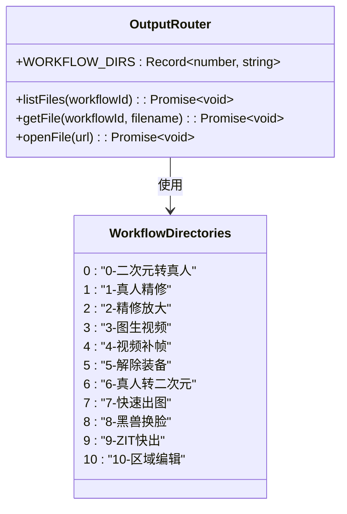

**图表来源**
- [server/src/routes/output.ts:13-25](file://server/src/routes/output.ts#L13-L25)

#### 文件列表获取功能

文件列表功能提供了对指定工作流输出目录的访问：

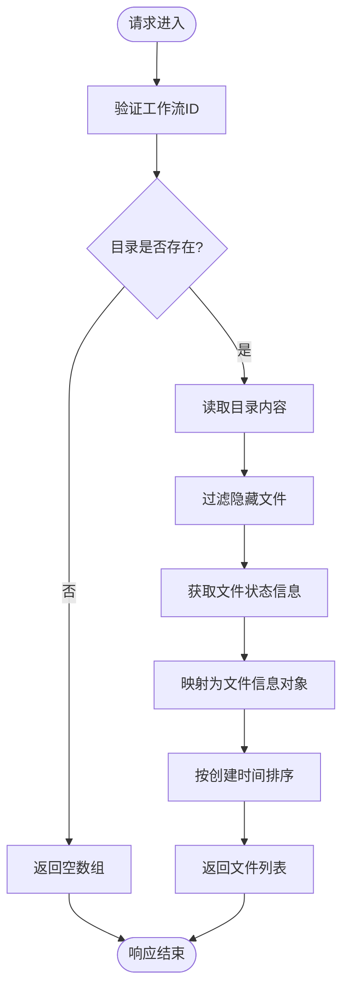

**图表来源**
- [server/src/routes/output.ts:27-58](file://server/src/routes/output.ts#L27-L58)

#### 单文件下载功能

单文件下载功能提供了直接的文件访问接口：

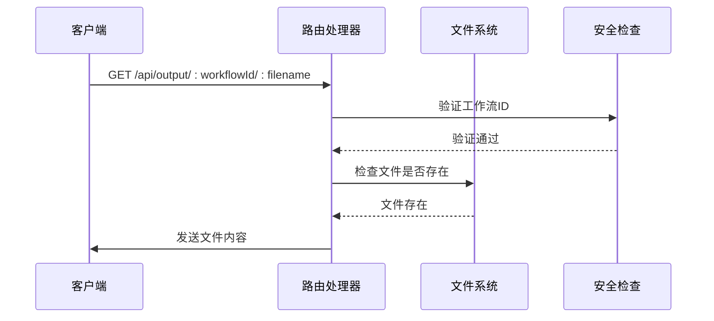

**图表来源**
- [server/src/routes/output.ts:60-78](file://server/src/routes/output.ts#L60-L78)

#### 文件打开功能

文件打开功能允许系统级的文件操作：

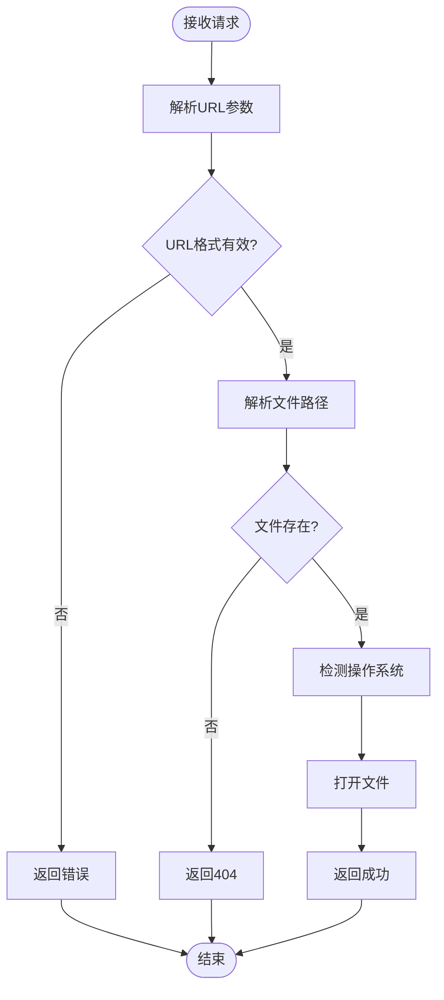

**图表来源**
- [server/src/routes/output.ts:80-136](file://server/src/routes/output.ts#L80-L136)

**章节来源**
- [server/src/routes/output.ts:27-136](file://server/src/routes/output.ts#L27-L136)

### 路径配置管理系统

路径配置系统提供了集中化的路径管理功能，支持运行时配置和路径覆盖。

#### 路径获取和验证

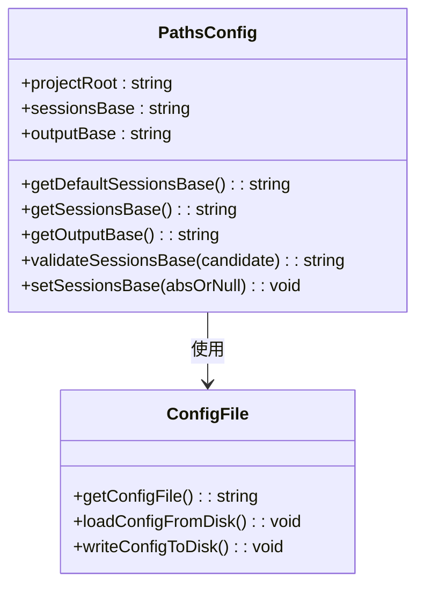

**图表来源**
- [server/src/config/paths.ts:70-137](file://server/src/config/paths.ts#L70-L137)

#### 会话路径管理

会话路径管理功能支持动态路径切换和验证：

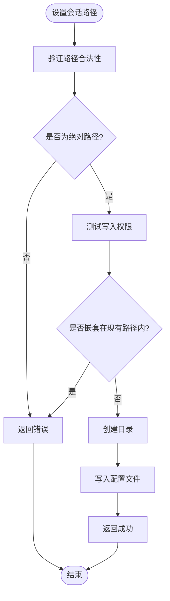

**图表来源**
- [server/src/config/paths.ts:84-100](file://server/src/config/paths.ts#L84-L100)

**章节来源**
- [server/src/config/paths.ts:70-137](file://server/src/config/paths.ts#L70-L137)

### 会话文件管理器

会话文件管理器专门处理与会话相关的文件操作，包括输入文件、输出文件和掩码文件的管理。

#### 输出文件保存流程

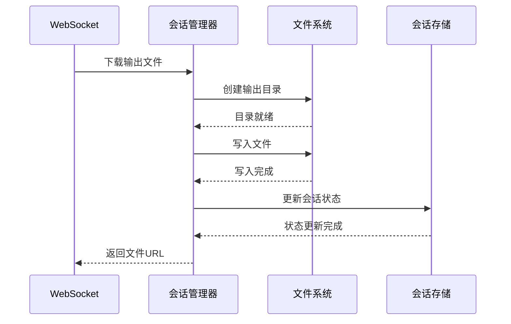

**图表来源**
- [server/src/services/sessionManager.ts:37-48](file://server/src/services/sessionManager.ts#L37-L48)

#### 文件命名和存储策略

会话文件管理器采用了智能的文件命名策略：

- **输入文件命名**：`{imageId}{ext}`
- **输出文件命名**：`{label}_{index}{ext}`（重命名后）
- **掩码文件命名**：`{maskKey.replace(':', '_')}.png`

**章节来源**
- [server/src/services/sessionManager.ts:22-62](file://server/src/services/sessionManager.ts#L22-L62)

### 文件类型识别和验证

系统实现了多种文件类型识别机制，确保只处理支持的文件格式。

#### 图像文件维度检测

系统支持多种图像格式的维度检测：

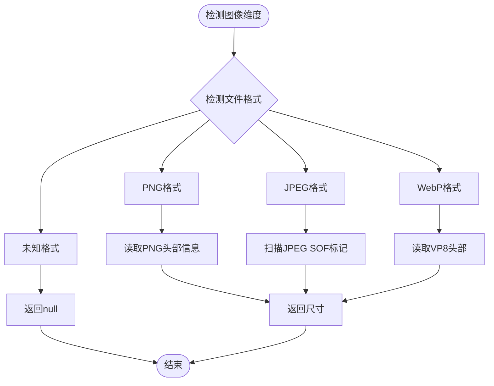

**图表来源**
- [server/src/routes/workflow.ts:88-120](file://server/src/routes/workflow.ts#L88-L120)

#### 文件类型验证机制

系统通过多种方式验证文件类型：

- **文件扩展名检查**：验证常见的图像和视频扩展名
- **文件头签名检测**：通过二进制签名识别文件类型
- **MIME类型验证**：结合 Content-Type 头进行验证

**章节来源**
- [server/src/routes/workflow.ts:88-120](file://server/src/routes/workflow.ts#L88-L120)

## 依赖关系分析

输出文件路由系统的依赖关系体现了清晰的分层架构设计。

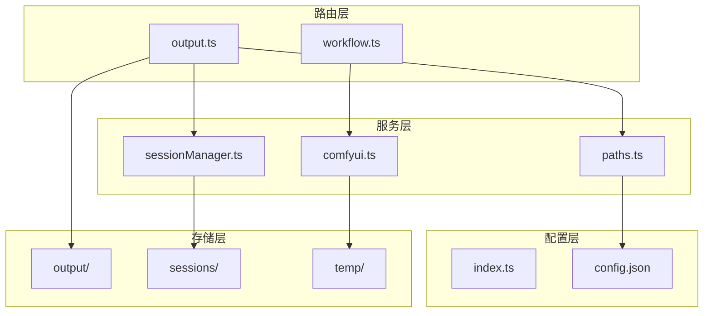

**图表来源**
- [server/src/routes/output.ts:1-11](file://server/src/routes/output.ts#L1-L11)
- [server/src/services/sessionManager.ts:1-7](file://server/src/services/sessionManager.ts#L1-L7)

### 核心依赖关系

系统的关键依赖关系包括：

1. **路由到配置**：输出路由依赖路径配置系统
2. **路由到服务**：输出路由依赖会话管理器
3. **工作流到服务**：工作流路由依赖 ComfyUI 服务
4. **配置持久化**：路径配置依赖配置文件

**章节来源**
- [server/src/routes/output.ts:1-11](file://server/src/routes/output.ts#L1-L11)
- [server/src/services/sessionManager.ts:1-7](file://server/src/services/sessionManager.ts#L1-L7)

## 性能考虑

输出文件路由系统在设计时充分考虑了性能优化和最佳实践。

### 文件访问优化

系统采用了多种性能优化策略：

- **目录预创建**：启动时预先创建所有输出目录
- **文件列表缓存**：减少频繁的文件系统查询
- **异步文件操作**：避免阻塞主线程
- **内存映射文件**：对于大文件使用流式传输

### 并发处理

系统支持高并发的文件操作：

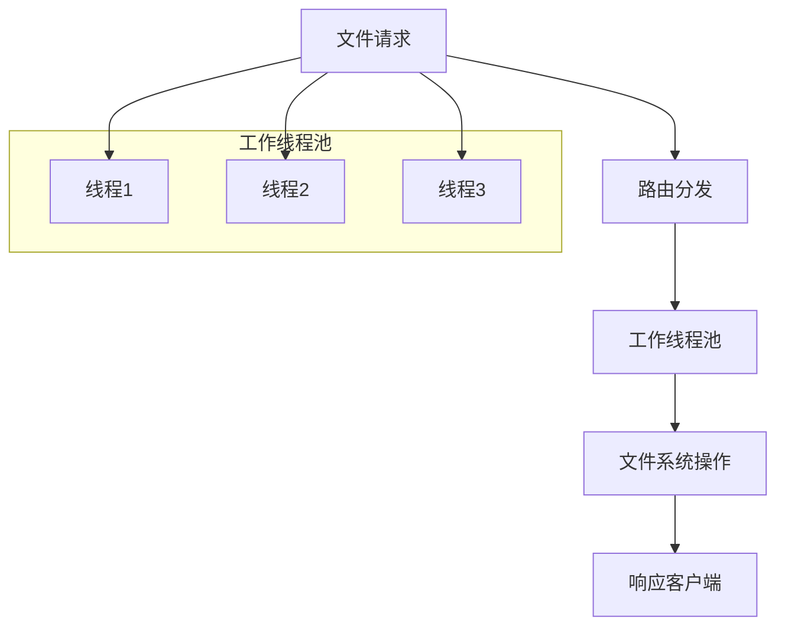

### 内存管理

系统实施了严格的内存管理策略：

- **流式文件传输**：避免大文件加载到内存
- **连接池管理**：复用数据库和网络连接
- **垃圾回收优化**：及时释放不再使用的资源

## 故障排除指南

### 常见问题和解决方案

#### 文件访问权限问题

**问题症状**：
- 403 Forbidden 错误
- 文件无法读取
- 权限不足异常

**解决方案**：
1. 检查文件系统权限设置
2. 验证路径解析安全性
3. 确认用户身份验证

#### 文件路径问题

**问题症状**：
- 404 Not Found 错误
- 路径解析失败
- 文件不存在异常

**解决方案**：
1. 验证工作流 ID 有效性
2. 检查目录结构完整性
3. 确认文件名编码正确

#### 性能问题

**问题症状**：
- 文件操作缓慢
- 内存使用过高
- 响应时间过长

**解决方案**：
1. 实施文件缓存策略
2. 优化文件系统查询
3. 调整并发限制

**章节来源**
- [server/src/routes/output.ts:32-35](file://server/src/routes/output.ts#L32-L35)
- [server/src/routes/output.ts:72-75](file://server/src/routes/output.ts#L72-L75)

## 结论

CorineKit Pix2Real 的输出文件路由系统展现了优秀的软件架构设计。系统通过清晰的分层结构、完善的错误处理机制和高效的性能优化策略，为 AI 工作流的输出文件管理提供了可靠的基础设施。

### 主要优势

1. **模块化设计**：清晰的组件分离便于维护和扩展
2. **安全性保障**：多重安全检查防止路径遍历和权限泄露
3. **性能优化**：流式传输和缓存策略提升系统性能
4. **可扩展性**：灵活的配置系统支持动态路径管理

### 技术亮点

- **智能文件管理**：支持多种文件格式和自动生成策略
- **会话集成**：与会话系统深度集成提供一致的用户体验
- **跨平台兼容**：支持 Windows、macOS 和 Linux 系统
- **实时监控**：WebSocket 集成提供实时进度反馈

该系统为 AI 应用的文件管理提供了坚实的基础，能够满足各种复杂场景的需求，并为未来的功能扩展奠定了良好的技术基础。