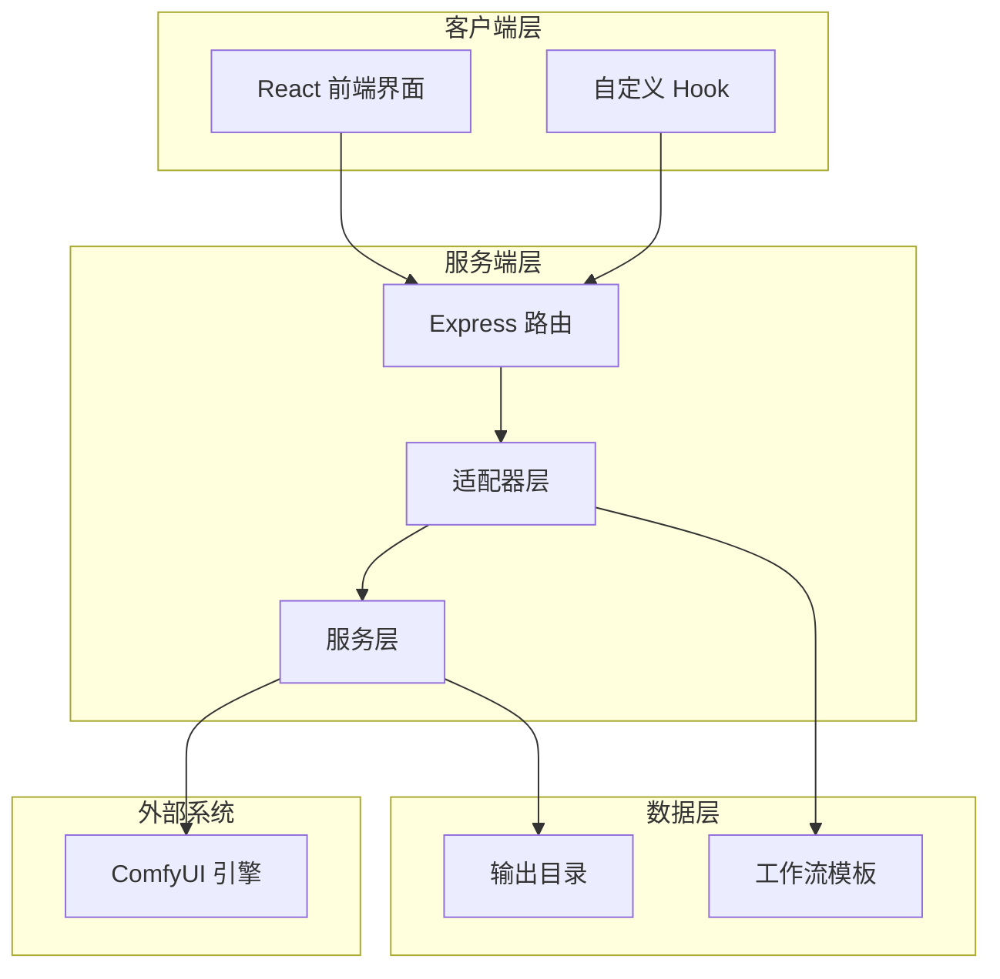
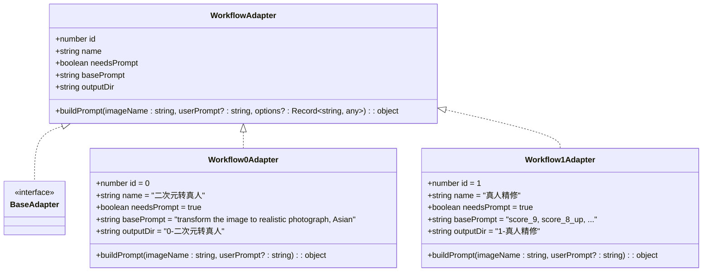
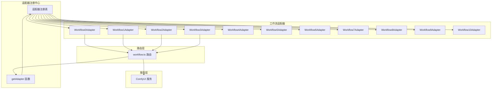
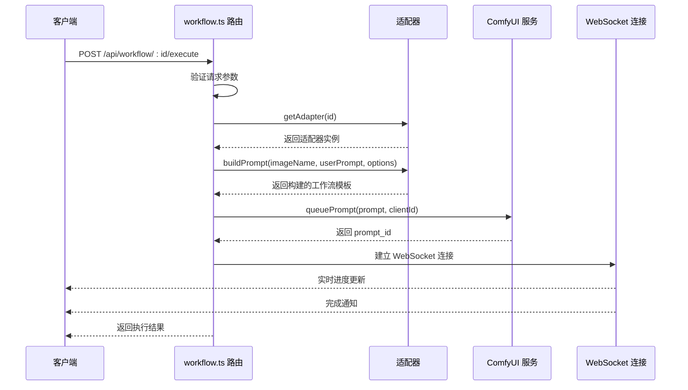
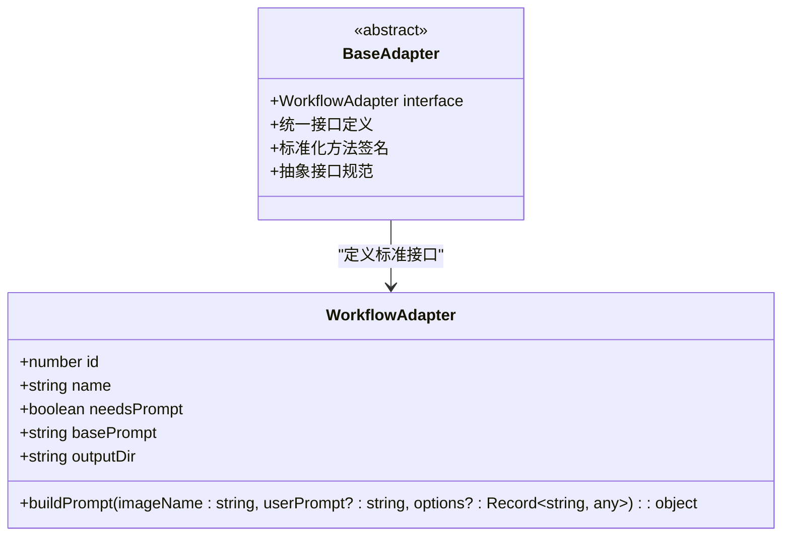
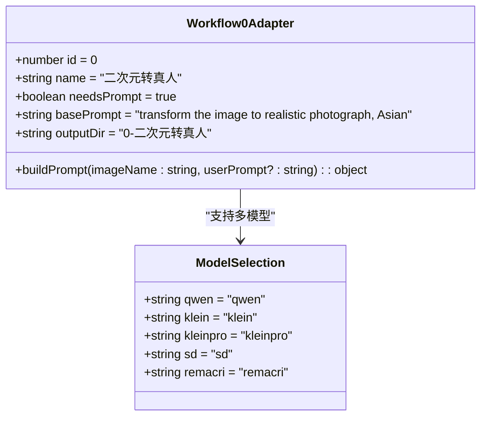
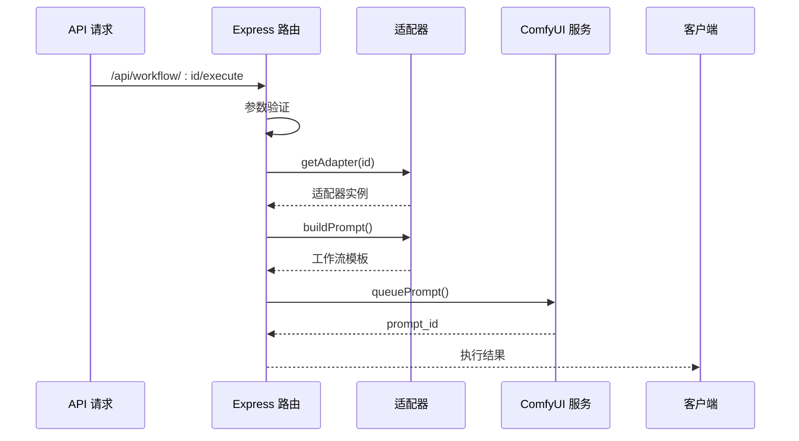
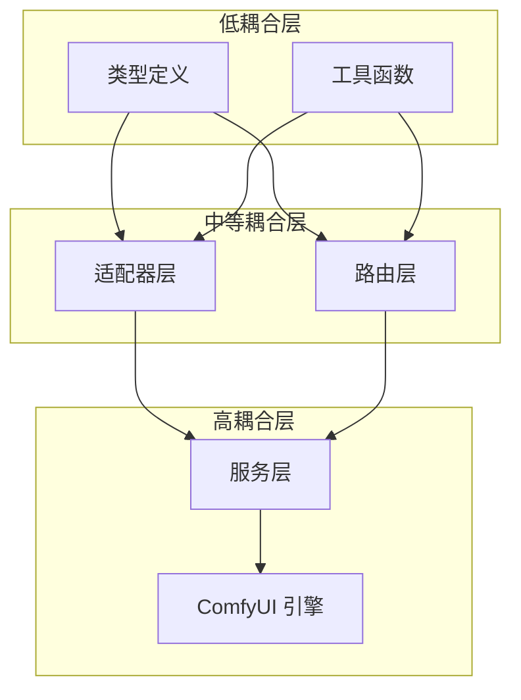
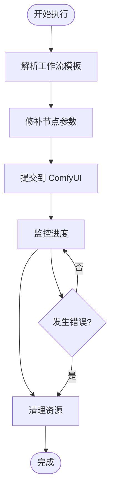

# 基础适配器设计

<cite>
**本文档引用的文件**
- [BaseAdapter.ts](file://server/src/adapters/BaseAdapter.ts)
- [index.ts](file://server/src/adapters/index.ts)
- [types/index.ts](file://server/src/types/index.ts)
- [Workflow0Adapter.ts](file://server/src/adapters/Workflow0Adapter.ts)
- [Workflow1Adapter.ts](file://server/src/adapters/Workflow1Adapter.ts)
- [Workflow2Adapter.ts](file://server/src/adapters/Workflow2Adapter.ts)
- [Workflow3Adapter.ts](file://server/src/adapters/Workflow3Adapter.ts)
- [workflow.ts](file://server/src/routes/workflow.ts)
- [comfyui.ts](file://server/src/services/comfyui.ts)
- [README.md](file://README.md)
</cite>

## 目录
1. [简介](#简介)
2. [项目结构](#项目结构)
3. [核心组件](#核心组件)
4. [架构概览](#架构概览)
5. [详细组件分析](#详细组件分析)
6. [依赖关系分析](#依赖关系分析)
7. [性能考虑](#性能考虑)
8. [故障排除指南](#故障排除指南)
9. [结论](#结论)

## 简介

CorineKit Pix2Real 是一个基于 ComfyUI 的本地 Web 图像/视频处理工具，采用适配器模式设计来实现多种工作流的标准化处理。本文档深入解析基础适配器设计，包括 BaseAdapter 抽象基类的设计理念、WorkflowAdapter 类型定义、通用方法签名和抽象接口规范。

适配器模式在此项目中的架构作用是通过统一接口实现多种工作流的标准化处理，使得不同的图像处理工作流（如二次元转真人、真人精修、精修放大等）能够以一致的方式被调用和管理。

## 项目结构

项目采用分层架构设计，主要分为以下几个层次：



**图表来源**
- [README.md:41-62](file://README.md#L41-L62)
- [workflow.ts:1-29](file://server/src/routes/workflow.ts#L1-L29)

**章节来源**
- [README.md:41-62](file://README.md#L41-L62)
- [workflow.ts:1-29](file://server/src/routes/workflow.ts#L1-L29)

## 核心组件

### WorkflowAdapter 接口定义

WorkflowAdapter 是适配器模式的核心接口，定义了所有工作流适配器必须实现的标准接口：



**图表来源**
- [types/index.ts:1-8](file://server/src/types/index.ts#L1-L8)
- [BaseAdapter.ts:1-4](file://server/src/adapters/BaseAdapter.ts#L1-L4)

WorkflowAdapter 接口包含以下关键属性：

- **id**: 工作流唯一标识符
- **name**: 工作流显示名称
- **needsPrompt**: 是否需要用户提示词
- **basePrompt**: 工作流的基础提示词
- **outputDir**: 输出目录路径
- **buildPrompt()**: 构建工作流提示词的核心方法

**章节来源**
- [types/index.ts:1-8](file://server/src/types/index.ts#L1-L8)
- [BaseAdapter.ts:1-4](file://server/src/adapters/BaseAdapter.ts#L1-L4)

## 架构概览

### 适配器模式架构设计



**图表来源**
- [index.ts:14-32](file://server/src/adapters/index.ts#L14-L32)
- [workflow.ts:750-799](file://server/src/routes/workflow.ts#L750-L799)

### 工作流执行流程



**图表来源**
- [workflow.ts:750-799](file://server/src/routes/workflow.ts#L750-L799)
- [comfyui.ts:168-196](file://server/src/services/comfyui.ts#L168-L196)

**章节来源**
- [index.ts:14-32](file://server/src/adapters/index.ts#L14-L32)
- [workflow.ts:750-799](file://server/src/routes/workflow.ts#L750-L799)

## 详细组件分析

### BaseAdapter 抽象基类

BaseAdapter 作为适配器模式的抽象基类，虽然当前文件中仅导出了 WorkflowAdapter 类型，但其设计理念体现了适配器模式的核心思想：



**图表来源**
- [BaseAdapter.ts:1-4](file://server/src/adapters/BaseAdapter.ts#L1-L4)
- [types/index.ts:1-8](file://server/src/types/index.ts#L1-L8)

### 适配器注册与管理

适配器注册中心负责管理所有工作流适配器实例：

```mermaid
flowchart TD
Start([启动应用]) --> LoadAdapters[加载所有适配器]
LoadAdapters --> RegisterAdapters[注册适配器到映射表]
RegisterAdapters --> ExportFunctions[导出访问函数]
ExportFunctions --> Ready[适配器就绪]
Ready --> GetAdapter[getAdapter(id)]
GetAdapter --> Found{找到适配器?}
Found --> |是| ReturnAdapter[返回适配器实例]
Found --> |否| ReturnUndefined[返回 undefined]
Ready --> ListAdapters[adapters 映射表]
ListAdapters --> IterateAdapters[遍历所有适配器]
```

**图表来源**
- [index.ts:14-32](file://server/src/adapters/index.ts#L14-L32)

**章节来源**
- [index.ts:14-32](file://server/src/adapters/index.ts#L14-L32)

### 具体工作流适配器实现

#### Workflow0Adapter - 二次元转真人

Workflow0Adapter 实现了最复杂的工作流，支持多种模型选择：



**图表来源**
- [Workflow0Adapter.ts:9-34](file://server/src/adapters/Workflow0Adapter.ts#L9-L34)

#### Workflow1Adapter - 真人精修

Workflow1Adapter 专注于高质量的人像精修：

**章节来源**
- [Workflow1Adapter.ts:9-35](file://server/src/adapters/Workflow1Adapter.ts#L9-L35)

#### Workflow2Adapter - 精修放大

Workflow2Adapter 提供多种放大模型选择：

**章节来源**
- [Workflow2Adapter.ts:9-27](file://server/src/adapters/Workflow2Adapter.ts#L9-L27)

#### Workflow3Adapter - 图生视频

Workflow3Adapter 实现了图像到视频的转换功能：

**章节来源**
- [Workflow3Adapter.ts:16-40](file://server/src/adapters/Workflow3Adapter.ts#L16-L40)

### 路由层集成

workflow.ts 路由层负责协调适配器与 ComfyUI 服务的交互：



**图表来源**
- [workflow.ts:750-799](file://server/src/routes/workflow.ts#L750-L799)

**章节来源**
- [workflow.ts:750-799](file://server/src/routes/workflow.ts#L750-L799)

## 依赖关系分析

### 组件耦合度分析



**图表来源**
- [index.ts:1-32](file://server/src/adapters/index.ts#L1-L32)
- [workflow.ts:1-15](file://server/src/routes/workflow.ts#L1-L15)

### 依赖注入与解耦策略

项目采用了良好的依赖注入策略：

1. **接口抽象**: 通过 WorkflowAdapter 接口实现行为抽象
2. **工厂模式**: 通过 getAdapter 函数实现对象创建
3. **服务分离**: 将 ComfyUI 交互逻辑封装在独立服务模块中
4. **配置驱动**: 工作流模板通过 JSON 文件配置

**章节来源**
- [index.ts:14-32](file://server/src/adapters/index.ts#L14-L32)
- [workflow.ts:1-15](file://server/src/routes/workflow.ts#L1-L15)

## 性能考虑

### 适配器模式的性能优势

1. **模板复用**: 工作流模板在内存中复用，减少文件 I/O 操作
2. **延迟初始化**: 适配器实例按需创建，降低启动时间
3. **缓存机制**: 通过模块级缓存避免重复解析 JSON 模板
4. **异步处理**: 使用异步函数处理文件上传和 ComfyUI 通信

### 内存管理策略



**图表来源**
- [comfyui.ts:168-196](file://server/src/services/comfyui.ts#L168-L196)

## 故障排除指南

### 常见错误类型与处理

#### 适配器相关错误

| 错误类型 | 描述 | 解决方案 |
|---------|------|----------|
| Unknown workflow | 适配器 ID 不存在 | 检查工作流 ID 是否在 0-10 范围内 |
| Template parsing error | JSON 模板解析失败 | 验证模板文件完整性 |
| Node configuration error | 节点参数配置错误 | 检查节点 ID 和输入参数 |

#### ComfyUI 集成错误

| 错误类型 | 描述 | 解决方案 |
|---------|------|----------|
| Queue prompt failed | 工作流提交失败 | 检查 ComfyUI 服务状态 |
| Model not found | AI 模型文件缺失 | 验证模型文件路径 |
| Execution error | 工作流执行异常 | 查看 ComfyUI 日志 |

**章节来源**
- [workflow.ts:126-150](file://server/src/routes/workflow.ts#L126-L150)

### 错误处理机制

项目实现了多层次的错误处理机制：

1. **适配器层错误**: 适配器内部的参数验证和配置检查
2. **路由层错误**: HTTP 请求参数验证和业务逻辑检查
3. **服务层错误**: ComfyUI 通信错误和网络异常处理
4. **前端错误**: 用户友好的错误消息转换和显示

**章节来源**
- [workflow.ts:126-150](file://server/src/routes/workflow.ts#L126-L150)

## 结论

CorineKit Pix2Real 的基础适配器设计成功实现了以下目标：

### 设计优势

1. **高度模块化**: 每个工作流都是独立的适配器，便于维护和扩展
2. **统一接口**: 通过 WorkflowAdapter 接口实现标准化处理
3. **灵活扩展**: 新增工作流只需实现 WorkflowAdapter 接口
4. **性能优化**: 模板缓存和异步处理提升执行效率

### 最佳实践建议

1. **遵循接口规范**: 新工作流必须完全实现 WorkflowAdapter 接口
2. **合理使用模板**: 工作流模板应保持简洁，只修改必要节点
3. **错误处理**: 实现完善的错误处理和用户反馈机制
4. **性能监控**: 关注工作流执行时间和资源使用情况

### 扩展指导

未来可以考虑的功能扩展：

1. **工作流链式组合**: 支持多个工作流的串联执行
2. **动态参数配置**: 提供更灵活的工作流参数调整
3. **进度可视化**: 增强工作流执行过程的可视化展示
4. **批处理优化**: 改进大量文件的批量处理性能

通过适配器模式的设计，CorineKit Pix2Real 为图像和视频处理提供了强大而灵活的基础设施，为后续的功能扩展奠定了坚实的基础。