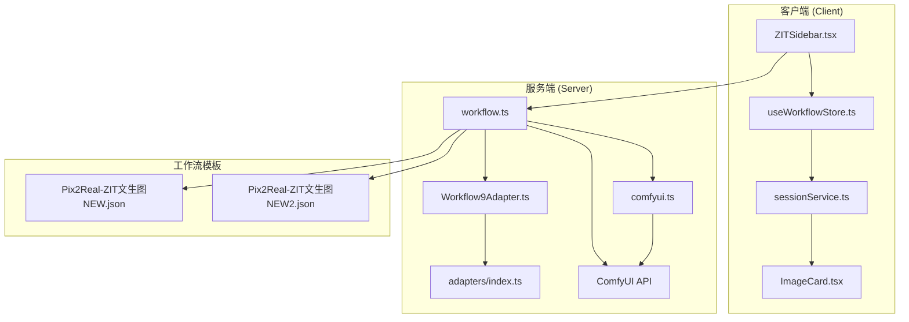
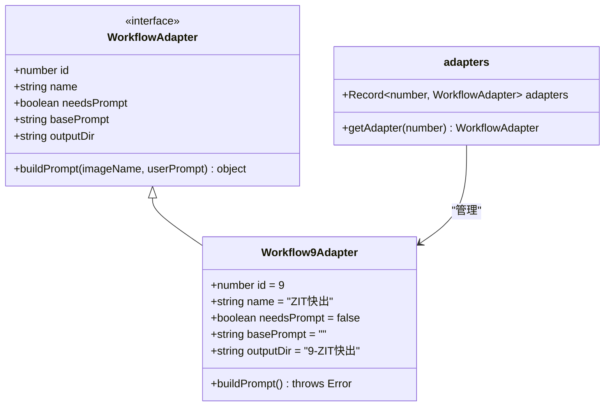
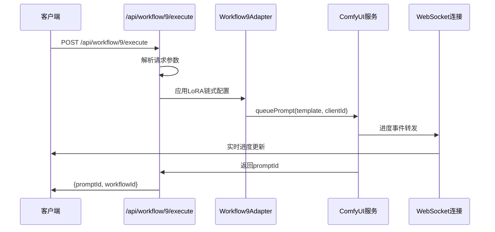
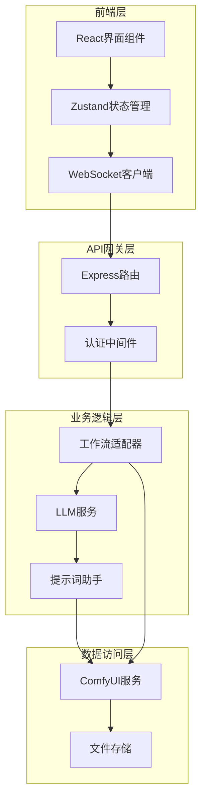
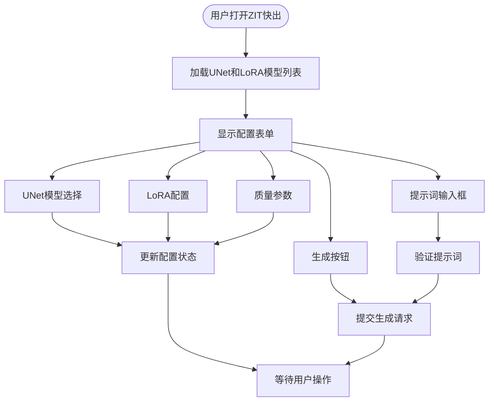
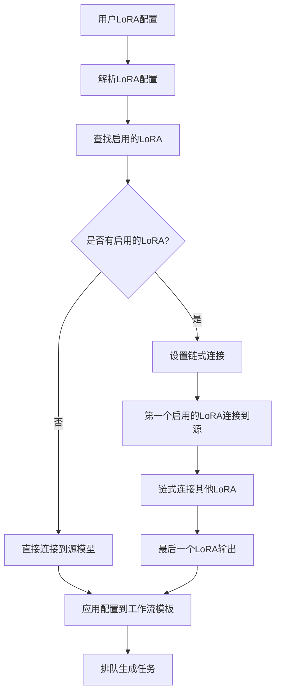
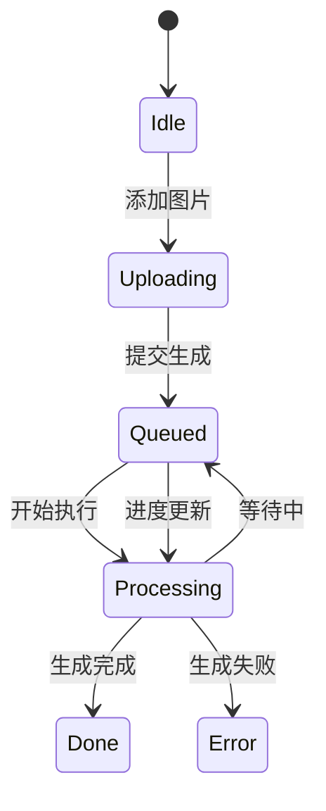
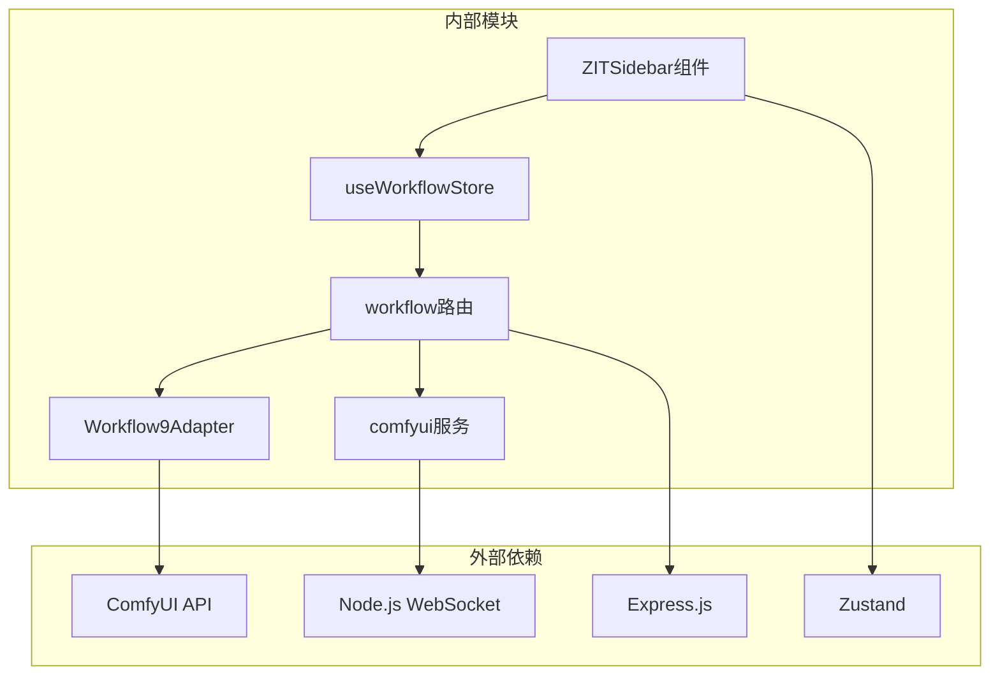
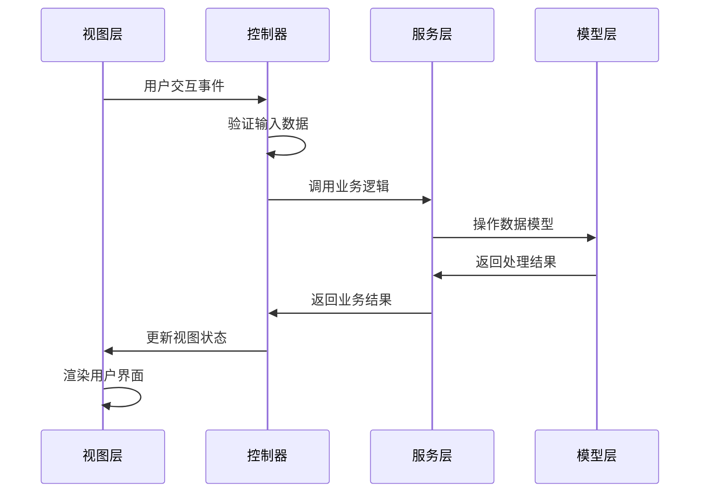
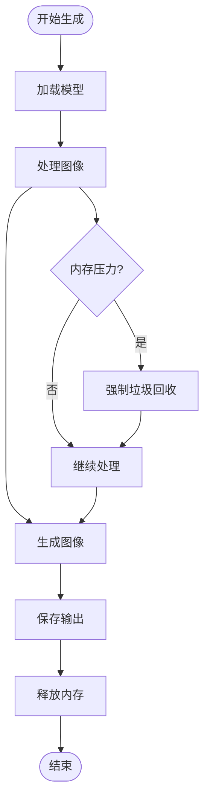

# ZIT 快出适配器

<cite>
**本文档引用的文件**
- [README.md](file://README.md)
- [Workflow9Adapter.ts](file://server/src/adapters/Workflow9Adapter.ts)
- [index.ts](file://server/src/adapters/index.ts)
- [workflow.ts](file://server/src/routes/workflow.ts)
- [Pix2Real-ZIT文生图NEW.json](file://ComfyUI_API/Pix2Real-ZIT文生图NEW.json)
- [Pix2Real-ZIT文生图NEW2.json](file://ComfyUI_API/Pix2Real-ZIT文生图NEW2.json)
- [ZITSidebar.tsx](file://client/src/components/ZITSidebar.tsx)
- [useWorkflowStore.ts](file://client/src/hooks/useWorkflowStore.ts)
- [sessionService.ts](file://client/src/services/sessionService.ts)
- [comfyui.ts](file://server/src/services/comfyui.ts)
- [index.ts](file://client/src/types/index.ts)
- [systemPrompts.ts](file://client/src/components/prompt-assistant/systemPrompts.ts)
- [llmService.ts](file://server/src/services/llmService.ts)
</cite>

## 目录
1. [简介](#简介)
2. [项目结构](#项目结构)
3. [核心组件](#核心组件)
4. [架构概览](#架构概览)
5. [详细组件分析](#详细组件分析)
6. [依赖关系分析](#依赖关系分析)
7. [性能考虑](#性能考虑)
8. [故障排除指南](#故障排除指南)
9. [结论](#结论)
10. [附录](#附录)

## 简介

ZIT 快出适配器是 CorineKit Pix2Real 项目中的专业文本到图像生成功能模块。该适配器基于 ComfyUI 工作流引擎，实现了高效的图像生成流水线，支持 UNet 模型、LoRA 微调模型、AuraFlow 采样算法等先进特性。

该项目提供了完整的前端界面和后端服务，通过适配器模式实现工作流的模块化管理，支持实时进度监控、批量处理、模型管理等功能。ZIT 快出适配器特别针对高质量图像生成进行了优化，包括提示词权重调整、生成参数配置和输出质量控制等核心功能。

## 项目结构

项目采用前后端分离的架构设计，主要分为以下几个核心部分：

**图表来源**
- [README.md:41-62](file://README.md#L41-L62)
- [workflow.ts:1-29](file://server/src/routes/workflow.ts#L1-L29)

**章节来源**
- [README.md:1-79](file://README.md#L1-L79)
- [workflow.ts:152-161](file://server/src/routes/workflow.ts#L152-L161)

## 核心组件

### 适配器架构

ZIT 快出适配器采用适配器模式设计，通过统一的接口管理不同的工作流实现：

**图表来源**
- [Workflow9Adapter.ts:1-14](file://server/src/adapters/Workflow9Adapter.ts#L1-L14)
- [index.ts:14-33](file://server/src/adapters/index.ts#L14-L33)

### 工作流路由系统

服务端通过专门的路由处理 ZIT 快出请求：

**图表来源**
- [workflow.ts:485-593](file://server/src/routes/workflow.ts#L485-L593)

**章节来源**
- [Workflow9Adapter.ts:3-13](file://server/src/adapters/Workflow9Adapter.ts#L3-L13)
- [workflow.ts:485-593](file://server/src/routes/workflow.ts#L485-L593)

## 架构概览

ZIT 快出适配器的整体架构采用了现代化的微服务设计理念：

**图表来源**
- [README.md:74-79](file://README.md#L74-L79)
- [workflow.ts:1-29](file://server/src/routes/workflow.ts#L1-L29)

该架构的主要特点包括：
- **模块化设计**：通过适配器模式实现工作流的可扩展性
- **实时通信**：基于 WebSocket 的双向通信机制
- **状态管理**：使用 Zustand 进行轻量级状态管理
- **错误处理**：统一的错误映射和用户友好提示

## 详细组件分析

### 前端界面组件

#### ZIT 快出侧边栏

ZIT 快出侧边栏提供了完整的图像生成配置界面：

**图表来源**
- [ZITSidebar.tsx:345-419](file://client/src/components/ZITSidebar.tsx#L345-L419)

**章节来源**
- [ZITSidebar.tsx:66-420](file://client/src/components/ZITSidebar.tsx#L66-L420)

### 后端服务组件

#### LoRA 链式配置系统

ZIT 快出适配器实现了复杂的 LoRA 模型链式配置机制：

**图表来源**
- [workflow.ts:40-86](file://server/src/routes/workflow.ts#L40-L86)
- [workflow.ts:532-574](file://server/src/routes/workflow.ts#L532-L574)

**章节来源**
- [workflow.ts:40-86](file://server/src/routes/workflow.ts#L40-L86)
- [workflow.ts:532-574](file://server/src/routes/workflow.ts#L532-L574)

### 工作流模板系统

#### ZIT 工作流模板

ZIT 快出适配器使用了两个主要的工作流模板：

| 模板名称 | 版本 | 主要特性 | 适用场景 |
|---------|------|----------|----------|
| Pix2Real-ZIT文生图NEW | v1 | 基础UNet + LoRA支持 | 标准图像生成 |
| Pix2Real-ZIT文生图NEW2 | v2 | 增强LoRA链式支持 | 高级图像生成 |

**章节来源**
- [Pix2Real-ZIT文生图NEW.json:1-172](file://ComfyUI_API/Pix2Real-ZIT文生图NEW.json#L1-L172)
- [Pix2Real-ZIT文生图NEW2.json:1-265](file://ComfyUI_API/Pix2Real-ZIT文生图NEW2.json#L1-L265)

### 状态管理系统

#### 工作流状态存储

ZIT 快出适配器使用 Zustand 进行状态管理：

**图表来源**
- [useWorkflowStore.ts:25-37](file://client/src/hooks/useWorkflowStore.ts#L25-L37)

**章节来源**
- [useWorkflowStore.ts:101-183](file://client/src/hooks/useWorkflowStore.ts#L101-L183)

## 依赖关系分析

### 组件依赖图

**图表来源**
- [index.ts:14-33](file://server/src/adapters/index.ts#L14-L33)
- [workflow.ts:1-29](file://server/src/routes/workflow.ts#L1-L29)

### 数据流分析

ZIT 快出适配器的数据流遵循标准的 MVC 模式：

**图表来源**
- [useWorkflowStore.ts:191-215](file://client/src/hooks/useWorkflowStore.ts#L191-L215)

**章节来源**
- [index.ts:14-33](file://server/src/adapters/index.ts#L14-L33)
- [workflow.ts:1-29](file://server/src/routes/workflow.ts#L1-L29)

## 性能考虑

### 生成性能优化

ZIT 快出适配器在性能方面采用了多项优化策略：

1. **WebSocket 实时通信**：减少轮询开销，实现实时进度更新
2. **状态缓存**：使用内存缓存减少重复计算
3. **批量处理**：支持多图片批量生成
4. **资源管理**：自动释放 VRAM 资源

### 内存管理

**图表来源**
- [comfyui.ts:265-375](file://server/src/services/comfyui.ts#L265-L375)

## 故障排除指南

### 常见问题及解决方案

#### 1. 模型加载失败

**症状**：提示找不到指定的模型文件
**原因**：模型路径不正确或文件损坏
**解决方案**：
- 检查模型文件是否存在于 ComfyUI 模型目录
- 验证模型文件的完整性
- 重新下载或重新安装模型

#### 2. 生成进度停滞

**症状**：进度条长时间不动
**原因**：GPU 内存不足或模型过大
**解决方案**：
- 关闭其他占用 GPU 的应用程序
- 减少图像尺寸或降低质量参数
- 重启 ComfyUI 服务

#### 3. WebSocket 连接中断

**症状**：实时进度更新停止
**原因**：网络连接不稳定或服务器负载过高
**解决方案**：
- 检查网络连接稳定性
- 重启 WebSocket 服务
- 调整浏览器设置允许 WebSocket 连接

**章节来源**
- [workflow.ts:126-150](file://server/src/routes/workflow.ts#L126-L150)

### 调试工具

ZIT 快出适配器提供了完善的调试和监控功能：

1. **实时进度监控**：通过 WebSocket 实时显示生成进度
2. **错误日志记录**：详细的错误信息和堆栈跟踪
3. **性能指标**：内存使用情况和处理时间统计
4. **状态恢复**：断线重连和状态恢复机制

## 结论

ZIT 快出适配器是一个功能完整、性能优异的专业文本到图像生成解决方案。通过采用现代的架构设计和先进的技术实现，该适配器能够满足专业用户的高质量图像生成需求。

主要优势包括：
- **模块化设计**：通过适配器模式实现高度可扩展性
- **实时交互**：基于 WebSocket 的实时进度更新
- **参数优化**：丰富的生成参数配置选项
- **质量保证**：严格的输出质量控制机制

未来的发展方向可能包括：
- 更智能的提示词处理和优化
- 更高效的模型管理和资源调度
- 更丰富的图像后处理功能
- 更好的用户体验和界面设计

## 附录

### 参数配置指南

#### 基本参数说明

| 参数名称 | 类型 | 默认值 | 描述 |
|---------|------|--------|------|
| unetModel | string | "" | UNet 模型名称 |
| loras | array | [] | LoRA 模型配置数组 |
| shiftEnabled | boolean | false | 是否启用 Shift 参数 |
| shift | number | 3 | Shift 数值，影响生成风格 |
| prompt | string | "" | 图像生成提示词 |
| width | number | 768 | 输出图像宽度 |
| height | number | 1344 | 输出图像高度 |
| steps | number | 9 | 采样步数 |
| cfg | number | 1 | CFG 分数 |
| sampler | string | "euler" | 采样器类型 |
| scheduler | string | "simple" | 调度器类型 |

#### 提示词权重调整

提示词权重调整是影响生成质量的关键因素：

1. **标签优先级**：按照视角/构图 > 人数/主体 > 角色特征 > 表情 > 动作/姿势 > 服装 > 背景 > 风格 > LoRA触发词的顺序排列
2. **重要性排序**：越重要的元素应该排在提示词列表的前面
3. **避免质量标签**：不要在提示词中包含质量相关的标签，工作流已内置完整的质量标签

#### 生成参数调优建议

1. **步数 (steps)**：一般在 9-15 之间，数值越高质量越好但耗时更长
2. **CFG 分数**：通常在 1-3 之间，数值越高越贴近提示词
3. **采样器选择**：euler 适合大多数场景，其他采样器可能产生不同的艺术效果
4. **尺寸设置**：根据输出用途选择合适的分辨率，注意显存限制

### 生成效果对比

由于代码库中未包含具体的生成效果对比数据，建议用户通过以下方式自行测试：

1. **基础测试**：使用相同的提示词和参数生成多张图像
2. **参数对比**：单独调整每个参数观察效果变化
3. **模型对比**：使用不同的 UNet 模型进行对比
4. **LoRA 对比**：启用不同的 LoRA 模型观察风格差异

通过系统的参数调优和模型选择，用户可以找到最适合自身需求的生成配置组合。