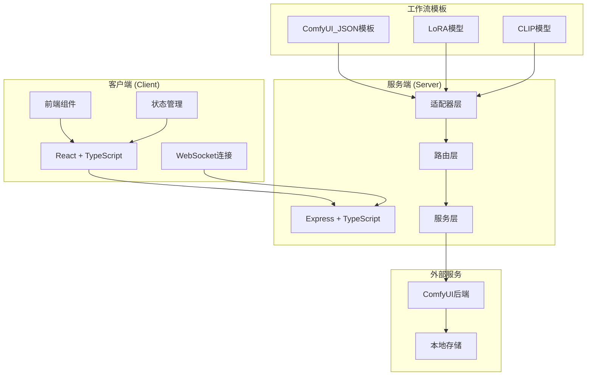
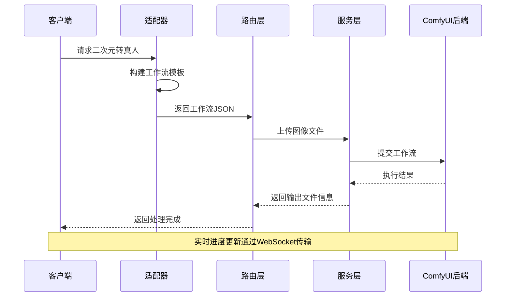
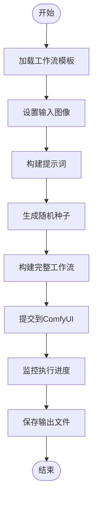
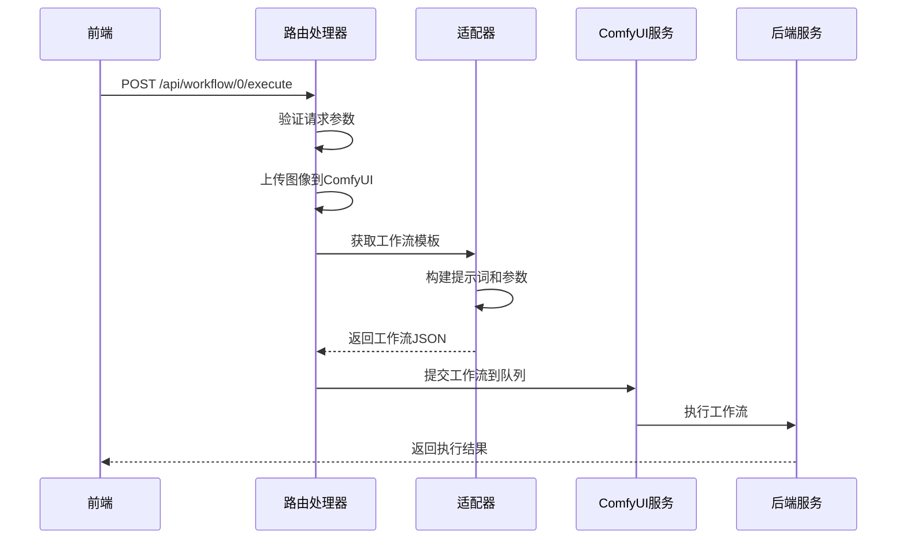
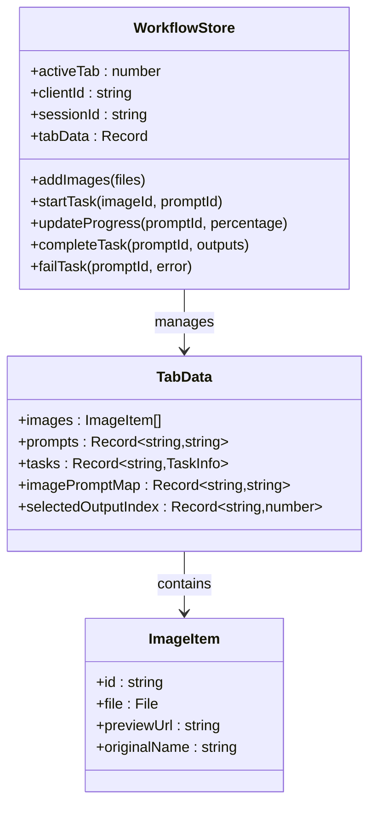
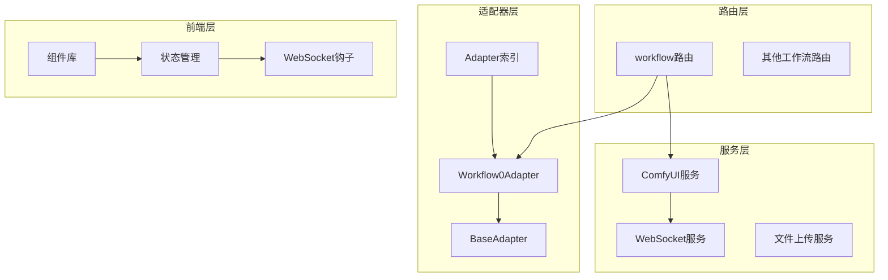
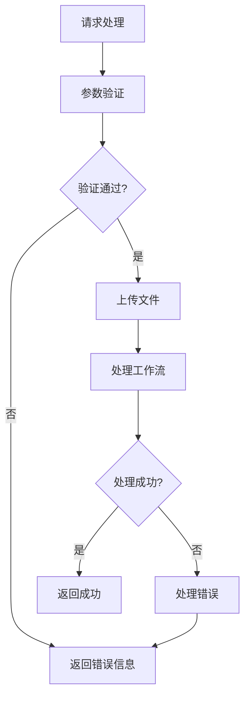

# 二次元转真人适配器

<cite>
**本文档引用的文件**
- [README.md](file://README.md)
- [Workflow0Adapter.ts](file://server/src/adapters/Workflow0Adapter.ts)
- [BaseAdapter.ts](file://server/src/adapters/BaseAdapter.ts)
- [index.ts](file://server/src/adapters/index.ts)
- [workflow.ts](file://server/src/routes/workflow.ts)
- [comfyui.ts](file://server/src/services/comfyui.ts)
- [0-Pix2Real-二次元转真人.json](file://ComfyUI_API/0-Pix2Real-二次元转真人.json)
- [👻二次元转真人(NoUnload).json](file://ComfyUI_API/👻二次元转真人(NoUnload).json)
- [useWorkflowStore.ts](file://client/src/hooks/useWorkflowStore.ts)
- [ZITSidebar.tsx](file://client/src/components/ZITSidebar.tsx)
</cite>

## 目录
1. [简介](#简介)
2. [项目结构](#项目结构)
3. [核心组件](#核心组件)
4. [架构概览](#架构概览)
5. [详细组件分析](#详细组件分析)
6. [依赖关系分析](#依赖关系分析)
7. [性能考虑](#性能考虑)
8. [故障排除指南](#故障排除指南)
9. [结论](#结论)

## 简介

二次元转真人适配器是CorineKit Pix2Real项目中的一个关键组件，负责将动漫风格的图像转换为写实风格的图像。该适配器基于ComfyUI工作流引擎，通过LoRA模型和Qwen图像编辑技术实现高质量的风格转换。

该项目是一个本地Web界面，通过ComfyUI进行批处理图像/视频处理，支持实时进度更新和一键输出文件夹访问。系统包含5个内置工作流，其中二次元转真人工作流是核心功能之一。

## 项目结构

项目采用前后端分离架构，主要分为以下模块：

**图表来源**
- [README.md:41-62](file://README.md#L41-L62)
- [workflow.ts:1-29](file://server/src/routes/workflow.ts#L1-L29)

**章节来源**
- [README.md:41-79](file://README.md#L41-L79)

## 核心组件

二次元转真人适配器的核心组件包括：

### 适配器接口定义
适配器遵循统一的接口规范，支持工作流参数配置、提示词构建和输出目录管理。

### 工作流模板
系统提供两种工作流模板：
- 标准二次元转真人模板
- NoUnload模式模板（内存优化）

### 模型配置
- LoRA模型：anything2real_2601_A_final_patched.safetensors
- CLIP模型：Qwen2.5-VL-7B-Instruct-Q3_K_S.gguf
- UNet模型：Qwen-Rapid-NSFW-v23_Q4_K.gguf

**章节来源**
- [Workflow0Adapter.ts:1-35](file://server/src/adapters/Workflow0Adapter.ts#L1-L35)
- [BaseAdapter.ts:1-4](file://server/src/adapters/BaseAdapter.ts#L1-L4)
- [index.ts:1-33](file://server/src/adapters/index.ts#L1-L33)

## 架构概览

系统采用分层架构设计，确保了良好的可扩展性和维护性：

**图表来源**
- [workflow.ts:644-687](file://server/src/routes/workflow.ts#L644-L687)
- [comfyui.ts:168-196](file://server/src/services/comfyui.ts#L168-L196)

系统架构的关键特点：
- **适配器模式**：每个工作流都有独立的适配器实现
- **模板驱动**：基于JSON模板的工作流配置
- **WebSocket通信**：实时进度监控和状态同步
- **模块化设计**：清晰的职责分离和依赖关系

## 详细组件分析

### 适配器实现分析

#### Workflow0Adapter核心功能
二次元转真人适配器实现了完整的图像风格转换流程：

**图表来源**
- [Workflow0Adapter.ts:16-33](file://server/src/adapters/Workflow0Adapter.ts#L16-L33)

#### 工作流节点配置
系统使用多个关键节点实现风格转换：

| 节点ID | 节点类型 | 功能描述 | 关键参数 |
|--------|----------|----------|----------|
| 15 | LoadImage | 加载输入图像 | image: 图像文件名 |
| 17 | TextEncodeQwenImageEditPlus | 文本编码和图像编辑 | prompt: 转换提示词 |
| 14 | KSampler | 采样器 | steps: 4, cfg: 1, seed: 随机值 |
| 16 | UnetLoaderGGUF | UNet模型加载 | unet_name: Qwen-Rapid-NSFW |
| 3 | CLIPLoaderGGUF | CLIP模型加载 | clip_name: Qwen2.5-VL |
| 2 | LoraLoaderModelOnly | LoRA模型加载 | lora_name: anything2real |

**章节来源**
- [Workflow0Adapter.ts:16-33](file://server/src/adapters/Workflow0Adapter.ts#L16-L33)
- [0-Pix2Real-二次元转真人.json:14-242](file://ComfyUI_API/0-Pix2Real-二次元转真人.json#L14-L242)

### 路由处理流程

#### POST /api/workflow/0/execute
主执行路由处理二次元转真人的完整流程：

**图表来源**
- [workflow.ts:644-687](file://server/src/routes/workflow.ts#L644-L687)

#### 参数配置详解
工作流支持多种参数配置：

**基础参数**
- `clientId`: 客户端标识符
- `model`: 模型选择（默认qwen）
- `prompt`: 用户自定义提示词

**质量控制参数**
- `steps`: 采样步数（默认4）
- `cfg`: 信噪比（默认1）
- `seed`: 随机种子（自动生成）

**颜色调整选项**
- 通过LoRA模型强度控制（默认0.8）
- 通过提示词描述颜色和光照效果

**章节来源**
- [workflow.ts:644-687](file://server/src/routes/workflow.ts#L644-L687)

### 前端集成

#### 状态管理
前端使用Zustand进行状态管理，支持多标签页隔离：

**图表来源**
- [useWorkflowStore.ts:101-183](file://client/src/hooks/useWorkflowStore.ts#L101-L183)

#### 组件交互
前端组件通过WebSocket与后端实时通信：

**章节来源**
- [useWorkflowStore.ts:71-83](file://client/src/hooks/useWorkflowStore.ts#L71-L83)

## 依赖关系分析

系统采用模块化设计，各组件间依赖关系清晰：

**图表来源**
- [index.ts:14-33](file://server/src/adapters/index.ts#L14-L33)
- [workflow.ts:9-12](file://server/src/routes/workflow.ts#L9-L12)

**章节来源**
- [index.ts:14-33](file://server/src/adapters/index.ts#L14-L33)
- [workflow.ts:9-12](file://server/src/routes/workflow.ts#L9-L12)

## 性能考虑

### 内存优化策略
系统提供了NoUnload模式以优化内存使用：

- **NoUnload模板**：避免重复加载模型，减少内存占用
- **智能缓存**：利用ComfyUI的模型缓存机制
- **批量处理**：支持多文件批处理，提高整体效率

### 进度监控机制
系统实现了详细的进度监控：

- **节点权重计算**：基于节点类型和参数计算权重
- **实时进度更新**：通过WebSocket推送进度信息
- **阶段化显示**：将复杂工作流分解为可理解的阶段

### 性能优化建议
1. **合理设置采样步数**：平衡质量和性能
2. **使用合适的LoRA强度**：避免过度调整
3. **优化提示词**：精确的提示词减少迭代次数
4. **内存管理**：定期清理不需要的中间结果

## 故障排除指南

### 常见问题及解决方案

**1. 模型文件缺失**
- 检查LoRA、CLIP、UNet模型是否正确安装
- 验证模型路径和文件名
- 重新启动ComfyUI服务

**2. 图像上传失败**
- 确认图像格式支持（PNG、JPEG、WebP）
- 检查文件大小限制
- 验证网络连接稳定性

**3. 进度不更新**
- 检查WebSocket连接状态
- 确认后端服务正常运行
- 查看浏览器控制台错误信息

**4. 输出质量不佳**
- 调整LoRA强度参数
- 优化提示词描述
- 增加采样步数
- 检查输入图像质量

**章节来源**
- [workflow.ts:126-150](file://server/src/routes/workflow.ts#L126-L150)

### 错误处理机制
系统实现了多层次的错误处理：

**图表来源**
- [workflow.ts:126-150](file://server/src/routes/workflow.ts#L126-L150)

## 结论

二次元转真人适配器通过精心设计的架构和优化的实现，为用户提供了高质量的图像风格转换服务。系统的主要优势包括：

1. **模块化设计**：清晰的职责分离便于维护和扩展
2. **性能优化**：内存管理和进度监控确保流畅体验
3. **灵活配置**：丰富的参数选项满足不同需求
4. **稳定可靠**：完善的错误处理和故障恢复机制

该适配器在整体系统中扮演着核心角色，通过标准化的工作流接口和强大的ComfyUI后端支持，为二次元图像向写实风格的转换提供了可靠的解决方案。开发者可以基于现有的适配器模式轻松扩展新的工作流，或对现有功能进行定制化改进。