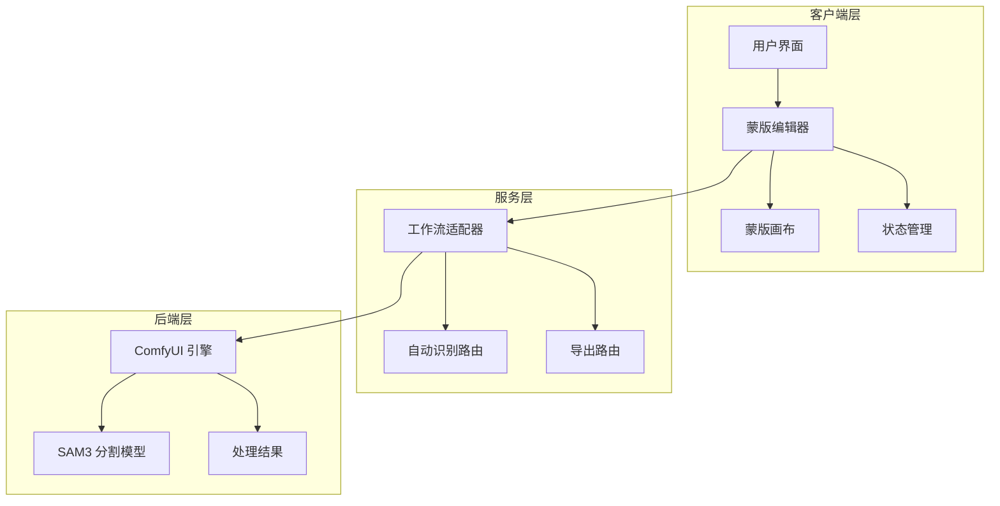
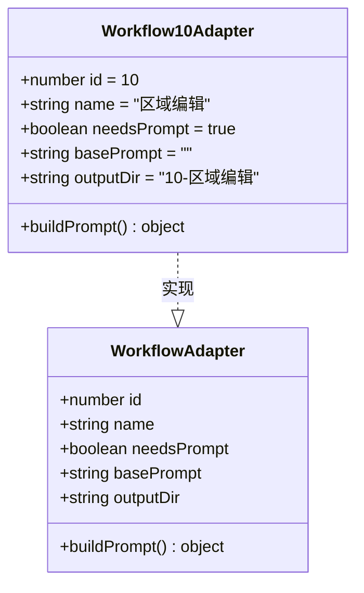
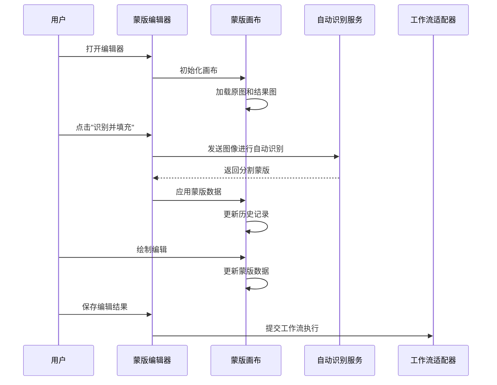
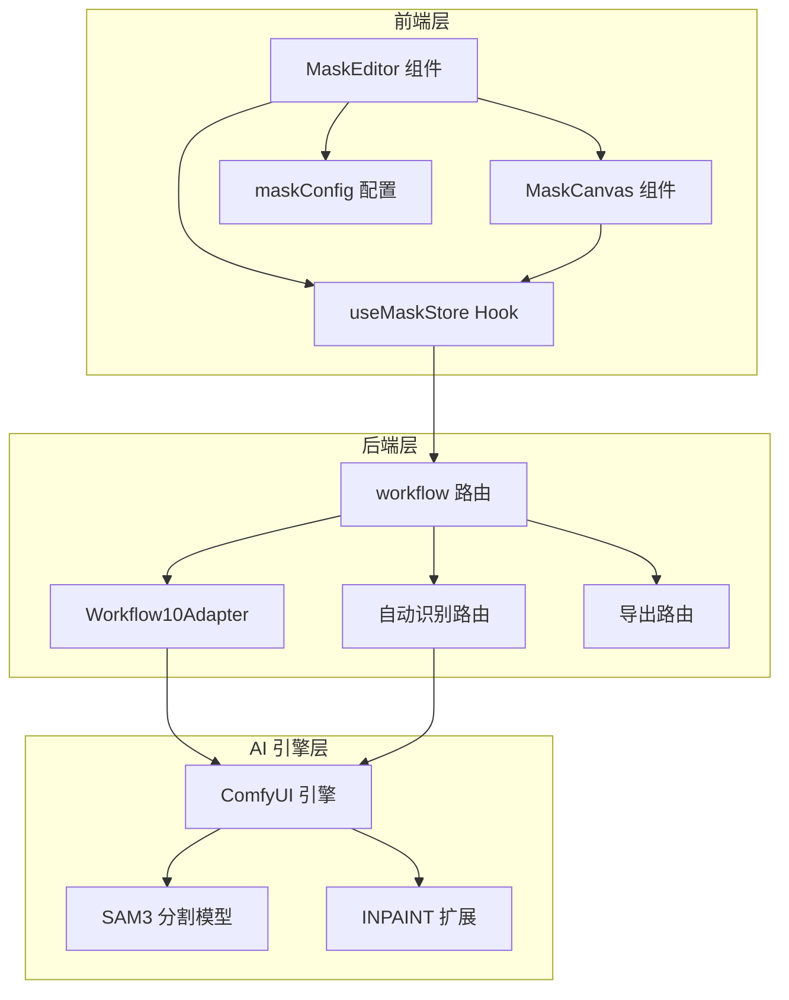
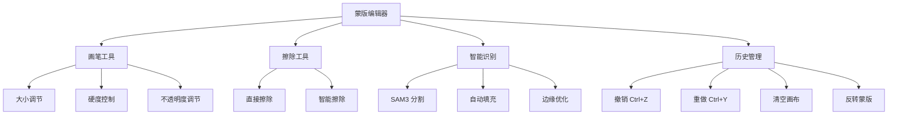
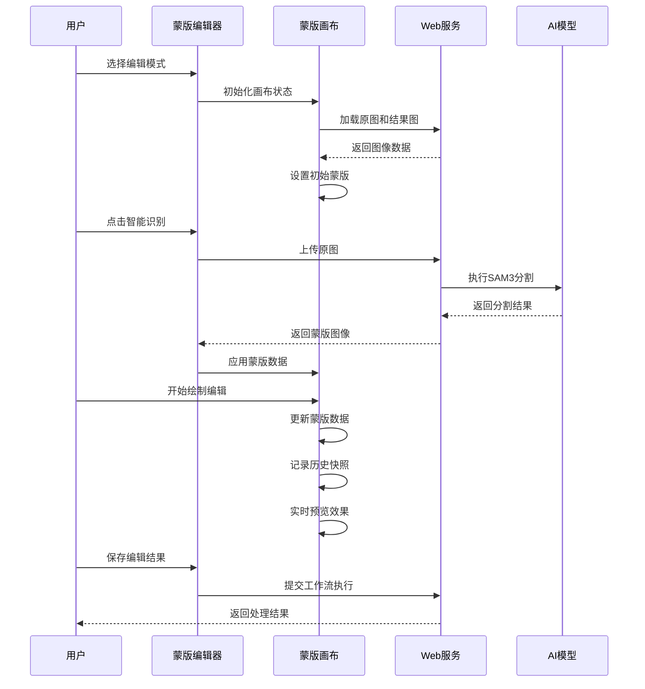
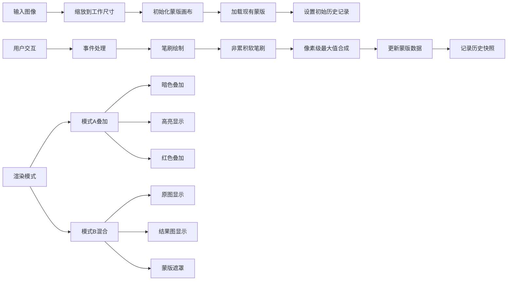
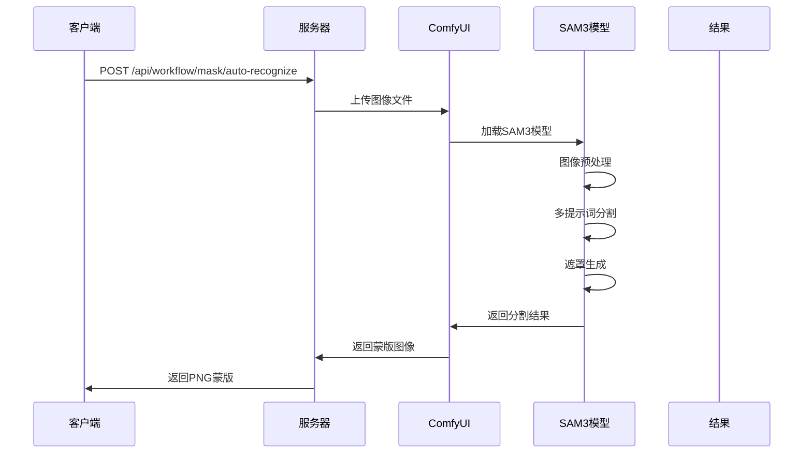
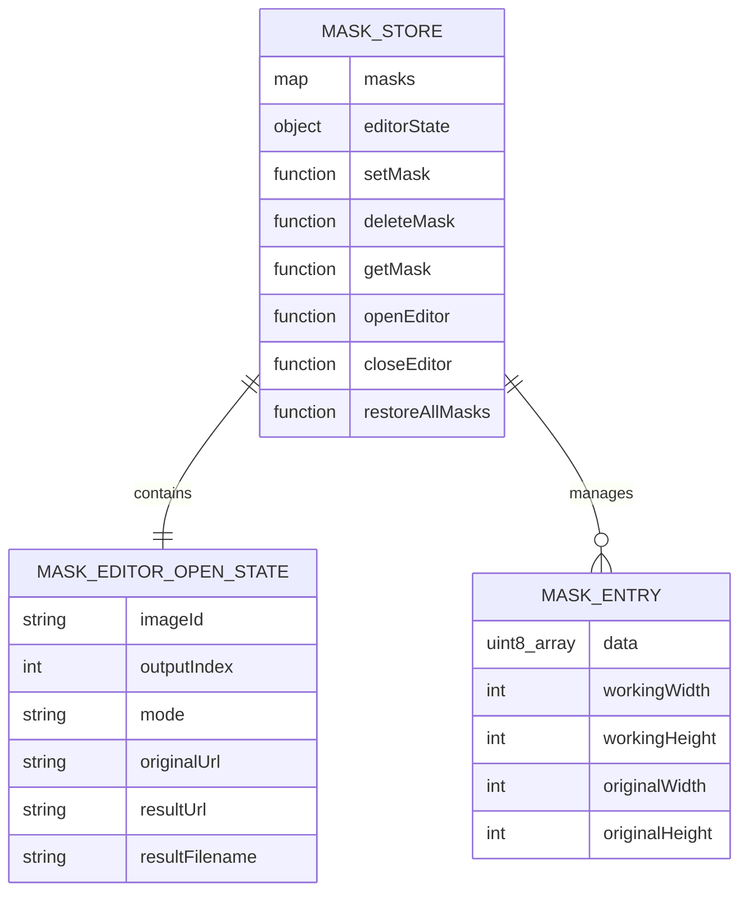
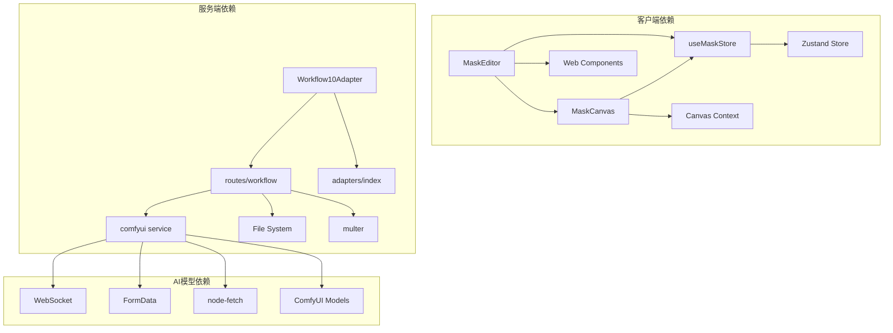

# 区域编辑适配器

<cite>
**本文档引用的文件**
- [BaseAdapter.ts](file://server/src/adapters/BaseAdapter.ts)
- [Workflow10Adapter.ts](file://server/src/adapters/Workflow10Adapter.ts)
- [workflow.ts](file://server/src/routes/workflow.ts)
- [MaskEditor.tsx](file://client/src/components/MaskEditor.tsx)
- [MaskCanvas.tsx](file://client/src/components/MaskCanvas.tsx)
- [useMaskStore.ts](file://client/src/hooks/useMaskStore.ts)
- [maskConfig.ts](file://client/src/config/maskConfig.ts)
- [Pix2Real-自动识别.json](file://ComfyUI_API/Pix2Real-自动识别.json)
</cite>

## 目录
1. [简介](#简介)
2. [项目结构](#项目结构)
3. [核心组件](#核心组件)
4. [架构概览](#架构概览)
5. [详细组件分析](#详细组件分析)
6. [依赖关系分析](#依赖关系分析)
7. [性能考虑](#性能考虑)
8. [故障排除指南](#故障排除指南)
9. [结论](#结论)

## 简介

区域编辑适配器是 CorineKit Pix2Real 项目中的一个关键工作流组件，专门用于实现智能分割和局部编辑功能。该适配器通过结合前端交互界面和后端 ComfyUI 工作流引擎，为用户提供了一个完整的区域编辑解决方案。

该系统的核心功能包括：
- 智能区域检测和精确分割
- 局部编辑和目标编辑
- 分割精度控制
- 编辑范围设置
- 边缘处理算法
- 实时预览和混合渲染

## 项目结构

项目采用前后端分离的架构设计，主要分为以下层次：

**图表来源**
- [MaskEditor.tsx:1-375](file://client/src/components/MaskEditor.tsx#L1-L375)
- [MaskCanvas.tsx:1-677](file://client/src/components/MaskCanvas.tsx#L1-L677)
- [Workflow10Adapter.ts:1-15](file://server/src/adapters/Workflow10Adapter.ts#L1-L15)

**章节来源**
- [BaseAdapter.ts:1-4](file://server/src/adapters/BaseAdapter.ts#L1-L4)
- [Workflow10Adapter.ts:1-15](file://server/src/adapters/Workflow10Adapter.ts#L1-L15)

## 核心组件

### 工作流适配器

工作流适配器是区域编辑功能的核心控制器，负责协调整个编辑流程：

**图表来源**
- [Workflow10Adapter.ts:1-15](file://server/src/adapters/Workflow10Adapter.ts#L1-L15)

### 蒙版编辑器

蒙版编辑器提供了直观的图形界面，支持多种编辑模式和工具：

**图表来源**
- [MaskEditor.tsx:196-235](file://client/src/components/MaskEditor.tsx#L196-L235)
- [MaskCanvas.tsx:110-150](file://client/src/components/MaskCanvas.tsx#L110-L150)

**章节来源**
- [MaskEditor.tsx:141-375](file://client/src/components/MaskEditor.tsx#L141-L375)
- [MaskCanvas.tsx:39-677](file://client/src/components/MaskCanvas.tsx#L39-L677)

## 架构概览

区域编辑系统的整体架构采用了分层设计，确保了功能的模块化和可维护性：

**图表来源**
- [workflow.ts:1-800](file://server/src/routes/workflow.ts#L1-L800)
- [maskConfig.ts:1-21](file://client/src/config/maskConfig.ts#L1-L21)

## 详细组件分析

### 蒙版编辑器组件

蒙版编辑器是用户交互的核心界面，提供了丰富的编辑工具和功能：

#### 主要功能特性

1. **多模式支持**：支持模式A叠加和模式B实时混合两种编辑模式
2. **智能识别**：集成自动分割功能，支持SAM3模型进行精确区域检测
3. **实时预览**：提供实时的编辑预览和混合渲染效果
4. **历史管理**：内置撤销/重做功能，支持最多30步历史记录

#### 编辑工具集

**图表来源**
- [MaskEditor.tsx:11-375](file://client/src/components/MaskEditor.tsx#L11-L375)

#### 编辑流程

**图表来源**
- [MaskEditor.tsx:196-235](file://client/src/components/MaskEditor.tsx#L196-L235)
- [MaskCanvas.tsx:180-201](file://client/src/components/MaskCanvas.tsx#L180-L201)

**章节来源**
- [MaskEditor.tsx:141-375](file://client/src/components/MaskEditor.tsx#L141-L375)

### 蒙版画布组件

蒙版画布是底层的渲染和编辑引擎，实现了高性能的图像处理功能：

#### 核心算法实现

1. **非累积软笔刷算法**：防止软边缘在重叠时硬化
2. **双缓冲合成**：strokeBaseCanvas和strokeLayerCanvas的组合
3. **像素级最大值合成**：确保不透明度的正确累积

#### 渲染管道

**图表来源**
- [MaskCanvas.tsx:203-230](file://client/src/components/MaskCanvas.tsx#L203-L230)
- [MaskCanvas.tsx:232-276](file://client/src/components/MaskCanvas.tsx#L232-L276)

#### 性能优化策略

1. **OffscreenCanvas 使用**：避免主线程阻塞
2. **请求动画帧优化**：仅在需要时重新渲染
3. **历史记录压缩**：限制最大历史步数
4. **增量更新**：只更新脏区域

**章节来源**
- [MaskCanvas.tsx:39-677](file://client/src/components/MaskCanvas.tsx#L39-L677)

### 自动识别服务

自动识别服务利用SAM3分割模型实现智能区域检测：

#### 分割流程

**图表来源**
- [workflow.ts:1372-1422](file://server/src/routes/workflow.ts#L1372-L1422)

#### 分割配置参数

| 参数 | 默认值 | 描述 |
|------|--------|------|
| grow | 20 | 遮罩扩展像素数 |
| blur | 50 | 遮罩模糊半径 |
| threshold | 0.4 | 分割阈值 |
| megapixels | 1.2 | 处理分辨率限制 |

**章节来源**
- [workflow.ts:1372-1422](file://server/src/routes/workflow.ts#L1372-L1422)
- [Pix2Real-自动识别.json:1-161](file://ComfyUI_API/Pix2Real-自动识别.json#L1-L161)

### 状态管理系统

状态管理系统负责维护蒙版编辑器的全局状态：

**图表来源**
- [useMaskStore.ts:1-51](file://client/src/hooks/useMaskStore.ts#L1-L51)

**章节来源**
- [useMaskStore.ts:1-51](file://client/src/hooks/useMaskStore.ts#L1-L51)

## 依赖关系分析

### 组件间依赖

**图表来源**
- [workflow.ts:1-800](file://server/src/routes/workflow.ts#L1-L800)
- [MaskEditor.tsx:1-375](file://client/src/components/MaskEditor.tsx#L1-L375)

### 外部依赖

| 依赖项 | 版本 | 用途 |
|--------|------|------|
| React | ^18.0 | 用户界面框架 |
| Zustand | ^4.0 | 状态管理 |
| node-fetch | ^3.0 | HTTP请求 |
| multer | ^1.4 | 文件上传 |
| ws | ^8.0 | WebSocket通信 |

**章节来源**
- [workflow.ts:1-800](file://server/src/routes/workflow.ts#L1-L800)

## 性能考虑

### 前端性能优化

1. **渲染优化**
   - 使用OffscreenCanvas避免主线程阻塞
   - 请求动画帧仅在需要时触发
   - 增量更新机制减少重绘开销

2. **内存管理**
   - 历史记录限制在30步以内
   - 及时释放临时图像对象
   - 合理的画布尺寸控制

3. **网络优化**
   - 图像尺寸自适应调整
   - 最大2048像素的工作尺寸限制
   - 批量操作合并请求

### 后端性能优化

1. **异步处理**
   - 自动识别使用独立的clientId
   - 轮询机制避免阻塞主流程
   - 超时控制机制

2. **资源管理**
   - ComfyUI连接池管理
   - 模型加载缓存
   - 内存使用监控

## 故障排除指南

### 常见问题及解决方案

#### 自动识别失败

**问题描述**：自动识别接口返回超时或错误

**可能原因**：
1. ComfyUI服务未启动
2. SAM3模型加载失败
3. 图像格式不支持
4. 内存不足

**解决步骤**：
1. 检查ComfyUI服务状态
2. 验证SAM3模型文件完整性
3. 确认图像格式为PNG/JPEG/WebP
4. 增加系统内存或降低图像分辨率

#### 编辑器无响应

**问题描述**：蒙版编辑器无法正常响应用户操作

**可能原因**：
1. 浏览器兼容性问题
2. Canvas上下文丢失
3. 内存泄漏

**解决步骤**：
1. 刷新页面重新加载
2. 检查浏览器控制台错误
3. 关闭其他占用内存的标签页
4. 清除浏览器缓存

#### 性能问题

**问题描述**：编辑操作卡顿或延迟

**可能原因**：
1. 图像过大
2. 历史记录过多
3. 硬件加速禁用

**解决步骤**：
1. 降低图像分辨率
2. 清理历史记录
3. 启用硬件加速
4. 关闭不必要的浏览器扩展

**章节来源**
- [workflow.ts:1372-1422](file://server/src/routes/workflow.ts#L1372-L1422)
- [MaskCanvas.tsx:180-201](file://client/src/components/MaskCanvas.tsx#L180-L201)

## 结论

区域编辑适配器通过精心设计的架构和算法实现了高效的智能分割和局部编辑功能。系统的主要优势包括：

1. **完整的功能链路**：从智能分割到局部编辑再到结果输出
2. **优秀的用户体验**：直观的图形界面和实时预览
3. **强大的技术基础**：基于SAM3的精确分割算法
4. **良好的性能表现**：优化的渲染和内存管理策略

该系统为用户提供了专业级的图像编辑能力，特别适用于需要精确控制编辑范围的应用场景。通过持续的优化和改进，区域编辑适配器将继续为用户提供更好的服务体验。