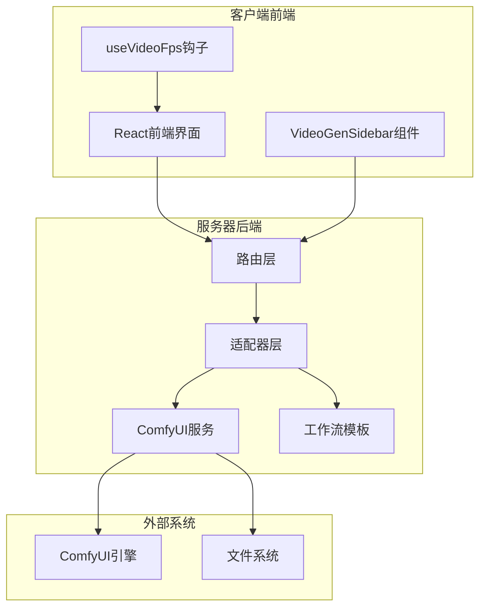
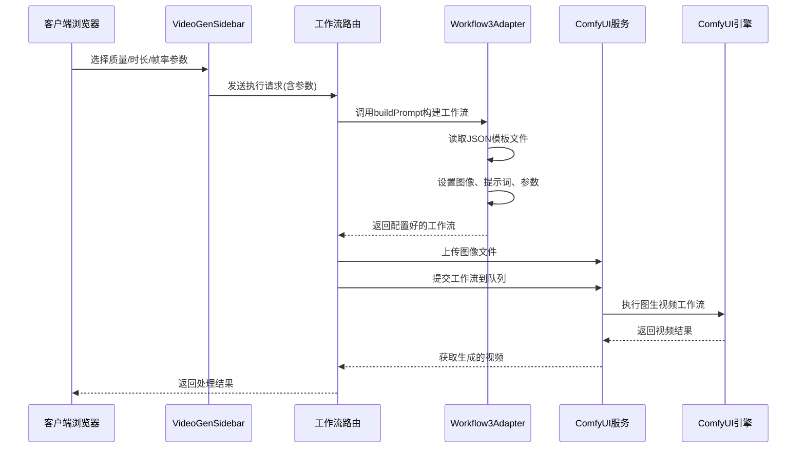
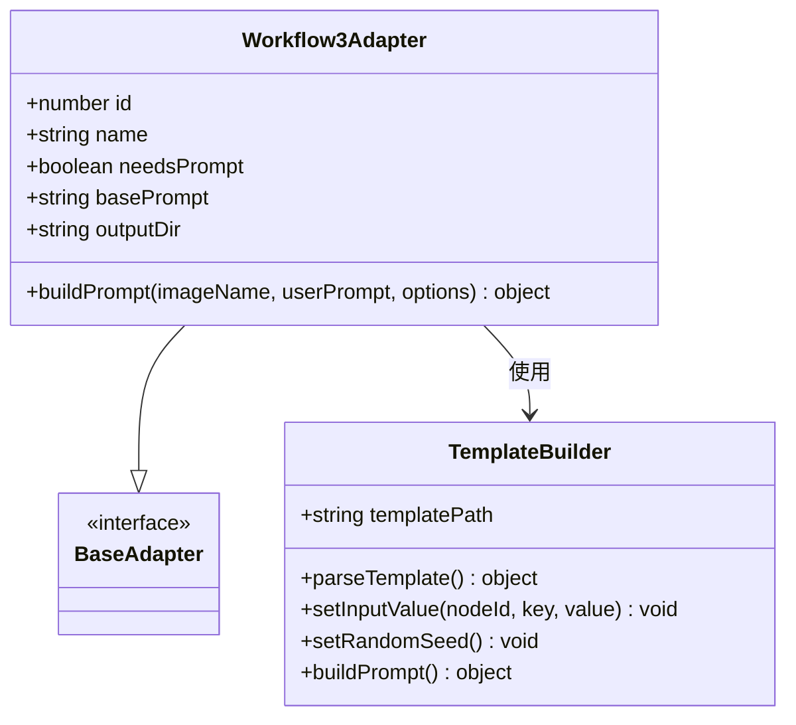
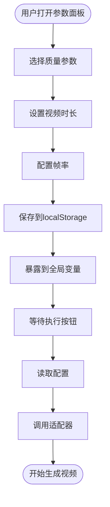
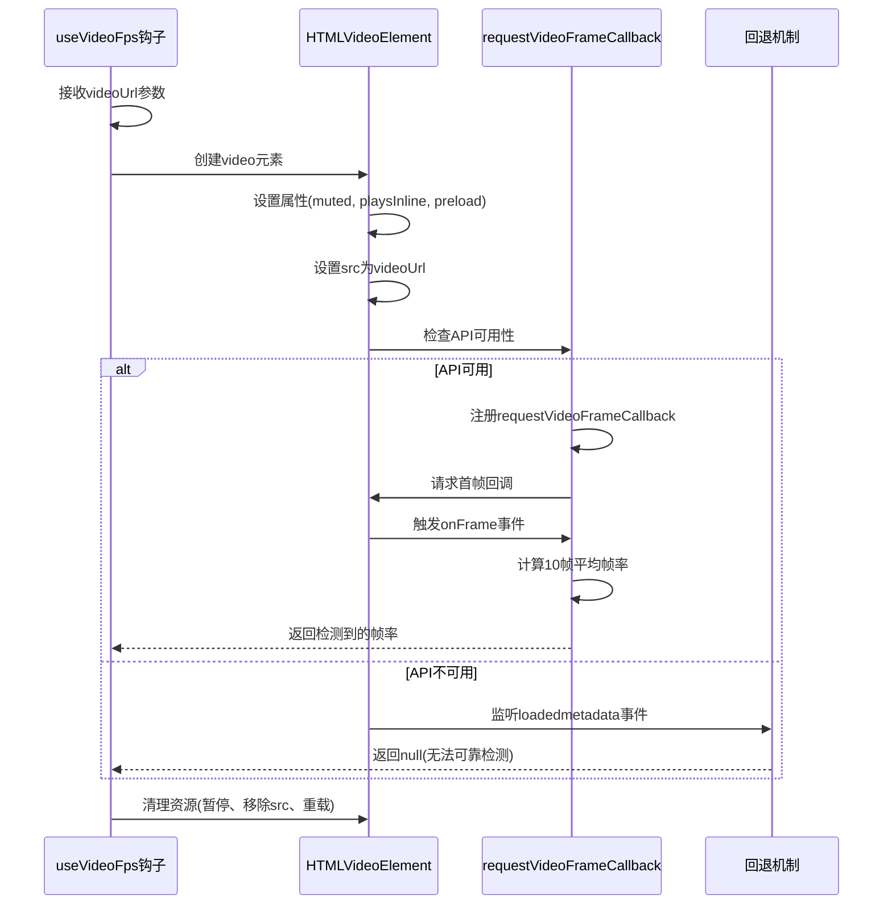
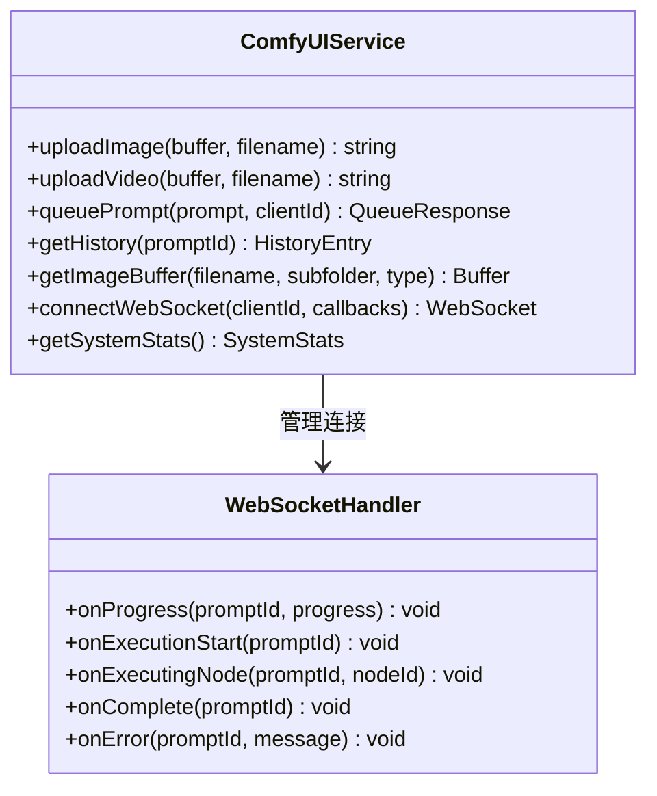
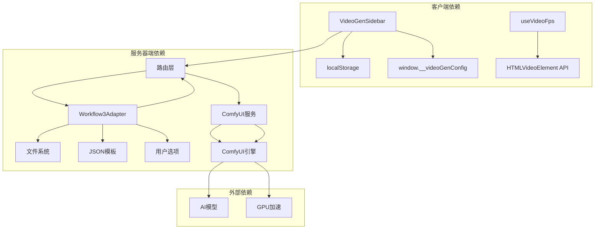

# 图生视频适配器

<cite>
**本文档引用的文件**
- [README.md](file://README.md)
- [Workflow3Adapter.ts](file://server/src/adapters/Workflow3Adapter.ts)
- [index.ts](file://server/src/adapters/index.ts)
- [3-Pix2Real-快速生成视频.json](file://ComfyUI_API/3-Pix2Real-快速生成视频.json)
- [VideoGenSidebar.tsx](file://client/src/components/VideoGenSidebar.tsx)
- [useVideoFps.ts](file://client/src/hooks/useVideoFps.ts)
- [comfyui.ts](file://server/src/services/comfyui.ts)
- [workflow.ts](file://server/src/routes/workflow.ts)
</cite>

## 目录
1. [简介](#简介)
2. [项目结构](#项目结构)
3. [核心组件](#核心组件)
4. [架构概览](#架构概览)
5. [详细组件分析](#详细组件分析)
6. [依赖关系分析](#依赖关系分析)
7. [性能考虑](#性能考虑)
8. [故障排除指南](#故障排除指南)
9. [结论](#结论)
10. [附录](#附录)

## 简介
本文件为图生视频工作流适配器的技术文档，专注于静态图像到视频序列的转换流程。该适配器通过ComfyUI工作流实现，支持帧率设置、运动效果添加和时长控制等核心功能，并提供质量控制选项和输出格式选择。文档将详细解释适配器如何将用户输入的静态图像转换为视频序列，包括参数配置、质量控制和输出格式等关键环节。

根据项目README描述，该系统提供了5种内置工作流，其中ID为3的工作流专门用于"快速生成视频"，这正是本文档关注的重点。

**章节来源**
- [README.md:64-72](file://README.md#L64-L72)

## 项目结构
该项目采用前后端分离架构，主要分为客户端前端应用和服务器后端服务两大部分：

**图表来源**
- [README.md:41-62](file://README.md#L41-L62)

项目采用适配器模式设计，每个工作流都有对应的适配器类来处理特定的参数配置和模板构建。图生视频工作流位于适配器层的第3个适配器中。

**章节来源**
- [README.md:41-62](file://README.md#L41-L62)

## 核心组件
图生视频适配器由以下核心组件构成：

### 适配器层组件
- **Workflow3Adapter**: 主要的适配器类，负责构建图生视频工作流的JSON模板
- **BaseAdapter**: 适配器的基础接口定义
- **适配器索引**: 管理所有工作流适配器的注册和查找

### 客户端组件
- **VideoGenSidebar**: 视频生成参数配置界面，提供质量、时长和帧率的选择
- **useVideoFps**: 视频帧率检测钩子，用于实时显示视频的实际帧率

### 服务层组件
- **ComfyUI服务**: 与ComfyUI引擎通信的服务层，处理图像上传、工作流排队等操作
- **工作流路由**: 处理HTTP请求，协调各个组件完成图像到视频的转换

**章节来源**
- [Workflow3Adapter.ts:1-41](file://server/src/adapters/Workflow3Adapter.ts#L1-L41)
- [index.ts:14-33](file://server/src/adapters/index.ts#L14-L33)
- [VideoGenSidebar.tsx:1-154](file://client/src/components/VideoGenSidebar.tsx#L1-L154)

## 架构概览
图生视频工作流的整体架构如下：

**图表来源**
- [workflow.ts:750-799](file://server/src/routes/workflow.ts#L750-L799)
- [Workflow3Adapter.ts:16-39](file://server/src/adapters/Workflow3Adapter.ts#L16-L39)

该架构实现了清晰的职责分离：客户端负责参数配置和用户交互，服务器端负责工作流编排和执行，ComfyUI引擎负责具体的图像处理。

**章节来源**
- [workflow.ts:750-799](file://server/src/routes/workflow.ts#L750-L799)

## 详细组件分析

### Workflow3Adapter组件分析
Workflow3Adapter是图生视频工作流的核心适配器，负责将静态图像转换为视频序列。

**图表来源**
- [Workflow3Adapter.ts:9-39](file://server/src/adapters/Workflow3Adapter.ts#L9-L39)

#### 关键功能特性
1. **参数配置**: 通过options参数接受用户设置的质量、时长和帧率
2. **模板构建**: 读取JSON模板文件并动态修改关键节点参数
3. **随机种子**: 为每次生成设置随机噪声种子，确保结果的多样性

#### 核心参数映射
适配器将客户端传递的参数映射到工作流模板的关键节点：

| 客户端参数 | ComfyUI节点 | 参数名称 | 默认值 |
|-----------|------------|----------|--------|
| megapixels | 节点458 | megapixels | 1.0 |
| seconds | 节点258 | value | 4 |
| fps | 节点413 | value | 16 |

**章节来源**
- [Workflow3Adapter.ts:16-39](file://server/src/adapters/Workflow3Adapter.ts#L16-L39)

### VideoGenSidebar组件分析
VideoGenSidebar是客户端的参数配置界面，提供直观的参数选择功能。

**图表来源**
- [VideoGenSidebar.tsx:29-52](file://client/src/components/VideoGenSidebar.tsx#L29-L52)

#### 参数选项设计
组件提供了经过精心设计的参数选项：

1. **质量选项**: 草稿(0.5)、中等(0.8)、原图(1.0)，对应不同的像素数目标
2. **时长选项**: 4秒、6秒、8秒，满足不同场景需求
3. **帧率选项**: 草稿(12fps)、流畅(16fps)、精细(24fps)，平衡质量和性能

#### 状态管理机制
- 使用localStorage持久化用户偏好设置
- 通过全局window对象暴露配置给执行函数
- 实现响应式状态更新和组件卸载时的清理

**章节来源**
- [VideoGenSidebar.tsx:1-154](file://client/src/components/VideoGenSidebar.tsx#L1-L154)

### useVideoFps钩子分析
useVideoFps钩子提供了视频帧率的自动检测功能。

**图表来源**
- [useVideoFps.ts:8-76](file://client/src/hooks/useVideoFps.ts#L8-L76)

#### 检测策略
钩子采用了双策略检测机制：

1. **优先策略**: 使用requestVideoFrameCallback API进行精确检测
2. **回退策略**: 在API不可用时返回null，避免误导用户

#### 性能优化
- 仅检测10帧以获得稳定平均值
- 自动清理资源避免内存泄漏
- 支持组件卸载时的资源回收

**章节来源**
- [useVideoFps.ts:1-77](file://client/src/hooks/useVideoFps.ts#L1-L77)

### ComfyUI服务层分析
ComfyUI服务层提供了与ComfyUI引擎通信的完整接口。

**图表来源**
- [comfyui.ts:9-472](file://server/src/services/comfyui.ts#L9-L472)

#### 进度追踪机制
服务层实现了详细的进度追踪系统：

1. **节点权重计算**: 基于节点类型和输入参数计算相对权重
2. **阶段化进度**: 将复杂工作流分解为可理解的阶段
3. **全局百分比**: 结合节点权重计算整体进度

#### 错误处理策略
- 统一的错误映射机制，将技术错误转换为用户友好的提示
- 支持多种类型的错误处理和恢复

**章节来源**
- [comfyui.ts:47-166](file://server/src/services/comfyui.ts#L47-L166)

## 依赖关系分析
图生视频适配器的依赖关系如下：

**图表来源**
- [index.ts:14-33](file://server/src/adapters/index.ts#L14-L33)
- [workflow.ts:9-12](file://server/src/routes/workflow.ts#L9-L12)

### 适配器注册机制
系统通过适配器索引集中管理所有工作流适配器：

- **集中注册**: 所有适配器在index.ts中统一注册
- **动态查找**: 通过getAdapter函数按ID获取对应适配器
- **类型安全**: 使用TypeScript接口确保适配器的一致性

### 模板继承关系
图生视频工作流使用了复杂的模板继承和参数传递机制：

1. **基础模板**: 从3-Pix2Real-快速生成视频.json加载
2. **参数注入**: 通过节点ID映射将用户参数注入到特定位置
3. **动态配置**: 根据用户选择动态调整工作流参数

**章节来源**
- [index.ts:14-33](file://server/src/adapters/index.ts#L14-L33)
- [3-Pix2Real-快速生成视频.json:1-418](file://ComfyUI_API/3-Pix2Real-快速生成视频.json#L1-L418)

## 性能考虑
图生视频工作流在性能方面有以下考虑：

### 质量与性能平衡
- **质量等级**: 通过megapixels参数控制输出质量，草稿(0.5)适合快速预览，原图(1.0)适合最终输出
- **帧率选择**: 12fps适合草稿，16fps提供流畅体验，24fps适合高质量输出
- **时长控制**: 4-8秒的时长范围满足大多数应用场景

### 资源优化策略
- **内存管理**: 适配器中包含显存清理节点，避免长时间运行导致的内存泄漏
- **批处理支持**: 支持批量处理多个图像，提高整体效率
- **缓存机制**: 利用ComfyUI的缓存机制减少重复计算

### 并行处理能力
- **多工作流并行**: 系统支持同时运行多个不同类型的工作流
- **异步处理**: 使用Promise和WebSocket实现实时进度反馈
- **资源池管理**: 合理分配GPU和CPU资源

## 故障排除指南
针对图生视频工作流可能遇到的问题，提供以下解决方案：

### 常见问题及解决方法

#### 1. 工作流执行失败
**症状**: 提交工作流后无响应或报错
**可能原因**:
- ComfyUI服务未启动
- 模型文件缺失
- 图像格式不支持

**解决步骤**:
1. 检查ComfyUI服务状态
2. 验证相关模型文件是否存在
3. 确认图像格式为PNG/JPEG/WebP

#### 2. 视频帧率检测失败
**症状**: useVideoFps返回null
**可能原因**:
- 浏览器不支持requestVideoFrameCallback API
- 视频文件损坏
- 网络问题导致视频加载失败

**解决方法**:
1. 更新到支持该API的浏览器版本
2. 检查视频文件完整性
3. 确保网络连接稳定

#### 3. 显存不足
**症状**: 生成过程中出现内存不足错误
**解决方法**:
1. 降低质量设置
2. 减少视频时长
3. 使用更低的帧率
4. 清理其他应用程序占用的显存

**章节来源**
- [comfyui.ts:126-144](file://server/src/services/comfyui.ts#L126-L144)

## 结论
图生视频适配器通过精心设计的架构实现了从静态图像到视频序列的高效转换。该系统具有以下优势：

1. **模块化设计**: 采用适配器模式，便于扩展和维护
2. **用户友好**: 提供直观的参数配置界面和实时进度反馈
3. **性能优化**: 平衡质量与性能，支持多种配置选项
4. **错误处理**: 完善的错误处理和用户友好的提示机制

通过合理配置质量、时长和帧率参数，用户可以生成满足不同需求的视频内容。系统的设计充分考虑了实际使用场景，在保证质量的同时提供了良好的用户体验。

## 附录

### 参数配置最佳实践
根据不同应用场景推荐以下参数组合：

#### 社交媒体短视频
- 质量: 中等(0.8)
- 时长: 4-6秒
- 帧率: 16fps

#### 高质量演示视频
- 质量: 原图(1.0)
- 时长: 6-8秒
- 帧率: 24fps

#### 快速预览
- 质量: 草稿(0.5)
- 时长: 4秒
- 帧率: 12fps

### 技术规格
- **支持的输入格式**: PNG, JPEG, WebP
- **输出格式**: MP4(H.264)
- **分辨率范围**: 512-2048像素
- **最大时长**: 15秒
- **帧率范围**: 12-60fps