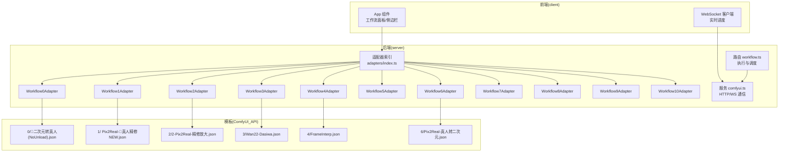
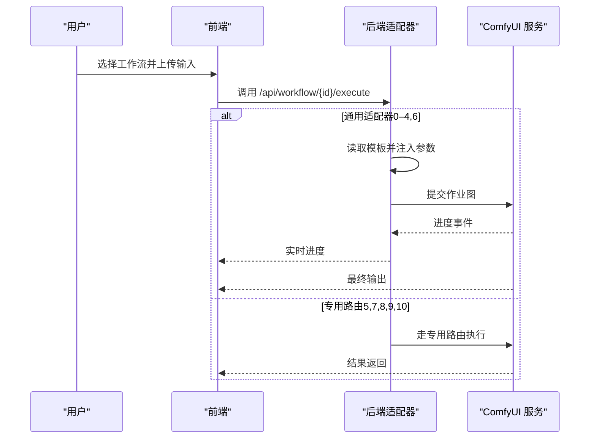
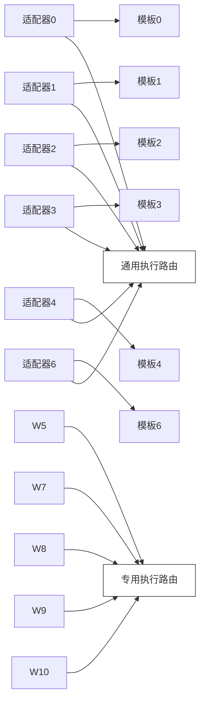

# 工作流适配器集合

<cite>
**本文引用的文件**
- [README.md](file://README.md)
- [server/src/adapters/BaseAdapter.ts](file://server/src/adapters/BaseAdapter.ts)
- [server/src/adapters/index.ts](file://server/src/adapters/index.ts)
- [server/src/adapters/Workflow0Adapter.ts](file://server/src/adapters/Workflow0Adapter.ts)
- [server/src/adapters/Workflow1Adapter.ts](file://server/src/adapters/Workflow1Adapter.ts)
- [server/src/adapters/Workflow2Adapter.ts](file://server/src/adapters/Workflow2Adapter.ts)
- [server/src/adapters/Workflow3Adapter.ts](file://server/src/adapters/Workflow3Adapter.ts)
- [server/src/adapters/Workflow4Adapter.ts](file://server/src/adapters/Workflow4Adapter.ts)
- [server/src/adapters/Workflow5Adapter.ts](file://server/src/adapters/Workflow5Adapter.ts)
- [server/src/adapters/Workflow6Adapter.ts](file://server/src/adapters/Workflow6Adapter.ts)
- [server/src/adapters/Workflow7Adapter.ts](file://server/src/adapters/Workflow7Adapter.ts)
- [server/src/adapters/Workflow8Adapter.ts](file://server/src/adapters/Workflow8Adapter.ts)
- [server/src/adapters/Workflow9Adapter.ts](file://server/src/adapters/Workflow9Adapter.ts)
- [server/src/adapters/Workflow10Adapter.ts](file://server/src/adapters/Workflow10Adapter.ts)
- [ComfyUI_API/👻二次元转真人(NoUnload).json](file://ComfyUI_API/👻二次元转真人(NoUnload).json)
- [ComfyUI_API/Pix2Real-👻真人精修NEW.json](file://ComfyUI_API/Pix2Real-👻真人精修NEW.json)
- [ComfyUI_API/2-Pix2Real-精修放大.json](file://ComfyUI_API/2-Pix2Real-精修放大.json)
- [ComfyUI_API/Wan22-Dasiwa.json](file://ComfyUI_API/Wan22-Dasiwa.json)
- [ComfyUI_API/FrameInterp.json](file://ComfyUI_API/FrameInterp.json)
- [ComfyUI_API/Pix2Real-真人转二次元.json](file://ComfyUI_API/Pix2Real-真人转二次元.json)
</cite>

## 目录
1. [简介](#简介)
2. [项目结构](#项目结构)
3. [核心组件](#核心组件)
4. [架构总览](#架构总览)
5. [详细组件分析](#详细组件分析)
6. [依赖关系分析](#依赖关系分析)
7. [性能与资源管理](#性能与资源管理)
8. [故障排查指南](#故障排查指南)
9. [结论](#结论)
10. [附录：适配器选择与使用场景](#附录适配器选择与使用场景)

## 简介
本文件面向 CorineKit Pix2Real 的工作流适配器集合，系统性梳理 11 个工作流适配器（编号 0–10）的实现细节、参数配置、执行流程与输出处理方式，并总结各适配器之间的差异与共性，提供适配器选择指南与典型使用场景。

## 项目结构
- 后端采用 Express + TypeScript，适配器集中于 server/src/adapters 目录，按编号组织（0–10），统一通过索引导出并注册。
- 前端为 Vite + React + TypeScript，负责用户交互、拖拽上传、工作流选择与进度展示。
- ComfyUI 工作流模板位于 ComfyUI_API 目录，适配器在运行时读取对应模板并注入输入参数（如图像名、提示词、种子、选项等）。

图表来源
- [server/src/adapters/index.ts:1-33](file://server/src/adapters/index.ts#L1-L33)
- [server/src/adapters/Workflow0Adapter.ts:1-35](file://server/src/adapters/Workflow0Adapter.ts#L1-L35)
- [server/src/adapters/Workflow1Adapter.ts:1-36](file://server/src/adapters/Workflow1Adapter.ts#L1-L36)
- [server/src/adapters/Workflow2Adapter.ts:1-28](file://server/src/adapters/Workflow2Adapter.ts#L1-L28)
- [server/src/adapters/Workflow3Adapter.ts:1-41](file://server/src/adapters/Workflow3Adapter.ts#L1-L41)
- [server/src/adapters/Workflow4Adapter.ts:1-28](file://server/src/adapters/Workflow4Adapter.ts#L1-L28)
- [server/src/adapters/Workflow6Adapter.ts:1-36](file://server/src/adapters/Workflow6Adapter.ts#L1-L36)
- [ComfyUI_API/👻二次元转真人(NoUnload).json](file://ComfyUI_API/👻二次元转真人(NoUnload).json)
- [ComfyUI_API/Pix2Real-👻真人精修NEW.json](file://ComfyUI_API/Pix2Real-👻真人精修NEW.json)
- [ComfyUI_API/2-Pix2Real-精修放大.json](file://ComfyUI_API/2-Pix2Real-精修放大.json)
- [ComfyUI_API/Wan22-Dasiwa.json](file://ComfyUI_API/Wan22-Dasiwa.json)
- [ComfyUI_API/FrameInterp.json](file://ComfyUI_API/FrameInterp.json)
- [ComfyUI_API/Pix2Real-真人转二次元.json](file://ComfyUI_API/Pix2Real-真人转二次元.json)

章节来源
- [README.md:41-79](file://README.md#L41-L79)
- [server/src/adapters/index.ts:1-33](file://server/src/adapters/index.ts#L1-L33)

## 核心组件
- 适配器接口与基类
  - 适配器类型由 BaseAdapter 导出，定义了统一的 WorkflowAdapter 接口契约。
  - 适配器索引模块将 0–10 号适配器集中注册，提供按 ID 获取适配器的能力。
- 适配器职责
  - 加载对应 ComfyUI 模板文件
  - 注入输入参数（图像名、提示词、随机种子、可选参数）
  - 返回可直接提交给 ComfyUI 执行的作业图对象
- 输出目录
  - 每个适配器声明独立的输出目录，用于归档生成结果

章节来源
- [server/src/adapters/BaseAdapter.ts:1-4](file://server/src/adapters/BaseAdapter.ts#L1-L4)
- [server/src/adapters/index.ts:1-33](file://server/src/adapters/index.ts#L1-L33)

## 架构总览
- 适配器模式：每个工作流一个适配器，职责单一，便于扩展与维护。
- 模板驱动：适配器从 ComfyUI_API 读取 JSON 模板，仅修改必要节点，降低耦合。
- 参数注入：根据 needsPrompt/basePrompt/userPrompt/可选参数 options，动态设置节点输入。
- 执行路径：通用路径（0–4、6）与专用路由（5、7、8、9、10）并存，部分适配器不直接通过 buildPrompt 返回模板，而是走独立路由。

图表来源
- [server/src/adapters/Workflow0Adapter.ts:16-33](file://server/src/adapters/Workflow0Adapter.ts#L16-L33)
- [server/src/adapters/Workflow1Adapter.ts:16-34](file://server/src/adapters/Workflow1Adapter.ts#L16-L34)
- [server/src/adapters/Workflow2Adapter.ts:16-26](file://server/src/adapters/Workflow2Adapter.ts#L16-L26)
- [server/src/adapters/Workflow3Adapter.ts:16-39](file://server/src/adapters/Workflow3Adapter.ts#L16-L39)
- [server/src/adapters/Workflow4Adapter.ts:16-26](file://server/src/adapters/Workflow4Adapter.ts#L16-L26)
- [server/src/adapters/Workflow5Adapter.ts:11-13](file://server/src/adapters/Workflow5Adapter.ts#L11-L13)
- [server/src/adapters/Workflow7Adapter.ts:10-12](file://server/src/adapters/Workflow7Adapter.ts#L10-L12)
- [server/src/adapters/Workflow8Adapter.ts:10-12](file://server/src/adapters/Workflow8Adapter.ts#L10-L12)
- [server/src/adapters/Workflow9Adapter.ts:10-12](file://server/src/adapters/Workflow9Adapter.ts#L10-L12)
- [server/src/adapters/Workflow10Adapter.ts:11-13](file://server/src/adapters/Workflow10Adapter.ts#L11-L13)

## 详细组件分析

### 适配器 0：二次元转真人
- 功能特性
  - 将二次元风格图像转换为写实照片风格
  - 支持附加用户提示词，增强风格或细节控制
- 参数配置
  - 需要提示词（needsPrompt=true）
  - 默认基础提示词包含“写实化”与地域特征描述
  - 输入图像节点：模板中编号节点设置为上传图像名
  - 提示词节点：模板中文本编码节点设置为 basePrompt + 用户提示词
  - 随机种子：采样器节点随机化
- 执行流程
  - 读取模板 -> 设置图像 -> 合成提示词 -> 随机种子 -> 返回作业图
- 输出处理
  - 输出目录：0-二次元转真人

章节来源
- [server/src/adapters/Workflow0Adapter.ts:1-35](file://server/src/adapters/Workflow0Adapter.ts#L1-L35)
- [ComfyUI_API/👻二次元转真人(NoUnload).json](file://ComfyUI_API/👻二次元转真人(NoUnload).json)

### 适配器 1：真人精修
- 功能特性
  - 对真人图像进行高质量精修与细节增强
  - 内置丰富正向提示词，强调高分辨率与细节表现
- 参数配置
  - 需要提示词（needsPrompt=true）
  - 默认基础提示词偏向高质量与细节描述
  - 图像节点与提示词节点设置逻辑同上
  - 种子节点随机化
- 执行流程
  - 读取模板 -> 设置图像 -> 合成提示词 -> 随机种子 -> 返回作业图
- 输出处理
  - 输出目录：1-真人精修

章节来源
- [server/src/adapters/Workflow1Adapter.ts:1-36](file://server/src/adapters/Workflow1Adapter.ts#L1-L36)
- [ComfyUI_API/Pix2Real-👻真人精修NEW.json](file://ComfyUI_API/Pix2Real-👻真人精修NEW.json)

### 适配器 2：精修放大
- 功能特性
  - 在保持高质量的前提下对图像进行放大
  - 不需要提示词
- 参数配置
  - 不需要提示词（needsPrompt=false）
  - 输入图像节点设置为上传图像名
  - 种子节点随机化
- 执行流程
  - 读取模板 -> 设置图像 -> 随机种子 -> 返回作业图
- 输出处理
  - 输出目录：2-精修放大

章节来源
- [server/src/adapters/Workflow2Adapter.ts:1-28](file://server/src/adapters/Workflow2Adapter.ts#L1-L28)
- [ComfyUI_API/2-Pix2Real-精修放大.json](file://ComfyUI_API/2-Pix2Real-精修放大.json)

### 适配器 3：图生视频
- 功能特性
  - 将静态图像生成短视频序列
  - 支持自定义提示词与视频参数（时长、帧率、质量）
- 参数配置
  - 需要提示词（needsPrompt=true）
  - 默认基础提示词提供自然动作描述
  - 关键参数（秒数、FPS、质量）来自 options
  - 噪声种子随机化
- 执行流程
  - 读取模板 -> 设置图像 -> 设置提示词 -> 注入可选参数 -> 随机噪声种子 -> 返回作业图
- 输出处理
  - 输出目录：3-图生视频

章节来源
- [server/src/adapters/Workflow3Adapter.ts:1-41](file://server/src/adapters/Workflow3Adapter.ts#L1-L41)
- [ComfyUI_API/Wan22-Dasiwa.json](file://ComfyUI_API/Wan22-Dasiwa.json)

### 适配器 4：视频补帧
- 功能特性
  - 对现有视频进行补帧以提升流畅度
  - 通过倍数参数控制输出帧数增长
- 参数配置
  - 不需要提示词（needsPrompt=false）
  - 关键参数（倍数）来自 options
- 执行流程
  - 读取模板 -> 设置视频 -> 设置倍数 -> 返回作业图
- 输出处理
  - 输出目录：4-视频补帧

章节来源
- [server/src/adapters/Workflow4Adapter.ts:1-28](file://server/src/adapters/Workflow4Adapter.ts#L1-L28)
- [ComfyUI_API/FrameInterp.json](file://ComfyUI_API/FrameInterp.json)

### 适配器 5：解除装备
- 特殊说明
  - 该适配器不通过通用 buildPrompt 返回模板，而是使用专用 /5/execute 路由
  - 适配器保留名称与输出目录，便于统一管理
- 执行流程
  - 由专用路由接管执行，不在通用适配器链路内

章节来源
- [server/src/adapters/Workflow5Adapter.ts:1-15](file://server/src/adapters/Workflow5Adapter.ts#L1-L15)

### 适配器 6：真人转二次元
- 功能特性
  - 将真人图像转换为二次元风格
  - 支持用户提示词；若为空则回退到自动标签路径
- 参数配置
  - 需要提示词（needsPrompt=true）
  - 用户提示词为空时，模板内部逻辑会回退至自动标签
  - 两个采样器节点均设置随机种子
- 执行流程
  - 读取模板 -> 设置图像 -> 设置提示词（空则自动标签）-> 随机种子 -> 返回作业图
- 输出处理
  - 输出目录：6-真人转二次元

章节来源
- [server/src/adapters/Workflow6Adapter.ts:1-36](file://server/src/adapters/Workflow6Adapter.ts#L1-L36)
- [ComfyUI_API/Pix2Real-真人转二次元.json](file://ComfyUI_API/Pix2Real-真人转二次元.json)

### 适配器 7：快速出图
- 特殊说明
  - 该适配器不通过通用 buildPrompt 返回模板，而是使用专用路由
  - 适配器保留名称与输出目录，便于统一管理
- 执行流程
  - 由专用路由接管执行，不在通用适配器链路内

章节来源
- [server/src/adapters/Workflow7Adapter.ts:1-14](file://server/src/adapters/Workflow7Adapter.ts#L1-L14)

### 适配器 8：黑兽换脸
- 特殊说明
  - 该适配器不通过通用 buildPrompt 返回模板，而是使用专用路由
  - 适配器保留名称与输出目录，便于统一管理
- 执行流程
  - 由专用路由接管执行，不在通用适配器链路内

章节来源
- [server/src/adapters/Workflow8Adapter.ts:1-14](file://server/src/adapters/Workflow8Adapter.ts#L1-L14)

### 适配器 9：ZIT 快出
- 特殊说明
  - 该适配器不通过通用 buildPrompt 返回模板，而是使用专用路由
  - 适配器保留名称与输出目录，便于统一管理
- 执行流程
  - 由专用路由接管执行，不在通用适配器链路内

章节来源
- [server/src/adapters/Workflow9Adapter.ts:1-14](file://server/src/adapters/Workflow9Adapter.ts#L1-L14)

### 适配器 10：区域编辑
- 特殊说明
  - 该适配器不通过通用 buildPrompt 返回模板，而是使用专用路由
  - 适配器保留名称与输出目录，便于统一管理
- 执行流程
  - 由专用路由接管执行，不在通用适配器链路内

章节来源
- [server/src/adapters/Workflow10Adapter.ts:1-15](file://server/src/adapters/Workflow10Adapter.ts#L1-L15)

## 依赖关系分析
- 适配器与模板的依赖
  - 每个适配器依赖一个 ComfyUI 模板文件，通过绝对路径读取
  - 适配器仅修改必要的节点输入，避免对模板结构的侵入式改动
- 适配器与路由的依赖
  - 0–4、6 使用通用执行路由
  - 5、7、8、9、10 使用专用执行路由
- 适配器与输出目录
  - 每个适配器声明独立输出目录，便于结果归档与检索

图表来源
- [server/src/adapters/Workflow0Adapter.ts:7-33](file://server/src/adapters/Workflow0Adapter.ts#L7-L33)
- [server/src/adapters/Workflow1Adapter.ts:7-34](file://server/src/adapters/Workflow1Adapter.ts#L7-L34)
- [server/src/adapters/Workflow2Adapter.ts:7-26](file://server/src/adapters/Workflow2Adapter.ts#L7-L26)
- [server/src/adapters/Workflow3Adapter.ts:7-39](file://server/src/adapters/Workflow3Adapter.ts#L7-L39)
- [server/src/adapters/Workflow4Adapter.ts:7-26](file://server/src/adapters/Workflow4Adapter.ts#L7-L26)
- [server/src/adapters/Workflow6Adapter.ts:7-34](file://server/src/adapters/Workflow6Adapter.ts#L7-L34)
- [server/src/adapters/Workflow5Adapter.ts:11-13](file://server/src/adapters/Workflow5Adapter.ts#L11-L13)
- [server/src/adapters/Workflow7Adapter.ts:10-12](file://server/src/adapters/Workflow7Adapter.ts#L10-L12)
- [server/src/adapters/Workflow8Adapter.ts:10-12](file://server/src/adapters/Workflow8Adapter.ts#L10-L12)
- [server/src/adapters/Workflow9Adapter.ts:10-12](file://server/src/adapters/Workflow9Adapter.ts#L10-L12)
- [server/src/adapters/Workflow10Adapter.ts:11-13](file://server/src/adapters/Workflow10Adapter.ts#L11-L13)

章节来源
- [server/src/adapters/index.ts:14-30](file://server/src/adapters/index.ts#L14-L30)

## 性能与资源管理
- 随机种子策略
  - 多数适配器在构建作业图时为采样器节点设置随机种子，有助于获得多样化结果
- 模板复用与轻量修改
  - 通过读取模板并仅修改必要节点，减少重复构造成本
- 专用路由的适用场景
  - 对于复杂或定制化的流程（如 5/7/8/9/10），专用路由可避免通用适配器的限制，提高灵活性

## 故障排查指南
- 通用问题
  - 模板文件缺失：检查对应模板路径是否存在且可读
  - 节点 ID 不匹配：模板更新后需同步适配器中的节点编号
  - 专用路由未调用：确认调用专用路由而非通用执行
- 典型错误定位
  - 适配器抛出“使用专用路由”的异常：确认是否调用了正确的 /{id}/execute 路由
  - 无输出或输出目录为空：检查输出目录权限与 ComfyUI 输出路径配置

章节来源
- [server/src/adapters/Workflow5Adapter.ts:11-13](file://server/src/adapters/Workflow5Adapter.ts#L11-L13)
- [server/src/adapters/Workflow7Adapter.ts:10-12](file://server/src/adapters/Workflow7Adapter.ts#L10-L12)
- [server/src/adapters/Workflow8Adapter.ts:10-12](file://server/src/adapters/Workflow8Adapter.ts#L10-L12)
- [server/src/adapters/Workflow9Adapter.ts:10-12](file://server/src/adapters/Workflow9Adapter.ts#L10-L12)
- [server/src/adapters/Workflow10Adapter.ts:11-13](file://server/src/adapters/Workflow10Adapter.ts#L11-L13)

## 结论
- 该适配器集合以模板驱动的方式实现了 11 类核心工作流，覆盖二次元/真人互转、精修、放大、图生视频、视频补帧、解除装备、快速出图、换脸、ZIT 快出与区域编辑等场景。
- 通用适配器（0–4、6）遵循统一的参数注入与执行流程；专用适配器（5、7、8、9、10）通过独立路由满足更复杂的业务需求。
- 建议在新增工作流时优先复用通用适配器模式，仅在确有定制需求时采用专用路由。

## 附录：适配器选择与使用场景
- 二次元转真人（0）
  - 场景：动漫角色写实化、风格迁移
  - 建议：配合高质量底图与明确的风格提示词
- 真人精修（1）
  - 场景：人物肖像细节增强、高分辨率输出
  - 建议：使用内置高质量提示词，必要时叠加少量修饰词
- 精修放大（2）
  - 场景：在保持细节前提下的图像缩放
  - 建议：输入图像清晰，避免过度降噪导致模糊
- 图生视频（3）
  - 场景：静态图生成短视频（如头像动效）
  - 建议：合理设置时长、帧率与质量，平衡生成时间与效果
- 视频补帧（4）
  - 场景：提升视频流畅度
  - 建议：根据目标帧率设置倍数，注意运动剧烈场景的稳定性
- 解除装备（5）
  - 场景：特定角色扮演/内容处理
  - 建议：使用专用路由，确保参数与安全策略符合预期
- 真人转二次元（6）
  - 场景：写实人物二次元化
  - 建议：提示词为空时可利用自动标签；有明确风格需求时建议显式指定
- 快速出图（7）
  - 场景：批量快速生成
  - 建议：使用专用路由，结合预设参数
- 黑兽换脸（8）
  - 场景：人脸替换
  - 建议：使用专用路由，严格控制输入与输出合规性
- ZIT 快出（9）
  - 场景：特定平台/任务的快速生成
  - 建议：使用专用路由，按平台要求配置参数
- 区域编辑（10）
  - 场景：局部重绘/修复
  - 建议：使用专用路由，结合蒙版与提示词进行精准编辑