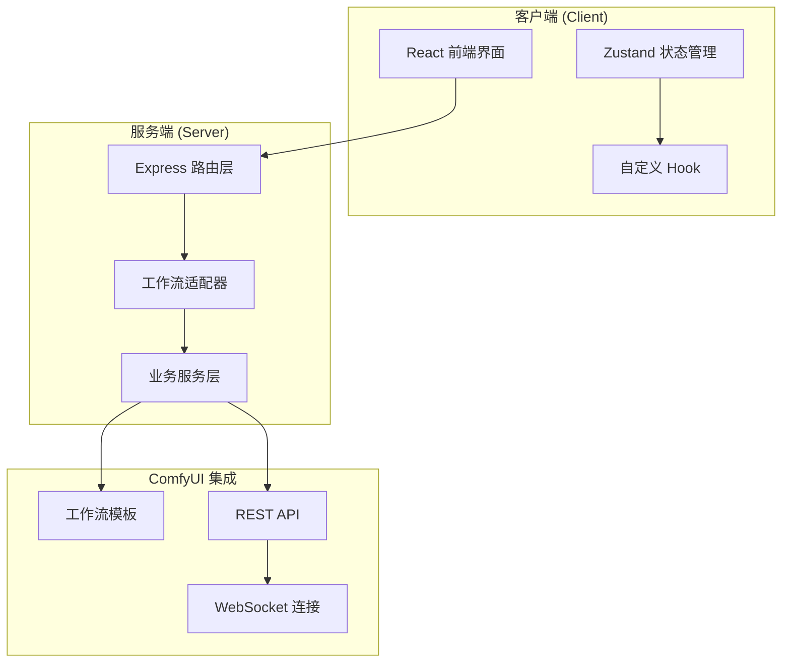
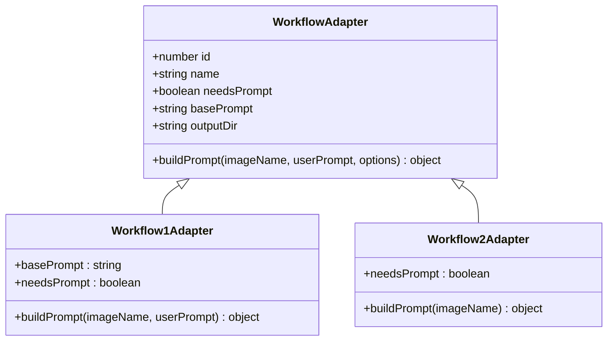
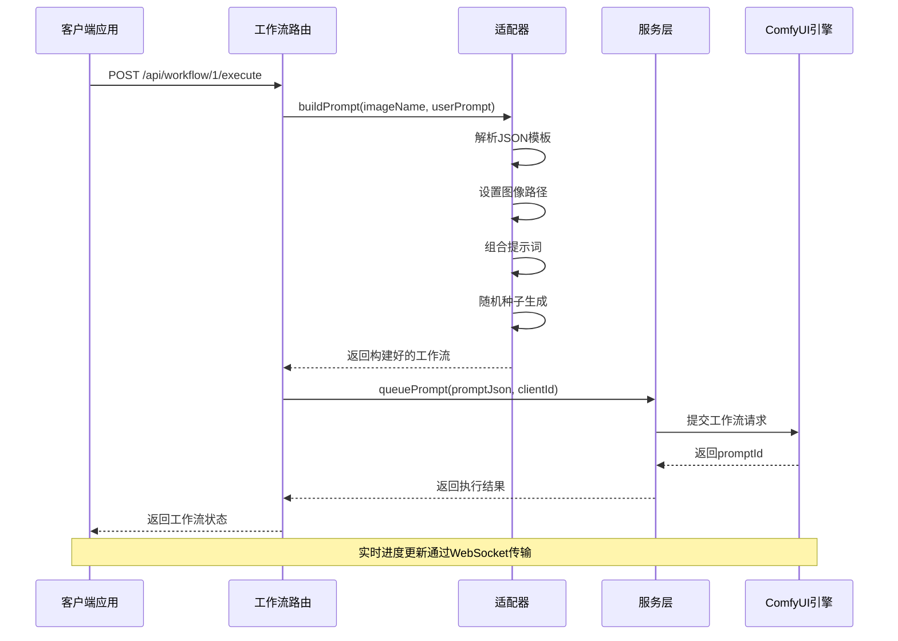
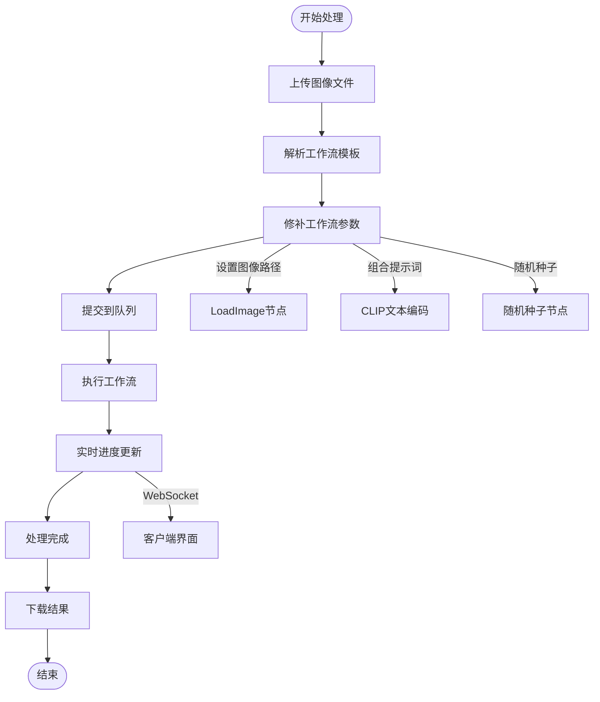
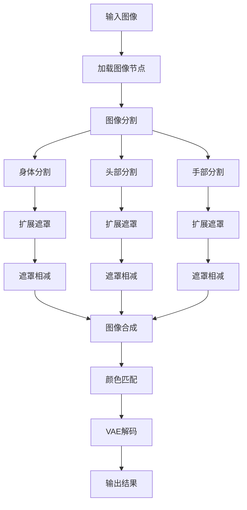
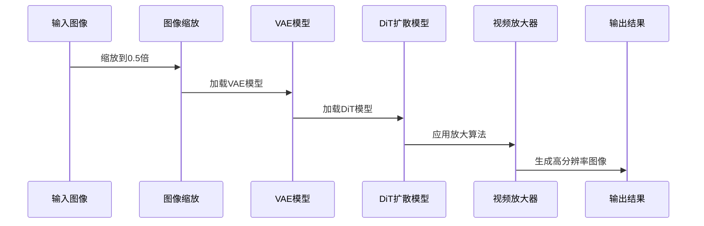
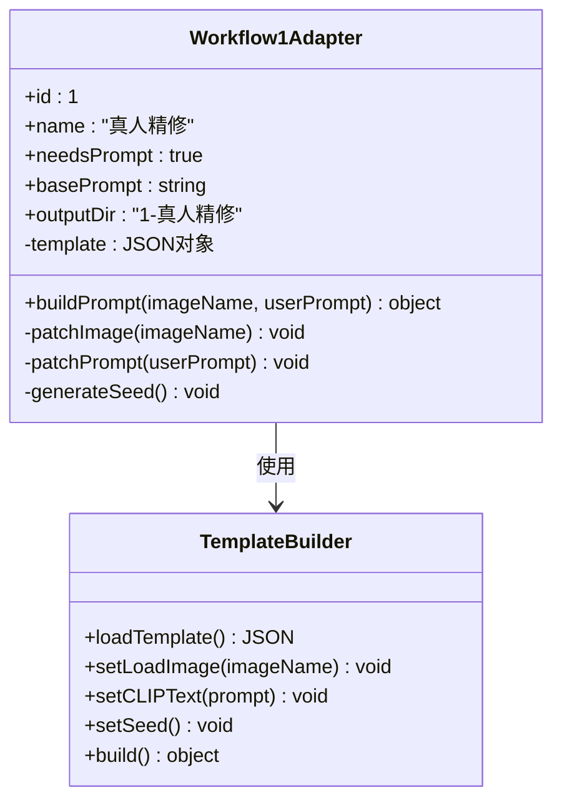
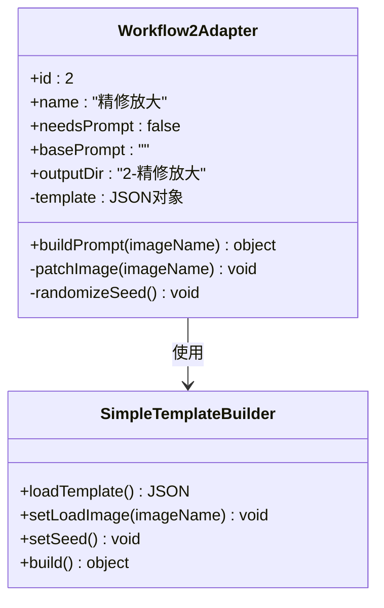
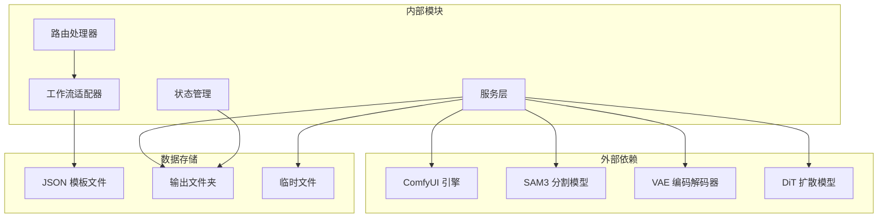
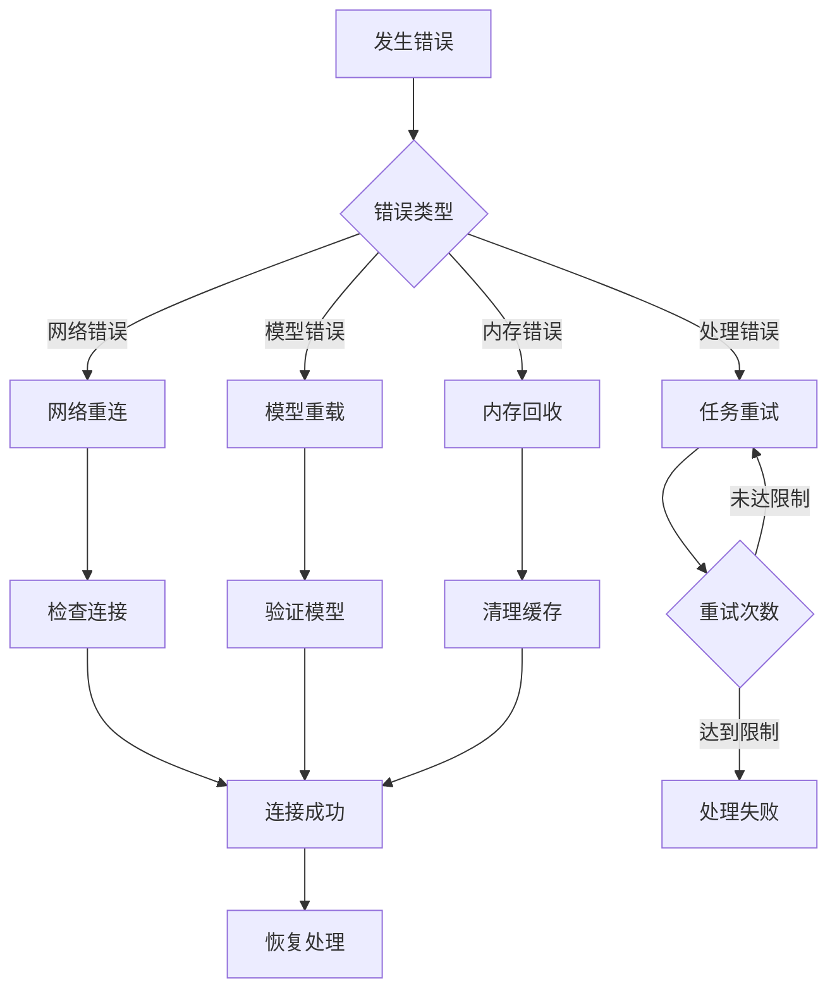

# 真人精修适配器

<cite>
**本文档引用的文件**
- [Workflow1Adapter.ts](file://server/src/adapters/Workflow1Adapter.ts)
- [Pix2Real-真人精修.json](file://ComfyUI_API/Pix2Real-真人精修.json)
- [Workflow2Adapter.ts](file://server/src/adapters/Workflow2Adapter.ts)
- [2-Pix2Real-精修放大.json](file://ComfyUI_API/2-Pix2Real-精修放大.json)
- [README.md](file://README.md)
- [index.ts](file://server/src/types/index.ts)
- [index.ts](file://server/src/adapters/index.ts)
- [workflow.ts](file://server/src/routes/workflow.ts)
- [comfyui.ts](file://server/src/services/comfyui.ts)
- [useWorkflowStore.ts](file://client/src/hooks/useWorkflowStore.ts)
</cite>

## 目录
1. [简介](#简介)
2. [项目结构](#项目结构)
3. [核心组件](#核心组件)
4. [架构概览](#架构概览)
5. [详细组件分析](#详细组件分析)
6. [依赖关系分析](#依赖关系分析)
7. [性能考虑](#性能考虑)
8. [故障排除指南](#故障排除指南)
9. [结论](#结论)
10. [附录](#附录)

## 简介

真人精修适配器是 CorineKit Pix2Real 项目中的一个核心工作流组件，专门用于对真人照片进行高质量的细节优化和修复处理。该适配器通过结合先进的深度学习技术和图像处理算法，能够实现以下核心功能：

- **皮肤纹理改善**：增强皮肤细节，使肌肤看起来更加细腻和真实
- **瑕疵去除**：智能识别和修复皮肤上的瑕疵、斑点和其他不完美特征
- **光照调整**：优化面部和身体的光照分布，创造更自然的光影效果
- **整体质感提升**：通过多阶段处理流程，全面提升图像的整体质量和视觉效果

该项目采用模块化设计，基于 ComfyUI 架构，提供了灵活的工作流适配器模式，使得不同类型的图像处理任务可以共享相同的基础设施和用户界面。

## 项目结构

项目采用前后端分离的架构设计，主要分为以下几个核心部分：

**图表来源**
- [README.md:41-62](file://README.md#L41-L62)
- [workflow.ts:1-29](file://server/src/routes/workflow.ts#L1-L29)

**章节来源**
- [README.md:41-79](file://README.md#L41-L79)

## 核心组件

真人精修适配器系统由多个相互协作的核心组件构成，每个组件都有明确的职责和功能边界：

### 工作流适配器接口

所有工作流适配器都遵循统一的接口规范，确保系统的可扩展性和一致性：

**图表来源**
- [index.ts:1-8](file://server/src/types/index.ts#L1-L8)
- [Workflow1Adapter.ts:9-35](file://server/src/adapters/Workflow1Adapter.ts#L9-L35)
- [Workflow2Adapter.ts:9-27](file://server/src/adapters/Workflow2Adapter.ts#L9-L27)

### 适配器注册系统

系统通过集中化的适配器注册机制，实现了工作流的动态管理和扩展：

| 工作流ID | 名称 | 需要提示词 | 输出目录 |
|---------|------|-----------|----------|
| 0 | 二次元转真人 | 是 | 0-二次元转真人 |
| 1 | 真人精修 | 是 | 1-真人精修 |
| 2 | 精修放大 | 否 | 2-精修放大 |
| 3 | 快速生成视频 | 是 | 3-快速生成视频 |
| 4 | 视频放大 | 否 | 4-视频放大 |

**章节来源**
- [index.ts:14-30](file://server/src/adapters/index.ts#L14-L30)
- [README.md:64-72](file://README.md#L64-L72)

## 架构概览

真人精修适配器采用了分层架构设计，确保了系统的可维护性、可扩展性和高性能：

**图表来源**
- [workflow.ts:750-799](file://server/src/routes/workflow.ts#L750-L799)
- [Workflow1Adapter.ts:16-34](file://server/src/adapters/Workflow1Adapter.ts#L16-L34)

### 数据流架构

系统采用事件驱动的数据流架构，确保了处理流程的可视化和可追踪性：

**图表来源**
- [comfyui.ts:168-196](file://server/src/services/comfyui.ts#L168-L196)
- [workflow.ts:750-799](file://server/src/routes/workflow.ts#L750-L799)

**章节来源**
- [workflow.ts:152-161](file://server/src/routes/workflow.ts#L152-L161)
- [comfyui.ts:265-375](file://server/src/services/comfyui.ts#L265-L375)

## 详细组件分析

### 真人精修工作流 (Workflow 1)

真人精修工作流是系统中最复杂的处理流程，专门针对真人照片进行深度优化和修复：

#### 核心处理流程

**图表来源**
- [Pix2Real-真人精修.json:148-286](file://ComfyUI_API/Pix2Real-真人精修.json#L148-L286)

#### 关键处理节点详解

**图像分割系统**：
- 使用 SAM3 模型进行精确的图像分割
- 支持身体、头部、手部等多个区域的独立处理
- 通过阈值参数控制分割精度

**遮罩扩展机制**：
- 身体区域：扩展20像素，模糊50像素
- 头部区域：扩展6像素，模糊0像素  
- 手部区域：扩展7像素，模糊35像素

**颜色匹配算法**：
采用小波变换的颜色匹配技术，确保处理后的图像与原始图像在色彩上保持一致，同时增强细节表现。

**章节来源**
- [Pix2Real-真人精修.json:148-286](file://ComfyUI_API/Pix2Real-真人精修.json#L148-L286)

### 精修放大工作流 (Workflow 2)

精修放大工作流专注于提高图像分辨率和细节质量，特别适用于需要高清输出的场景：

#### 放大处理流程

**图表来源**
- [2-Pix2Real-精修放大.json:99-125](file://ComfyUI_API/2-Pix2Real-精修放大.json#L99-L125)

#### 放大参数配置

| 参数 | 值 | 说明 |
|------|-----|------|
| 缩放方法 | Lanczos | 高质量重采样算法 |
| 缩放比例 | 0.5 | 先降采样再放大 |
| 分辨率 | 2048 | 目标输出分辨率 |
| 批处理大小 | 5 | 并行处理数量 |
| 颜色校正 | Lab空间 | 更自然的颜色转换 |

**章节来源**
- [2-Pix2Real-精修放大.json:85-125](file://ComfyUI_API/2-Pix2Real-精修放大.json#L85-L125)

### 适配器构建机制

#### 真人精修适配器实现

**图表来源**
- [Workflow1Adapter.ts:9-35](file://server/src/adapters/Workflow1Adapter.ts#L9-L35)

#### 精修放大适配器实现

**图表来源**
- [Workflow2Adapter.ts:9-27](file://server/src/adapters/Workflow2Adapter.ts#L9-L27)

**章节来源**
- [Workflow1Adapter.ts:16-34](file://server/src/adapters/Workflow1Adapter.ts#L16-L34)
- [Workflow2Adapter.ts:16-26](file://server/src/adapters/Workflow2Adapter.ts#L16-L26)

## 依赖关系分析

系统采用松耦合的设计原则，通过清晰的接口定义实现了模块间的解耦：

**图表来源**
- [workflow.ts:12-27](file://server/src/routes/workflow.ts#L12-L27)
- [index.ts:1-12](file://server/src/adapters/index.ts#L1-L12)

### 依赖注入模式

系统采用依赖注入的方式管理外部服务依赖：

| 服务名称 | 依赖类型 | 配置位置 |
|---------|----------|----------|
| ComfyUI API | HTTP 客户端 | 本地服务 |
| WebSocket | 实时通信 | 本地服务 |
| 文件系统 | 存储服务 | 本地文件 |
| 模板引擎 | JSON 处理 | 静态文件 |
| 日志系统 | 调试工具 | 控制台输出 |

**章节来源**
- [comfyui.ts:6-7](file://server/src/services/comfyui.ts#L6-L7)
- [index.ts:1-12](file://server/src/adapters/index.ts#L1-L12)

## 性能考虑

### 处理效率优化

系统在多个层面实现了性能优化，确保大规模图像处理的高效性：

**内存管理策略**：
- 使用流式文件上传，避免大文件内存溢出
- 及时释放图像缓冲区和模型资源
- 实现渐进式图像预览功能

**并发处理机制**：
- 支持多任务并行处理
- 智能队列调度算法
- 自适应批处理大小

**缓存优化**：
- 模型文件缓存机制
- 中间结果缓存
- 预编译的模板缓存

### 性能监控指标

系统提供多维度的性能监控能力：

| 监控指标 | 测量方式 | 阈值标准 |
|---------|----------|----------|
| 处理时间 | 从提交到完成的时间 | < 5分钟/张 |
| 内存使用 | VRAM 和 RAM 占用 | < 80% |
| GPU 利用率 | 显卡计算负载 | > 60% |
| 队列等待 | 任务排队时间 | < 30秒 |

## 故障排除指南

### 常见问题诊断

**连接问题**：
- 确认 ComfyUI 服务正常运行
- 检查网络连接和防火墙设置
- 验证 WebSocket 连接状态

**模型加载失败**：
- 检查模型文件完整性
- 验证模型文件格式兼容性
- 确认模型文件权限设置

**内存不足**：
- 减少批量处理数量
- 降低图像分辨率
- 清理临时文件空间

### 错误处理机制

系统实现了完善的错误处理和恢复机制：

**章节来源**
- [comfyui.ts:126-150](file://server/src/services/comfyui.ts#L126-L150)

## 结论

真人精修适配器作为 CorineKit Pix2Real 项目的核心组件，展现了现代图像处理系统的设计理念和技术实现。通过模块化架构、标准化接口和智能化处理流程，该系统能够满足专业级图像处理的需求。

### 主要优势

1. **高度模块化**：工作流适配器模式提供了良好的可扩展性
2. **性能优化**：多层优化策略确保了高效的处理性能
3. **用户体验**：直观的界面设计和实时反馈机制
4. **技术先进**：采用最新的深度学习和图像处理技术

### 发展方向

未来可以在以下方面继续改进：
- 增强 AI 算法的智能化程度
- 优化移动端的处理性能
- 扩展更多图像处理功能
- 提升系统的自动化水平

## 附录

### 使用场景推荐

**适合使用真人精修的场景**：
- 高质量人像照片后期处理
- 商业摄影作品优化
- 社交媒体头像美化
- 个人写真集制作

**不适合使用的情况**：
- 需要实时处理的直播场景
- 对处理速度要求极高的批量任务
- 设备性能较低的环境

### 参数调优建议

**提示词优化**：
- 保持描述具体且详细
- 避免过于抽象或模糊的表述
- 结合图像内容调整关键词权重

**处理参数设置**：
- 根据图像质量调整处理强度
- 考虑目标用途选择合适的分辨率
- 平衡处理质量和处理时间