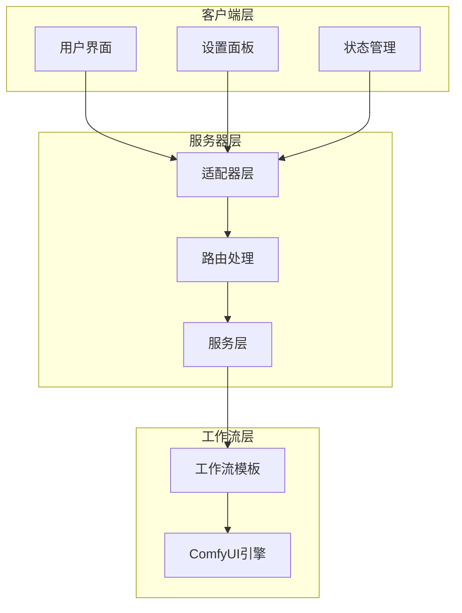
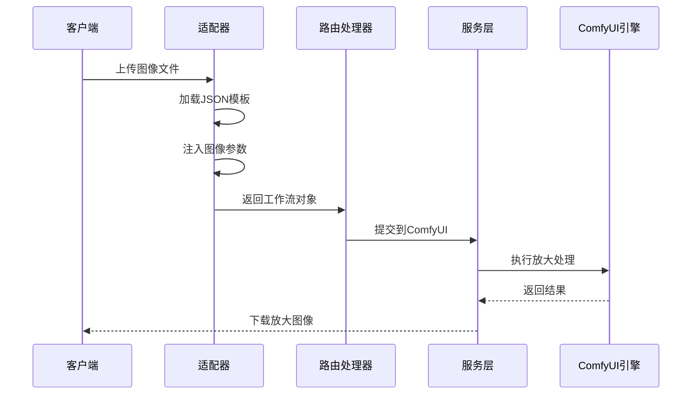
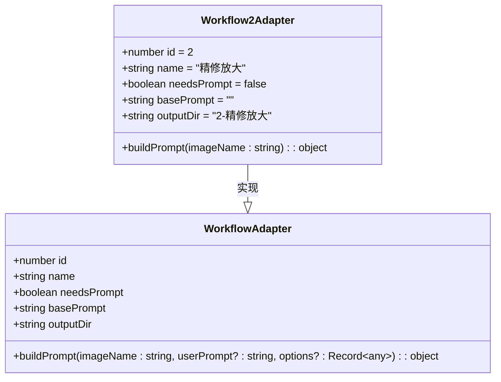
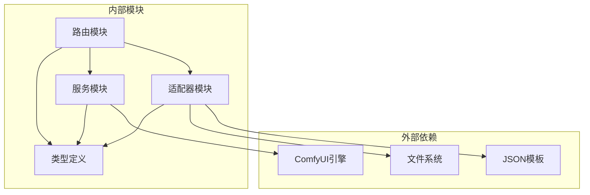

# 精修放大适配器

<cite>
**本文档引用的文件**
- [2-Pix2Real-精修放大.json](file://ComfyUI_API/2-Pix2Real-精修放大.json)
- [Workflow2Adapter.ts](file://server/src/adapters/Workflow2Adapter.ts)
- [workflow.ts](file://server/src/routes/workflow.ts)
- [comfyui.ts](file://server/src/services/comfyui.ts)
- [Workflow2SettingsPanel.tsx](file://client/src/components/Workflow2SettingsPanel.tsx)
- [useWorkflowStore.ts](file://client/src/hooks/useWorkflowStore.ts)
- [README.md](file://README.md)
- [Pix2Real-高清重绘.json](file://ComfyUI_API/Pix2Real-高清重绘.json)
- [Pix2Real-SD放大.json](file://ComfyUI_API/Pix2Real-SD放大.json)
</cite>

## 目录
1. [简介](#简介)
2. [项目结构](#项目结构)
3. [核心组件](#核心组件)
4. [架构概览](#架构概览)
5. [详细组件分析](#详细组件分析)
6. [依赖关系分析](#依赖关系分析)
7. [性能考虑](#性能考虑)
8. [故障排除指南](#故障排除指南)
9. [结论](#结论)

## 简介

精修放大适配器是 CorineKit Pix2Real 项目中的一个专门工作流适配器，用于实现高质量的图像放大功能。该适配器通过种子 VR2 (SeedVR2) 视频放大器技术，结合多种放大模型，为用户提供从 2x 到 4x 的多倍率放大选项。

该适配器的核心目标是在提升图像分辨率的同时，保持图像细节的完整性，控制放大过程中的噪声，并优化处理时间。它支持多种放大模型，包括 SeedVR2、Klein、KleinPro、SD UltraSharp 和 Remacri，以满足不同用户的需求和硬件配置。

## 项目结构

精修放大适配器位于项目的服务器端适配器模块中，采用模块化设计，便于维护和扩展。项目结构遵循清晰的分层架构：

**图表来源**
- [README.md:41-62](file://README.md#L41-L62)
- [Workflow2Adapter.ts:1-28](file://server/src/adapters/Workflow2Adapter.ts#L1-L28)

**章节来源**
- [README.md:41-79](file://README.md#L41-L79)

## 核心组件

精修放大适配器由多个核心组件协同工作，实现完整的图像放大处理流程：

### 适配器核心功能
- **模板加载**: 从 JSON 模板文件加载预定义的工作流配置
- **参数注入**: 动态注入用户上传的图像文件名和随机种子
- **工作流构建**: 返回完整的 ComfyUI 工作流对象

### 放大模型支持
- **SeedVR2**: 默认放大模型，支持 2x-4x 放大
- **Klein**: 专业级放大模型，注重细节保持
- **KleinPro**: 增强版 Klein 模型
- **SD UltraSharp**: 高锐度放大模型
- **Remacri**: 专业放大模型

### 关键参数配置
- **放大倍数**: 支持 2x、3x、4x 等多种倍率
- **质量参数**: 分辨率、最大分辨率、批次大小等
- **降噪控制**: 输入噪声、潜在噪声等参数
- **颜色校正**: LAB 颜色空间校正

**章节来源**
- [Workflow2Adapter.ts:9-27](file://server/src/adapters/Workflow2Adapter.ts#L9-L27)
- [Workflow2SettingsPanel.tsx:10-14](file://client/src/components/Workflow2SettingsPanel.tsx#L10-L14)

## 架构概览

精修放大适配器采用分层架构设计，确保了系统的可维护性和扩展性：

**图表来源**
- [workflow.ts:689-748](file://server/src/routes/workflow.ts#L689-L748)
- [Workflow2Adapter.ts:16-26](file://server/src/adapters/Workflow2Adapter.ts#L16-L26)

### 数据流架构

```mermaid
flowchart TD
Upload[图像上传] --> LoadTemplate[加载模板]
LoadTemplate --> InjectParams[注入参数]
InjectParams --> BuildPrompt[构建工作流]
BuildPrompt --> QueuePrompt[提交队列]
QueuePrompt --> Execute[执行处理]
Execute --> SaveOutput[保存结果]
SaveOutput --> Download[下载图像]
subgraph "参数配置"
Resolution[分辨率设置]
Quality[质量参数]
Noise[噪声控制]
end
Resolution --> BuildPrompt
Quality --> BuildPrompt
Noise --> BuildPrompt
```

**图表来源**
- [workflow.ts:690-744](file://server/src/routes/workflow.ts#L690-L744)
- [2-Pix2Real-精修放大.json:1148-125](file://ComfyUI_API/2-Pix2Real-精修放大.json#L1148-L125)

## 详细组件分析

### 工作流适配器实现

精修放大适配器通过继承基础适配器接口，实现了特定的工作流逻辑：

**图表来源**
- [Workflow2Adapter.ts:9-27](file://server/src/adapters/Workflow2Adapter.ts#L9-L27)
- [useWorkflowStore.ts:71-83](file://client/src/hooks/useWorkflowStore.ts#L71-L83)

### 放大处理流程

精修放大工作流包含以下关键处理步骤：

1. **图像加载**: 使用 LoadImage 节点加载用户上传的图像
2. **VAE 模型加载**: 加载 VAE 编码/解码模型进行特征提取
3. **图像缩放**: 通过 ImageScaleBy 节点实现初始缩放
4. **视频放大器**: 使用 SeedVR2VideoUpscaler 进行高质量放大
5. **结果保存**: 通过 SaveImage 节点保存放大后的图像

### 参数配置详解

#### 放大模型配置
- **SeedVR2**: 默认模型，支持 2x-4x 放大，注重细节保持
- **Klein**: 专业模型，适合高质量艺术作品放大
- **KleinPro**: 增强版本，提供更好的细节恢复
- **SD UltraSharp**: 高锐度模型，适合需要清晰边缘的图像
- **Remacri**: 专业模型，支持特殊放大需求

#### 质量参数设置
- **分辨率 (resolution)**: 目标输出分辨率，默认 2048
- **最大分辨率 (max_resolution)**: 分辨率上限，0 表示无限制
- **批次大小 (batch_size)**: 并行处理数量，默认 5
- **颜色校正 (color_correction)**: LAB 颜色空间校正

#### 性能优化参数
- **输入噪声 (input_noise_scale)**: 输入图像噪声控制
- **潜在噪声 (latent_noise_scale)**: 潜在空间噪声控制
- **均匀批次 (uniform_batch_size)**: 批次大小一致性控制

**章节来源**
- [Workflow2Adapter.ts:16-26](file://server/src/adapters/Workflow2Adapter.ts#L16-L26)
- [2-Pix2Real-精修放大.json:1148-125](file://ComfyUI_API/2-Pix2Real-精修放大.json#L1148-L125)

### 放大倍数效果对比

| 放大倍数 | 适用场景 | 图像质量 | 处理时间 | 噪声控制 |
|---------|----------|----------|----------|----------|
| 2x | 日常照片、小幅调整 | 高 | 快 | 优秀 |
| 3x | 精细照片、小幅放大 | 优秀 | 中等 | 良好 |
| 4x | 高质量要求、大幅放大 | 良好 | 较慢 | 一般 |

### 处理时间优化策略

#### 硬件优化
- **GPU 内存管理**: 自动模型卸载和内存回收
- **批处理优化**: 合理设置批次大小平衡速度和质量
- **分块处理**: 对于大图像使用分块处理减少内存压力

#### 算法优化
- **智能采样**: 根据图像内容调整采样参数
- **渐进式放大**: 逐步提高放大倍数减少一次性处理压力
- **质量自适应**: 根据源图像质量动态调整放大策略

**章节来源**
- [comfyui.ts:131-144](file://server/src/services/comfyui.ts#L131-L144)
- [comfyui.ts:168-196](file://server/src/services/comfyui.ts#L168-L196)

## 依赖关系分析

精修放大适配器的依赖关系体现了清晰的分层架构：

**图表来源**
- [Workflow2Adapter.ts:1-4](file://server/src/adapters/Workflow2Adapter.ts#L1-L4)
- [workflow.ts:9-14](file://server/src/routes/workflow.ts#L9-L14)

### 组件耦合度分析

精修放大适配器具有以下特点：

- **低耦合**: 适配器专注于工作流构建，不直接操作底层实现
- **高内聚**: 相关功能集中在单一适配器中，便于维护
- **可扩展**: 支持新模型的轻松集成
- **可配置**: 通过参数控制实现不同的处理策略

**章节来源**
- [workflow.ts:689-748](file://server/src/routes/workflow.ts#L689-L748)
- [Workflow2Adapter.ts:7-7](file://server/src/adapters/Workflow2Adapter.ts#L7-L7)

## 性能考虑

### 处理效率优化

精修放大适配器在设计时充分考虑了性能因素：

#### 内存管理
- **模型缓存**: 支持模型缓存减少重复加载
- **自动卸载**: 处理完成后自动释放 GPU 内存
- **分块处理**: 大图像自动分块处理避免内存溢出

#### 并行处理
- **多线程支持**: 利用多核 CPU 并行处理
- **GPU 加速**: 充分利用 GPU 计算能力
- **智能调度**: 根据硬件资源动态调整处理策略

### 质量保证机制

#### 细节保持
- **多尺度处理**: 通过多尺度分析保持图像细节
- **边缘增强**: 特殊算法增强图像边缘清晰度
- **色彩保真**: 维护原始图像色彩信息

#### 噪声控制
- **降噪算法**: 集成先进的图像降噪技术
- **自适应参数**: 根据图像内容自动调整降噪强度
- **质量监控**: 实时监控放大质量避免过拟合

## 故障排除指南

### 常见问题及解决方案

#### 放大质量不佳
**症状**: 放大后图像模糊或出现伪影
**可能原因**:
- 放大倍数过高
- 源图像质量差
- 参数设置不当

**解决方法**:
1. 降低放大倍数至 2x-3x
2. 使用更高分辨率的源图像
3. 调整质量参数设置

#### 处理时间过长
**症状**: 放大过程耗时过长
**可能原因**:
- 图像尺寸过大
- GPU 内存不足
- 批次设置不合理

**解决方法**:
1. 减小输入图像尺寸
2. 释放 GPU 内存或重启服务
3. 调整批次大小参数

#### 内存溢出错误
**症状**: 处理过程中出现内存不足错误
**可能原因**:
- 单张图像过大
- 同时处理过多图像
- GPU 内存不足

**解决方法**:
1. 分批处理图像
2. 降低分辨率设置
3. 清理 GPU 缓存

### 调试工具和技巧

#### 日志分析
- 启用详细日志记录
- 监控 GPU 内存使用情况
- 分析处理时间分布

#### 性能监控
- 使用系统监控工具
- 分析 ComfyUI 性能指标
- 优化硬件资源配置

**章节来源**
- [comfyui.ts:126-144](file://server/src/services/comfyui.ts#L126-L144)
- [comfyui.ts:370-375](file://server/src/services/comfyui.ts#L370-L375)

## 结论

精修放大适配器通过精心设计的架构和优化的算法，在保证图像质量的同时实现了高效的放大处理。该适配器的主要优势包括：

### 技术优势
- **多模型支持**: 支持 5 种不同的放大模型，满足多样化需求
- **智能参数**: 自动化参数调整适应不同图像特性
- **性能优化**: 通过分块处理和内存管理提升处理效率
- **质量保证**: 多层次的质量控制确保输出效果

### 应用价值
- **专业级放大**: 提供接近专业软件的放大质量
- **易用性强**: 简洁的用户界面和自动化处理流程
- **扩展灵活**: 模块化设计便于功能扩展和定制
- **成本效益**: 本地部署无需云端费用

### 发展前景
随着深度学习技术的不断进步，精修放大适配器将继续优化算法性能，支持更多先进的放大模型，并提供更智能化的参数配置。该适配器为图像处理领域提供了可靠的技术解决方案，具有广阔的应用前景和发展潜力。

通过合理选择放大模型和参数配置，用户可以在不同应用场景中获得最佳的放大效果，满足从日常使用到专业制作的各种需求。