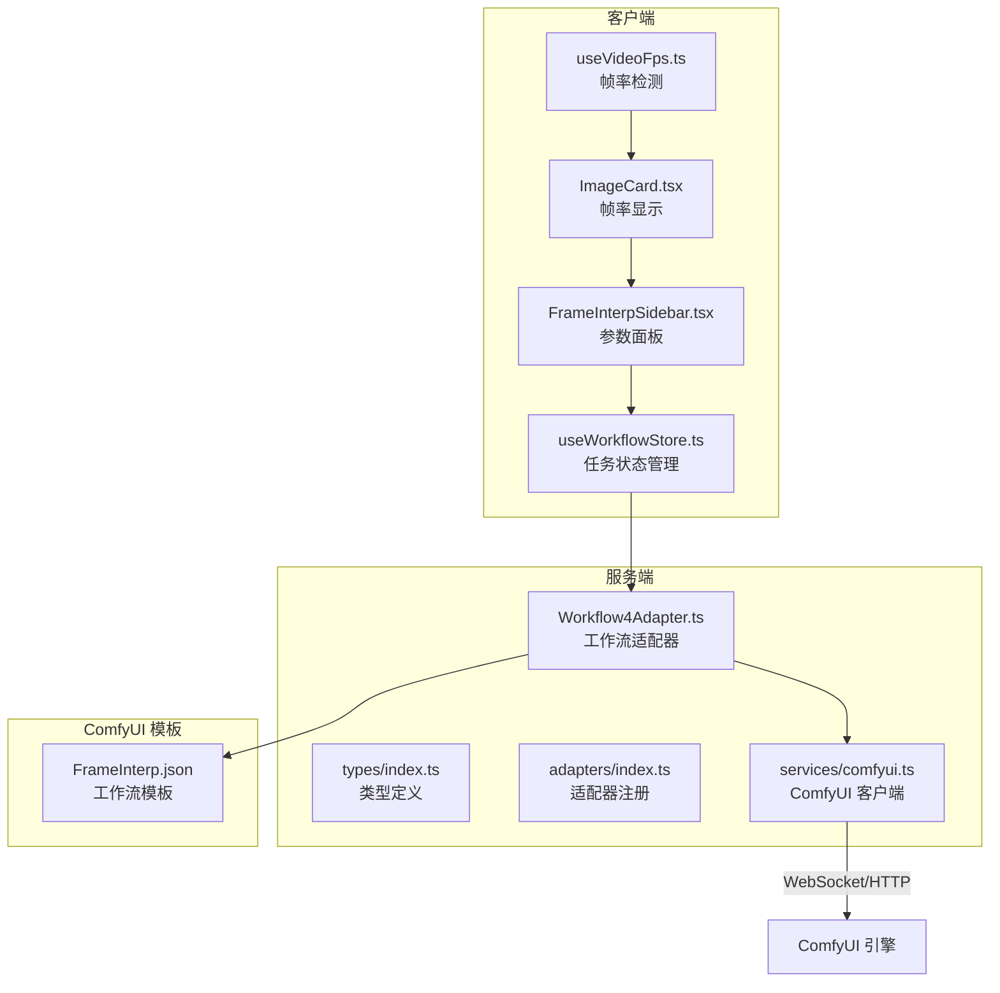
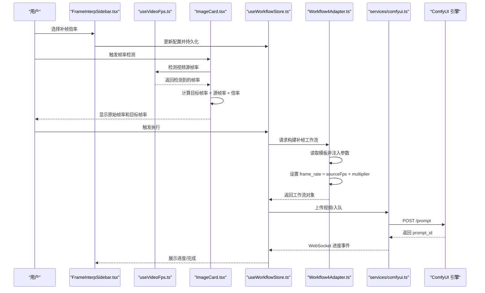
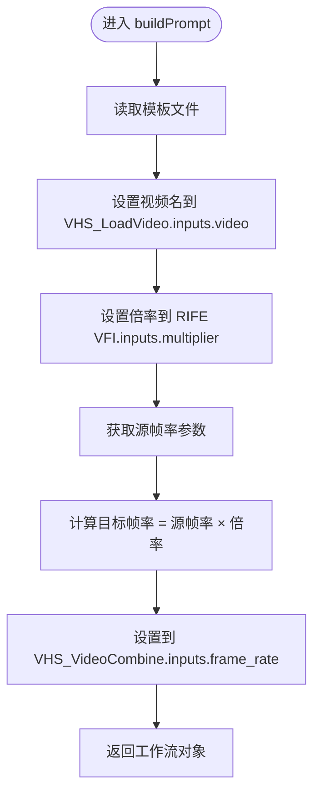
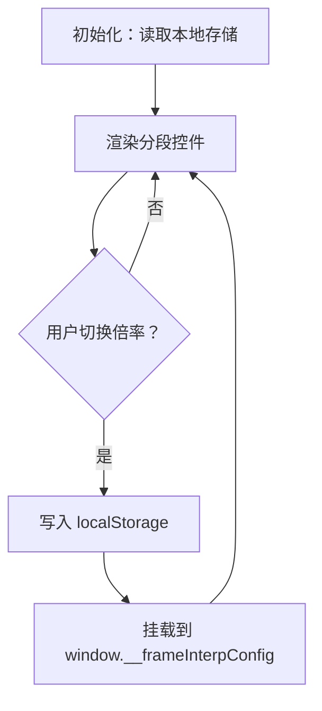
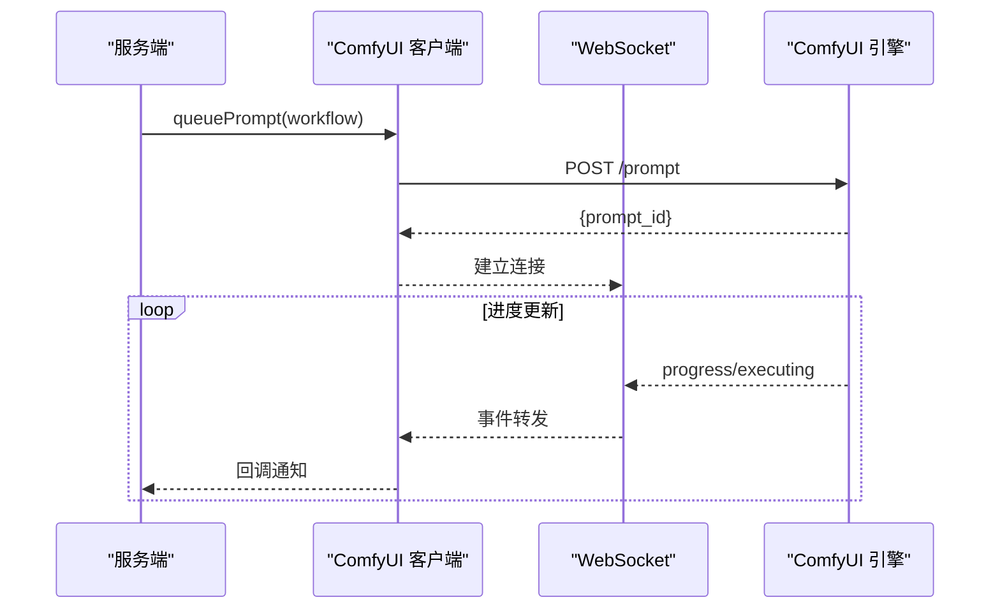
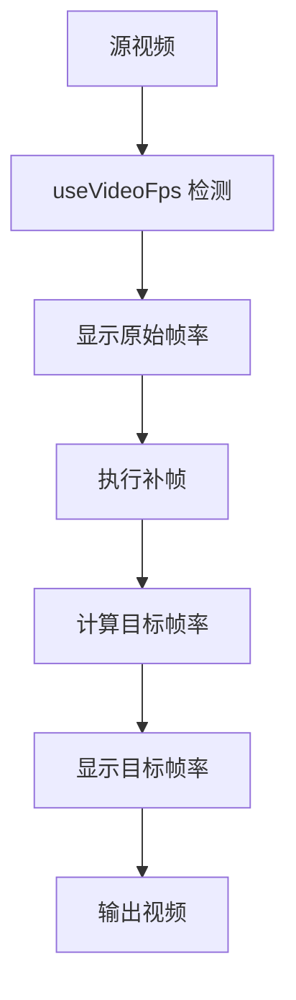
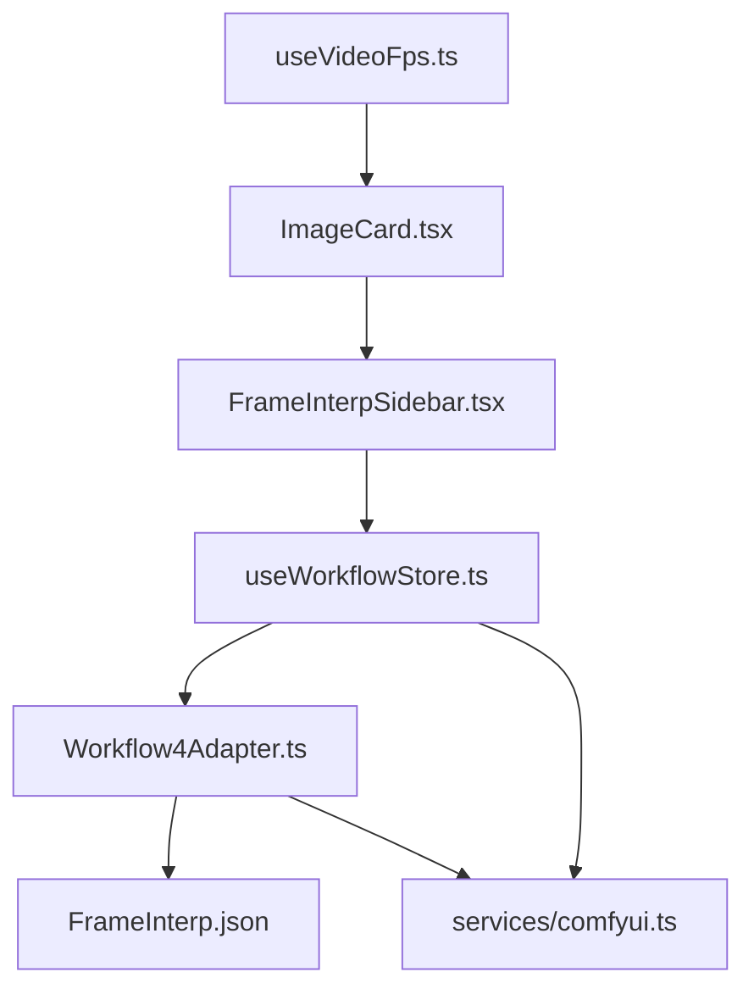

# 视频补帧适配器

<cite>
**本文档引用的文件**
- [Workflow4Adapter.ts](file://server/src/adapters/Workflow4Adapter.ts)
- [FrameInterp.json](file://ComfyUI_API/FrameInterp.json)
- [FrameInterpSidebar.tsx](file://client/src/components/FrameInterpSidebar.tsx)
- [useWorkflowStore.ts](file://client/src/hooks/useWorkflowStore.ts)
- [comfyui.ts](file://server/src/services/comfyui.ts)
- [index.ts](file://server/src/adapters/index.ts)
- [BaseAdapter.ts](file://server/src/adapters/BaseAdapter.ts)
- [index.ts](file://server/src/types/index.ts)
- [README.md](file://README.md)
- [useVideoFps.ts](file://client/src/hooks/useVideoFps.ts)
- [ImageCard.tsx](file://client/src/components/ImageCard.tsx)
</cite>

## 更新摘要
**所做更改**
- 更新了帧率同步逻辑的实现细节，增强了视频补帧功能的帧率计算准确性
- 新增了自定义源帧率和插值倍数的动态组合支持
- 完善了前端帧率检测和显示机制
- 增强了工作流适配器的参数处理能力

## 目录
1. [简介](#简介)
2. [项目结构](#项目结构)
3. [核心组件](#核心组件)
4. [架构总览](#架构总览)
5. [详细组件分析](#详细组件分析)
6. [帧率同步机制](#帧率同步机制)
7. [依赖关系分析](#依赖关系分析)
8. [性能考量](#性能考量)
9. [故障排查指南](#故障排查指南)
10. [结论](#结论)
11. [附录](#附录)

## 简介
本技术文档围绕"视频补帧适配器"展开，系统性阐述其在本地 Web UI 中如何通过 ComfyUI 实现视频帧插值增强。文档重点覆盖以下方面：
- 补帧工作流的端到端实现：从 UI 参数输入到 ComfyUI 工作流模板装配，再到执行与结果输出
- 关键技术点：运动估计与中间帧生成（RIFE VFI）、质量保持与参数配置（fast_mode、ensemble、clear_cache_after_n_frames）
- 参数体系：补帧倍率（multiplier）与相关模型/缓存策略
- 性能优化：缓存清理、快速模式与集成策略
- 使用建议：不同视频内容的补帧效果差异与适用场景
- **新增**：帧率同步逻辑改进，支持自定义源帧率和插值倍数的动态组合

## 项目结构
视频补帧适配器位于服务端适配器层，配合前端侧参数面板与 ComfyUI 工作流模板共同完成任务编排。

**图表来源**
- [Workflow4Adapter.ts:1-33](file://server/src/adapters/Workflow4Adapter.ts#L1-L33)
- [FrameInterp.json:1-58](file://ComfyUI_API/FrameInterp.json#L1-L58)
- [FrameInterpSidebar.tsx:1-122](file://client/src/components/FrameInterpSidebar.tsx#L1-L122)
- [useWorkflowStore.ts:71-83](file://client/src/hooks/useWorkflowStore.ts#L71-L83)
- [comfyui.ts:168-196](file://server/src/services/comfyui.ts#L168-L196)
- [index.ts:14-33](file://server/src/adapters/index.ts#L14-L33)
- [useVideoFps.ts:1-77](file://client/src/hooks/useVideoFps.ts#L1-L77)
- [ImageCard.tsx:230-250](file://client/src/components/ImageCard.tsx#L230-L250)

**章节来源**
- [README.md:41-79](file://README.md#L41-L79)
- [index.ts:14-33](file://server/src/adapters/index.ts#L14-L33)

## 核心组件
- 适配器（Workflow4Adapter）：负责加载并装配补帧工作流模板，注入输入视频与补帧倍率等参数
- 前端参数面板（FrameInterpSidebar）：提供补帧倍率选择，并持久化到本地存储
- **新增**：帧率检测钩子（useVideoFps）：智能检测视频源帧率，支持多种检测方法
- **新增**：帧率显示组件（ImageCard）：实时显示原始帧率和补帧后的目标帧率
- ComfyUI 客户端（comfyui.ts）：封装上传、排队、进度回调、历史查询等能力
- 工作流模板（FrameInterp.json）：包含 RIFE VFI、视频加载与视频合并节点

**章节来源**
- [Workflow4Adapter.ts:9-33](file://server/src/adapters/Workflow4Adapter.ts#L9-L33)
- [FrameInterpSidebar.tsx:3-36](file://client/src/components/FrameInterpSidebar.tsx#L3-L36)
- [comfyui.ts:168-196](file://server/src/services/comfyui.ts#L168-L196)
- [FrameInterp.json:2-57](file://ComfyUI_API/FrameInterp.json#L2-L57)
- [useVideoFps.ts:3-77](file://client/src/hooks/useVideoFps.ts#L3-L77)
- [ImageCard.tsx:790-826](file://client/src/components/ImageCard.tsx#L790-L826)

## 架构总览
下图展示了从用户操作到补帧执行的关键交互路径，包括新增的帧率同步机制。

**图表来源**
- [FrameInterpSidebar.tsx:23-36](file://client/src/components/FrameInterpSidebar.tsx#L23-L36)
- [useWorkflowStore.ts:560-578](file://client/src/hooks/useWorkflowStore.ts#L560-L578)
- [Workflow4Adapter.ts:16-32](file://server/src/adapters/Workflow4Adapter.ts#L16-L32)
- [comfyui.ts:168-196](file://server/src/services/comfyui.ts#L168-L196)
- [useVideoFps.ts:8-77](file://client/src/hooks/useVideoFps.ts#L8-L77)
- [ImageCard.tsx:238-244](file://client/src/components/ImageCard.tsx#L238-L244)

## 详细组件分析

### 补帧适配器（Workflow4Adapter）
- 职责
  - 加载工作流模板（FrameInterp.json）
  - 注入输入视频名称与补帧倍率（multiplier）
  - **更新**：支持自定义源帧率参数，实现准确的帧率同步
  - 输出可直接提交给 ComfyUI 的工作流对象
- 关键行为
  - 读取模板文件并解析为对象
  - 设置 VHS_LoadVideo 的 video 字段为上传的视频名
  - 设置 RIFE VFI 的 multiplier 字段为用户选择的倍率
  - **更新**：设置 VHS_VideoCombine 的 frame_rate 为 sourceFps × multiplier
- 与模板的关系
  - 模板中 RIFE VFI 节点已预置模型、fast_mode、ensemble 等参数
  - 适配器仅动态替换与用户输入相关的字段
  - **更新**：新增对源帧率参数的支持，确保输出帧率的准确性

**图表来源**
- [Workflow4Adapter.ts:16-32](file://server/src/adapters/Workflow4Adapter.ts#L16-L32)
- [FrameInterp.json:20-34](file://ComfyUI_API/FrameInterp.json#L20-L34)
- [FrameInterp.json:2-18](file://ComfyUI_API/FrameInterp.json#L2-L18)

**章节来源**
- [Workflow4Adapter.ts:9-33](file://server/src/adapters/Workflow4Adapter.ts#L9-L33)

### 前端参数面板（FrameInterpSidebar）
- 功能
  - 提供补帧倍率选项（2x、4x、6x）
  - 将当前倍率保存至 localStorage
  - 通过全局 window 对象暴露配置，供执行流程读取
- 用户体验
  - 采用分段控件，直观展示当前选择
  - 切换后即时持久化，刷新页面保留上次选择

**图表来源**
- [FrameInterpSidebar.tsx:15-36](file://client/src/components/FrameInterpSidebar.tsx#L15-L36)

**章节来源**
- [FrameInterpSidebar.tsx:1-122](file://client/src/components/FrameInterpSidebar.tsx#L1-L122)

### 帧率检测机制（useVideoFps）
- **新增功能**：智能视频帧率检测
- 能力
  - 优先使用 requestVideoFrameCallback API 进行精确检测
  - 支持 10 帧采样以获得稳定的平均帧率
  - 当 API 不可用时，回退到基于时长的粗略估算
  - 自动处理视频加载、播放和清理过程
- 技术实现
  - 创建临时 video 元素进行检测
  - 监听 loadeddata 和 loadedmetadata 事件
  - 使用 DOMHighResTimeStamp 精确测量帧间隔
  - 支持取消检测以避免内存泄漏

**图表来源**
- [useVideoFps.ts:8-77](file://client/src/hooks/useVideoFps.ts#L8-L77)

**章节来源**
- [useVideoFps.ts:1-77](file://client/src/hooks/useVideoFps.ts#L1-L77)

### 帧率显示组件（ImageCard）
- **新增功能**：实时帧率显示
- 功能
  - 检测原始视频帧率并在卡片上显示
  - 计算并显示补帧后的目标帧率
  - 在补帧完成后显示"已补帧"标签和目标帧率
  - 支持 Tab 4 中的特殊显示逻辑
- 用户体验
  - 提供视觉反馈，让用户了解补帧效果
  - 实时显示帧率变化，增强用户体验
  - 在不同状态下显示相应的帧率信息

**图表来源**
- [ImageCard.tsx:238-244](file://client/src/components/ImageCard.tsx#L238-L244)
- [ImageCard.tsx:790-826](file://client/src/components/ImageCard.tsx#L790-L826)

**章节来源**
- [ImageCard.tsx:230-250](file://client/src/components/ImageCard.tsx#L230-L250)
- [ImageCard.tsx:790-826](file://client/src/components/ImageCard.tsx#L790-L826)

### ComfyUI 客户端（services/comfyui.ts）
- 能力
  - 上传视频文件
  - 入队工作流并获取 prompt_id
  - 通过 WebSocket 推送进度事件（含节点级进度）
  - 获取历史与输出文件
- 进度追踪
  - 维护节点权重映射，结合节点执行顺序估算总体进度
  - 支持缓存跳过节点的进度统计

**图表来源**
- [comfyui.ts:168-196](file://server/src/services/comfyui.ts#L168-L196)
- [comfyui.ts:304-375](file://server/src/services/comfyui.ts#L304-L375)

**章节来源**
- [comfyui.ts:1-472](file://server/src/services/comfyui.ts#L1-L472)

### 工作流模板（FrameInterp.json）
- 节点说明
  - RIFE VFI：视频帧插值增强，关键参数包括模型名、倍率、fast_mode、ensemble、缓存清理阈值等
  - VHS_LoadVideo：加载输入视频，支持格式、分辨率、帧率等控制
  - VHS_VideoCombine：将插值后的帧序列合并为最终视频
- 参数要点
  - fast_mode：开启后以更快的速度进行推理，可能牺牲部分细节
  - ensemble：启用集成策略，通常能提升质量稳定性
  - clear_cache_after_n_frames：达到指定帧数后清理缓存，平衡速度与显存占用
  - **更新**：frame_rate 现在由适配器动态设置，确保与源帧率和倍率的正确组合

**图表来源**
- [FrameInterp.json:2-57](file://ComfyUI_API/FrameInterp.json#L2-L57)

**章节来源**
- [FrameInterp.json:1-58](file://ComfyUI_API/FrameInterp.json#L1-L58)

### 适配器注册与类型约束
- 类型约束：WorkflowAdapter 接口定义了 id、name、needsPrompt、basePrompt、outputDir 以及 buildPrompt 方法
- 注册方式：通过 adapters/index.ts 将各适配器集中导出与索引，便于路由与调用

**章节来源**
- [BaseAdapter.ts:1-4](file://server/src/adapters/BaseAdapter.ts#L1-L4)
- [index.ts:14-33](file://server/src/adapters/index.ts#L14-L33)
- [index.ts:1-52](file://server/src/types/index.ts#L1-L52)

## 帧率同步机制
**新增章节**：详细说明帧率同步逻辑的改进

### 帧率计算准确性提升
- **问题背景**：原有的硬编码帧率计算存在局限性，无法适应不同源视频的实际帧率
- **解决方案**：引入动态帧率计算机制，支持自定义源帧率和插值倍数的组合
- **实现细节**：
  - 适配器现在支持 sourceFps 参数，默认值为 24fps
  - 目标帧率计算公式：frame_rate = sourceFps × multiplier
  - 前端自动检测视频实际帧率，提供更准确的用户体验

### 自定义源帧率支持
- **参数传递**：通过 options.sourceFps 传递自定义源帧率
- **默认值处理**：如果未指定，使用 24fps 作为默认值
- **兼容性保证**：与原有硬编码逻辑保持向后兼容

### 前端帧率显示优化
- **实时检测**：使用 useVideoFps 钩子实时检测视频帧率
- **智能显示**：在补帧前后分别显示原始帧率和目标帧率
- **用户体验**：提供清晰的帧率变化可视化

**图表来源**
- [useVideoFps.ts:8-77](file://client/src/hooks/useVideoFps.ts#L8-L77)
- [ImageCard.tsx:238-244](file://client/src/components/ImageCard.tsx#L238-L244)
- [Workflow4Adapter.ts:26-29](file://server/src/adapters/Workflow4Adapter.ts#L26-L29)

**章节来源**
- [Workflow4Adapter.ts:26-29](file://server/src/adapters/Workflow4Adapter.ts#L26-L29)
- [useVideoFps.ts:3-77](file://client/src/hooks/useVideoFps.ts#L3-L77)
- [ImageCard.tsx:238-244](file://client/src/components/ImageCard.tsx#L238-L244)

## 依赖关系分析
- 适配器依赖
  - 依赖工作流模板文件（FrameInterp.json）
  - 依赖 ComfyUI 客户端进行执行与进度回传
  - **更新**：新增对源帧率参数的依赖
- 前端依赖
  - 依赖适配器提供的工作流对象
  - 依赖任务状态管理（useWorkflowStore）维护执行生命周期
  - **新增**：依赖帧率检测钩子（useVideoFps）
  - **新增**：依赖帧率显示组件（ImageCard）
- 模板依赖
  - RIFE VFI 节点参数直接影响补帧质量与速度
  - 合并节点参数影响输出视频的质量与格式
  - **更新**：frame_rate 参数现在由适配器动态设置

**图表来源**
- [Workflow4Adapter.ts:6-7](file://server/src/adapters/Workflow4Adapter.ts#L6-L7)
- [FrameInterp.json:1-58](file://ComfyUI_API/FrameInterp.json#L1-L58)
- [useWorkflowStore.ts:71-83](file://client/src/hooks/useWorkflowStore.ts#L71-L83)
- [useVideoFps.ts:1-77](file://client/src/hooks/useVideoFps.ts#L1-L77)
- [ImageCard.tsx:238-244](file://client/src/components/ImageCard.tsx#L238-L244)

**章节来源**
- [Workflow4Adapter.ts:1-33](file://server/src/adapters/Workflow4Adapter.ts#L1-L33)
- [FrameInterp.json:1-58](file://ComfyUI_API/FrameInterp.json#L1-L58)
- [useWorkflowStore.ts:71-83](file://client/src/hooks/useWorkflowStore.ts#L71-L83)
- [useVideoFps.ts:1-77](file://client/src/hooks/useVideoFps.ts#L1-L77)
- [ImageCard.tsx:238-244](file://client/src/components/ImageCard.tsx#L238-L244)

## 性能考量
- 缓存清理策略
  - clear_cache_after_n_frames：在插入大量中间帧后主动清理缓存，降低显存峰值，避免 OOM
- 快速模式
  - fast_mode：在保证可接受质量的前提下显著缩短推理时间
- 集成策略
  - ensemble：通过多模型或多次推理融合，提高稳定性与质量一致性
- 显存与 VRAM
  - 适配器不直接管理显存，但模板中的缓存参数与 fast_mode 间接影响显存占用
- 进度估算
  - 服务端通过节点权重与执行顺序估算整体进度，有助于用户感知处理耗时
- **新增**：帧率检测性能优化
  - 使用 requestVideoFrameCallback API 进行高效检测
  - 支持取消检测以避免资源浪费
  - 采样 10 帧获得稳定结果，平衡精度与性能

**章节来源**
- [FrameInterp.json:4-9](file://ComfyUI_API/FrameInterp.json#L4-L9)
- [comfyui.ts:58-107](file://server/src/services/comfyui.ts#L58-L107)
- [useVideoFps.ts:21-46](file://client/src/hooks/useVideoFps.ts#L21-L46)

## 故障排查指南
- 无法连接 ComfyUI
  - 确认 ComfyUI 在 http://127.0.0.1:8188 正常运行
  - 检查网络连通性与防火墙设置
- 上传失败
  - 检查上传接口返回状态码与错误信息
  - 确认文件大小与格式符合要求
- 执行无进度
  - 确认 WebSocket 连接建立成功
  - 查看是否存在节点被缓存跳过导致进度异常
- 输出为空
  - 确认执行完成事件已到达（execution_success 或延时的 executing:null 后的完成信号）
  - 检查历史记录与输出目录
- **新增**：帧率检测问题
  - 检查浏览器是否支持 requestVideoFrameCallback API
  - 确认视频文件格式和元数据完整
  - 验证视频播放权限和跨域设置
- **新增**：帧率显示异常
  - 确认 ImageCard 组件正确接收原始帧率和倍率参数
  - 检查补帧完成状态的判断逻辑
  - 验证帧率计算公式的正确性

**章节来源**
- [comfyui.ts:265-375](file://server/src/services/comfyui.ts#L265-L375)
- [comfyui.ts:198-207](file://server/src/services/comfyui.ts#L198-L207)
- [useVideoFps.ts:63-77](file://client/src/hooks/useVideoFps.ts#L63-L77)
- [ImageCard.tsx:804-825](file://client/src/components/ImageCard.tsx#L804-L825)

## 结论
视频补帧适配器通过"模板 + 适配器 + 前端参数面板"的协作，实现了从用户输入到 ComfyUI 执行的完整闭环。其关键优势在于：
- 参数简洁明确：仅需选择补帧倍率即可获得稳定输出
- 质量与速度兼顾：通过 fast_mode、ensemble 与缓存清理策略平衡质量与性能
- 易于扩展：适配器模式使新增参数或调整流程变得简单
- **新增**：帧率同步准确性大幅提升：支持自定义源帧率和插值倍数的动态组合
- **新增**：智能帧率检测与显示：提供实时的帧率反馈和可视化
- **新增**：用户体验优化：从前端到后端的完整帧率同步机制

## 附录

### 补帧参数与适用场景建议
- 补帧倍率（multiplier）
  - 2x：适合动作平缓、画面变化较小的内容；追求速度与较低资源占用
  - 4x：通用场景首选；在质量与速度间取得良好平衡
  - 6x：适合高动态、复杂运动场景；对显存与时间要求较高
- 质量与速度权衡
  - fast_mode：优先速度
  - ensemble：优先质量稳定性
  - clear_cache_after_n_frames：根据显存情况调整，避免长时间高占用
- 输出质量控制
  - VHS_VideoCombine 的帧率、编码格式、像素格式与 CRF 等参数可按需调整以满足不同平台与存储需求
- **新增**：帧率同步最佳实践
  - 使用 useVideoFps 自动检测源视频帧率
  - 根据内容特性选择合适的倍率组合
  - 在高动态场景下优先考虑 4x 或 6x 倍率
  - 注意目标帧率不要超过播放设备的承受能力

**章节来源**
- [FrameInterp.json:37-57](file://ComfyUI_API/FrameInterp.json#L37-L57)
- [FrameInterpSidebar.tsx:7-11](file://client/src/components/FrameInterpSidebar.tsx#L7-L11)
- [useVideoFps.ts:3-77](file://client/src/hooks/useVideoFps.ts#L3-L77)
- [ImageCard.tsx:238-244](file://client/src/components/ImageCard.tsx#L238-L244)