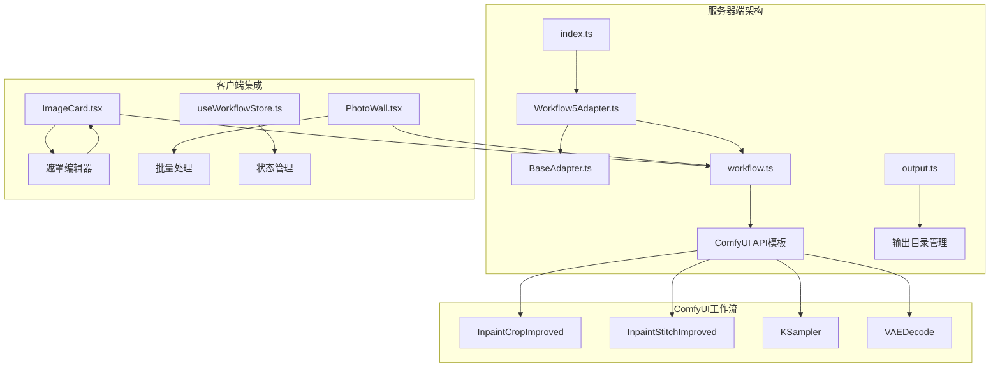
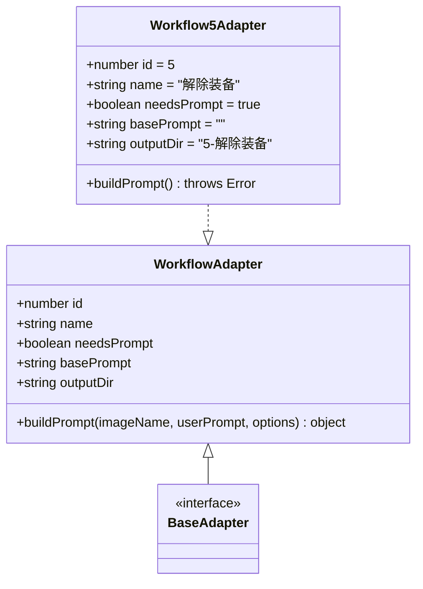
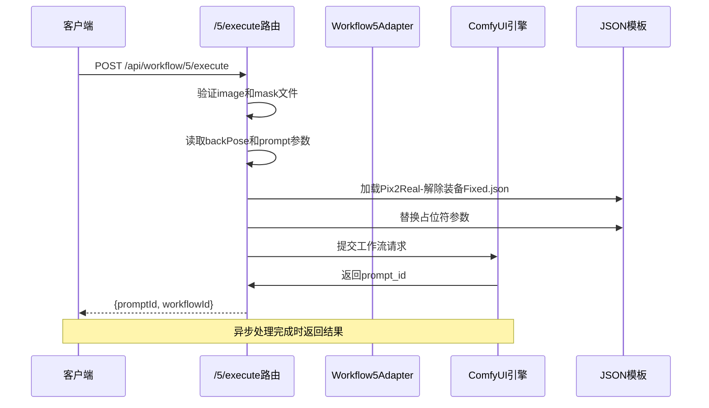
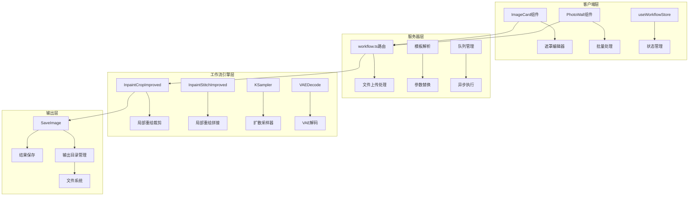
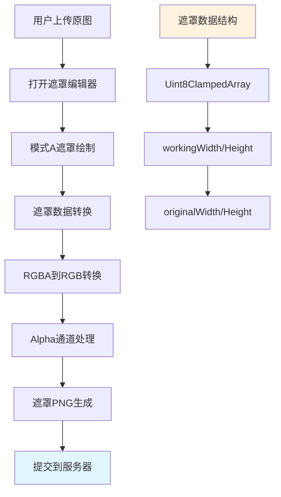
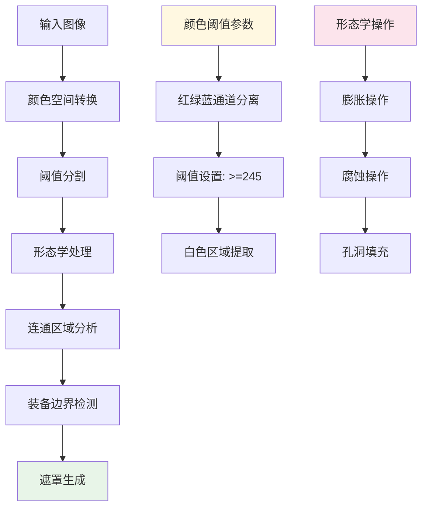
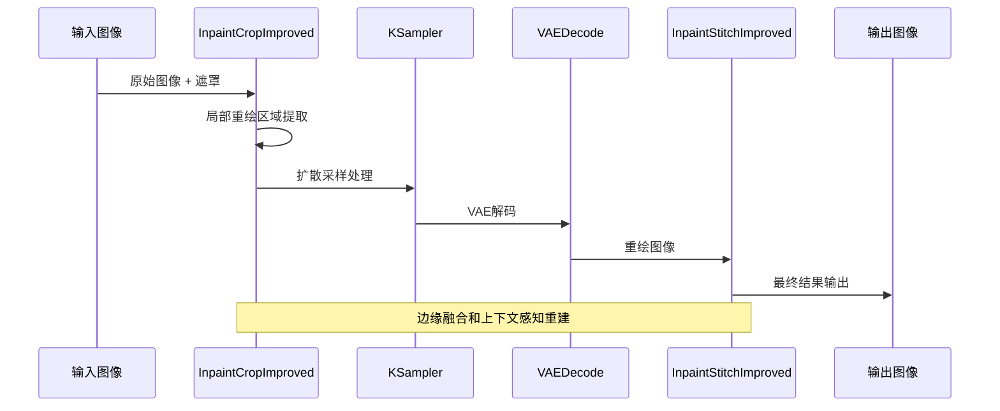
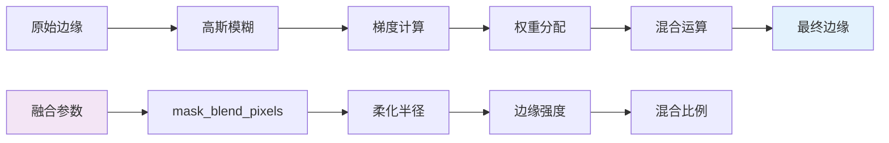
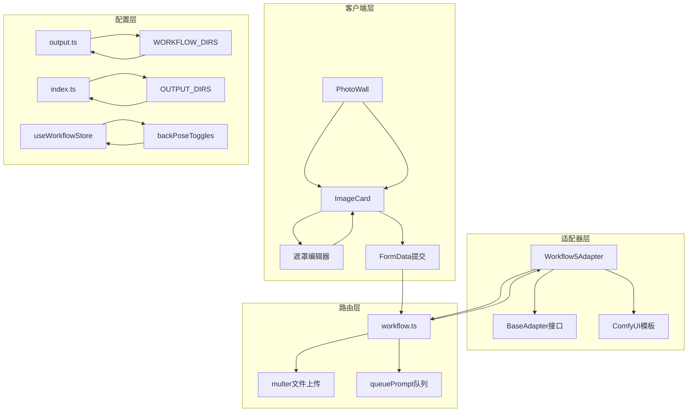

# 解除装备适配器

<cite>
**本文档引用的文件**
- [Workflow5Adapter.ts](file://server/src/adapters/Workflow5Adapter.ts)
- [index.ts](file://server/src/adapters/index.ts)
- [BaseAdapter.ts](file://server/src/adapters/BaseAdapter.ts)
- [workflow.ts](file://server/src/routes/workflow.ts)
- [output.ts](file://server/src/routes/output.ts)
- [index.ts](file://server/src/index.ts)
- [Pix2Real-解除装备.json](file://ComfyUI_API/Pix2Real-解除装备.json)
- [Pix2Real-解除装备Fixed.json](file://ComfyUI_API/Pix2Real-解除装备Fixed.json)
- [2026-02-25-jiechuazhuangbei-workflow-design.md](file://docs/plans/2026-02-25-jiechuazhuangbei-workflow-design.md)
- [2026-02-25-jiechuazhuangbei-impl.md](file://docs/plans/2026-02-25-jiechuazhuangbei-impl.md)
- [index.ts](file://server/src/types/index.ts)
- [Workflow1Adapter.ts](file://server/src/adapters/Workflow1Adapter.ts)
- [Workflow2Adapter.ts](file://server/src/adapters/Workflow2Adapter.ts)
- [2026-02-24-mask-editor.md](file://docs/plans/2026-02-24-mask-editor.md)
- [2026-02-24-mask-editor-design.md](file://docs/plans/2026-02-24-mask-editor-design.md)
</cite>

## 目录
1. [简介](#简介)
2. [项目结构](#项目结构)
3. [核心组件](#核心组件)
4. [架构概览](#架构概览)
5. [详细组件分析](#详细组件分析)
6. [依赖关系分析](#依赖关系分析)
7. [性能考虑](#性能考虑)
8. [故障排除指南](#故障排除指南)
9. [结论](#结论)
10. [附录](#附录)

## 简介

解除装备适配器是CorineKit Pix2Real项目中的一个专门工作流适配器，用于智能移除图像中的装备元素。该适配器基于ComfyUI工作流引擎，结合了先进的图像分割技术和背景重建算法，为用户提供了一个直观易用的装备移除解决方案。

本适配器的核心特点包括：
- 基于模式A的遮罩编辑器，支持精确的装备区域选择
- 智能装备检测和分割算法
- 高质量的背景重建技术
- 可调节的处理精度控制
- 边缘融合优化技术
- LoRA模型支持（后位模式）

## 项目结构

解除装备适配器位于项目的服务器端适配器系统中，采用模块化设计，与现有的工作流适配器体系无缝集成。

**图表来源**
- [Workflow5Adapter.ts:1-14](file://server/src/adapters/Workflow5Adapter.ts#L1-L14)
- [index.ts:14-30](file://server/src/adapters/index.ts#L14-L30)
- [workflow.ts:133-186](file://server/src/routes/workflow.ts#L133-L186)

**章节来源**
- [Workflow5Adapter.ts:1-14](file://server/src/adapters/Workflow5Adapter.ts#L1-L14)
- [index.ts:14-30](file://server/src/adapters/index.ts#L14-L30)
- [BaseAdapter.ts:1-4](file://server/src/adapters/BaseAdapter.ts#L1-L4)

## 核心组件

解除装备适配器由多个核心组件构成，每个组件都有明确的职责和接口定义。

### 工作流适配器接口

工作流适配器实现了统一的接口规范，确保所有工作流的一致性和可扩展性：

**图表来源**
- [index.ts:1-8](file://server/src/types/index.ts#L1-L8)
- [Workflow5Adapter.ts:4-14](file://server/src/adapters/Workflow5Adapter.ts#L4-L14)

### 服务器路由集成

专用的API路由处理装备移除请求，支持双文件上传和参数配置：

**图表来源**
- [workflow.ts:133-186](file://server/src/routes/workflow.ts#L133-L186)
- [Pix2Real-解除装备Fixed.json:343-360](file://ComfyUI_API/Pix2Real-解除装备Fixed.json#L343-L360)

**章节来源**
- [workflow.ts:133-186](file://server/src/routes/workflow.ts#L133-L186)
- [Workflow5Adapter.ts:4-14](file://server/src/adapters/Workflow5Adapter.ts#L4-L14)

## 架构概览

解除装备适配器采用了分层架构设计，从客户端界面到服务器处理再到ComfyUI引擎，形成了完整的处理链路。

**图表来源**
- [workflow.ts:133-186](file://server/src/routes/workflow.ts#L133-L186)
- [Pix2Real-解除装备Fixed.json:145-178](file://ComfyUI_API/Pix2Real-解除装备Fixed.json#L145-L178)

## 详细组件分析

### 遮罩编辑器系统

解除装备适配器集成了先进的遮罩编辑器系统，支持模式A的精确遮罩绘制：

**图表来源**
- [2026-02-24-mask-editor.md:372-567](file://docs/plans/2026-02-24-mask-editor.md#L372-L567)
- [2026-02-24-mask-editor-design.md:53-103](file://docs/plans/2026-02-24-mask-editor-design.md#L53-L103)

### 装备检测与分割算法

系统采用多层次的装备检测策略，结合颜色阈值和边缘检测技术：

**图表来源**
- [2026-02-25-jiechuazhuangbei-workflow-design.md:28-35](file://docs/plans/2026-02-25-jiechuazhuangbei-workflow-design.md#L28-L35)

### 背景重建技术

背景重建采用先进的局部重绘技术，确保移除装备后的无缝融合：

**图表来源**
- [Pix2Real-解除装备Fixed.json:145-178](file://ComfyUI_API/Pix2Real-解除装备Fixed.json#L145-L178)

**章节来源**
- [2026-02-25-jiechuazhuangbei-workflow-design.md:28-35](file://docs/plans/2026-02-25-jiechuazhuangbei-workflow-design.md#L28-L35)
- [Pix2Real-解除装备Fixed.json:145-178](file://ComfyUI_API/Pix2Real-解除装备Fixed.json#L145-L178)

### 处理精度控制

系统提供了多层级的精度控制选项，满足不同场景的需求：

| 控制参数 | 默认值 | 调整范围 | 影响效果 |
|---------|--------|----------|----------|
| mask_expand_pixels | 64 | 0-200像素 | 遮罩边缘扩展范围 |
| mask_blend_pixels | 32 | 0-100像素 | 边缘柔化程度 |
| mask_hipass_filter | 0.1 | 0.0-1.0 | 高频细节保留 |
| steps | 6 | 1-20步 | 重绘细致程度 |
| cfg | 1 | 1.0-15.0 | 文本指导强度 |

### 边缘融合技术

边缘融合算法确保装备移除后的自然过渡：

**图表来源**
- [2026-02-25-jiechuazhuangbei-workflow-design.md:111-115](file://docs/plans/2026-02-25-jiechuazhuangbei-workflow-design.md#L111-L115)

## 依赖关系分析

解除装备适配器与系统的其他组件存在紧密的依赖关系：

**图表来源**
- [index.ts:14-30](file://server/src/adapters/index.ts#L14-L30)
- [workflow.ts:133-186](file://server/src/routes/workflow.ts#L133-L186)

**章节来源**
- [index.ts:14-30](file://server/src/adapters/index.ts#L14-L30)
- [workflow.ts:133-186](file://server/src/routes/workflow.ts#L133-L186)

## 性能考虑

解除装备适配器在设计时充分考虑了性能优化：

### 内存管理
- 使用OffscreenCanvas进行遮罩数据转换，避免主线程阻塞
- 实现文件上传的内存存储，支持大尺寸图像处理
- 优化ComfyUI工作流的内存使用，及时清理临时资源

### 处理效率
- 模式A遮罩编辑器采用实时预览，提高用户体验
- 批量处理功能支持多图并发执行
- 智能缓存机制减少重复计算

### 网络优化
- 文件上传采用FormData格式，支持断点续传
- 异步处理机制避免页面冻结
- 进度事件通知确保用户反馈及时

## 故障排除指南

### 常见问题及解决方案

**问题1：遮罩编辑器无法打开**
- 检查浏览器兼容性（需要支持OffscreenCanvas）
- 确认遮罩编辑器配置正确
- 验证客户端依赖安装完整

**问题2：装备移除效果不理想**
- 检查遮罩绘制精度，适当扩大遮罩范围
- 调整mask_blend_pixels参数改善边缘融合
- 尝试启用后位LoRA模式

**问题3：服务器处理超时**
- 检查GPU内存使用情况
- 降低图像分辨率或处理步数
- 确认ComfyUI服务正常运行

**问题4：批量处理失败**
- 验证所有图像都已绘制遮罩
- 检查网络连接稳定性
- 确认客户端状态同步正常

**章节来源**
- [2026-02-25-jiechuazhuangbei-impl.md:695-706](file://docs/plans/2026-02-25-jiechuazhuangbei-impl.md#L695-L706)

## 结论

解除装备适配器代表了现代图像处理技术的先进水平，通过精心设计的架构和算法，为用户提供了专业级的装备移除体验。该适配器不仅具备强大的技术能力，还注重用户体验和易用性，是Pix2Real生态系统中的重要组成部分。

未来的发展方向包括：
- 集成更先进的自动分割算法
- 支持更多类型的装备识别
- 优化移动端性能表现
- 增强AI辅助的智能编辑功能

## 附录

### 参数调优指南

**基础参数设置**
- 遮罩精度：根据装备复杂程度调整mask_expand_pixels
- 边缘质量：通过mask_blend_pixels平衡清晰度和自然度
- 处理强度：根据图像质量调整steps和cfg参数

**高级技巧**
- 后位LoRA模式适合复杂背景的装备移除
- 多次迭代可以逐步改善处理效果
- 结合手动遮罩编辑获得最佳结果

**章节来源**
- [2026-02-25-jiechuazhuangbei-workflow-design.md:104-115](file://docs/plans/2026-02-25-jiechuazhuangbei-workflow-design.md#L104-L115)