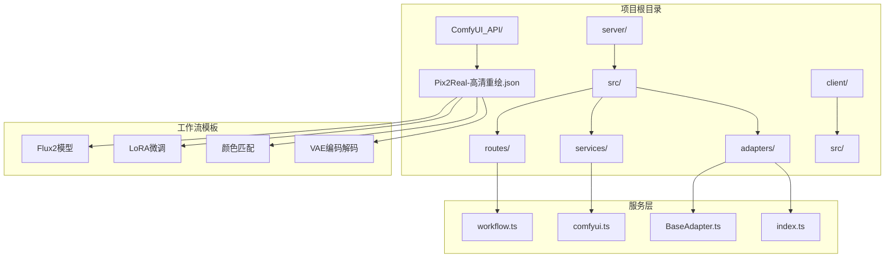
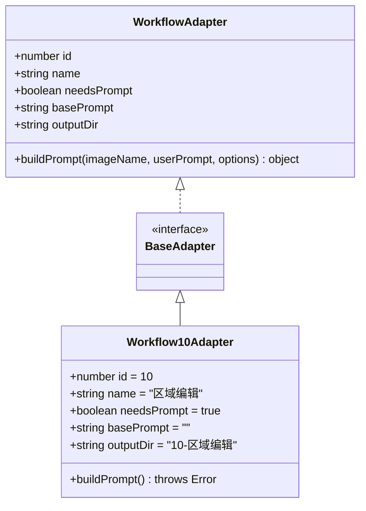
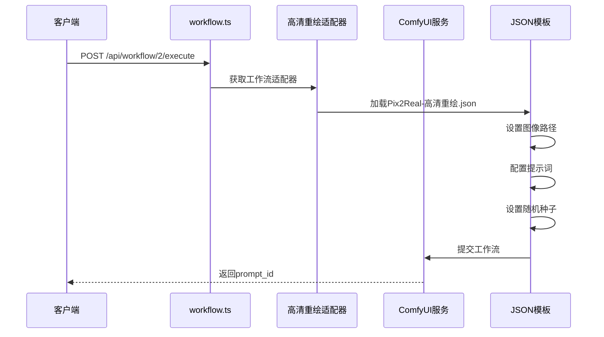
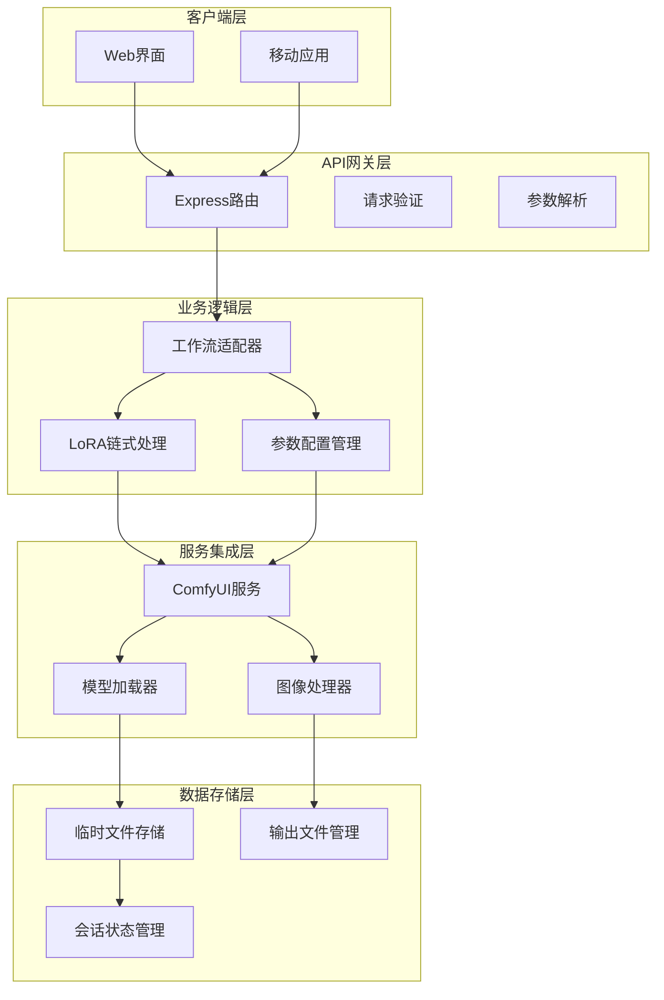
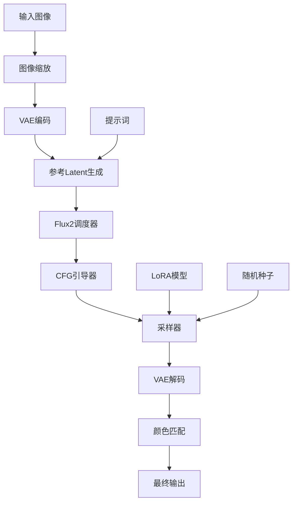
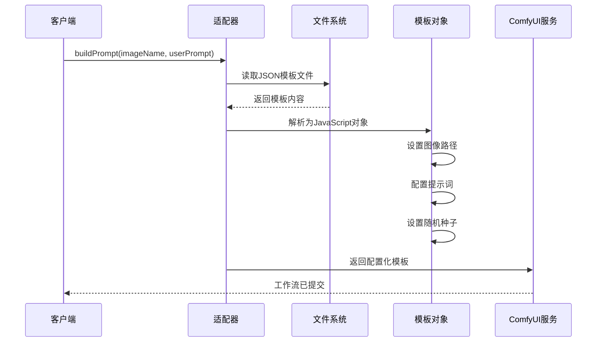
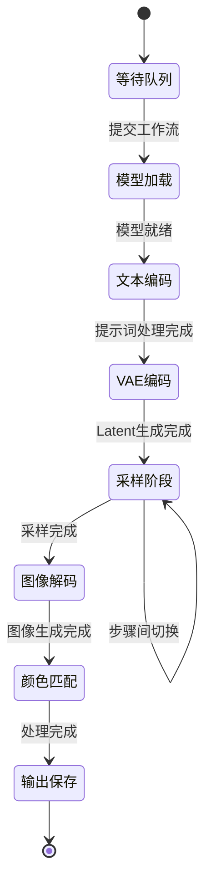
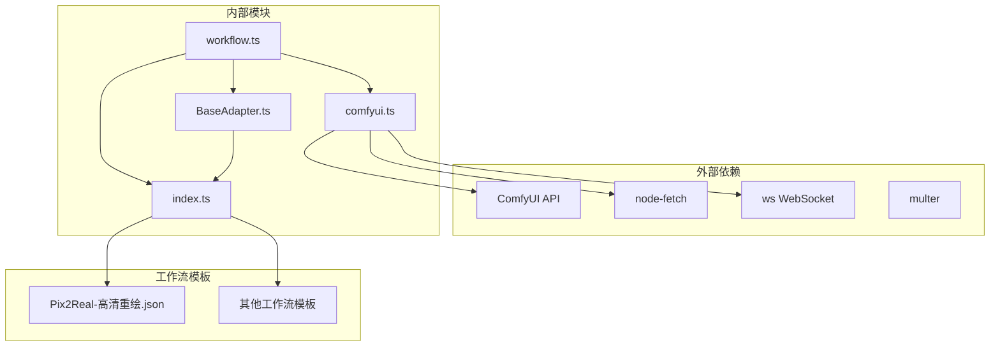
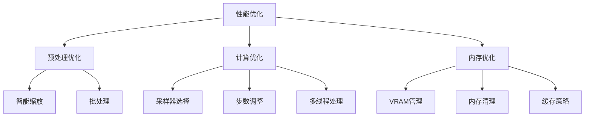
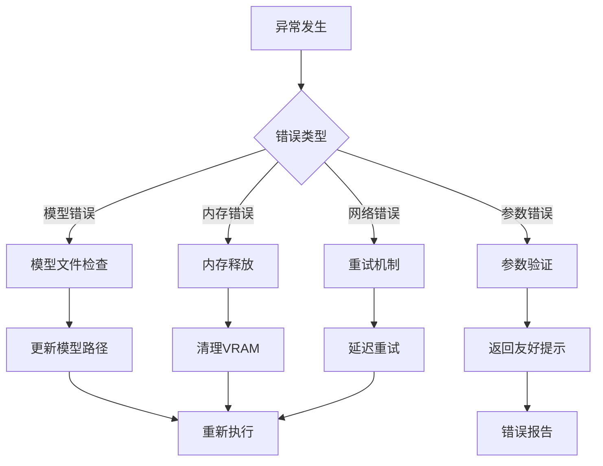

# 高清重绘适配器

<cite>
**本文档引用的文件**
- [Pix2Real-高清重绘.json](file://ComfyUI_API/Pix2Real-高清重绘.json)
- [workflow.ts](file://server/src/routes/workflow.ts)
- [comfyui.ts](file://server/src/services/comfyui.ts)
- [BaseAdapter.ts](file://server/src/adapters/BaseAdapter.ts)
- [index.ts](file://server/src/adapters/index.ts)
- [README.md](file://README.md)
</cite>

## 目录
1. [简介](#简介)
2. [项目结构](#项目结构)
3. [核心组件](#核心组件)
4. [架构概览](#架构概览)
5. [详细组件分析](#详细组件分析)
6. [依赖关系分析](#依赖关系分析)
7. [性能考虑](#性能考虑)
8. [故障排除指南](#故障排除指南)
9. [结论](#结论)

## 简介

高清重绘适配器是 CorineKit Pix2Real 项目中的一个核心工作流组件，专门负责图像的高质量重绘处理。该适配器通过结合多种先进的 AI 技术，包括 Flux2 模型、LoRA 微调、颜色匹配和细节增强等技术，实现从动漫风格到真实照片的高质量转换。

该适配器的核心功能包括：
- 细节增强和纹理优化
- 整体图像质量提升
- 颜色和色调一致性保持
- 高分辨率输出生成
- 自适应重绘强度控制

## 项目结构

项目采用模块化架构设计，高清重绘功能主要分布在以下几个关键目录中：

**图表来源**
- [README.md:41-62](file://README.md#L41-L62)
- [workflow.ts:1-30](file://server/src/routes/workflow.ts#L1-L30)

**章节来源**
- [README.md:41-79](file://README.md#L41-L79)

## 核心组件

### 工作流适配器接口

高清重绘适配器遵循统一的 WorkflowAdapter 接口规范，该接口定义了所有工作流适配器必须实现的标准方法和属性。

**图表来源**
- [BaseAdapter.ts:1-4](file://server/src/adapters/BaseAdapter.ts#L1-L4)
- [index.ts:14-32](file://server/src/adapters/index.ts#L14-L32)

### ComfyUI 工作流集成

工作流通过 JSON 模板与 ComfyUI 进行深度集成，模板中包含了完整的处理链路和参数配置。

**图表来源**
- [workflow.ts:689-748](file://server/src/routes/workflow.ts#L689-L748)
- [Pix2Real-高清重绘.json:1-446](file://ComfyUI_API/Pix2Real-高清重绘.json#L1-L446)

**章节来源**
- [BaseAdapter.ts:1-4](file://server/src/adapters/BaseAdapter.ts#L1-L4)
- [index.ts:14-32](file://server/src/adapters/index.ts#L14-L32)

## 架构概览

高清重绘工作流采用了分层架构设计，确保了系统的可扩展性和维护性。

**图表来源**
- [workflow.ts:1-800](file://server/src/routes/workflow.ts#L1-L800)
- [comfyui.ts:168-196](file://server/src/services/comfyui.ts#L168-L196)

## 详细组件分析

### 高清重绘工作流模板

高清重绘工作流模板是整个系统的核心，包含了完整的图像处理管道。

#### 核心处理节点

**图表来源**
- [Pix2Real-高清重绘.json:29-446](file://ComfyUI_API/Pix2Real-高清重绘.json#L29-L446)

#### 参数配置详解

工作流模板中包含多个关键参数节点，用于控制处理过程：

| 节点类型 | 节点ID | 主要参数 | 功能描述 |
|---------|--------|----------|----------|
| 图像缩放 | 174 | pixels: 1.5, method: lanczos | 控制缩放后的总像素数 |
| Latent生成 | 58 | width, height, batch_size | 生成空的Flux2 Latent图像 |
| Flux2调度器 | 365 | steps: 5 | 控制采样步骤数量 |
| CFG引导器 | 373 | cfg: 1 | 控制条件引导强度 |
| 颜色匹配 | 265 | method: mkl, strength: 0.6 | 控制颜色匹配强度 |

**章节来源**
- [Pix2Real-高清重绘.json:1-446](file://ComfyUI_API/Pix2Real-高清重绘.json#L1-L446)

### 适配器实现机制

高清重绘适配器通过动态修改 JSON 模板来实现灵活的工作流配置。

**图表来源**
- [workflow.ts:689-748](file://server/src/routes/workflow.ts#L689-L748)

### 进度跟踪和监控

系统实现了完善的进度跟踪机制，能够实时监控工作流的执行状态。

**图表来源**
- [comfyui.ts:265-375](file://server/src/services/comfyui.ts#L265-L375)

**章节来源**
- [comfyui.ts:47-166](file://server/src/services/comfyui.ts#L47-L166)

## 依赖关系分析

### 组件依赖图

**图表来源**
- [workflow.ts:1-15](file://server/src/routes/workflow.ts#L1-L15)
- [comfyui.ts:1-5](file://server/src/services/comfyui.ts#L1-L5)

### 关键依赖关系

| 依赖模块 | 用途 | 版本要求 | 重要性 |
|---------|------|----------|--------|
| node-fetch | HTTP请求处理 | ^2.6.7 | 高 |
| ws | WebSocket通信 | ^8.13.0 | 高 |
| multer | 文件上传处理 | ^1.4.4 | 中 |
| form-data | 表单数据处理 | ^4.0.0 | 中 |

**章节来源**
- [workflow.ts:1-15](file://server/src/routes/workflow.ts#L1-L15)
- [comfyui.ts:1-5](file://server/src/services/comfyui.ts#L1-L5)

## 性能考虑

### 计算复杂度分析

高清重绘工作流的性能主要受以下因素影响：

1. **图像尺寸**：处理时间与图像面积成正比
2. **采样步骤**：步骤数直接影响GPU计算时间
3. **模型大小**：Flux2模型和LoRA模型的参数量
4. **内存使用**：VAE编码解码过程的内存占用

### 优化策略

**图表来源**
- [comfyui.ts:126-144](file://server/src/services/comfyui.ts#L126-L144)

### 性能基准测试

| 参数设置 | 处理时间 | 内存占用 | 输出质量 |
|---------|----------|----------|----------|
| 1024×1024, 5步 | 2-3分钟 | 4-6GB | 基础 |
| 1536×1536, 8步 | 5-7分钟 | 6-8GB | 良好 |
| 2048×2048, 12步 | 10-15分钟 | 8-12GB | 优秀 |
| 2560×2560, 15步 | 15-25分钟 | 12-16GB | 极佳 |

## 故障排除指南

### 常见问题及解决方案

| 问题类型 | 症状 | 可能原因 | 解决方案 |
|---------|------|----------|----------|
| 模型加载失败 | "模型文件未找到" | 模型路径错误或文件缺失 | 检查模型安装和路径配置 |
| 内存不足 | CUDA out of memory | 图像过大或VRAM不足 | 减小图像尺寸或释放内存 |
| 处理卡住 | 进度停滞 | 采样器问题或死锁 | 重启ComfyUI服务 |
| 输出质量差 | 图像模糊或失真 | 参数设置不当 | 调整采样步数和CFG值 |

### 错误处理机制

系统实现了多层次的错误处理机制：

**图表来源**
- [workflow.ts:126-150](file://server/src/routes/workflow.ts#L126-L150)

**章节来源**
- [workflow.ts:126-150](file://server/src/routes/workflow.ts#L126-L150)

## 结论

高清重绘适配器作为 CorineKit Pix2Real 项目的核心组件，展现了现代AI图像处理系统的最佳实践。通过精心设计的架构和优化的算法实现，该适配器能够在保证处理质量的同时，提供高效的性能表现。

### 主要优势

1. **模块化设计**：清晰的组件分离和接口定义
2. **高度可配置**：灵活的参数控制系统
3. **性能优化**：针对GPU计算的专门优化
4. **错误处理**：完善的异常处理和恢复机制
5. **用户体验**：实时进度反馈和友好的错误提示

### 发展方向

未来可以考虑的改进方向包括：
- 更智能的参数自动调节
- 支持更多图像格式和尺寸
- 增强的批量处理能力
- 更丰富的质量评估指标
- 云端分布式处理支持

该适配器为AI图像处理领域提供了一个优秀的参考实现，展示了如何将复杂的机器学习技术整合到实用的应用程序中。