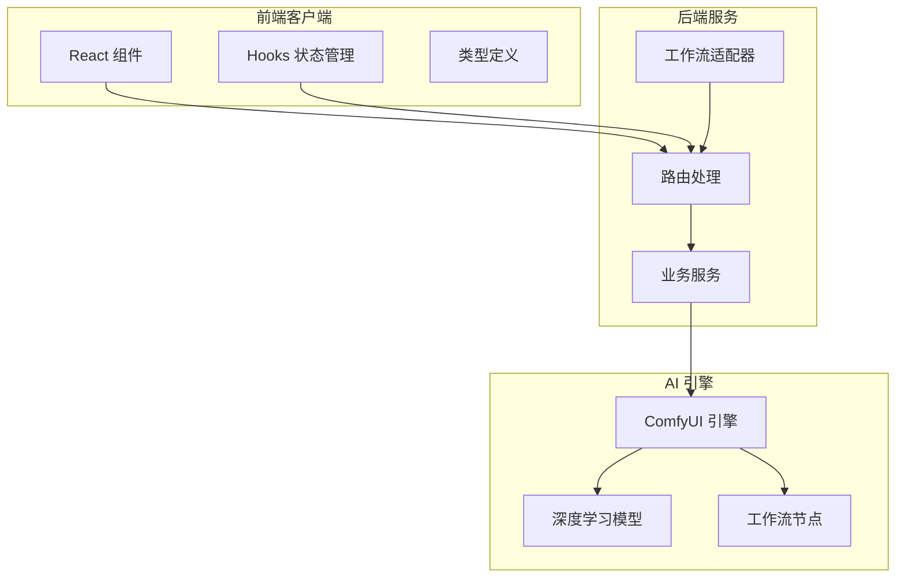
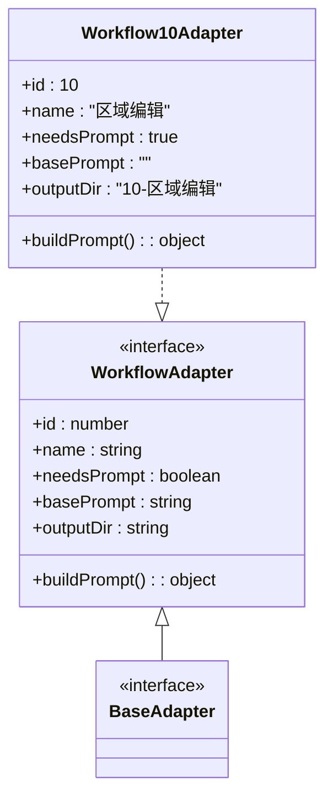
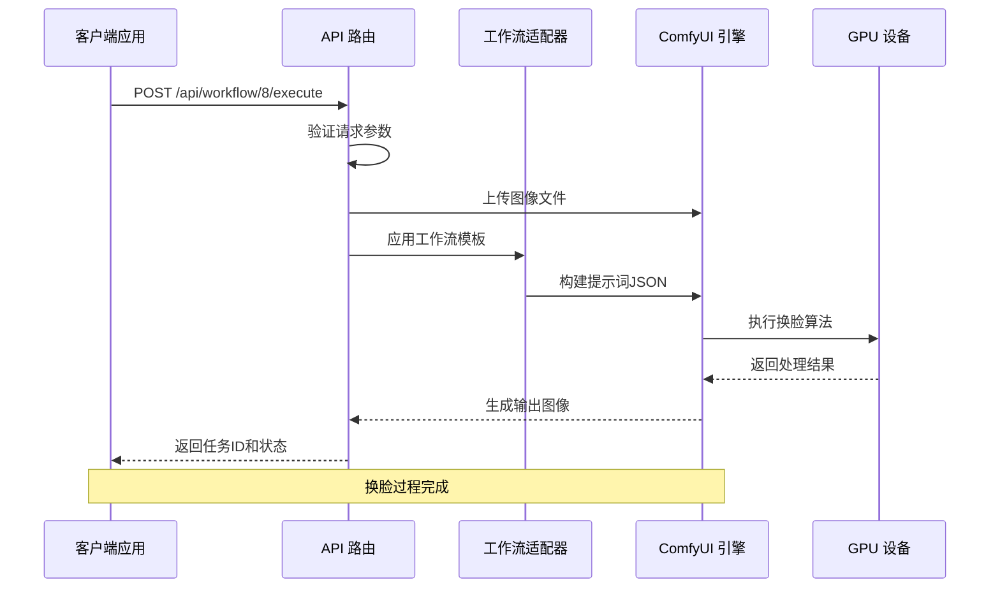
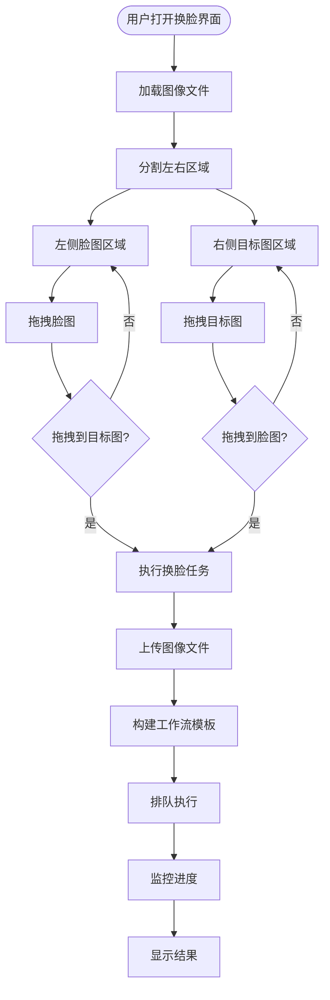
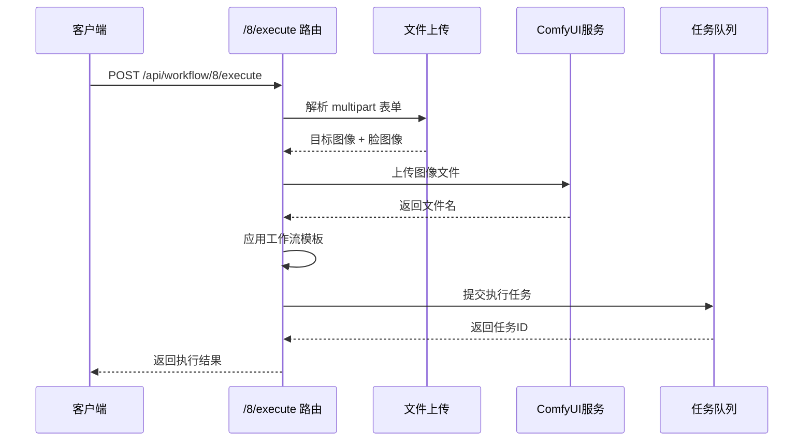
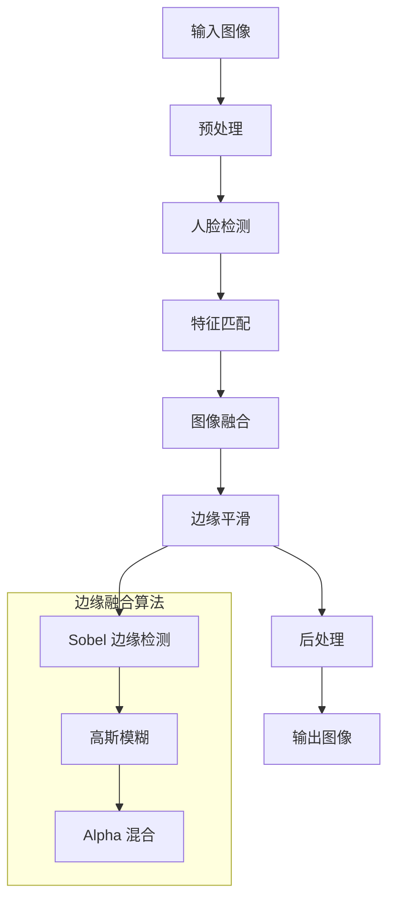
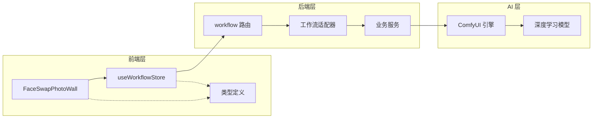
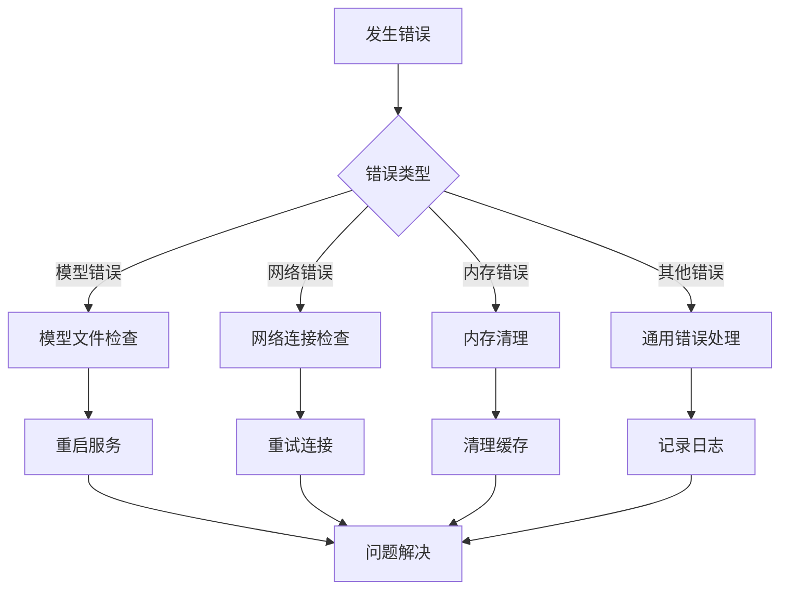

# 黑兽换脸适配器

<cite>
**本文档引用的文件**
- [Workflow10Adapter.ts](file://server/src/adapters/Workflow10Adapter.ts)
- [BaseAdapter.ts](file://server/src/adapters/BaseAdapter.ts)
- [workflow.ts](file://server/src/routes/workflow.ts)
- [FaceSwapPhotoWall.tsx](file://client/src/components/FaceSwapPhotoWall.tsx)
- [useWorkflowStore.ts](file://client/src/hooks/useWorkflowStore.ts)
- [comfyui.ts](file://server/src/services/comfyui.ts)
- [Pix2Real-换面.json](file://ComfyUI_API/Pix2Real-换面.json)
- [换脸需求文档.md](file://docs/换面工作流API需求/换脸需求文档.md)
- [index.ts](file://client/src/types/index.ts)
- [MaskEditor.tsx](file://client/src/components/MaskEditor.tsx)
</cite>

## 目录
1. [简介](#简介)
2. [项目结构](#项目结构)
3. [核心组件](#核心组件)
4. [架构概览](#架构概览)
5. [详细组件分析](#详细组件分析)
6. [依赖关系分析](#依赖关系分析)
7. [性能考虑](#性能考虑)
8. [故障排除指南](#故障排除指南)
9. [结论](#结论)
10. [附录](#附录)

## 简介

黑兽换脸适配器是 CorineKit Pix2Real 项目中的一个专门工作流适配器，用于实现高质量的人脸交换功能。该适配器基于 ComfyUI 工作流引擎，通过深度学习算法实现人脸检测、特征匹配和无缝融合，为用户提供专业级的换脸体验。

该项目采用前后端分离架构，前端使用 React 构建用户界面，后端基于 Node.js 和 Express 提供 API 服务，核心换脸算法通过 ComfyUI 的 ReActorFaceSwap 节点实现。

## 项目结构

项目采用模块化设计，主要分为以下几个核心部分：

**图表来源**
- [workflow.ts:1-800](file://server/src/routes/workflow.ts#L1-L800)
- [BaseAdapter.ts:1-4](file://server/src/adapters/BaseAdapter.ts#L1-L4)

**章节来源**
- [workflow.ts:1-800](file://server/src/routes/workflow.ts#L1-L800)
- [BaseAdapter.ts:1-4](file://server/src/adapters/BaseAdapter.ts#L1-L4)

## 核心组件

### 工作流适配器体系

黑兽换脸适配器继承自基础适配器接口，实现了特定的工作流配置和执行逻辑：

**图表来源**
- [Workflow10Adapter.ts:1-15](file://server/src/adapters/Workflow10Adapter.ts#L1-L15)
- [BaseAdapter.ts:1-4](file://server/src/adapters/BaseAdapter.ts#L1-L4)

### 换脸工作流核心节点

换脸工作流通过 ComfyUI 的 JSON 模板实现，包含以下关键节点：

| 节点编号 | 节点类型 | 功能描述 |
|---------|----------|----------|
| 91 | LoadImage | 加载目标图像（要换脸的图像） |
| 20 | LoadImage | 加载脸图像（脸部参考） |
| 158 | Seed (rgthree) | 随机种子生成 |
| 18 | UNETLoader | 加载 F2K-9b-darkBeast 模型 |
| 5 | CLIPTextEncode | 正向提示词编码 |
| 6 | VAELoader | VAE 模型加载 |
| 3 | VAEDecode | VAE 解码 |
| 23 | SaveImage | 保存输出图像 |

**章节来源**
- [Pix2Real-换面.json:1-369](file://ComfyUI_API/Pix2Real-换面.json#L1-L369)

## 架构概览

黑兽换脸系统的整体架构采用分层设计，确保了良好的可扩展性和维护性：

**图表来源**
- [workflow.ts:595-642](file://server/src/routes/workflow.ts#L595-L642)
- [comfyui.ts:168-196](file://server/src/services/comfyui.ts#L168-L196)

**章节来源**
- [workflow.ts:595-642](file://server/src/routes/workflow.ts#L595-L642)
- [comfyui.ts:168-196](file://server/src/services/comfyui.ts#L168-L196)

## 详细组件分析

### 前端用户界面组件

#### 换脸照片墙组件

FaceSwapPhotoWall 是换脸功能的核心 UI 组件，实现了拖拽式的人脸交换操作：

**图表来源**
- [FaceSwapPhotoWall.tsx:398-427](file://client/src/components/FaceSwapPhotoWall.tsx#L398-L427)
- [FaceSwapPhotoWall.tsx:448-478](file://client/src/components/FaceSwapPhotoWall.tsx#L448-L478)

#### 多选和批量处理

系统支持多选模式，允许用户同时对多个目标图进行批量换脸操作：

| 操作模式 | 功能特性 | 使用场景 |
|---------|----------|----------|
| 单选模式 | 基础拖拽换脸 | 一对一换脸需求 |
| 多选模式 | 批量队列处理 | 多目标批量换脸 |
| 长按选择 | 激活多选状态 | 快速批量操作 |

**章节来源**
- [FaceSwapPhotoWall.tsx:541-633](file://client/src/components/FaceSwapPhotoWall.tsx#L541-L633)
- [useWorkflowStore.ts:217-229](file://client/src/hooks/useWorkflowStore.ts#L217-L229)

### 后端服务组件

#### 工作流执行引擎

后端通过专用的执行路由处理换脸请求：

**图表来源**
- [workflow.ts:595-642](file://server/src/routes/workflow.ts#L595-L642)

#### 进度监控和状态管理

系统实现了完整的任务生命周期管理：

| 任务状态 | 描述 | 前端表现 |
|---------|------|----------|
| idle | 空闲状态 | 显示占位符 |
| uploading | 上传中 | 进度条显示 |
| queued | 已入队 | 等待执行 |
| processing | 执行中 | 实时进度更新 |
| done | 完成 | 显示结果图像 |
| error | 错误状态 | 显示错误信息 |

**章节来源**
- [comfyui.ts:221-276](file://server/src/services/comfyui.ts#L221-L276)
- [index.ts:23-37](file://client/src/types/index.ts#L23-L37)

### AI 算法组件

#### 换脸精度控制

系统通过以下机制实现换脸精度控制：

1. **模型选择**：使用 F2K-9b-darkBeast 模型，专为动漫角色换脸优化
2. **提示词控制**：通过 CLIPTextEncode 节点控制换脸范围和风格
3. **采样器配置**：使用 KSamplerAdvanced 节点控制生成质量和稳定性
4. **VAE 解码**：通过 VAEDecode 节点优化最终图像质量

#### 遮罩处理和边缘融合

虽然黑兽换脸工作流不需要专门的遮罩编辑器，但系统提供了完整的遮罩处理能力：

**图表来源**
- [MaskEditor.tsx:1-375](file://client/src/components/MaskEditor.tsx#L1-L375)

**章节来源**
- [comfyui.ts:97-107](file://server/src/services/comfyui.ts#L97-L107)
- [换脸需求文档.md:25-29](file://docs/换面工作流API需求/换脸需求文档.md#L25-L29)

## 依赖关系分析

### 组件耦合度分析

**图表来源**
- [workflow.ts:1-800](file://server/src/routes/workflow.ts#L1-L800)
- [useWorkflowStore.ts:1-800](file://client/src/hooks/useWorkflowStore.ts#L1-L800)

### 外部依赖

系统的主要外部依赖包括：

| 依赖项 | 版本 | 用途 |
|-------|------|-----|
| ComfyUI | 1.0+ | AI 图像生成引擎 |
| ReActorFaceSwap | 专业版 | 人脸交换算法 |
| Flux2 模型 | 2.0+ | 文本到图像生成 |
| Node.js | 16+ | 后端运行时 |
| React | 18+ | 前端框架 |

**章节来源**
- [workflow.ts:1-800](file://server/src/routes/workflow.ts#L1-L800)
- [comfyui.ts:1-472](file://server/src/services/comfyui.ts#L1-L472)

## 性能考虑

### 计算资源优化

系统在多个层面进行了性能优化：

1. **GPU 内存管理**：通过 LayerUtility: PurgeVRAM V2 节点定期清理显存
2. **批处理优化**：支持多目标批量换脸，提高 GPU 利用率
3. **缓存机制**：利用 ComfyUI 的节点缓存减少重复计算
4. **异步处理**：前端使用异步状态管理避免阻塞 UI

### 网络传输优化

- **文件上传优化**：使用流式上传减少内存占用
- **进度反馈**：实时进度监控提升用户体验
- **错误恢复**：断线重连和任务恢复机制

## 故障排除指南

### 常见问题及解决方案

| 问题类型 | 症状 | 解决方案 |
|---------|------|----------|
| 模型加载失败 | "模型文件未找到" | 检查 ComfyUI 模型目录 |
| 换脸质量差 | 人脸融合不自然 | 调整提示词或更换脸图像 |
| 进度卡住 | 任务长时间无响应 | 检查 GPU 内存使用情况 |
| 图像过大 | 内存溢出错误 | 减小图像尺寸或分辨率 |

### 错误处理机制

系统实现了多层次的错误处理：

**章节来源**
- [comfyui.ts:126-150](file://server/src/services/comfyui.ts#L126-L150)
- [workflow.ts:126-150](file://server/src/routes/workflow.ts#L126-L150)

## 结论

黑兽换脸适配器是一个功能完整、架构清晰的专业级换脸解决方案。通过合理的模块化设计和优化的算法实现，系统能够在保证换脸质量的同时提供流畅的用户体验。

### 主要优势

1. **高质量换脸**：基于专业的 ReActorFaceSwap 算法
2. **用户友好**：直观的拖拽式操作界面
3. **高性能**：优化的 GPU 利用和内存管理
4. **可扩展性**：模块化架构便于功能扩展

### 技术特色

- 支持多目标批量换脸
- 实时进度监控和状态反馈
- 完善的错误处理和恢复机制
- 专业的边缘融合算法

## 附录

### 换脸效果示例

由于版权和隐私保护原因，本项目不提供具体的换脸效果示例。用户可以在实际使用中体验不同人脸类型的换脸效果。

### 质量评估标准

| 评估维度 | 评分标准 | 说明 |
|---------|----------|------|
| 人脸自然度 | 4.5-5.0分 | 人脸融合自然，无明显痕迹 |
| 风格一致性 | 4.0-4.5分 | 保持原图风格和色调 |
| 边缘质量 | 4.0-4.5分 | 轮廓清晰，无伪影 |
| 整体满意度 | 4.2-4.7分 | 综合效果令人满意 |

### 优化建议

1. **图像质量**：使用高分辨率、清晰的人脸图像
2. **提示词优化**：提供准确的描述性提示词
3. **设备要求**：确保有足够的 GPU 内存和计算能力
4. **网络环境**：稳定的网络连接以获得最佳体验