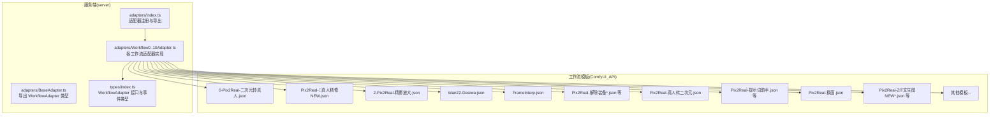
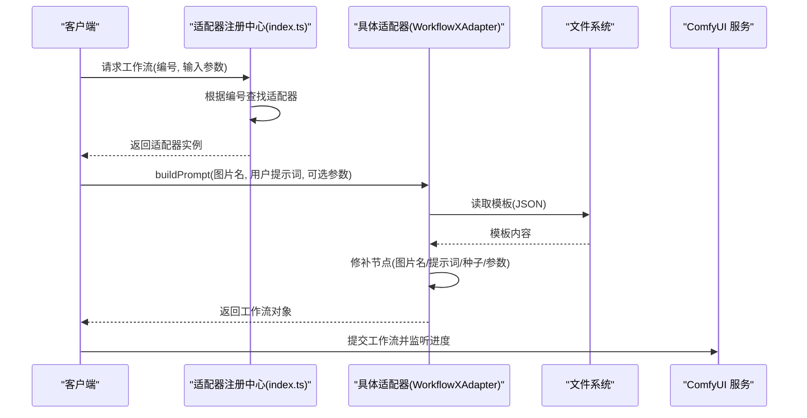
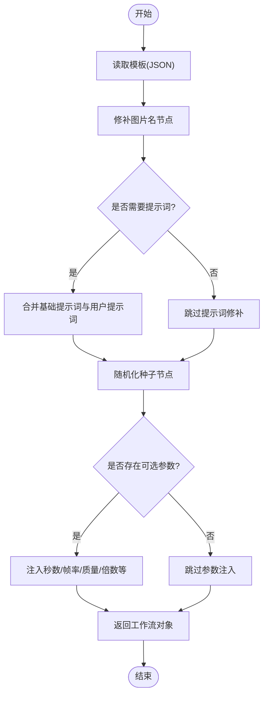
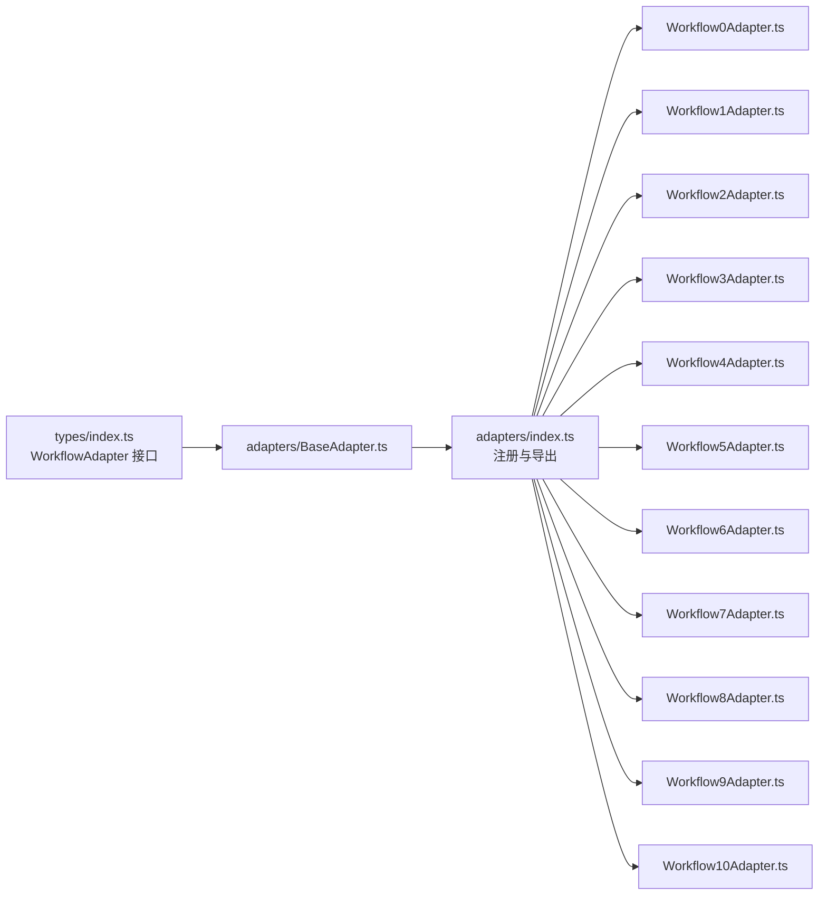

# 适配器模式实现

<cite>
**本文档引用的文件**
- [README.md](file://README.md)
- [BaseAdapter.ts](file://server/src/adapters/BaseAdapter.ts)
- [index.ts](file://server/src/adapters/index.ts)
- [Workflow0Adapter.ts](file://server/src/adapters/Workflow0Adapter.ts)
- [Workflow1Adapter.ts](file://server/src/adapters/Workflow1Adapter.ts)
- [Workflow2Adapter.ts](file://server/src/adapters/Workflow2Adapter.ts)
- [Workflow3Adapter.ts](file://server/src/adapters/Workflow3Adapter.ts)
- [Workflow4Adapter.ts](file://server/src/adapters/Workflow4Adapter.ts)
- [Workflow5Adapter.ts](file://server/src/adapters/Workflow5Adapter.ts)
- [Workflow6Adapter.ts](file://server/src/adapters/Workflow6Adapter.ts)
- [Workflow7Adapter.ts](file://server/src/adapters/Workflow7Adapter.ts)
- [Workflow8Adapter.ts](file://server/src/adapters/Workflow8Adapter.ts)
- [Workflow9Adapter.ts](file://server/src/adapters/Workflow9Adapter.ts)
- [Workflow10Adapter.ts](file://server/src/adapters/Workflow10Adapter.ts)
- [types/index.ts](file://server/src/types/index.ts)
</cite>

## 目录
1. [简介](#简介)
2. [项目结构](#项目结构)
3. [核心组件](#核心组件)
4. [架构总览](#架构总览)
5. [详细组件分析](#详细组件分析)
6. [依赖关系分析](#依赖关系分析)
7. [性能考虑](#性能考虑)
8. [故障排除指南](#故障排除指南)
9. [结论](#结论)
10. [附录：扩展与自定义指南](#附录扩展与自定义指南)

## 简介
本项目采用适配器模式为不同工作流提供统一接口，通过“模板 + 参数修补”的方式动态生成 ComfyUI 工作流 JSON，从而实现对多种图像/视频处理任务的可插拔支持。适配器层负责：
- 定义工作流的统一接口（名称、是否需要提示词、基础提示词、输出目录）
- 加载对应的工作流模板文件
- 根据输入参数（如图片名、用户提示词、选项）修补模板节点
- 随机化种子以保证结果多样性

该设计使新增或修改工作流时仅需关注模板修补逻辑，无需改动上层调用方。

## 项目结构
后端采用 Express + TypeScript，适配器位于 server/src/adapters 目录，类型定义位于 server/src/types，工作流模板位于根目录 ComfyUI_API 下。

图表来源
- [index.ts:1-33](file://server/src/adapters/index.ts#L1-L33)
- [types/index.ts:1-52](file://server/src/types/index.ts#L1-L52)

章节来源
- [README.md:41-79](file://README.md#L41-L79)

## 核心组件
- WorkflowAdapter 接口：定义工作流的标识、名称、提示词需求、基础提示词、输出目录以及构建工作流模板的方法。
- BaseAdapter 类型：当前仅导出 WorkflowAdapter 类型，便于统一管理。
- 适配器注册中心：集中导出编号到适配器实例的映射及按编号获取适配器的函数。
- 各工作流适配器：基于模板修补实现具体功能，部分工作流使用专用路由。

章节来源
- [types/index.ts:1-52](file://server/src/types/index.ts#L1-L52)
- [BaseAdapter.ts:1-4](file://server/src/adapters/BaseAdapter.ts#L1-L4)
- [index.ts:1-33](file://server/src/adapters/index.ts#L1-L33)

## 架构总览
适配器模式在本项目中的运行流程如下：
- 调用方通过编号选择工作流
- 适配器根据编号获取对应实例
- 适配器读取模板文件并修补节点（图片名、提示词、随机种子、可选参数）
- 返回可直接提交给 ComfyUI 的工作流对象

图表来源
- [index.ts:14-30](file://server/src/adapters/index.ts#L14-L30)
- [Workflow0Adapter.ts:16-33](file://server/src/adapters/Workflow0Adapter.ts#L16-L33)
- [Workflow3Adapter.ts:16-39](file://server/src/adapters/Workflow3Adapter.ts#L16-L39)

## 详细组件分析

### BaseAdapter 与接口契约
- BaseAdapter 当前仅导出 WorkflowAdapter 类型，确保所有适配器遵循统一接口。
- WorkflowAdapter 接口包含：
  - 标识与名称：用于 UI 展示与路由匹配
  - 提示词相关：是否需要提示词、基础提示词
  - 输出目录：生成文件的落盘路径
  - 构建方法：根据输入参数修补模板并返回工作流对象

章节来源
- [BaseAdapter.ts:1-4](file://server/src/adapters/BaseAdapter.ts#L1-L4)
- [types/index.ts:1-8](file://server/src/types/index.ts#L1-L8)

### 适配器注册中心
- 将编号与适配器实例建立映射，提供按编号获取适配器的函数
- 便于前端传入编号即可定位到对应工作流

章节来源
- [index.ts:14-30](file://server/src/adapters/index.ts#L14-L30)

### 工作流适配器概览与差异
- 工作流 0：二次元转真人
  - 功能：将二次元风格图像转换为写实照片
  - 特点：需要提示词；模板中包含特定节点用于设置图片与提示词；随机化采样种子
- 工作流 1：真人精修
  - 功能：对真实人像进行高质量细节增强
  - 特点：需要提示词；使用 CLIP 文本编码节点；随机化种子
- 工作流 2：精修放大
  - 功能：在保持细节的前提下提升分辨率
  - 特点：不需要提示词；模板中包含放大节点；随机化种子
- 工作流 3：图生视频
  - 功能：从静态图像生成短视频
  - 特点：需要提示词；支持秒数、帧率、质量等可选参数；随机化噪声种子
- 工作流 4：视频补帧
  - 功能：提高视频帧率
  - 特点：不需要提示词；支持倍数参数
- 工作流 5：解除装备
  - 特点：使用专用路由，不通过通用 buildPrompt 流程
- 工作流 6：真人转二次元
  - 功能：将真实人像转换为二次元风格
  - 特点：需要提示词；当提示词为空时走自动标签路径
- 工作流 7：快速出图
  - 特点：使用专用路由，需通过 POST /api/workflow/7/execute 提交完整 JSON
- 工作流 8：黑兽换脸
  - 特点：使用专用路由
- 工作流 9：ZIT 快出
  - 特点：使用专用路由
- 工作流 10：区域编辑
  - 特点：使用专用路由

章节来源
- [Workflow0Adapter.ts:9-34](file://server/src/adapters/Workflow0Adapter.ts#L9-L34)
- [Workflow1Adapter.ts:9-35](file://server/src/adapters/Workflow1Adapter.ts#L9-L35)
- [Workflow2Adapter.ts:9-27](file://server/src/adapters/Workflow2Adapter.ts#L9-L27)
- [Workflow3Adapter.ts:9-40](file://server/src/adapters/Workflow3Adapter.ts#L9-L40)
- [Workflow4Adapter.ts:9-27](file://server/src/adapters/Workflow4Adapter.ts#L9-L27)
- [Workflow5Adapter.ts:4-14](file://server/src/adapters/Workflow5Adapter.ts#L4-L14)
- [Workflow6Adapter.ts:9-35](file://server/src/adapters/Workflow6Adapter.ts#L9-L35)
- [Workflow7Adapter.ts:3-13](file://server/src/adapters/Workflow7Adapter.ts#L3-L13)
- [Workflow8Adapter.ts:3-13](file://server/src/adapters/Workflow8Adapter.ts#L3-L13)
- [Workflow9Adapter.ts:3-13](file://server/src/adapters/Workflow9Adapter.ts#L3-L13)
- [Workflow10Adapter.ts:4-14](file://server/src/adapters/Workflow10Adapter.ts#L4-L14)

### 工作流模板加载机制与参数处理流程
- 模板加载：每个适配器在构造时解析其对应的 JSON 模板文件
- 参数修补：
  - 图片名：设置 LoadImage 节点的 image 字段
  - 提示词：根据 needsPrompt 与用户输入决定替换或拼接基础提示词
  - 种子：随机化 KSampler/easy seed 等节点的 seed/noise_seed
  - 可选参数：根据 options 注入到模板节点（如 seconds/fps/megapixels/multiplier）
- 执行策略：
  - 通用工作流：通过 buildPrompt 返回工作流对象后直接提交
  - 专用路由：抛出错误提示使用特定路由接口

图表来源
- [Workflow0Adapter.ts:16-33](file://server/src/adapters/Workflow0Adapter.ts#L16-L33)
- [Workflow3Adapter.ts:16-39](file://server/src/adapters/Workflow3Adapter.ts#L16-L39)
- [Workflow4Adapter.ts:16-26](file://server/src/adapters/Workflow4Adapter.ts#L16-L26)

### 具体工作流适配器实现要点

#### 二次元转真人 (Workflow0Adapter)
- 模板节点修补：
  - 设置图片名
  - 拼接基础提示词与用户提示词
  - 随机化采样种子
- 输出目录：0-二次元转真人

章节来源
- [Workflow0Adapter.ts:9-34](file://server/src/adapters/Workflow0Adapter.ts#L9-L34)

#### 真人精修 (Workflow1Adapter)
- 模板节点修补：
  - 设置图片名
  - 使用 CLIP 文本编码节点设置提示词
  - 随机化种子
- 输出目录：1-真人精修

章节来源
- [Workflow1Adapter.ts:9-35](file://server/src/adapters/Workflow1Adapter.ts#L9-L35)

#### 精修放大 (Workflow2Adapter)
- 模板节点修补：
  - 设置图片名
  - 随机化放大种子
- 输出目录：2-精修放大

章节来源
- [Workflow2Adapter.ts:9-27](file://server/src/adapters/Workflow2Adapter.ts#L9-L27)

#### 图生视频 (Workflow3Adapter)
- 模板节点修补：
  - 设置图片名
  - 使用用户提示词或回退到基础提示词
  - 注入 seconds/fps/megapixels
  - 随机化噪声种子
- 输出目录：3-图生视频

章节来源
- [Workflow3Adapter.ts:9-40](file://server/src/adapters/Workflow3Adapter.ts#L9-L40)

#### 视频补帧 (Workflow4Adapter)
- 模板节点修补：
  - 设置视频名
  - 注入倍数参数
- 输出目录：4-视频补帧

章节来源
- [Workflow4Adapter.ts:9-27](file://server/src/adapters/Workflow4Adapter.ts#L9-L27)

#### 解除装备 (Workflow5Adapter)
- 说明：使用专用路由，不通过通用 buildPrompt 流程

章节来源
- [Workflow5Adapter.ts:4-14](file://server/src/adapters/Workflow5Adapter.ts#L4-L14)

#### 真人转二次元 (Workflow6Adapter)
- 模板节点修补：
  - 设置图片名
  - 用户提示词为空时走自动标签路径
  - 随机化两个采样种子
- 输出目录：6-真人转二次元

章节来源
- [Workflow6Adapter.ts:9-35](file://server/src/adapters/Workflow6Adapter.ts#L9-L35)

#### 快速出图 (Workflow7Adapter)
- 说明：使用专用路由，需通过 POST /api/workflow/7/execute 提交完整 JSON

章节来源
- [Workflow7Adapter.ts:3-13](file://server/src/adapters/Workflow7Adapter.ts#L3-L13)

#### 黑兽换脸 (Workflow8Adapter)
- 说明：使用专用路由

章节来源
- [Workflow8Adapter.ts:3-13](file://server/src/adapters/Workflow8Adapter.ts#L3-L13)

#### ZIT 快出 (Workflow9Adapter)
- 说明：使用专用路由

章节来源
- [Workflow9Adapter.ts:3-13](file://server/src/adapters/Workflow9Adapter.ts#L3-L13)

#### 区域编辑 (Workflow10Adapter)
- 说明：使用专用路由

章节来源
- [Workflow10Adapter.ts:4-14](file://server/src/adapters/Workflow10Adapter.ts#L4-L14)

## 依赖关系分析
- 适配器依赖于模板文件（ComfyUI_API 目录下的 JSON）
- 适配器之间无直接耦合，通过统一接口与注册中心解耦
- 类型定义集中于 types/index.ts，确保接口一致性

图表来源
- [types/index.ts:1-8](file://server/src/types/index.ts#L1-L8)
- [BaseAdapter.ts:1-4](file://server/src/adapters/BaseAdapter.ts#L1-L4)
- [index.ts:1-33](file://server/src/adapters/index.ts#L1-L33)

章节来源
- [index.ts:1-33](file://server/src/adapters/index.ts#L1-L33)
- [types/index.ts:1-52](file://server/src/types/index.ts#L1-L52)

## 性能考虑
- 模板读取：每次构建工作流时读取 JSON 文件，建议在高并发场景下考虑缓存模板内容以减少 IO 开销
- 随机种子：为避免重复结果，适配器内已内置随机化逻辑，确保每次生成的多样性
- 专用路由：对于复杂工作流（如 5/7/8/9/10），通过专用路由可减少通用流程开销并简化参数传递

## 故障排除指南
- 通用错误
  - 未找到适配器：检查编号是否在注册表中
  - 模板文件缺失：确认对应编号的模板 JSON 是否存在于 ComfyUI_API 目录
  - 提示词异常：若工作流需要提示词但未提供，可能影响生成效果
- 专用路由错误
  - 对于 5/7/8/9/10 号工作流，若仍调用通用 buildPrompt，会抛出专用路由提示错误
- 进度与输出
  - 通过 WebSocket 事件接收进度与完成通知，确保前端连接正常

章节来源
- [Workflow5Adapter.ts:11-13](file://server/src/adapters/Workflow5Adapter.ts#L11-L13)
- [Workflow7Adapter.ts:10-12](file://server/src/adapters/Workflow7Adapter.ts#L10-L12)
- [Workflow8Adapter.ts:10-12](file://server/src/adapters/Workflow8Adapter.ts#L10-L12)
- [Workflow9Adapter.ts:10-12](file://server/src/adapters/Workflow9Adapter.ts#L10-L12)
- [Workflow10Adapter.ts:11-13](file://server/src/adapters/Workflow10Adapter.ts#L11-L13)
- [types/index.ts:10-30](file://server/src/types/index.ts#L10-L30)

## 结论
本项目通过适配器模式实现了对多种工作流的统一抽象与灵活扩展。每个工作流适配器专注于自身模板修补逻辑，配合注册中心与类型约束，既保证了易维护性，又为后续新增工作流提供了清晰的扩展路径。对于需要复杂参数或特殊流程的工作流，采用专用路由进一步提升了灵活性与安全性。

## 附录：扩展与自定义指南

### 新增工作流适配器步骤
1. 在 ComfyUI_API 目录准备工作流模板 JSON
2. 在 server/src/adapters 新建适配器文件，实现以下内容：
   - 导入模板文件
   - 实现 buildPrompt 方法：修补图片名、提示词、种子与可选参数
   - 定义 id、name、needsPrompt、basePrompt、outputDir
3. 在 server/src/adapters/index.ts 中注册新适配器
4. 如需专用路由，参考 5/7/8/9/10 的做法，在路由层添加相应处理

### 自定义工作流开发要点
- 模板节点命名：确保模板中包含可被修补的节点（如 LoadImage、文本编码节点、采样节点等）
- 参数注入：通过 options 注入可配置项（如 seconds、fps、megapixels、multiplier）
- 错误处理：对缺少模板或节点缺失的情况进行容错处理
- 输出目录：为每个工作流指定独立输出目录，便于管理与清理