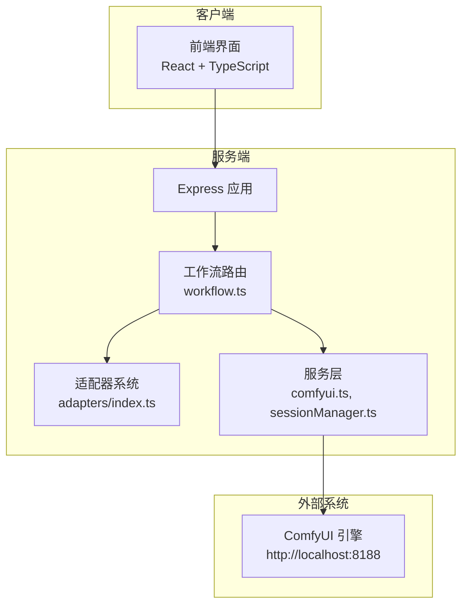
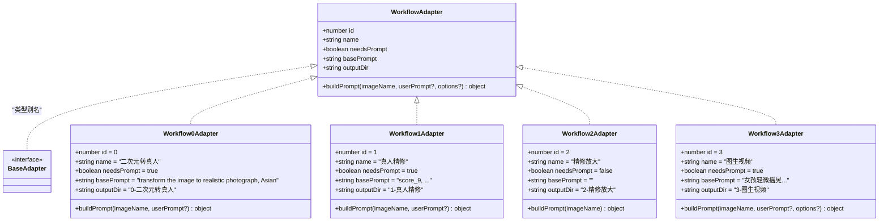
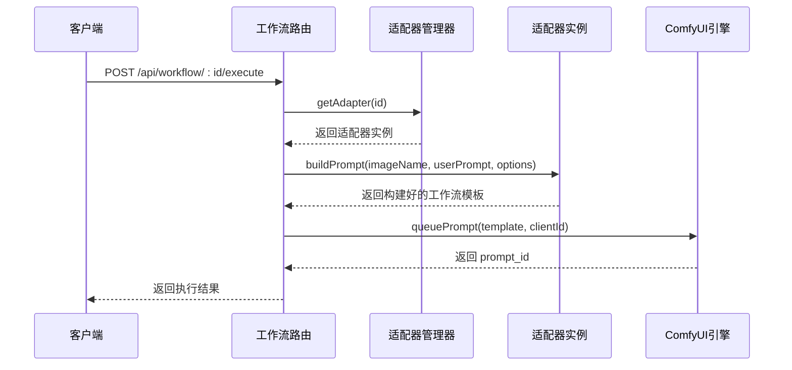
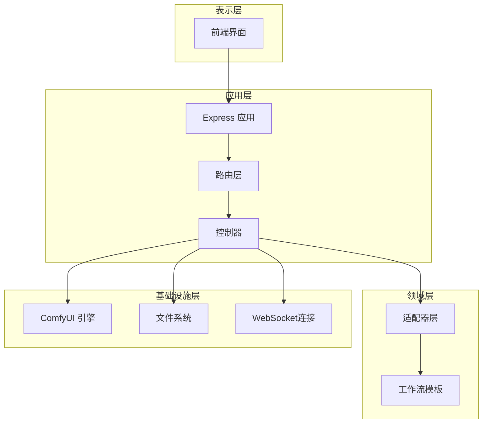
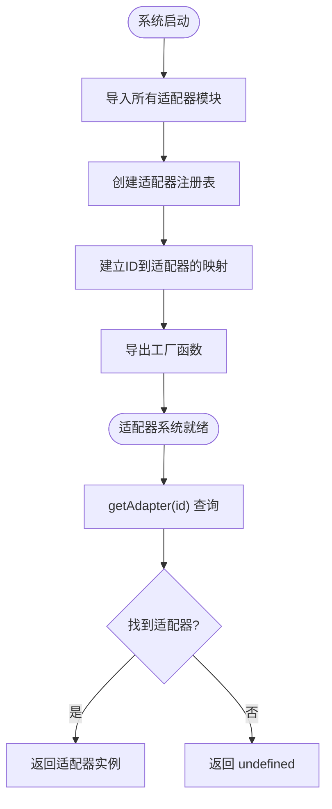
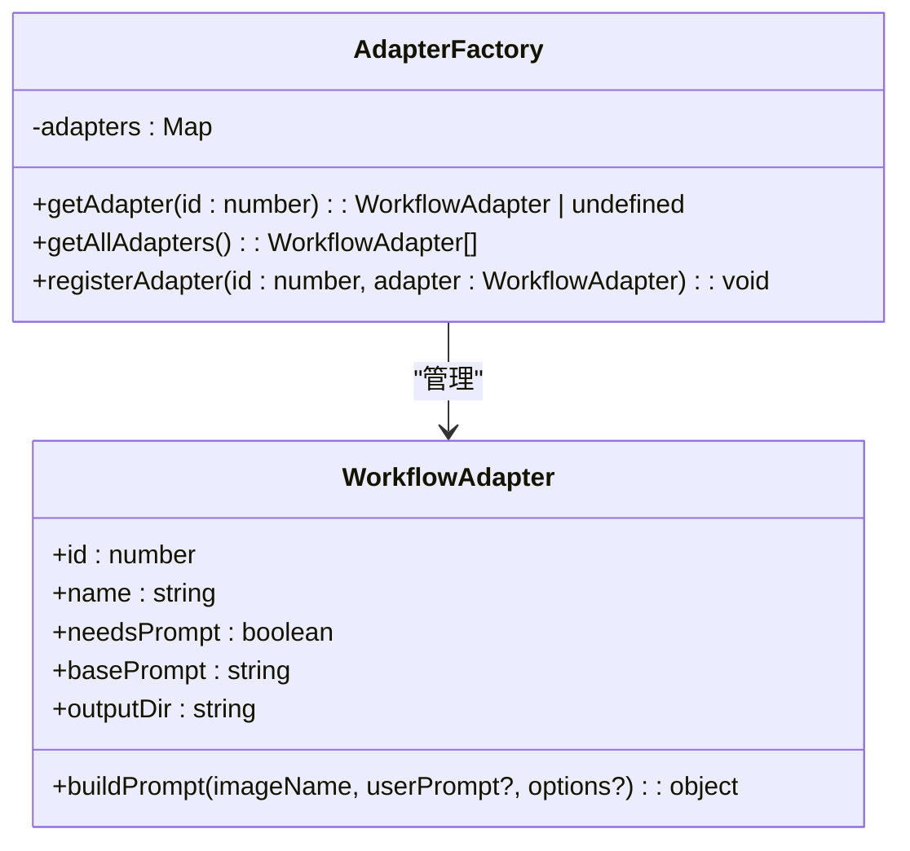
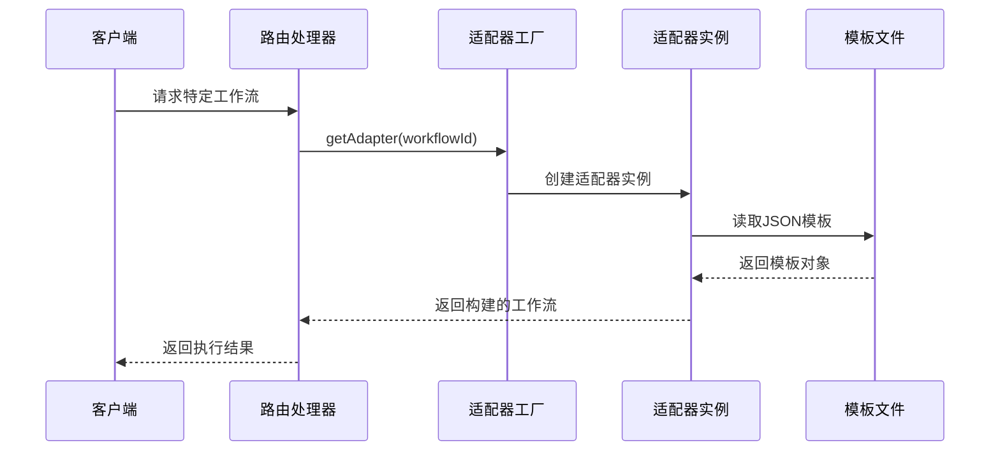
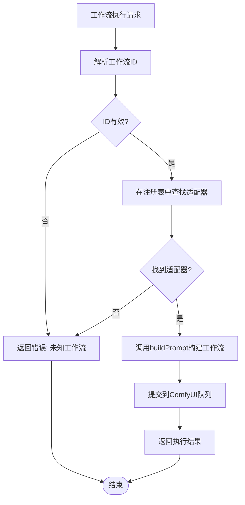
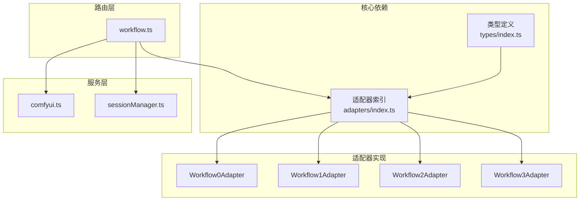
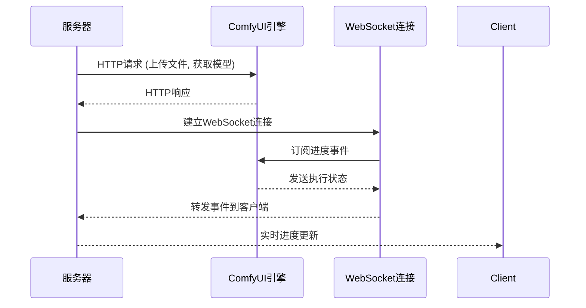

# 适配器注册与管理

<cite>
**本文档引用的文件**
- [server/src/adapters/index.ts](file://server/src/adapters/index.ts)
- [server/src/adapters/BaseAdapter.ts](file://server/src/adapters/BaseAdapter.ts)
- [server/src/adapters/Workflow0Adapter.ts](file://server/src/adapters/Workflow0Adapter.ts)
- [server/src/adapters/Workflow1Adapter.ts](file://server/src/adapters/Workflow1Adapter.ts)
- [server/src/adapters/Workflow2Adapter.ts](file://server/src/adapters/Workflow2Adapter.ts)
- [server/src/adapters/Workflow3Adapter.ts](file://server/src/adapters/Workflow3Adapter.ts)
- [server/src/types/index.ts](file://server/src/types/index.ts)
- [server/src/routes/workflow.ts](file://server/src/routes/workflow.ts)
- [server/src/services/comfyui.ts](file://server/src/services/comfyui.ts)
- [server/src/index.ts](file://server/src/index.ts)
- [server/src/services/sessionManager.ts](file://server/src/services/sessionManager.ts)
- [README.md](file://README.md)
</cite>

## 目录
1. [简介](#简介)
2. [项目结构](#项目结构)
3. [核心组件](#核心组件)
4. [架构概览](#架构概览)
5. [详细组件分析](#详细组件分析)
6. [依赖关系分析](#依赖关系分析)
7. [性能考虑](#性能考虑)
8. [故障排除指南](#故障排除指南)
9. [结论](#结论)
10. [附录](#附录)

## 简介

CorineKit Pix2Real 是一个基于 ComfyUI 的本地 Web 图像/视频处理工具，提供了 5 种内置工作流（二次元转真人、真人精修、精修放大、图生视频、视频放大）。本文档深入解析其适配器注册与管理系统，包括：

- 适配器注册机制与工厂模式实现
- 动态加载策略与索引映射
- 名称解析与实例化过程
- 适配器生命周期管理与内存优化
- 性能考量与扩展指南
- 故障排除与调试技巧

## 项目结构

该项目采用前后端分离架构，服务端使用 Express + TypeScript，前端使用 Vite + React + TypeScript。适配器系统位于 server/src/adapters 目录，路由层负责工作流执行与模板加载。



**图表来源**
- [server/src/index.ts:1-516](file://server/src/index.ts#L1-L516)
- [server/src/routes/workflow.ts:1-800](file://server/src/routes/workflow.ts#L1-L800)
- [server/src/adapters/index.ts:1-33](file://server/src/adapters/index.ts#L1-L33)

**章节来源**
- [README.md:41-79](file://README.md#L41-L79)
- [server/src/index.ts:1-516](file://server/src/index.ts#L1-L516)

## 核心组件

### 适配器接口定义

适配器系统基于统一的 WorkflowAdapter 接口，定义了工作流的基本属性和构建方法：



**图表来源**
- [server/src/types/index.ts:1-8](file://server/src/types/index.ts#L1-L8)
- [server/src/adapters/BaseAdapter.ts:1-4](file://server/src/adapters/BaseAdapter.ts#L1-L4)
- [server/src/adapters/Workflow0Adapter.ts:1-35](file://server/src/adapters/Workflow0Adapter.ts#L1-L35)
- [server/src/adapters/Workflow1Adapter.ts:1-36](file://server/src/adapters/Workflow1Adapter.ts#L1-L36)
- [server/src/adapters/Workflow2Adapter.ts:1-28](file://server/src/adapters/Workflow2Adapter.ts#L1-L28)
- [server/src/adapters/Workflow3Adapter.ts:1-41](file://server/src/adapters/Workflow3Adapter.ts#L1-L41)

### 适配器注册与工厂模式

适配器注册系统采用集中式注册与工厂函数相结合的设计：



**图表来源**
- [server/src/routes/workflow.ts:750-799](file://server/src/routes/workflow.ts#L750-L799)
- [server/src/adapters/index.ts:28-30](file://server/src/adapters/index.ts#L28-L30)

**章节来源**
- [server/src/adapters/index.ts:1-33](file://server/src/adapters/index.ts#L1-L33)
- [server/src/routes/workflow.ts:750-799](file://server/src/routes/workflow.ts#L750-L799)

## 架构概览

系统采用分层架构，适配器层负责工作流模板构建，路由层处理业务逻辑，服务层封装外部系统交互。



**图表来源**
- [server/src/index.ts:1-516](file://server/src/index.ts#L1-L516)
- [server/src/routes/workflow.ts:1-800](file://server/src/routes/workflow.ts#L1-L800)
- [server/src/adapters/index.ts:1-33](file://server/src/adapters/index.ts#L1-L33)

## 详细组件分析

### 适配器注册机制

适配器注册采用静态导入和集中映射的方式，实现了简单高效的工厂模式：

#### 注册表设计



**图表来源**
- [server/src/adapters/index.ts:1-33](file://server/src/adapters/index.ts#L1-L33)

#### 适配器索引映射

适配器系统维护了一个基于数字 ID 的索引映射，支持 O(1) 时间复杂度的查找操作：

| ID | 适配器名称 | 需要提示词 | 基础提示词 | 输出目录 |
|---|---|---|---|---|
| 0 | 二次元转真人 | 是 | transform the image... | 0-二次元转真人 |
| 1 | 真人精修 | 是 | score_9, ... | 1-真人精修 |
| 2 | 精修放大 | 否 | 空字符串 | 2-精修放大 |
| 3 | 图生视频 | 是 | 女孩轻微摇晃... | 3-图生视频 |

**章节来源**
- [server/src/adapters/index.ts:14-26](file://server/src/adapters/index.ts#L14-L26)

### 工厂模式实现

工厂模式通过单一入口提供适配器实例，隐藏了具体的实例化细节：

#### 工厂函数设计



**图表来源**
- [server/src/adapters/index.ts:28-30](file://server/src/adapters/index.ts#L28-L30)

### 动态加载策略

系统采用延迟加载策略，仅在需要时才实例化适配器，避免不必要的内存占用：

#### 按需加载流程



**图表来源**
- [server/src/routes/workflow.ts:750-799](file://server/src/routes/workflow.ts#L750-L799)
- [server/src/adapters/Workflow0Adapter.ts:16-33](file://server/src/adapters/Workflow0Adapter.ts#L16-L33)

**章节来源**
- [server/src/routes/workflow.ts:750-799](file://server/src/routes/workflow.ts#L750-L799)

### 名称解析与实例化

适配器的名称解析遵循以下规则：

#### 名称解析流程



**图表来源**
- [server/src/routes/workflow.ts:750-799](file://server/src/routes/workflow.ts#L750-L799)

**章节来源**
- [server/src/routes/workflow.ts:750-799](file://server/src/routes/workflow.ts#L750-L799)

### 实例化过程

每个适配器实例化时都会执行以下步骤：

1. **模板加载**：从 ComfyUI_API 目录读取对应的 JSON 模板文件
2. **参数注入**：根据输入参数修改模板中的特定节点
3. **随机种子**：为需要的节点设置随机种子
4. **返回模板**：返回完整的可执行工作流对象

**章节来源**
- [server/src/adapters/Workflow0Adapter.ts:16-33](file://server/src/adapters/Workflow0Adapter.ts#L16-L33)
- [server/src/adapters/Workflow1Adapter.ts:16-34](file://server/src/adapters/Workflow1Adapter.ts#L16-L34)
- [server/src/adapters/Workflow2Adapter.ts:16-25](file://server/src/adapters/Workflow2Adapter.ts#L16-L25)
- [server/src/adapters/Workflow3Adapter.ts:16-38](file://server/src/adapters/Workflow3Adapter.ts#L16-L38)

## 依赖关系分析

### 组件耦合度分析



**图表来源**
- [server/src/types/index.ts:1-8](file://server/src/types/index.ts#L1-L8)
- [server/src/adapters/index.ts:1-33](file://server/src/adapters/index.ts#L1-L33)
- [server/src/routes/workflow.ts:1-800](file://server/src/routes/workflow.ts#L1-L800)

### 外部依赖集成

系统与 ComfyUI 的集成通过 HTTP 和 WebSocket 协议实现：



**图表来源**
- [server/src/services/comfyui.ts:265-375](file://server/src/services/comfyui.ts#L265-L375)
- [server/src/index.ts:272-464](file://server/src/index.ts#L272-L464)

**章节来源**
- [server/src/services/comfyui.ts:1-472](file://server/src/services/comfyui.ts#L1-L472)
- [server/src/index.ts:148-494](file://server/src/index.ts#L148-L494)

## 性能考虑

### 内存优化策略

1. **懒加载机制**：适配器仅在首次使用时创建，避免启动时的内存占用
2. **模板缓存**：JSON 模板在进程内存中缓存，减少文件 I/O 操作
3. **连接池管理**：WebSocket 连接按需建立和销毁，避免资源泄漏
4. **事件缓冲**：进度事件在内存中缓冲，减少网络传输开销

### 性能监控指标

系统通过以下方式监控性能：

- **节点权重计算**：基于节点类型和输入参数计算执行权重
- **进度百分比**：综合考虑节点内部进度和全局权重
- **系统资源监控**：实时获取 VRAM 和 RAM 使用情况

**章节来源**
- [server/src/services/comfyui.ts:58-144](file://server/src/services/comfyui.ts#L58-L144)
- [server/src/index.ts:188-271](file://server/src/index.ts#L188-L271)

## 故障排除指南

### 常见问题诊断

#### 适配器注册问题

**症状**：返回 "Unknown workflow" 错误
**原因**：工作流 ID 未在注册表中定义
**解决方案**：
1. 检查适配器文件是否存在
2. 验证 ID 值是否正确
3. 确认导出语句是否正确

#### 模板文件缺失

**症状**：适配器实例化失败
**原因**：JSON 模板文件不存在或路径错误
**解决方案**：
1. 检查 ComfyUI_API 目录下对应文件
2. 验证文件路径配置
3. 确认文件权限

#### ComfyUI 连接问题

**症状**：WebSocket 连接失败或超时
**原因**：ComfyUI 服务未运行或端口被占用
**解决方案**：
1. 检查 ComfyUI 是否正常运行
2. 验证端口配置 (8188)
3. 查看防火墙设置

### 调试技巧

#### 日志分析

系统提供了详细的日志输出，包括：
- 适配器注册状态
- 工作流执行进度
- 错误堆栈信息
- WebSocket 连接状态

#### 性能分析

使用以下方法进行性能分析：
1. **内存快照**：定期捕获内存使用情况
2. **CPU 分析**：监控适配器构建过程的 CPU 占用
3. **网络监控**：跟踪与 ComfyUI 的通信频率

**章节来源**
- [server/src/routes/workflow.ts:126-150](file://server/src/routes/workflow.ts#L126-L150)
- [server/src/index.ts:450-463](file://server/src/index.ts#L450-L463)

## 结论

CorineKit Pix2Real 的适配器注册与管理系统展现了良好的软件工程实践：

1. **清晰的架构分离**：适配器层、路由层和服务层职责明确
2. **高效的工厂模式**：O(1) 查找时间和简单的实例化流程
3. **灵活的扩展机制**：新增工作流只需实现适配器接口
4. **完善的错误处理**：提供用户友好的错误信息和降级策略

该系统为类似的工作流管理应用提供了优秀的参考实现，特别是在适配器模式的应用和性能优化方面。

## 附录

### 适配器扩展指南

#### 新工作流适配器添加流程

1. **创建适配器文件**
   ```typescript
   // server/src/adapters/WorkflowXAdapter.ts
   import fs from 'fs';
   import path from 'path';
   import type { WorkflowAdapter } from './BaseAdapter.js';
   
   const templatePath = path.resolve(__dirname, '../../../ComfyUI_API/你的工作流模板.json');
   
   export const workflowXAdapter: WorkflowAdapter = {
     id: X,
     name: '工作流名称',
     needsPrompt: true/false,
     basePrompt: '基础提示词',
     outputDir: '输出目录',
     
     buildPrompt(imageName: string, userPrompt?: string, options?: Record<string, any>): object {
       const template = JSON.parse(fs.readFileSync(templatePath, 'utf-8'));
       // 修改模板节点...
       return template;
     },
   };
   ```

2. **更新适配器索引**
   ```typescript
   // 在 adapters/index.ts 中添加导入和注册
   import { workflowXAdapter } from './WorkflowXAdapter.js';
   
   export const adapters: Record<number, WorkflowAdapter> = {
     // ... 其他适配器
     X: workflowXAdapter,
   };
   ```

3. **添加路由处理**
   ```typescript
   // 在 routes/workflow.ts 中添加路由
   router.post('/X/execute', async (req, res) => {
     try {
       const adapter = getAdapter(X)!;
       // ... 执行逻辑
     } catch (err) {
       // ... 错误处理
     }
   });
   ```

#### 命名规范

- **适配器文件**：`Workflow{id}Adapter.ts`
- **适配器变量**：`workflow{id}Adapter`
- **ID 值**：从现有最大 ID + 1 开始
- **输出目录**：使用中文描述，格式为 `{id}-描述`

#### 测试要求

1. **单元测试**
   - 适配器实例化测试
   - buildPrompt 方法测试
   - 模板节点修改验证

2. **集成测试**
   - 完整工作流执行测试
   - 错误场景测试
   - 性能基准测试

3. **回归测试**
   - 现有工作流功能验证
   - 适配器注册表完整性检查