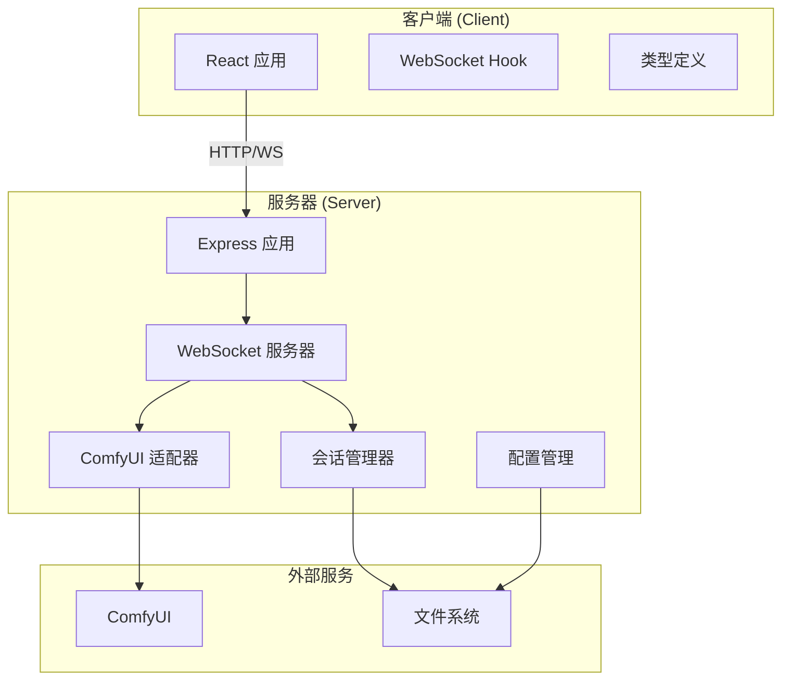
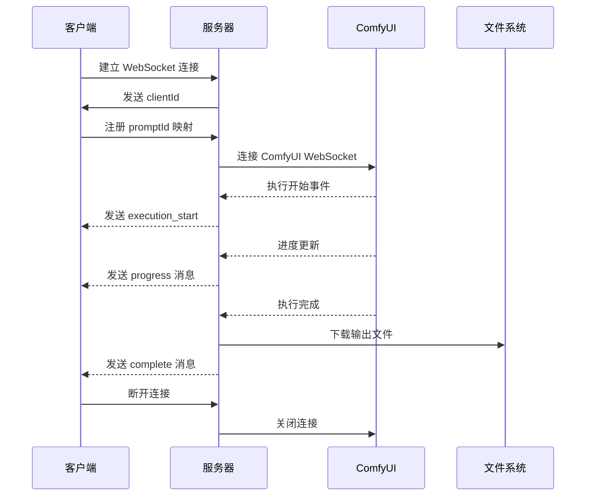
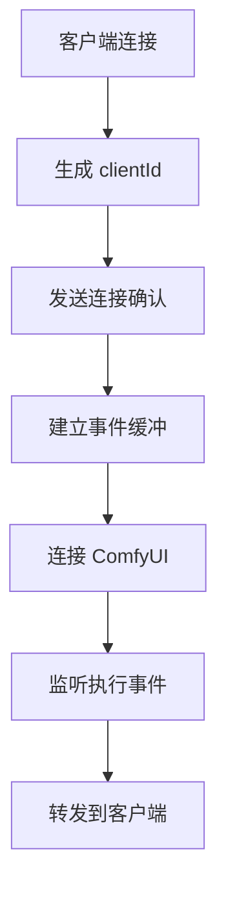
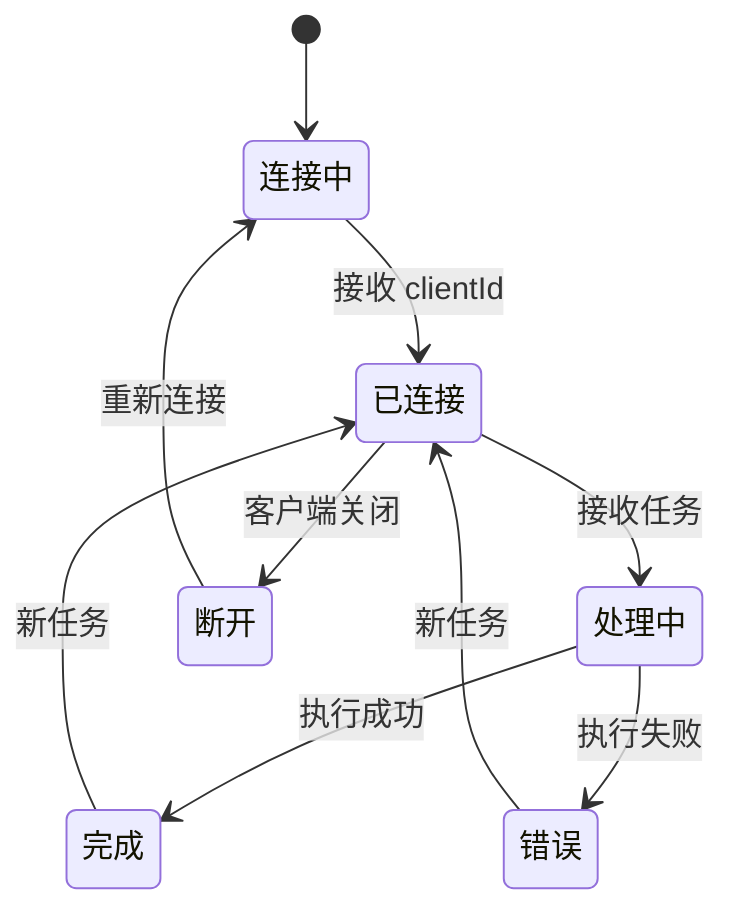
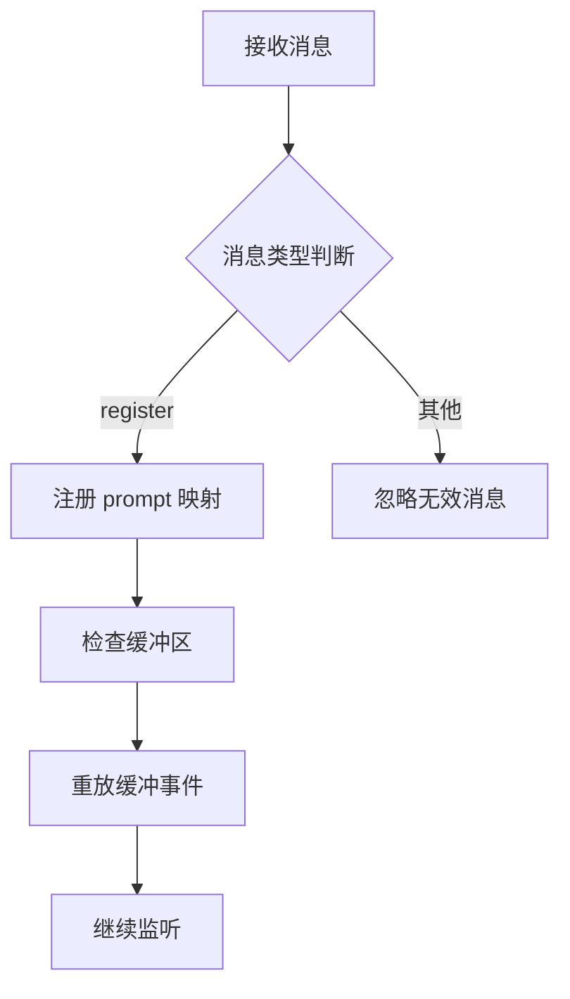
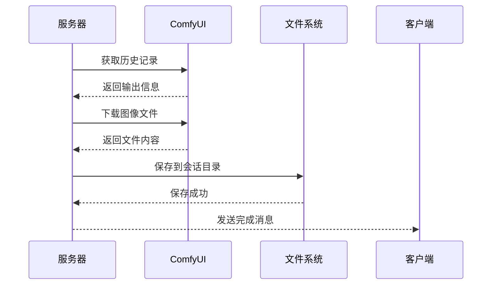
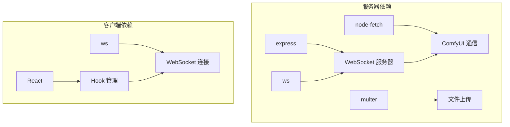
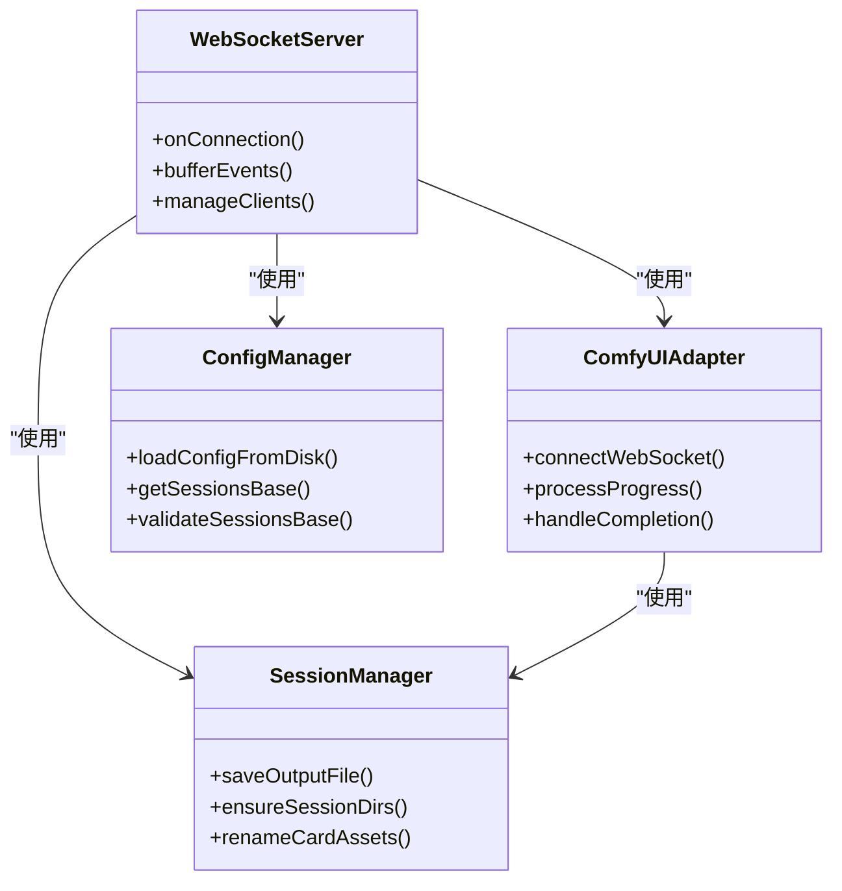
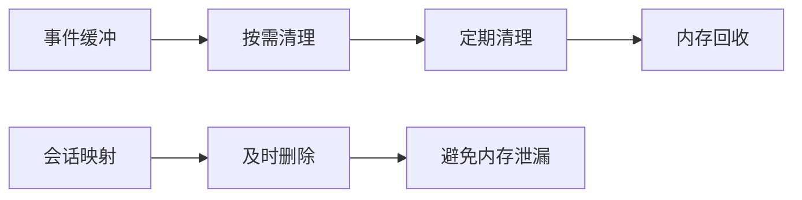

# WebSocket 服务器实现

<cite>
**本文档引用的文件**
- [server/src/index.ts](file://server/src/index.ts)
- [client/src/hooks/useWebSocket.ts](file://client/src/hooks/useWebSocket.ts)
- [client/src/types/index.ts](file://client/src/types/index.ts)
- [server/src/services/comfyui.ts](file://server/src/services/comfyui.ts)
- [server/src/services/sessionManager.ts](file://server/src/services/sessionManager.ts)
- [server/src/config/paths.ts](file://server/src/config/paths.ts)
- [server/src/types/index.ts](file://server/src/types/index.ts)
- [server/src/routes/session.ts](file://server/src/routes/session.ts)
- [server/package.json](file://server/package.json)
</cite>

## 目录
1. [简介](#简介)
2. [项目结构](#项目结构)
3. [核心组件](#核心组件)
4. [架构概览](#架构概览)
5. [详细组件分析](#详细组件分析)
6. [依赖关系分析](#依赖关系分析)
7. [性能考虑](#性能考虑)
8. [故障排除指南](#故障排除指南)
9. [结论](#结论)
10. [附录](#附录)

## 简介

本文档详细介绍了基于 Express 和 ws 库构建的 WebSocket 服务器实现。该系统实现了完整的 WebSocket 连接管理、消息格式定义、连接状态管理和自动重连机制。服务器通过中间层与 ComfyUI 进行通信，提供实时的任务进度跟踪和结果通知功能。

## 项目结构

该项目采用前后端分离的架构设计，主要包含以下关键组件：



**图表来源**
- [server/src/index.ts:157-159](file://server/src/index.ts#L157-L159)
- [client/src/hooks/useWebSocket.ts:29-39](file://client/src/hooks/useWebSocket.ts#L29-L39)

**章节来源**
- [server/src/index.ts:118-145](file://server/src/index.ts#L118-L145)
- [client/src/hooks/useWebSocket.ts:1-278](file://client/src/hooks/useWebSocket.ts#L1-L278)

## 核心组件

### WebSocket 服务器核心功能

服务器实现了以下核心功能：
- **连接管理**：支持多个客户端同时连接，每个连接分配唯一 clientId
- **消息路由**：将 ComfyUI 的进度事件转换为前端友好的消息格式
- **状态同步**：维护任务执行状态，支持断线重连后的状态恢复
- **输出管理**：自动下载并保存生成的图像和视频文件

### 客户端连接管理

客户端实现了智能的连接管理策略：
- **单例模式**：确保同一应用实例只有一个 WebSocket 连接
- **自动重连**：断线后自动尝试重新连接
- **连接计数**：基于 React 组件挂载状态管理连接生命周期
- **消息缓冲**：支持离线期间的消息缓冲和重放

**章节来源**
- [server/src/index.ts:168-494](file://server/src/index.ts#L168-L494)
- [client/src/hooks/useWebSocket.ts:9-278](file://client/src/hooks/useWebSocket.ts#L9-L278)

## 架构概览

系统采用三层架构设计，实现了清晰的职责分离：



**图表来源**
- [server/src/index.ts:168-494](file://server/src/index.ts#L168-L494)
- [server/src/services/comfyui.ts:265-307](file://server/src/services/comfyui.ts#L265-L307)

## 详细组件分析

### WebSocket 连接建立过程

#### 服务器端连接处理

服务器在建立 WebSocket 连接时执行以下步骤：

1. **clientId 生成**：为每个新连接生成唯一标识符
2. **客户端通知**：向客户端发送连接确认消息
3. **事件缓冲**：建立事件缓冲机制，支持断线重连后的状态恢复
4. **ComfyUI 连接**：建立到 ComfyUI 的 WebSocket 连接



**图表来源**
- [server/src/index.ts:168-173](file://server/src/index.ts#L168-L173)
- [server/src/index.ts:178-185](file://server/src/index.ts#L178-L185)

#### 客户端连接处理

客户端连接流程包括：

1. **URL 构建**：根据当前协议自动选择 ws 或 wss
2. **连接建立**：创建 WebSocket 实例
3. **消息处理**：解析并处理服务器发送的消息
4. **状态管理**：维护连接状态和自动重连逻辑

**章节来源**
- [server/src/index.ts:160-163](file://server/src/index.ts#L160-L163)
- [client/src/hooks/useWebSocket.ts:29-52](file://client/src/hooks/useWebSocket.ts#L29-L52)

### 消息格式定义

系统定义了标准化的消息格式，支持多种事件类型的传输：

#### 连接确认消息
```typescript
interface WSConnectedMessage {
  type: 'connected';
  clientId: string;
}
```

#### 执行开始消息
```typescript
interface WSExecutionStartMessage {
  type: 'execution_start';
  promptId: string;
}
```

#### 进度更新消息
```typescript
interface WSProgressMessage {
  type: 'progress';
  promptId: string;
  value: number;
  max: number;
  percentage: number;
  stage?: string;
  stepIndex?: number;
  stepTotal?: number;
}
```

#### 执行完成消息
```typescript
interface WSCompleteMessage {
  type: 'complete';
  promptId: string;
  outputs: Array<{ filename: string; url: string }>;
}
```

#### 错误消息
```typescript
interface WSErrorMessage {
  type: 'error';
  promptId: string;
  message: string;
}
```

**章节来源**
- [client/src/types/index.ts:39-75](file://client/src/types/index.ts#L39-L75)

### 连接状态管理

#### 连接生命周期

服务器实现了完整的连接生命周期管理：



#### 自动重连机制

客户端实现了智能的自动重连策略：

1. **连接计数**：跟踪活跃订阅者数量
2. **延迟重连**：断线后延迟 2 秒重连
3. **条件重连**：只有在有活跃订阅时才重连
4. **资源清理**：重连前清理定时器和连接状态

**章节来源**
- [client/src/hooks/useWebSocket.ts:232-244](file://client/src/hooks/useWebSocket.ts#L232-L244)
- [client/src/hooks/useWebSocket.ts:259-267](file://client/src/hooks/useWebSocket.ts#L259-L267)

### 消息处理流程

#### 服务器端消息处理

服务器端实现了复杂的消息处理逻辑：



**图表来源**
- [server/src/index.ts:467-488](file://server/src/index.ts#L467-L488)

#### 客户端消息处理

客户端实现了多级消息处理：

1. **基础消息处理**：处理进度、完成、错误等标准消息
2. **代理执行处理**：处理智能代理相关的特殊消息
3. **桌面通知**：根据设置发送系统通知
4. **状态更新**：更新应用状态和 UI

**章节来源**
- [client/src/hooks/useWebSocket.ts:45-230](file://client/src/hooks/useWebSocket.ts#L45-L230)

### 输出管理机制

#### 文件下载和存储

服务器实现了完整的输出文件管理：



**图表来源**
- [server/src/index.ts:373-429](file://server/src/index.ts#L373-L429)

**章节来源**
- [server/src/index.ts:373-447](file://server/src/index.ts#L373-L447)

## 依赖关系分析

### 核心依赖关系



**图表来源**
- [server/package.json:11-17](file://server/package.json#L11-L17)

### 服务间交互

服务器内部各服务之间的交互关系：



**图表来源**
- [server/src/index.ts:15-18](file://server/src/index.ts#L15-L18)
- [server/src/services/sessionManager.ts:37-48](file://server/src/services/sessionManager.ts#L37-L48)

**章节来源**
- [server/src/index.ts:15-18](file://server/src/index.ts#L15-L18)
- [server/src/services/sessionManager.ts:1-539](file://server/src/services/sessionManager.ts#L1-L539)

## 性能考虑

### 连接池管理

服务器实现了高效的连接池管理策略：
- **事件缓冲**：避免频繁的网络往返
- **状态复用**：重用连接状态减少内存占用
- **异步处理**：使用 Promise 和 async/await 处理异步操作

### 内存优化



**图表来源**
- [server/src/index.ts:431-435](file://server/src/index.ts#L431-L435)

### 并发控制

系统通过以下方式控制并发连接：
- **单例连接**：客户端层面的连接管理
- **事件队列**：服务器端的事件处理队列
- **资源限制**：文件系统和网络资源的合理使用

## 故障排除指南

### 常见连接问题

#### WebSocket 连接失败

**症状**：客户端无法连接到服务器
**可能原因**：
1. 服务器未启动或端口被占用
2. CORS 配置不正确
3. SSL 证书问题（HTTPS 环境）

**解决方案**：
1. 检查服务器日志输出
2. 验证端口配置（默认 3000）
3. 确认防火墙设置

#### 自动重连失败

**症状**：连接断开后无法自动重连
**可能原因**：
1. 连接计数器异常
2. 定时器未正确清理
3. 网络环境不稳定

**解决方案**：
1. 检查浏览器控制台错误
2. 验证网络连接稳定性
3. 查看重连日志

#### 消息丢失

**症状**：客户端接收不到某些进度消息
**可能原因**：
1. 事件缓冲区溢出
2. 客户端注册时机不当
3. 网络延迟过高

**解决方案**：
1. 检查事件缓冲配置
2. 确保客户端及时注册
3. 优化网络环境

**章节来源**
- [client/src/hooks/useWebSocket.ts:232-244](file://client/src/hooks/useWebSocket.ts#L232-L244)
- [server/src/index.ts:338-347](file://server/src/index.ts#L338-L347)

### 调试工具和监控方法

#### 服务器端调试

1. **日志监控**：关注连接建立、断开和错误日志
2. **状态检查**：验证 clientId 分配和事件缓冲状态
3. **ComfyUI 连接**：监控与 ComfyUI 的通信状态

#### 客户端调试

1. **浏览器开发者工具**：监控 WebSocket 通信
2. **状态检查**：验证消息处理和 UI 更新
3. **网络监控**：检查消息传输延迟

## 结论

该 WebSocket 服务器实现提供了完整的实时通信解决方案，具有以下特点：

1. **可靠性**：实现了完善的连接管理和自动重连机制
2. **可扩展性**：模块化设计支持功能扩展
3. **易用性**：标准化的消息格式简化了客户端集成
4. **性能**：优化的事件处理和资源管理确保系统稳定运行

系统通过中间层与 ComfyUI 集成，提供了强大的 AI 图像生成任务管理能力，适合在生产环境中部署使用。

## 附录

### 配置选项

#### 服务器配置
- **端口设置**：默认 3000，可通过环境变量配置
- **CORS 设置**：支持本地开发环境的跨域访问
- **文件大小限制**：JSON 请求体限制为 50MB

#### 客户端配置
- **自动重连间隔**：2 秒延迟
- **连接计数管理**：基于 React 组件生命周期
- **消息缓冲**：支持断线期间的状态恢复

### API 使用示例

#### 基本连接示例
```typescript
// 客户端连接
const ws = new WebSocket('ws://localhost:3000/ws');

// 监听连接事件
ws.onopen = () => {
  console.log('连接已建立');
};

// 处理消息
ws.onmessage = (event) => {
  const message = JSON.parse(event.data);
  handleWebSocketMessage(message);
};
```

#### 任务注册示例
```typescript
// 注册任务映射
const registerMessage = {
  type: 'register',
  promptId: 'your_prompt_id',
  workflowId: 1,
  sessionId: 'session_123'
};

ws.send(JSON.stringify(registerMessage));
```

**章节来源**
- [server/src/index.ts:496-516](file://server/src/index.ts#L496-L516)
- [client/src/hooks/useWebSocket.ts:270-274](file://client/src/hooks/useWebSocket.ts#L270-L274)