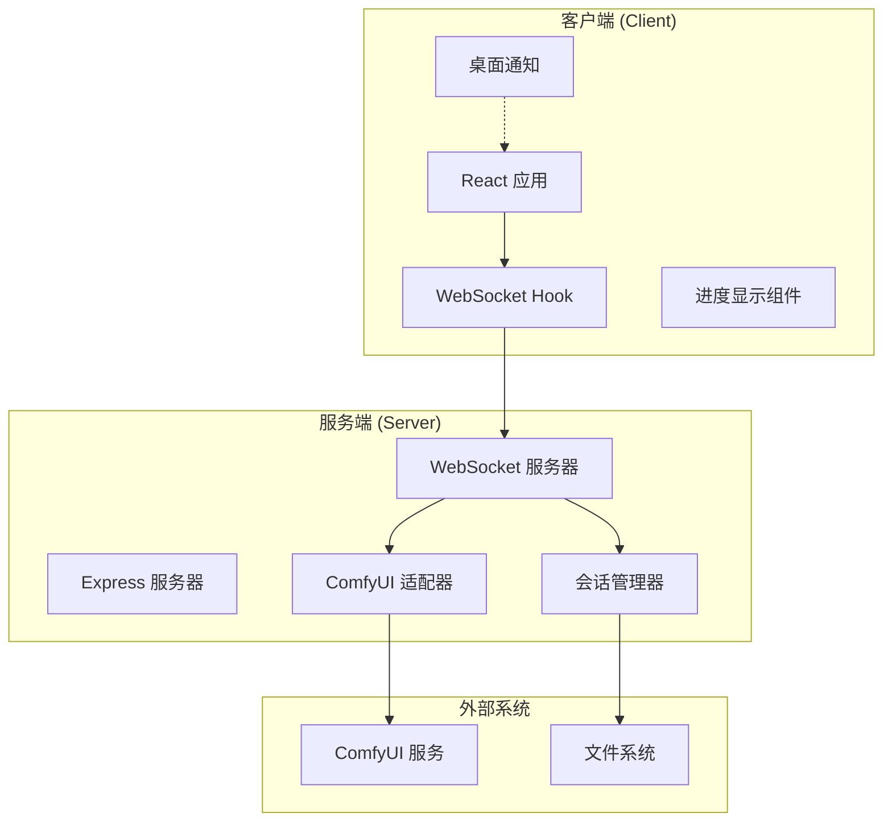
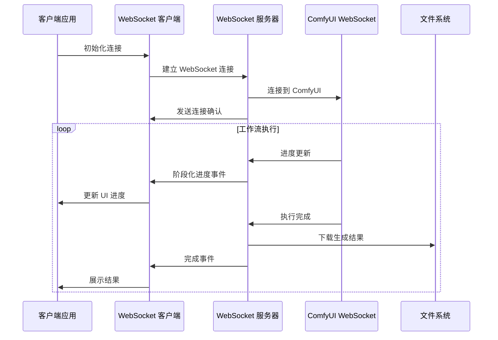
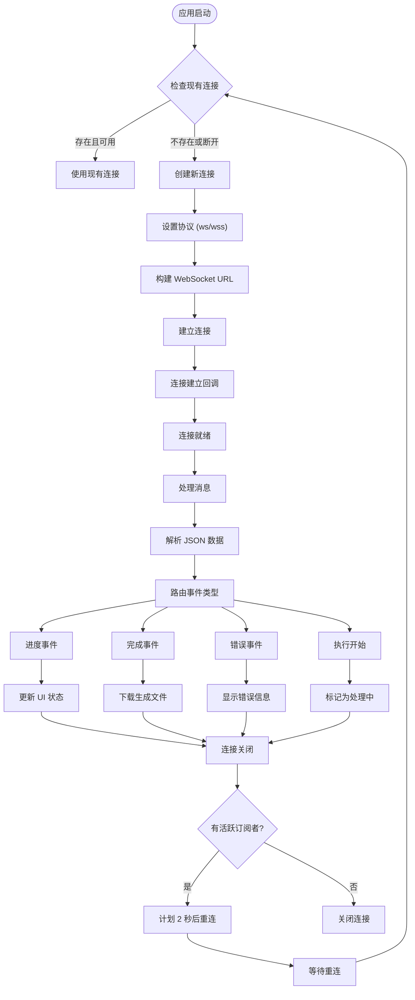
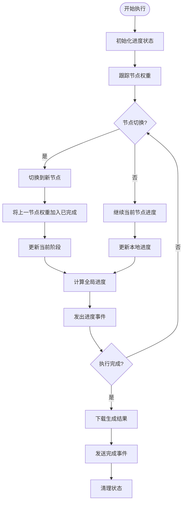
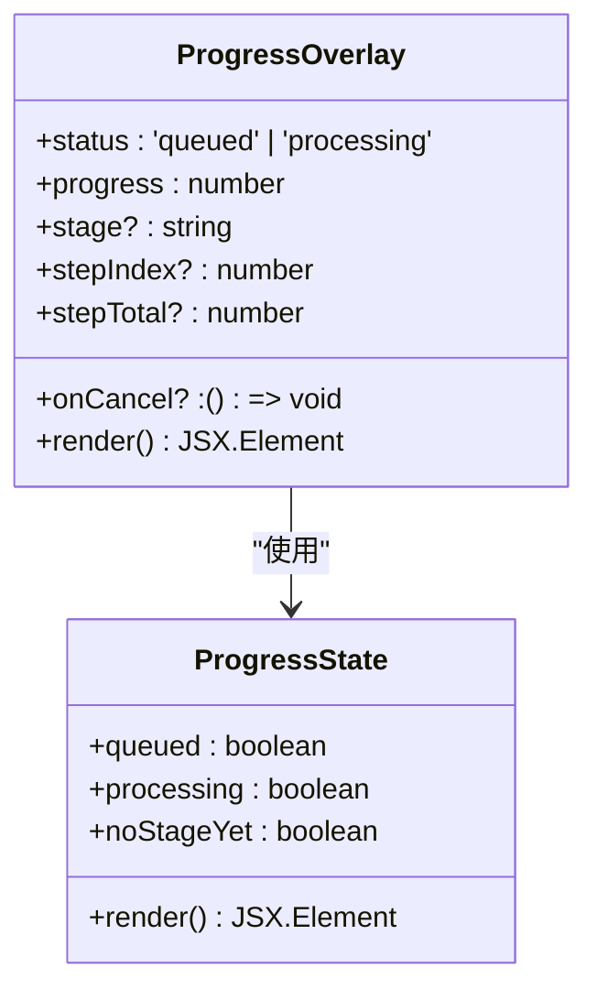
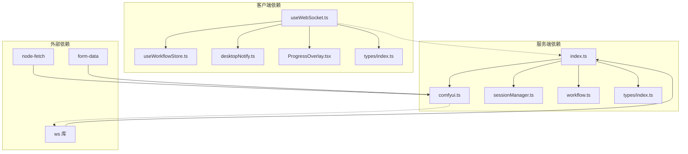
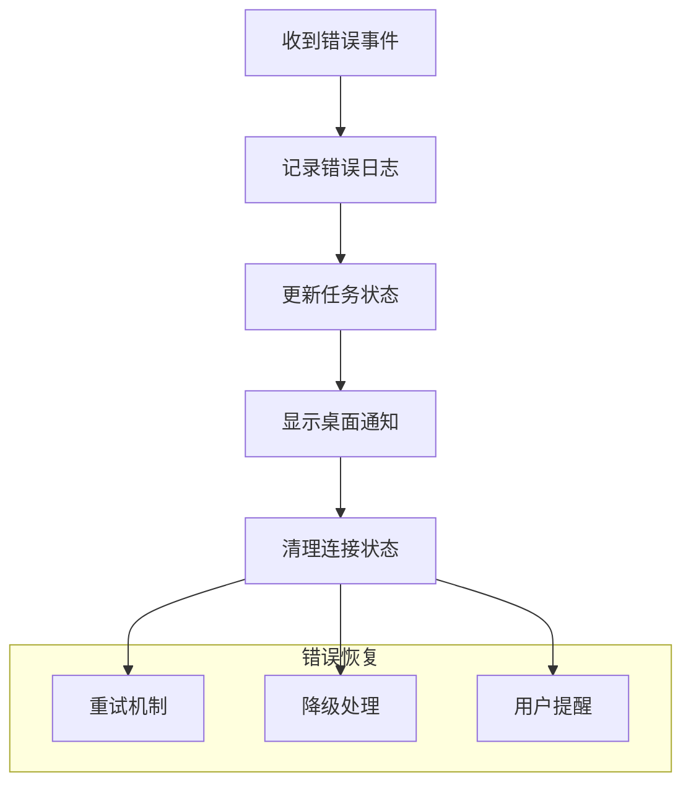

# 实时通信系统

<cite>
**本文档引用的文件**
- [client/src/hooks/useWebSocket.ts](file://client/src/hooks/useWebSocket.ts)
- [server/src/index.ts](file://server/src/index.ts)
- [server/src/services/comfyui.ts](file://server/src/services/comfyui.ts)
- [client/src/components/ProgressOverlay.tsx](file://client/src/components/ProgressOverlay.tsx)
- [client/src/types/index.ts](file://client/src/types/index.ts)
- [server/src/types/index.ts](file://server/src/types/index.ts)
- [server/src/routes/workflow.ts](file://server/src/routes/workflow.ts)
- [client/src/services/desktopNotify.ts](file://client/src/services/desktopNotify.ts)
- [server/src/services/sessionManager.ts](file://server/src/services/sessionManager.ts)
</cite>

## 目录
1. [简介](#简介)
2. [项目结构](#项目结构)
3. [核心组件](#核心组件)
4. [架构概览](#架构概览)
5. [详细组件分析](#详细组件分析)
6. [依赖关系分析](#依赖关系分析)
7. [性能考虑](#性能考虑)
8. [故障排除指南](#故障排除指南)
9. [结论](#结论)
10. [附录](#附录)

## 简介

这是一个基于 WebSocket 的实时通信系统，专门用于处理 ComfyUI 图像生成工作流的进度监控和结果反馈。系统采用前后端分离架构，前端使用 React + TypeScript，后端使用 Node.js + TypeScript，通过 WebSocket 实现实时双向通信。

该系统的核心功能包括：
- WebSocket 连接管理与自动重连
- ComfyUI 工作流进度的阶段化追踪
- 进度事件的权重化计算与前端展示
- 错误处理与状态恢复机制
- 生成结果的自动下载与存储
- 桌面通知集成

## 项目结构

项目采用典型的前后端分离架构，主要分为三个部分：



**图表来源**
- [client/src/hooks/useWebSocket.ts:1-278](file://client/src/hooks/useWebSocket.ts#L1-L278)
- [server/src/index.ts:157-494](file://server/src/index.ts#L157-L494)

**章节来源**
- [client/src/hooks/useWebSocket.ts:1-278](file://client/src/hooks/useWebSocket.ts#L1-L278)
- [server/src/index.ts:157-494](file://server/src/index.ts#L157-L494)

## 核心组件

### WebSocket 客户端管理

客户端实现了单例模式的 WebSocket 管理，确保在整个应用中只有一个活跃的连接实例。

**关键特性：**
- 连接状态管理与自动重连
- 全局连接计数控制
- 消息路由与事件分发
- 桌面通知集成

### WebSocket 服务端

服务端使用 ws 库创建 WebSocket 服务器，负责：
- 客户端连接管理
- ComfyUI 进度事件的阶段化处理
- 生成结果的自动下载与存储
- 事件缓冲与重放机制

### 进度追踪系统

系统实现了复杂的进度追踪机制：
- 基于节点权重的全局进度计算
- 阶段化进度显示
- 多轮执行场景支持
- 节点缓存跳过处理

**章节来源**
- [client/src/hooks/useWebSocket.ts:9-278](file://client/src/hooks/useWebSocket.ts#L9-L278)
- [server/src/index.ts:157-494](file://server/src/index.ts#L157-L494)
- [server/src/services/comfyui.ts:47-166](file://server/src/services/comfyui.ts#L47-L166)

## 架构概览

系统采用三层架构设计，实现了清晰的职责分离：



**图表来源**
- [server/src/index.ts:273-464](file://server/src/index.ts#L273-L464)
- [server/src/services/comfyui.ts:304-375](file://server/src/services/comfyui.ts#L304-L375)

## 详细组件分析

### WebSocket 客户端实现

#### 连接管理机制

客户端实现了智能的连接管理策略：



**图表来源**
- [client/src/hooks/useWebSocket.ts:29-252](file://client/src/hooks/useWebSocket.ts#L29-L252)

#### 事件处理流程

客户端对不同类型的 WebSocket 事件进行分类处理：

**进度事件处理：**
- 解析进度数据
- 更新任务状态
- 计算阶段化进度
- 更新 UI 组件

**完成事件处理：**
- 下载生成的文件
- 更新任务状态为完成
- 触发桌面通知
- 清理临时数据

**错误事件处理：**
- 记录错误信息
- 更新任务状态为错误
- 触发错误通知
- 清理连接状态

**章节来源**
- [client/src/hooks/useWebSocket.ts:45-229](file://client/src/hooks/useWebSocket.ts#L45-L229)

### WebSocket 服务端实现

#### 进度追踪算法

服务端实现了复杂的进度追踪算法，基于节点权重计算全局进度：



**图表来源**
- [server/src/index.ts:187-448](file://server/src/index.ts#L187-L448)

#### 阶段化进度映射

服务端维护了节点类型到中文阶段名称的映射表：

| 节点类型 | 中文阶段名称 |
|---------|-------------|
| CheckpointLoaderSimple | 加载主模型 |
| VAELoader | 加载 VAE |
| CLIPTextEncode | 编码提示词 |
| VAEEncode | VAE 编码 |
| VAEEDecode | VAE 解码 |
| KSampler | 采样中 |
| ImageUpscaleWithModel | 放大图像 |
| VHS_VideoCombine | 合成视频 |

**章节来源**
- [server/src/index.ts:20-77](file://server/src/index.ts#L20-L77)
- [server/src/index.ts:187-271](file://server/src/index.ts#L187-L271)

### 进度事件格式定义

系统定义了标准的 WebSocket 消息格式：

#### 连接确认消息
```typescript
interface WSConnectedMessage {
  type: 'connected';
  clientId: string;
}
```

#### 进度更新消息
```typescript
interface WSProgressMessage {
  type: 'progress';
  promptId: string;
  value: number;
  max: number;
  percentage: number;
  stage?: string;
  stepIndex?: number;
  stepTotal?: number;
}
```

#### 完成通知消息
```typescript
interface WSCompleteMessage {
  type: 'complete';
  promptId: string;
  outputs: Array<{ filename: string; url: string }>;
}
```

#### 错误通知消息
```typescript
interface WSErrorMessage {
  type: 'error';
  promptId: string;
  message: string;
}
```

#### 执行开始消息
```typescript
interface WSExecutionStartMessage {
  type: 'execution_start';
  promptId: string;
}
```

**章节来源**
- [client/src/types/index.ts:39-75](file://client/src/types/index.ts#L39-L75)
- [server/src/types/index.ts:10-30](file://server/src/types/index.ts#L10-L30)

### 前端进度展示组件

进度覆盖层组件提供了直观的进度可视化：



**图表来源**
- [client/src/components/ProgressOverlay.tsx:12-126](file://client/src/components/ProgressOverlay.tsx#L12-L126)

**章节来源**
- [client/src/components/ProgressOverlay.tsx:12-126](file://client/src/components/ProgressOverlay.tsx#L12-L126)

## 依赖关系分析

系统的关键依赖关系如下：



**图表来源**
- [client/src/hooks/useWebSocket.ts:1-8](file://client/src/hooks/useWebSocket.ts#L1-L8)
- [server/src/index.ts:15-18](file://server/src/index.ts#L15-L18)

**章节来源**
- [client/src/hooks/useWebSocket.ts:1-8](file://client/src/hooks/useWebSocket.ts#L1-L8)
- [server/src/index.ts:15-18](file://server/src/index.ts#L15-L18)

## 性能考虑

### 连接池管理

系统实现了智能的连接池管理策略：
- 单例连接模式避免重复连接
- 连接计数控制确保资源合理使用
- 自动重连机制处理网络波动
- 连接状态检查避免无效操作

### 消息压缩与传输优化

虽然当前实现未启用消息压缩，但系统具备以下优化特性：
- 事件缓冲机制减少消息频率
- 阶段化进度计算避免频繁 UI 更新
- 历史数据重试机制确保数据完整性
- 资源清理策略防止内存泄漏

### 并发处理

系统支持多工作流并发执行：
- 独立的进度状态管理
- 节点权重计算支持复杂工作流
- 事件路由确保消息正确分发
- 资源隔离避免相互影响

## 故障排除指南

### 常见连接问题

**问题：WebSocket 连接失败**
- 检查服务端是否正常运行
- 验证防火墙设置
- 确认客户端网络连接
- 查看浏览器开发者工具中的网络面板

**问题：连接频繁断开**
- 检查服务器负载情况
- 验证客户端重连逻辑
- 监控网络稳定性
- 检查代理服务器配置

### 进度追踪问题

**问题：进度显示异常**
- 验证节点权重配置
- 检查阶段名称映射
- 确认进度计算逻辑
- 查看服务端日志

**问题：进度不准确**
- 检查 ComfyUI 版本兼容性
- 验证节点类型识别
- 确认权重系数设置
- 监控执行时间统计

### 错误处理机制

系统实现了多层次的错误处理：



**章节来源**
- [client/src/hooks/useWebSocket.ts:150-158](file://client/src/hooks/useWebSocket.ts#L150-L158)
- [server/src/index.ts:450-463](file://server/src/index.ts#L450-L463)

## 结论

该实时通信系统成功实现了复杂的 WebSocket 通信架构，具有以下特点：

**技术优势：**
- 完整的连接管理与自动重连机制
- 精确的进度追踪与阶段化显示
- 稳健的错误处理与状态恢复
- 高效的资源管理和性能优化

**应用场景：**
- 图像生成工作流监控
- 实时进度反馈
- 多用户并发处理
- 桌面通知集成

**改进建议：**
- 实现消息压缩以提高传输效率
- 添加连接池大小限制
- 增强监控指标收集
- 优化内存使用策略

## 附录

### WebSocket API 使用示例

#### 客户端使用示例

```typescript
// 基本连接
const { sendMessage } = useWebSocket();

// 发送消息
sendMessage({
  type: 'register',
  promptId: 'workflow-123',
  workflowId: 7,
  sessionId: 'session-456'
});

// 监听进度
useEffect(() => {
  const handleMessage = (event: MessageEvent) => {
    const message = JSON.parse(event.data);
    if (message.type === 'progress') {
      updateProgress(message.promptId, message.percentage);
    }
  };
  
  ws.addEventListener('message', handleMessage);
  return () => ws.removeEventListener('message', handleMessage);
}, []);
```

#### 服务端使用示例

```typescript
// 连接到 ComfyUI
const comfyWs = connectWebSocket(clientId, {
  onProgress: (promptId, progress) => {
    // 处理进度事件
    emitProgress(promptId, progress);
  },
  onComplete: (promptId) => {
    // 处理完成事件
    downloadOutputs(promptId);
  }
});

// 发送注册消息
clientWs.send(JSON.stringify({
  type: 'register',
  promptId: 'workflow-123',
  workflowId: 7,
  sessionId: 'session-456'
}));
```

### 调试工具和监控方法

**客户端调试：**
- 浏览器开发者工具的 Network 面板
- Console 日志输出
- WebSocket 握手检查
- 进度事件监听

**服务端监控：**
- 进程监控脚本
- 日志级别调整
- 性能指标收集
- 错误统计分析

**章节来源**
- [client/src/hooks/useWebSocket.ts:254-277](file://client/src/hooks/useWebSocket.ts#L254-L277)
- [server/src/index.ts:498-516](file://server/src/index.ts#L498-L516)