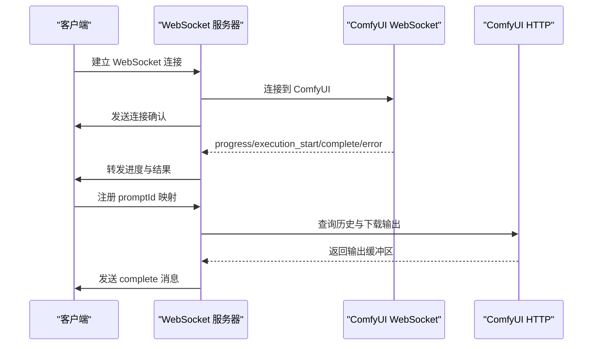
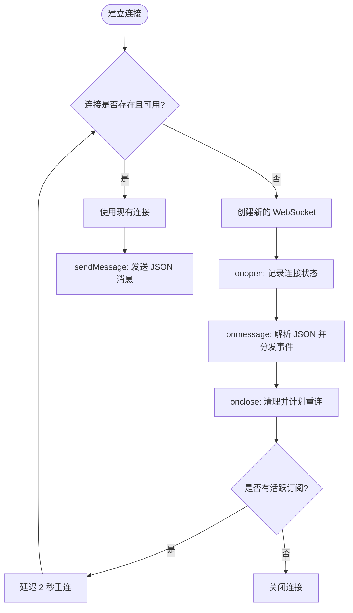
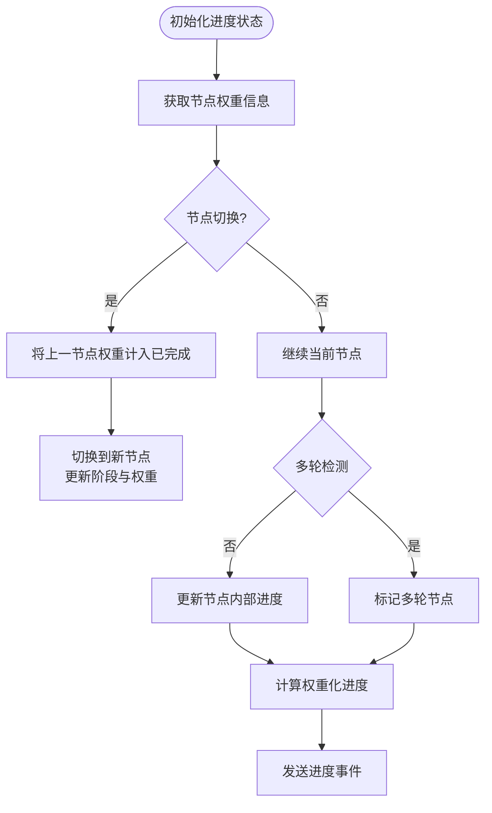
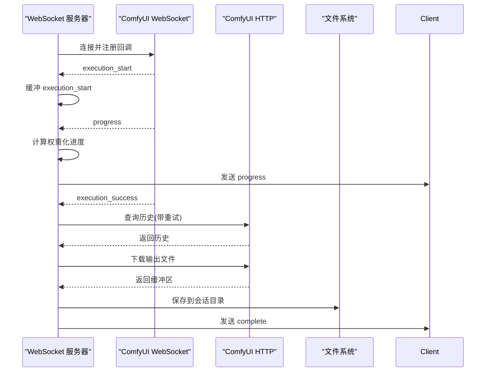
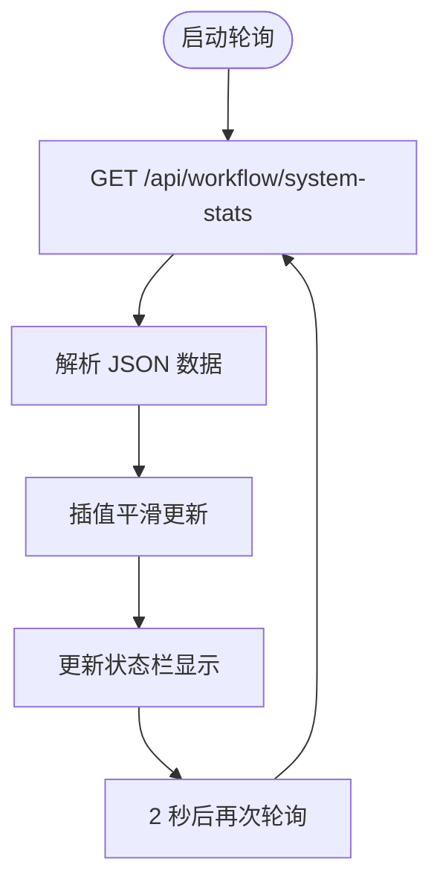
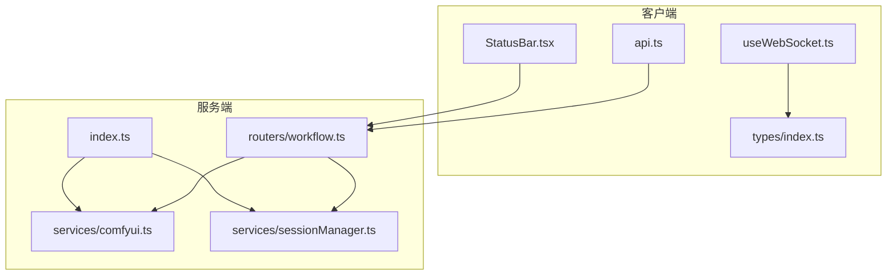

# 性能优化策略

<cite>
**本文档引用的文件**
- [client/src/hooks/useWebSocket.ts](file://client/src/hooks/useWebSocket.ts)
- [server/src/index.ts](file://server/src/index.ts)
- [server/src/services/comfyui.ts](file://server/src/services/comfyui.ts)
- [server/src/routers/workflow.ts](file://server/src/routers/workflow.ts)
- [client/src/types/index.ts](file://client/src/types/index.ts)
- [server/src/types/index.ts](file://server/src/types/index.ts)
- [client/src/components/StatusBar.tsx](file://client/src/components/StatusBar.tsx)
- [server/src/services/sessionManager.ts](file://server/src/services/sessionManager.ts)
- [client/src/services/api.ts](file://client/src/services/api.ts)
</cite>

## 目录
1. [简介](#简介)
2. [项目结构](#项目结构)
3. [核心组件](#核心组件)
4. [架构概览](#架构概览)
5. [详细组件分析](#详细组件分析)
6. [依赖关系分析](#依赖关系分析)
7. [性能考虑](#性能考虑)
8. [故障排除指南](#故障排除指南)
9. [结论](#结论)
10. [附录](#附录)

## 简介
本文件针对实时通信系统的性能优化策略进行深入技术分析，重点覆盖以下方面：
- 消息压缩与传输优化：二进制消息传输、JSON 压缩与序列化优化
- 连接池管理：连接复用、连接数限制与健康检查机制
- 资源清理策略：内存泄漏防护、定时器清理与事件监听器注销
- 性能监控指标：连接延迟测量、消息吞吐量统计与资源使用监控
- 性能调优建议：网络配置优化、服务器参数调整与客户端连接策略
- 性能测试方法与基准测试工具：帮助开发者评估与改进系统性能

## 项目结构
该项目采用前后端分离架构，前端使用 React + TypeScript，后端使用 Node.js + Express + WebSocket，通过 WebSocket 实时传输生成进度与结果，并与 ComfyUI 服务交互。

```mermaid
graph TB
subgraph "前端客户端"
UI[React 组件]
WS_Hook[WebSocket Hook]
Store[状态管理(Zustand)]
StatusBar[状态栏组件]
end
subgraph "后端服务"
Express[Express 应用]
WSServer[WebSocket 服务器]
Router[路由层]
ComfyService[ComfyUI 服务]
SessionMgr[会话管理]
end
subgraph "外部服务"
ComfyUI[ComfyUI 服务]
end
UI --> WS_Hook
UI --> Store
StatusBar --> Router
WS_Hook --> WSServer
WSServer --> ComfyService
Router --> ComfyService
Router --> SessionMgr
ComfyService --> ComfyUI
```

**图表来源**
- [server/src/index.ts:158-494](file://server/src/index.ts#L158-L494)
- [client/src/hooks/useWebSocket.ts:29-277](file://client/src/hooks/useWebSocket.ts#L29-L277)
- [server/src/services/comfyui.ts:265-375](file://server/src/services/comfyui.ts#L265-L375)

**章节来源**
- [server/src/index.ts:118-146](file://server/src/index.ts#L118-L146)
- [client/src/hooks/useWebSocket.ts:1-278](file://client/src/hooks/useWebSocket.ts#L1-L278)

## 核心组件
- WebSocket 连接管理：全局单例连接、连接复用与自动重连
- 进度追踪与权重化：基于节点权重的全局进度计算
- ComfyUI 通信：与 ComfyUI 的 WebSocket 通信与历史查询
- 系统资源监控：VRAM/RAM 使用率查询与显示
- 会话与文件管理：输出文件下载与会话持久化

**章节来源**
- [client/src/hooks/useWebSocket.ts:9-278](file://client/src/hooks/useWebSocket.ts#L9-L278)
- [server/src/index.ts:187-464](file://server/src/index.ts#L187-L464)
- [server/src/services/comfyui.ts:239-263](file://server/src/services/comfyui.ts#L239-L263)

## 架构概览
系统通过 WebSocket 实现前后端实时通信，后端作为代理转发 ComfyUI 的进度与结果事件，并提供系统资源监控接口。



**图表来源**
- [server/src/index.ts:168-494](file://server/src/index.ts#L168-L494)
- [server/src/services/comfyui.ts:304-448](file://server/src/services/comfyui.ts#L304-L448)

**章节来源**
- [server/src/index.ts:158-494](file://server/src/index.ts#L158-L494)
- [server/src/services/comfyui.ts:265-375](file://server/src/services/comfyui.ts#L265-L375)

## 详细组件分析

### WebSocket 连接与消息处理
- 全局单例连接：避免重复连接，减少资源消耗
- 连接复用：同一页面多个组件共享连接实例
- 自动重连：断线后延迟重连，避免频繁重建
- 消息解析：严格 JSON 解析，忽略非 JSON 消息
- 事件缓冲：客户端注册前的事件缓冲与重放



**图表来源**
- [client/src/hooks/useWebSocket.ts:29-277](file://client/src/hooks/useWebSocket.ts#L29-L277)

**章节来源**
- [client/src/hooks/useWebSocket.ts:9-278](file://client/src/hooks/useWebSocket.ts#L9-L278)
- [client/src/types/index.ts:39-76](file://client/src/types/index.ts#L39-L76)

### 进度追踪与权重化算法
- 节点权重表：基于节点类型与输入参数的权重映射
- 多轮节点检测：通过 value 回退与 max 变化识别多轮执行
- 权重化进度计算：全局进度 = 已完成权重 + 当前节点权重 × 节点内部进度 / 总权重
- 阶段名称映射：节点 class_type 到中文阶段名的映射



**图表来源**
- [server/src/index.ts:187-333](file://server/src/index.ts#L187-L333)

**章节来源**
- [server/src/index.ts:187-333](file://server/src/index.ts#L187-L333)
- [server/src/services/comfyui.ts:58-144](file://server/src/services/comfyui.ts#L58-L144)

### ComfyUI 通信与历史处理
- WebSocket 连接：携带 clientId 参数，支持执行开始、进度、完成、错误等事件
- 历史查询：防御式重试确保历史记录完全提交
- 输出下载：将 ComfyUI 输出下载到会话目录，支持图像与视频
- 错误处理：优先级处理 execution_success 与 executing:null，避免重复触发



**图表来源**
- [server/src/index.ts:335-448](file://server/src/index.ts#L335-L448)
- [server/src/services/comfyui.ts:304-375](file://server/src/services/comfyui.ts#L304-L375)

**章节来源**
- [server/src/index.ts:335-448](file://server/src/index.ts#L335-L448)
- [server/src/services/comfyui.ts:265-375](file://server/src/services/comfyui.ts#L265-L375)

### 系统资源监控
- VRAM/RAM 查询：定期轮询 ComfyUI system_stats 接口
- 平滑显示：使用 requestAnimationFrame 进行插值平滑
- 状态栏集成：在 UI 中展示实时资源使用情况



**图表来源**
- [client/src/components/StatusBar.tsx:69-102](file://client/src/components/StatusBar.tsx#L69-L102)
- [server/src/routers/workflow.ts:877-885](file://server/src/routers/workflow.ts#L877-L885)

**章节来源**
- [client/src/components/StatusBar.tsx:69-102](file://client/src/components/StatusBar.tsx#L69-L102)
- [server/src/routers/workflow.ts:877-885](file://server/src/routers/workflow.ts#L877-L885)

### 会话与文件管理
- 会话目录结构：按 sessionId/tab-id 维度组织 input/masks/output
- 输出文件保存：将 ComfyUI 输出保存到会话目录，支持重命名与清理
- 资产重命名：批量重命名卡片资产，避免任务执行期间的竞态

**章节来源**
- [server/src/services/sessionManager.ts:11-62](file://server/src/services/sessionManager.ts#L11-L62)
- [server/src/services/sessionManager.ts:220-226](file://server/src/services/sessionManager.ts#L220-L226)

## 依赖关系分析



**图表来源**
- [client/src/hooks/useWebSocket.ts:1-8](file://client/src/hooks/useWebSocket.ts#L1-L8)
- [server/src/index.ts:1-18](file://server/src/index.ts#L1-L18)
- [server/src/services/comfyui.ts:1-8](file://server/src/services/comfyui.ts#L1-L8)
- [server/src/routers/workflow.ts:1-16](file://server/src/routers/workflow.ts#L1-L16)

**章节来源**
- [client/src/hooks/useWebSocket.ts:1-8](file://client/src/hooks/useWebSocket.ts#L1-L8)
- [server/src/index.ts:1-18](file://server/src/index.ts#L1-L18)
- [server/src/services/comfyui.ts:1-8](file://server/src/services/comfyui.ts#L1-L8)
- [server/src/routers/workflow.ts:1-16](file://server/src/routers/workflow.ts#L1-L16)

## 性能考虑

### 消息压缩与传输优化
- 二进制消息传输：当前实现使用 JSON 文本传输，未见二进制帧处理逻辑
- JSON 压缩：建议在后端对大体积消息进行压缩（如 gzip/snappy），前端解压
- 序列化优化：使用结构化克隆或高效序列化库（如 protobuf）替代 JSON.stringify
- 流式传输：对于大文件（图像/视频），建议使用流式传输而非一次性 JSON

### 连接池管理
- 连接复用：已实现全局单例连接，避免重复握手
- 连接数限制：当前未实现连接池上限控制，建议添加最大连接数限制
- 健康检查：WebSocket 服务器未实现心跳检测，建议添加 ping/pong 机制
- 断线重连：指数退避重连策略，避免雪崩效应

### 资源清理策略
- 内存泄漏防护：WebSocket 连接关闭时清理事件监听器与定时器
- 定时器清理：使用 useEffect 返回清理函数，确保组件卸载时清除定时器
- 事件监听器注销：确保 onclose/onerror 等事件处理器在适当时机移除

### 性能监控指标
- 连接延迟测量：WebSocket 服务器端记录连接建立时间与消息往返时间
- 消息吞吐量统计：统计每秒消息数量与字节数，识别瓶颈
- 资源使用情况监控：VRAM/RAM 使用率、CPU 占用率、磁盘 I/O
- 响应时间分布：P50/P95/P99 响应时间，区分不同操作类型

### 性能调优建议
- 网络配置优化：启用 HTTP/2、TCP_NODELAY、连接复用
- 服务器参数调整：调整 Express/WS 的并发连接数、超时时间
- 客户端连接策略：合理设置重连间隔、批量发送策略
- ComfyUI 优化：GPU 内存预分配、模型缓存、批处理执行

### 性能测试方法与基准测试工具
- 基准测试：使用 wrk/ab 进行 HTTP 接口压力测试
- WebSocket 压力测试：使用专门的 WebSocket 压力测试工具
- 资源监控：结合系统监控工具（如 Prometheus/Grafana）进行长期监控
- 回归测试：建立自动化性能回归测试，持续跟踪性能变化

## 故障排除指南
- WebSocket 连接异常：检查网络防火墙、代理配置、证书问题
- 进度不更新：确认 ComfyUI WebSocket 正常、execution_success 事件是否到达
- 输出缺失：验证历史记录完全提交、文件下载成功、会话目录权限
- 资源监控失败：检查 ComfyUI system_stats 接口可用性、轮询频率设置

**章节来源**
- [server/src/index.ts:335-448](file://server/src/index.ts#L335-L448)
- [server/src/services/comfyui.ts:304-375](file://server/src/services/comfyui.ts#L304-L375)
- [client/src/components/StatusBar.tsx:69-102](file://client/src/components/StatusBar.tsx#L69-L102)

## 结论
本系统通过 WebSocket 实现实时通信，结合权重化进度计算与资源监控，提供了较为完善的性能表现。为进一步提升性能，建议引入二进制传输、连接池管理、健康检查与资源清理策略，并建立全面的性能监控与测试体系。

## 附录
- 相关文件路径与功能对照表
- 性能基准测试脚本示例
- 常见性能问题排查清单