# 事件回调系统

<cite>
**本文档引用的文件**
- [server/src/services/comfyui.ts](file://server/src/services/comfyui.ts)
- [server/src/index.ts](file://server/src/index.ts)
- [client/src/hooks/useWebSocket.ts](file://client/src/hooks/useWebSocket.ts)
- [client/src/types/index.ts](file://client/src/types/index.ts)
- [client/src/components/ProgressOverlay.tsx](file://client/src/components/ProgressOverlay.tsx)
- [client/src/hooks/useWorkflowStore.ts](file://client/src/hooks/useWorkflowStore.ts)
</cite>

## 目录
1. [简介](#简介)
2. [项目结构](#项目结构)
3. [核心组件](#核心组件)
4. [架构概览](#架构概览)
5. [详细组件分析](#详细组件分析)
6. [依赖关系分析](#依赖关系分析)
7. [性能考虑](#性能考虑)
8. [故障排除指南](#故障排除指南)
9. [结论](#结论)

## 简介

事件回调系统是 CorineKit Pix2Real 项目中处理 ComfyUI 工作流执行状态的核心机制。该系统通过 WebSocket 实时传输执行进度、状态变化和结果数据，为用户提供流畅的生成过程可视化体验。

系统主要处理以下 WebSocket 事件：
- `progress`: 进度更新事件
- `execution_start`: 工作流开始执行事件  
- `executing`: 节点执行状态事件
- `execution_cached`: 缓存命中事件
- `execution_success`: 执行成功事件
- `execution_error`: 执行错误事件

## 项目结构

事件回调系统涉及三个主要层次：

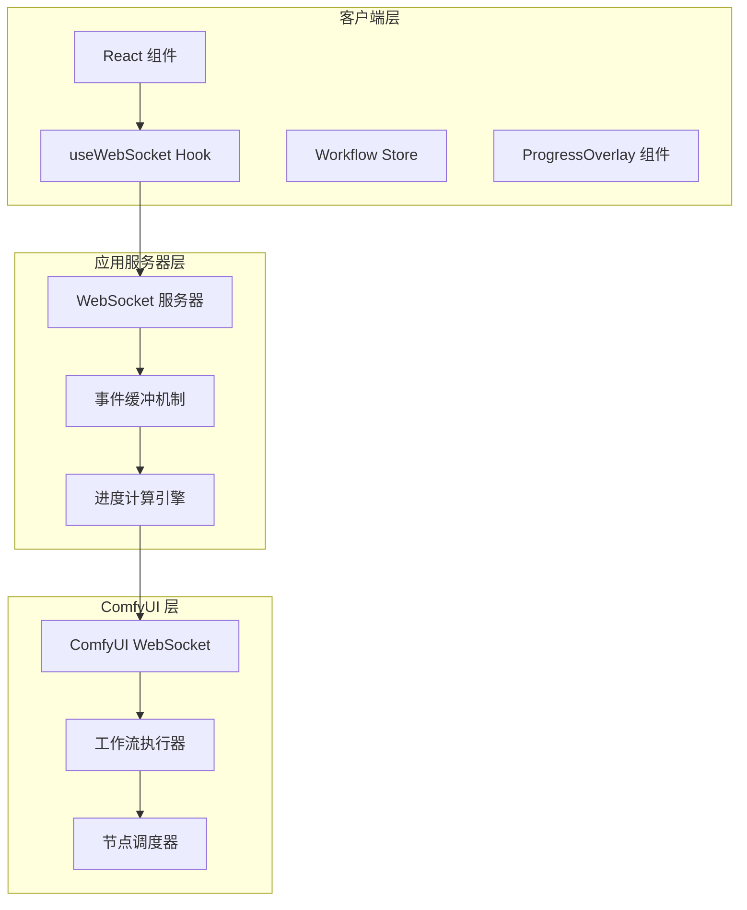

**图表来源**
- [server/src/index.ts:157-178](file://server/src/index.ts#L157-L178)
- [client/src/hooks/useWebSocket.ts:29-52](file://client/src/hooks/useWebSocket.ts#L29-L52)

**章节来源**
- [server/src/index.ts:157-178](file://server/src/index.ts#L157-L178)
- [client/src/hooks/useWebSocket.ts:1-278](file://client/src/hooks/useWebSocket.ts#L1-L278)

## 核心组件

### 服务器端 WebSocket 连接管理

服务器端通过 `connectWebSocket` 函数建立与 ComfyUI 的连接，并提供完整的回调接口：

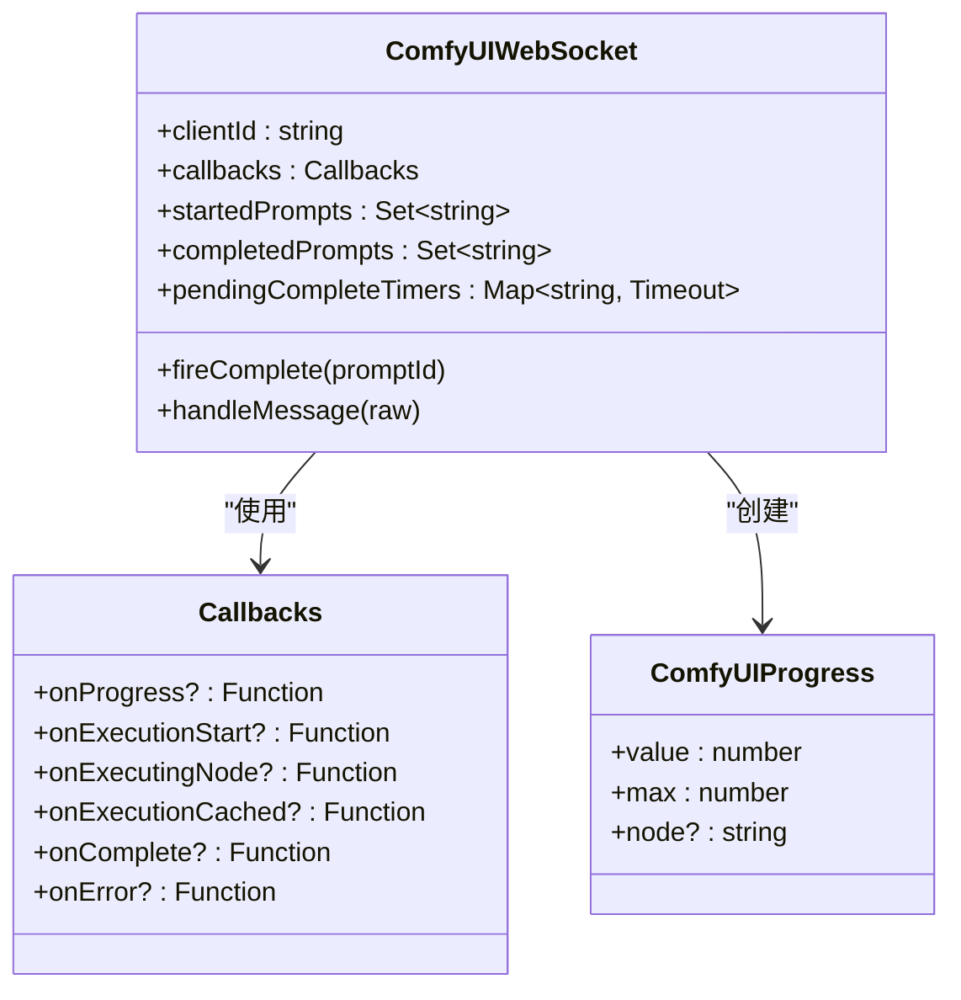

**图表来源**
- [server/src/services/comfyui.ts:265-375](file://server/src/services/comfyui.ts#L265-L375)

### 客户端事件处理器

客户端使用 `useWebSocket` Hook 管理 WebSocket 连接和事件处理：

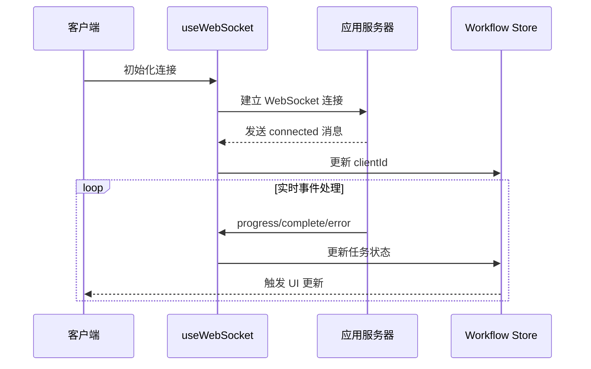

**图表来源**
- [client/src/hooks/useWebSocket.ts:45-159](file://client/src/hooks/useWebSocket.ts#L45-L159)

**章节来源**
- [server/src/services/comfyui.ts:265-375](file://server/src/services/comfyui.ts#L265-L375)
- [client/src/hooks/useWebSocket.ts:1-278](file://client/src/hooks/useWebSocket.ts#L1-L278)

## 架构概览

事件回调系统采用分层架构设计，确保事件的可靠传递和状态管理：

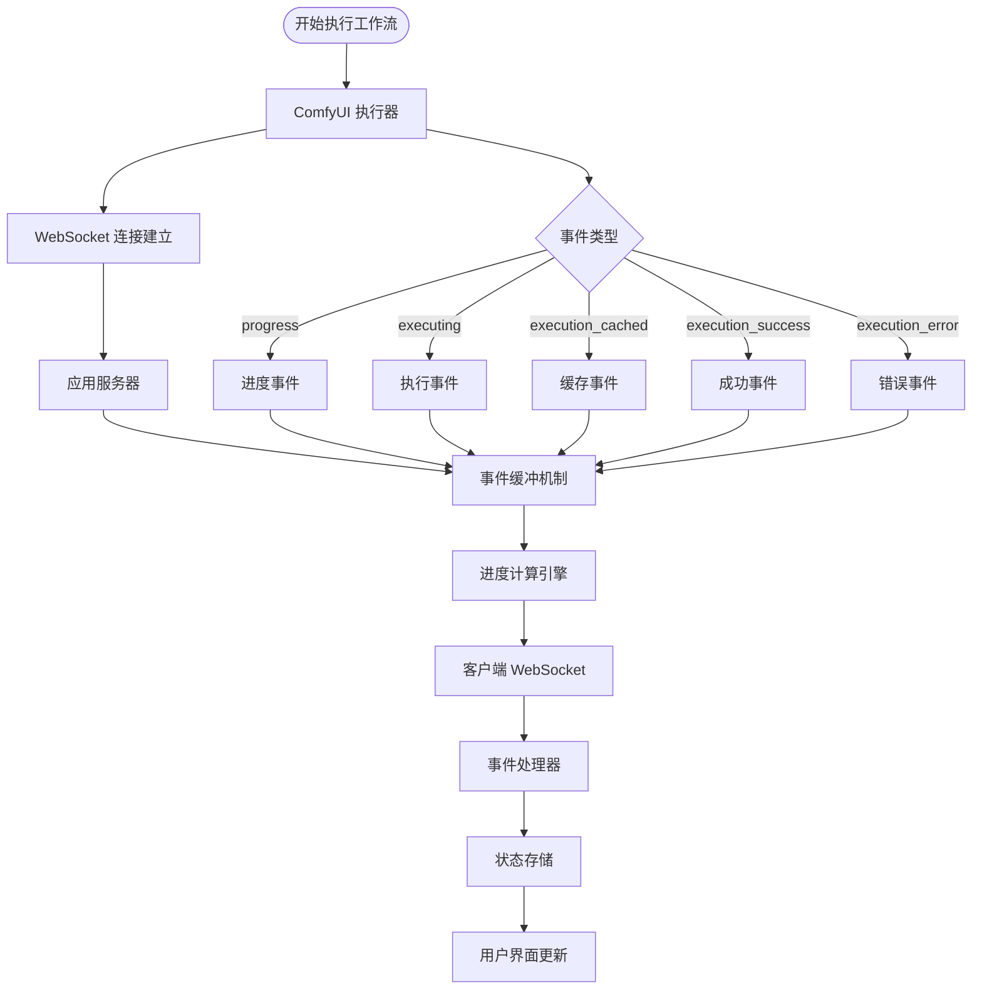

**图表来源**
- [server/src/index.ts:168-178](file://server/src/index.ts#L168-L178)
- [server/src/index.ts:273-464](file://server/src/index.ts#L273-L464)

## 详细组件分析

### WebSocket 事件分类与处理机制

#### 进度事件 (progress)

进度事件提供细粒度的工作流执行状态：

| 事件属性 | 类型 | 描述 | 来源 |
|---------|------|------|------|
| `type` | string | 事件类型，固定为 "progress" | ComfyUI |
| `prompt_id` | string | 工作流唯一标识符 | ComfyUI |
| `value` | number | 当前进度值 | ComfyUI |
| `max` | number | 最大进度值 | ComfyUI |
| `node` | string | 产生进度的节点 ID | ComfyUI |

#### 执行开始事件 (execution_start)

工作流开始执行的标志事件：

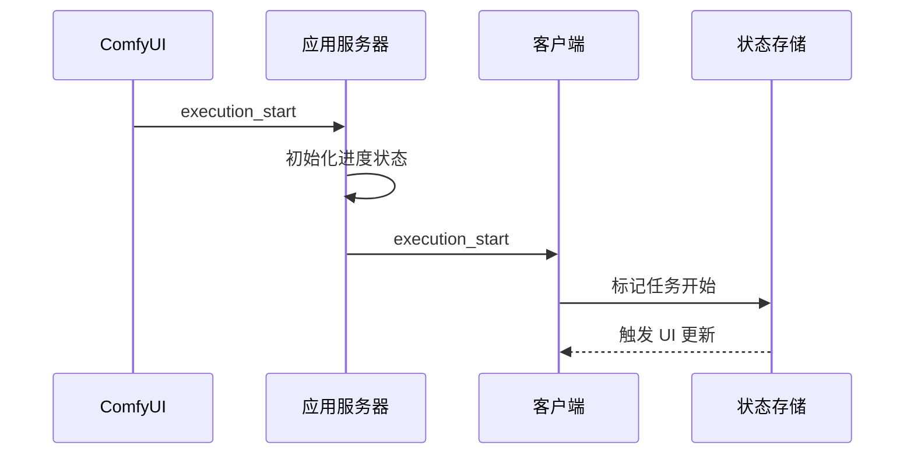

**图表来源**
- [server/src/index.ts:273-277](file://server/src/index.ts#L273-L277)
- [client/src/hooks/useWebSocket.ts:54-56](file://client/src/hooks/useWebSocket.ts#L54-L56)

#### 节点执行事件 (executing)

节点级别的执行状态变更：

| 参数名称 | 类型 | 描述 |
|---------|------|------|
| `promptId` | string | 工作流标识符 |
| `nodeId` | string | 节点标识符 |

#### 缓存命中事件 (execution_cached)

处理被缓存跳过的节点：

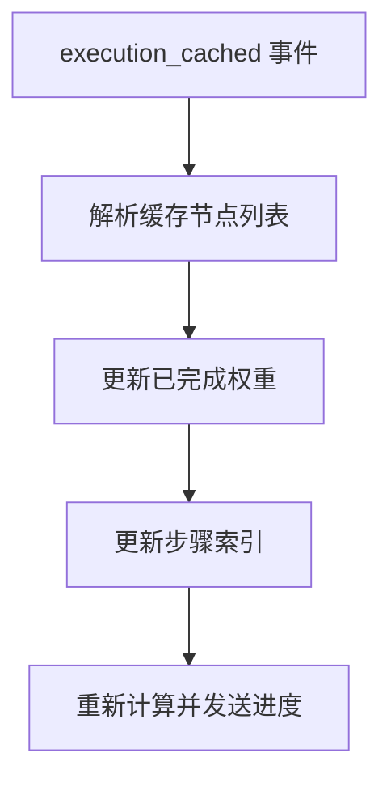

**图表来源**
- [server/src/index.ts:279-287](file://server/src/index.ts#L279-L287)

#### 执行完成事件 (execution_success)

工作流执行完成的最终确认事件：

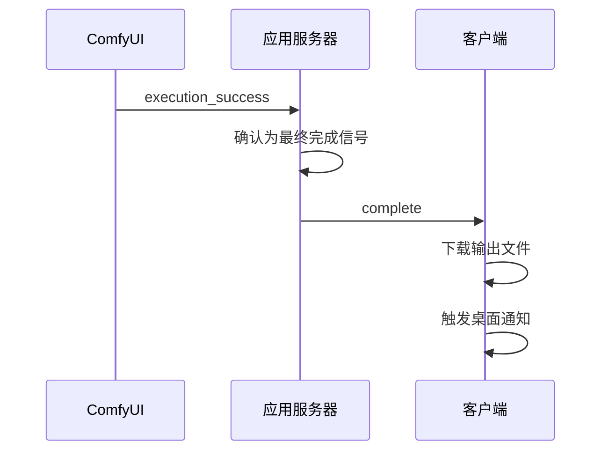

**图表来源**
- [server/src/services/comfyui.ts:352-354](file://server/src/services/comfyui.ts#L352-L354)
- [server/src/index.ts:335-447](file://server/src/index.ts#L335-L447)

### 回调函数接口设计

#### 服务器端回调接口

| 回调函数 | 参数 | 返回值 | 用途 |
|---------|------|--------|------|
| `onProgress` | `(promptId: string, progress: ComfyUIProgress)` | `void` | 处理进度更新 |
| `onExecutionStart` | `(promptId: string)` | `void` | 处理工作流开始 |
| `onExecutingNode` | `(promptId: string, nodeId: string)` | `void` | 处理节点执行 |
| `onExecutionCached` | `(promptId: string, cachedNodes: string[])` | `void` | 处理缓存命中 |
| `onComplete` | `(promptId: string)` | `void` | 处理执行完成 |
| `onError` | `(promptId: string, message: string)` | `void` | 处理执行错误 |

#### 客户端回调接口

| 回调函数 | 参数 | 返回值 | 用途 |
|---------|------|--------|------|
| `onMessage` | `(message: WSMessage)` | `void` | 处理所有 WebSocket 消息 |
| `onOpen` | `()` | `void` | 处理连接建立 |
| `onClose` | `()` | `void` | 处理连接关闭 |
| `onError` | `(error: Event)` | `void` | 处理连接错误 |

### 事件触发时机和顺序

事件生命周期遵循严格的时序规则：

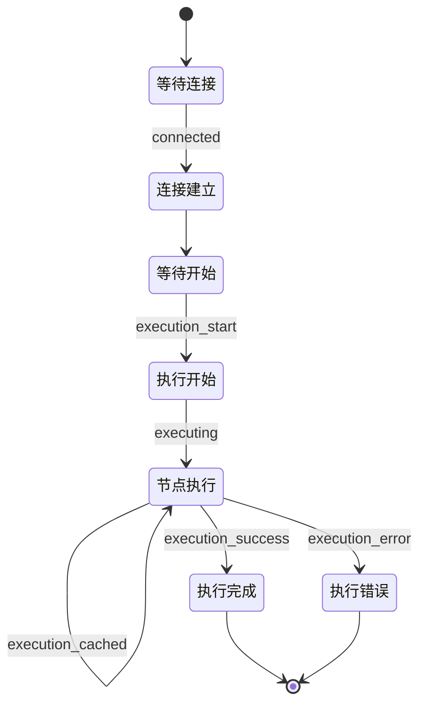

**图表来源**
- [server/src/services/comfyui.ts:325-364](file://server/src/services/comfyui.ts#L325-L364)

### 错误处理机制

系统实现了多层次的错误处理策略：

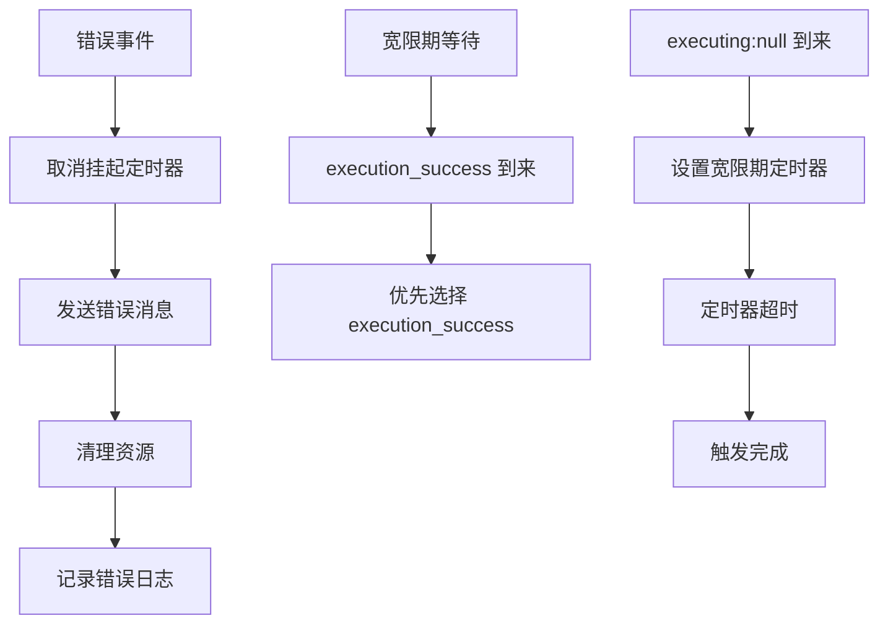

**图表来源**
- [server/src/services/comfyui.ts:280-302](file://server/src/services/comfyui.ts#L280-L302)
- [server/src/services/comfyui.ts:336-364](file://server/src/services/comfyui.ts#L336-L364)

**章节来源**
- [server/src/services/comfyui.ts:265-375](file://server/src/services/comfyui.ts#L265-L375)
- [server/src/index.ts:273-464](file://server/src/index.ts#L273-L464)
- [client/src/hooks/useWebSocket.ts:1-278](file://client/src/hooks/useWebSocket.ts#L1-L278)

## 依赖关系分析

事件回调系统的关键依赖关系：

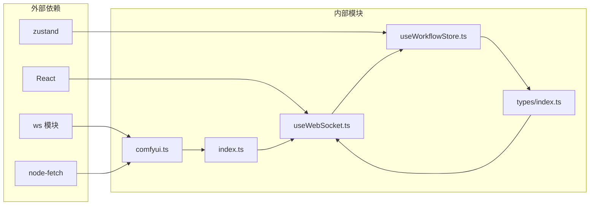

**图表来源**
- [server/src/services/comfyui.ts:1-4](file://server/src/services/comfyui.ts#L1-L4)
- [client/src/hooks/useWebSocket.ts:1-7](file://client/src/hooks/useWebSocket.ts#L1-L7)

**章节来源**
- [server/src/services/comfyui.ts:1-472](file://server/src/services/comfyui.ts#L1-L472)
- [client/src/types/index.ts:1-76](file://client/src/types/index.ts#L1-L76)

## 性能考虑

### 事件去重策略

系统通过多种机制防止事件重复处理：

1. **执行开始去重**: 使用 `startedPrompts` Set 防止重复触发 `onExecutionStart`
2. **完成事件去重**: 使用 `completedPrompts` Set 防止重复触发 `onComplete`
3. **定时器管理**: 使用 `pendingCompleteTimers` Map 管理宽限期定时器

### 批量处理优化

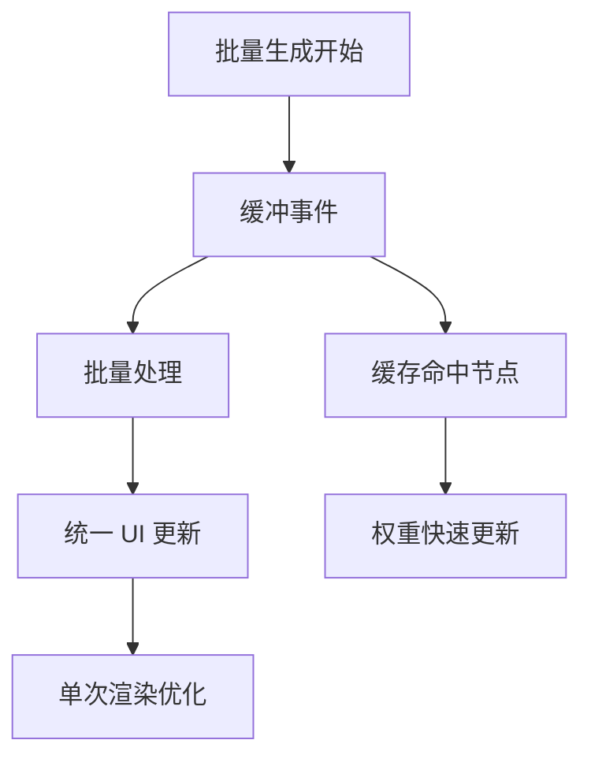

### 内存泄漏防护

系统采用以下措施防止内存泄漏：

1. **连接计数管理**: 使用 `connectionCount` 确保正确的连接生命周期
2. **资源清理**: 在连接关闭时清理定时器和事件监听器
3. **状态清理**: 完成或错误时清理进度状态和映射关系

**章节来源**
- [server/src/services/comfyui.ts:280-302](file://server/src/services/comfyui.ts#L280-L302)
- [client/src/hooks/useWebSocket.ts:259-267](file://client/src/hooks/useWebSocket.ts#L259-L267)

## 故障排除指南

### 常见问题诊断

| 问题症状 | 可能原因 | 解决方案 |
|---------|---------|---------|
| 无进度更新 | WebSocket 连接中断 | 检查网络连接，重连机制会自动处理 |
| 进度卡住 | 缓存命中导致权重更新 | 等待执行完成事件，检查日志 |
| 完成但无输出 | ComfyUI 历史记录未提交 | 系统已内置重试机制，等待历史提交 |
| 错误频繁发生 | ComfyUI 服务不稳定 | 检查 ComfyUI 日志，重启服务 |

### 调试技巧

1. **启用详细日志**: 在服务器端查看 `[WS]` 前缀的日志信息
2. **检查事件序列**: 确认事件按预期顺序到达
3. **监控资源使用**: 关注内存和连接数量的变化

**章节来源**
- [server/src/index.ts:335-447](file://server/src/index.ts#L335-L447)
- [server/src/services/comfyui.ts:370-372](file://server/src/services/comfyui.ts#L370-L372)

## 结论

事件回调系统通过精心设计的架构实现了可靠的实时通信机制。系统的主要优势包括：

1. **可靠性**: 多层重试机制确保事件的完整性和准确性
2. **性能**: 事件缓冲和批量处理优化了用户体验
3. **可维护性**: 清晰的分层架构便于理解和扩展
4. **健壮性**: 完善的错误处理和资源管理机制

该系统为 CorineKit Pix2Real 提供了流畅的生成过程可视化体验，支持复杂的多节点工作流执行监控。通过合理的架构设计和优化策略，系统能够在高负载情况下保持稳定的性能表现。