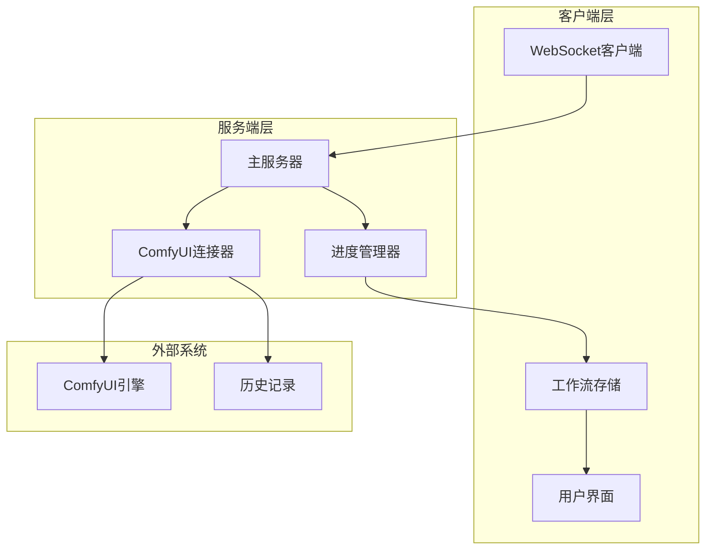
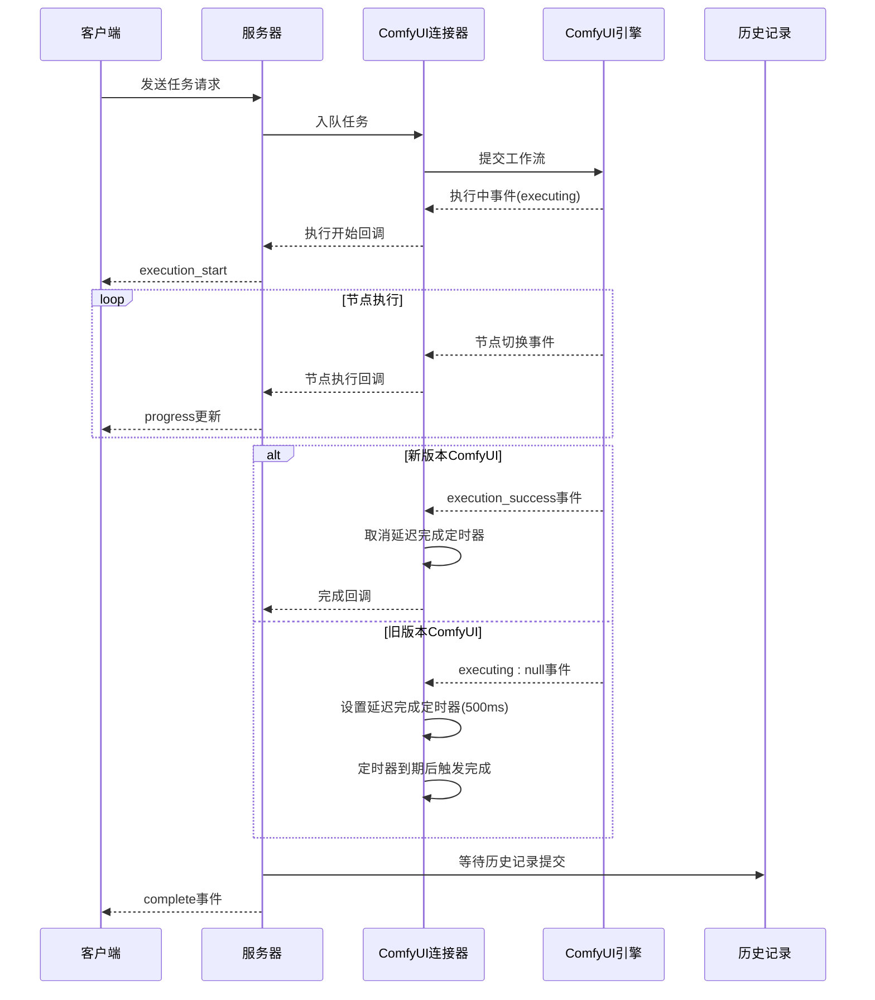
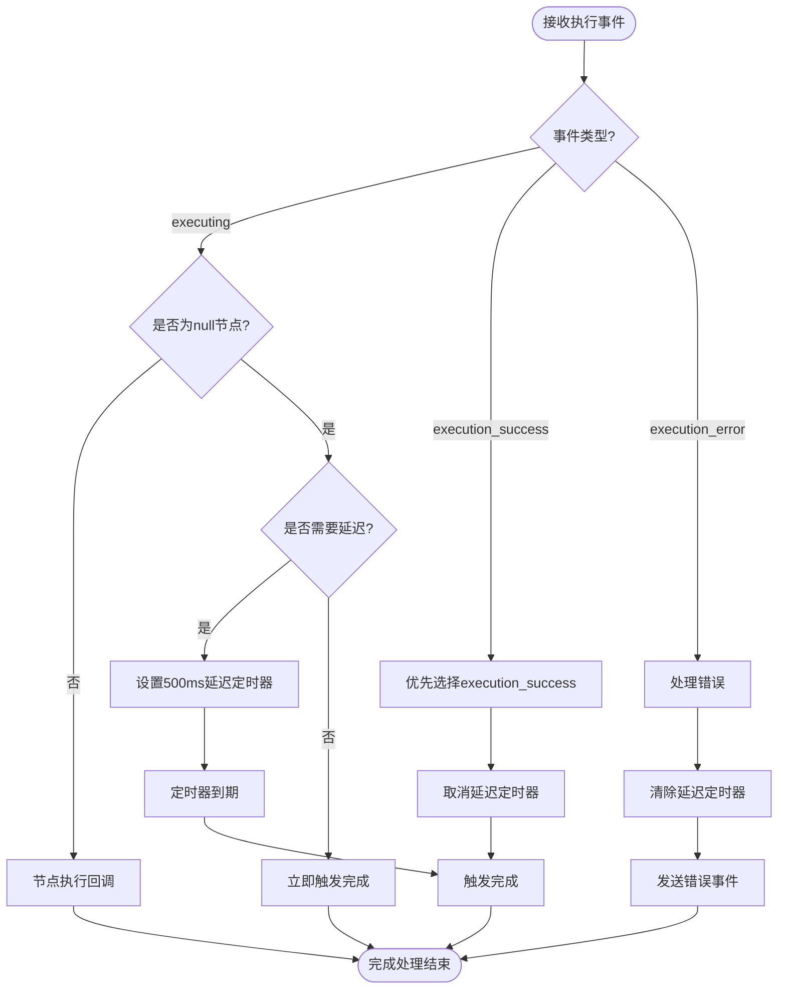
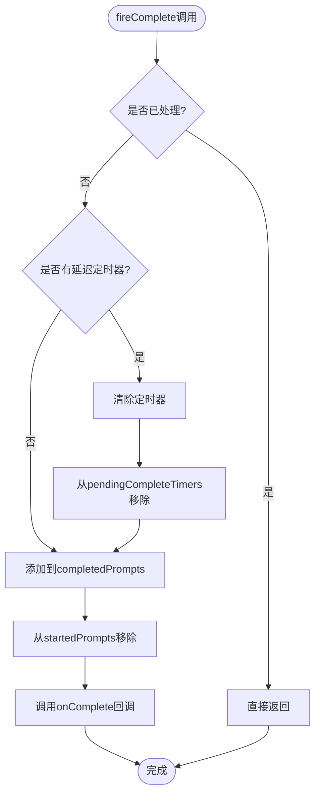
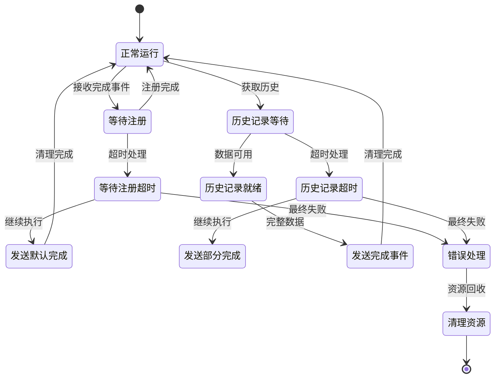
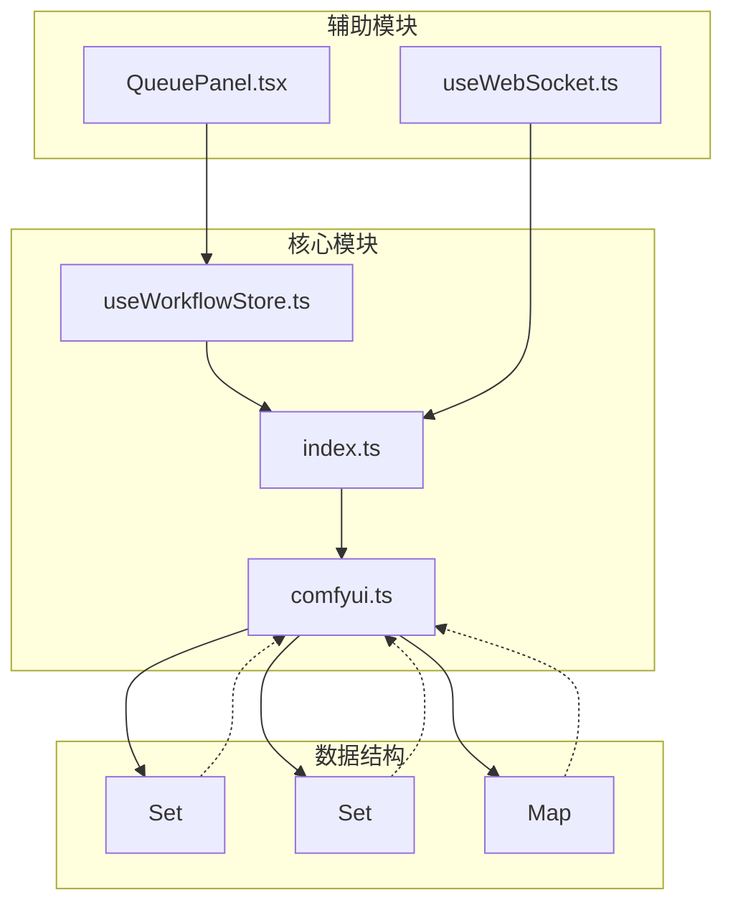
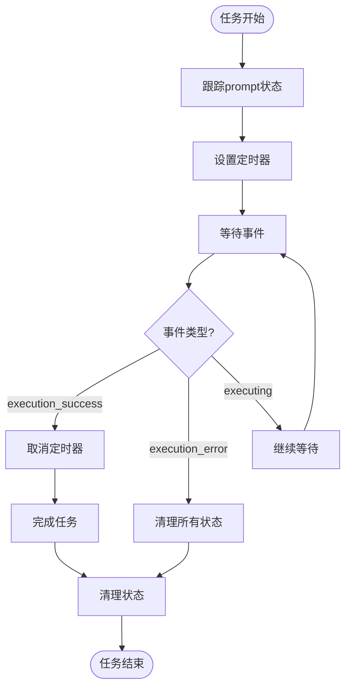

# 完成状态追踪

<cite>
**本文档引用的文件**
- [comfyui.ts](file://server/src/services/comfyui.ts)
- [index.ts](file://server/src/index.ts)
- [useWorkflowStore.ts](file://client/src/hooks/useWorkflowStore.ts)
- [useWebSocket.ts](file://client/src/hooks/useWebSocket.ts)
- [QueuePanel.tsx](file://client/src/components/QueuePanel.tsx)
</cite>

## 目录
1. [简介](#简介)
2. [项目结构](#项目结构)
3. [核心组件](#核心组件)
4. [架构概览](#架构概览)
5. [详细组件分析](#详细组件分析)
6. [依赖关系分析](#依赖关系分析)
7. [性能考虑](#性能考虑)
8. [故障排除指南](#故障排除指南)
9. [结论](#结论)

## 简介

完成状态追踪机制是Pix2Real项目中实现可靠工作流执行管理的关键组件。该机制通过双重确认机制确保任务完成状态的准确性和一致性，特别是在处理复杂的AI生成工作流时，能够有效避免"完成但为空"等边界情况。

本文档深入解析了执行完成信号的识别和处理流程，包括`executing:null`和`execution_success`事件的区别与优先级，以及完成状态的双重确认机制、去重保护机制、错误处理策略和性能优化措施。

## 项目结构

完成状态追踪机制涉及前后端多个层次的协作：

**图表来源**
- [comfyui.ts:265-375](file://server/src/services/comfyui.ts#L265-L375)
- [index.ts:273-464](file://server/src/index.ts#L273-L464)

**章节来源**
- [comfyui.ts:1-472](file://server/src/services/comfyui.ts#L1-L472)
- [index.ts:241-516](file://server/src/index.ts#L241-L516)

## 核心组件

完成状态追踪机制由以下核心组件构成：

### 1. WebSocket连接管理器
负责与ComfyUI建立持久连接，监听各种执行事件并进行相应的状态转换。

### 2. 完成状态处理器
实现双重确认机制，确保完成状态的准确性和一致性。

### 3. 去重保护机制
使用集合数据结构防止重复触发完成事件。

### 4. 错误处理系统
提供异常状态检测和恢复策略。

**章节来源**
- [comfyui.ts:280-302](file://server/src/services/comfyui.ts#L280-L302)

## 架构概览

完成状态追踪的整体架构采用事件驱动的设计模式：

**图表来源**
- [comfyui.ts:325-354](file://server/src/services/comfyui.ts#L325-L354)
- [index.ts:335-448](file://server/src/index.ts#L335-L448)

## 详细组件分析

### 执行完成信号识别机制

#### executing:null vs execution_success 事件对比

完成状态追踪的核心在于正确识别和处理两种不同的完成信号：

| 特征 | executing:null | execution_success |
|------|----------------|-------------------|
| **触发时机** | 工作流结束时立即触发 | 历史记录写入磁盘后触发 |
| **可靠性** | 可能出现"完成但为空"问题 | 更可靠的完成信号 |
| **适用场景** | 旧版本ComfyUI | 新版本ComfyUI |
| **优先级** | 辅助信号 | 主信号 |

#### 优先级决策逻辑

**图表来源**
- [comfyui.ts:325-364](file://server/src/services/comfyui.ts#L325-L364)

**章节来源**
- [comfyui.ts:325-354](file://server/src/services/comfyui.ts#L325-L354)

### 双重确认机制详解

#### 执行成功信号的延迟处理

双重确认机制通过以下步骤确保完成状态的准确性：

1. **初始完成信号接收**：当接收到`executing:null`时，不立即确认完成
2. **延迟等待**：设置500毫秒的延迟等待期
3. **竞争条件处理**：如果在此期间收到`execution_success`，则取消延迟并立即完成
4. **超时保护**：如果500毫秒内未收到`execution_success`，则触发完成

#### grace period的作用

grace period（宽限期）的设计目的是解决以下问题：

- **磁盘写入延迟**：新版本ComfyUI在历史记录写入磁盘前就发出`executing:null`
- **网络传输延迟**：确保客户端能够接收到完整的输出数据
- **竞态条件保护**：避免"完成但为空"的边界情况

**章节来源**
- [comfyui.ts:286-290](file://server/src/services/comfyui.ts#L286-L290)
- [comfyui.ts:336-347](file://server/src/services/comfyui.ts#L336-L347)

### 去重保护机制

#### startedPrompts集合

`startedPrompts`集合用于防止重复触发执行开始事件：

- **用途**：确保每个prompt_id只触发一次`onExecutionStart`回调
- **实现**：使用Set数据结构存储已处理的prompt_id
- **生命周期**：在完成时自动清理

#### completedPrompts集合

`completedPrompts`集合用于防止重复触发完成事件：

- **用途**：确保每个prompt_id只触发一次`onComplete`回调
- **实现**：使用Set数据结构存储已完成的prompt_id
- **生命周期**：在完成时添加，在新的连接中重置

#### pendingCompleteTimers映射

`pendingCompleteTimers`映射用于管理延迟完成定时器：

- **用途**：跟踪正在等待的完成定时器
- **实现**：使用Map数据结构存储prompt_id到定时器的映射
- **生命周期**：在完成时清理或在超时后自动清理

**章节来源**
- [comfyui.ts:280-286](file://server/src/services/comfyui.ts#L280-L286)
- [comfyui.ts:292-302](file://server/src/services/comfyui.ts#L292-L302)

### fireComplete函数实现逻辑

fireComplete函数是完成状态追踪的核心实现：

**图表来源**
- [comfyui.ts:292-302](file://server/src/services/comfyui.ts#L292-L302)

**章节来源**
- [comfyui.ts:292-302](file://server/src/services/comfyui.ts#L292-L302)

### 错误处理与异常状态恢复

#### 异常状态检测

错误处理机制能够检测和处理多种异常状态：

- **execution_error事件**：直接触发错误处理流程
- **历史记录提交失败**：通过重试机制确保数据完整性
- **网络连接中断**：自动重连和状态恢复

#### 恢复策略

**图表来源**
- [index.ts:335-448](file://server/src/index.ts#L335-L448)

**章节来源**
- [index.ts:335-448](file://server/src/index.ts#L335-L448)

## 依赖关系分析

完成状态追踪机制涉及多个模块间的复杂依赖关系：

**图表来源**
- [comfyui.ts:280-290](file://server/src/services/comfyui.ts#L280-L290)
- [index.ts:273-464](file://server/src/index.ts#L273-L464)

**章节来源**
- [comfyui.ts:280-302](file://server/src/services/comfyui.ts#L280-L302)
- [index.ts:273-464](file://server/src/index.ts#L273-L464)

## 性能考虑

### 定时器管理策略

完成状态追踪机制采用了精细化的定时器管理策略：

#### 定时器生命周期管理

- **创建时机**：仅在需要延迟确认完成时创建定时器
- **清理策略**：完成时立即清理，避免内存泄漏
- **超时处理**：自动清理超时的定时器

#### 内存清理策略

**图表来源**
- [comfyui.ts:292-302](file://server/src/services/comfyui.ts#L292-L302)

### 历史记录获取优化

服务器端实现了历史记录获取的重试机制：

- **重试间隔**：200毫秒
- **最大重试次数**：50次（总计10秒）
- **超时处理**：超过时限后发送部分完成数据

**章节来源**
- [index.ts:355-371](file://server/src/index.ts#L355-L371)

## 故障排除指南

### 常见问题及解决方案

#### 问题1：任务显示"完成但为空"

**症状**：UI显示任务已完成，但输出列表为空

**原因**：新版本ComfyUI在历史记录写入磁盘前就发出`executing:null`

**解决方案**：
- 确保使用`execution_success`作为主要完成信号
- 实现grace period机制等待历史记录提交

#### 问题2：任务长时间停留在"处理中"

**症状**：进度条卡在某个节点，任务无法完成

**原因**：节点执行异常或网络连接中断

**解决方案**：
- 检查ComfyUI日志和错误信息
- 实现超时重试机制
- 提供手动取消功能

#### 问题3：重复触发完成事件

**症状**：同一个任务被多次标记为完成

**原因**：缺少去重保护机制

**解决方案**：
- 使用`completedPrompts`集合防止重复触发
- 实现严格的事件去重逻辑

**章节来源**
- [comfyui.ts:280-302](file://server/src/services/comfyui.ts#L280-L302)
- [index.ts:450-463](file://server/src/index.ts#L450-L463)

## 结论

完成状态追踪机制通过精心设计的双重确认机制、去重保护和错误处理策略，确保了Pix2Real项目中AI生成任务的可靠性和用户体验。

该机制的核心优势包括：

1. **可靠性**：通过`execution_success`事件和grace period确保完成状态的准确性
2. **性能**：优化的定时器管理和内存清理策略减少资源消耗
3. **健壮性**：完善的错误处理和异常恢复机制提升系统稳定性
4. **用户体验**：准确的进度反馈和及时的状态更新改善用户交互

未来可以考虑的改进方向：
- 进一步优化历史记录获取的性能
- 增强异常状态的诊断能力
- 实现更精细的资源管理策略