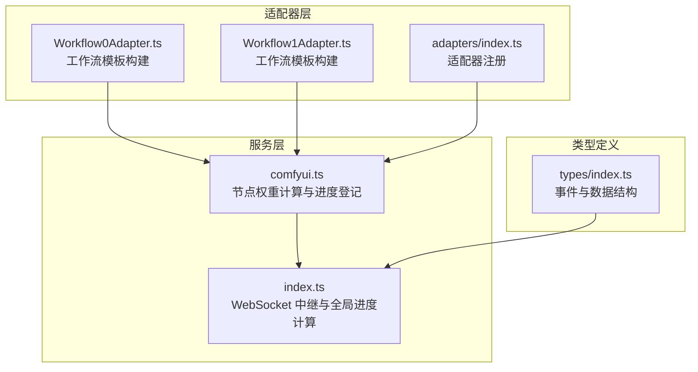
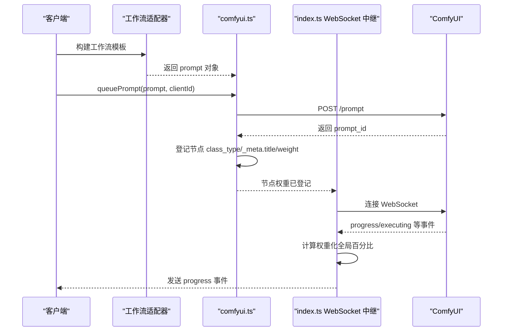
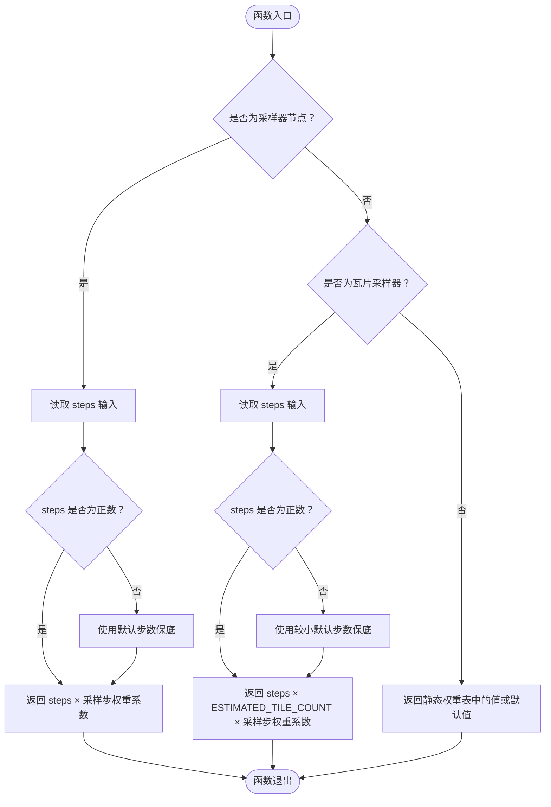
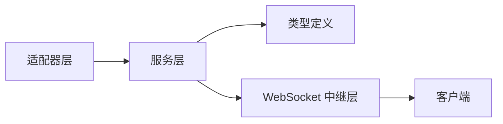

# 节点权重计算算法

<cite>
**本文引用的文件**
- [comfyui.ts](file://server/src/services/comfyui.ts)
- [index.ts](file://server/src/index.ts)
- [Workflow0Adapter.ts](file://server/src/adapters/Workflow0Adapter.ts)
- [Workflow1Adapter.ts](file://server/src/adapters/Workflow1Adapter.ts)
- [index.ts](file://server/src/adapters/index.ts)
- [index.ts](file://server/src/types/index.ts)
</cite>

## 目录
1. [简介](#简介)
2. [项目结构](#项目结构)
3. [核心组件](#核心组件)
4. [架构概览](#架构概览)
5. [详细组件分析](#详细组件分析)
6. [依赖关系分析](#依赖关系分析)
7. [性能考量](#性能考量)
8. [故障排查指南](#故障排查指南)
9. [结论](#结论)
10. [附录](#附录)

## 简介
本技术文档围绕节点权重计算算法展开，系统阐述静态节点权重表的设计原理、采样器节点权重计算（含 steps 影响与动态调整）、瓦片采样器权重估算（ESTIMATED_TILE_COUNT 的使用与尺寸相关权重）、权重表扩展方法（新增节点类型与权重调整策略），以及权重在全局进度计算中的作用与重要性。文档同时提供代码级流程图与类图，帮助读者从宏观到微观全面理解权重计算体系。

## 项目结构
本项目的服务端位于 server/src，其中权重计算与进度追踪主要集中在服务层与 WebSocket 中继层：
- 服务层负责节点权重计算、工作流节点登记与历史查询
- WebSocket 中继层负责进度事件的聚合与权重化全局百分比计算

图表来源
- [comfyui.ts:168-196](file://server/src/services/comfyui.ts#L168-L196)
- [index.ts:15-18](file://server/src/index.ts#L15-L18)
- [Workflow0Adapter.ts:16-33](file://server/src/adapters/Workflow0Adapter.ts#L16-L33)
- [Workflow1Adapter.ts:16-34](file://server/src/adapters/Workflow1Adapter.ts#L16-L34)
- [index.ts:1-32](file://server/src/adapters/index.ts#L1-L32)
- [index.ts:1-52](file://server/src/types/index.ts#L1-L52)

章节来源
- [comfyui.ts:168-196](file://server/src/services/comfyui.ts#L168-L196)
- [index.ts:15-18](file://server/src/index.ts#L15-L18)
- [Workflow0Adapter.ts:16-33](file://server/src/adapters/Workflow0Adapter.ts#L16-L33)
- [Workflow1Adapter.ts:16-34](file://server/src/adapters/Workflow1Adapter.ts#L16-L34)
- [index.ts:1-32](file://server/src/adapters/index.ts#L1-L32)
- [index.ts:1-52](file://server/src/types/index.ts#L1-L52)

## 核心组件
- 节点权重计算函数：根据节点类型与输入参数（尤其是 steps）动态计算权重
- 静态节点权重表：为非采样器节点提供基础权重，反映典型时间开销
- 采样器权重策略：以 steps 为基准，结合采样步权重系数，形成“采样主导”的进度占比
- 瓦片采样器估算：通过 ESTIMATED_TILE_COUNT 对分块采样的耗时进行保守估算
- 进度中继与全局百分比：基于权重化进度与节点切换事件，生成稳定的全局进度

章节来源
- [comfyui.ts:58-144](file://server/src/services/comfyui.ts#L58-L144)
- [index.ts:240-271](file://server/src/index.ts#L240-L271)

## 架构概览
权重计算贯穿工作流入队、节点执行、进度事件聚合与全局百分比生成的全过程。下图展示了关键交互：

图表来源
- [comfyui.ts:168-196](file://server/src/services/comfyui.ts#L168-L196)
- [index.ts:273-333](file://server/src/index.ts#L273-L333)

## 详细组件分析

### 静态节点权重表设计与分配策略
静态节点权重表为非采样器节点提供基础权重，权重值设定依据典型时间开销与 I/O 特性：
- 模型加载类（磁盘 I/O 较慢）：权重较高，体现加载耗时
- 文本编码与 VAE：权重中等，反映 GPU 计算与内存访问
- 放大与视频处理：权重中等至较高，体现计算密集度
- IO 类（快速）：权重较低，代表极短耗时

权重分配策略要点：
- 以“1 权重 ≈ 1 个采样步的耗时”为统一基准，便于跨节点比较
- 采样器节点权重由 steps 动态决定，静态表仅覆盖非采样器节点
- 通过分组与语义化命名，使权重表具备可维护性与可扩展性

章节来源
- [comfyui.ts:58-107](file://server/src/services/comfyui.ts#L58-L107)

### 采样器节点权重计算与动态调整
采样器节点权重完全由输入参数 steps 决定，并通过采样步权重系数进行缩放：
- 步数缺失时采用默认步数作为保底
- 采样步权重系数用于放大采样阶段在进度条上的占比，突出其耗时特性
- 该策略确保多采样器工作流（如高清重绘/精修/二次元转真人）在进度条上自然占据更大比重

动态权重调整机制：
- 当 steps 为有效数值时，权重直接等于 steps × 采样步权重系数
- 当 steps 缺失或无效时，使用默认步数保底，避免权重为 0 导致进度异常

章节来源
- [comfyui.ts:109-130](file://server/src/services/comfyui.ts#L109-L130)
- [comfyui.ts:131-144](file://server/src/services/comfyui.ts#L131-L144)

### 瓦片采样器权重估算算法
瓦片采样器（UltimateSDUpscale/UltimateSDUpscaleNoUpscale）对图像分块重复采样，实际耗时与 tile 数相关，而 tile 数受图像尺寸与放大倍率影响，无法静态精确计算。因此采用经验平均值进行保守估算：
- ESTIMATED_TILE_COUNT 作为平均 tile 数的保守估计
- 瓦片采样器权重 = steps × ESTIMATED_TILE_COUNT × 采样步权重系数
- 该策略在保证进度条合理性的前提下，避免因过大估计导致进度膨胀

章节来源
- [comfyui.ts:118-124](file://server/src/services/comfyui.ts#L118-L124)
- [comfyui.ts:137-142](file://server/src/services/comfyui.ts#L137-L142)

### 节点权重登记与全局进度计算
工作流入队时，服务层会登记每个节点的 class_type、标题与权重，并在 WebSocket 中继层用于生成阶段化与权重化的全局百分比：
- 节点切换事件：记录已完成权重，切换到新节点并更新当前节点权重
- 执行缓存事件：命中缓存的节点权重直接计入已完成权重
- 进度事件：区分单轮与多轮场景（如瓦片采样器），采用 tick 计数与预期 tick 数进行线性递增
- 全局百分比：(已完成权重 + 当前节点权重 × 当前节点内部进度) / 总权重 × 100%，并封顶 99%

章节来源
- [comfyui.ts:168-196](file://server/src/services/comfyui.ts#L168-L196)
- [index.ts:208-229](file://server/src/index.ts#L208-L229)
- [index.ts:240-271](file://server/src/index.ts#L240-L271)
- [index.ts:289-333](file://server/src/index.ts#L289-L333)

### getNodeWeight 函数实现逻辑（代码级分析）
getNodeWeight 是权重计算的核心函数，其行为如下：
- 采样器节点：返回 steps × 采样步权重系数（steps 缺失时使用默认步数）
- 瓦片采样器：返回 steps × ESTIMATED_TILE_COUNT × 采样步权重系数（steps 缺失时使用较小保底）
- 其他节点：返回静态权重表中的对应值，若不存在则使用默认值

图表来源
- [comfyui.ts:131-144](file://server/src/services/comfyui.ts#L131-L144)

章节来源
- [comfyui.ts:131-144](file://server/src/services/comfyui.ts#L131-L144)

### 工作流适配器与节点结构
工作流适配器负责构建具体工作流模板，其中包含节点的 class_type 与输入参数（如 steps）。例如：
- Workflow0Adapter：构建二次元转真人工作流，设置 KSampler 的 steps 等参数
- Workflow1Adapter：构建真人精修工作流，设置 KSampler 的 steps 等参数

这些步骤直接影响节点权重计算，因为 getNodeWeight 会读取节点的 inputs 并据此计算权重。

章节来源
- [Workflow0Adapter.ts:16-33](file://server/src/adapters/Workflow0Adapter.ts#L16-L33)
- [Workflow1Adapter.ts:16-34](file://server/src/adapters/Workflow1Adapter.ts#L16-L34)

## 依赖关系分析
权重计算与进度追踪涉及多个模块之间的协作：
- 适配器层提供工作流模板，模板中的节点参数（如 steps）进入权重计算
- 服务层负责节点登记与权重计算，并向 WebSocket 中继层暴露查询接口
- WebSocket 中继层聚合进度事件，计算权重化全局百分比并发送给客户端

图表来源
- [index.ts:1-32](file://server/src/adapters/index.ts#L1-L32)
- [index.ts:15-18](file://server/src/index.ts#L15-L18)
- [index.ts:1-52](file://server/src/types/index.ts#L1-L52)

章节来源
- [index.ts:1-32](file://server/src/adapters/index.ts#L1-L32)
- [index.ts:15-18](file://server/src/index.ts#L15-L18)
- [index.ts:1-52](file://server/src/types/index.ts#L1-L52)

## 性能考量
- 采样器权重系数放大：通过增大采样步权重系数，使采样阶段在进度条上更突出，符合 GPU 耗时最大这一事实
- 默认步数保底：避免 steps 缺失导致权重为 0，保障进度连续性
- 瓦片采样器保守估算：使用 ESTIMATED_TILE_COUNT 作为平均 tile 数的保守估计，避免进度膨胀
- 多轮场景处理：对于瓦片采样器与多轮节点，采用 tick 计数与预期 tick 数，确保进度线性递增且不回退

章节来源
- [comfyui.ts:126-130](file://server/src/services/comfyui.ts#L126-L130)
- [comfyui.ts:124](file://server/src/services/comfyui.ts#L124)
- [index.ts:246-252](file://server/src/index.ts#L246-L252)

## 故障排查指南
- 进度条异常停滞或倒退：检查 steps 参数是否正确传入；若缺失，确认默认步数保底是否生效
- 瓦片采样器进度异常：确认节点是否被标记为瓦片采样器；检查预期 tick 数计算是否正确
- 缓存命中导致进度突变：确认执行缓存事件是否正确累加权重
- 历史数据为空导致完成事件延迟：确认中继层对历史提交的重试机制是否正常

章节来源
- [index.ts:279-287](file://server/src/index.ts#L279-L287)
- [index.ts:335-448](file://server/src/index.ts#L335-L448)

## 结论
节点权重计算算法通过静态权重表与动态权重策略相结合，实现了对不同类型节点的合理建模。采样器权重以 steps 为核心，辅以采样步权重系数，确保采样阶段在进度条上占据主导地位；瓦片采样器采用 ESTIMATED_TILE_COUNT 进行保守估算，兼顾准确性与稳定性。整体设计在保证用户体验的同时，提供了清晰的扩展路径与良好的可维护性。

## 附录

### 节点权重表扩展方法
- 新增节点类型：在静态权重表中添加新的 class_type 及其权重值，参考现有分组与命名规范
- 调整现有权重：根据实测耗时或业务需求，逐步迭代权重值，保持与采样步权重系数的一致性
- 采样器与瓦片采样器：优先通过输入参数（steps）动态控制权重，减少静态表的硬编码依赖

章节来源
- [comfyui.ts:58-107](file://server/src/services/comfyui.ts#L58-L107)
- [comfyui.ts:109-124](file://server/src/services/comfyui.ts#L109-L124)

### 权重优化建议
- 基准测试：针对不同硬件与模型组合，收集各节点的耗时数据，建立更精准的静态权重表
- 性能影响分析：评估采样步权重系数与默认步数保底对整体进度的影响，寻找平衡点
- 动态校准：在运行时根据历史数据对 ESTIMATED_TILE_COUNT 进行自适应调整，提升估算精度

章节来源
- [comfyui.ts:126-130](file://server/src/services/comfyui.ts#L126-L130)
- [comfyui.ts:124](file://server/src/services/comfyui.ts#L124)