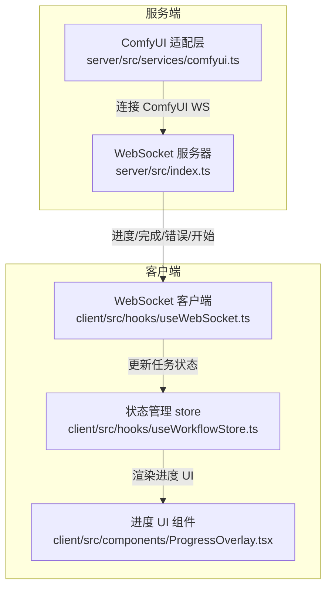
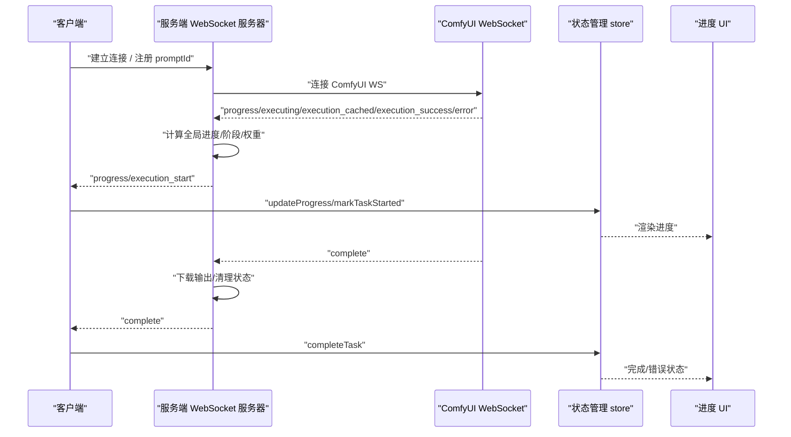
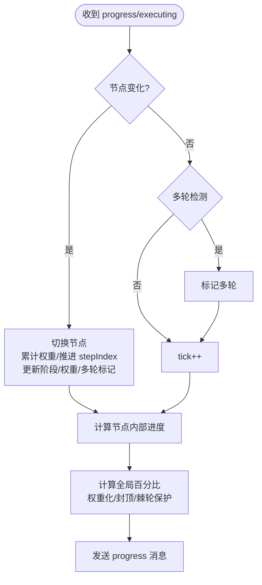
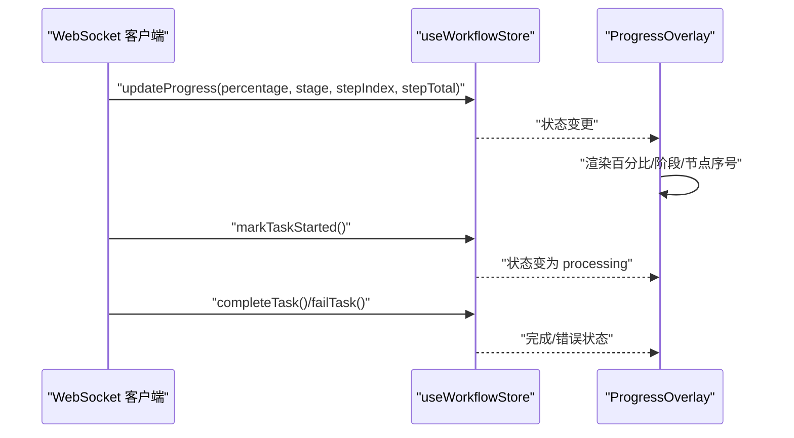
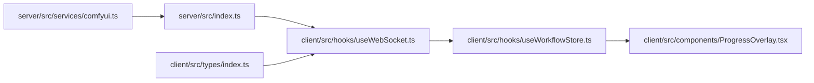

# 进度事件处理机制

<cite>
**本文档引用的文件**
- [server/src/index.ts](file://server/src/index.ts)
- [server/src/services/comfyui.ts](file://server/src/services/comfyui.ts)
- [client/src/hooks/useWebSocket.ts](file://client/src/hooks/useWebSocket.ts)
- [client/src/hooks/useWorkflowStore.ts](file://client/src/hooks/useWorkflowStore.ts)
- [client/src/types/index.ts](file://client/src/types/index.ts)
- [client/src/components/ProgressOverlay.tsx](file://client/src/components/ProgressOverlay.tsx)
</cite>

## 目录
1. [简介](#简介)
2. [项目结构](#项目结构)
3. [核心组件](#核心组件)
4. [架构总览](#架构总览)
5. [详细组件分析](#详细组件分析)
6. [依赖关系分析](#依赖关系分析)
7. [性能考量](#性能考量)
8. [故障排查指南](#故障排查指南)
9. [结论](#结论)

## 简介
本文件系统性阐述 CorineKit_Pix2Real 项目中 ComfyUI 进度事件处理机制，涵盖：
- 进度消息格式与解析
- 节点执行状态与阶段化追踪
- 全局进度百分比计算与权重化算法
- 事件回调与前端展示
- 进度数据转换与用户友好显示
- 性能优化策略（事件去重、批量处理、内存管理）

## 项目结构
该项目采用前后端分离架构，进度事件通过 WebSocket 在服务端与客户端之间传递：
- 服务端负责解析 ComfyUI 原始进度、计算阶段化权重、生成统一进度消息并转发
- 客户端负责接收、更新任务状态、渲染进度 UI

图表来源
- [server/src/index.ts:157-494](file://server/src/index.ts#L157-L494)
- [server/src/services/comfyui.ts:265-375](file://server/src/services/comfyui.ts#L265-L375)
- [client/src/hooks/useWebSocket.ts:45-159](file://client/src/hooks/useWebSocket.ts#L45-L159)
- [client/src/hooks/useWorkflowStore.ts:601-703](file://client/src/hooks/useWorkflowStore.ts#L601-L703)
- [client/src/components/ProgressOverlay.tsx:12-126](file://client/src/components/ProgressOverlay.tsx#L12-L126)

章节来源
- [server/src/index.ts:157-494](file://server/src/index.ts#L157-L494)
- [server/src/services/comfyui.ts:265-375](file://server/src/services/comfyui.ts#L265-L375)
- [client/src/hooks/useWebSocket.ts:45-159](file://client/src/hooks/useWebSocket.ts#L45-L159)
- [client/src/hooks/useWorkflowStore.ts:601-703](file://client/src/hooks/useWorkflowStore.ts#L601-L703)
- [client/src/components/ProgressOverlay.tsx:12-126](file://client/src/components/ProgressOverlay.tsx#L12-L126)

## 核心组件
- 服务端进度计算与事件中继
  - 阶段映射与权重表：将节点 class_type 映射为中文阶段名，并定义静态/动态权重
  - 全局进度计算：基于节点权重与节点内部进度，生成 0~99 的全局百分比
  - 事件缓冲与重放：在客户端注册前捕获并缓冲事件，保证 UI 一致性
- 客户端事件消费与状态更新
  - WebSocket 消息解析：区分 progress、execution_start、complete、error 等类型
  - 任务状态机：queued → processing → done/error
  - 进度 UI 渲染：百分比、阶段、节点序号等

章节来源
- [server/src/index.ts:20-77](file://server/src/index.ts#L20-L77)
- [server/src/index.ts:187-271](file://server/src/index.ts#L187-L271)
- [server/src/services/comfyui.ts:47-166](file://server/src/services/comfyui.ts#L47-L166)
- [client/src/hooks/useWebSocket.ts:45-159](file://client/src/hooks/useWebSocket.ts#L45-L159)
- [client/src/hooks/useWorkflowStore.ts:601-703](file://client/src/hooks/useWorkflowStore.ts#L601-L703)

## 架构总览
服务端与客户端之间的进度事件流如下：

图表来源
- [server/src/index.ts:273-448](file://server/src/index.ts#L273-L448)
- [server/src/services/comfyui.ts:304-375](file://server/src/services/comfyui.ts#L304-L375)
- [client/src/hooks/useWebSocket.ts:45-159](file://client/src/hooks/useWebSocket.ts#L45-L159)
- [client/src/hooks/useWorkflowStore.ts:601-703](file://client/src/hooks/useWorkflowStore.ts#L601-L703)

## 详细组件分析

### 服务端进度计算与事件中继
- 阶段映射与权重
  - 静态节点权重：模型加载、VAE/CLIP/LoRA 加载、IO 等
  - 动态节点权重：采样器（steps × 系数）、Tiled 采样器（steps × 估算 tile 数 × 系数）
  - 阶段名映射：将节点 class_type 映射为中文阶段名，支持回退到节点标题
- 全局进度算法
  - 节点内部进度：多轮/瓦片采样用 tick 计数，单轮用 value/max
  - 全局百分比：加权累计 (已完成权重 + 当前节点权重 × 节点内部进度) / 总权重
  - 百分比封顶：99%，100% 由 complete 确认
  - 棘轮保护：防止多轮间百分比回退
- 事件缓冲与重放
  - 缓冲最近的 execution_start/progress 事件，客户端注册后重放
  - 防止首卡在批量场景中错过进度事件
- 执行节点事件处理
  - onExecutionStart：仅触发一次，确保前端先收到 execution_start
  - onExecutingNode：节点切换时累计权重、推进 stepIndex、更新阶段与权重
  - onExecutionCached：缓存命中节点直接计入权重，推进 stepIndex
  - onComplete：防御性重试 getHistory，确保输出写盘后再发送 complete

图表来源
- [server/src/index.ts:240-271](file://server/src/index.ts#L240-L271)
- [server/src/index.ts:289-333](file://server/src/index.ts#L289-L333)
- [server/src/services/comfyui.ts:131-144](file://server/src/services/comfyui.ts#L131-L144)

章节来源
- [server/src/index.ts:20-77](file://server/src/index.ts#L20-L77)
- [server/src/index.ts:187-271](file://server/src/index.ts#L187-L271)
- [server/src/index.ts:273-448](file://server/src/index.ts#L273-L448)
- [server/src/services/comfyui.ts:47-166](file://server/src/services/comfyui.ts#L47-L166)
- [server/src/services/comfyui.ts:131-144](file://server/src/services/comfyui.ts#L131-L144)

### 客户端事件消费与状态更新
- WebSocket 消息处理
  - connected：保存 clientId
  - execution_start：标记任务为 processing
  - progress：更新任务进度、阶段、节点序号
  - complete：标记任务完成，合并输出
  - error：标记任务错误
- 状态管理
  - updateProgress：在所有标签页中查找匹配 promptId，更新进度与阶段
  - markTaskStarted：将 queued 推进为 processing
  - completeTask/failTask/resetTask：任务生命周期管理
- 进度 UI 展示
  - ProgressOverlay：根据状态显示“准备中”、“队列中”或进度条与百分比
  - 支持 stepIndex/stepTotal 展示当前节点序号

图表来源
- [client/src/hooks/useWebSocket.ts:45-159](file://client/src/hooks/useWebSocket.ts#L45-L159)
- [client/src/hooks/useWorkflowStore.ts:601-703](file://client/src/hooks/useWorkflowStore.ts#L601-L703)
- [client/src/components/ProgressOverlay.tsx:12-126](file://client/src/components/ProgressOverlay.tsx#L12-L126)

章节来源
- [client/src/hooks/useWebSocket.ts:45-159](file://client/src/hooks/useWebSocket.ts#L45-L159)
- [client/src/hooks/useWorkflowStore.ts:601-703](file://client/src/hooks/useWorkflowStore.ts#L601-L703)
- [client/src/components/ProgressOverlay.tsx:12-126](file://client/src/components/ProgressOverlay.tsx#L12-L126)

### 进度事件回调函数实现
- onProgress
  - 作用：接收 ComfyUI 原始进度（value/max/node），服务端据此计算全局进度
  - 使用：在 connectWebSocket 中注册，服务端 onProgress 会更新节点内部进度并触发 emitProgress
- onExecutionStart
  - 作用：工作流开始，仅触发一次
  - 使用：服务端在首次收到 executing 非空时触发，客户端收到后标记任务为 processing
- onExecutingNode
  - 作用：节点开始执行，用于推进 stepIndex、更新阶段与权重
  - 使用：服务端在节点切换时触发，客户端据此更新 UI
- onExecutionCached
  - 作用：缓存命中节点，直接计入权重，推进 stepIndex
  - 使用：服务端在 execution_cached 事件到达时触发，加速全局进度推进
- onComplete
  - 作用：工作流完成，下载输出并清理状态
  - 使用：服务端防御性重试 getHistory，确保输出写盘后再发送 complete

章节来源
- [server/src/services/comfyui.ts:265-375](file://server/src/services/comfyui.ts#L265-L375)
- [server/src/index.ts:273-448](file://server/src/index.ts#L273-L448)

### 进度数据转换示例
- 原始 ComfyUI progress
  - 字段：value、max、node（可选）
  - 用途：单轮节点内部进度计算
- 服务端转换
  - 计算节点内部进度：多轮/瓦片用 tick，单轮用 value/max
  - 计算全局百分比：权重化加权累计，封顶 99%
  - 发送统一 progress 消息：包含 percentage、stage、stepIndex、stepTotal
- 客户端展示
  - 更新任务状态：queued → processing → done/error
  - 渲染进度 UI：百分比、阶段、节点序号、节点总数

章节来源
- [server/src/index.ts:240-271](file://server/src/index.ts#L240-L271)
- [client/src/hooks/useWorkflowStore.ts:624-648](file://client/src/hooks/useWorkflowStore.ts#L624-L648)
- [client/src/components/ProgressOverlay.tsx:12-126](file://client/src/components/ProgressOverlay.tsx#L12-L126)

## 依赖关系分析
- 服务端依赖
  - comfyui.ts：连接 ComfyUI WebSocket、解析进度、计算权重、管理节点信息
  - index.ts：事件缓冲、全局进度计算、事件中继、完成/错误处理
- 客户端依赖
  - useWebSocket.ts：统一 WebSocket 管理、消息分发
  - useWorkflowStore.ts：任务状态机、进度更新、完成/错误处理
  - types/index.ts：消息类型定义（WSProgressMessage 等）
  - ProgressOverlay.tsx：进度 UI 组件

图表来源
- [server/src/services/comfyui.ts:265-375](file://server/src/services/comfyui.ts#L265-L375)
- [server/src/index.ts:273-448](file://server/src/index.ts#L273-L448)
- [client/src/hooks/useWebSocket.ts:45-159](file://client/src/hooks/useWebSocket.ts#L45-L159)
- [client/src/hooks/useWorkflowStore.ts:601-703](file://client/src/hooks/useWorkflowStore.ts#L601-L703)
- [client/src/types/index.ts:44-75](file://client/src/types/index.ts#L44-L75)
- [client/src/components/ProgressOverlay.tsx:12-126](file://client/src/components/ProgressOverlay.tsx#L12-L126)

章节来源
- [server/src/services/comfyui.ts:265-375](file://server/src/services/comfyui.ts#L265-L375)
- [server/src/index.ts:273-448](file://server/src/index.ts#L273-L448)
- [client/src/hooks/useWebSocket.ts:45-159](file://client/src/hooks/useWebSocket.ts#L45-L159)
- [client/src/hooks/useWorkflowStore.ts:601-703](file://client/src/hooks/useWorkflowStore.ts#L601-L703)
- [client/src/types/index.ts:44-75](file://client/src/types/index.ts#L44-L75)
- [client/src/components/ProgressOverlay.tsx:12-126](file://client/src/components/ProgressOverlay.tsx#L12-L126)

## 性能考量
- 事件去重与防抖
  - onExecutionStart 仅触发一次，避免重复初始化
  - onComplete 使用定时器与执行成功信号竞争，防止重复触发
- 批量处理
  - 事件缓冲：在客户端注册前缓冲最近事件，减少首卡丢失
  - 多轮/瓦片采样：tick 计数避免 max 重置导致的回退
- 内存管理
  - 事件缓冲按 promptId 维度管理，完成/错误后清理
  - 节点信息在 complete/error 时清理，避免长期占用
  - 客户端任务状态按需更新，避免全量重渲染

章节来源
- [server/src/services/comfyui.ts:280-302](file://server/src/services/comfyui.ts#L280-L302)
- [server/src/index.ts:175-185](file://server/src/index.ts#L175-L185)
- [server/src/index.ts:431-436](file://server/src/index.ts#L431-L436)

## 故障排查指南
- 进度不前进或回退
  - 检查是否为多轮/瓦片采样：应使用 tick 计数而非 value/max
  - 确认节点权重是否正确：采样器权重应为 steps × 系数
- 完成事件缺失或输出为空
  - 服务端已防御性重试 getHistory，确认磁盘写入完成
  - 检查客户端是否正确注册 promptId
- 执行成功信号竞争
  - 新版 ComfyUI 优先发送 execution_success，旧版可能只有 executing:null
  - 服务端通过定时器与信号竞争，确保不会重复触发
- WebSocket 连接异常
  - 客户端自动重连，确认服务端 WebSocket 端口与跨域配置

章节来源
- [server/src/index.ts:335-448](file://server/src/index.ts#L335-L448)
- [server/src/services/comfyui.ts:350-364](file://server/src/services/comfyui.ts#L350-L364)
- [client/src/hooks/useWebSocket.ts:232-244](file://client/src/hooks/useWebSocket.ts#L232-L244)

## 结论
本机制通过服务端统一计算与客户端状态机协同，实现了稳定、可扩展的进度事件处理：
- 阶段化与权重化算法确保全局进度更贴近真实耗时
- 事件缓冲与重放保障 UI 一致性
- 完成/错误处理与内存清理提升健壮性
- 前端 UI 组件与状态管理清晰分离，便于扩展与维护