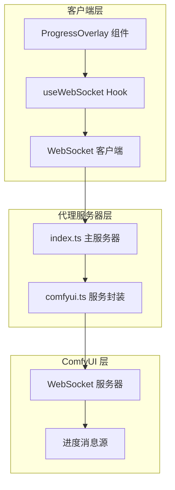
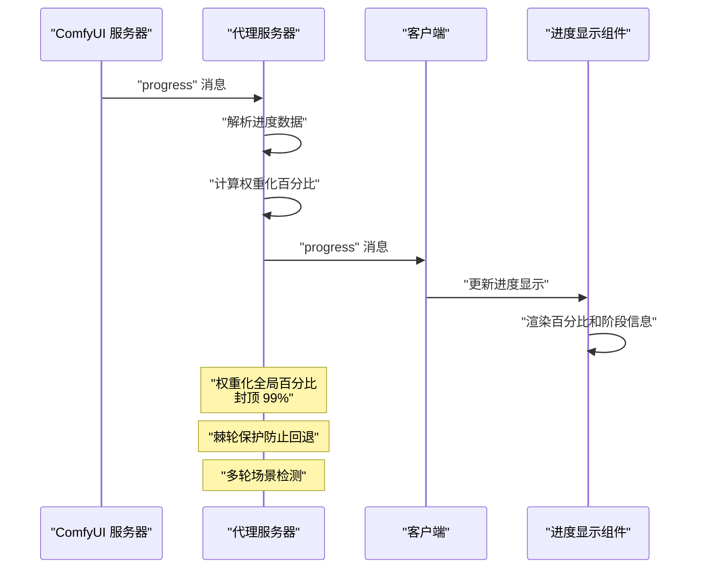
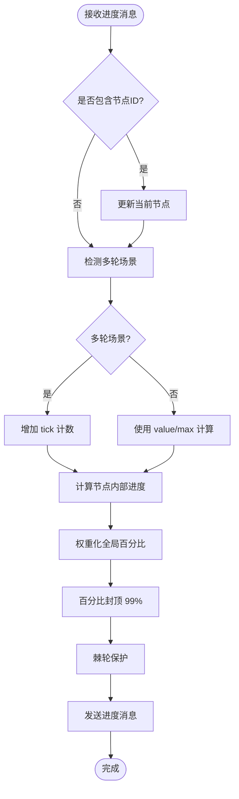
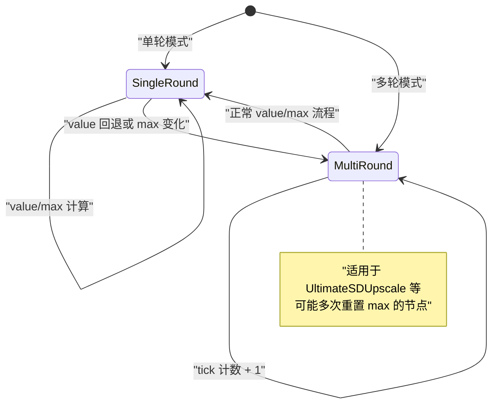
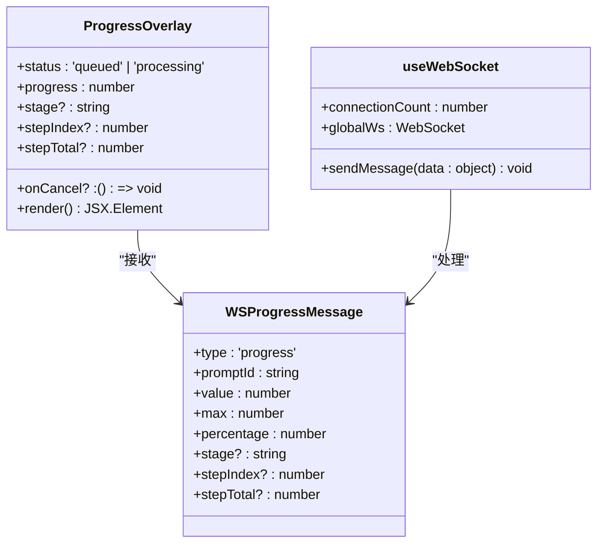
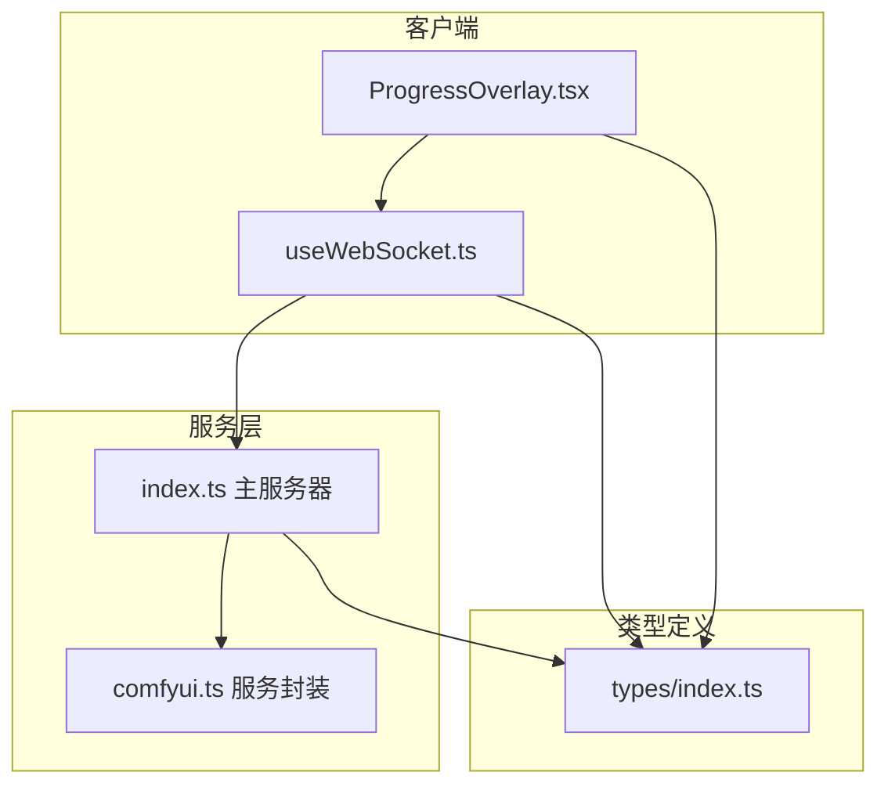

# 进度数据解析与转换

<cite>
**本文档引用的文件**
- [server/src/index.ts](file://server/src/index.ts)
- [server/src/services/comfyui.ts](file://server/src/services/comfyui.ts)
- [client/src/hooks/useWebSocket.ts](file://client/src/hooks/useWebSocket.ts)
- [client/src/components/ProgressOverlay.tsx](file://client/src/components/ProgressOverlay.tsx)
- [client/src/types/index.ts](file://client/src/types/index.ts)
</cite>

## 目录
1. [简介](#简介)
2. [项目结构](#项目结构)
3. [核心组件](#核心组件)
4. [架构概览](#架构概览)
5. [详细组件分析](#详细组件分析)
6. [依赖关系分析](#依赖关系分析)
7. [性能考虑](#性能考虑)
8. [故障排除指南](#故障排除指南)
9. [结论](#结论)

## 简介
本文档深入解析了 CorineKit_Pix2Real 项目中 ComfyUI 原始进度数据的解析与转换机制。该系统实现了从 ComfyUI WebSocket 进度消息到前端可读进度显示的完整链路，包括节点 ID 提取、进度值验证、权重化全局百分比计算、多轮场景处理以及错误处理等关键功能。

## 项目结构
该项目采用前后端分离架构，进度数据处理涉及三个主要层面：

**图表来源**
- [server/src/index.ts:158-178](file://server/src/index.ts#L158-L178)
- [client/src/hooks/useWebSocket.ts:29-43](file://client/src/hooks/useWebSocket.ts#L29-L43)

**章节来源**
- [server/src/index.ts:158-178](file://server/src/index.ts#L158-L178)
- [client/src/hooks/useWebSocket.ts:29-43](file://client/src/hooks/useWebSocket.ts#L29-L43)

## 核心组件
系统的核心组件包括进度状态管理、权重化计算引擎、事件缓冲机制和前端进度显示组件。

### 进度状态管理
进度状态管理器负责跟踪每个 prompt 的执行状态，包括：
- 节点权重信息
- 当前节点进度
- 全局权重化百分比
- 多轮场景检测

### 权重化计算引擎
基于节点类型和参数计算权重，支持：
- 静态节点权重（模型加载、编码等）
- 动态采样器权重（基于 steps 数）
- Tiled 采样器特殊处理
- 权重归一化和边界控制

### 事件缓冲机制
实现客户端连接与 ComfyUI 事件之间的解耦：
- 事件缓冲队列
- 注册消息重放
- 连接状态管理

**章节来源**
- [server/src/index.ts:190-229](file://server/src/index.ts#L190-L229)
- [server/src/index.ts:179-185](file://server/src/index.ts#L179-L185)

## 架构概览
系统采用三层架构设计，实现了从底层进度数据到用户界面的完整转换：

**图表来源**
- [server/src/index.ts:240-271](file://server/src/index.ts#L240-L271)
- [client/src/hooks/useWebSocket.ts:57-58](file://client/src/hooks/useWebSocket.ts#L57-L58)

## 详细组件分析

### ComfyUI 进度消息结构
ComfyUI 原始进度消息包含以下关键字段：

| 字段名 | 类型 | 描述 | 示例 |
|--------|------|------|------|
| `value` | number | 当前进度值 | 5 |
| `max` | number | 最大进度值 | 20 |
| `node` | string | 节点 ID（可选） | "123" |
| `prompt_id` | string | 提示符 ID | "abc-def" |

**章节来源**
- [server/src/services/comfyui.ts:221-226](file://server/src/services/comfyui.ts#L221-L226)

### 进度解析与转换算法
系统实现了复杂的进度解析算法，支持多种场景：

**图表来源**
- [server/src/index.ts:310-332](file://server/src/index.ts#L310-L332)
- [server/src/index.ts:240-260](file://server/src/index.ts#L240-L260)

### 节点权重计算系统
系统根据节点类型动态计算权重，权重单位为"采样步"：

| 节点类型 | 权重计算方式 | 默认权重 |
|----------|-------------|----------|
| 采样器节点 | `steps × 2.5` | 50（默认 20 步） |
| Tiled 采样器 | `steps × 8 × 2.5` | 40（默认 2 步） |
| 模型加载 | 固定权重 15 | 15 |
| VAE 编码/解码 | 固定权重 3 | 3 |
| 文本编码 | 固定权重 2 | 2 |
| IO 操作 | 固定权重 1 | 1 |

**章节来源**
- [server/src/services/comfyui.ts:131-144](file://server/src/services/comfyui.ts#L131-L144)
- [server/src/services/comfyui.ts:58-107](file://server/src/services/comfyui.ts#L58-L107)

### 多轮场景检测机制
系统能够检测并正确处理多轮生成场景：

**图表来源**
- [server/src/index.ts:325-328](file://server/src/index.ts#L325-L328)
- [server/src/index.ts:246-249](file://server/src/index.ts#L246-L249)

**章节来源**
- [server/src/index.ts:325-328](file://server/src/index.ts#L325-L328)
- [server/src/index.ts:246-249](file://server/src/index.ts#L246-L249)

### 前端进度显示组件
前端使用 React 组件实时显示进度信息：

**图表来源**
- [client/src/components/ProgressOverlay.tsx:3-10](file://client/src/components/ProgressOverlay.tsx#L3-L10)
- [client/src/types/index.ts:44-56](file://client/src/types/index.ts#L44-L56)
- [client/src/hooks/useWebSocket.ts:254-277](file://client/src/hooks/useWebSocket.ts#L254-L277)

**章节来源**
- [client/src/components/ProgressOverlay.tsx:12-125](file://client/src/components/ProgressOverlay.tsx#L12-L125)
- [client/src/types/index.ts:44-56](file://client/src/types/index.ts#L44-L56)

## 依赖关系分析

**图表来源**
- [server/src/index.ts:15-18](file://server/src/index.ts#L15-L18)
- [client/src/hooks/useWebSocket.ts:1-7](file://client/src/hooks/useWebSocket.ts#L1-L7)
- [client/src/types/index.ts:1-76](file://client/src/types/index.ts#L1-L76)

**章节来源**
- [server/src/index.ts:15-18](file://server/src/index.ts#L15-L18)
- [client/src/hooks/useWebSocket.ts:1-7](file://client/src/hooks/useWebSocket.ts#L1-L7)

## 性能考虑

### 数据缓存策略
系统实现了多层次的数据缓存机制：

1. **事件缓冲缓存**
   - 使用 Map 存储每个 prompt 的事件缓冲
   - 支持注册消息重放功能
   - 自动清理机制防止内存泄漏

2. **节点信息缓存**
   - 缓存每个 prompt 的节点权重信息
   - 支持权重化进度计算
   - 任务完成后自动清理

3. **连接池管理**
   - 单例 WebSocket 连接
   - 连接计数管理
   - 自动重连机制

### 内存使用优化
- **及时清理**：完成任务后立即删除相关缓存
- **边界控制**：百分比封顶 99%，避免数值溢出
- **增量更新**：只发送必要的进度变化

### 性能监控指标
- **响应时间**：WebSocket 消息处理延迟
- **内存占用**：事件缓冲大小和节点信息缓存
- **CPU 使用率**：权重计算和 JSON 序列化开销

## 故障排除指南

### 常见问题及解决方案

#### 进度百分比异常
**问题**：进度百分比超过 100% 或出现负值
**原因**：权重计算异常或多轮场景检测错误
**解决**：检查节点权重配置和多轮检测逻辑

#### 进度停滞
**问题**：进度长时间不变
**原因**：ComfyUI 任务卡住或网络中断
**解决**：检查 ComfyUI 日志和网络连接状态

#### 进度回退
**问题**：进度百分比出现回退现象
**原因**：多轮场景中的 max 重置
**解决**：启用棘轮保护机制

#### 内存泄漏
**问题**：应用运行时间越长内存占用越大
**原因**：事件缓冲未及时清理
**解决**：检查任务完成后的清理逻辑

**章节来源**
- [server/src/index.ts:450-463](file://server/src/index.ts#L450-L463)
- [server/src/index.ts:431-435](file://server/src/index.ts#L431-L435)

## 结论
该进度数据解析与转换系统实现了从 ComfyUI 原始进度消息到前端友好显示的完整链路。系统通过权重化计算、多轮场景检测、事件缓冲和棘轮保护等机制，提供了准确可靠的进度跟踪功能。同时，系统的模块化设计和完善的错误处理机制确保了在复杂场景下的稳定性和可靠性。

未来可以考虑的改进方向包括：
- 实现更精细的进度预测算法
- 增强错误恢复能力
- 优化内存使用效率
- 添加进度历史记录功能