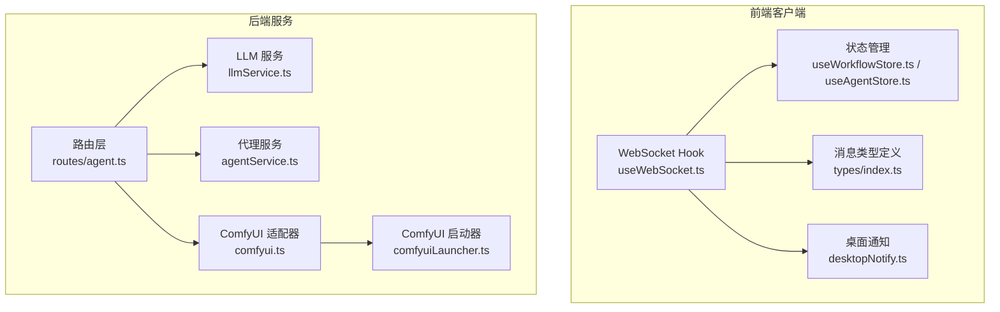
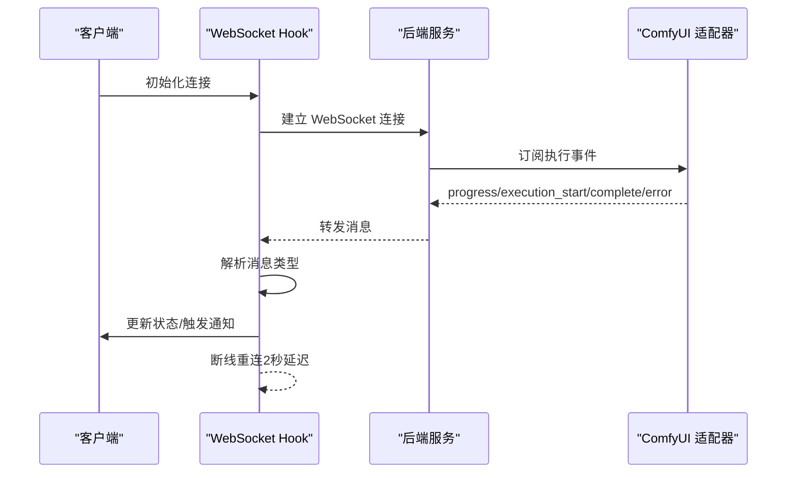
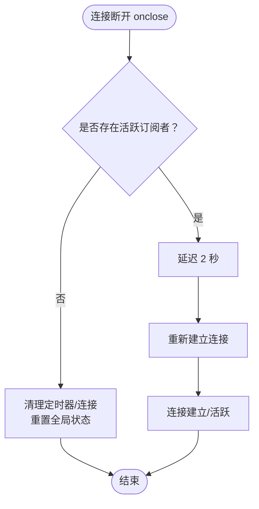
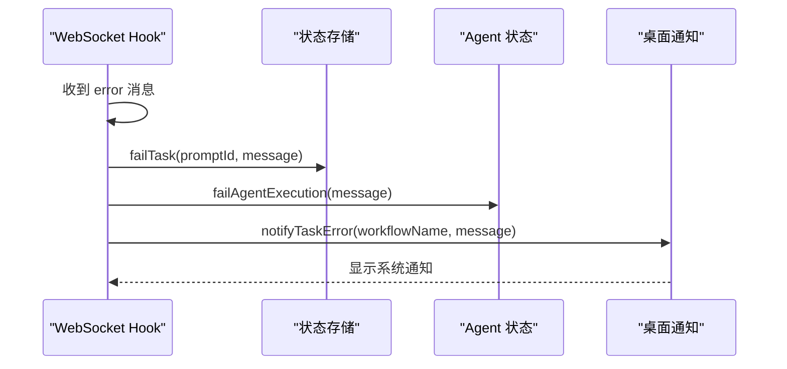
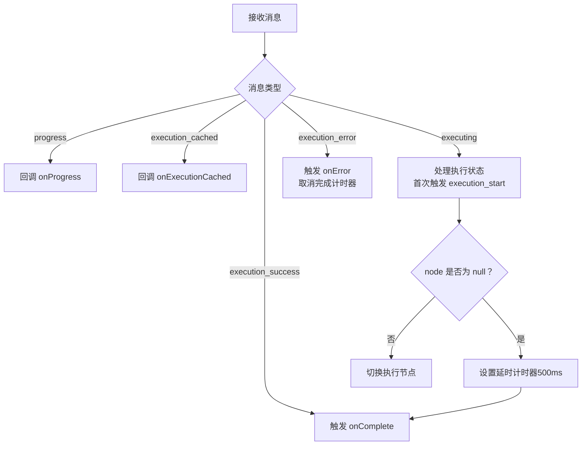
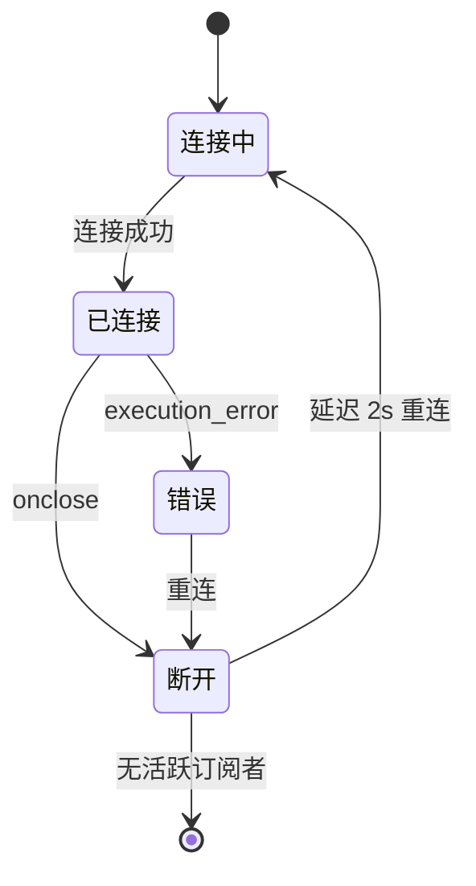
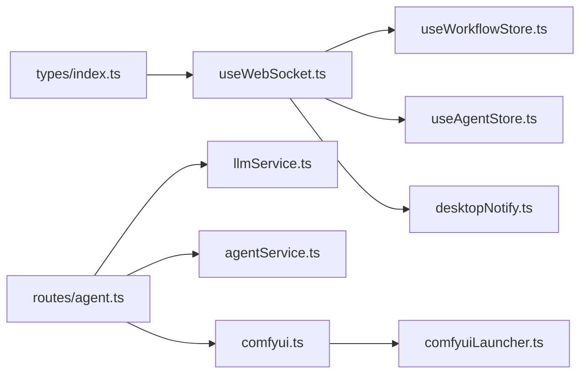

# 错误处理与重连机制

<cite>
**本文档引用的文件**
- [client/src/hooks/useWebSocket.ts](file://client/src/hooks/useWebSocket.ts)
- [client/src/types/index.ts](file://client/src/types/index.ts)
- [client/src/services/desktopNotify.ts](file://client/src/services/desktopNotify.ts)
- [client/src/hooks/useWorkflowStore.ts](file://client/src/hooks/useWorkflowStore.ts)
- [client/src/hooks/useAgentStore.ts](file://client/src/hooks/useAgentStore.ts)
- [server/src/services/comfyui.ts](file://server/src/services/comfyui.ts)
- [server/src/services/comfyuiLauncher.ts](file://server/src/services/comfyuiLauncher.ts)
- [server/src/services/agentService.ts](file://server/src/services/agentService.ts)
- [server/src/services/llmService.ts](file://server/src/services/llmService.ts)
- [server/src/routes/agent.ts](file://server/src/routes/agent.ts)
</cite>

## 目录
1. [简介](#简介)
2. [项目结构](#项目结构)
3. [核心组件](#核心组件)
4. [架构概览](#架构概览)
5. [详细组件分析](#详细组件分析)
6. [依赖关系分析](#依赖关系分析)
7. [性能考虑](#性能考虑)
8. [故障排查指南](#故障排查指南)
9. [结论](#结论)

## 简介
本文件聚焦于系统的错误处理与重连机制，覆盖以下关键领域：
- 连接异常处理策略：网络中断、服务器关闭、连接超时的检测与响应
- 错误事件处理：execution_error 类型消息的解析、错误信息提取与错误状态传播
- 重连机制实现：自动重连策略、重连间隔设置、最大重试次数配置
- 错误恢复流程：状态清理、资源释放与重新初始化过程
- 错误处理示例：不同类型错误的处理方式与用户反馈机制
- 错误监控与日志记录：帮助开发者诊断与解决通信故障

## 项目结构
系统采用前后端分离架构，前端通过 WebSocket 与后端通信，后端负责与 ComfyUI 交互并转发进度与错误事件。

**图表来源**
- [client/src/hooks/useWebSocket.ts:1-277](file://client/src/hooks/useWebSocket.ts#L1-L277)
- [client/src/types/index.ts:1-76](file://client/src/types/index.ts#L1-L76)
- [client/src/services/desktopNotify.ts:1-77](file://client/src/services/desktopNotify.ts#L1-L77)
- [client/src/hooks/useWorkflowStore.ts:1-923](file://client/src/hooks/useWorkflowStore.ts#L1-L923)
- [client/src/hooks/useAgentStore.ts:1-337](file://client/src/hooks/useAgentStore.ts#L1-L337)
- [server/src/routes/agent.ts:1-2167](file://server/src/routes/agent.ts#L1-L2167)
- [server/src/services/llmService.ts:1-938](file://server/src/services/llmService.ts#L1-L938)
- [server/src/services/agentService.ts:1-126](file://server/src/services/agentService.ts#L1-L126)
- [server/src/services/comfyui.ts:1-472](file://server/src/services/comfyui.ts#L1-L472)
- [server/src/services/comfyuiLauncher.ts:1-131](file://server/src/services/comfyuiLauncher.ts#L1-L131)

**章节来源**
- [client/src/hooks/useWebSocket.ts:1-277](file://client/src/hooks/useWebSocket.ts#L1-L277)
- [server/src/services/comfyui.ts:1-472](file://server/src/services/comfyui.ts#L1-L472)

## 核心组件
- 前端 WebSocket 管理：统一的 WebSocket 连接生命周期管理、消息解析与错误传播
- 状态存储：任务状态、进度与错误信息的本地持久化与 UI 同步
- 桌面通知：任务完成/失败的系统级通知
- 后端 ComfyUI 适配器：进度、执行开始、完成与错误事件的解析与回调
- ComfyUI 启动器：服务可用性检测与自动启动

**章节来源**
- [client/src/hooks/useWebSocket.ts:1-277](file://client/src/hooks/useWebSocket.ts#L1-L277)
- [client/src/hooks/useWorkflowStore.ts:1-923](file://client/src/hooks/useWorkflowStore.ts#L1-L923)
- [client/src/hooks/useAgentStore.ts:1-337](file://client/src/hooks/useAgentStore.ts#L1-L337)
- [client/src/services/desktopNotify.ts:1-77](file://client/src/services/desktopNotify.ts#L1-L77)
- [server/src/services/comfyui.ts:1-472](file://server/src/services/comfyui.ts#L1-L472)
- [server/src/services/comfyuiLauncher.ts:1-131](file://server/src/services/comfyuiLauncher.ts#L1-L131)

## 架构概览
前端通过 WebSocket 与后端建立长连接，后端将 ComfyUI 的执行事件（进度、开始、完成、错误）转发至前端。前端根据消息类型更新状态并触发用户通知。

**图表来源**
- [client/src/hooks/useWebSocket.ts:29-277](file://client/src/hooks/useWebSocket.ts#L29-L277)
- [server/src/services/comfyui.ts:265-375](file://server/src/services/comfyui.ts#L265-L375)

## 详细组件分析

### 前端 WebSocket 错误处理与重连
- 连接状态管理：单例 WebSocket 实例，连接计数控制生命周期
- 消息解析：统一解析 WSMessage 类型，分别处理 connected、execution_start、progress、complete、error
- 错误传播：error 类型消息触发任务失败状态与桌面通知
- 重连策略：onclose 触发，仅在存在活跃订阅者时重连，延迟 2 秒
- 资源清理：卸载时清除定时器、关闭连接并重置全局状态

**图表来源**
- [client/src/hooks/useWebSocket.ts:232-248](file://client/src/hooks/useWebSocket.ts#L232-L248)

**章节来源**
- [client/src/hooks/useWebSocket.ts:1-277](file://client/src/hooks/useWebSocket.ts#L1-L277)
- [client/src/types/index.ts:39-76](file://client/src/types/index.ts#L39-L76)

### 错误事件处理与状态传播
- execution_error 类型消息解析：从消息中提取错误信息
- 任务状态更新：failTask/failAgentExecution 将任务标记为 error 并保存错误信息
- 用户反馈：触发桌面通知（任务失败），包含工作流名称与错误消息
- Agent 执行：支持批量模式下的错误传播与通知

**图表来源**
- [client/src/hooks/useWebSocket.ts:150-158](file://client/src/hooks/useWebSocket.ts#L150-L158)
- [client/src/hooks/useWebSocket.ts:215-223](file://client/src/hooks/useWebSocket.ts#L215-L223)
- [client/src/hooks/useWorkflowStore.ts:682-703](file://client/src/hooks/useWorkflowStore.ts#L682-L703)
- [client/src/hooks/useAgentStore.ts:312-315](file://client/src/hooks/useAgentStore.ts#L312-L315)
- [client/src/services/desktopNotify.ts:69-77](file://client/src/services/desktopNotify.ts#L69-L77)

**章节来源**
- [client/src/hooks/useWebSocket.ts:150-223](file://client/src/hooks/useWebSocket.ts#L150-L223)
- [client/src/hooks/useWorkflowStore.ts:682-703](file://client/src/hooks/useWorkflowStore.ts#L682-L703)
- [client/src/hooks/useAgentStore.ts:312-315](file://client/src/hooks/useAgentStore.ts#L312-L315)
- [client/src/services/desktopNotify.ts:69-77](file://client/src/services/desktopNotify.ts#L69-L77)

### 后端 ComfyUI 错误事件处理
- 执行完成信号：execution_success 优先于 executing:null，避免“卡片完成但输出为空”的问题
- 错误事件：execution_error 触发回调 onError，取消正在进行的完成计时器
- 进度与阶段：progress 与 execution_cached 消息用于阶段化进度追踪与缓存节点统计

**图表来源**
- [server/src/services/comfyui.ts:304-368](file://server/src/services/comfyui.ts#L304-L368)

**章节来源**
- [server/src/services/comfyui.ts:265-375](file://server/src/services/comfyui.ts#L265-L375)

### 重连机制实现
- 自动重连策略：连接断开后延迟 2 秒重连，仅在存在活跃订阅者时触发
- 重连间隔设置：固定 2000ms 延迟
- 最大重试次数：未设置上限，持续重连直至连接成功或无活跃订阅者
- 资源释放：卸载组件时清理定时器与连接，避免内存泄漏

**章节来源**
- [client/src/hooks/useWebSocket.ts:232-268](file://client/src/hooks/useWebSocket.ts#L232-L268)

### 错误恢复流程
- 状态清理：failTask/failAgentExecution 将任务状态置为 error，清空或重置相关进度
- 资源释放：关闭 WebSocket 连接，清理定时器
- 重新初始化：重新建立连接后，前端根据 clientId 与任务状态重建 UI
- 服务可用性：后端通过 ComfyUI 启动器检测服务状态并在需要时自动启动

**图表来源**
- [client/src/hooks/useWebSocket.ts:232-248](file://client/src/hooks/useWebSocket.ts#L232-L248)
- [server/src/services/comfyui.ts:356-364](file://server/src/services/comfyui.ts#L356-L364)

**章节来源**
- [client/src/hooks/useWorkflowStore.ts:682-703](file://client/src/hooks/useWorkflowStore.ts#L682-L703)
- [client/src/hooks/useAgentStore.ts:312-315](file://client/src/hooks/useAgentStore.ts#L312-L315)
- [server/src/services/comfyuiLauncher.ts:101-131](file://server/src/services/comfyuiLauncher.ts#L101-L131)

### 错误处理示例与用户反馈
- 网络中断：前端 onclose 触发，2 秒后自动重连；期间任务状态保持 error
- 服务器关闭：ComfyUI 服务不可达时，后端启动器检测失败，前端重连失败后持续重试
- 连接超时：WebSocket onerror 触发，随后 onclose 触发重连逻辑
- 用户反馈：桌面通知显示任务失败详情，包含工作流名称与错误消息

**章节来源**
- [client/src/hooks/useWebSocket.ts:246-248](file://client/src/hooks/useWebSocket.ts#L246-L248)
- [client/src/services/desktopNotify.ts:69-77](file://client/src/services/desktopNotify.ts#L69-L77)

### 错误监控与日志记录
- 前端日志：控制台输出连接状态与错误信息
- 后端日志：ComfyUI 适配器记录错误消息与异常信息
- LLM 服务：API 错误时输出状态码与错误文本
- 生成日志：后端记录生成记录与收藏状态，便于审计与回溯

**章节来源**
- [server/src/services/comfyui.ts:370-372](file://server/src/services/comfyui.ts#L370-L372)
- [server/src/services/llmService.ts:77-81](file://server/src/services/llmService.ts#L77-L81)
- [server/src/services/agentService.ts:52-72](file://server/src/services/agentService.ts#L52-L72)

## 依赖关系分析
- 前端依赖：WebSocket Hook 依赖状态存储与桌面通知；类型定义统一消息结构
- 后端依赖：路由层依赖 LLM 服务与代理服务；代理服务依赖 ComfyUI 适配器；ComfyUI 适配器依赖启动器

**图表来源**
- [client/src/types/index.ts:1-76](file://client/src/types/index.ts#L1-L76)
- [client/src/hooks/useWebSocket.ts:1-277](file://client/src/hooks/useWebSocket.ts#L1-L277)
- [client/src/hooks/useWorkflowStore.ts:1-923](file://client/src/hooks/useWorkflowStore.ts#L1-L923)
- [client/src/hooks/useAgentStore.ts:1-337](file://client/src/hooks/useAgentStore.ts#L1-L337)
- [client/src/services/desktopNotify.ts:1-77](file://client/src/services/desktopNotify.ts#L1-L77)
- [server/src/routes/agent.ts:1-2167](file://server/src/routes/agent.ts#L1-L2167)
- [server/src/services/llmService.ts:1-938](file://server/src/services/llmService.ts#L1-L938)
- [server/src/services/agentService.ts:1-126](file://server/src/services/agentService.ts#L1-L126)
- [server/src/services/comfyui.ts:1-472](file://server/src/services/comfyui.ts#L1-L472)
- [server/src/services/comfyuiLauncher.ts:1-131](file://server/src/services/comfyuiLauncher.ts#L1-L131)

**章节来源**
- [client/src/hooks/useWebSocket.ts:1-277](file://client/src/hooks/useWebSocket.ts#L1-L277)
- [server/src/services/comfyui.ts:1-472](file://server/src/services/comfyui.ts#L1-L472)

## 性能考虑
- 连接池与单例：前端使用单例 WebSocket，减少资源占用
- 延迟重连：2 秒延迟避免频繁重连导致的资源浪费
- 事件去抖：ComfyUI 适配器使用计时器与集合避免重复触发与竞态
- 通知节流：桌面通知按标签合并，避免过多通知堆积

## 故障排查指南
- 连接无法建立：检查后端服务状态与防火墙设置；确认 WebSocket URL 与协议
- 重连无效：确认是否存在活跃订阅者；检查控制台是否有 onerror/onclose 触发
- 错误未传播：检查消息类型是否为 error；确认状态存储与通知模块是否正确调用
- 服务不可用：使用启动器检测服务状态并尝试自动启动
- 日志定位：查看前端控制台与后端日志，定位具体错误来源

**章节来源**
- [client/src/hooks/useWebSocket.ts:232-248](file://client/src/hooks/useWebSocket.ts#L232-L248)
- [server/src/services/comfyui.ts:370-372](file://server/src/services/comfyui.ts#L370-L372)
- [server/src/services/comfyuiLauncher.ts:24-53](file://server/src/services/comfyuiLauncher.ts#L24-L53)

## 结论
本系统通过统一的 WebSocket 管理、明确的错误事件处理与自动重连机制，实现了稳定的前端与后端通信。配合状态存储与桌面通知，用户能够及时获知任务状态变化。建议在生产环境中增加最大重试次数与指数退避策略，并完善错误监控与告警机制，以进一步提升系统的鲁棒性与可观测性。