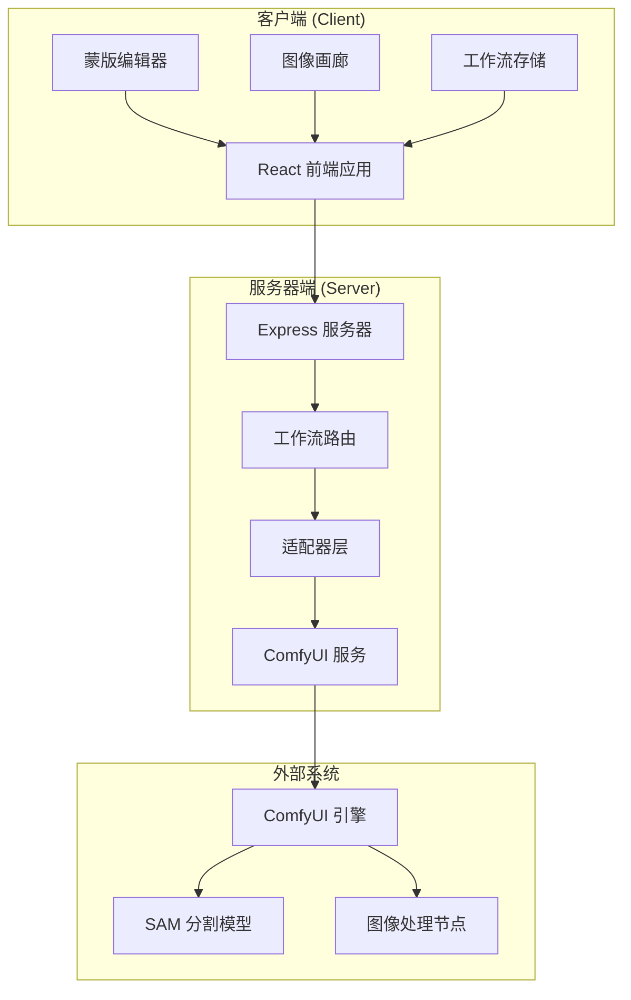
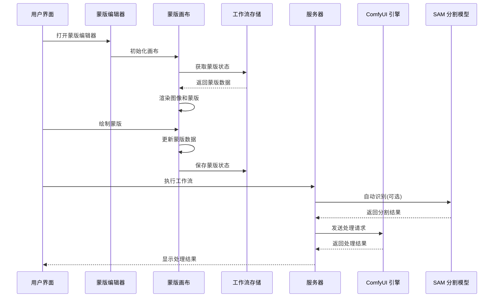
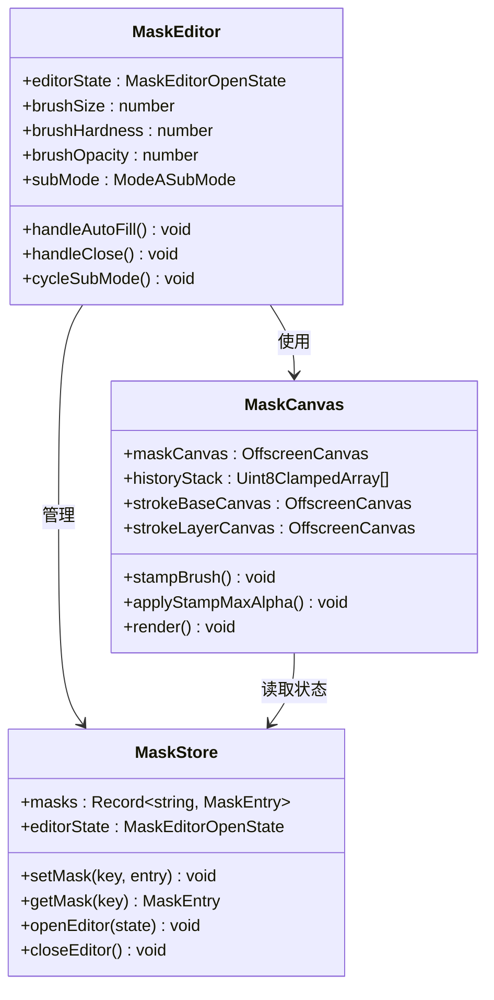
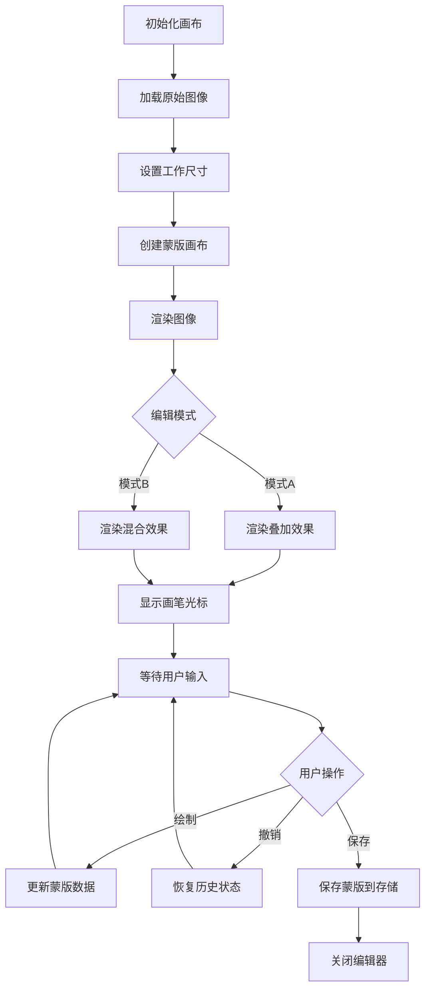
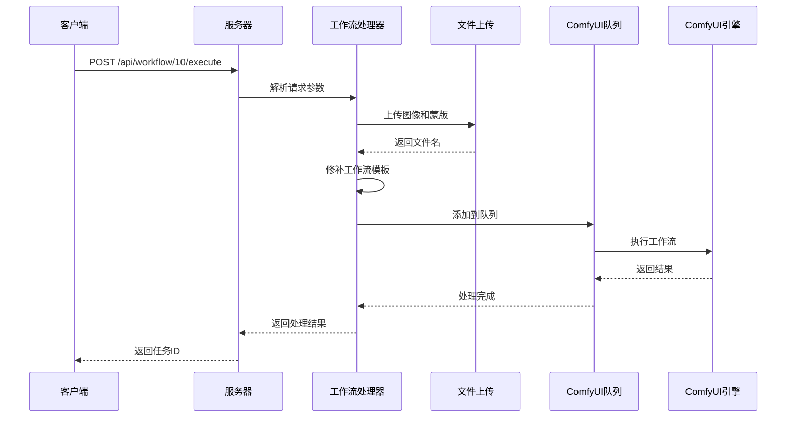
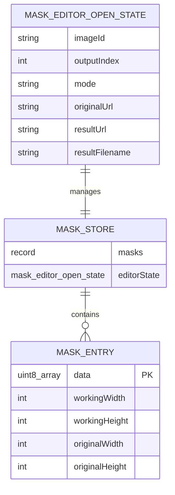
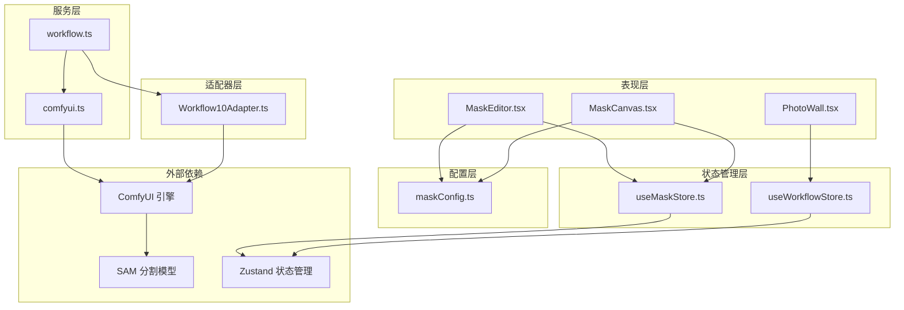

# 工作流10 区域编辑

<cite>
**本文档引用的文件**
- [Workflow10Adapter.ts](file://server/src/adapters/Workflow10Adapter.ts)
- [workflow.ts](file://server/src/routers/workflow.ts)
- [MaskEditor.tsx](file://client/src/components/MaskEditor.tsx)
- [MaskCanvas.tsx](file://client/src/components/MaskCanvas.tsx)
- [useMaskStore.ts](file://client/src/hooks/useMaskStore.ts)
- [maskConfig.ts](file://client/src/config/maskConfig.ts)
- [useWorkflowStore.ts](file://client/src/hooks/useWorkflowStore.ts)
- [PhotoWall.tsx](file://client/src/components/PhotoWall.tsx)
- [comfyui.ts](file://server/src/services/comfyui.ts)
- [Pix2Real-解除装备Fixed.json](file://ComfyUI_API/Pix2Real-解除装备Fixed.json)
- [Pix2Real-自动识别Fixed.json](file://ComfyUI_API/Pix2Real-自动识别Fixed.json)
</cite>

## 目录
1. [简介](#简介)
2. [项目结构](#项目结构)
3. [核心组件](#核心组件)
4. [架构概览](#架构概览)
5. [详细组件分析](#详细组件分析)
6. [依赖关系分析](#依赖关系分析)
7. [性能考虑](#性能考虑)
8. [故障排除指南](#故障排除指南)
9. [结论](#结论)

## 简介

工作流10"区域编辑"是CorineKit Pix2Real项目中的一个重要功能模块，专门用于对图像的特定区域进行精确编辑和处理。该工作流结合了先进的蒙版编辑技术和AI图像处理能力，允许用户通过可视化的方式精确控制图像处理的范围和效果。

该系统采用前后端分离的架构设计，前端提供直观的蒙版编辑界面，后端通过ComfyUI引擎执行复杂的图像处理任务。工作流10特别适用于需要精细控制图像编辑场景的应用，如人物抠图、背景替换、局部修复等专业图像处理需求。

## 项目结构

项目采用模块化的组织方式，主要分为客户端和服务器端两个部分：

**图表来源**
- [workflow.ts:1-50](file://server/src/routers/workflow.ts#L1-L50)
- [useWorkflowStore.ts:7-19](file://client/src/hooks/useWorkflowStore.ts#L7-L19)

**章节来源**
- [workflow.ts:1-50](file://server/src/routers/workflow.ts#L1-L50)
- [useWorkflowStore.ts:7-19](file://client/src/hooks/useWorkflowStore.ts#L7-L19)

## 核心组件

工作流10系统由多个核心组件构成，每个组件都有明确的职责和功能：

### 服务器端组件

1. **Workflow10Adapter** - 工作流适配器，定义工作流的基本属性和行为
2. **工作流路由处理器** - 处理HTTP请求和响应
3. **ComfyUI 服务层** - 与ComfyUI引擎通信

### 客户端组件

1. **蒙版编辑器** - 主要的用户交互界面
2. **蒙版画布** - 图形渲染和用户输入处理
3. **蒙版存储** - 状态管理和数据持久化
4. **工作流存储** - 应用状态管理

**章节来源**
- [Workflow10Adapter.ts:4-14](file://server/src/adapters/Workflow10Adapter.ts#L4-L14)
- [useMaskStore.ts:4-30](file://client/src/hooks/useMaskStore.ts#L4-L30)

## 架构概览

工作流10采用了现代化的前后端分离架构，实现了高度解耦的设计：

**图表来源**
- [MaskEditor.tsx:141-188](file://client/src/components/MaskEditor.tsx#L141-L188)
- [workflow.ts:96-146](file://server/src/routers/workflow.ts#L96-L146)

## 详细组件分析

### 蒙版编辑器组件

蒙版编辑器是工作流10的核心用户界面组件，提供了丰富的编辑工具和功能：

**图表来源**
- [MaskEditor.tsx:141-188](file://client/src/components/MaskEditor.tsx#L141-L188)
- [MaskCanvas.tsx:39-54](file://client/src/components/MaskCanvas.tsx#L39-L54)
- [useMaskStore.ts:21-30](file://client/src/hooks/useMaskStore.ts#L21-L30)

#### 蒙版编辑器功能特性

1. **多种编辑模式** - 支持暗色叠加、高亮显示、红色叠加三种模式
2. **智能笔刷系统** - 非累积软笔刷，防止边缘硬化问题
3. **历史记录管理** - 支持撤销和重做操作
4. **自动识别功能** - 基于SAM模型的智能蒙版生成
5. **键盘快捷键支持** - 提升编辑效率

#### 蒙版画布渲染流程

**图表来源**
- [MaskCanvas.tsx:403-454](file://client/src/components/MaskCanvas.tsx#L403-L454)
- [MaskCanvas.tsx:306-401](file://client/src/components/MaskCanvas.tsx#L306-L401)

**章节来源**
- [MaskEditor.tsx:141-375](file://client/src/components/MaskEditor.tsx#L141-L375)
- [MaskCanvas.tsx:39-677](file://client/src/components/MaskCanvas.tsx#L39-L677)

### 服务器端工作流处理

服务器端负责处理来自客户端的工作流请求，并与ComfyUI引擎进行交互：

**图表来源**
- [workflow.ts:96-146](file://server/src/routers/workflow.ts#L96-L146)

#### 工作流执行配置

工作流10使用与"解除装备"工作流相同的底层处理逻辑，但具有特定的配置要求：

1. **图像和蒙版上传** - 同时需要原始图像和对应的蒙版
2. **提示词处理** - 用户提供的提示词会完全替换默认提示词
3. **后位姿态控制** - 支持backPose参数控制
4. **客户端ID管理** - 确保任务跟踪的准确性

**章节来源**
- [workflow.ts:96-146](file://server/src/routers/workflow.ts#L96-L146)
- [Pix2Real-解除装备Fixed.json:1-200](file://ComfyUI_API/Pix2Real-解除装备Fixed.json#L1-L200)

### 蒙版存储和管理

系统使用Zustand状态管理库来处理蒙版数据的存储和同步：

**图表来源**
- [useMaskStore.ts:4-30](file://client/src/hooks/useMaskStore.ts#L4-L30)

#### 蒙版数据结构

蒙版数据采用RGBA像素格式存储，支持以下特性：

1. **工作尺寸适配** - 自动调整到最大2048像素的工作尺寸
2. **历史版本管理** - 支持最多30步的历史记录
3. **跨模式兼容** - 支持模式A和模式B的不同存储需求
4. **内存优化** - 使用Uint8ClampedArray提高内存效率

**章节来源**
- [useMaskStore.ts:4-51](file://client/src/hooks/useMaskStore.ts#L4-L51)
- [maskConfig.ts:3-21](file://client/src/config/maskConfig.ts#L3-L21)

## 依赖关系分析

工作流10系统的依赖关系体现了清晰的分层架构：

**图表来源**
- [workflow.ts:1-25](file://server/src/routers/workflow.ts#L1-L25)
- [useMaskStore.ts:1-51](file://client/src/hooks/useMaskStore.ts#L1-L51)

### 关键依赖关系

1. **前端依赖** - React组件依赖Zustand进行状态管理
2. **后端依赖** - Express路由依赖ComfyUI服务层
3. **模型依赖** - SAM分割模型提供智能蒙版生成
4. **存储依赖** - 内存存储确保快速访问和低延迟

**章节来源**
- [workflow.ts:1-25](file://server/src/routers/workflow.ts#L1-L25)
- [comfyui.ts:1-25](file://server/src/services/comfyui.ts#L1-L25)

## 性能考虑

工作流10系统在设计时充分考虑了性能优化：

### 前端性能优化

1. **离屏画布渲染** - 使用OffscreenCanvas避免主线程阻塞
2. **增量更新策略** - 仅在必要时重新渲染画布
3. **内存管理** - 及时清理图像对象URL引用
4. **事件处理优化** - 使用防抖和节流技术

### 后端性能优化

1. **异步处理** - 所有长时间运行的操作都是异步的
2. **连接池管理** - 有效管理ComfyUI连接
3. **缓存策略** - 智能缓存常用资源
4. **错误处理** - 容错机制确保系统稳定性

## 故障排除指南

### 常见问题及解决方案

#### 蒙版编辑器问题

1. **画布无响应**
   - 检查浏览器是否支持OffscreenCanvas
   - 确认图像尺寸不超过限制
   - 验证鼠标事件监听是否正常

2. **蒙版数据丢失**
   - 确认Zustand存储是否正常工作
   - 检查页面刷新后的状态恢复
   - 验证蒙版数据序列化/反序列化

#### 工作流执行问题

1. **ComfyUI连接失败**
   - 检查ComfyUI服务是否启动
   - 验证网络连接和防火墙设置
   - 确认端口8188是否被占用

2. **蒙版上传失败**
   - 检查文件格式和大小限制
   - 验证SAM模型是否正确加载
   - 确认磁盘空间充足

**章节来源**
- [workflow.ts:96-146](file://server/src/routers/workflow.ts#L96-L146)
- [comfyui.ts:47-60](file://server/src/services/comfyui.ts#L47-L60)

## 结论

工作流10"区域编辑"系统是一个功能完整、架构清晰的图像处理解决方案。它成功地将复杂的AI图像处理技术与直观的用户界面相结合，为用户提供了强大的图像编辑能力。

系统的主要优势包括：

1. **用户友好性** - 直观的蒙版编辑界面和丰富的工具集
2. **技术先进性** - 基于最新的SAM分割技术和ComfyUI引擎
3. **性能优化** - 采用多种优化策略确保流畅的用户体验
4. **可扩展性** - 模块化设计便于功能扩展和维护

未来可以考虑的功能改进包括：

1. **蒙版持久化** - 实现蒙版数据的长期存储
2. **多用户支持** - 添加用户认证和权限管理
3. **高级编辑工具** - 增加更多专业的图像编辑功能
4. **性能监控** - 添加详细的性能指标和监控功能

该系统为图像处理领域提供了一个优秀的参考实现，展示了如何将前沿技术与用户体验设计完美结合。