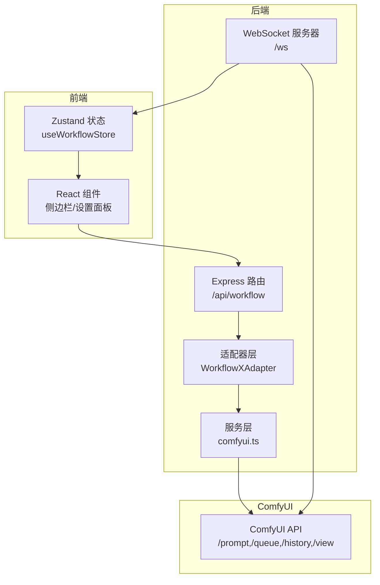
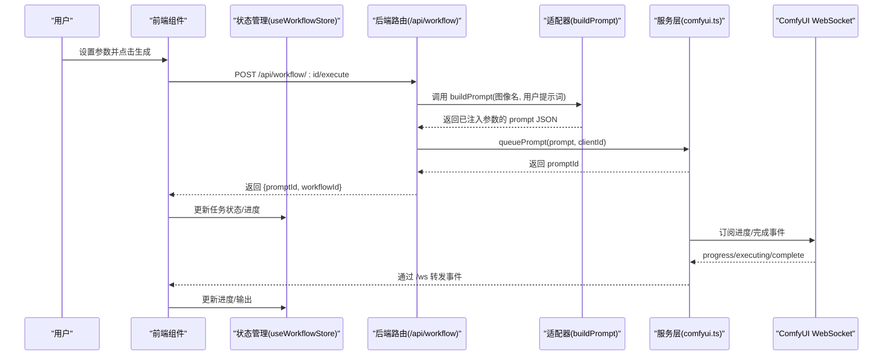
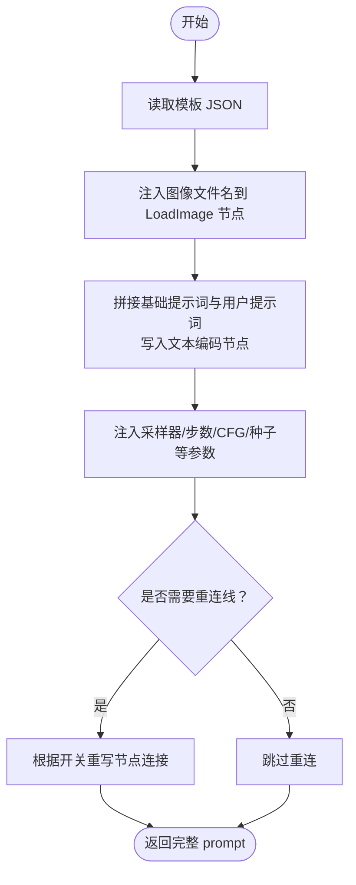
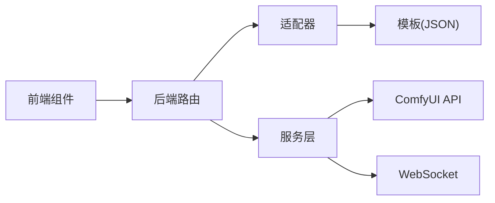

# 工作流模板管理

<cite>
**本文档引用的文件**
- [README.md](file://README.md)
- [server/src/index.ts](file://server/src/index.ts)
- [server/src/services/comfyui.ts](file://server/src/services/comfyui.ts)
- [server/src/routes/workflow.ts](file://server/src/routes/workflow.ts)
- [server/src/adapters/index.ts](file://server/src/adapters/index.ts)
- [server/src/adapters/BaseAdapter.ts](file://server/src/adapters/BaseAdapter.ts)
- [server/src/adapters/Workflow0Adapter.ts](file://server/src/adapters/Workflow0Adapter.ts)
- [server/src/types/index.ts](file://server/src/types/index.ts)
- [client/src/hooks/useWorkflowStore.ts](file://client/src/hooks/useWorkflowStore.ts)
- [client/src/components/Workflow0SettingsPanel.tsx](file://client/src/components/Workflow0SettingsPanel.tsx)
- [client/src/components/Text2ImgSidebar.tsx](file://client/src/components/Text2ImgSidebar.tsx)
- [client/src/components/ZITSidebar.tsx](file://client/src/components/ZITSidebar.tsx)
- [client/src/types/index.ts](file://client/src/types/index.ts)
- [ComfyUI_API/Pix2Real-释放内存.json](file://ComfyUI_API/Pix2Real-释放内存.json)
- [ComfyUI_API/Pix2Real-二次元生成.json](file://ComfyUI_API/Pix2Real-二次元生成.json)
</cite>

## 目录
1. [简介](#简介)
2. [项目结构](#项目结构)
3. [核心组件](#核心组件)
4. [架构总览](#架构总览)
5. [详细组件分析](#详细组件分析)
6. [依赖关系分析](#依赖关系分析)
7. [性能考虑](#性能考虑)
8. [故障排查指南](#故障排查指南)
9. [结论](#结论)
10. [附录](#附录)

## 简介
本系统是一个基于 ComfyUI 的本地 Web 工作流模板管理系统，支持多类工作流（如二次元转真人、真人精修、精修放大、视频生成与放大、换脸、提示词反推与助手等），通过 JSON 模板驱动，结合适配器模式对模板进行参数化与动态替换，实现批处理、实时进度回传与会话持久化。系统采用前后端分离：前端使用 React + Zustand 管理状态与任务生命周期，后端使用 Express + WebSocket 与 ComfyUI 进行通信。

## 项目结构
- 后端（server）
  - 路由层：/api/workflow 负责工作流执行、队列管理、模型列表查询、内存释放等
  - 服务层：comfyui.ts 提供上传、入队、历史查询、WebSocket 连接、系统统计等
  - 适配器层：每个工作流一个适配器，负责加载模板、注入参数、构建最终 prompt
  - 类型定义：统一前后端事件与数据结构
- 前端（client）
  - 状态管理：useWorkflowStore 维护每张标签页的图片、提示词、任务状态、输出索引等
  - 组件：各工作流侧边栏负责参数收集与调用后端接口
  - 类型定义：WebSocket 消息、任务状态、图片项等
- 模板（ComfyUI_API）
  - 多个 JSON 模板文件，对应不同工作流；部分模板用于特殊流程（如释放内存）

**图表来源**
- [server/src/index.ts:62-219](file://server/src/index.ts#L62-L219)
- [server/src/routes/workflow.ts:1-862](file://server/src/routes/workflow.ts#L1-L862)
- [server/src/services/comfyui.ts:1-285](file://server/src/services/comfyui.ts#L1-L285)
- [client/src/hooks/useWorkflowStore.ts:1-645](file://client/src/hooks/useWorkflowStore.ts#L1-L645)

**章节来源**
- [README.md:41-79](file://README.md#L41-L79)
- [server/src/index.ts:1-228](file://server/src/index.ts#L1-L228)
- [server/src/routes/workflow.ts:1-862](file://server/src/routes/workflow.ts#L1-L862)

## 核心组件
- 适配器（WorkflowAdapter）
  - 定义：每个工作流一个适配器，暴露 id、name、是否需要提示词、基础提示词、输出目录、buildPrompt 方法
  - 作用：加载模板 JSON，按需注入输入参数（如图像名、提示词、采样器、尺寸、种子等），返回可直接入队的 prompt 对象
- 路由处理器
  - 提供工作流列表、执行单图/批量、取消队列、优先级调整、系统统计、打开输出目录、导出混合图等功能
  - 部分工作流（如 5、7、8、9）使用专用模板路径与参数映射
- 服务层
  - 封装 ComfyUI 的 HTTP 与 WebSocket 接口，提供上传、入队、历史查询、系统统计、队列优先级调整等能力
- 前端状态与组件
  - useWorkflowStore 统一管理任务状态、进度、输出选择、会话恢复
  - 各工作流侧边栏组件负责参数收集、调用后端接口、注册 WebSocket 事件

**章节来源**
- [server/src/adapters/index.ts:1-31](file://server/src/adapters/index.ts#L1-L31)
- [server/src/adapters/Workflow0Adapter.ts:1-35](file://server/src/adapters/Workflow0Adapter.ts#L1-L35)
- [server/src/routes/workflow.ts:1-862](file://server/src/routes/workflow.ts#L1-L862)
- [server/src/services/comfyui.ts:1-285](file://server/src/services/comfyui.ts#L1-L285)
- [client/src/hooks/useWorkflowStore.ts:1-645](file://client/src/hooks/useWorkflowStore.ts#L1-L645)

## 架构总览
系统通过“模板 + 适配器”的方式实现工作流的标准化与可扩展性。前端侧边栏收集用户参数，后端适配器根据模板进行参数注入，随后通过服务层将 prompt 入队到 ComfyUI。WebSocket 实时转发进度与完成事件，完成后端将输出下载到会话目录并通知前端更新 UI。

**图表来源**
- [server/src/routes/workflow.ts:407-455](file://server/src/routes/workflow.ts#L407-L455)
- [server/src/services/comfyui.ts:47-60](file://server/src/services/comfyui.ts#L47-L60)
- [server/src/index.ts:73-219](file://server/src/index.ts#L73-L219)
- [client/src/hooks/useWorkflowStore.ts:377-476](file://client/src/hooks/useWorkflowStore.ts#L377-L476)

## 详细组件分析

### 适配器与模板参数系统
- 模板结构规范
  - 每个工作流以 JSON 文件形式存在，键为节点 ID，值包含 class_type、inputs、连接关系等
  - 典型节点类型：CheckpointLoaderSimple、EmptyLatentImage、KSampler、CLIPTextEncode、VAEDecode、SaveImage 等
  - 连接规则：inputs 中的数组形如 ["上游节点ID", 输出通道索引]，表示数据流连接
- 参数注入策略
  - 图像输入：将上传后的文件名写入对应 LoadImage 节点
  - 提示词：将基础提示词与用户输入拼接后写入文本编码节点
  - 采样器与参数：随机种子、步数、CFG、采样器名称、调度器等
  - 特殊工作流：如 0 号工作流支持 qwen/klein 两种绘制模型；7 号文本生图支持自定义输出文件名前缀
- 占位符与动态替换
  - 模板中不直接包含占位符语法；参数替换通过在运行时解析模板 JSON 并修改特定节点的 inputs 字段实现
  - 例如：将节点 "15" 的 image 字段设为上传后的文件名，将节点 "17" 的 prompt 字段设为基础提示词与用户提示词拼接结果
- 版本与兼容性
  - 代码通过适配器封装模板差异，新增工作流只需新增适配器，避免修改通用路由逻辑
  - 对于需要特殊连接的场景（如 LoRA/UNet/Shift 的链路切换），在路由层进行条件分支与连线重写

**图表来源**
- [server/src/adapters/Workflow0Adapter.ts:16-34](file://server/src/adapters/Workflow0Adapter.ts#L16-L34)
- [server/src/routes/workflow.ts:181-261](file://server/src/routes/workflow.ts#L181-L261)

**章节来源**
- [server/src/adapters/Workflow0Adapter.ts:1-35](file://server/src/adapters/Workflow0Adapter.ts#L1-L35)
- [server/src/routes/workflow.ts:94-149](file://server/src/routes/workflow.ts#L94-L149)
- [server/src/routes/workflow.ts:181-261](file://server/src/routes/workflow.ts#L181-L261)

### 工作流分类与模板组织
- 核心工作流模板
  - 二次元转真人、真人精修、精修放大、快速生成视频、视频放大
  - 通过适配器与通用路由实现统一入口
- 专业功能模板
  - 文本生图（7）、ZIT 快出（9）、提示词助手、提示词反推（Qwen/Florence/WD-14）、换脸、解除装备、自动识别等
  - 每个功能独立路由，参数注入更复杂，涉及多节点重连与输出路径定制
- 自定义模板
  - 通过新增适配器或路由处理函数扩展，无需改动现有核心逻辑

**章节来源**
- [README.md:64-72](file://README.md#L64-L72)
- [server/src/adapters/index.ts:1-31](file://server/src/adapters/index.ts#L1-L31)
- [server/src/routes/workflow.ts:1-862](file://server/src/routes/workflow.ts#L1-L862)

### 加载机制、缓存策略与性能优化
- 模板加载
  - 适配器在 buildPrompt 时按需读取模板文件，解析为对象后注入参数
  - 部分路由直接读取固定模板路径（如释放内存、提示词助手、换脸等）
- 缓存策略
  - 后端未实现模板文件缓存；建议在生产环境对常用模板进行进程内缓存或使用文件系统缓存
- 性能优化
  - 批量执行：/api/workflow/:id/batch 支持一次提交多张图片，减少网络往返
  - 队列优先级：/api/workflow/queue/prioritize/:promptId 支持将指定任务置顶
  - WebSocket 事件缓冲：首次连接时可重放最近的 execution_start/progress 事件，避免漏消息
  - 前端状态去抖：进度更新在所有标签页广播，但仅在匹配 promptId 的任务上更新

**章节来源**
- [server/src/routes/workflow.ts:457-520](file://server/src/routes/workflow.ts#L457-L520)
- [server/src/routes/workflow.ts:571-579](file://server/src/routes/workflow.ts#L571-L579)
- [server/src/index.ts:83-90](file://server/src/index.ts#L83-L90)
- [client/src/hooks/useWorkflowStore.ts:421-442](file://client/src/hooks/useWorkflowStore.ts#L421-L442)

### 模板创建指南与参数设计原则
- 创建步骤
  - 在 ComfyUI 中设计好节点图，确保关键节点具备可配置的输入（图像、提示词、采样器、尺寸、种子等）
  - 导出为 JSON，确认节点 ID 与连接关系
  - 新增适配器：在适配器目录添加新文件，实现 buildPrompt，按需注入参数
  - 在路由层注册或复用通用执行逻辑，必要时增加专用路由处理
- 参数设计原则
  - 明确哪些节点需要动态替换（图像、提示词、采样器、尺寸、种子）
  - 对于可选链路（如 LoRA/UNet/Shift），提供开关参数并在路由层进行连接重写
  - 输出命名：为 SaveImage 节点提供可配置的 filename_prefix，便于批量管理
- 调试与测试
  - 使用 /api/workflow/:id/execute 单图测试，观察输出目录与 WebSocket 事件
  - 使用 /api/workflow/:id/batch 批量测试，验证参数数组与错误处理
  - 使用 /api/workflow/system-stats 查看 VRAM/内存占用，结合 /api/workflow/release-memory 释放资源

**章节来源**
- [server/src/adapters/Workflow0Adapter.ts:16-34](file://server/src/adapters/Workflow0Adapter.ts#L16-L34)
- [server/src/routes/workflow.ts:407-455](file://server/src/routes/workflow.ts#L407-L455)
- [server/src/routes/workflow.ts:457-520](file://server/src/routes/workflow.ts#L457-L520)
- [server/src/routes/workflow.ts:532-559](file://server/src/routes/workflow.ts#L532-L559)

### 模板示例与最佳实践
- 示例模板
  - 释放内存：通过 ImpactDummyInput 与 RAMCleanup/VRAMCleanup 节点组合，清理缓存与显存
  - 文本生图：包含 CheckpointLoaderSimple、EmptyLatentImage、KSampler、CLIPTextEncode、VAEDecode、SaveImage 等节点
- 最佳实践
  - 将基础提示词与用户提示词分离，允许用户覆盖但保留默认值
  - 为每类工作流提供默认参数（尺寸、步数、CFG、采样器），并在 UI 中提供预设
  - 对于长耗时任务（LLM/反推），使用内部 clientId 与轮询历史的方式获取结果，避免阻塞主流程

**章节来源**
- [ComfyUI_API/Pix2Real-释放内存.json:1-39](file://ComfyUI_API/Pix2Real-释放内存.json#L1-L39)
- [ComfyUI_API/Pix2Real-二次元生成.json:1-145](file://ComfyUI_API/Pix2Real-二次元生成.json#L1-L145)
- [server/src/routes/workflow.ts:674-744](file://server/src/routes/workflow.ts#L674-L744)

## 依赖关系分析
- 组件耦合
  - 路由层依赖适配器与服务层；适配器依赖模板文件；前端组件依赖状态管理与 WebSocket
- 外部依赖
  - ComfyUI API：/prompt、/queue、/history、/view、/system_stats
  - WebSocket：/ws?clientId=...，用于进度与完成事件
- 潜在循环依赖
  - 当前结构清晰，适配器仅读取模板并返回对象，无反向依赖

**图表来源**
- [server/src/routes/workflow.ts:1-862](file://server/src/routes/workflow.ts#L1-L862)
- [server/src/services/comfyui.ts:1-285](file://server/src/services/comfyui.ts#L1-L285)
- [server/src/adapters/index.ts:1-31](file://server/src/adapters/index.ts#L1-L31)

**章节来源**
- [server/src/types/index.ts:1-52](file://server/src/types/index.ts#L1-L52)
- [client/src/types/index.ts:1-58](file://client/src/types/index.ts#L1-L58)

## 性能考虑
- 网络与 I/O
  - 批量上传与入队可显著降低延迟；建议限制单次批量数量（当前路由限制为 50）
  - 对于大体积视频输入，注意上传大小限制与内存占用
- 内存与显存
  - 使用 /api/workflow/release-memory 清理缓存与显存，避免长时间运行导致的内存泄漏
  - 结合 /api/workflow/system-stats 监控 VRAM/内存使用
- 并发与队列
  - 利用 /api/workflow/queue/prioritize 将紧急任务置顶，提升响应速度
  - WebSocket 事件缓冲避免首包丢失，提高用户体验

[本节为通用指导，无需具体文件分析]

## 故障排查指南
- 常见问题
  - 无法连接 ComfyUI：检查服务地址与端口，确认 /prompt、/queue、/history、/view 是否可达
  - 任务无进度：确认 WebSocket 连接成功，检查 /ws 是否正常；查看事件缓冲是否生效
  - 输出为空：确认 SaveImage 节点的 images 输入已正确连接，且输出目录存在
  - 模型列表为空：检查 /object_info/* 接口是否可用，确认模型文件已加载
- 定位方法
  - 后端日志：关注 queuePrompt、getHistory、getImageBuffer 的错误信息
  - 前端日志：观察 WebSocket 注册与事件接收情况
  - 临时方案：使用 /api/workflow/release-memory 释放资源后重试

**章节来源**
- [server/src/services/comfyui.ts:47-83](file://server/src/services/comfyui.ts#L47-L83)
- [server/src/index.ts:73-219](file://server/src/index.ts#L73-L219)
- [server/src/routes/workflow.ts:542-559](file://server/src/routes/workflow.ts#L542-L559)

## 结论
本系统通过“模板 + 适配器 + 服务层 + 前端状态”的分层设计，实现了对多种工作流的统一管理与扩展。模板参数系统以节点 ID 为核心，通过运行时注入实现灵活替换；路由层与服务层提供了完善的执行、监控与资源管理能力。建议在生产环境中引入模板缓存、队列优先级策略与更细粒度的错误处理，以进一步提升稳定性与性能。

[本节为总结，无需具体文件分析]

## 附录
- 关键接口一览
  - GET /api/workflow：列出工作流
  - POST /api/workflow/:id/execute：单图执行
  - POST /api/workflow/:id/batch：批量执行
  - POST /api/workflow/:id/open-folder：打开输出目录
  - GET /api/workflow/models/*：查询模型列表
  - POST /api/workflow/release-memory：释放内存
  - GET /api/workflow/system-stats：系统统计
  - POST /api/workflow/queue/prioritize/:promptId：队列置顶
- 前端事件
  - /ws：connected、execution_start、progress、complete、error

**章节来源**
- [server/src/routes/workflow.ts:29-38](file://server/src/routes/workflow.ts#L29-L38)
- [server/src/routes/workflow.ts:407-623](file://server/src/routes/workflow.ts#L407-L623)
- [server/src/index.ts:73-219](file://server/src/index.ts#L73-L219)
- [client/src/types/index.ts:27-57](file://client/src/types/index.ts#L27-L57)