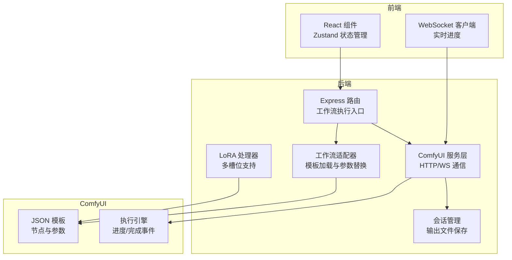
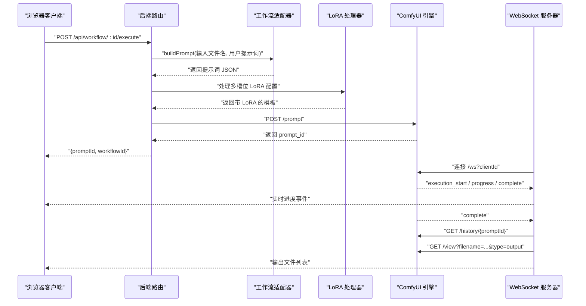
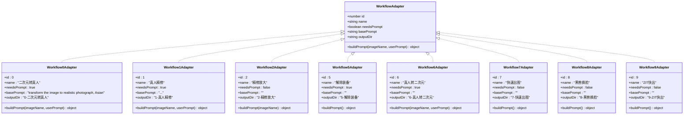
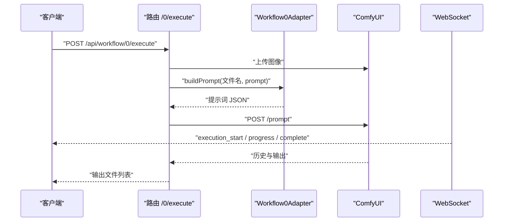
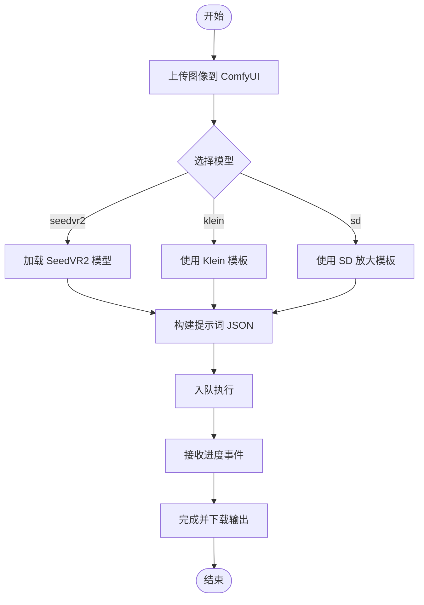
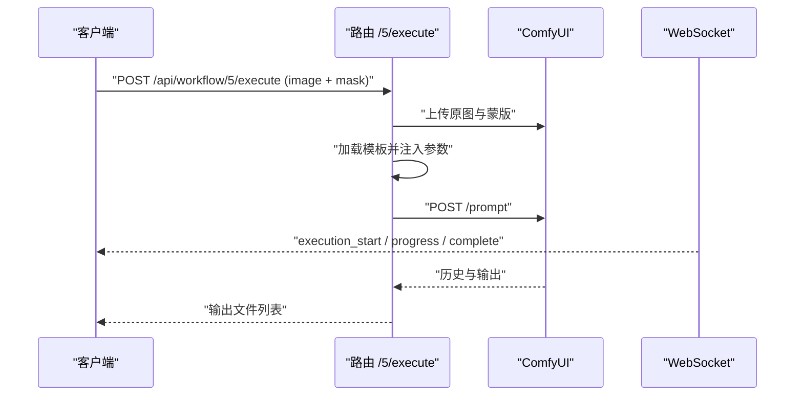
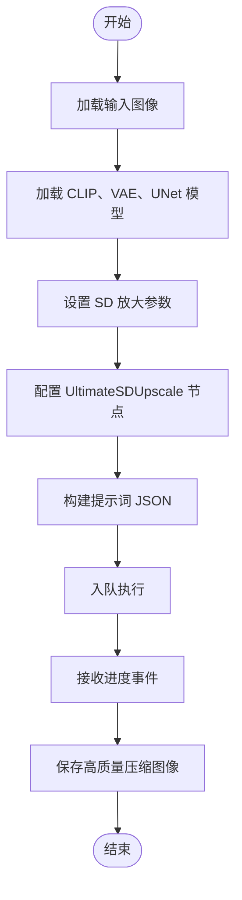
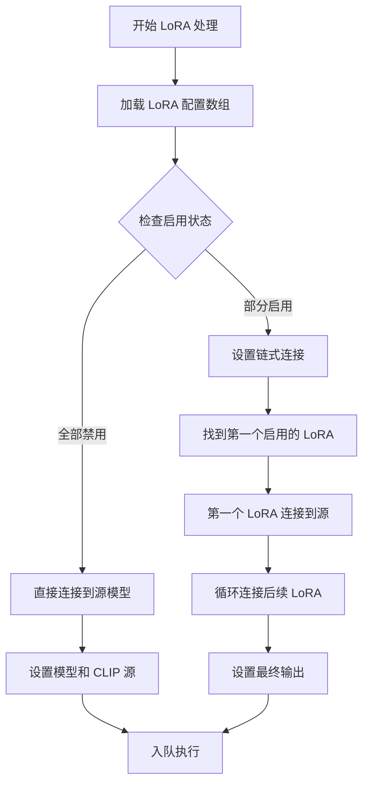
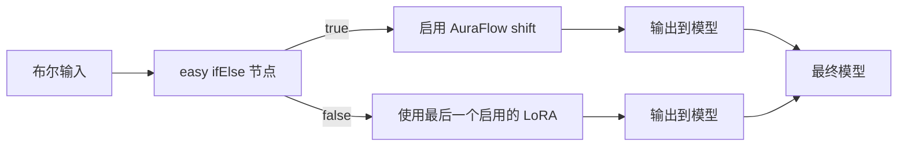
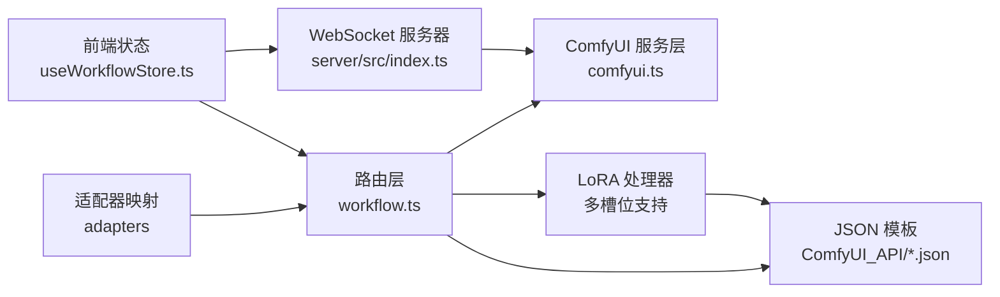

# 工作流系统

<cite>
**本文档引用的文件**
- [README.md](file://README.md)
- [server/src/index.ts](file://server/src/index.ts)
- [client/src/hooks/useWorkflowStore.ts](file://client/src/hooks/useWorkflowStore.ts)
- [server/src/adapters/index.ts](file://server/src/adapters/index.ts)
- [server/src/types/index.ts](file://server/src/types/index.ts)
- [server/src/adapters/BaseAdapter.ts](file://server/src/adapters/BaseAdapter.ts)
- [server/src/adapters/Workflow0Adapter.ts](file://server/src/adapters/Workflow0Adapter.ts)
- [server/src/adapters/Workflow1Adapter.ts](file://server/src/adapters/Workflow1Adapter.ts)
- [server/src/adapters/Workflow2Adapter.ts](file://server/src/adapters/Workflow2Adapter.ts)
- [server/src/adapters/Workflow5Adapter.ts](file://server/src/adapters/Workflow5Adapter.ts)
- [server/src/adapters/Workflow6Adapter.ts](file://server/src/adapters/Workflow6Adapter.ts)
- [server/src/adapters/Workflow7Adapter.ts](file://server/src/adapters/Workflow7Adapter.ts)
- [server/src/adapters/Workflow8Adapter.ts](file://server/src/adapters/Workflow8Adapter.ts)
- [server/src/adapters/Workflow9Adapter.ts](file://server/src/adapters/Workflow9Adapter.ts)
- [server/src/routes/workflow.ts](file://server/src/routes/workflow.ts)
- [server/src/services/comfyui.ts](file://server/src/services/comfyui.ts)
- [ComfyUI_API/👻二次元转真人(NoUnload).json](file://ComfyUI_API/👻二次元转真人(NoUnload).json)
- [ComfyUI_API/Pix2Real-真人转二次元.json](file://ComfyUI_API/Pix2Real-真人转二次元.json)
- [ComfyUI_API/2-Pix2Real-精修放大.json](file://ComfyUI_API/2-Pix2Real-精修放大.json)
- [ComfyUI_API/Pix2Real-SD放大.json](file://ComfyUI_API/Pix2Real-SD放大.json)
- [ComfyUI_API/Pix2Real-二次元生成.json](file://ComfyUI_API/Pix2Real-二次元生成.json)
- [ComfyUI_API/Pix2Real-换面.json](file://ComfyUI_API/Pix2Real-换面.json)
- [ComfyUI_API/Pix2Real-高清重绘.json](file://ComfyUI_API/Pix2Real-高清重绘.json)
- [ComfyUI_API/Pix2Real-ZIT文生图NEW.json](file://ComfyUI_API/Pix2Real-ZIT文生图NEW.json)
- [ComfyUI_API/Pix2Real-ZIT文生图NEW2.json](file://ComfyUI_API/Pix2Real-ZIT文生图NEW2.json)
- [ComfyUI_API/Pix2Real-真人精修.json](file://ComfyUI_API/Pix2Real-真人精修.json)
- [ComfyUI_API/Pix2Real-解除装备.json](file://ComfyUI_API/Pix2Real-解除装备.json)
</cite>

## 更新摘要
**所做更改**
- 新增多槽位 LoRA 支持的全面集成说明
- 更新工作流 7 和工作流 9 的 LoRA 处理机制
- 新增动态节点重连逻辑和条件路由功能
- 补充 LoRA 链接功能的技术实现细节
- 更新工作流适配器映射表以包含新增 LoRA 支持

## 目录
1. [简介](#简介)
2. [项目结构](#项目结构)
3. [核心组件](#核心组件)
4. [架构总览](#架构总览)
5. [详细组件分析](#详细组件分析)
6. [多槽位 LoRA 支持](#多槽位-lora-支持)
7. [依赖关系分析](#依赖关系分析)
8. [性能考虑](#性能考虑)
9. [故障排除指南](#故障排除指南)
10. [结论](#结论)
11. [附录](#附录)

## 简介
本系统是一个基于本地 Web 的批量图像/视频处理平台，通过 ComfyUI 实现多种工作流的自动化执行。系统提供 10 种核心工作流：二次元转真人、真人精修、精修放大、解除装备、真人转二次元、SD 放大、二次元生成、换面、高清重绘、快速出图、黑兽换脸、ZIT快出等；同时支持视频相关工作流与高级功能（如提示词反推、提示词助理、快速出图、ZIT快出、黑兽换脸等）。系统采用适配器模式加载 ComfyUI JSON 模板，通过参数替换实现灵活的工作流执行；后端通过 WebSocket 实时转发进度事件，前端提供批处理、实时进度、会话持久化等功能。

**更新** 新增多槽位 LoRA 支持，允许在单个工作流中同时使用多个 LoRA 模型，并通过动态节点重连和条件路由实现智能的 LoRA 链接功能。

## 项目结构
系统由三部分组成：
- 前端（React + TypeScript + Zustand）：负责用户交互、任务管理、WebSocket 连接、会话存储与展示。
- 后端（Express + TypeScript）：负责路由分发、工作流适配器调用、ComfyUI 通信、输出文件下载与保存。
- ComfyUI 模板（JSON）：每种工作流对应一个 JSON 模板，包含节点连接、输入参数与默认值。



**图表来源**
- [server/src/index.ts:62-219](file://server/src/index.ts#L62-L219)
- [server/src/routes/workflow.ts:1-800](file://server/src/routes/workflow.ts#L1-L800)
- [server/src/services/comfyui.ts:127-188](file://server/src/services/comfyui.ts#L127-L188)

**章节来源**
- [README.md:41-79](file://README.md#L41-L79)
- [server/src/index.ts:17-40](file://server/src/index.ts#L17-L40)

## 核心组件
- 工作流适配器（WorkflowAdapter）：定义工作流标识、名称、是否需要提示词、基础提示词、输出目录以及构建提示词 JSON 的方法。
- 路由层（workflow.ts）：提供工作流执行接口（单图/批量）、特定工作流专用接口（如解除装备、快速出图、ZIT快出、黑兽换脸）、系统状态查询、队列操作、内存释放等。
- ComfyUI 服务层（comfyui.ts）：封装上传图像/视频、入队、历史查询、进度/完成事件订阅、系统统计、队列优先级调整等。
- 前端状态管理（useWorkflowStore.ts）：维护每个标签页的图片列表、提示词、任务状态、进度、输出文件索引等；支持多选、批量处理、会话恢复等。
- **新增** LoRA 处理器：支持多槽位 LoRA 模型的动态加载、链式连接和条件路由。

**章节来源**
- [server/src/types/index.ts:1-52](file://server/src/types/index.ts#L1-L52)
- [server/src/adapters/index.ts:13-28](file://server/src/adapters/index.ts#L13-L28)
- [server/src/routes/workflow.ts:29-38](file://server/src/routes/workflow.ts#L29-L38)
- [server/src/services/comfyui.ts:47-60](file://server/src/services/comfyui.ts#L47-L60)
- [client/src/hooks/useWorkflowStore.ts:6-17](file://client/src/hooks/useWorkflowStore.ts#L6-L17)

## 架构总览
系统采用"适配器 + 模板"的设计模式：每个工作流拥有独立的适配器与 JSON 模板，适配器在运行时读取模板并注入动态参数（如输入文件名、用户提示词、随机种子），然后通过路由层提交到 ComfyUI 执行。后端通过 WebSocket 接收进度事件并转发给前端，完成后自动下载输出文件到会话目录。

**更新** 新增 LoRA 处理器，支持多槽位 LoRA 模型的动态配置和智能连接。



**图表来源**
- [server/src/routes/workflow.ts:407-455](file://server/src/routes/workflow.ts#L407-L455)
- [server/src/services/comfyui.ts:127-188](file://server/src/services/comfyui.ts#L127-L188)
- [server/src/index.ts:92-189](file://server/src/index.ts#L92-L189)

## 详细组件分析

### 工作流适配器设计模式
- 适配器接口定义：包含 id、name、needsPrompt、basePrompt、outputDir 以及 buildPrompt 方法。
- 模板加载：适配器在运行时读取对应 JSON 文件，解析为对象。
- 参数替换：根据输入文件名、用户提示词、随机种子等动态修改模板中的节点输入。
- 输出目录：每个适配器指定输出目录，用于保存该工作流的产物。



**图表来源**
- [server/src/types/index.ts:1-8](file://server/src/types/index.ts#L1-L8)
- [server/src/adapters/Workflow0Adapter.ts:9-34](file://server/src/adapters/Workflow0Adapter.ts#L9-L34)
- [server/src/adapters/Workflow1Adapter.ts:9-35](file://server/src/adapters/Workflow1Adapter.ts#L9-L35)
- [server/src/adapters/Workflow2Adapter.ts:9-27](file://server/src/adapters/Workflow2Adapter.ts#L9-L27)
- [server/src/adapters/Workflow5Adapter.ts:4-14](file://server/src/adapters/Workflow5Adapter.ts#L4-L14)
- [server/src/adapters/Workflow6Adapter.ts:9-35](file://server/src/adapters/Workflow6Adapter.ts#L9-L35)
- [server/src/adapters/Workflow7Adapter.ts:1-14](file://server/src/adapters/Workflow7Adapter.ts#L1-L14)
- [server/src/adapters/Workflow8Adapter.ts:1-14](file://server/src/adapters/Workflow8Adapter.ts#L1-L14)
- [server/src/adapters/Workflow9Adapter.ts:1-14](file://server/src/adapters/Workflow9Adapter.ts#L1-L14)

**章节来源**
- [server/src/adapters/BaseAdapter.ts:1-4](file://server/src/adapters/BaseAdapter.ts#L1-L4)
- [server/src/adapters/index.ts:13-28](file://server/src/adapters/index.ts#L13-L28)

### 二次元转真人（工作流 0）
- 模板来源：[ComfyUI_API/👻二次元转真人(NoUnload).json](file://ComfyUI_API/👻二次元转真人(NoUnload).json)
- 处理流程：
  - 上传图像至 ComfyUI，获取文件名。
  - 适配器读取模板，设置输入图像节点、拼接基础提示词与用户提示词、随机化采样种子。
  - 入队执行，前端接收进度与完成事件，完成后下载输出文件。
- 参数配置：
  - 输入：图像文件。
  - 可选参数：model（支持 qwen/klein）、prompt（用户提示词）。
- 输出效果：将二次元风格图像转换为写实照片风格，保留人物特征与细节。



**图表来源**
- [server/src/routes/workflow.ts:312-355](file://server/src/routes/workflow.ts#L312-L355)
- [server/src/adapters/Workflow0Adapter.ts:16-33](file://server/src/adapters/Workflow0Adapter.ts#L16-L33)
- [server/src/services/comfyui.ts:127-188](file://server/src/services/comfyui.ts#L127-L188)

**章节来源**
- [server/src/routes/workflow.ts:312-355](file://server/src/routes/workflow.ts#L312-L355)
- [server/src/adapters/Workflow0Adapter.ts:9-34](file://server/src/adapters/Workflow0Adapter.ts#L9-L34)

### 真人精修（工作流 1）
- 模板来源：[ComfyUI_API/Pix2Real-真人精修.json](file://ComfyUI_API/Pix2Real-真人精修.json)
- 处理流程：与工作流 0 类似，但使用不同的模板节点与基础提示词，适合对写实风格进行细节优化。
- 参数配置：输入图像与可选用户提示词。
- 输出效果：提升写实照片的细节质量与真实感。

**章节来源**
- [server/src/adapters/Workflow1Adapter.ts:9-35](file://server/src/adapters/Workflow1Adapter.ts#L9-L35)

### 精修放大（工作流 2）
- 模板来源：[ComfyUI_API/2-Pix2Real-精修放大.json](file://ComfyUI_API/2-Pix2Real-精修放大.json)
- 处理流程：对已生成的图像进行高质量放大与细节修复，支持多种模型（seedvr2、klein、SD）。
- 参数配置：输入图像、可选 model（seedvr2/klein/sd）。
- 输出效果：在不损失细节的前提下提升分辨率与清晰度。



**图表来源**
- [server/src/routes/workflow.ts:357-405](file://server/src/routes/workflow.ts#L357-L405)
- [server/src/adapters/Workflow2Adapter.ts:16-26](file://server/src/adapters/Workflow2Adapter.ts#L16-L26)

**章节来源**
- [server/src/routes/workflow.ts:357-405](file://server/src/routes/workflow.ts#L357-L405)
- [server/src/adapters/Workflow2Adapter.ts:9-27](file://server/src/adapters/Workflow2Adapter.ts#L9-L27)

### 解除装备（工作流 5）
- 特殊性：该工作流不使用通用适配器，而是通过专用路由 /api/workflow/5/execute 接收原图与蒙版，直接加载模板并注入参数。
- 处理流程：上传原图与蒙版，设置是否背面姿态、随机种子、可选用户提示词，入队执行。
- 参数配置：image（原图）、mask（蒙版）、backPose（布尔）、prompt（用户提示词）、clientId。
- 输出效果：根据蒙版区域移除人物身上的装备或遮挡物。



**图表来源**
- [server/src/routes/workflow.ts:40-92](file://server/src/routes/workflow.ts#L40-L92)
- [server/src/adapters/Workflow5Adapter.ts:11-14](file://server/src/adapters/Workflow5Adapter.ts#L11-L14)

**章节来源**
- [server/src/routes/workflow.ts:40-92](file://server/src/routes/workflow.ts#L40-L92)
- [server/src/adapters/Workflow5Adapter.ts:4-14](file://server/src/adapters/Workflow5Adapter.ts#L4-L14)

### 真人转二次元（工作流 6）
- 模板来源：[ComfyUI_API/Pix2Real-真人转二次元.json](file://ComfyUI_API/Pix2Real-真人转二次元.json)
- 处理流程：将写实照片转换为二次元风格，支持空提示词（自动识别）或自定义提示词。
- 参数配置：输入图像、可选用户提示词、两个采样器的随机种子。
- 输出效果：生成具有动漫风格的二次元图像，保持人物特征与表情。

**章节来源**
- [server/src/adapters/Workflow6Adapter.ts:9-35](file://server/src/adapters/Workflow6Adapter.ts#L9-L35)

### SD 放大（工作流 10）
- 模板来源：[ComfyUI_API/Pix2Real-SD放大.json](file://ComfyUI_API/Pix2Real-SD放大.json)
- 处理流程：使用 AuraFlow 采样算法和 UltraSharp 放大模型对图像进行高质量放大，支持自定义放大倍数和参数调节。
- 参数配置：输入图像、放大倍数（默认2倍）、采样步数、CFG 值、降噪强度、瓦片大小等。
- 输出效果：在保持图像质量的同时进行高倍数放大，适用于需要大幅提高分辨率的场景。



**图表来源**
- [ComfyUI_API/Pix2Real-SD放大.json:1-229](file://ComfyUI_API/Pix2Real-SD放大.json#L1-L229)

**章节来源**
- [ComfyUI_API/Pix2Real-SD放大.json:1-229](file://ComfyUI_API/Pix2Real-SD放大.json#L1-L229)

### 二次元生成（工作流 11）
- 模板来源：[ComfyUI_API/Pix2Real-二次元生成.json](file://ComfyUI_API/Pix2Real-二次元生成.json)
- 处理流程：使用 XL-漫画2.5D 模型进行纯文本到图像的生成，支持自定义尺寸和提示词组合。
- 参数配置：输入尺寸（默认832x1216）、采样步数（默认30）、CFG 值（默认6）、采样器类型等。
- 输出效果：生成高质量的二次元风格图像，支持丰富的角色描述和场景设定。

**章节来源**
- [ComfyUI_API/Pix2Real-二次元生成.json:1-145](file://ComfyUI_API/Pix2Real-二次元生成.json#L1-L145)

### 换面（工作流 12）
- 模板来源：[ComfyUI_API/Pix2Real-换面.json](file://ComfyUI_API/Pix2Real-换面.json)
- 处理流程：使用 Flux2 模型和参考 Latent 技术，将一张图像中的人物面部和头发替换为另一张图像中的人物面部和头发。
- 参数配置：输入两张图像（源图像和目标面部图像）、采样步数（默认5）、CFG 值（默认1）、随机种子等。
- 输出效果：实现高质量的人像换面，保持服装和其他身体特征不变，实现自然的面部替换。

**章节来源**
- [ComfyUI_API/Pix2Real-换面.json:1-369](file://ComfyUI_API/Pix2Real-换面.json#L1-L369)

### 高清重绘（工作流 13）
- 模板来源：[ComfyUI_API/Pix2Real-高清重绘.json](file://ComfyUI_API/Pix2Real-高清重绘.json)
- 处理流程：结合 WD14 标签器自动反推提示词、LoRA 模型增强真实感、颜色匹配技术保持色调一致，实现高质量的图像重绘。
- 参数配置：输入图像、LoRA 强度（默认0.6）、颜色匹配强度（默认0.6）、采样器类型等。
- 输出效果：将动漫角色转换为真实照片风格，保持原有细节和特征，实现自然的风格转换。

**章节来源**
- [ComfyUI_API/Pix2Real-高清重绘.json:1-446](file://ComfyUI_API/Pix2Real-高清重绘.json#L1-L446)

### 其他工作流与功能
- 快速生成视频（工作流 3）与视频放大（工作流 4）：支持视频输入，分别生成视频与对视频进行放大。
- 快速出图（工作流 7）：纯文本生成图像，支持指定模型、尺寸、采样器、步数、CFG 等参数。
- ZIT快出（工作流 9）：支持 UNet + LoRA + Shift 的组合，可按需启用 LoRA 与 Shift。
- 黑兽换脸（工作流 8）：接收目标图像与人脸图像，执行换脸操作。
- 提示词反推、提示词助理：通过专用模板与 LLM/标签器生成或辅助生成提示词。
- 内存释放：执行释放内存工作流以清理显存/内存。

**章节来源**
- [server/src/routes/workflow.ts:94-261](file://server/src/routes/workflow.ts#L94-L261)
- [server/src/routes/workflow.ts:263-310](file://server/src/routes/workflow.ts#L263-L310)
- [server/src/routes/workflow.ts:674-744](file://server/src/routes/workflow.ts#L674-L744)

## 多槽位 LoRA 支持

### 概述
系统现已全面集成多槽位 LoRA 支持，允许在单个工作流中同时使用最多三个 LoRA 模型。该功能通过动态节点重连逻辑、条件路由和智能链接功能实现，为用户提供更灵活的模型组合能力。

### 技术实现

#### 动态节点重连逻辑
系统为工作流 7 和工作流 9 实现了智能的 LoRA 节点重连机制：



**图表来源**
- [server/src/routes/workflow.ts:192-234](file://server/src/routes/workflow.ts#L192-L234)
- [server/src/routes/workflow.ts:327-369](file://server/src/routes/workflow.ts#L327-L369)

#### 条件路由功能
系统使用 easy ifElse 节点实现智能的条件路由：

- **工作流 7（快速出图）**：使用节点 #47 控制是否启用 AuraFlow shift 功能
- **工作流 9（ZIT快出）**：使用节点 #47 在 AuraFlow shift 和最后一个启用的 LoRA 之间进行切换



**图表来源**
- [ComfyUI_API/Pix2Real-ZIT文生图NEW2.json:210-226](file://ComfyUI_API/Pix2Real-ZIT文生图NEW2.json#L210-L226)

#### LoRA 链接功能
系统支持最多三个 LoRA 模型的链式连接：

1. **节点 ID 分配**：
   - 工作流 7：节点 50、51、52
   - 工作流 9：节点 36、50、51

2. **链式连接规则**：
   - 第一个启用的 LoRA 连接到模型源
   - 后续 LoRA 连接到前一个 LoRA 的输出
   - 最终输出连接到下游节点

3. **强度配置**：
   - 每个 LoRA 节点支持独立的 strength_model 和 strength_clip 值
   - 默认强度值为 1，可根据需要调整

**章节来源**
- [server/src/routes/workflow.ts:192-234](file://server/src/routes/workflow.ts#L192-L234)
- [server/src/routes/workflow.ts:327-369](file://server/src/routes/workflow.ts#L327-L369)

### 支持的工作流

#### 工作流 7（快速出图）
- **模板来源**：[ComfyUI_API/Pix2Real-ZIT文生图NEW.json](file://ComfyUI_API/Pix2Real-ZIT文生图NEW.json)
- **LoRA 节点**：50、51、52
- **功能特点**：
  - 支持最多 3 个 LoRA 模型
  - 智能条件路由控制
  - 自动跳过禁用的 LoRA
  - 动态链式连接

#### 工作流 9（ZIT快出）
- **模板来源**：[ComfyUI_API/Pix2Real-ZIT文生图NEW2.json](file://ComfyUI_API/Pix2Real-ZIT文生图NEW2.json)
- **LoRA 节点**：36、50、51
- **功能特点**：
  - 支持 UNet + LoRA + Shift 组合
  - 灵活的条件路由切换
  - 支持 AuraFlow shift 功能
  - 智能的 LoRA 链式处理

### API 接口

#### LoRA 配置格式
```typescript
interface LoRAConfig {
  model: string;        // LoRA 模型文件名
  enabled: boolean;     // 是否启用
  strength: number;     // 强度值 (0-2)
}
```

#### 请求参数
- **clientId**：必需，客户端标识符
- **loras**：可选，LoRA 配置数组
- **shiftEnabled**：可选，是否启用 AuraFlow shift
- **shift**：可选，shift 值
- **prompt**：可选，提示词
- **width/height**：可选，图像尺寸
- **steps/cfg**：可选，采样参数
- **sampler/scheduler**：可选，采样器类型

**章节来源**
- [server/src/routes/workflow.ts:281-388](file://server/src/routes/workflow.ts#L281-L388)

### 使用示例

#### 基本 LoRA 使用
```json
{
  "clientId": "client_123",
  "loras": [
    {
      "model": "model1.safetensors",
      "enabled": true,
      "strength": 0.8
    },
    {
      "model": "model2.safetensors", 
      "enabled": false,
      "strength": 1.0
    },
    {
      "model": "model3.safetensors",
      "enabled": true, 
      "strength": 0.6
    }
  ]
}
```

#### 高级配置示例
```json
{
  "clientId": "client_123",
  "loras": [
    {
      "model": "F2K_9b-realistic.safetensors",
      "enabled": true,
      "strength": 0.7
    },
    {
      "model": "Klein_9B-后位.safetensors",
      "enabled": true,
      "strength": 0.5
    }
  ],
  "shiftEnabled": true,
  "shift": 3
}
```

### 最佳实践

#### LoRA 组合策略
1. **强度平衡**：多个 LoRA 同时启用时，建议将强度值设置在 0.5-0.8 之间
2. **模型兼容性**：选择相互补充的 LoRA 模型，避免冲突
3. **性能考虑**：过多的 LoRA 会影响生成速度，建议根据需要启用

#### 错误处理
- 系统会自动跳过禁用的 LoRA
- 当所有 LoRA 都被禁用时，直接连接到源模型
- 支持部分启用的 LoRA 组合

**章节来源**
- [server/src/routes/workflow.ts:192-234](file://server/src/routes/workflow.ts#L192-L234)
- [server/src/routes/workflow.ts:327-369](file://server/src/routes/workflow.ts#L327-L369)

## 依赖关系分析
- 适配器注册：后端通过 adapters 映射表统一管理所有适配器，便于路由层按 id 获取。
- 路由层依赖：路由层根据工作流 id 调用对应适配器或专用逻辑（如工作流 5），并调用 ComfyUI 服务层完成上传、入队、历史查询与输出下载。
- 前端依赖：前端通过 useWorkflowStore 管理任务状态、进度与输出文件索引，WebSocket 事件驱动界面更新。
- **新增** LoRA 依赖：工作流 7 和 9 依赖 LoRA 处理器进行动态配置和连接。



**图表来源**
- [server/src/adapters/index.ts:13-28](file://server/src/adapters/index.ts#L13-L28)
- [server/src/routes/workflow.ts:7-9](file://server/src/routes/workflow.ts#L7-L9)
- [server/src/services/comfyui.ts:47-60](file://server/src/services/comfyui.ts#L47-L60)
- [server/src/index.ts:62-219](file://server/src/index.ts#L62-L219)
- [client/src/hooks/useWorkflowStore.ts:96-644](file://client/src/hooks/useWorkflowStore.ts#L96-L644)

**章节来源**
- [server/src/adapters/index.ts:13-28](file://server/src/adapters/index.ts#L13-L28)
- [server/src/routes/workflow.ts:7-9](file://server/src/routes/workflow.ts#L7-L9)
- [server/src/services/comfyui.ts:47-60](file://server/src/services/comfyui.ts#L47-L60)
- [client/src/hooks/useWorkflowStore.ts:96-644](file://client/src/hooks/useWorkflowStore.ts#L96-L644)

## 性能考虑
- 模板复用与参数最小化：适配器仅修改必要节点，减少模板解析与序列化开销。
- 批量处理：路由层支持批量上传与执行，降低网络往返次数。
- 队列优先级：提供队列优先级调整接口，可将目标任务置顶，缩短等待时间。
- 内存管理：提供释放内存工作流，定期清理显存/内存，避免长时间运行导致的资源耗尽。
- WebSocket 缓冲：后端对首次到达的进度事件进行缓冲，确保客户端断线重连后仍能收到完整进度。
- **新增** LoRA 性能优化：智能跳过禁用的 LoRA，减少不必要的计算开销。

**章节来源**
- [server/src/routes/workflow.ts:522-579](file://server/src/routes/workflow.ts#L522-L579)
- [server/src/index.ts:84-90](file://server/src/index.ts#L84-L90)

## 故障排除指南
- ComfyUI 不可用：检查本地 ComfyUI 是否在 http://127.0.0.1:8188 运行；后端服务层在无法访问时会返回错误。
- 上传失败：确认上传接口与文件大小限制；图像/视频上传接口分别使用不同路径与类型。
- 队列异常：使用取消队列与优先级调整接口；若长时间无响应，尝试释放内存后重试。
- WebSocket 连接问题：确认 WebSocket 服务器地址与客户端 clientId；后端会在连接建立时发送 clientId 并缓冲事件。
- 输出缺失：确认 ComfyUI 输出节点类型为 output；后端仅下载类型为 output 的图像与视频。
- **新增** LoRA 相关问题：
  - LoRA 模型加载失败：检查模型文件路径和格式
  - LoRA 链接错误：确认节点 ID 和连接关系正确
  - 条件路由失效：检查 ifElse 节点的布尔输入

**章节来源**
- [server/src/services/comfyui.ts:9-25](file://server/src/services/comfyui.ts#L9-L25)
- [server/src/services/comfyui.ts:27-45](file://server/src/services/comfyui.ts#L27-L45)
- [server/src/services/comfyui.ts:62-83](file://server/src/services/comfyui.ts#L62-L83)
- [server/src/index.ts:92-189](file://server/src/index.ts#L92-L189)

## 结论
本系统通过"适配器 + 模板"的设计，实现了对多种工作流的统一管理与灵活扩展；结合前端状态管理与 WebSocket 实时进度，提供了良好的用户体验。新增的 SD 放大、二次元生成、换面、高清重绘等 4 个工作流进一步扩展了系统的自动化能力，涵盖了从图像放大、内容生成到风格转换的完整工作流程。

**更新** 多槽位 LoRA 支持的全面集成显著提升了系统的灵活性和功能性。通过动态节点重连逻辑、条件路由和智能链接功能，用户可以实现复杂的模型组合，满足各种创意需求。建议在生产环境中：
- 为每个工作流准备稳定的模板文件与默认参数；
- 使用队列优先级与内存释放策略优化资源占用；
- 对批量处理场景进行并发控制与错误重试；
- 为特殊工作流（如解除装备）预留专用路由与参数校验；
- 充分利用 LoRA 功能进行创意实验，探索不同的模型组合效果。

## 附录

### 工作流参数与使用示例（概述）
- 二次元转真人（0）
  - 输入：图像文件
  - 可选：model（qwen/klein）、prompt（用户提示词）
  - 示例：选择 qwen 模型，输入图像与提示词"更清晰的皮肤纹理"，执行后获得写实照片
- 真人精修（1）
  - 输入：图像文件
  - 可选：prompt（用户提示词）
  - 示例：输入写实照片，提示词"增强细节与HDR"，提升真实感
- 精修放大（2）
  - 输入：图像文件
  - 可选：model（seedvr2/klein/sd）
  - 示例：选择 seedvr2，输入图像，执行后获得高分辨率修复图像
- 解除装备（5）
  - 输入：原图 + 蒙版
  - 可选：backPose（布尔）、prompt（用户提示词）
  - 示例：上传人物全身照与手部蒙版，执行后移除手部装备
- 真人转二次元（6）
  - 输入：图像文件
  - 可选：prompt（用户提示词，为空则自动识别）
  - 示例：输入写实照片，提示词"动漫风格，明亮色彩"，生成二次元图像
- SD 放大（10）
  - 输入：图像文件
  - 可选：放大倍数（默认2）、采样步数（默认2）、CFG 值（默认1）
  - 示例：输入图像，设置放大倍数为 3，执行后获得更高分辨率的图像
- 二次元生成（11）
  - 输入：文本提示词
  - 可选：宽度（默认832）、高度（默认1216）、采样步数（默认30）
  - 示例：输入"1girl, long hair, blue eyes, school uniform"，生成二次元角色图像
- 换面（12）
  - 输入：源图像 + 目标面部图像
  - 可选：采样步数（默认5）、CFG 值（默认1）、随机种子
  - 示例：将 A 图像中的面部替换为 B 图像中的面部，保持服装不变
- 高清重绘（13）
  - 输入：图像文件
  - 可选：LoRA 强度（默认0.6）、颜色匹配强度（默认0.6）
  - 示例：输入动漫角色图像，自动反推提示词并增强真实感，生成写实照片
- **新增** 快速出图（7）与 ZIT快出（9）
  - 输入：文本提示词 + 可选 LoRA 配置
  - 可选：loras（数组，最多3个）、shiftEnabled（布尔）、shift（数值）
  - 示例：输入提示词"beautiful landscape"，启用两个 LoRA 模型，强度分别为0.7和0.5

**章节来源**
- [server/src/routes/workflow.ts:312-355](file://server/src/routes/workflow.ts#L312-L355)
- [server/src/routes/workflow.ts:357-405](file://server/src/routes/workflow.ts#L357-L405)
- [server/src/routes/workflow.ts:40-92](file://server/src/routes/workflow.ts#L40-L92)
- [server/src/adapters/Workflow6Adapter.ts:16-34](file://server/src/adapters/Workflow6Adapter.ts#L16-L34)
- [ComfyUI_API/Pix2Real-SD放大.json:1-229](file://ComfyUI_API/Pix2Real-SD放大.json#L1-L229)
- [ComfyUI_API/Pix2Real-二次元生成.json:1-145](file://ComfyUI_API/Pix2Real-二次元生成.json#L1-L145)
- [ComfyUI_API/Pix2Real-换面.json:1-369](file://ComfyUI_API/Pix2Real-换面.json#L1-L369)
- [ComfyUI_API/Pix2Real-高清重绘.json:1-446](file://ComfyUI_API/Pix2Real-高清重绘.json#L1-L446)
- [server/src/routes/workflow.ts:281-388](file://server/src/routes/workflow.ts#L281-L388)