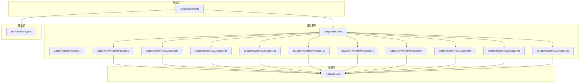
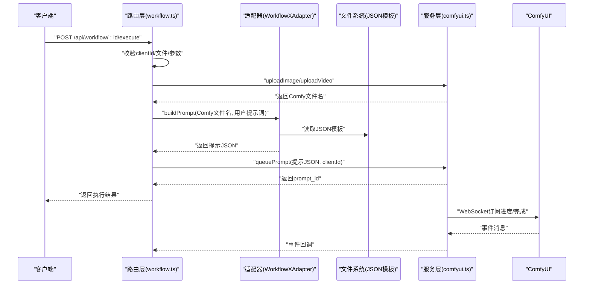
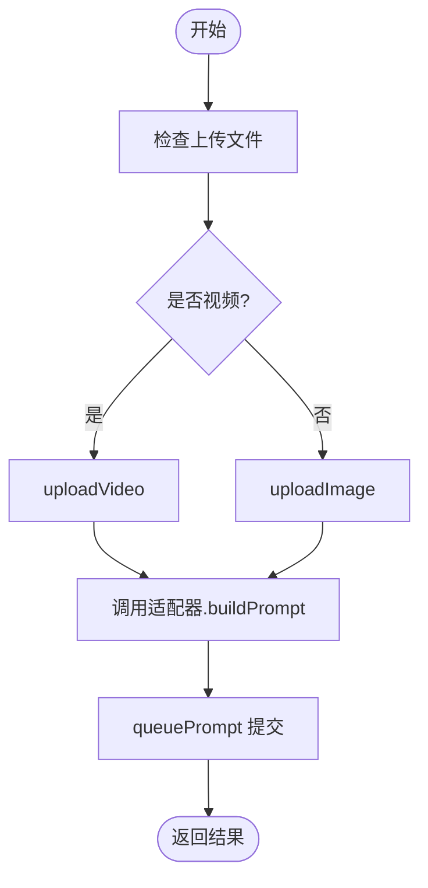
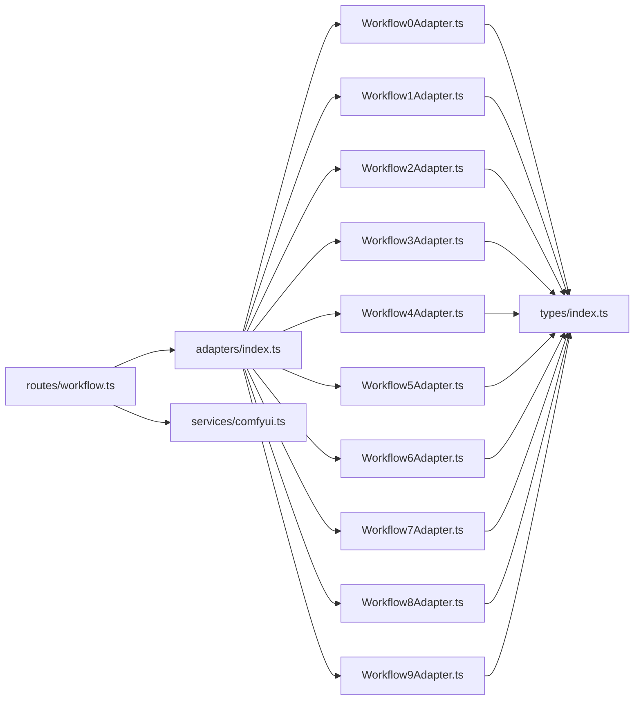

# 工作流适配器系统

<cite>
**本文引用的文件**
- [server/src/adapters/BaseAdapter.ts](file://server/src/adapters/BaseAdapter.ts)
- [server/src/adapters/index.ts](file://server/src/adapters/index.ts)
- [server/src/adapters/Workflow0Adapter.ts](file://server/src/adapters/Workflow0Adapter.ts)
- [server/src/adapters/Workflow1Adapter.ts](file://server/src/adapters/Workflow1Adapter.ts)
- [server/src/adapters/Workflow2Adapter.ts](file://server/src/adapters/Workflow2Adapter.ts)
- [server/src/adapters/Workflow3Adapter.ts](file://server/src/adapters/Workflow3Adapter.ts)
- [server/src/adapters/Workflow4Adapter.ts](file://server/src/adapters/Workflow4Adapter.ts)
- [server/src/adapters/Workflow5Adapter.ts](file://server/src/adapters/Workflow5Adapter.ts)
- [server/src/adapters/Workflow6Adapter.ts](file://server/src/adapters/Workflow6Adapter.ts)
- [server/src/adapters/Workflow7Adapter.ts](file://server/src/adapters/Workflow7Adapter.ts)
- [server/src/adapters/Workflow8Adapter.ts](file://server/src/adapters/Workflow8Adapter.ts)
- [server/src/adapters/Workflow9Adapter.ts](file://server/src/adapters/Workflow9Adapter.ts)
- [server/src/routes/workflow.ts](file://server/src/routes/workflow.ts)
- [server/src/services/comfyui.ts](file://server/src/services/comfyui.ts)
- [server/src/types/index.ts](file://server/src/types/index.ts)
</cite>

## 目录
1. [简介](#简介)
2. [项目结构](#项目结构)
3. [核心组件](#核心组件)
4. [架构总览](#架构总览)
5. [详细组件分析](#详细组件分析)
6. [依赖关系分析](#依赖关系分析)
7. [性能考量](#性能考量)
8. [故障排查指南](#故障排查指南)
9. [结论](#结论)
10. [附录：适配器扩展指南](#附录适配器扩展指南)

## 简介
本文件系统性阐述工作流适配器系统的设计与实现，重点覆盖：
- 适配器模式在工作流系统中的应用与价值
- BaseAdapter 基类的设计理念与核心接口定义
- 各具体适配器（Workflow0Adapter 至 Workflow9Adapter）的实现差异与特殊处理逻辑
- 工作流模板的加载机制、参数替换系统、节点连接规则与错误处理策略
- 与 ComfyUI API 的交互方式与最佳实践
- 如何扩展新工作流适配器

## 项目结构
后端采用分层组织：适配器层负责将上传资源与 ComfyUI 模板进行参数化拼装；路由层承接 HTTP 请求，协调上传、模板加载与队列提交；服务层封装 ComfyUI 的 REST/WebSocket 接口；类型层统一接口契约。

图表来源
- [server/src/adapters/index.ts:1-31](file://server/src/adapters/index.ts#L1-L31)
- [server/src/routes/workflow.ts:1-862](file://server/src/routes/workflow.ts#L1-L862)
- [server/src/services/comfyui.ts:1-285](file://server/src/services/comfyui.ts#L1-L285)
- [server/src/types/index.ts:1-52](file://server/src/types/index.ts#L1-L52)

章节来源
- [server/src/adapters/index.ts:1-31](file://server/src/adapters/index.ts#L1-L31)
- [server/src/routes/workflow.ts:1-862](file://server/src/routes/workflow.ts#L1-L862)
- [server/src/services/comfyui.ts:1-285](file://server/src/services/comfyui.ts#L1-L285)
- [server/src/types/index.ts:1-52](file://server/src/types/index.ts#L1-L52)

## 核心组件
- 适配器接口契约：WorkflowAdapter 定义了工作流的标识、名称、是否需要提示词、基础提示词、输出目录与构建提示 JSON 的方法。
- 适配器注册表：通过 adapters 映射与 getAdapter 工厂函数集中管理所有适配器实例。
- 路由编排：根据请求路径选择适配器或专用路由，完成文件上传、模板加载、参数注入与队列提交。
- ComfyUI 服务：封装上传、入队、历史查询、系统状态、队列优先级等 API，并提供 WebSocket 连接以接收进度/完成事件。

章节来源
- [server/src/types/index.ts:1-8](file://server/src/types/index.ts#L1-L8)
- [server/src/adapters/index.ts:13-28](file://server/src/adapters/index.ts#L13-L28)
- [server/src/routes/workflow.ts:407-455](file://server/src/routes/workflow.ts#L407-L455)
- [server/src/services/comfyui.ts:47-60](file://server/src/services/comfyui.ts#L47-L60)

## 架构总览
下图展示从 HTTP 请求到 ComfyUI 执行的关键流程与组件交互。

图表来源
- [server/src/routes/workflow.ts:407-455](file://server/src/routes/workflow.ts#L407-L455)
- [server/src/services/comfyui.ts:9-25](file://server/src/services/comfyui.ts#L9-L25)
- [server/src/services/comfyui.ts:47-60](file://server/src/services/comfyui.ts#L47-L60)
- [server/src/services/comfyui.ts:127-188](file://server/src/services/comfyui.ts#L127-L188)

## 详细组件分析

### BaseAdapter 与接口契约
- 设计理念：以“模板+参数注入”的方式抽象不同工作流，屏蔽具体节点 ID 与连接细节，统一对外接口。
- 核心接口：
  - id/name/basePrompt/outputDir：工作流元数据
  - needsPrompt：是否强制用户输入提示词
  - buildPrompt(imageName, userPrompt?)：将上传资源与模板拼装为可执行的提示 JSON

章节来源
- [server/src/adapters/BaseAdapter.ts:1-4](file://server/src/adapters/BaseAdapter.ts#L1-L4)
- [server/src/types/index.ts:1-8](file://server/src/types/index.ts#L1-L8)

### 适配器注册与工厂
- adapters 映射：按 id 注册各适配器实例，便于按需查找。
- getAdapter：根据 id 获取适配器，用于通用执行路径。

章节来源
- [server/src/adapters/index.ts:13-28](file://server/src/adapters/index.ts#L13-L28)

### 通用执行路径（单图）
- 文件上传：根据工作流类型调用 uploadImage 或 uploadVideo。
- 参数注入：调用适配器的 buildPrompt，设置节点输入（如图像、提示词、种子）。
- 入队：调用 queuePrompt 提交至 ComfyUI。
- 返回：返回 prompt_id、clientId、workflowId、workflowName。

图表来源
- [server/src/routes/workflow.ts:407-455](file://server/src/routes/workflow.ts#L407-L455)
- [server/src/services/comfyui.ts:27-45](file://server/src/services/comfyui.ts#L27-L45)
- [server/src/services/comfyui.ts:47-60](file://server/src/services/comfyui.ts#L47-L60)

章节来源
- [server/src/routes/workflow.ts:407-455](file://server/src/routes/workflow.ts#L407-L455)

### 专用路由与特殊处理

#### Workflow 0：二次元转真人
- 支持模型切换：默认使用适配器模板，也可选择 Klein 模型直接加载模板并注入参数。
- 参数注入点：设置图像节点、提示词节点、随机种子。
- 输出：返回执行结果与工作流名称。

章节来源
- [server/src/routes/workflow.ts:312-355](file://server/src/routes/workflow.ts#L312-L355)
- [server/src/adapters/Workflow0Adapter.ts:16-34](file://server/src/adapters/Workflow0Adapter.ts#L16-L34)

#### Workflow 2：精修放大
- 支持模型切换：默认使用适配器模板，也可选择 SD 模型或 Klein 模型。
- 参数注入点：设置图像节点、随机种子。
- 输出：返回执行结果与工作流名称。

章节来源
- [server/src/routes/workflow.ts:357-405](file://server/src/routes/workflow.ts#L357-L405)
- [server/src/adapters/Workflow2Adapter.ts:16-27](file://server/src/adapters/Workflow2Adapter.ts#L16-L27)

#### Workflow 5：解除装备（专用路由）
- 需要图像与掩码双文件上传。
- 参数注入点：图像节点、掩码节点、布尔开关、随机种子；用户提示词可选替换。
- 输出：返回执行结果与工作流名称。

章节来源
- [server/src/routes/workflow.ts:40-92](file://server/src/routes/workflow.ts#L40-L92)
- [server/src/adapters/Workflow5Adapter.ts:4-14](file://server/src/adapters/Workflow5Adapter.ts#L4-L14)

#### Workflow 7：快速出图（专用路由）
- 使用 JSON Body 参数，不涉及文件上传。
- 参数注入点：模型、尺寸、采样器、步数、CFG、随机种子、输出前缀等。
- 输出：返回执行结果与工作流名称。

章节来源
- [server/src/routes/workflow.ts:94-149](file://server/src/routes/workflow.ts#L94-L149)

#### Workflow 8：黑兽换脸（专用路由）
- 需要目标图像与人脸图像双文件上传。
- 参数注入点：目标图像节点、人脸图像节点、随机种子。
- 输出：返回执行结果与工作流名称。

章节来源
- [server/src/routes/workflow.ts:263-310](file://server/src/routes/workflow.ts#L263-L310)
- [server/src/adapters/Workflow8Adapter.ts:3-13](file://server/src/adapters/Workflow8Adapter.ts#L3-L13)

#### Workflow 9：ZIT快出（专用路由）
- 使用 UNet + LoRA 组合，支持按开关重布线模型链路。
- 参数注入点：UNet、LoRA、尺寸、采样器、步数、CFG、随机种子、输出前缀；根据开关决定模型链路。
- 输出：返回执行结果与工作流名称。

章节来源
- [server/src/routes/workflow.ts:181-261](file://server/src/routes/workflow.ts#L181-L261)
- [server/src/adapters/Workflow9Adapter.ts:3-13](file://server/src/adapters/Workflow9Adapter.ts#L3-L13)

### 适配器实现差异与特殊处理

#### Workflow0Adapter
- 特殊处理：提示词与基础提示词拼接；随机种子注入。
- 节点连接：通过模板内预置连接，适配器仅设置输入值。

章节来源
- [server/src/adapters/Workflow0Adapter.ts:16-34](file://server/src/adapters/Workflow0Adapter.ts#L16-L34)

#### Workflow1Adapter
- 特殊处理：提示词节点为 CLIP 文本编码节点；随机种子注入。
- 节点连接：模板内预置连接，适配器仅设置输入值。

章节来源
- [server/src/adapters/Workflow1Adapter.ts:16-35](file://server/src/adapters/Workflow1Adapter.ts#L16-L35)

#### Workflow2Adapter
- 特殊处理：无提示词需求；随机种子注入。
- 节点连接：模板内预置连接，适配器仅设置输入值。

章节来源
- [server/src/adapters/Workflow2Adapter.ts:16-27](file://server/src/adapters/Workflow2Adapter.ts#L16-L27)

#### Workflow3Adapter
- 牪殊处理：提示词完全由用户输入替换；随机种子注入。
- 节点连接：模板内预置连接，适配器仅设置输入值。

章节来源
- [server/src/adapters/Workflow3Adapter.ts:16-32](file://server/src/adapters/Workflow3Adapter.ts#L16-L32)

#### Workflow4Adapter
- 特殊处理：视频输入节点；随机种子注入。
- 节点连接：模板内预置连接，适配器仅设置输入值。

章节来源
- [server/src/adapters/Workflow4Adapter.ts:16-27](file://server/src/adapters/Workflow4Adapter.ts#L16-L27)

#### Workflow5Adapter
- 特殊处理：不使用通用执行路径，走专用路由。
- 节点连接：模板内预置连接，适配器仅设置输入值。

章节来源
- [server/src/adapters/Workflow5Adapter.ts:4-14](file://server/src/adapters/Workflow5Adapter.ts#L4-L14)

#### Workflow6Adapter
- 特殊处理：提示词为空字符串时回退至自动标签路径；随机种子注入。
- 节点连接：模板内预置连接，适配器仅设置输入值。

章节来源
- [server/src/adapters/Workflow6Adapter.ts:16-35](file://server/src/adapters/Workflow6Adapter.ts#L16-L35)

#### Workflow7Adapter
- 特殊处理：不使用通用执行路径，走专用路由。
- 节点连接：模板内预置连接，适配器仅设置输入值。

章节来源
- [server/src/adapters/Workflow7Adapter.ts:3-13](file://server/src/adapters/Workflow7Adapter.ts#L3-L13)

#### Workflow8Adapter
- 特殊处理：不使用通用执行路径，走专用路由。
- 节点连接：模板内预置连接，适配器仅设置输入值。

章节来源
- [server/src/adapters/Workflow8Adapter.ts:3-13](file://server/src/adapters/Workflow8Adapter.ts#L3-L13)

#### Workflow9Adapter
- 特殊处理：不使用通用执行路径，走专用路由。
- 节点连接：模板内预置连接，适配器仅设置输入值。

章节来源
- [server/src/adapters/Workflow9Adapter.ts:3-13](file://server/src/adapters/Workflow9Adapter.ts#L3-L13)

### 模板加载机制、参数替换与节点连接
- 模板加载：每个适配器在构造时解析对应 JSON 模板文件，后续只修改节点输入。
- 参数替换：依据节点 ID 设置图像、提示词、种子、模型等输入。
- 节点连接：模板中已定义节点间连接；部分工作流（如 Workflow 9）在运行时根据开关重布线。

章节来源
- [server/src/adapters/Workflow0Adapter.ts:17](file://server/src/adapters/Workflow0Adapter.ts#L17)
- [server/src/adapters/Workflow1Adapter.ts:17](file://server/src/adapters/Workflow1Adapter.ts#L17)
- [server/src/adapters/Workflow2Adapter.ts:17](file://server/src/adapters/Workflow2Adapter.ts#L17)
- [server/src/adapters/Workflow3Adapter.ts:17](file://server/src/adapters/Workflow3Adapter.ts#L17)
- [server/src/adapters/Workflow4Adapter.ts:17](file://server/src/adapters/Workflow4Adapter.ts#L17)
- [server/src/adapters/Workflow6Adapter.ts:17](file://server/src/adapters/Workflow6Adapter.ts#L17)
- [server/src/routes/workflow.ts:227-243](file://server/src/routes/workflow.ts#L227-L243)

### 错误处理策略
- 输入校验：对缺失文件、缺失 clientId、未知工作流等进行明确错误响应。
- 服务异常：对上传失败、入队失败、历史查询失败、系统状态不可达等情况抛出错误并返回友好信息。
- 超时控制：提示词反推与提示词助理两类长耗时任务设置超时阈值并清理临时文件。
- WebSocket 异常：捕获连接错误并记录日志。

章节来源
- [server/src/routes/workflow.ts:407-455](file://server/src/routes/workflow.ts#L407-L455)
- [server/src/services/comfyui.ts:9-25](file://server/src/services/comfyui.ts#L9-L25)
- [server/src/services/comfyui.ts:47-60](file://server/src/services/comfyui.ts#L47-L60)
- [server/src/routes/workflow.ts:709-744](file://server/src/routes/workflow.ts#L709-L744)
- [server/src/routes/workflow.ts:775-800](file://server/src/routes/workflow.ts#L775-L800)

## 依赖关系分析

图表来源
- [server/src/adapters/index.ts:1-31](file://server/src/adapters/index.ts#L1-L31)
- [server/src/routes/workflow.ts:1-12](file://server/src/routes/workflow.ts#L1-L12)
- [server/src/services/comfyui.ts:1-8](file://server/src/services/comfyui.ts#L1-L8)
- [server/src/types/index.ts:1-8](file://server/src/types/index.ts#L1-L8)

章节来源
- [server/src/adapters/index.ts:1-31](file://server/src/adapters/index.ts#L1-L31)
- [server/src/routes/workflow.ts:1-12](file://server/src/routes/workflow.ts#L1-L12)
- [server/src/services/comfyui.ts:1-8](file://server/src/services/comfyui.ts#L1-L8)
- [server/src/types/index.ts:1-8](file://server/src/types/index.ts#L1-L8)

## 性能考量
- 模板复用：适配器仅修改必要节点输入，避免重复解析与构建，降低 CPU 开销。
- 并发批处理：批量接口支持最多 50 张图片，串行入队；若需更高吞吐，可在业务层引入队列限流与并发控制。
- 上传优化：上传接口复用同一子进程，注意内存占用与磁盘 IO；建议限制单次批量大小与图片分辨率。
- WebSocket 事件：仅在需要进度反馈时建立连接，避免不必要的网络开销。
- 模型列表缓存：可考虑缓存模型列表以减少频繁查询对象信息带来的延迟。

## 故障排查指南
- 无法连接 ComfyUI
  - 检查服务地址与端口配置，确认服务可达。
  - 查看队列/历史接口返回状态码与错误信息。
- 上传失败
  - 确认上传接口返回的文件名与子文件夹正确。
  - 检查模板中节点引用的文件名是否一致。
- 入队失败
  - 检查提示 JSON 结构与节点 ID 是否匹配。
  - 确认 clientId 有效且未过期。
- 进度/完成事件未到达
  - 确认 WebSocket 连接参数包含正确的 clientId。
  - 检查事件去重逻辑与执行状态字段。
- 专用工作流报错
  - Workflow 5/7/8/9 有独立路由，确保调用路径与参数格式正确。

章节来源
- [server/src/services/comfyui.ts:62-71](file://server/src/services/comfyui.ts#L62-L71)
- [server/src/services/comfyui.ts:127-188](file://server/src/services/comfyui.ts#L127-L188)
- [server/src/routes/workflow.ts:40-92](file://server/src/routes/workflow.ts#L40-L92)
- [server/src/routes/workflow.ts:94-149](file://server/src/routes/workflow.ts#L94-L149)
- [server/src/routes/workflow.ts:263-310](file://server/src/routes/workflow.ts#L263-L310)
- [server/src/routes/workflow.ts:181-261](file://server/src/routes/workflow.ts#L181-L261)

## 结论
该工作流适配器系统通过统一接口与模板化参数注入，实现了对多种工作流的解耦与扩展。配合专用路由与完善的错误处理，既保证了灵活性，也提升了可用性。未来可在批处理并发、模型列表缓存与事件驱动等方面进一步优化。

## 附录：适配器扩展指南

### 创建新的工作流适配器步骤
1. 在适配器目录新增文件，导出一个实现 WorkflowAdapter 接口的对象。
2. 在构造函数中解析对应 JSON 模板文件。
3. 实现 buildPrompt 方法：
   - 读取模板
   - 设置节点输入（图像、提示词、种子、模型等）
   - 返回提示 JSON
4. 在 adapters/index.ts 中注册新适配器实例与映射。
5. 在路由层添加或复用通用执行路径，或为特殊场景创建专用路由。
6. 在 ComfyUI 模板中预留必要的节点与连接，确保适配器可注入参数。

章节来源
- [server/src/types/index.ts:1-8](file://server/src/types/index.ts#L1-L8)
- [server/src/adapters/index.ts:13-28](file://server/src/adapters/index.ts#L13-L28)
- [server/src/routes/workflow.ts:407-455](file://server/src/routes/workflow.ts#L407-L455)

### 适配器与 ComfyUI API 的交互要点
- 上传资源：使用 uploadImage 或 uploadVideo，获得 Comfy 文件名。
- 入队执行：使用 queuePrompt 提交提示 JSON 与 clientId。
- 查询历史：使用 getHistory 获取执行状态与输出文件信息。
- 系统状态：使用 getSystemStats 获取 VRAM/内存使用率。
- 队列管理：使用 getQueue、prioritizeQueueItem、deleteQueueItem 等接口。
- 实时事件：使用 connectWebSocket 订阅进度、开始与完成事件。

章节来源
- [server/src/services/comfyui.ts:9-25](file://server/src/services/comfyui.ts#L9-L25)
- [server/src/services/comfyui.ts:27-45](file://server/src/services/comfyui.ts#L27-L45)
- [server/src/services/comfyui.ts:47-60](file://server/src/services/comfyui.ts#L47-L60)
- [server/src/services/comfyui.ts:62-71](file://server/src/services/comfyui.ts#L62-L71)
- [server/src/services/comfyui.ts:106-125](file://server/src/services/comfyui.ts#L106-L125)
- [server/src/services/comfyui.ts:202-221](file://server/src/services/comfyui.ts#L202-L221)
- [server/src/services/comfyui.ts:255-284](file://server/src/services/comfyui.ts#L255-L284)
- [server/src/services/comfyui.ts:127-188](file://server/src/services/comfyui.ts#L127-L188)

### 最佳实践建议
- 模板设计：尽量在模板中预置节点与连接，适配器仅做最小化参数注入。
- 参数安全：对用户输入进行裁剪与校验，避免注入非法节点 ID。
- 错误隔离：在适配器与路由层分别进行输入校验与错误包装，保持职责单一。
- 可观测性：为每个工作流记录关键事件（入队、开始、完成、错误），便于追踪。
- 可维护性：为每个工作流提供清晰的输出目录命名规范，便于定位产物。