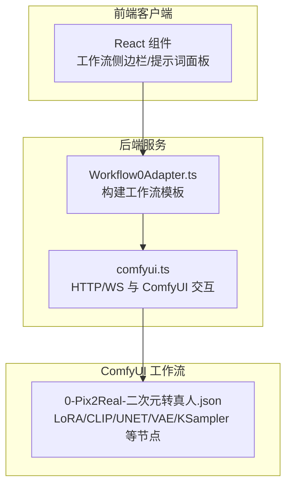
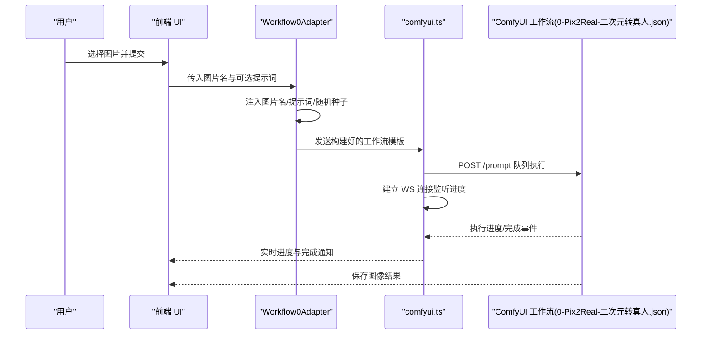
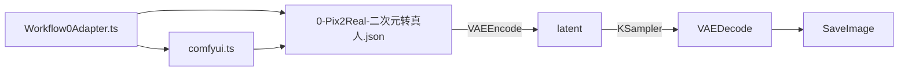

# 二次元转真人

<cite>
**本文引用的文件列表**
- [0-Pix2Real-二次元转真人.json](file://ComfyUI_API/0-Pix2Real-二次元转真人.json)
- [Pix2Real-释放内存.json](file://ComfyUI_API/Pix2Real-释放内存.json)
- [Workflow0Adapter.ts](file://server/src/adapters/Workflow0Adapter.ts)
- [comfyui.ts](file://server/src/services/comfyui.ts)
- [README.md](file://README.md)
- [2-Pix2Real-精修放大.json](file://ComfyUI_API/2-Pix2Real-精修放大.json)
- [Pix2Real-快速生成视频RAM.json](file://ComfyUI_API/Pix2Real-快速生成视频RAM.json)
- [Pix2Real-换面.json](file://ComfyUI_API/Pix2Real-换面.json)
</cite>

## 目录
1. [简介](#简介)
2. [项目结构](#项目结构)
3. [核心组件](#核心组件)
4. [架构总览](#架构总览)
5. [详细组件分析](#详细组件分析)
6. [依赖关系分析](#依赖关系分析)
7. [性能考量](#性能考量)
8. [故障排查指南](#故障排查指南)
9. [结论](#结论)
10. [附录](#附录)

## 简介
本技术文档围绕“二次元转真人”工作流展开，聚焦于以下关键点：
- LoRA 模型 Qwen-style\anything2real_2601_A_final_patched.safetensors 的应用原理与 strength_model=0.8 的作用机制
- VAE 编码/解码流程与 qwen_image_vae.safetensors 的使用
- GGUF 格式的 CLIP（Qwen2.5-VL-7B-Instruct-Q3_K_S.gguf）与 UNET（Qwen\Qwen-Rapid-NSFW-v23_Q4_K.gguf）加载器的使用方法
- TextEncodeQwenImageEditPlus 的文本编码技术与 Prompt 参数 “transform the image to realistic photograph, Asian” 的效果
- KSampler 采样器的参数（seed、steps、cfg、sampler_name、scheduler、denoise）对最终效果的影响
- 图像缩放、显存清理与内存管理的最佳实践

## 项目结构
该仓库采用前后端分离架构：前端为 Vite + React + TypeScript 的 Web UI；后端为 Express + TypeScript，负责与 ComfyUI 进行通信（HTTP 与 WebSocket），并以适配器模式加载不同工作流模板，动态注入用户上传的图片名、提示词与随机种子等参数。

图表来源
- [README.md:41-62](file://README.md#L41-L62)
- [Workflow0Adapter.ts:6-7](file://server/src/adapters/Workflow0Adapter.ts#L6-L7)
- [comfyui.ts:47-60](file://server/src/services/comfyui.ts#L47-L60)
- [0-Pix2Real-二次元转真人.json:1-252](file://ComfyUI_API/0-Pix2Real-二次元转真人.json#L1-L252)

章节来源
- [README.md:41-79](file://README.md#L41-L79)
- [Workflow0Adapter.ts:1-35](file://server/src/adapters/Workflow0Adapter.ts#L1-L35)
- [comfyui.ts:1-285](file://server/src/services/comfyui.ts#L1-L285)

## 核心组件
- 工作流模板（ComfyUI JSON）
  - LoRA 加载器（仅模型）：加载 anything2real LoRA 并设置 strength_model=0.8
  - CLIP 加载器（GGUF）：加载 Qwen VL 模型用于图像编辑文本编码
  - UNET 加载器（GGUF）：加载 Qwen Rapid NSFW UNET
  - VAE 加载器：加载 qwen_image_vae.safetensors
  - 文本编码节点：TextEncodeQwenImageEditPlus，结合图像与提示词生成条件
  - 采样器：KSampler，配置 seed、steps、cfg、sampler_name、scheduler、denoise
  - 缩放节点：ImageScaleToTotalPixels，控制输出像素总量
  - 显存清理：easy cleanGpuUsed
  - 内存清理：RAMCleanup + VRAMCleanup
- 适配器（后端）
  - Workflow0Adapter：读取模板，注入上传图片名、拼接提示词、随机种子
- 服务（后端）
  - comfyui.ts：封装 ComfyUI 的 HTTP 接口与 WebSocket 进度事件

章节来源
- [0-Pix2Real-二次元转真人.json:1-252](file://ComfyUI_API/0-Pix2Real-二次元转真人.json#L1-L252)
- [Workflow0Adapter.ts:9-34](file://server/src/adapters/Workflow0Adapter.ts#L9-L34)
- [comfyui.ts:47-188](file://server/src/services/comfyui.ts#L47-L188)

## 架构总览
从用户上传图片到生成结果的端到端流程如下：

图表来源
- [Workflow0Adapter.ts:16-33](file://server/src/adapters/Workflow0Adapter.ts#L16-L33)
- [comfyui.ts:47-60](file://server/src/services/comfyui.ts#L47-L60)
- [comfyui.ts:127-188](file://server/src/services/comfyui.ts#L127-L188)
- [0-Pix2Real-二次元转真人.json:1-252](file://ComfyUI_API/0-Pix2Real-二次元转真人.json#L1-L252)

## 详细组件分析

### LoRA 模型与 strength_model=0.8 的应用原理
- 节点：LoraLoaderModelOnly
- 关键参数
  - lora_name：Qwen-style\anything2real_2601_A_final_patched.safetensors
  - strength_model：0.8
- 应用原理
  - LoRA 在不改变主模型权重的前提下，通过低秩矩阵对模型进行微调，实现风格迁移或任务特定增强
  - strength_model 控制 LoRA 对 UNET 的影响强度
  - 数值越高，LoRA 的风格影响越强；数值过低则效果不明显；过高可能导致失真或过度拟合
  - 在二次元转真人场景中，0.8 的强度在保留原图结构的同时，显著提升写实质感与细节
- 最佳实践
  - 初次尝试建议从 0.6~0.8 区间，再根据输出微调
  - 若显存紧张，可适当降低强度以减少显存峰值

章节来源
- [0-Pix2Real-二次元转真人.json:18-31](file://ComfyUI_API/0-Pix2Real-二次元转真人.json#L18-L31)

### VAE 编码/解码流程与 qwen_image_vae.safetensors
- 节点
  - VAELoader：加载 qwen_image_vae.safetensors
  - VAEEncode：将输入图像编码为潜在空间 latent
  - VAEDecode：将 latent 解码回像素图像
- 流程
  - 先通过 VAELoader 加载 VAE
  - 使用 VAEEncode 将缩放后的图像编码为 latent
  - 交由 KSampler 在潜在空间进行扩散采样
  - 最终 VAEDecode 输出像素级图像
- 注意事项
  - 编码/解码过程会占用显存，建议在高分辨率或批量处理时开启分块（tiled）策略
  - 若显存不足，可考虑降低输入分辨率或关闭 tiled

章节来源
- [0-Pix2Real-二次元转真人.json:11-16](file://ComfyUI_API/0-Pix2Real-二次元转真人.json#L11-L16)
- [0-Pix2Real-二次元转真人.json:137-145](file://ComfyUI_API/0-Pix2Real-二次元转真人.json#L137-L145)
- [0-Pix2Real-二次元转真人.json:58-73](file://ComfyUI_API/0-Pix2Real-二次元转真人.json#L58-L73)

### GGUF 格式的 CLIP 与 UNET 加载器
- CLIP 加载器（GGUF）
  - 节点：CLIPLoaderGGUF
  - 模型：Qwen2.5-VL-7B-Instruct-Q3_K_S.gguf
  - 类型：qwen_image
  - 用途：为 TextEncodeQwenImageEditPlus 提供图像理解能力，支持图文联合编码
- UNET 加载器（GGUF）
  - 节点：UnetLoaderGGUF
  - 模型：Qwen\Qwen-Rapid-NSFW-v23_Q4_K.gguf
  - 用途：在潜在空间进行去噪预测，决定生成图像的细节与风格
- 使用建议
  - GGUF 模型通常占用更少显存，适合资源受限环境
  - 与 CLIP/VAE/UNET 的组合需匹配，避免类型不兼容导致报错

章节来源
- [0-Pix2Real-二次元转真人.json:32-41](file://ComfyUI_API/0-Pix2Real-二次元转真人.json#L32-L41)
- [0-Pix2Real-二次元转真人.json:213-221](file://ComfyUI_API/0-Pix2Real-二次元转真人.json#L213-L221)

### TextEncodeQwenImageEditPlus 的文本编码与 Prompt 效果
- 节点：TextEncodeQwenImageEditPlus
- 输入
  - prompt：“transform the image to realistic photograph, Asian”
  - clip：已加载的 Qwen VL CLIP
  - vae：qwen_image_vae.safetensors
  - image1：缩放后的输入图像
- 技术要点
  - 该节点结合图像与文本，生成正向条件（positive conditioning）
  - Prompt 中的“Asian”强调了肤色与人种特征，有助于引导生成更贴近亚洲人外观的真实照片风格
  - 可通过适配器在基础 Prompt 上追加用户自定义内容
- 影响因素
  - 正向条件强度与负向条件（negative conditioning）共同决定生成方向
  - 与 LoRA 强度、采样器参数协同作用

章节来源
- [0-Pix2Real-二次元转真人.json:222-242](file://ComfyUI_API/0-Pix2Real-二次元转真人.json#L222-L242)
- [Workflow0Adapter.ts:16-27](file://server/src/adapters/Workflow0Adapter.ts#L16-L27)

### KSampler 采样器参数对效果的影响
- 节点：KSampler
- 关键参数
  - seed：随机种子，控制生成的可复现性
  - steps：扩散步数，影响细节与稳定性
  - cfg：类别无关指导（CFG）强度，控制与提示词的一致性
  - sampler_name：采样器名称（如 euler_ancestral）
  - scheduler：调度器（如 beta）
  - denoise：降噪强度，控制从噪声到图像的过渡程度
- 参数建议
  - seed：每次生成前随机化，保证多样性
  - steps：在 4~10 之间通常能平衡速度与质量
  - cfg：1~3 适合写实风格，避免过度约束
  - sampler/scheduler：euler_ancestral + beta 在写实风格上表现稳定
  - denoise：1 保持较高探索性，若需要更确定的结果可下调至 0.5~0.7
- 影响路径
  - 正向条件（positive）来自 TextEncodeQwenImageEditPlus
  - 负向条件（negative）来自 ConditioningZeroOut
  - 参考潜变量（reference latents）来自 FluxKontextMultiReferenceLatentMethod

章节来源
- [0-Pix2Real-二次元转真人.json:146-175](file://ComfyUI_API/0-Pix2Real-二次元转真人.json#L146-L175)
- [0-Pix2Real-二次元转真人.json:7-16](file://ComfyUI_API/0-Pix2Real-二次元转真人.json#L7-L16)
- [0-Pix2Real-二次元转真人.json:6-16](file://ComfyUI_API/0-Pix2Real-二次元转真人.json#L6-L16)
- [0-Pix2Real-二次元转真人.json:8-16](file://ComfyUI_API/0-Pix2Real-二次元转真人.json#L8-L16)
- [0-Pix2Real-二次元转真人.json:74-85](file://ComfyUI_API/0-Pix2Real-二次元转真人.json#L74-L85)

### 图像缩放与分辨率控制
- 节点：ImageScaleToTotalPixels
- 参数
  - upscale_method：lanczos
  - megapixels：1（控制总像素量）
  - resolution_steps：1
- 作用
  - 将输入图像缩放到目标像素总量，兼顾生成质量与显存占用
  - 与 VAEEncode/VAEDecode 协同，确保潜在空间尺寸合理
- 最佳实践
  - 低分辨率输入（如 1M 像素）适合快速迭代
  - 高分辨率输入（配合分块解码）可获得更高细节，但需注意显存

章节来源
- [0-Pix2Real-二次元转真人.json:146-160](file://ComfyUI_API/0-Pix2Real-二次元转真人.json#L146-L160)

### 显存清理与内存管理
- 显存清理
  - easy cleanGpuUsed：清理当前 GPU 使用占用
  - VRAMCleanup：将模型与缓存卸载到 CPU
- 内存清理
  - RAMCleanup：清理文件缓存、进程与 DLL，重试多次
- 典型使用位置
  - 二次元转真人工作流末尾：先清理 GPU，再释放内存
  - 快速生成视频工作流：在视频处理后进行内存回收
- 最佳实践
  - 处理完成后立即触发清理，避免残留占用
  - 大批量任务结束后统一执行释放内存流程

章节来源
- [0-Pix2Real-二次元转真人.json:74-85](file://ComfyUI_API/0-Pix2Real-二次元转真人.json#L74-L85)
- [0-Pix2Real-二次元转真人.json:42-57](file://ComfyUI_API/0-Pix2Real-二次元转真人.json#L42-L57)
- [Pix2Real-释放内存.json:1-39](file://ComfyUI_API/Pix2Real-释放内存.json#L1-L39)
- [Pix2Real-快速生成视频RAM.json:376-448](file://ComfyUI_API/Pix2Real-快速生成视频RAM.json#L376-L448)

## 依赖关系分析
- 适配器依赖工作流模板文件，仅修改必要节点（图片名、提示词、种子）
- 服务层依赖 ComfyUI 的 HTTP 与 WebSocket 接口，负责队列、历史查询与进度转发
- 工作流节点之间存在严格的连接关系：VAE 编码→KSampler→VAE 解码→保存

图表来源
- [Workflow0Adapter.ts:16-33](file://server/src/adapters/Workflow0Adapter.ts#L16-L33)
- [comfyui.ts:47-60](file://server/src/services/comfyui.ts#L47-L60)
- [0-Pix2Real-二次元转真人.json:1-252](file://ComfyUI_API/0-Pix2Real-二次元转真人.json#L1-L252)

章节来源
- [Workflow0Adapter.ts:1-35](file://server/src/adapters/Workflow0Adapter.ts#L1-L35)
- [comfyui.ts:1-285](file://server/src/services/comfyui.ts#L1-L285)
- [0-Pix2Real-二次元转真人.json:1-252](file://ComfyUI_API/0-Pix2Real-二次元转真人.json#L1-L252)

## 性能考量
- 显存优化
  - 使用 GGUF 模型（CLIP/UNET）降低显存占用
  - 在 VAEDecode 中启用分块（tiled）策略（如 SeedVR2LoadVAEModel 的 encode_tiled/decode_tiled）
  - 处理完成后及时执行显存清理
- 内存优化
  - 使用 RAMCleanup 清理文件缓存、进程与 DLL
  - 批量任务结束后统一释放内存
- 分辨率与步数
  - 低分辨率（1M）适合快速迭代；高分辨率需配合分块解码
  - 步数与 CFG 需在质量和速度间权衡

章节来源
- [2-Pix2Real-精修放大.json:66-84](file://ComfyUI_API/2-Pix2Real-精修放大.json#L66-L84)
- [Pix2Real-释放内存.json:9-38](file://ComfyUI_API/Pix2Real-释放内存.json#L9-L38)
- [0-Pix2Real-二次元转真人.json:146-175](file://ComfyUI_API/0-Pix2Real-二次元转真人.json#L146-L175)

## 故障排查指南
- 无法加载 LoRA/CLIP/UNET
  - 检查模型路径是否正确（包含 Qwen-style 与 Qwen 文件夹）
  - 确认 GGUF 模型与节点类型匹配
- 显存不足
  - 降低输入分辨率或关闭 tiled
  - 使用 GGUF 模型替代 FP16/FP32 模型
  - 执行显存清理与内存清理
- 生成质量不佳
  - 调整 LoRA 强度（strength_model）、采样器步数与 CFG
  - 优化 Prompt，明确风格与人种特征
- 进度事件异常
  - 确保 WebSocket 连接正常，检查 onExecutionStart/onComplete 的重复触发问题

章节来源
- [comfyui.ts:127-188](file://server/src/services/comfyui.ts#L127-L188)
- [0-Pix2Real-二次元转真人.json:1-252](file://ComfyUI_API/0-Pix2Real-二次元转真人.json#L1-L252)

## 结论
“二次元转真人”工作流通过 LoRA 微调、GGUF 模型与 Qwen VL 的图像理解能力，结合 KSampler 的可控采样，实现了高质量的风格转换。strength_model=0.8 在本场景中提供了良好的风格迁移强度与稳定性。配合合理的分辨率控制、显存与内存清理策略，可在有限硬件条件下高效运行。建议在实际使用中根据输出效果微调 LoRA 强度、采样步数与 CFG，并在批量处理后执行释放流程以维持系统稳定。

## 附录
- 相关工作流参考
  - 精修放大：展示分块 VAE 与高分辨率处理策略
  - 快速生成视频RAM：演示视频处理后的内存回收流程
  - 换面：展示图像缩放与参考潜变量的使用

章节来源
- [2-Pix2Real-精修放大.json:1-146](file://ComfyUI_API/2-Pix2Real-精修放大.json#L1-L146)
- [Pix2Real-快速生成视频RAM.json:376-448](file://ComfyUI_API/Pix2Real-快速生成视频RAM.json#L376-L448)
- [Pix2Real-换面.json:213-225](file://ComfyUI_API/Pix2Real-换面.json#L213-L225)