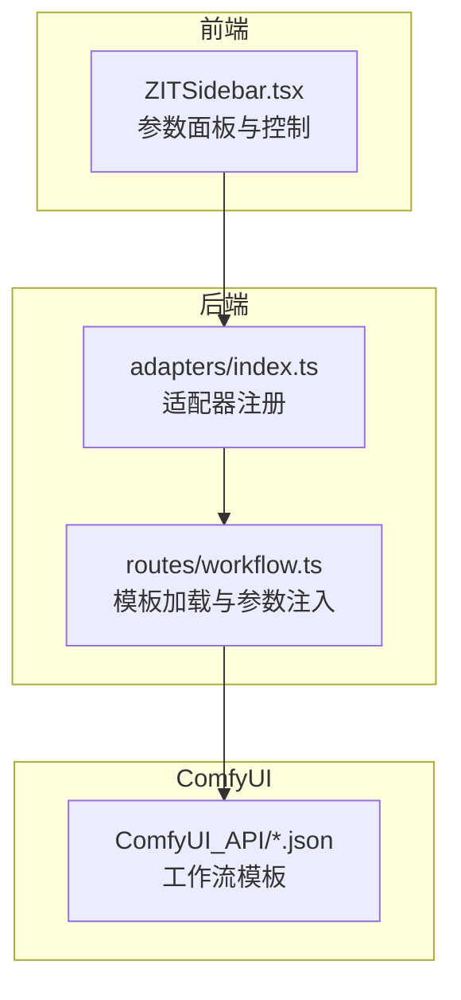
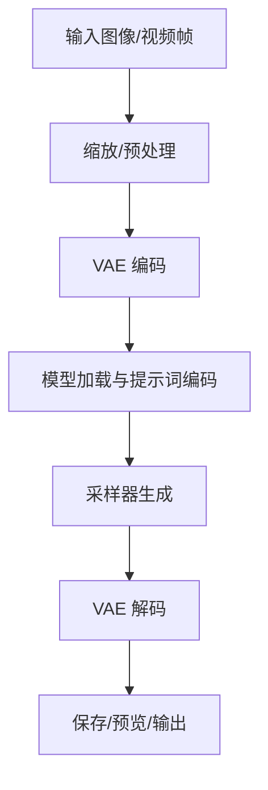
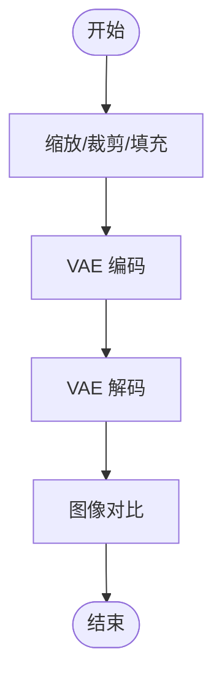
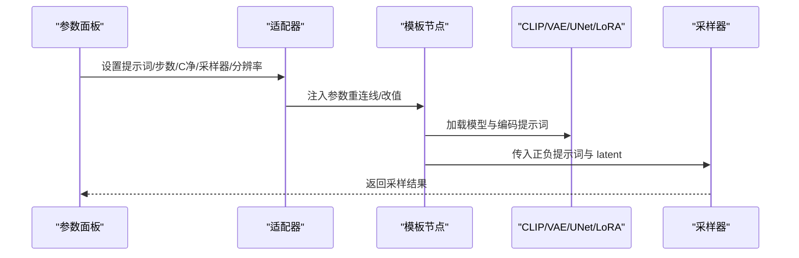
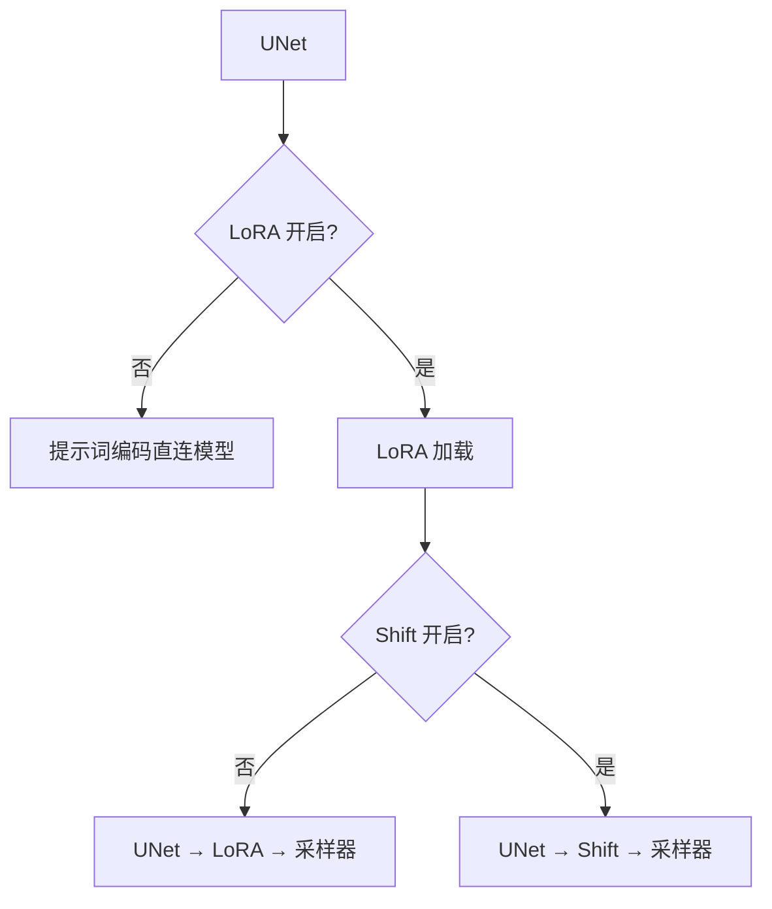
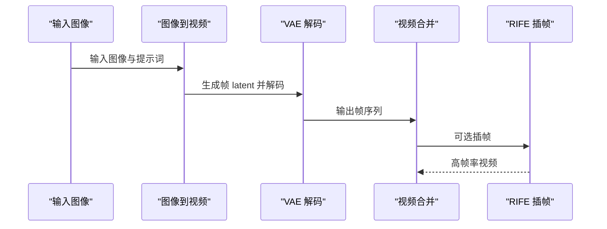
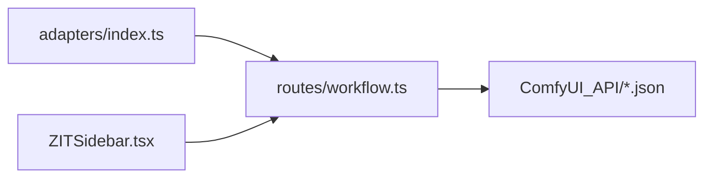

# 工作流概览

<cite>
**本文引用的文件**
- [README.md](file://README.md)
- [0-Pix2Real-二次元转真人.json](file://ComfyUI_API/0-Pix2Real-二次元转真人.json)
- [Pix2Real-二次元生成.json](file://ComfyUI_API/Pix2Real-二次元生成.json)
- [Pix2Real-真人精修.json](file://ComfyUI_API/Pix2Real-真人精修.json)
- [Pix2Real-高清重绘.json](file://ComfyUI_API/Pix2Real-高清重绘.json)
- [2-Pix2Real-精修放大.json](file://ComfyUI_API/2-Pix2Real-精修放大.json)
- [3-Pix2Real-快速生成视频.json](file://ComfyUI_API/3-Pix2Real-快速生成视频.json)
- [4-Pix2Real-视频放大.json](file://ComfyUI_API/4-Pix2Real-视频放大.json)
- [index.ts](file://server/src/adapters/index.ts)
- [workflow.ts](file://server/src/routes/workflow.ts)
- [ZITSidebar.tsx](file://client/src/components/ZITSidebar.tsx)
</cite>

## 目录
1. [简介](#简介)
2. [项目结构](#项目结构)
3. [核心组件](#核心组件)
4. [架构总览](#架构总览)
5. [详细组件分析](#详细组件分析)
6. [依赖分析](#依赖分析)
7. [性能考虑](#性能考虑)
8. [故障排除指南](#故障排除指南)
9. [结论](#结论)
10. [附录](#附录)

## 简介
本文件面向使用 CorineKit Pix2Real 的用户与开发者，系统性梳理项目中的五类核心工作流的整体架构与共性特征，解释其在 ComfyUI 中的统一模板结构、通用节点连接方式与处理流程；总结工作流间的关联关系与共享组件（如 VAE 编码解码、LoRA 模型加载、采样器配置等），并提供工作流选择指南、性能对比与参数配置建议，帮助用户按需高效完成从图像到视频的本地批处理任务。

## 项目结构
项目采用“前端 + 后端 + ComfyUI 工作流模板”的分层组织：
- 前端（React + TypeScript）负责交互、参数面板与实时进度展示
- 后端（Express + TypeScript）负责适配器模式加载模板、拼接参数、转发 WebSocket 进度事件
- ComfyUI 工作流模板（JSON）作为可复用的节点图，通过后端适配器进行参数注入与管线重连

图表来源
- [index.ts:13-24](file://server/src/adapters/index.ts#L13-L24)
- [workflow.ts:207-240](file://server/src/routes/workflow.ts#L207-L240)
- [ZITSidebar.tsx:69-280](file://client/src/components/ZITSidebar.tsx#L69-L280)

章节来源
- [README.md: 41-79:41-79](file://README.md#L41-L79)
- [index.ts: 13-24:13-24](file://server/src/adapters/index.ts#L13-L24)
- [workflow.ts: 207-240:207-240](file://server/src/routes/workflow.ts#L207-L240)

## 核心组件
- 适配器（Adapter）：每个工作流对应一个适配器，负责加载模板并仅对需要变更的节点进行参数注入（如图像名、提示词、种子、步数、CFG、采样器、分辨率等）
- 参数面板（ZITSidebar）：提供 UNet/LoRA 模型选择、LoRA 开关、AuraFlow Shift 参数、提示词、宽高比、步数、CFG、采样器与调度器等配置项
- WebSocket 进度：后端维护与 ComfyUI 的单 WebSocket 连接，向浏览器推送实时进度事件
- 工作流模板（JSON）：以节点图为形式描述数据流，包含 VAE 编解码、CLIP/UNet/LoRA/采样器、图像处理与输出等模块

章节来源
- [README.md: 74-79:74-79](file://README.md#L74-L79)
- [index.ts: 13-24:13-24](file://server/src/adapters/index.ts#L13-L24)
- [ZITSidebar.tsx: 69-280:69-280](file://client/src/components/ZITSidebar.tsx#L69-L280)

## 架构总览
五类核心工作流均遵循统一模板结构与通用节点连接方式：
- 输入阶段：加载图像或视频帧（LoadImage/VHS_LoadVideo）
- 预处理阶段：缩放、颜色匹配、遮罩扩展与图像分割（ImageScaleToTotalPixels、ImageScaleBy、ImageResizeKJv2、Image Comparer、INPAINT_ExpandMask、easy sam3ImageSegmentation 等）
- 编码阶段：VAE 编码（VAEEncode/SeedVR2LoadVAEModel）
- 生成阶段：模型加载（CheckpointLoaderSimple/VAELoader/CLIPLoader/UNETLoader/LoraLoaderModelOnly/LoaderGGUF 等）、提示词编码（CLIPTextEncode/TextEncodeQwenImageEditPlus）、采样器（KSampler/SamplerCustomAdvanced/WanMoeKSampler/SeedVR2VideoUpscaler）
- 解码与输出阶段：VAE 解码（VAEDecode）、保存/预览（SaveImage/PreviewImage/VHS_VideoCombine）

图表来源
- [0-Pix2Real-二次元转真人.json: 1-L252:1-252](file://ComfyUI_API/0-Pix2Real-二次元转真人.json#L1-L252)
- [Pix2Real-真人精修.json: 1-L369:1-369](file://ComfyUI_API/Pix2Real-真人精修.json#L1-L369)
- [Pix2Real-高清重绘.json: 1-L446:1-446](file://ComfyUI_API/Pix2Real-高清重绘.json#L1-L446)
- [2-Pix2Real-精修放大.json: 1-L146:1-146](file://ComfyUI_API/2-Pix2Real-精修放大.json#L1-L146)
- [3-Pix2Real-快速生成视频.json: 1-L418:1-418](file://ComfyUI_API/3-Pix2Real-快速生成视频.json#L1-L418)
- [4-Pix2Real-视频放大.json: 1-L195:1-195](file://ComfyUI_API/4-Pix2Real-视频放大.json#L1-L195)

## 详细组件分析

### 组件A：VAE 编解码与图像预处理
- 共同点
  - 多数工作流在生成前后均使用 VAE 编解码（VAEDecode/VAEEncode），确保 latent 空间与像素空间的转换
  - 使用缩放节点（ImageScaleToTotalPixels/ImageScaleBy/ImageResizeKJv2）控制分辨率与比例
  - 使用图像对比（Image Comparer/rgthree）辅助前后对比与质量评估
- 关键节点
  - VAEDecode/VAEEncode：连接采样器输出与最终像素输出
  - ImageScaleToTotalPixels/ImageScaleBy/ImageResizeKJv2：统一的尺寸与比例控制
  - SeedVR2LoadVAEModel/SeedVR2LoadDiTModel：用于视频放大/重绘场景的显存优化模型加载

图表来源
- [Pix2Real-高清重绘.json: 1-L446:1-446](file://ComfyUI_API/Pix2Real-高清重绘.json#L1-L446)
- [2-Pix2Real-精修放大.json: 1-L146:1-146](file://ComfyUI_API/2-Pix2Real-精修放大.json#L1-L146)

章节来源
- [Pix2Real-高清重绘.json: 1-L446:1-446](file://ComfyUI_API/Pix2Real-高清重绘.json#L1-L446)
- [2-Pix2Real-精修放大.json: 1-L146:1-146](file://ComfyUI_API/2-Pix2Real-精修放大.json#L1-L146)

### 组件B：提示词与模型加载链路
- 共同点
  - 提示词编码（CLIPTextEncode/TextEncodeQwenImageEditPlus）与 CLIP/VAE/UNet/LoRA/GGUF 模型加载节点广泛存在
  - 采样器（KSampler/SamplerCustomAdvanced/WanMoeKSampler）统一接收正负提示词与 latent 输入
- 关键节点
  - CLIPTextEncode/TextEncodeQwenImageEditPlus：文本编码
  - CheckpointLoaderSimple/VAELoader/CLIPLoader/UNETLoader/LoraLoaderModelOnly/LoaderGGUF：模型加载
  - KSampler/SamplerCustomAdvanced/WanMoeKSampler：采样器

图表来源
- [workflow.ts: 207-240:207-240](file://server/src/routes/workflow.ts#L207-L240)
- [0-Pix2Real-二次元转真人.json: 1-L252:1-252](file://ComfyUI_API/0-Pix2Real-二次元转真人.json#L1-L252)
- [Pix2Real-二次元生成.json: 1-L145:1-145](file://ComfyUI_API/Pix2Real-二次元生成.json#L1-L145)
- [Pix2Real-真人精修.json: 1-L369:1-369](file://ComfyUI_API/Pix2Real-真人精修.json#L1-L369)
- [Pix2Real-高清重绘.json: 1-L446:1-446](file://ComfyUI_API/Pix2Real-高清重绘.json#L1-L446)

章节来源
- [workflow.ts: 207-240:207-240](file://server/src/routes/workflow.ts#L207-L240)
- [0-Pix2Real-二次元转真人.json: 1-L252:1-252](file://ComfyUI_API/0-Pix2Real-二次元转真人.json#L1-L252)
- [Pix2Real-二次元生成.json: 1-L145:1-145](file://ComfyUI_API/Pix2Real-二次元生成.json#L1-L145)
- [Pix2Real-真人精修.json: 1-L369:1-369](file://ComfyUI_API/Pix2Real-真人精修.json#L1-L369)
- [Pix2Real-高清重绘.json: 1-L446:1-446](file://ComfyUI_API/Pix2Real-高清重绘.json#L1-L446)

### 组件C：LoRA 与 AuraFlow/Shift 配置
- 共同点
  - 多工作流支持 LoRA 模型加载（LoraLoaderModelOnly/Power Lora Loader），并通过开关控制是否接入采样链路
  - AuraFlow/Shift（ModelSamplingAuraFlow）用于特定工作流的采样策略调整
- 参数注入逻辑
  - 当关闭 LoRA 时，提示词编码直接连接到模型，跳过 LoRA 节点
  - 当启用 LoRA 且关闭 Shift 时，形成“UNet → LoRA → 采样器”的链路
  - 当启用 LoRA 且启用 Shift 时，形成“UNet → Shift → 采样器”的链路

图表来源
- [workflow.ts: 207-240:207-240](file://server/src/routes/workflow.ts#L207-L240)

章节来源
- [workflow.ts: 207-240:207-240](file://server/src/routes/workflow.ts#L207-L240)

### 组件D：视频生成与放大
- 快速生成视频（图像到视频）
  - 使用 WanImageToVideo 将起始图像扩展为视频序列，结合 VAE 解码与视频合并（VHS_VideoCombine）
  - 支持 RIFE 插帧提升帧率
- 视频放大
  - 通过 SeedVR2VideoUpscaler 对视频逐帧放大，配合 DiT/VAE 模型加载与显存优化参数

图表来源
- [3-Pix2Real-快速生成视频.json: 1-L418:1-418](file://ComfyUI_API/3-Pix2Real-快速生成视频.json#L1-L418)
- [4-Pix2Real-视频放大.json: 1-L195:1-195](file://ComfyUI_API/4-Pix2Real-视频放大.json#L1-L195)

章节来源
- [3-Pix2Real-快速生成视频.json: 1-L418:1-418](file://ComfyUI_API/3-Pix2Real-快速生成视频.json#L1-L418)
- [4-Pix2Real-视频放大.json: 1-L195:1-195](file://ComfyUI_API/4-Pix2Real-视频放大.json#L1-L195)

## 依赖分析
- 适配器注册与路由
  - 适配器集中注册于 adapters/index.ts，按工作流 ID 映射到具体适配器
  - 路由 workflow.ts 负责加载模板、注入参数并重连模型/提示词链路
- 前端参数面板
  - ZITSidebar.tsx 提供 UNet/LoRA/Shift/提示词/采样器/步数/C净/分辨率等配置，并持久化草稿

图表来源
- [index.ts:13-24](file://server/src/adapters/index.ts#L13-L24)
- [workflow.ts:207-240](file://server/src/routes/workflow.ts#L207-L240)
- [ZITSidebar.tsx:69-280](file://client/src/components/ZITSidebar.tsx#L69-L280)

章节来源
- [index.ts: 13-24:13-24](file://server/src/adapters/index.ts#L13-L24)
- [workflow.ts: 207-240:207-240](file://server/src/routes/workflow.ts#L207-L240)
- [ZITSidebar.tsx: 69-280:69-280](file://client/src/components/ZITSidebar.tsx#L69-L280)

## 性能考虑
- 显存与内存管理
  - 多工作流包含显存清理（easy cleanGpuUsed）与内存释放（RAMCleanup）节点，建议在长流程或批量处理中启用
  - 视频放大场景使用 SeedVR2LoadVAEModel/SeedVR2LoadDiTModel 的分块与卸载参数，降低显存峰值
- 采样器与步数
  - 步数与 CFG 影响生成质量与耗时；较低步数可显著缩短时间，但可能牺牲细节
  - 不同采样器（如 euler_ancestral/dpmpp_2m_sde/euler）在速度与稳定性上各有侧重
- 分辨率与缩放
  - 预处理阶段统一使用 Lanczos 缩放，保证质量；大分辨率会显著增加显存与时间成本
- LoRA 与 Shift
  - LoRA 会引入额外计算开销；AuraFlow/Shift 在特定模型上可改善稳定性与细节

## 故障排除指南
- 无法连接 ComfyUI 或进度不更新
  - 检查后端与 ComfyUI 的 WebSocket 连接状态；确认端口与地址配置正确
- 显存不足导致失败
  - 启用显存清理节点；降低分辨率或步数；使用视频放大的分块/卸载参数
- LoRA/模型加载失败
  - 确认模型路径与名称正确；检查适配器参数注入是否覆盖到对应节点
- 生成质量不佳
  - 调整提示词、CFG、采样器与步数；必要时开启 Shift 或更换 LoRA 强度

## 结论
五类核心工作流在 ComfyUI 模板化与适配器模式下实现了高度一致的结构与流程：统一的输入/预处理/编解码/采样/输出链路，以及可配置的提示词、LoRA 与采样器参数。通过共享组件（VAE、CLIP/UNet/LoRA/采样器）与参数注入机制，用户可在不同场景间灵活切换，实现从二次元到真实感、从精修到视频生成的完整本地批处理体验。

## 附录

### 工作流选择指南
- 二次元转真人
  - 适用场景：将动漫风格图像转换为写实照片，强调风格迁移与细节增强
  - 推荐参数：中等步数、适中 CFG；可启用 LoRA 与 Shift 提升细节
- 真人精修
  - 适用场景：对真人图像进行局部修复与风格微调，结合遮罩与颜色匹配
  - 推荐参数：较低步数与 Denoise；精细遮罩扩展与颜色匹配
- 高清重绘
  - 适用场景：基于现有图像进行风格化重绘与细节增强，支持提示词反推
  - 推荐参数：较高分辨率与步数；LoRA 强度适中；注意显存占用
- 快速生成视频
  - 适用场景：将静态图像扩展为短时视频，强调速度与流畅度
  - 推荐参数：较低步数；启用 RIFE 插帧；合理帧率与分辨率平衡
- 视频放大
  - 适用场景：对已有视频进行逐帧放大，提升清晰度与细节
  - 推荐参数：启用 SeedVR2 的分块与卸载；控制最大分辨率与批次大小

### 参数配置建议
- 采样器与调度器：优先尝试 euler_ancestral（速度较快）与 dpmpp_2m_sde（稳定性较好）
- 步数与 CFG：步数与 CFG 成反比影响细节与稳定性；建议从较低步数起步，逐步提升
- LoRA：强度建议 0.5~1.0；若显存紧张可关闭
- 分辨率：优先满足输出需求；大分辨率需配合显存优化参数
- 提示词：正面提示词强调风格与细节，负面提示词抑制伪影与低质元素