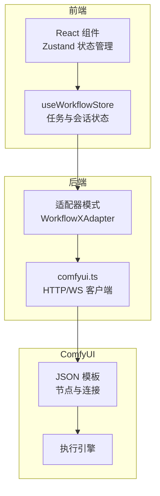
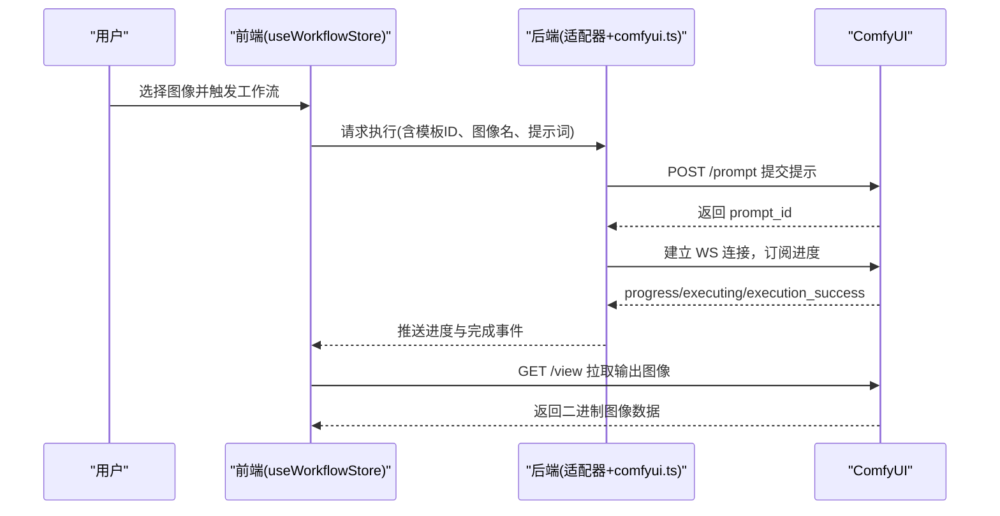
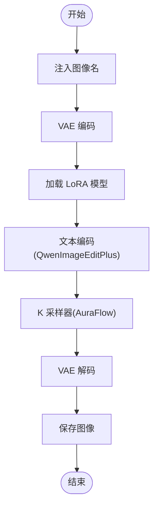
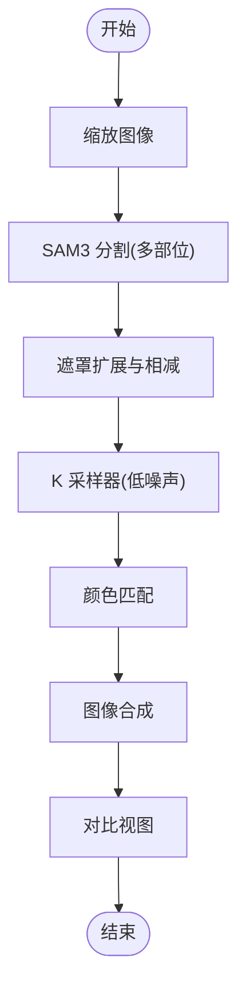
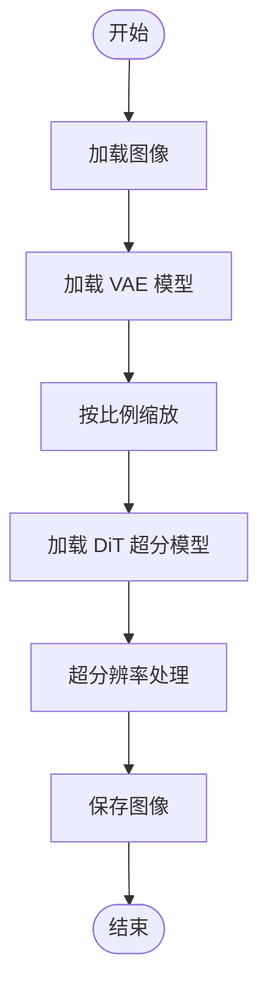
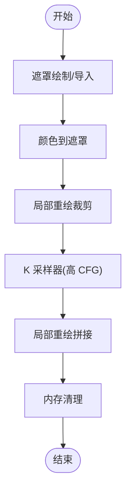
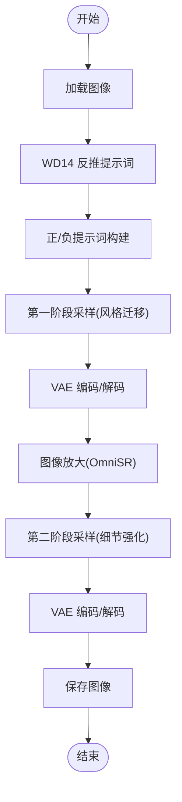
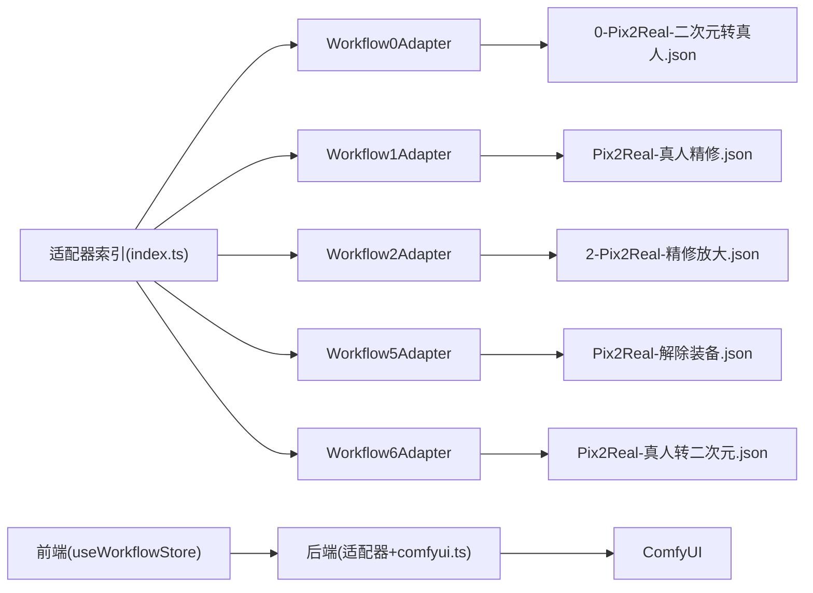

# 核心工作流

<cite>
**本文引用的文件**
- [README.md](file://README.md)
- [index.ts](file://server/src/adapters/index.ts)
- [BaseAdapter.ts](file://server/src/adapters/BaseAdapter.ts)
- [Workflow0Adapter.ts](file://server/src/adapters/Workflow0Adapter.ts)
- [Workflow1Adapter.ts](file://server/src/adapters/Workflow1Adapter.ts)
- [Workflow2Adapter.ts](file://server/src/adapters/Workflow2Adapter.ts)
- [Workflow5Adapter.ts](file://server/src/adapters/Workflow5Adapter.ts)
- [Workflow6Adapter.ts](file://server/src/adapters/Workflow6Adapter.ts)
- [comfyui.ts](file://server/src/services/comfyui.ts)
- [useWorkflowStore.ts](file://client/src/hooks/useWorkflowStore.ts)
- [0-Pix2Real-二次元转真人.json](file://ComfyUI_API/0-Pix2Real-二次元转真人.json)
- [Pix2Real-真人精修.json](file://ComfyUI_API/Pix2Real-真人精修.json)
- [2-Pix2Real-精修放大.json](file://ComfyUI_API/2-Pix2Real-精修放大.json)
- [Pix2Real-解除装备.json](file://ComfyUI_API/Pix2Real-解除装备.json)
- [Pix2Real-真人转二次元.json](file://ComfyUI_API/Pix2Real-真人转二次元.json)
</cite>

## 目录
1. [简介](#简介)
2. [项目结构](#项目结构)
3. [核心组件](#核心组件)
4. [架构总览](#架构总览)
5. [详细工作流分析](#详细工作流分析)
6. [依赖关系分析](#依赖关系分析)
7. [性能考量](#性能考量)
8. [故障排查指南](#故障排查指南)
9. [结论](#结论)
10. [附录](#附录)

## 简介
本文件系统性梳理并深入解析本项目的五大核心工作流：二次元转真人、真人精修、精修放大、解除装备、真人转二次元。文档从技术架构、数据流、关键节点与参数、处理步骤与输出效果入手，结合 ComfyUI JSON 模板结构，给出使用示例、参数调优建议与最佳实践，帮助用户高效、稳定地完成本地批量图像处理任务。

## 项目结构
- 前端（React + TypeScript）通过 Zustand 状态管理维护工作流会话与任务队列，实时接收来自后端的 WebSocket 进度事件。
- 后端（Express + TypeScript）以适配器模式加载 ComfyUI 的 JSON 工作流模板，按需替换输入节点（如图像名、提示词、随机种子），并通过 HTTP/WS 与 ComfyUI 交互。
- ComfyUI_API 目录存放各工作流的 JSON 模板，每个模板定义了完整的节点连接与参数配置。
- 输出文件夹按工作流 ID 分类存储，便于一键打开查看结果。

图表来源
- [index.ts:13-24](file://server/src/adapters/index.ts#L13-L24)
- [comfyui.ts:47-60](file://server/src/services/comfyui.ts#L47-L60)
- [useWorkflowStore.ts:96-115](file://client/src/hooks/useWorkflowStore.ts#L96-L115)

章节来源
- [README.md: 41-79:41-79](file://README.md#L41-L79)
- [index.ts: 13-24:13-24](file://server/src/adapters/index.ts#L13-L24)

## 核心组件
- 适配器（Adapter）：负责加载对应 JSON 模板，注入上传图像名、用户提示词、随机种子等动态参数，返回可提交给 ComfyUI 的完整提示对象。
- ComfyUI 服务：封装上传图片/视频、入队、查询历史、拉取输出、WebSocket 进度监听、系统状态查询等能力。
- 前端状态：统一管理当前标签页、图像列表、提示词、任务队列、进度与输出选择，支持跨标签页的任务映射与恢复。

章节来源
- [BaseAdapter.ts: 1-4:1-4](file://server/src/adapters/BaseAdapter.ts#L1-L4)
- [comfyui.ts: 47-60:47-60](file://server/src/services/comfyui.ts#L47-L60)
- [useWorkflowStore.ts: 96-115:96-115](file://client/src/hooks/useWorkflowStore.ts#L96-L115)

## 架构总览
- 模板驱动：每个工作流以独立 JSON 模板为蓝本，适配器只做最小必要改动，确保一致性与可维护性。
- 实时反馈：后端建立一个 WebSocket 连接，将 ComfyUI 的进度事件转发至前端，实现“所见即所得”的可视化反馈。
- 批处理隔离：每个标签页维护独立的图像列表与任务，避免跨任务干扰。

图表来源
- [comfyui.ts: 127-188:127-188](file://server/src/services/comfyui.ts#L127-L188)
- [comfyui.ts: 47-60:47-60](file://server/src/services/comfyui.ts#L47-L60)

## 详细工作流分析

### 二次元转真人工作流
- 目标：将二次元风格图像转换为写实摄影风格，强调亚洲人特征。
- 关键节点与作用
  - 图像加载：将上传图像名注入到指定 LoadImage 节点。
  - VAE 编码：对输入图像进行潜空间编码，供采样器使用。
  - LoRA 模型：加载特定权重（如 anything2real），在模型侧引入真实感风格。
  - 文本编码：使用 QwenImageEditPlus 对提示词进行编码，支持图像编辑场景。
  - 采样器：AuraFlow 采样算法，配合 CFG 归一化与参考 Latent 方法，控制生成质量与稳定性。
  - VAE 解码：将潜变量解码为最终图像。
  - 内存管理：包含 RAM 清理与显存占用清理节点，降低资源压力。
- 处理流程
  1) 读取模板并注入图像名与提示词。
  2) 执行 VAE 编码 → LoRA 注入 → 文本编码 → 采样器 → VAE 解码。
  3) 可选：循环或内存清理节点辅助稳定运行。
- 输出效果：写实风格的人像，细节丰富，肤色与质感更接近真实照片。
- 使用示例
  - 在前端选择图像，进入“二次元转真人”标签页，点击执行。若需要强调特定特征，可在提示词区域追加描述。
- 参数调优建议
  - LoRA 强度：根据风格差异调整 strength_model，避免过度真实或失真。
  - 采样步数与 CFG：步数过低易欠拟合，过高可能引入噪点；CFG 过高会削弱细节。
  - 采样器与调度器：AuraFlow 适合写实风格，scheduler 可尝试 beta 或其他以平衡速度与质量。
- 最佳实践
  - 先用较低步数快速预览，再提高步数精细优化。
  - 控制提示词长度与关键词权重，避免冲突语义导致退化。
  - 配合内存清理节点，长时间批处理时保持系统稳定。

图表来源
- [0-Pix2Real-二次元转真人.json: 15-252:15-252](file://ComfyUI_API/0-Pix2Real-二次元转真人.json#L15-L252)
- [Workflow0Adapter.ts: 16-33:16-33](file://server/src/adapters/Workflow0Adapter.ts#L16-L33)

章节来源
- [0-Pix2Real-二次元转真人.json: 15-252:15-252](file://ComfyUI_API/0-Pix2Real-二次元转真人.json#L15-L252)
- [Workflow0Adapter.ts: 9-34:9-34](file://server/src/adapters/Workflow0Adapter.ts#L9-L34)

### 真人精修工作流
- 目标：对真人照片进行细节增强与修复，提升皮肤质感、清晰度与整体观感。
- 关键节点与作用
  - 图像加载与缩放：先对输入图像进行缩放，便于后续处理。
  - SAM3 分割：基于提示词（如 Body、Head、Hands）进行多区域分割，生成精确遮罩。
  - 遮罩扩展与相减：对不同部位遮罩进行膨胀、模糊与相减，确保修复区域边界自然。
  - K 采样器：在低噪声阶段进行修复，结合正负提示词控制风格与质量。
  - VAE 编码/解码：潜空间处理与重建。
  - 颜色匹配：将修复后的区域与原图颜色风格对齐，减少突兀。
  - 图像合成与对比：将修复区域与原图合成，并提供对比视图辅助判断。
- 处理流程
  1) 读取模板并注入图像名。
  2) SAM3 分割生成多部位遮罩 → 扩展与相减 → K 采样器修复 → 颜色匹配 → 合成与保存。
- 输出效果：皮肤细节更清晰，手部与身体轮廓自然，整体质感提升。
- 使用示例
  - 在前端选择图像，进入“真人精修”标签页，点击执行。可配合遮罩编辑工具微调修复区域。
- 参数调优建议
  - 步数与降噪：步数过低无法充分修复，过高可能引入伪影；降噪系数在 0.4~0.6 区间通常较稳定。
  - SAM3 阈值：根据图像复杂度调整阈值，确保分割边界贴合。
  - 遮罩膨胀与模糊：手部等细小区域适当缩小膨胀半径，避免过度影响周边。
- 最佳实践
  - 先对关键部位（如手、脸）单独验证效果，再进行全图修复。
  - 使用对比视图确认修复边界，避免过度锐化或色彩偏差。

图表来源
- [Pix2Real-真人精修.json: 238-369:238-369](file://ComfyUI_API/Pix2Real-真人精修.json#L238-L369)
- [Workflow1Adapter.ts: 16-34:16-34](file://server/src/adapters/Workflow1Adapter.ts#L16-L34)

章节来源
- [Pix2Real-真人精修.json: 238-369:238-369](file://ComfyUI_API/Pix2Real-真人精修.json#L238-L369)
- [Workflow1Adapter.ts: 9-35:9-35](file://server/src/adapters/Workflow1Adapter.ts#L9-L35)

### 精修放大工作流
- 目标：在保持细节的前提下对图像进行超分辨率放大，提升分辨率与清晰度。
- 关键节点与作用
  - 图像加载：注入上传图像名。
  - VAE 模型加载：使用 SeedVR2 的 VAE 模型，支持分块编码/解码。
  - 放大前缩放：将图像按比例缩小后再放大，有助于稳定超分过程。
  - SeedVR2 DiT 模型：加载 DiT 超分模型，设置分辨率、批次大小、颜色校正等参数。
  - 结果保存：输出放大后的图像。
- 处理流程
  1) 读取模板并注入图像名。
  2) 加载 VAE/DiT 模型 → 缩放前处理 → 超分执行 → 保存结果。
- 输出效果：高分辨率图像，细节更丰富，边缘更平滑。
- 使用示例
  - 在前端选择图像，进入“精修放大”标签页，点击执行。可调整分辨率与批次大小以平衡速度与质量。
- 参数调优建议
  - 分辨率与批次：分辨率越高，显存占用越大；批次越大吞吐越高但显存压力更大。
  - 颜色校正：LAB 模式通常能带来更自然的颜色过渡。
  - Tile 设置：合理设置 tile 大小与重叠，避免显存不足导致失败。
- 最佳实践
  - 先用较小分辨率验证效果，再逐步提升至目标分辨率。
  - 若显存紧张，优先降低分辨率或增大 tile 重叠以换取稳定性。

图表来源
- [2-Pix2Real-精修放大.json: 1145-146:1145-146](file://ComfyUI_API/2-Pix2Real-精修放大.json#L1145-L146)
- [Workflow2Adapter.ts: 16-26:16-26](file://server/src/adapters/Workflow2Adapter.ts#L16-L26)

章节来源
- [2-Pix2Real-精修放大.json: 1145-146:1145-146](file://ComfyUI_API/2-Pix2Real-精修放大.json#L1145-L146)
- [Workflow2Adapter.ts: 9-27:9-27](file://server/src/adapters/Workflow2Adapter.ts#L9-L27)

### 解除装备工作流
- 目标：在保留主体的同时移除图像中的特定装备（如衣物），实现“裸体/去衣”效果。
- 关键节点与作用
  - 图像加载与遮罩绘制：将上传图像与遮罩叠加，用于指示需要移除的区域。
  - 颜色到遮罩：根据特定颜色提取遮罩，作为移除区域的精确边界。
  - InpaintCropImproved：对遮罩区域进行裁剪与上下文扩展，准备重绘。
  - K 采样器：在高 CFG 下进行局部重绘，结合正负条件控制风格。
  - InpaintStitchImproved：将重绘结果与原图无缝拼接。
  - 内存清理：在执行前后清理 VRAM，保证批处理稳定性。
- 处理流程
  1) 读取模板并注入图像名与遮罩。
  2) 颜色到遮罩 → 裁剪与扩展 → K 采样器重绘 → 拼接与保存。
- 输出效果：主体保留，装备区域被自然填充或擦除，边界柔和。
- 使用示例
  - 在前端选择图像，绘制或导入遮罩，进入“解除装备”标签页，点击执行。
- 参数调优建议
  - 步数与降噪：步数过低无法充分填充，过高可能引入伪影；降噪系数在 0.8~1.0 区间较稳定。
  - 遮罩膨胀与混合：适当膨胀与边缘混合可避免硬边界。
  - LoRA 切换：根据风格需求切换 LoRA 模型，避免风格不一致。
- 最佳实践
  - 遮罩绘制要尽量贴合边缘，减少不必要的填充区域。
  - 先对小范围区域验证效果，再扩大到全身。

图表来源
- [Pix2Real-解除装备.json: 306-372:306-372](file://ComfyUI_API/Pix2Real-解除装备.json#L306-L372)
- [Workflow5Adapter.ts: 11-13:11-13](file://server/src/adapters/Workflow5Adapter.ts#L11-L13)

章节来源
- [Pix2Real-解除装备.json: 306-372:306-372](file://ComfyUI_API/Pix2Real-解除装备.json#L306-L372)
- [Workflow5Adapter.ts: 4-14:4-14](file://server/src/adapters/Workflow5Adapter.ts#L4-L14)

### 真人转二次元工作流
- 目标：将真人照片转换为具有动漫风格的二次元图像，强调线条与色彩表现力。
- 关键节点与作用
  - 图像加载：注入上传图像名。
  - WD14 反推提示词：自动识别图像内容并生成正向提示词，作为风格引导。
  - 正负提示词：正向提示词强调高质量与动漫风格，负向提示词抑制低质量与现实元素。
  - K 采样器：两阶段采样，第一阶段用于风格迁移，第二阶段用于细节强化。
  - VAE 编码/解码：潜空间处理与重建。
  - 图像放大：使用 OmniSR 模型对图像进行二次放大，提升分辨率。
  - 保存输出：输出最终二次元风格图像。
- 处理流程
  1) 读取模板并注入图像名。
  2) WD14 反推提示词 → 两阶段采样 → VAE 处理 → 放大 → 保存。
- 输出效果：具有动漫风格的二次元图像，线条清晰、色彩饱和、细节丰富。
- 使用示例
  - 在前端选择图像，进入“真人转二次元”标签页，点击执行。若希望更贴近特定风格，可在提示词区域输入自定义描述。
- 参数调优建议
  - 正负提示词：正向提示词强调“高质量、动漫风格”，负向提示词抑制“低质量、现实元素”。
  - 采样步数：第一阶段步数较低以保留风格，第二阶段步数较高以细化细节。
  - 放大模型：OmniSR 适合二次元风格的细节增强，注意分辨率与显存平衡。
- 最佳实践
  - 先用 WD14 自动提示词快速生成，再手动微调以达到理想风格。
  - 两阶段采样策略能有效平衡风格迁移与细节保留。

图表来源
- [Pix2Real-真人转二次元.json: 3-323:3-323](file://ComfyUI_API/Pix2Real-真人转二次元.json#L3-L323)
- [Workflow6Adapter.ts: 16-34:16-34](file://server/src/adapters/Workflow6Adapter.ts#L16-L34)

章节来源
- [Pix2Real-真人转二次元.json: 3-323:3-323](file://ComfyUI_API/Pix2Real-真人转二次元.json#L3-L323)
- [Workflow6Adapter.ts: 9-35:9-35](file://server/src/adapters/Workflow6Adapter.ts#L9-L35)

## 依赖关系分析
- 适配器与模板：适配器通过读取 JSON 模板并注入动态参数，形成最终提示对象。
- 适配器注册：后端集中导出适配器索引，便于路由层按 ID 分发。
- 前端与后端：前端通过状态管理与后端交互，后端通过服务模块与 ComfyUI 通信。
- 外部依赖：ComfyUI 的节点类型与参数直接影响工作流的稳定性与效果。

图表来源
- [index.ts: 13-24:13-24](file://server/src/adapters/index.ts#L13-L24)
- [Workflow0Adapter.ts: 7](file://server/src/adapters/Workflow0Adapter.ts#L7)
- [Workflow1Adapter.ts: 7](file://server/src/adapters/Workflow1Adapter.ts#L7)
- [Workflow2Adapter.ts: 7](file://server/src/adapters/Workflow2Adapter.ts#L7)
- [Workflow5Adapter.ts: 12](file://server/src/adapters/Workflow5Adapter.ts#L12)
- [Workflow6Adapter.ts: 7](file://server/src/adapters/Workflow6Adapter.ts#L7)

章节来源
- [index.ts: 13-24:13-24](file://server/src/adapters/index.ts#L13-L24)
- [useWorkflowStore.ts: 6-17:6-17](file://client/src/hooks/useWorkflowStore.ts#L6-L17)

## 性能考量
- 显存与内存管理
  - 二次元转真人与真人精修：模板内置 RAM 清理与显存占用清理节点，建议在长批处理中启用。
  - 精修放大：合理设置 tile 大小与重叠，避免显存溢出；必要时降低分辨率或批次大小。
  - 解除装备：在执行前后清理 VRAM，确保多图连续处理的稳定性。
- 采样参数
  - 降低步数或降噪系数可显著缩短耗时，但需权衡质量。
  - 两阶段采样策略在真人转二次元中兼顾风格与细节，建议按阶段分别优化。
- I/O 与网络
  - 前端通过 WebSocket 实时接收进度，建议保持稳定的本地网络环境。
  - 大文件上传与下载时，注意磁盘 I/O 与带宽限制。

## 故障排查指南
- 无法连接 ComfyUI
  - 检查后端 COMFYUI_URL 是否指向正确的本地地址与端口。
  - 确认 ComfyUI 已启动且未被防火墙拦截。
- 任务无进度或卡住
  - 查看 WebSocket 连接状态与错误回调，确认是否存在执行错误。
  - 检查模板节点连接是否完整，特别是图像/遮罩/模型加载节点。
- 显存不足或 OOM
  - 减少分辨率、步数或批次大小；增大 tile 重叠以缓解显存压力。
  - 启用内存清理节点，或在执行前后主动释放显存。
- 输出异常或风格不符
  - 调整提示词权重与正负提示词，避免冲突语义。
  - 对于 LoRA 或模型切换，确保路径正确且权重合理。
- 遮罩边界不自然
  - 增大膨胀半径与边缘混合像素，或重新绘制更贴合的遮罩。
  - 使用对比视图辅助判断修复边界。

章节来源
- [comfyui.ts: 127-188:127-188](file://server/src/services/comfyui.ts#L127-L188)
- [comfyui.ts: 202-221:202-221](file://server/src/services/comfyui.ts#L202-L221)

## 结论
本项目通过模板驱动与适配器模式，将五种核心工作流标准化、可复用化，结合前端实时反馈与后端稳定执行，实现了高效的本地批量图像处理体验。针对不同风格与用途，建议按本文提供的参数调优与最佳实践进行迭代优化，以获得更稳定、更高质量的输出。

## 附录
- 工作流 ID 与名称对照
  - 0：二次元转真人
  - 1：真人精修
  - 2：精修放大
  - 5：解除装备
  - 6：真人转二次元
- 输出目录
  - 0-二次元转真人、1-真人精修、2-精修放大、5-解除装备、6-真人转二次元

章节来源
- [README.md: 64-72:64-72](file://README.md#L64-L72)