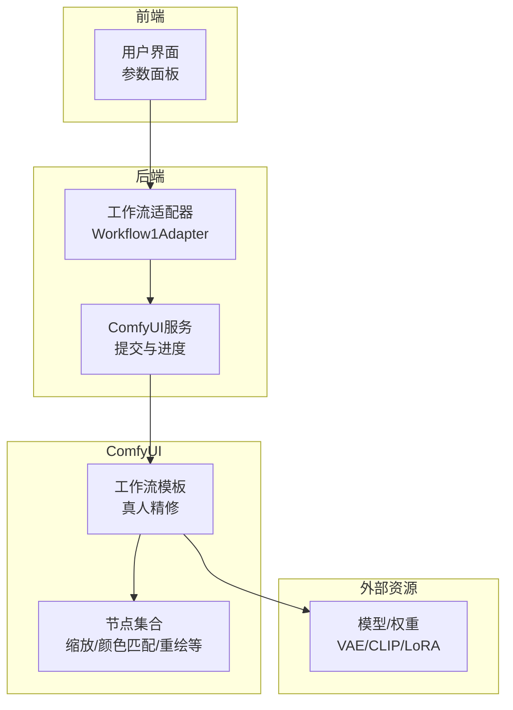
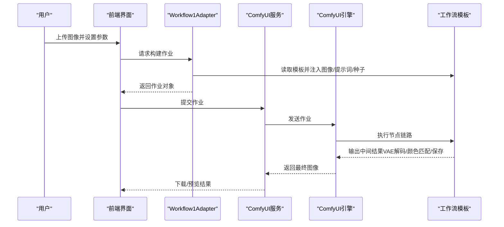
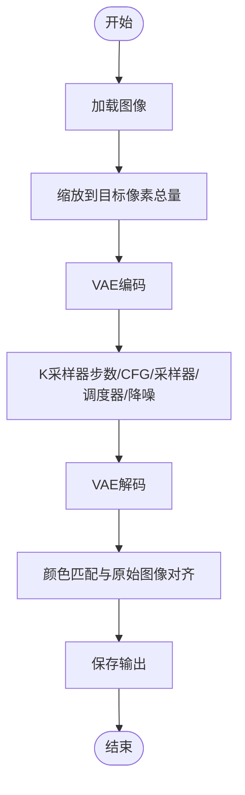
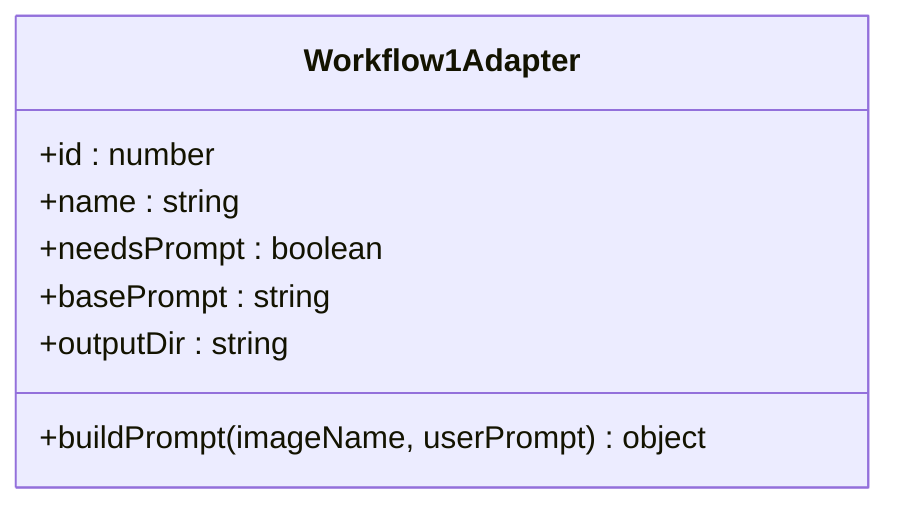
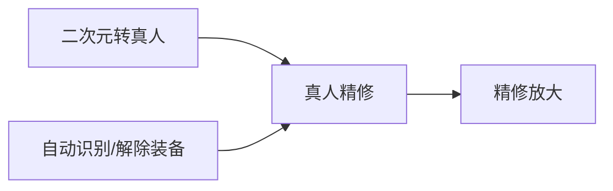
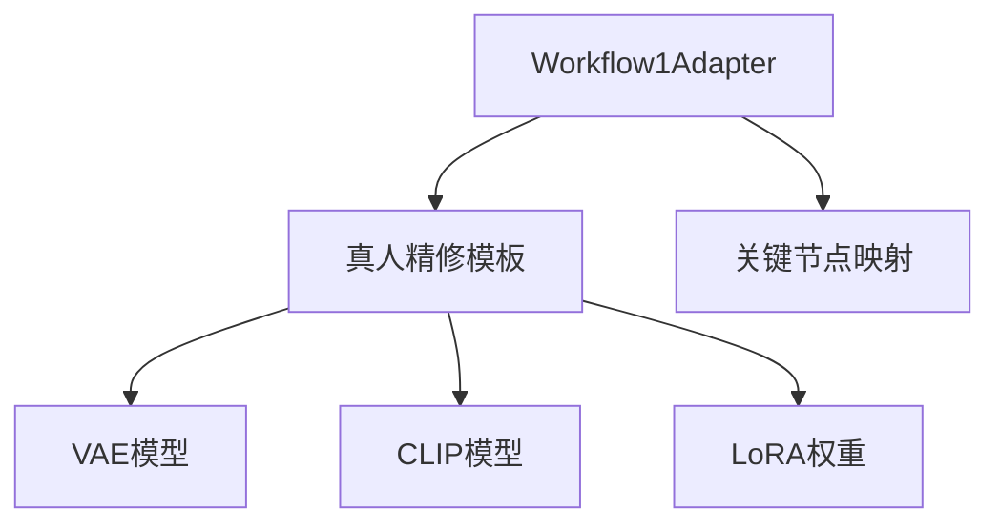

# 真人精修

<cite>
**本文引用的文件**
- [Pix2Real-真人精修.json](file://ComfyUI_API/Pix2Real-真人精修.json)
- [Pix2Real-👻真人精修NEW.json](file://ComfyUI_API/Pix2Real-👻真人精修NEW.json)
- [2-Pix2Real-精修放大.json](file://ComfyUI_API/2-Pix2Real-精修放大.json)
- [Pix2Real-高清重绘.json](file://ComfyUI_API/Pix2Real-高清重绘.json)
- [README.md](file://README.md)
- [Workflow1Adapter.ts](file://server/src/adapters/Workflow1Adapter.ts)
- [Workflow2Adapter.ts](file://server/src/adapters/Workflow2Adapter.ts)
- [Workflow3Adapter.ts](file://server/src/adapters/Workflow3Adapter.ts)
- [Workflow0Adapter.ts](file://server/src/adapters/Workflow0Adapter.ts)
- [Workflow2SettingsPanel.tsx](file://client/src/components/Workflow2SettingsPanel.tsx)
- [Workflow0SettingsPanel.tsx](file://client/src/components/Workflow0SettingsPanel.tsx)
- [Pix2Real-自动识别.json](file://ComfyUI_API/Pix2Real-自动识别.json)
- [Pix2Real-自动识别Fixed.json](file://ComfyUI_API/Pix2Real-自动识别Fixed.json)
- [Pix2Real-解除装备.json](file://ComfyUI_API/Pix2Real-解除装备.json)
- [Pix2Real-解除装备Fixed.json](file://ComfyUI_API/Pix2Real-解除装备Fixed.json)
</cite>

## 目录
1. [简介](#简介)
2. [项目结构](#项目结构)
3. [核心组件](#核心组件)
4. [架构总览](#架构总览)
5. [详细组件分析](#详细组件分析)
6. [依赖关系分析](#依赖关系分析)
7. [性能考量](#性能考量)
8. [故障排查指南](#故障排查指南)
9. [结论](#结论)
10. [附录](#附录)

## 简介
本技术文档围绕“真人精修”工作流展开，系统性阐述在高分辨率图像上进行修复与细节增强的技术原理与实现路径。工作流以ComfyUI工作流模板为核心，结合图像缩放、色彩校正、掩膜扩展与重绘等环节，形成从基础修复到高质量输出的完整管线。文档同时给出参数调优建议与与其他工作流的组合使用方法，帮助用户在不同场景下（如皮肤纹理改善、背景虚化、光照一致性）获得稳定且可控的输出质量。

## 项目结构
- 前端（React + Vite）负责用户交互、参数面板与工作流选择；后端（Express）负责将上传图像注入到ComfyUI工作流模板并提交执行。
- ComfyUI工作流模板位于ComfyUI_API目录，按功能划分为多个JSON模板，其中“真人精修”模板用于高分辨率真人图像的细节增强与修复。
- 适配器（Adapter）模式将通用模板与具体节点参数绑定，实现“按需修改节点”的轻量扩展。

图表来源
- [README.md:41-62](file://README.md#L41-L62)
- [Workflow1Adapter.ts:16-34](file://server/src/adapters/Workflow1Adapter.ts#L16-L34)
- [Pix2Real-真人精修.json:14-369](file://ComfyUI_API/Pix2Real-真人精修.json#L14-L369)

章节来源
- [README.md:41-79](file://README.md#L41-L79)
- [Workflow1Adapter.ts:1-35](file://server/src/adapters/Workflow1Adapter.ts#L1-L35)

## 核心组件
- 工作流模板（真人精修）
  - 节点构成：图像加载、VAE编码/解码、CLIP文本编码（正/负）、K采样器、图像缩放（像素总量）、颜色匹配、保存图像等。
  - 关键参数：采样步数、CFG、采样器与调度器、降噪强度、VAE与模型选择等。
- 适配器（Workflow1Adapter）
  - 功能：读取模板、注入上传图像名称、拼接并设置正向提示词、随机化种子，返回可提交的作业对象。
- 参数面板（前端）
  - 用户可通过界面调整提示词、种子等参数，适配器在构建作业时会覆盖模板中的对应节点。

章节来源
- [Pix2Real-真人精修.json:14-369](file://ComfyUI_API/Pix2Real-真人精修.json#L14-L369)
- [Workflow1Adapter.ts:16-34](file://server/src/adapters/Workflow1Adapter.ts#L16-L34)

## 架构总览
真人精修工作流的执行链路如下：

图表来源
- [Workflow1Adapter.ts:16-34](file://server/src/adapters/Workflow1Adapter.ts#L16-L34)
- [Pix2Real-真人精修.json:14-369](file://ComfyUI_API/Pix2Real-真人精修.json#L14-L369)

## 详细组件分析

### 组件A：真人精修工作流（ComfyUI节点级）
- 输入与预处理
  - 加载图像节点：将上传图像注入到模板中，作为后续处理的起点。
  - 图像缩放（像素总量）：以lanczos插值方式将输入图像缩放到指定总像素数，便于后续高分辨率细节增强。
- 语义与风格控制
  - CLIP文本编码（正/负）：正向提示词强调“真实感、高分辨率、细节丰富”，负向提示词抑制低质量、伪影等。
  - K采样器：设置采样步数、CFG、采样器与调度器、降噪强度等，控制生成过程的稳定性与细节保留。
- 颜色与光照一致性
  - 图像颜色匹配：将生成结果与原始图像在颜色分布上对齐，避免色调漂移，提升整体一致性。
- 后处理与输出
  - VAE解码与保存：将潜在空间样本解码为图像并保存，支持对比查看。

图表来源
- [Pix2Real-真人精修.json:14-369](file://ComfyUI_API/Pix2Real-真人精修.json#L14-L369)

章节来源
- [Pix2Real-真人精修.json:14-369](file://ComfyUI_API/Pix2Real-真人精修.json#L14-L369)

### 组件B：真人精修适配器（后端）
- 模板注入策略
  - 将上传图像名称写入加载图像节点。
  - 将拼接后的提示词写入正向CLIP文本编码节点。
  - 随机化种子节点，确保每次运行结果多样性。
- 输出
  - 返回完整的作业对象，供ComfyUI服务提交执行。

图表来源
- [Workflow1Adapter.ts:9-34](file://server/src/adapters/Workflow1Adapter.ts#L9-L34)

章节来源
- [Workflow1Adapter.ts:16-34](file://server/src/adapters/Workflow1Adapter.ts#L16-L34)

### 组件C：参数与调优建议
- 采样步数与CFG
  - 步数影响细节保留与稳定性；CFG控制提示词影响力。建议在保持稳定的同时适度提高步数以增强细节。
- 采样器与调度器
  - 使用适合高分辨率细节增强的采样器与Karras调度器，有助于抑制伪影并提升细节。
- 降噪强度
  - 适度降噪可减少噪声残留，但过低可能导致细节模糊；建议根据图像噪声水平微调。
- 缩放策略
  - 使用lanczos插值保证缩放质量；合理设置目标像素总量以平衡显存与细节。
- 颜色匹配
  - 在颜色匹配阶段选择合适的匹配方法，避免过度平滑导致细节丢失。

章节来源
- [Pix2Real-真人精修.json:14-369](file://ComfyUI_API/Pix2Real-真人精修.json#L14-L369)

### 组件D：与其他工作流的组合使用
- 二次元转真人（Workflow0）
  - 先用二次元转真人工作流将动漫风格图像转为写实风格，再接入真人精修工作流进行细节增强。
- 精修放大（Workflow2）
  - 在真人精修之后，使用精修放大工作流进一步提升分辨率与细节，适合需要更高像素输出的场景。
- 自动识别与解除装备
  - 在真人精修前，先用自动识别工作流生成人体部位掩膜，再用解除装备工作流对特定部位进行精细化处理（如去除装备），最后回到真人精修流程进行统一增强。

图表来源
- [Workflow0Adapter.ts:16-33](file://server/src/adapters/Workflow0Adapter.ts#L16-L33)
- [Workflow1Adapter.ts:16-34](file://server/src/adapters/Workflow1Adapter.ts#L16-L34)
- [Workflow2Adapter.ts:16-26](file://server/src/adapters/Workflow2Adapter.ts#L16-L26)
- [Pix2Real-自动识别.json:1-139](file://ComfyUI_API/Pix2Real-自动识别.json#L1-L139)
- [Pix2Real-解除装备.json:67-122](file://ComfyUI_API/Pix2Real-解除装备.json#L67-L122)

章节来源
- [Workflow0Adapter.ts:16-33](file://server/src/adapters/Workflow0Adapter.ts#L16-L33)
- [Workflow2Adapter.ts:16-26](file://server/src/adapters/Workflow2Adapter.ts#L16-L26)
- [Pix2Real-自动识别.json:1-139](file://ComfyUI_API/Pix2Real-自动识别.json#L1-L139)
- [Pix2Real-解除装备.json:67-122](file://ComfyUI_API/Pix2Real-解除装备.json#L67-L122)

## 依赖关系分析
- 适配器与模板的耦合
  - 适配器通过读取模板并定位关键节点（如加载图像、CLIP文本编码、种子）进行参数注入，耦合度低、扩展性强。
- 外部依赖
  - 模板依赖特定模型权重与VAE；前端参数面板通过本地存储持久化用户偏好，减少重复配置成本。

图表来源
- [Workflow1Adapter.ts:16-34](file://server/src/adapters/Workflow1Adapter.ts#L16-L34)
- [Pix2Real-真人精修.json:14-369](file://ComfyUI_API/Pix2Real-真人精修.json#L14-L369)

章节来源
- [Workflow1Adapter.ts:16-34](file://server/src/adapters/Workflow1Adapter.ts#L16-L34)
- [Pix2Real-真人精修.json:14-369](file://ComfyUI_API/Pix2Real-真人精修.json#L14-L369)

## 性能考量
- 显存与分辨率
  - 缩放策略与VAE解码的分块/重叠参数直接影响显存占用；在保证质量的前提下，适当降低目标像素或启用分块解码可缓解显存压力。
- 采样步数与降噪
  - 步数越高、降噪越低通常意味着更长的处理时间与更高的细节保留；应根据硬件能力与时间预算折中选择。
- 颜色匹配与对比
  - 颜色匹配会引入额外计算；若图像光照差异较大，建议先做局部曝光/白平衡预处理，减少颜色匹配负担。

## 故障排查指南
- 图像未正确加载
  - 检查适配器是否成功将图像名称注入到模板的加载节点；确认文件路径与权限。
- 输出质量不佳
  - 调整采样步数、CFG、降噪强度；检查提示词是否与目标风格一致；必要时增加颜色匹配强度。
- 显存不足
  - 降低目标像素总量、启用VAE分块解码、缩短采样步数或更换更高效的采样器。
- 掩膜与局部处理问题
  - 自动识别与解除装备工作流的掩膜参数（扩展、模糊、相减）需与真人精修流程衔接；建议先保存中间掩膜进行验证。

章节来源
- [Pix2Real-真人精修.json:14-369](file://ComfyUI_API/Pix2Real-真人精修.json#L14-L369)
- [Pix2Real-自动识别.json:1-139](file://ComfyUI_API/Pix2Real-自动识别.json#L1-L139)
- [Pix2Real-解除装备.json:67-122](file://ComfyUI_API/Pix2Real-解除装备.json#L67-L122)

## 结论
真人精修工作流通过“高分辨率缩放 + 语义提示控制 + 颜色匹配”的组合，在保持真实感与细节的同时，有效抑制伪影并提升整体一致性。配合自动识别与解除装备等前置处理，可在复杂场景（如皮肤纹理、背景虚化、光照一致性）中实现可控的参数调优与稳定的输出质量。通过与其他工作流的串联，可形成从风格转换到细节增强再到超分辨率输出的完整管线。

## 附录
- 术语
  - VAE：变分自编码器，用于图像编码与解码。
  - CLIP：多模态文本-图像嵌入模型，用于提示词编码。
  - K采样器：扩散模型采样器，决定生成过程的稳定性与细节。
- 参考文件
  - [README.md:64-79](file://README.md#L64-L79)
  - [Workflow2SettingsPanel.tsx:1-59](file://client/src/components/Workflow2SettingsPanel.tsx#L1-L59)
  - [Workflow0SettingsPanel.tsx:1-58](file://client/src/components/Workflow0SettingsPanel.tsx#L1-L58)