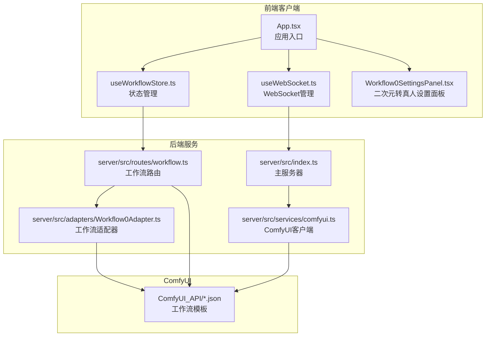
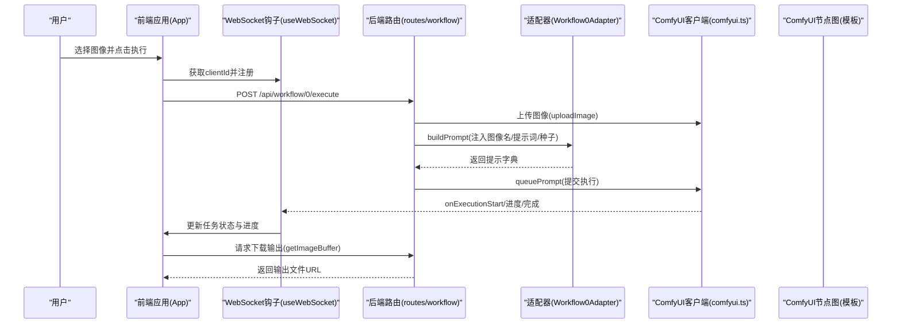
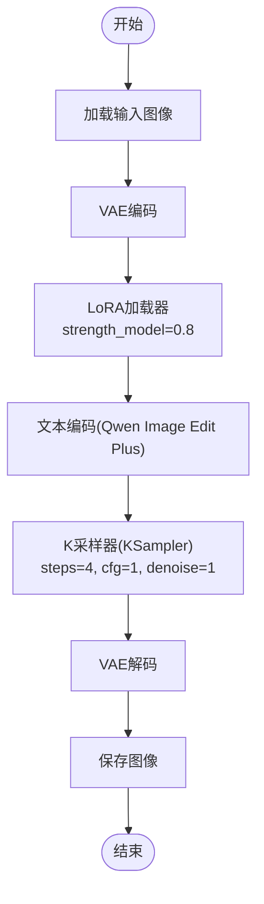
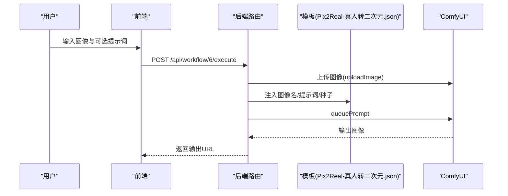
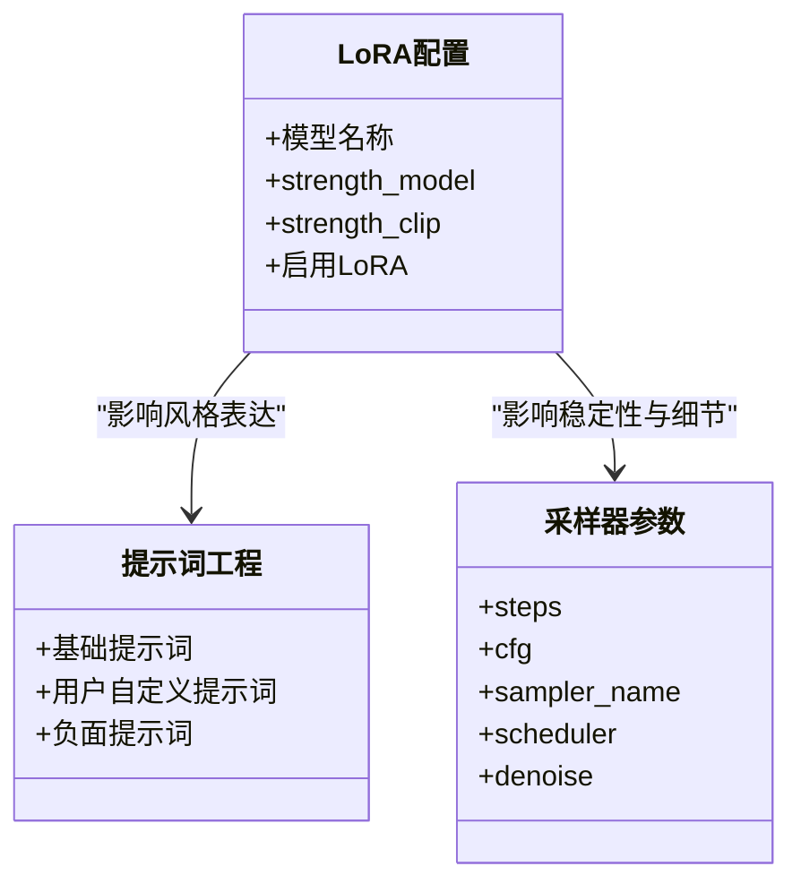
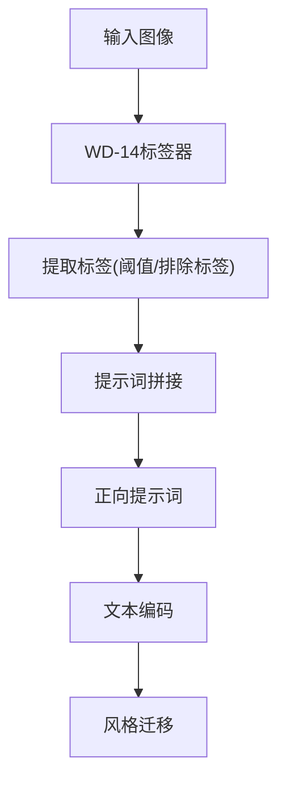
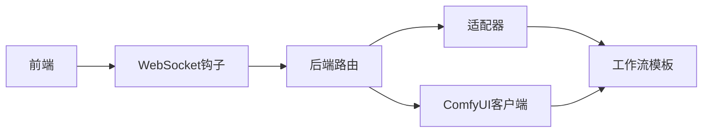

# 真人转二次元

<cite>
**本文引用的文件**
- [README.md](file://README.md)
- [package.json](file://package.json)
- [Pix2Real-真人转二次元.json](file://ComfyUI_API/Pix2Real-真人转二次元.json)
- [Pix2Real-二次元转真人.json](file://ComfyUI_API/Pix2Real-二次元转真人.json)
- [Ghost-二次元转真人(NoUnload).json](file://ComfyUI_API/👻二次元转真人(NoUnload).json)
- [server/src/index.ts](file://server/src/index.ts)
- [server/src/services/comfyui.ts](file://server/src/services/comfyui.ts)
- [server/src/adapters/Workflow0Adapter.ts](file://server/src/adapters/Workflow0Adapter.ts)
- [server/src/routes/workflow.ts](file://server/src/routes/workflow.ts)
- [client/src/hooks/useWorkflowStore.ts](file://client/src/hooks/useWorkflowStore.ts)
- [client/src/hooks/useWebSocket.ts](file://client/src/hooks/useWebSocket.ts)
- [client/src/components/App.tsx](file://client/src/components/App.tsx)
- [client/src/components/Workflow0SettingsPanel.tsx](file://client/src/components/Workflow0SettingsPanel.tsx)
</cite>

## 目录
1. [简介](#简介)
2. [项目结构](#项目结构)
3. [核心组件](#核心组件)
4. [架构总览](#架构总览)
5. [详细组件分析](#详细组件分析)
6. [依赖关系分析](#依赖关系分析)
7. [性能考量](#性能考量)
8. [故障排查指南](#故障排查指南)
9. [结论](#结论)
10. [附录](#附录)

## 简介
本项目为“真人转二次元”工作流的技术文档，聚焦于基于 ComfyUI 的图像风格转换实现，重点覆盖以下方面：
- 风格转换的技术原理与实现路径：以 LoRA 模型与文本/视觉编码器为核心，结合采样器与 VAE 进行图像重构。
- 工作流执行链路：前端上传图像，后端适配模板并注入参数，ComfyUI 执行节点图，实时进度通过 WebSocket 返回。
- 多动漫风格参数配置与效果差异：通过 LoRA 强度、提示词、采样步数、CFG 值等参数控制风格强度与细节保留。
- 面部特征保护与细节保持策略：通过提示词工程、LoRA 强度调节、降噪策略与分辨率控制实现高质量输出。
- 处理时间与质量权衡：在采样步数、LoRA 强度、分辨率与提示词复杂度之间进行参数优化。

## 项目结构
项目采用前后端分离架构，前端负责用户交互与任务调度，后端负责与 ComfyUI 的通信与工作流适配，ComfyUI 负责具体的节点执行与图像生成。

图表来源
- [client/src/components/App.tsx:54-334](file://client/src/components/App.tsx#L54-L334)
- [client/src/hooks/useWebSocket.ts:10-98](file://client/src/hooks/useWebSocket.ts#L10-L98)
- [client/src/hooks/useWorkflowStore.ts:96-644](file://client/src/hooks/useWorkflowStore.ts#L96-L644)
- [client/src/components/Workflow0SettingsPanel.tsx:9-57](file://client/src/components/Workflow0SettingsPanel.tsx#L9-L57)
- [server/src/index.ts:42-227](file://server/src/index.ts#L42-L227)
- [server/src/routes/workflow.ts:312-355](file://server/src/routes/workflow.ts#L312-L355)
- [server/src/services/comfyui.ts:47-60](file://server/src/services/comfyui.ts#L47-L60)
- [server/src/adapters/Workflow0Adapter.ts:16-33](file://server/src/adapters/Workflow0Adapter.ts#L16-L33)

章节来源
- [README.md:41-79](file://README.md#L41-L79)
- [package.json:4-9](file://package.json#L4-L9)

## 核心组件
- 前端应用与状态管理
  - 应用入口负责拖拽上传、标签页切换与主区域渲染；状态管理包含任务队列、进度、输出索引等。
  - WebSocket 单例连接，统一接收 ComfyUI 的进度与完成事件。
- 后端服务与适配器
  - 路由层根据工作流 ID 选择模板并注入参数，支持单图与批量执行。
  - 适配器负责解析模板、替换输入节点（如图像名、提示词、种子），并返回可执行的 ComfyUI 提示字典。
  - ComfyUI 客户端封装上传、排队、历史查询与二进制图像下载。
- ComfyUI 工作流模板
  - 二次元转真人与真人转二次元分别对应不同的节点图，前者侧重 LoRA 强度与提示词，后者侧重 WD-14 自动标签与提示词拼接。

章节来源
- [client/src/components/App.tsx:54-334](file://client/src/components/App.tsx#L54-L334)
- [client/src/hooks/useWorkflowStore.ts:96-644](file://client/src/hooks/useWorkflowStore.ts#L96-L644)
- [client/src/hooks/useWebSocket.ts:10-98](file://client/src/hooks/useWebSocket.ts#L10-L98)
- [server/src/routes/workflow.ts:312-355](file://server/src/routes/workflow.ts#L312-L355)
- [server/src/adapters/Workflow0Adapter.ts:16-33](file://server/src/adapters/Workflow0Adapter.ts#L16-L33)
- [server/src/services/comfyui.ts:47-60](file://server/src/services/comfyui.ts#L47-L60)

## 架构总览
下图展示从用户触发到 ComfyUI 执行再到结果回传的完整链路：

图表来源
- [server/src/routes/workflow.ts:312-355](file://server/src/routes/workflow.ts#L312-L355)
- [server/src/adapters/Workflow0Adapter.ts:16-33](file://server/src/adapters/Workflow0Adapter.ts#L16-L33)
- [server/src/services/comfyui.ts:47-60](file://server/src/services/comfyui.ts#L47-L60)
- [client/src/hooks/useWebSocket.ts:26-47](file://client/src/hooks/useWebSocket.ts#L26-L47)

## 详细组件分析

### 组件A：二次元转真人工作流（LoRA + 文本编码）
该工作流通过 LoRA 模型与文本/视觉编码器对输入图像进行风格迁移，目标是将二次元风格转换为写实照片风格。

图表来源
- [Ghost-二次元转真人(NoUnload).json](file://ComfyUI_API/👻二次元转真人(NoUnload).json#L1-L215)
- [server/src/adapters/Workflow0Adapter.ts:16-33](file://server/src/adapters/Workflow0Adapter.ts#L16-L33)

实现要点
- LoRA 强度：通过 LoRA 加载器的 strength_model 控制风格迁移强度，数值越高风格越强但可能失真。
- 文本提示词：结合基础提示词与用户自定义提示词，提升风格一致性与细节保留。
- 采样参数：较低的 steps 与 cfg 有助于稳定生成，配合 denoise=1 保证细节重建。
- VAE 编解码：确保潜空间与像素空间的一致性，避免伪影。

章节来源
- [server/src/adapters/Workflow0Adapter.ts:16-33](file://server/src/adapters/Workflow0Adapter.ts#L16-L33)
- [Ghost-二次元转真人(NoUnload).json](file://ComfyUI_API/👻二次元转真人(NoUnload).json#L18-L31)
- [Ghost-二次元转真人(NoUnload).json](file://ComfyUI_API/👻二次元转真人(NoUnload).json#L146-L175)

### 组件B：真人转二次元工作流（WD-14 自动标签 + 提示词拼接）
该工作流以 WD-14 标签器为基础，自动提取图像标签并拼接为正向提示词，再通过 ComfyUI 生成二次元风格图像。

图表来源
- [server/src/routes/workflow.ts:312-355](file://server/src/routes/workflow.ts#L312-L355)
- [Pix2Real-真人转二次元.json:1-323](file://ComfyUI_API/Pix2Real-真人转二次元.json#L1-L323)

实现要点
- WD-14 自动标签：当用户未提供提示词时，系统自动调用 WD-14 对输入图像进行标签提取，作为正向提示词。
- 提示词拼接：通过文本拼接节点将基础提示词与自动标签合并，形成更丰富的正向描述。
- 采样与降噪：通过 K 采样器的 steps、cfg、denoise 参数平衡速度与质量。

章节来源
- [server/src/routes/workflow.ts:312-355](file://server/src/routes/workflow.ts#L312-L355)
- [Pix2Real-真人转二次元.json:174-323](file://ComfyUI_API/Pix2Real-真人转二次元.json#L174-L323)

### 组件C：LoRA 模型与风格强度调节
LoRA 是风格迁移的关键模块，通过调整 LoRA 名称与强度参数，可以显著改变输出风格的强弱与细节表现。

图表来源
- [Ghost-二次元转真人(NoUnload).json](file://ComfyUI_API/👻二次元转真人(NoUnload).json#L18-L31)
- [server/src/adapters/Workflow0Adapter.ts:22-27](file://server/src/adapters/Workflow0Adapter.ts#L22-L27)

章节来源
- [Ghost-二次元转真人(NoUnload).json](file://ComfyUI_API/👻二次元转真人(NoUnload).json#L18-L31)
- [server/src/adapters/Workflow0Adapter.ts:22-27](file://server/src/adapters/Workflow0Adapter.ts#L22-L27)

### 组件D：提示词与风格特征提取
提示词工程是决定风格一致性与细节保留的核心。WD-14 自动标签器可将图像内容转化为标签，再与用户提示词拼接，形成更全面的正向描述。

图表来源
- [Pix2Real-真人转二次元.json:214-231](file://ComfyUI_API/Pix2Real-真人转二次元.json#L214-L231)
- [Pix2Real-真人转二次元.json:37-69](file://ComfyUI_API/Pix2Real-真人转二次元.json#L37-L69)

章节来源
- [Pix2Real-真人转二次元.json:214-231](file://ComfyUI_API/Pix2Real-真人转二次元.json#L214-L231)
- [Pix2Real-真人转二次元.json:37-69](file://ComfyUI_API/Pix2Real-真人转二次元.json#L37-L69)

### 组件E：处理时间与质量关系
处理时间与质量主要受以下因素影响：
- 采样步数(steps)：步数越多，质量越高但耗时越长。
- LoRA 强度：强度越高风格越明显，但过强可能导致细节丢失。
- 分辨率与缩放：输入分辨率越高，生成质量越好但显存与时间成本更高。
- 提示词复杂度：复杂的提示词会增加推理负担，但能提升风格一致性。

章节来源
- [Ghost-二次元转真人(NoUnload).json](file://ComfyUI_API/👻二次元转真人(NoUnload).json#L146-L175)
- [server/src/adapters/Workflow0Adapter.ts:22-27](file://server/src/adapters/Workflow0Adapter.ts#L22-L27)

## 依赖关系分析
后端通过适配器与路由层解耦具体工作流模板，前端通过 WebSocket 与后端进行实时通信，整体依赖关系如下：

图表来源
- [client/src/hooks/useWebSocket.ts:10-98](file://client/src/hooks/useWebSocket.ts#L10-L98)
- [server/src/routes/workflow.ts:312-355](file://server/src/routes/workflow.ts#L312-L355)
- [server/src/adapters/Workflow0Adapter.ts:16-33](file://server/src/adapters/Workflow0Adapter.ts#L16-L33)
- [server/src/services/comfyui.ts:47-60](file://server/src/services/comfyui.ts#L47-L60)

章节来源
- [server/src/index.ts:63-219](file://server/src/index.ts#L63-L219)
- [server/src/services/comfyui.ts:127-188](file://server/src/services/comfyui.ts#L127-L188)

## 性能考量
- 显存与内存管理
  - 后端提供释放内存工作流，可在长时间运行后清理显存与内存，避免 OOM。
  - 前端可查询系统统计信息，监控 VRAM 与 RAM 使用情况。
- 并发与队列
  - 支持批量执行与队列优先级调整，便于在多任务场景下优化吞吐。
- 参数优化建议
  - 初次尝试：steps=20~28，cfg=6，LoRA 强度 0.6~0.8，denoise 0.3~0.5。
  - 追求细节：steps 提升至 30+，LoRA 强度下调至 0.5~0.7，适当降低 denoise。
  - 快速预览：steps 降至 12~18，LoRA 强度 0.8~1.0，denoise 0.6~0.8。

章节来源
- [server/src/routes/workflow.ts:542-579](file://server/src/routes/workflow.ts#L542-L579)
- [server/src/services/comfyui.ts:106-125](file://server/src/services/comfyui.ts#L106-L125)

## 故障排查指南
- WebSocket 连接失败
  - 检查后端 WebSocket 服务是否启动，确认浏览器与后端端口一致。
  - 查看前端控制台错误与后端日志中的连接状态。
- ComfyUI 不可用
  - 确认 ComfyUI 服务地址与端口正确，后端默认连接 http://127.0.0.1:8188。
  - 使用系统统计接口检查 ComfyUI 是否在线。
- 图像上传失败
  - 确认上传文件大小与类型符合要求，后端 JSON 解析限制为 50MB。
- 任务卡住或无进度
  - 检查队列状态与优先级调整，必要时取消并重新排队。
- 输出缺失
  - 确认保存节点配置与输出目录权限，检查后端下载逻辑与会话存储路径。

章节来源
- [server/src/index.ts:63-219](file://server/src/index.ts#L63-L219)
- [server/src/services/comfyui.ts:127-188](file://server/src/services/comfyui.ts#L127-L188)
- [server/src/routes/workflow.ts:522-540](file://server/src/routes/workflow.ts#L522-L540)

## 结论
本项目通过前端状态管理与 WebSocket 实时反馈、后端适配器与路由层的模板注入机制，以及 ComfyUI 的节点图执行能力，实现了高效的“真人转二次元”工作流。LoRA 模型与提示词工程是风格迁移的关键，通过合理调节采样参数与分辨率，可以在处理时间与质量之间取得良好平衡。建议在实际使用中结合具体需求进行参数微调，并利用释放内存与队列管理功能提升整体效率。

## 附录
- 快速开始
  - 安装依赖并启动开发环境：npm run dev
  - 确保 ComfyUI 在 http://localhost:8188 运行
  - 访问 http://localhost:5173，拖入图像并选择工作流执行
- 常用工作流
  - 二次元转真人：基于 LoRA 与文本编码的风格转换
  - 真人转二次元：基于 WD-14 自动标签与提示词拼接的风格生成

章节来源
- [README.md:21-39](file://README.md#L21-L39)
- [package.json:4-9](file://package.json#L4-L9)