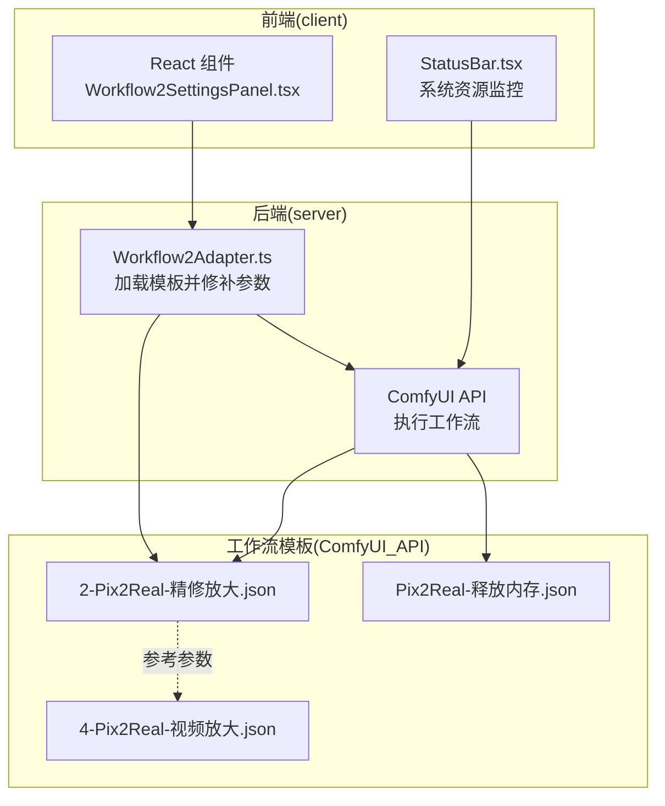
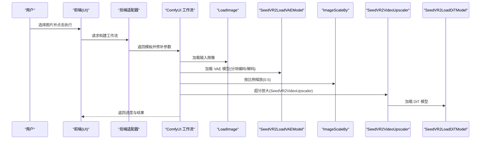
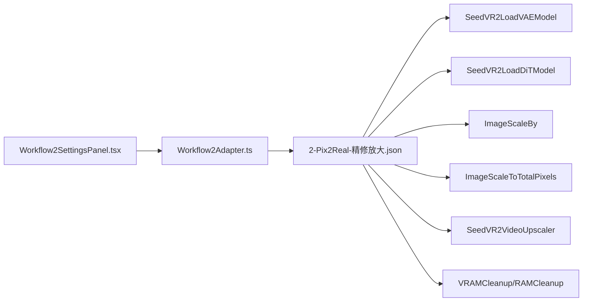

# 精修放大

<cite>
**本文引用的文件**
- [README.md](file://README.md)
- [2-Pix2Real-精修放大.json](file://ComfyUI_API/2-Pix2Real-精修放大.json)
- [Pix2Real-释放内存.json](file://ComfyUI_API/Pix2Real-释放内存.json)
- [Pix2Real-换面.json](file://ComfyUI_API/Pix2Real-换面.json)
- [Workflow2Adapter.ts](file://server/src/adapters/Workflow2Adapter.ts)
- [Workflow2SettingsPanel.tsx](file://client/src/components/Workflow2SettingsPanel.tsx)
- [StatusBar.tsx](file://client/src/components/StatusBar.tsx)
- [4-Pix2Real-视频放大.json](file://ComfyUI_API/4-Pix2Real-视频放大.json)
</cite>

## 目录
1. [简介](#简介)
2. [项目结构](#项目结构)
3. [核心组件](#核心组件)
4. [架构总览](#架构总览)
5. [详细组件分析](#详细组件分析)
6. [依赖关系分析](#依赖关系分析)
7. [性能考量](#性能考量)
8. [故障排查指南](#故障排查指南)
9. [结论](#结论)
10. [附录](#附录)

## 简介
本文件面向“精修放大”工作流，系统化阐述基于 ComfyUI 的超分辨率处理流程与实现要点，重点覆盖：
- 图像放大算法与细节重建技术
- ImageScaleToTotalPixels 节点的 megapixels 与 resolution_steps 配置与工作机制
- 放大过程中的清晰度保持与伪影控制策略
- 不同放大倍数下的参数优化建议（速度与质量平衡）
- 内存与显存管理策略及大图像处理最佳实践

该工作流通过前端 UI 触发后端适配器加载模板工作流，动态注入输入图像与随机种子，交由 ComfyUI 执行超分链路，并支持实时系统资源监控与显存回收。

## 项目结构
项目采用前后端分离架构，前端负责交互与状态管理，后端以适配器模式加载 ComfyUI 工作流模板并按需修补节点参数，最终通过 ComfyUI API 执行任务。

图表来源
- [Workflow2Adapter.ts:1-27](file://server/src/adapters/Workflow2Adapter.ts#L1-L27)
- [2-Pix2Real-精修放大.json:1-146](file://ComfyUI_API/2-Pix2Real-精修放大.json#L1-L146)
- [Pix2Real-释放内存.json:1-39](file://ComfyUI_API/Pix2Real-释放内存.json#L1-L39)
- [4-Pix2Real-视频放大.json:115-195](file://ComfyUI_API/4-Pix2Real-视频放大.json#L115-L195)

章节来源
- [README.md:41-79](file://README.md#L41-L79)
- [Workflow2Adapter.ts:1-27](file://server/src/adapters/Workflow2Adapter.ts#L1-L27)

## 核心组件
- 前端设置面板：提供放大模型选择（SeedVR2/Klein/SD），并持久化到本地存储。
- 后端适配器：读取精修放大模板，注入上传图像名与随机种子，返回可执行工作流。
- ComfyUI 工作流：包含图像加载、VAE 模型加载、图像缩放（按比例与按像素）、超分放大（SeedVR2VideoUpscaler）等节点。
- 显存/内存清理：提供 RAMCleanup 与 VRAMCleanup 节点，便于在任务间或失败后回收资源。

章节来源
- [Workflow2SettingsPanel.tsx:1-58](file://client/src/components/Workflow2SettingsPanel.tsx#L1-L58)
- [Workflow2Adapter.ts:16-26](file://server/src/adapters/Workflow2Adapter.ts#L16-L26)
- [2-Pix2Real-精修放大.json:57-146](file://ComfyUI_API/2-Pix2Real-精修放大.json#L57-L146)
- [Pix2Real-释放内存.json:1-39](file://ComfyUI_API/Pix2Real-释放内存.json#L1-L39)

## 架构总览
下图展示从用户触发到 ComfyUI 执行的端到端流程，以及关键节点之间的数据流与控制流。

图表来源
- [2-Pix2Real-精修放大.json:57-146](file://ComfyUI_API/2-Pix2Real-精修放大.json#L57-L146)
- [Workflow2Adapter.ts:16-26](file://server/src/adapters/Workflow2Adapter.ts#L16-L26)

## 详细组件分析

### ImageScaleToTotalPixels 节点：megapixels 与 resolution_steps
- 功能定位
  - 将输入图像缩放到指定总像素数（以百万像素为单位），用于控制目标分辨率与计算负载。
- 关键参数
  - megapixels：目标总像素数（百万像素）。例如 1 表示 100 万像素，1.5 表示 150 万像素。
  - resolution_steps：分辨率步进次数，用于在目标像素附近进行迭代调整，以获得更接近整数分辨率的尺寸。
- 工作机制
  - 计算当前宽高乘积，与目标 megapixels 对应的面积比较，按比例缩放至目标像素总数。
  - resolution_steps 会进行多次迭代微调，使最终输出分辨率尽可能满足整数约束且接近目标像素数。
- 在精修放大中的应用
  - 通常先对输入进行按比例缩放（如 0.5），再用 ImageScaleToTotalPixels 调整到目标分辨率（如 2048），以平衡清晰度与显存占用。
- 典型配置参考
  - 在“换面”工作流中可见类似配置，便于对比与迁移使用。

章节来源
- [2-Pix2Real-精修放大.json:85-98](file://ComfyUI_API/2-Pix2Real-精修放大.json#L85-L98)
- [Pix2Real-换面.json:213-225](file://ComfyUI_API/Pix2Real-换面.json#L213-L225)
- [Pix2Real-换面.json:334-344](file://ComfyUI_API/Pix2Real-换面.json#L334-L344)

### SeedVR2VideoUpscaler：超分辨率处理与细节重建
- 输入
  - image：经缩放后的低分辨率图像
  - dit：DiT 模型（用于扩散过程）
  - vae：VAE 模型（用于编码/解码潜空间）
- 关键参数与影响
  - resolution：目标分辨率上限（如 2048），用于控制输出尺寸
  - max_resolution：最大分辨率限制（如 0 表示不限制）
  - batch_size：批大小，影响吞吐与显存占用
  - color_correction：颜色校正模式（如 lab），有助于保持色彩一致性
  - temporal_overlap：时间重叠（视频场景），图像放大时通常为 0
  - latent_noise_scale/input_noise_scale：潜空间/输入噪声尺度，用于控制细节与稳定性
  - offload_device：模型/缓存卸载设备（如 cpu），缓解显存压力
- 细节重建与质量保持
  - 使用高质量上采样核（如 Lanczos）与分块编码/解码（见 VAE 节点）提升细节与稳定性
  - 合理设置 batch_size 与 offload_device，避免 OOM 并维持稳定输出
- 与视频放大的差异
  - 视频放大工作流在分辨率与批大小上有不同默认值，但核心节点与参数语义一致。

章节来源
- [2-Pix2Real-精修放大.json:99-125](file://ComfyUI_API/2-Pix2Real-精修放大.json#L99-L125)
- [4-Pix2Real-视频放大.json:115-141](file://ComfyUI_API/4-Pix2Real-视频放大.json#L115-L141)

### VAE 模型加载：分块编码/解码与显存优化
- encode_tiled/decode_tiled：启用分块编码/解码，降低单次处理所需显存
- tile_size/overlap：分块大小与重叠，平衡显存占用与边缘伪影
- offload_device：将模型/缓存卸载到 CPU，进一步缓解显存压力
- tile_debug：调试开关，便于观察分块边界

章节来源
- [2-Pix2Real-精修放大.json:66-84](file://ComfyUI_API/2-Pix2Real-精修放大.json#L66-L84)
- [4-Pix2Real-视频放大.json:176-194](file://ComfyUI_API/4-Pix2Real-视频放大.json#L176-L194)

### DiT 模型加载：设备与注意力模式
- device：模型所在设备（如 cuda:0）
- blocks_to_swap：块交换数量，用于控制模型分块与显存占用
- swap_io_components：IO 组件交换，配合分块策略
- attention_mode/cache_model：注意力计算模式与缓存策略，影响性能与显存

章节来源
- [2-Pix2Real-精修放大.json:131-145](file://ComfyUI_API/2-Pix2Real-精修放大.json#L131-L145)
- [4-Pix2Real-视频放大.json:161-175](file://ComfyUI_API/4-Pix2Real-视频放大.json#L161-L175)

### 图像缩放：按比例与按像素
- ImageScaleBy：按比例缩放（如 0.5），常用于降低分辨率以减少显存占用
- ImageScaleToTotalPixels：按总像素数缩放，确保输出达到目标分辨率
- 推荐流程
  - 先按比例缩放（如 0.5），再按像素数调整到目标分辨率，最后进行超分放大

章节来源
- [2-Pix2Real-精修放大.json:85-125](file://ComfyUI_API/2-Pix2Real-精修放大.json#L85-L125)

### 显存/内存清理：VRAMCleanup 与 RAMCleanup
- VRAMCleanup：释放显存缓存与模型，适合在任务完成后或失败后执行
- RAMCleanup：清理文件缓存、进程与 DLL，辅助释放系统内存
- 前端状态栏：周期性轮询 ComfyUI 系统统计，显示 VRAM/内存变化，便于监控资源使用

章节来源
- [Pix2Real-释放内存.json:1-39](file://ComfyUI_API/Pix2Real-释放内存.json#L1-L39)
- [StatusBar.tsx:69-102](file://client/src/components/StatusBar.tsx#L69-L102)

## 依赖关系分析
- 前端设置面板与后端适配器通过本地存储与请求交互，适配器负责将模板工作流转换为可执行任务
- 工作流内部节点之间存在强依赖：VAE/DiT 模型加载必须在放大前完成；图像缩放节点在放大之前执行
- 显存/内存清理节点作为工作流的一部分，可在任务前后执行，保障资源可用性

图表来源
- [Workflow2SettingsPanel.tsx:1-58](file://client/src/components/Workflow2SettingsPanel.tsx#L1-L58)
- [Workflow2Adapter.ts:16-26](file://server/src/adapters/Workflow2Adapter.ts#L16-L26)
- [2-Pix2Real-精修放大.json:57-146](file://ComfyUI_API/2-Pix2Real-精修放大.json#L57-L146)
- [Pix2Real-释放内存.json:1-39](file://ComfyUI_API/Pix2Real-释放内存.json#L1-L39)

## 性能考量
- 分块策略
  - VAE 编码/解码启用分块（encode_tiled/decode_tiled），并设置 tile_size 与 overlap，可显著降低显存峰值
- 批大小与设备卸载
  - 合理设置 batch_size，必要时开启 offload_device，避免 OOM
- 上采样核与缩放顺序
  - 使用高质量上采样核（如 Lanczos），先按比例缩放再按像素调整，有助于细节重建与伪影控制
- 资源监控与回收
  - 利用前端状态栏监控 VRAM/内存，任务完成后执行 VRAMCleanup/RAMCleanup，保持系统稳定

章节来源
- [2-Pix2Real-精修放大.json:66-125](file://ComfyUI_API/2-Pix2Real-精修放大.json#L66-L125)
- [StatusBar.tsx:69-102](file://client/src/components/StatusBar.tsx#L69-L102)

## 故障排查指南
- 显存不足（OOM）
  - 降低 batch_size 或启用 offload_device
  - 减小 resolution/max_resolution
  - 减小 tile_size 或增大 tile_overlap，平衡显存与边缘质量
- 输出模糊或伪影明显
  - 提高 megapixels 或增加 resolution_steps，使输出分辨率更接近目标
  - 使用高质量上采样核（如 Lanczos），并适当提高 color_correction 的强度
- 进度卡顿或长时间无响应
  - 检查 VRAM/内存使用，必要时执行 VRAMCleanup/RAMCleanup
  - 确认 ComfyUI 服务运行正常，WebSocket 连接稳定

章节来源
- [2-Pix2Real-精修放大.json:66-125](file://ComfyUI_API/2-Pix2Real-精修放大.json#L66-L125)
- [Pix2Real-释放内存.json:1-39](file://ComfyUI_API/Pix2Real-释放内存.json#L1-L39)
- [StatusBar.tsx:69-102](file://client/src/components/StatusBar.tsx#L69-L102)

## 结论
精修放大工作流通过“按比例缩放 + 按像素调整 + 超分放大”的组合策略，在保证图像细节与色彩一致性的同时，有效控制显存占用与处理时长。ImageScaleToTotalPixels 的 megapixels 与 resolution_steps 是实现“目标分辨率精确控制”的关键；结合 VAE 的分块编码/解码、DiT 的设备与注意力模式配置，以及合理的批大小与卸载策略，可在不同硬件条件下取得稳定的质量与性能平衡。配合前端资源监控与显存/内存清理节点，可进一步提升系统的可靠性与用户体验。

## 附录

### 参数优化建议（不同放大倍数）
- 低倍率（约 2×）
  - megapixels：根据目标分辨率设定，如 2048 对应约 400 万像素
  - resolution_steps：1~2，确保输出分辨率稳定
  - batch_size：较大（如 5），提升吞吐
  - offload_device：关闭或保留默认
- 中倍率（约 4×）
  - megapixels：适度提高，如 2048 对应约 800 万像素
  - resolution_steps：2~3，增强分辨率逼近精度
  - batch_size：中等（如 3~4），平衡显存与速度
  - offload_device：按需开启
- 高倍率（约 8×）
  - megapixels：大幅提高，如 2048 对应约 1600 万像素
  - resolution_steps：3~4，确保整数分辨率
  - batch_size：较小（如 1~2），避免 OOM
  - offload_device：开启，必要时增大 tile_size/overlap

章节来源
- [2-Pix2Real-精修放大.json:85-125](file://ComfyUI_API/2-Pix2Real-精修放大.json#L85-L125)
- [4-Pix2Real-视频放大.json:115-141](file://ComfyUI_API/4-Pix2Real-视频放大.json#L115-L141)