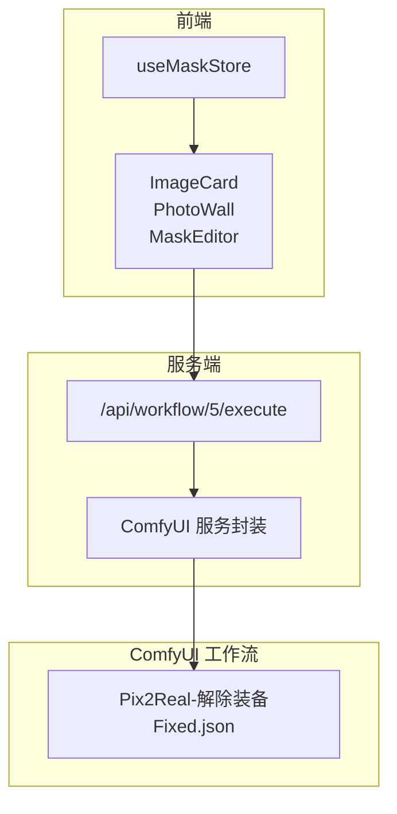
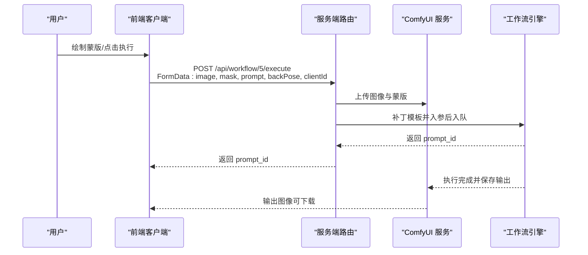
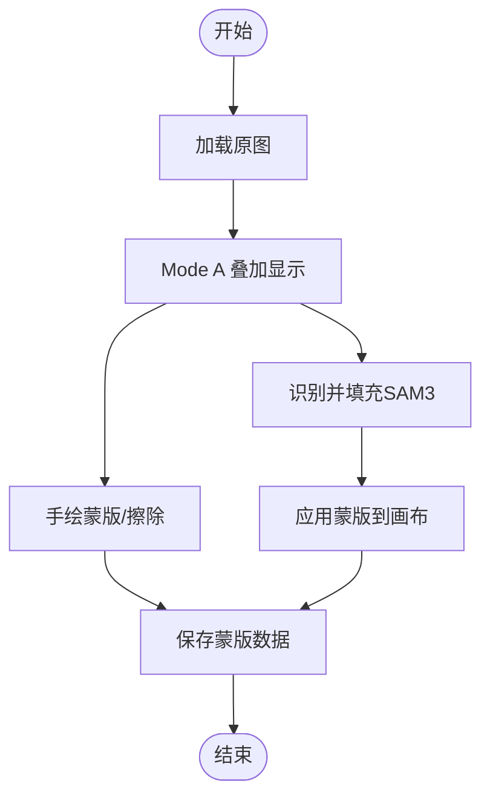
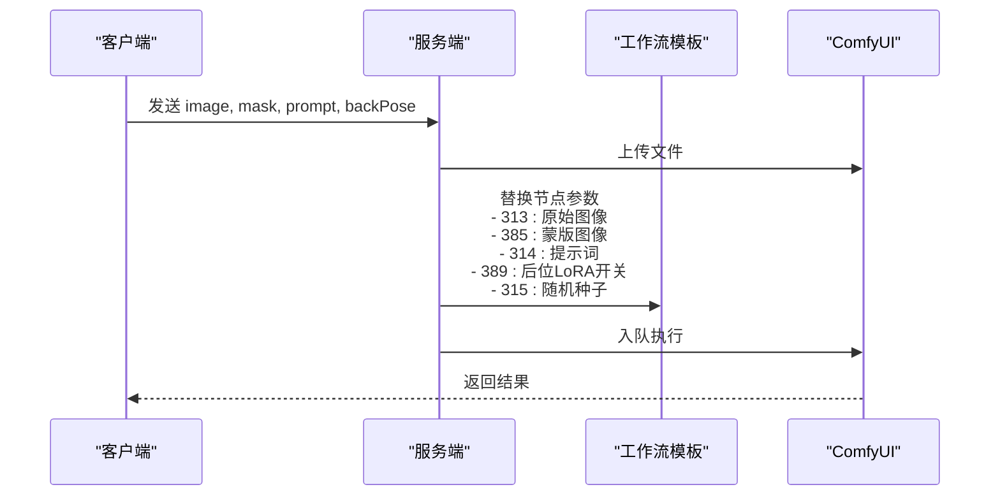
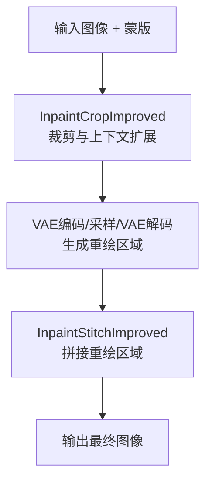
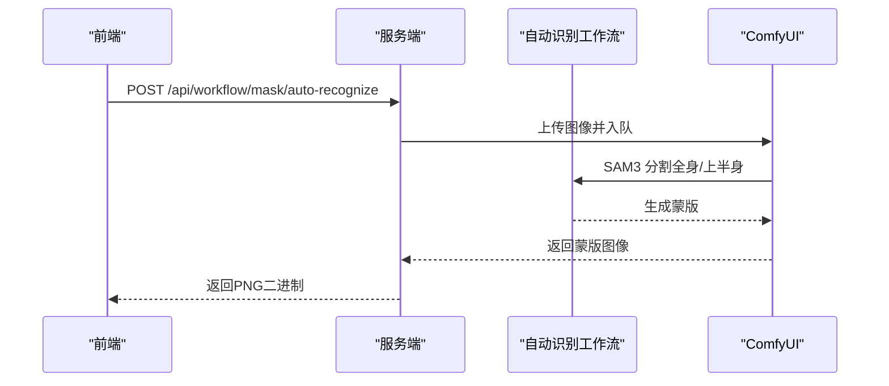

# 解除装备

<cite>
**本文引用的文件**
- [Pix2Real-解除装备Fixed.json](file://ComfyUI_API/Pix2Real-解除装备Fixed.json)
- [Pix2Real-解除装备.json](file://ComfyUI_API/Pix2Real-解除装备.json)
- [2026-02-25-jiechuazhuangbei-workflow-design.md](file://docs/plans/2026-02-25-jiechuazhuangbei-workflow-design.md)
- [2026-02-25-jiechuazhuangbei-impl.md](file://docs/plans/2026-02-25-jiechuazhuangbei-impl.md)
- [MaskEditor.tsx](file://client/src/components/MaskEditor.tsx)
- [MaskCanvas.tsx](file://client/src/components/MaskCanvas.tsx)
- [useMaskStore.ts](file://client/src/hooks/useMaskStore.ts)
- [ImageCard.tsx](file://client/src/components/ImageCard.tsx)
- [PhotoWall.tsx](file://client/src/components/PhotoWall.tsx)
- [maskConfig.ts](file://client/src/config/maskConfig.ts)
- [workflow.ts](file://server/src/routes/workflow.ts)
- [comfyui.ts](file://server/src/services/comfyui.ts)
- [Pix2Real-自动识别Fixed.json](file://ComfyUI_API/Pix2Real-自动识别Fixed.json)
</cite>

## 目录
1. [简介](#简介)
2. [项目结构](#项目结构)
3. [核心组件](#核心组件)
4. [架构总览](#架构总览)
5. [详细组件分析](#详细组件分析)
6. [依赖关系分析](#依赖关系分析)
7. [性能考量](#性能考量)
8. [故障排查指南](#故障排查指南)
9. [结论](#结论)
10. [附录](#附录)

## 简介
本技术文档围绕“解除装备”工作流展开，系统性阐述从图像输入到装备识别与移除的完整流程。该工作流采用基于蒙版的局部重绘（inpainting）方案，结合用户手绘蒙版与可选的AI自动识别能力，实现对人物服装等装备的精准移除或替换。文档重点覆盖：
- 蒙版生成与编辑节点（Mode A）
- 基于提示词与LoRA的装备识别与移除
- 背景分离与局部重绘管线
- 不同材质与颜色的处理策略（透明衣物、金属装饰等）
- 蒙版优化与后处理技巧（边缘平滑、细节补充）
- 处理精度与效率的平衡策略及批量处理优化建议

## 项目结构
“解除装备”工作流由前端UI、服务端路由与ComfyUI工作流三部分协同完成：
- 前端负责蒙版编辑、交互控制与批量执行
- 服务端负责接收上传文件、补丁模板、调度ComfyUI并返回结果
- ComfyUI工作流负责图像加载、蒙版处理、局部重绘与输出

图表来源
- [ImageCard.tsx:429-481](file://client/src/components/ImageCard.tsx#L429-L481)
- [PhotoWall.tsx:585-646](file://client/src/components/PhotoWall.tsx#L585-L646)
- [workflow.ts:133-186](file://server/src/routes/workflow.ts#L133-L186)
- [comfyui.ts:47-60](file://server/src/services/comfyui.ts#L47-L60)
- [Pix2Real-解除装备Fixed.json:1-360](file://ComfyUI_API/Pix2Real-解除装备Fixed.json#L1-L360)

章节来源
- [2026-02-25-jiechuazhuangbei-workflow-design.md:36-80](file://docs/plans/2026-02-25-jiechuazhuangbei-workflow-design.md#L36-L80)
- [2026-02-25-jiechuazhuangbei-impl.md:15-96](file://docs/plans/2026-02-25-jiechuazhuangbei-impl.md#L15-L96)

## 核心组件
- 蒙版编辑器（Mode A）：用于手绘蒙版，支持撤销/重做、擦除、反转、笔刷尺寸/硬度/不透明度调节、自动填充（AI识别）等功能。
- 服务器路由（/api/workflow/5/execute）：接收原始图像与蒙版PNG，注入模板参数，提交至ComfyUI执行。
- ComfyUI工作流：加载图像与蒙版，进行局部重绘裁剪与拼接，输出最终结果。
- 客户端存储：统一管理蒙版数据与任务状态，支持批量执行与无掩码门控。

章节来源
- [MaskEditor.tsx:141-375](file://client/src/components/MaskEditor.tsx#L141-L375)
- [MaskCanvas.tsx:1-677](file://client/src/components/MaskCanvas.tsx#L1-L677)
- [useMaskStore.ts:1-51](file://client/src/hooks/useMaskStore.ts#L1-L51)
- [workflow.ts:133-186](file://server/src/routes/workflow.ts#L133-L186)
- [Pix2Real-解除装备Fixed.json:1-360](file://ComfyUI_API/Pix2Real-解除装备Fixed.json#L1-L360)

## 架构总览
“解除装备”工作流的关键路径如下：
- 用户在蒙版编辑器中绘制蒙版（Mode A），或通过“识别并填充”调用SAM3自动识别生成蒙版
- 单张/批量执行时，前端将原始图像与蒙版PNG打包为FormData，发送至服务端路由
- 服务端上传文件至ComfyUI，补丁模板中的可插拔节点（图像、提示词、后位LoRA开关、随机种子）后入队
- ComfyUI执行工作流，输出局部重绘后的图像

图表来源
- [ImageCard.tsx:429-481](file://client/src/components/ImageCard.tsx#L429-L481)
- [PhotoWall.tsx:585-646](file://client/src/components/PhotoWall.tsx#L585-L646)
- [workflow.ts:133-186](file://server/src/routes/workflow.ts#L133-L186)
- [comfyui.ts:47-60](file://server/src/services/comfyui.ts#L47-L60)

## 详细组件分析

### 蒙版生成与编辑（Mode A）
- 编辑器支持三种叠加模式（暗色叠加、高亮显示、红色叠加），便于在原图上观察蒙版区域
- 支持撤销/重做、清空、反转、自动填充（调用SAM3自动识别）
- 笔刷系统采用非累积软笔刷，避免重叠导致边缘硬化；支持Alt+滚轮调节笔刷大小、T+滚轮调节不透明度
- 自动填充流程：上传原图 → 触发SAM3分割 → 获取蒙版 → 应用到画布

图表来源
- [MaskEditor.tsx:196-235](file://client/src/components/MaskEditor.tsx#L196-L235)
- [MaskCanvas.tsx:203-286](file://client/src/components/MaskCanvas.tsx#L203-L286)

章节来源
- [MaskEditor.tsx:141-375](file://client/src/components/MaskEditor.tsx#L141-L375)
- [MaskCanvas.tsx:1-677](file://client/src/components/MaskCanvas.tsx#L1-L677)

### 装备识别与移除（提示词与LoRA）
- 提示词：用户可自定义提示词，替换默认提示词；为空则使用JSON默认值
- 后位LoRA：通过布尔开关切换是否启用后位LoRA模型，影响UNet加载
- 随机种子：每次执行生成新的随机种子，保证结果多样性

图表来源
- [2026-02-25-jiechuazhuangbei-workflow-design.md:18-26](file://docs/plans/2026-02-25-jiechuazhuangbei-workflow-design.md#L18-L26)
- [workflow.ts:162-173](file://server/src/routes/workflow.ts#L162-L173)

章节来源
- [2026-02-25-jiechuazhuangbei-workflow-design.md:104-115](file://docs/plans/2026-02-25-jiechuazhuangbei-workflow-design.md#L104-L115)
- [workflow.ts:133-186](file://server/src/routes/workflow.ts#L133-L186)

### 局部重绘与背景分离
- 局部重绘裁剪（InpaintCropImproved）：根据蒙版与图像尺寸计算裁剪区域，设置上下左右扩展因子与目标尺寸
- 局部重绘拼接（InpaintStitchImproved）：将重绘区域与原图无缝拼接
- 蒙版优化：通过扩展/模糊/掩码相减等操作提升边缘质量

图表来源
- [Pix2Real-解除装备Fixed.json:119-149](file://ComfyUI_API/Pix2Real-解除装备Fixed.json#L119-L149)
- [Pix2Real-解除装备Fixed.json:179-178](file://ComfyUI_API/Pix2Real-解除装备Fixed.json#L179-L178)

章节来源
- [Pix2Real-解除装备Fixed.json:119-186](file://ComfyUI_API/Pix2Real-解除装备Fixed.json#L119-L186)

### AI自动识别（SAM3）
- 自动识别工作流通过SAM3对全身与上半身分别进行分割，再做相减得到更精确的蒙版
- 支持扩展/模糊等后处理，最终保存为PNG供后续使用

图表来源
- [workflow.ts:812-861](file://server/src/routes/workflow.ts#L812-L861)
- [Pix2Real-自动识别Fixed.json:1-149](file://ComfyUI_API/Pix2Real-自动识别Fixed.json#L1-L149)

章节来源
- [2026-02-25-jiechuazhuangbei-impl.md:19-34](file://docs/plans/2026-02-25-jiechuazhuangbei-impl.md#L19-L34)
- [workflow.ts:812-861](file://server/src/routes/workflow.ts#L812-L861)

### 蒙版格式与转换
- 蒙版要求：纯RGB（无alpha），白色表示蒙版区域，黑色表示背景
- 客户端转换：将MaskEntry的RGBA数据按A>0→白色，A=0→黑色转换为RGB PNG，确保ComfyUI正确读取

章节来源
- [2026-02-25-jiechuazhuangbei-workflow-design.md:28-34](file://docs/plans/2026-02-25-jiechuazhuangbei-workflow-design.md#L28-L34)
- [ImageCard.tsx:407-422](file://client/src/components/ImageCard.tsx#L407-L422)

## 依赖关系分析
- 前端依赖
  - useMaskStore：统一管理蒙版数据与任务状态
  - MaskEditor/MaskCanvas：蒙版绘制与历史管理
  - ImageCard/PhotoWall：单/批量执行与无掩码门控
- 服务端依赖
  - workflow.ts：注册专用路由，处理文件上传与模板补丁
  - comfyui.ts：封装ComfyUI上传、入队、历史查询与图像获取
- ComfyUI工作流
  - Pix2Real-解除装备Fixed.json：包含可插拔节点，支持提示词、LoRA开关与随机种子

图表来源
- [useMaskStore.ts:21-30](file://client/src/hooks/useMaskStore.ts#L21-L30)
- [workflow.ts:133-186](file://server/src/routes/workflow.ts#L133-L186)
- [comfyui.ts:47-60](file://server/src/services/comfyui.ts#L47-L60)
- [Pix2Real-解除装备Fixed.json:1-360](file://ComfyUI_API/Pix2Real-解除装备Fixed.json#L1-L360)

章节来源
- [2026-02-25-jiechuazhuangbei-impl.md:37-82](file://docs/plans/2026-02-25-jiechuazhuangbei-impl.md#L37-L82)
- [2026-02-25-jiechuazhuangbei-workflow-design.md:36-54](file://docs/plans/2026-02-25-jiechuazhuangbei-workflow-design.md#L36-L54)

## 性能考量
- 渲染与蒙版
  - 使用OffscreenCanvas进行离屏绘制与转换，减少主线程阻塞
  - 非累积软笔刷避免边缘硬化，提高绘制效率与质量
- 识别与重绘
  - 自动识别工作流设置合理超时（约120秒），避免长时间占用资源
  - 局部重绘裁剪时设置合理的上下文扩展因子与目标尺寸，平衡精度与速度
- 批量处理
  - 批量执行前检查每个任务的“无掩码门控”，避免无效请求
  - 服务端优先级调整接口可用于紧急提升特定任务优先级

章节来源
- [MaskCanvas.tsx:180-201](file://client/src/components/MaskCanvas.tsx#L180-L201)
- [workflow.ts:812-861](file://server/src/routes/workflow.ts#L812-L861)
- [comfyui.ts:255-284](file://server/src/services/comfyui.ts#L255-L284)

## 故障排查指南
- 无掩码执行被阻止
  - 现象：单张/批量执行时报错“请先在蒙版编辑器中绘制蒙版”
  - 排查：确认已绘制蒙版且处于Mode A（无输出索引）
- 自动识别超时
  - 现象：调用“识别并填充”后返回超时错误
  - 排查：检查ComfyUI服务可用性、GPU显存与模型加载状态
- 蒙版格式问题
  - 现象：ComfyUI读取蒙版异常或结果不符合预期
  - 排查：确保蒙版为纯RGB PNG，白色区域为蒙版，黑色区域为背景；客户端已自动转换
- LoRA开关无效
  - 现象：切换后位LoRA未生效
  - 排查：确认后位LoRA文件存在且路径正确，服务端已将布尔值注入模板节点

章节来源
- [2026-02-25-jiechuazhuangbei-impl.md:425-481](file://docs/plans/2026-02-25-jiechuazhuangbei-impl.md#L425-L481)
- [workflow.ts:812-861](file://server/src/routes/workflow.ts#L812-L861)
- [2026-02-25-jiechuazhuangbei-workflow-design.md:28-34](file://docs/plans/2026-02-25-jiechuazhuangbei-workflow-design.md#L28-L34)

## 结论
“解除装备”工作流通过“手绘蒙版 + 可选AI识别”的双轨策略，实现了对人物装备的高精度移除与替换。其核心优势在于：
- 明确的无掩码门控与批量执行逻辑，降低无效请求
- 可插拔的提示词与LoRA开关，满足不同风格需求
- 局部重绘裁剪与拼接的稳健流程，兼顾精度与效率
- 完善的蒙版优化与后处理能力，适配复杂材质与颜色场景

## 附录

### 不同材质与颜色的处理策略
- 透明衣物：建议在蒙版中明确勾勒边缘，必要时配合“扩展遮罩”与“模糊”增强边缘融合
- 金属装饰品：可通过“掩码相减”与“扩展/模糊”细化边缘，避免重绘区域与装饰物边界产生明显分界线
- 复杂纹理：优先使用AI自动识别作为初稿，再在编辑器中微调细节

章节来源
- [Pix2Real-自动识别Fixed.json:67-82](file://ComfyUI_API/Pix2Real-自动识别Fixed.json#L67-L82)
- [MaskEditor.tsx:196-235](file://client/src/components/MaskEditor.tsx#L196-L235)

### 蒙版优化与后处理技巧
- 边缘平滑：使用“扩展遮罩”+“模糊”+“掩码相减”组合，减少锯齿与硬边
- 细节补充：在编辑器中使用较小笔刷与较高不透明度，精细修正边缘与小面积遗漏区域
- 历史管理：利用撤销/重做功能快速回退与迭代，保持编辑过程可控

章节来源
- [MaskCanvas.tsx:180-201](file://client/src/components/MaskCanvas.tsx#L180-L201)
- [MaskEditor.tsx:304-360](file://client/src/components/MaskEditor.tsx#L304-L360)

### 处理精度与效率的平衡策略
- 精度优先：增大上下文扩展因子、提高重绘步数与CFG，适用于高质量输出
- 效率优先：缩小目标尺寸、减少重绘步数与CFG，适用于快速预览或批量处理
- 批量优化：合并相似提示词与LoRA配置，减少重复模型加载；合理安排队列优先级

章节来源
- [Pix2Real-解除装备Fixed.json:119-126](file://ComfyUI_API/Pix2Real-解除装备Fixed.json#L119-L126)
- [comfyui.ts:255-284](file://server/src/services/comfyui.ts#L255-L284)