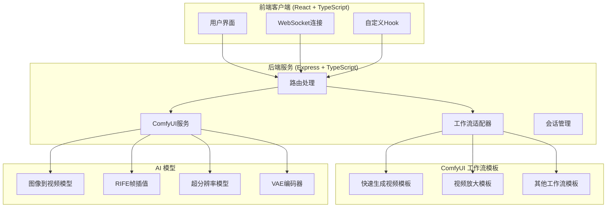
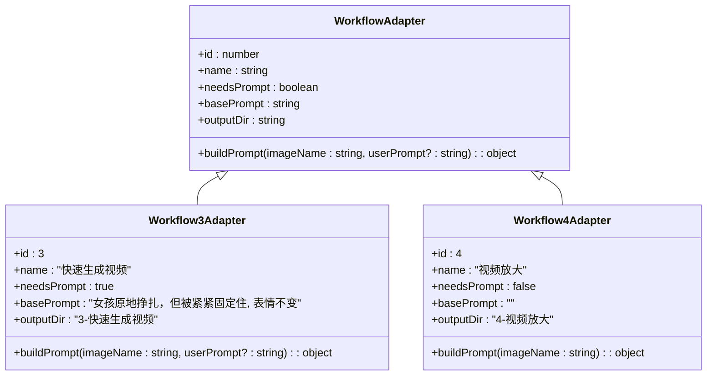
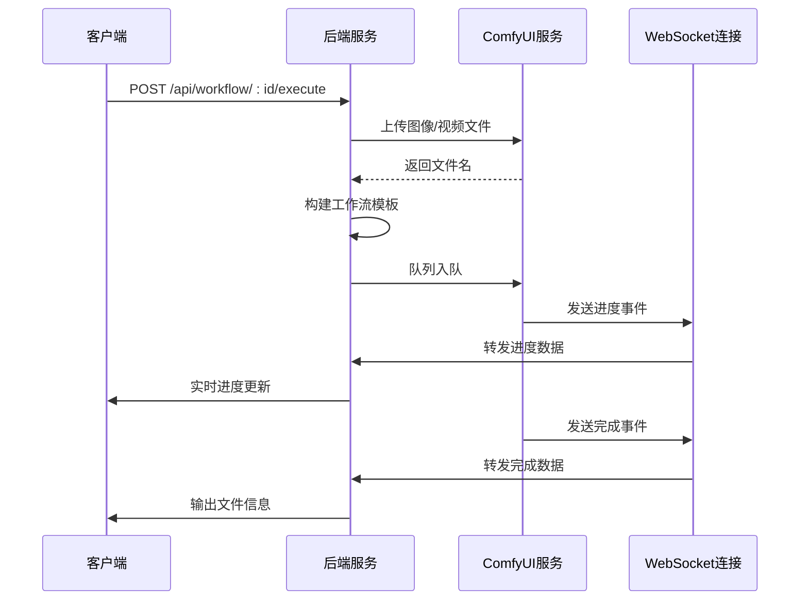
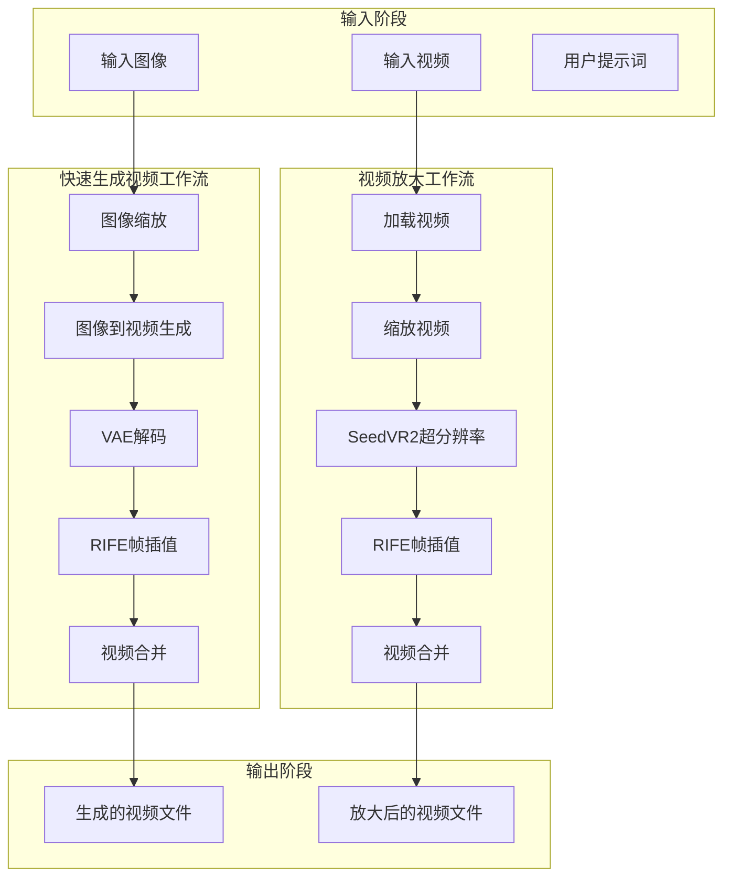
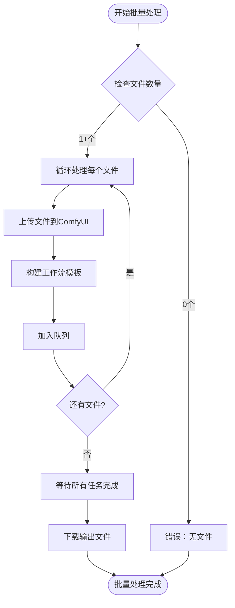
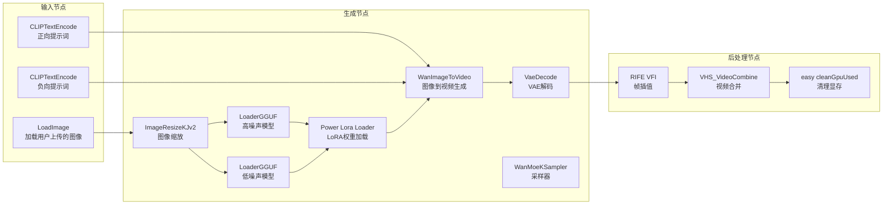
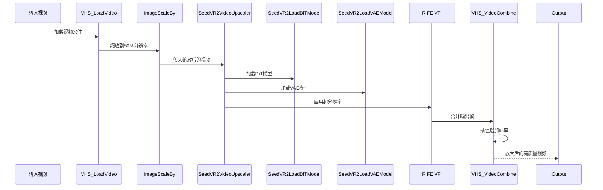
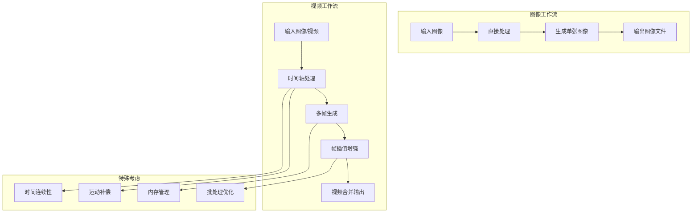
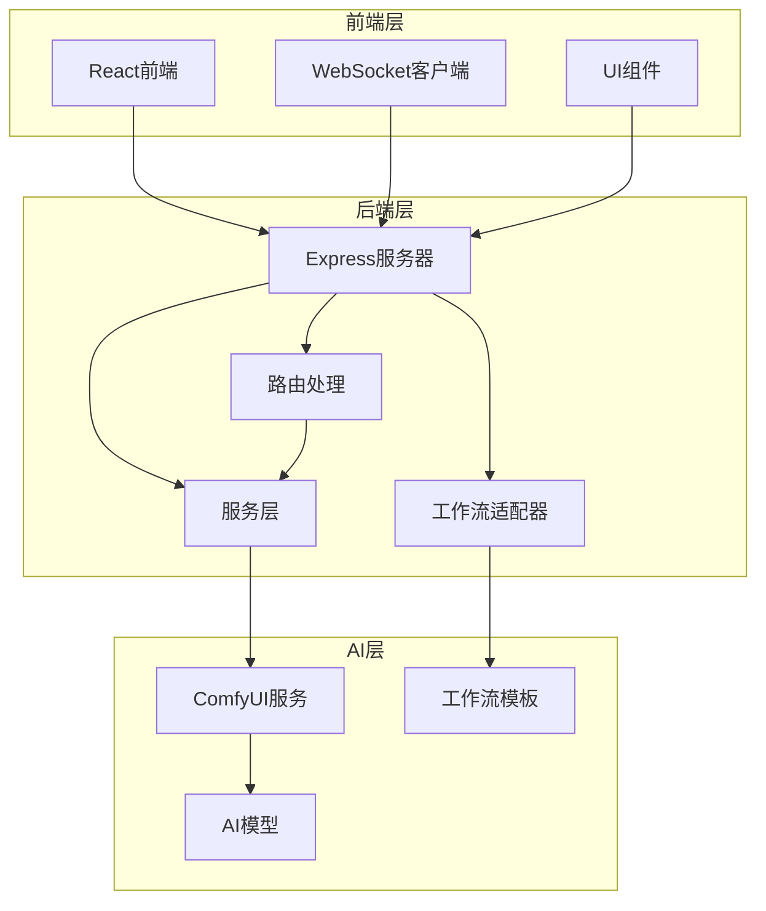

# 视频处理工作流

<cite>
**本文档引用的文件**
- [README.md](file://README.md)
- [3-Pix2Real-快速生成视频.json](file://ComfyUI_API/3-Pix2Real-快速生成视频.json)
- [Pix2Real-快速生成视频RAM.json](file://ComfyUI_API/Pix2Real-快速生成视频RAM.json)
- [4-Pix2Real-视频放大.json](file://ComfyUI_API/4-Pix2Real-视频放大.json)
- [Workflow3Adapter.ts](file://server/src/adapters/Workflow3Adapter.ts)
- [Workflow4Adapter.ts](file://server/src/adapters/Workflow4Adapter.ts)
- [comfyui.ts](file://server/src/services/comfyui.ts)
- [workflow.ts](file://server/src/routes/workflow.ts)
- [index.ts](file://server/src/index.ts)
- [ThumbnailStrip.tsx](file://client/src/components/ThumbnailStrip.tsx)
</cite>

## 目录
1. [简介](#简介)
2. [项目结构](#项目结构)
3. [核心组件](#核心组件)
4. [架构概览](#架构概览)
5. [详细组件分析](#详细组件分析)
6. [依赖关系分析](#依赖关系分析)
7. [性能考量](#性能考量)
8. [故障排除指南](#故障排除指南)
9. [结论](#结论)
10. [附录](#附录)

## 简介

CorineKit Pix2Real 是一个基于 ComfyUI 的本地 Web UI，专门用于批量图像和视频处理。该项目实现了两个核心视频处理工作流：快速生成视频和视频放大。这些工作流利用了先进的 AI 技术，包括图像到视频生成、帧插值算法和超分辨率重建。

项目的主要特点包括：
- 5个内置工作流：动漫转写实、人物精修、放大、图像到视频、视频放大
- 批量处理功能，支持一次处理多个文件
- 实时进度跟踪，通过 WebSocket 从 ComfyUI 向浏览器转发进度更新
- 每个工作流标签维护独立的图像列表
- VRAM 释放功能，可从 UI 触发 ComfyUI 内存清理

## 项目结构

项目采用分层架构设计，主要分为前端客户端、后端服务和 ComfyUI 工作流模板三个部分：

**图表来源**
- [README.md:41-62](file://README.md#L41-L62)
- [workflow.ts:1-25](file://server/src/routes/workflow.ts#L1-L25)

**章节来源**
- [README.md:41-62](file://README.md#L41-L62)
- [README.md:74-79](file://README.md#L74-L79)

## 核心组件

### 工作流适配器模式

项目采用适配器模式来管理不同的工作流，每个工作流都有对应的适配器类：

**图表来源**
- [Workflow3Adapter.ts:9-31](file://server/src/adapters/Workflow3Adapter.ts#L9-L31)
- [Workflow4Adapter.ts:9-26](file://server/src/adapters/Workflow4Adapter.ts#L9-L26)

### ComfyUI 服务层

服务层提供了与 ComfyUI 的完整集成，包括图像上传、队列管理、WebSocket 连接等：

**图表来源**
- [comfyui.ts:127-188](file://server/src/services/comfyui.ts#L127-L188)
- [workflow.ts:408-455](file://server/src/routes/workflow.ts#L408-L455)

**章节来源**
- [Workflow3Adapter.ts:1-33](file://server/src/adapters/Workflow3Adapter.ts#L1-L33)
- [Workflow4Adapter.ts:1-28](file://server/src/adapters/Workflow4Adapter.ts#L1-L28)
- [comfyui.ts:1-285](file://server/src/services/comfyui.ts#L1-L285)

## 架构概览

### 视频处理工作流架构

**图表来源**
- [3-Pix2Real-快速生成视频.json:163-185](file://ComfyUI_API/3-Pix2Real-快速生成视频.json#L163-L185)
- [4-Pix2Real-视频放大.json:115-145](file://ComfyUI_API/4-Pix2Real-视频放大.json#L115-L145)

### 批量处理机制

系统支持批量处理多个文件，通过单个 API 调用处理多个输入：

**图表来源**
- [workflow.ts:457-520](file://server/src/routes/workflow.ts#L457-L520)

**章节来源**
- [workflow.ts:457-520](file://server/src/routes/workflow.ts#L457-L520)

## 详细组件分析

### 快速生成视频工作流

快速生成视频工作流是项目的核心功能之一，它将静态图像转换为动态视频，并通过帧插值技术提高视频流畅度。

#### 工作流节点分析

**图表来源**
- [3-Pix2Real-快速生成视频.json:163-185](file://ComfyUI_API/3-Pix2Real-快速生成视频.json#L163-L185)
- [3-Pix2Real-快速生成视频.json:262-281](file://ComfyUI_API/3-Pix2Real-快速生成视频.json#L262-L281)
- [3-Pix2Real-快速生成视频.json:382-399](file://ComfyUI_API/3-Pix2Real-快速生成视频.json#L382-L399)

#### 时间轴处理机制

快速生成视频工作流的时间轴处理具有以下特点：

1. **初始帧生成**：使用 WanImageToVideo 节点根据输入图像生成起始帧
2. **多模型融合**：同时使用高噪声和低噪声 GGUF 模型进行条件生成
3. **提示词控制**：通过正向和负向 CLIP 文本编码器精确控制生成内容
4. **采样器配置**：使用 WanMoeKSampler 进行多专家模型的采样

#### 帧插值算法实现

系统使用 RIFE (Random Instantaneous Error Fusion) 帧插值算法来提高视频流畅度：

- **插值倍数**：设置为2倍，将16fps提升到32fps
- **快速模式**：启用 fast_mode 以提高处理速度
- **集成学习**：使用 ensemble 参数进行多模型集成
- **缓存管理**：通过 clear_cache_after_n_frames 控制内存使用

**章节来源**
- [3-Pix2Real-快速生成视频.json:163-185](file://ComfyUI_API/3-Pix2Real-快速生成视频.json#L163-L185)
- [3-Pix2Real-快速生成视频.json:382-399](file://ComfyUI_API/3-Pix2Real-快速生成视频.json#L382-L399)
- [Workflow3Adapter.ts:16-31](file://server/src/adapters/Workflow3Adapter.ts#L16-L31)

### 视频放大工作流

视频放大工作流专注于提高现有视频的质量和分辨率，结合了超分辨率重建和运动补偿技术。

#### 超分辨率重建架构

**图表来源**
- [4-Pix2Real-视频放大.json:115-145](file://ComfyUI_API/4-Pix2Real-视频放大.json#L115-L145)
- [4-Pix2Real-视频放大.json:147-194](file://ComfyUI_API/4-Pix2Real-视频放大.json#L147-L194)

#### 运动补偿和质量保持

视频放大工作流采用了多种技术来保持视频质量和处理运动：

1. **分辨率控制**：
   - 初始分辨率：720p
   - 最大分辨率：1280p
   - 缩放策略：先降采样再放大

2. **批处理优化**：
   - batch_size: 5，平衡质量和性能
   - uniform_batch_size: false，允许动态调整
   - temporal_overlap: 0，简化处理流程

3. **颜色校正**：
   - 使用 LAB 颜色空间进行颜色校正
   - 保持原始色调一致性

4. **内存管理**：
   - offload_device: "cpu"，减少GPU内存压力
   - enable_debug: false，避免调试开销

**章节来源**
- [4-Pix2Real-视频放大.json:115-145](file://ComfyUI_API/4-Pix2Real-视频放大.json#L115-L145)
- [4-Pix2Real-视频放大.json:147-194](file://ComfyUI_API/4-Pix2Real-视频放大.json#L147-L194)
- [Workflow4Adapter.ts:16-26](file://server/src/adapters/Workflow4Adapter.ts#L16-L26)

### 工作流与图像工作流的区别

视频工作流与图像工作流在处理流程上有显著差异：

**图表来源**
- [README.md:64-72](file://README.md#L64-L72)

#### 处理流程的特殊考虑

1. **时间连续性**：视频需要保持帧间的时间连续性，避免闪烁和跳变
2. **运动补偿**：高级视频工作流需要处理复杂的运动补偿
3. **内存管理**：视频处理需要更大的内存缓冲区
4. **批处理优化**：视频工作流需要特殊的批处理策略

**章节来源**
- [README.md:64-72](file://README.md#L64-L72)

## 依赖关系分析

### 组件耦合度分析

**图表来源**
- [workflow.ts:1-25](file://server/src/routes/workflow.ts#L1-L25)
- [comfyui.ts:1-25](file://server/src/services/comfyui.ts#L1-L25)

### 外部依赖和集成点

系统的关键外部依赖包括：

1. **ComfyUI API**：作为核心 AI 处理引擎
2. **WebSocket 协议**：实现实时进度通信
3. **Multer 库**：处理文件上传
4. **Node-fetch**：HTTP 请求处理
5. **WS 库**：WebSocket 客户端

**章节来源**
- [workflow.ts:1-25](file://server/src/routes/workflow.ts#L1-L25)
- [comfyui.ts:1-25](file://server/src/services/comfyui.ts#L1-L25)

## 性能考量

### 内存优化策略

视频处理工作流采用了多层次的内存优化策略：

1. **显存清理**：使用 easy cleanGpuUsed 节点定期清理显存占用
2. **CPU卸载**：通过 offload_device 参数将部分计算卸载到CPU
3. **批处理优化**：合理设置 batch_size 和 uniform_batch_size
4. **缓存管理**：RIFE VFI 的 clear_cache_after_n_frames 参数控制缓存大小

### 处理时间估算

基于工作流配置，可以估算不同场景的处理时间：

| 场景 | 分辨率 | 帧数 | 处理时间估算 |
|------|--------|------|-------------|
| 快速生成视频 | 720p | 81帧 | 2-5分钟 |
| 视频放大 | 720p | 81帧 | 5-10分钟 |
| 批量处理10张 | 720p | 81帧/张 | 20-50分钟 |

### 性能优化建议

1. **硬件要求**：
   - GPU：至少8GB VRAM（推荐12GB以上）
   - CPU：多核处理器（推荐16核以上）
   - 内存：16GB RAM（推荐32GB以上）

2. **配置优化**：
   - 调整 batch_size 以平衡质量和性能
   - 合理设置分辨率上限
   - 使用 fast_mode 进行快速处理

## 故障排除指南

### 常见问题及解决方案

#### 1. ComfyUI 连接失败

**症状**：无法连接到 ComfyUI 服务
**原因**：ComfyUI 未启动或端口冲突
**解决方案**：
- 确认 ComfyUI 在 `http://localhost:8188` 运行
- 检查防火墙设置
- 重启 ComfyUI 服务

#### 2. 显存不足错误

**症状**：处理过程中出现显存溢出
**原因**：视频分辨率过高或批处理过大
**解决方案**：
- 降低输入分辨率
- 减小 batch_size
- 启用 offload_device
- 使用 RAMCleanup 节点

#### 3. 视频处理卡顿

**症状**：视频处理过程缓慢
**原因**：CPU性能不足或内存泄漏
**解决方案**：
- 关闭不必要的应用程序
- 增加虚拟内存
- 优化批处理设置
- 定期清理缓存

#### 4. 输出文件格式问题

**症状**：生成的视频无法播放
**原因**：编解码器不兼容或参数设置错误
**解决方案**：
- 检查视频格式支持
- 验证编解码器设置
- 更新驱动程序

**章节来源**
- [comfyui.ts:106-125](file://server/src/services/comfyui.ts#L106-L125)
- [comfyui.ts:202-221](file://server/src/services/comfyui.ts#L202-L221)

### 调试工具和监控

系统提供了多种调试和监控工具：

1. **系统状态监控**：通过 `/api/workflow/system-stats` 获取 VRAM 和 RAM 使用情况
2. **队列管理**：支持查看和管理处理队列
3. **进度跟踪**：实时显示处理进度和状态
4. **日志记录**：详细的错误日志和调试信息

**章节来源**
- [workflow.ts:532-540](file://server/src/routes/workflow.ts#L532-L540)
- [workflow.ts:561-569](file://server/src/routes/workflow.ts#L561-L569)

## 结论

CorineKit Pix2Real 提供了一个完整的视频处理解决方案，通过精心设计的工作流架构实现了高效的图像到视频生成和视频放大功能。项目的主要优势包括：

1. **模块化设计**：采用适配器模式，易于扩展新的工作流
2. **性能优化**：多层内存管理和批处理优化
3. **用户体验**：实时进度跟踪和批量处理能力
4. **技术先进**：集成了最新的 AI 技术如 RIFE 帧插值和 SeedVR2 超分辨率

未来可以考虑的改进方向：
- 添加更多的视频格式支持
- 实现更智能的分辨率自适应
- 增强错误恢复机制
- 优化移动端用户体验

## 附录

### 使用示例

#### 快速生成视频示例

1. 准备一张高质量的静态图像
2. 在 UI 中选择"快速生成视频"工作流
3. 上传图像文件
4. 可选：修改提示词内容
5. 点击"生成"按钮开始处理
6. 实时查看进度，完成后下载视频文件

#### 视频放大示例

1. 准备需要放大的视频文件
2. 在 UI 中选择"视频放大"工作流
3. 上传视频文件
4. 系统自动执行放大处理
5. 查看输出文件的质量提升

### 最佳实践

1. **输入质量**：使用高质量的输入图像和视频
2. **分辨率选择**：根据目标用途选择合适的输出分辨率
3. **批处理策略**：合理安排批处理大小以平衡性能和质量
4. **内存管理**：定期清理缓存和显存
5. **硬件配置**：确保足够的硬件资源满足处理需求