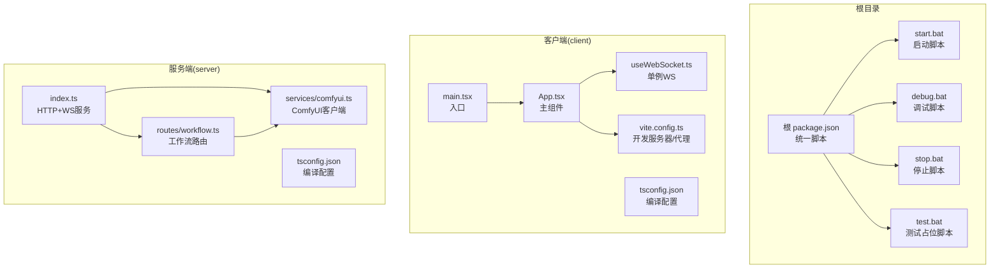
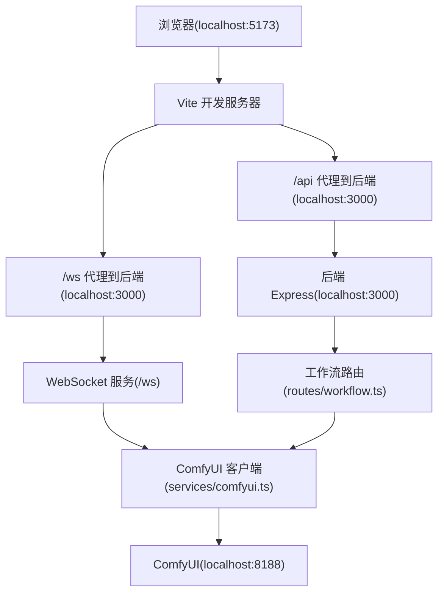
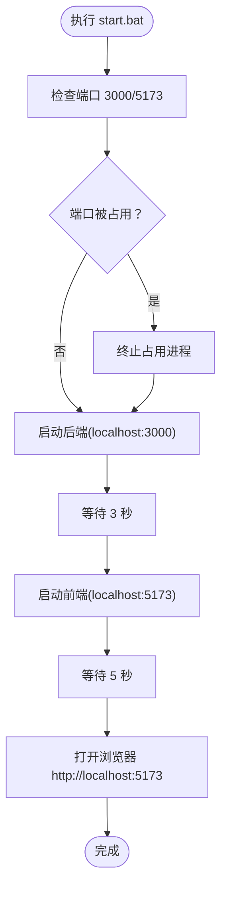
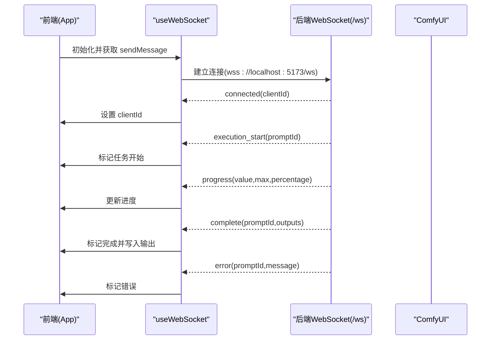
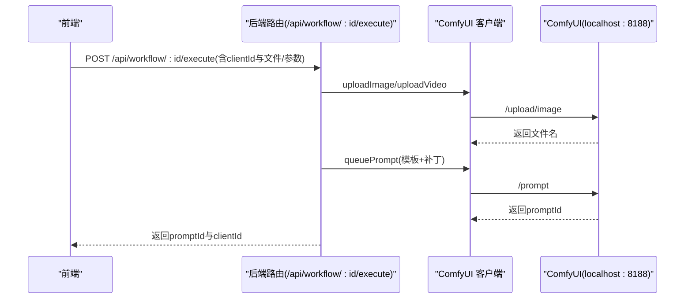
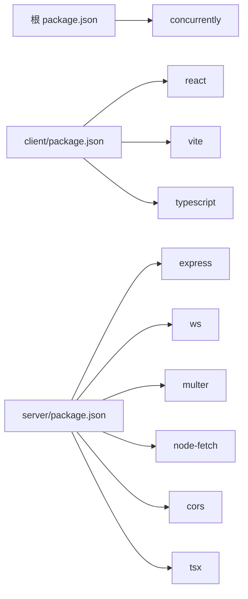

# 开发工具与脚本

<cite>
**本文引用的文件**
- [package.json](file://package.json)
- [start.bat](file://start.bat)
- [debug.bat](file://debug.bat)
- [stop.bat](file://stop.bat)
- [test.bat](file://test.bat)
- [client/package.json](file://client/package.json)
- [server/package.json](file://server/package.json)
- [client/vite.config.ts](file://client/vite.config.ts)
- [client/tsconfig.json](file://client/tsconfig.json)
- [server/tsconfig.json](file://server/tsconfig.json)
- [client/src/main.tsx](file://client/src/main.tsx)
- [client/src/components/App.tsx](file://client/src/components/App.tsx)
- [client/src/hooks/useWebSocket.ts](file://client/src/hooks/useWebSocket.ts)
- [client/src/types/index.ts](file://client/src/types/index.ts)
- [server/src/index.ts](file://server/src/index.ts)
- [server/src/services/comfyui.ts](file://server/src/services/comfyui.ts)
- [server/src/routes/workflow.ts](file://server/src/routes/workflow.ts)
- [README.md](file://README.md)
</cite>

## 目录
1. [简介](#简介)
2. [项目结构](#项目结构)
3. [核心组件](#核心组件)
4. [架构总览](#架构总览)
5. [详细组件分析](#详细组件分析)
6. [依赖关系分析](#依赖关系分析)
7. [性能考量](#性能考量)
8. [故障排查指南](#故障排查指南)
9. [结论](#结论)
10. [附录](#附录)

## 简介
本文件面向 CorineKit Pix2Real 的开发者，系统性梳理开发工具与脚本、Vite 与 TypeScript 配置、开发环境配置、测试策略与调试技巧，以及开发工作流程最佳实践。目标是帮助新成员快速上手本地开发，理解前后端协作机制（前端通过 WebSocket 实时接收 ComfyUI 进度），并掌握构建、代理、热重载、内存释放等关键能力。

**更新** 本版本新增了完整的批处理脚本自动化工具，提供一键启动、调试和停止开发环境的能力。

## 项目结构
项目采用前后端分离的多包结构：
- 根目录提供统一的 npm scripts 与批处理脚本，用于一键启动/调试/停止服务。
- client：Vite + React + TypeScript 前端应用，负责用户界面、拖拽上传、任务队列状态展示、WebSocket 接收进度等。
- server：Express + TypeScript 后端服务，负责路由、会话管理、与 ComfyUI 的 HTTP/WebSocket 交互、输出文件落盘与静态资源暴露。
- ComfyUI_API：存放各工作流的 JSON 模板，供后端按需加载并打补丁。
- output：生成文件输出目录（受版本控制忽略）。

**图表来源**
- [package.json:1-15](file://package.json#L1-L15)
- [client/src/main.tsx:1-11](file://client/src/main.tsx#L1-L11)
- [client/src/components/App.tsx:1-335](file://client/src/components/App.tsx#L1-L335)
- [client/src/hooks/useWebSocket.ts:1-99](file://client/src/hooks/useWebSocket.ts#L1-L99)
- [client/vite.config.ts:1-20](file://client/vite.config.ts#L1-L20)
- [client/tsconfig.json:1-22](file://client/tsconfig.json#L1-L22)
- [server/src/index.ts:1-228](file://server/src/index.ts#L1-L228)
- [server/src/services/comfyui.ts:1-285](file://server/src/services/comfyui.ts#L1-L285)
- [server/src/routes/workflow.ts:1-862](file://server/src/routes/workflow.ts#L1-L862)
- [server/tsconfig.json:1-19](file://server/tsconfig.json#L1-L19)

**章节来源**
- [README.md:41-62](file://README.md#L41-L62)
- [package.json:1-15](file://package.json#L1-L15)

## 核心组件
- 统一开发脚本与批处理
  - 根 package.json 提供 dev/dev:client/dev:server/build/install:all 等脚本，内部并发启动前后端。
  - start.bat：自动释放冲突端口、后台启动 server/client、等待并打开浏览器。
  - debug.bat：以交互窗口启动 server/client，便于查看日志。
  - stop.bat：扫描并终止占用 3000/5173 端口的进程。
  - test.bat：当前为空实现，可扩展为测试入口。
- 前端
  - Vite 配置：开发服务器端口、代理到后端 API/WS。
  - TypeScript 配置：严格模式、模块解析、JSX 策略等。
  - 主入口与主组件：渲染应用、挂载 WebSocket、处理拖拽上传。
- 后端
  - Express 服务：CORS、JSON 大包支持、静态资源暴露 output/sessions。
  - WebSocket：与前端建立连接，转发 ComfyUI 执行事件；与 ComfyUI 建立独立 WS 连接。
  - 工作流路由：适配器模式加载模板、上传文件、打补丁、入队、查询队列、释放显存等。
  - ComfyUI 客户端：上传图像/视频、入队、取历史、拉取输出、系统统计、队列优先级调整等。

**章节来源**
- [package.json:4-10](file://package.json#L4-L10)
- [start.bat:1-57](file://start.bat#L1-L57)
- [debug.bat:1-57](file://debug.bat#L1-L57)
- [stop.bat:1-37](file://stop.bat#L1-L37)
- [client/vite.config.ts:4-19](file://client/vite.config.ts#L4-L19)
- [client/tsconfig.json:2-19](file://client/tsconfig.json#L2-L19)
- [client/src/main.tsx:1-11](file://client/src/main.tsx#L1-L11)
- [client/src/components/App.tsx:54-335](file://client/src/components/App.tsx#L54-L335)
- [server/src/index.ts:42-228](file://server/src/index.ts#L42-L228)
- [server/src/services/comfyui.ts:6-285](file://server/src/services/comfyui.ts#L6-L285)
- [server/src/routes/workflow.ts:29-862](file://server/src/routes/workflow.ts#L29-L862)
- [server/tsconfig.json:2-16](file://server/tsconfig.json#L2-L16)

## 架构总览
整体采用"前端 Vite + 后端 Express + ComfyUI"的三层架构。前端通过代理访问后端 API 与 WebSocket，后端作为中转与适配层，将请求转换为 ComfyUI 的工作流执行，并回传进度与结果。

**图表来源**
- [client/vite.config.ts:6-18](file://client/vite.config.ts#L6-L18)
- [server/src/index.ts:42-63](file://server/src/index.ts#L42-L63)
- [server/src/routes/workflow.ts:29-38](file://server/src/routes/workflow.ts#L29-L38)
- [server/src/services/comfyui.ts:6-8](file://server/src/services/comfyui.ts#L6-L8)

## 详细组件分析

### 开发脚本与批处理
- 统一脚本
  - 根 package.json 的 dev 使用 concurrently 并发启动 client/server 子脚本。
  - build 顺序构建 client 与 server。
  - install:all 一次性安装双端依赖。
- 启动脚本（start.bat）
  - 自动检测并释放 3000/5173 端口占用。
  - 后台启动 server 与 client，并延时等待后打开浏览器。
  - 使用 PowerShell 隐藏窗口启动，避免干扰开发体验。
- 调试脚本（debug.bat）
  - 以交互窗口启动 server/client，便于查看实时日志。
  - 使用 cmd /k 保持窗口打开，便于调试。
- 停止脚本（stop.bat）
  - 扫描并终止占用端口的进程，输出是否成功。
  - 分别检查服务器端口（3000）和客户端端口（5173）。
- 测试脚本（test.bat）
  - 当前为空实现，建议后续接入单元/集成测试命令。

**图表来源**
- [start.bat:10-48](file://start.bat#L10-L48)

**章节来源**
- [package.json:4-10](file://package.json#L4-L10)
- [start.bat:1-57](file://start.bat#L1-L57)
- [debug.bat:1-57](file://debug.bat#L1-L57)
- [stop.bat:1-37](file://stop.bat#L1-L37)
- [test.bat:1-4](file://test.bat#L1-L4)

### Vite 构建与代理配置
- 插件与开发服务器
  - 使用 @vitejs/plugin-react，开发服务器默认端口 5173。
- 代理规则
  - /api 代理到 http://localhost:3000，解决跨域问题。
  - /ws 代理到 ws://localhost:3000，转发 WebSocket 请求。
- 生产构建
  - 先执行 tsc -b 进行类型检查与增量编译，再执行 vite build 打包。

**章节来源**
- [client/vite.config.ts:4-19](file://client/vite.config.ts#L4-L19)
- [client/package.json:6-9](file://client/package.json#L6-L9)

### TypeScript 编译配置
- 客户端（client/tsconfig.json）
  - 目标 ES2020，模块解析 bundler，允许 TS 扩展名导入，严格模式开启。
  - JSX 使用 react-jsx，跳过库声明 emit，适合 Vite 场景。
- 服务端（server/tsconfig.json）
  - 目标 ES2022，输出目录 dist，严格模式开启，兼容 ESModule 导入。
  - 支持 JSON 模块与声明生成，便于发布。

**章节来源**
- [client/tsconfig.json:2-19](file://client/tsconfig.json#L2-L19)
- [server/tsconfig.json:2-16](file://server/tsconfig.json#L2-L16)

### 前端 WebSocket 单例与消息分发
- 单例连接
  - useWebSocket 内部维护全局 WebSocket 实例与连接计数，避免重复连接与泄漏。
  - 断线自动重连，仅在仍有订阅者时尝试重连。
- 消息类型与分发
  - 定义 WSConnectedMessage/WSProgressMessage/WSCompleteMessage/WSErrorMessage/WSExecutionStartMessage。
  - 根据消息类型更新任务状态、进度与输出列表。

**图表来源**
- [client/src/hooks/useWebSocket.ts:10-73](file://client/src/hooks/useWebSocket.ts#L10-L73)
- [client/src/types/index.ts:27-57](file://client/src/types/index.ts#L27-L57)
- [server/src/index.ts:73-219](file://server/src/index.ts#L73-L219)

**章节来源**
- [client/src/hooks/useWebSocket.ts:1-99](file://client/src/hooks/useWebSocket.ts#L1-L99)
- [client/src/types/index.ts:1-58](file://client/src/types/index.ts#L1-L58)
- [server/src/index.ts:73-219](file://server/src/index.ts#L73-L219)

### 后端路由与工作流执行
- 路由组织
  - /api/workflow 下提供工作流执行、批量执行、取消队列、系统统计、释放显存、打开输出目录、导出混合图、反向提示词、提示词助理等接口。
- 适配器模式
  - 每个 workflow 对应一个适配器，加载 JSON 模板并按需打补丁（替换图像、提示词、种子等）。
- 与 ComfyUI 交互
  - 上传图像/视频、入队、轮询历史、下载输出、读取系统统计、调整队列优先级等。
- 输出与会话
  - 将输出保存到 sessions 目录对应 tab 的 output 子目录，支持直接打开系统文件夹。

**图表来源**
- [server/src/routes/workflow.ts:408-455](file://server/src/routes/workflow.ts#L408-L455)
- [server/src/services/comfyui.ts:9-60](file://server/src/services/comfyui.ts#L9-L60)

**章节来源**
- [server/src/routes/workflow.ts:29-862](file://server/src/routes/workflow.ts#L29-L862)
- [server/src/services/comfyui.ts:6-8](file://server/src/services/comfyui.ts#L6-L8)

### 前端入口与主组件
- 入口
  - main.tsx 渲染根节点，引入全局样式，挂载 App。
- 主组件
  - App 负责头部、侧边栏、主内容区、欢迎页、状态栏、遮罩编辑器、设置面板、提示词助理等。
  - 处理拖拽上传、视图尺寸切换、主题切换、会话管理等。
  - 通过 useWebSocket 订阅进度与完成事件，驱动 UI 更新。

**章节来源**
- [client/src/main.tsx:1-11](file://client/src/main.tsx#L1-L11)
- [client/src/components/App.tsx:54-335](file://client/src/components/App.tsx#L54-L335)

## 依赖关系分析
- 根脚本依赖
  - 根 package.json 依赖 concurrently，用于并发启动前后端。
- 前端依赖
  - client/package.json 包含 React、Zustand、@vitejs/plugin-react、TypeScript、Vite 等。
- 后端依赖
  - server/package.json 包含 Express、ws、multer、node-fetch、cors、tsx 等。

**图表来源**
- [package.json:11-12](file://package.json#L11-L12)
- [client/package.json:11-23](file://client/package.json#L11-L23)
- [server/package.json:11-26](file://server/package.json#L11-L26)

**章节来源**
- [package.json:11-12](file://package.json#L11-L12)
- [client/package.json:11-23](file://client/package.json#L11-L23)
- [server/package.json:11-26](file://server/package.json#L11-L26)

## 性能考量
- 前端
  - Vite 默认启用热重载与按需打包，建议在开发时关闭严格未使用变量检查以提升编译速度（谨慎使用）。
  - 图像/视频上传采用内存存储，注意大文件场景下的内存占用与超时时间。
- 后端
  - Express JSON 包体限制较大（50MB），满足批量处理需求。
  - WebSocket 事件缓冲与重放机制减少首屏延迟，但需关注内存占用。
  - 与 ComfyUI 的通信采用独立 WS 连接，避免阻塞主 HTTP 路由。
- 工作流
  - 适配器模式按需打补丁，避免重复加载模板，提高执行效率。
  - 释放显存接口可触发 ComfyUI 内存清理，缓解长时间运行的显存压力。

## 故障排查指南
- 端口占用
  - 使用 stop.bat 或 start.bat 的自动释放逻辑，确认 3000/5173 是否被占用。
- CORS 与代理
  - 确认 Vite 代理配置正确，后端 CORS 允许 http://localhost:5173。
- WebSocket 连接
  - 检查后端日志是否打印连接/断开信息；前端 useWebSocket 是否收到 connected 消息。
- ComfyUI 不可用
  - 确认 ComfyUI 在 http://localhost:8188 正常运行；后端日志中是否有网络错误。
- 输出目录
  - 确认 sessions 目录存在且可写；打开输出目录失败时检查平台命令与路径。

**章节来源**
- [stop.bat:10-27](file://stop.bat#L10-L27)
- [client/vite.config.ts:6-18](file://client/vite.config.ts#L6-L18)
- [server/src/index.ts:46-49](file://server/src/index.ts#L46-L49)
- [server/src/index.ts:221-227](file://server/src/index.ts#L221-L227)
- [server/src/services/comfyui.ts:6-8](file://server/src/services/comfyui.ts#L6-L8)

## 结论
本项目通过统一的开发脚本与批处理、清晰的 Vite/TypeScript 配置、以及基于适配器的工作流路由与 WebSocket 中转，实现了从本地 UI 到 ComfyUI 的高效协作。新增的批处理脚本进一步简化了开发环境的启动和停止流程，提升了开发效率与稳定性。

**更新** 通过 start.bat 和 stop.bat 的自动化脚本，开发者可以更便捷地管理开发环境，减少了手动操作的复杂性和出错概率。

## 附录

### 开发环境配置指南
- 环境变量
  - 后端监听端口可通过环境变量 PORT 覆盖，默认 3000。
- 代理配置
  - Vite 代理 /api 与 /ws 至后端，确保前端与后端同源策略一致。
- 热重载机制
  - Vite 默认启用，无需额外配置；如需禁用可在开发服务器配置中关闭。
- 批处理脚本使用
  - start.bat：一键启动完整开发环境，自动处理端口占用问题。
  - debug.bat：交互式调试模式，适合开发过程中的问题排查。
  - stop.bat：安全停止所有开发服务，确保资源正确释放。

**章节来源**
- [server/src/index.ts:221-221](file://server/src/index.ts#L221-L221)
- [client/vite.config.ts:6-18](file://client/vite.config.ts#L6-L18)
- [start.bat:1-57](file://start.bat#L1-L57)
- [debug.bat:1-57](file://debug.bat#L1-L57)
- [stop.bat:1-37](file://stop.bat#L1-L37)

### 测试策略与调试技巧
- 单元测试
  - 建议在 client/server 分别添加测试框架（如 Vitest/Jest），针对工具函数与纯函数进行覆盖。
- 集成测试
  - 使用端到端测试工具（如 Playwright/Cypress）验证工作流执行链路与 UI 行为。
- 性能测试
  - 使用浏览器性能面板与后端日志分析长任务与内存峰值；对批量处理场景进行压力测试。
- 调试技巧
  - 使用 debug.bat 交互式启动，结合后端日志与浏览器开发者工具 Network/WS 面板定位问题。
  - start.bat 提供后台启动，适合日常开发；debug.bat 提供前台调试，适合问题排查。

### 开发工作流程最佳实践
- 代码规范
  - 统一使用 TypeScript，开启严格模式；组件命名与文件组织遵循现有结构。
- 版本控制
  - 使用分支策略（如 Git Flow）管理功能与修复；提交信息清晰描述变更。
- 持续集成
  - 在 CI 中执行安装依赖、类型检查、构建与基础测试，确保主干稳定。
- 开发效率
  - 使用 start.bat 快速启动开发环境，避免每次手动启动前后端服务。
  - 使用 stop.bat 安全停止服务，确保下次启动时不会有端口冲突。
  - 使用 debug.bat 进行问题定位，利用交互式窗口查看详细日志。