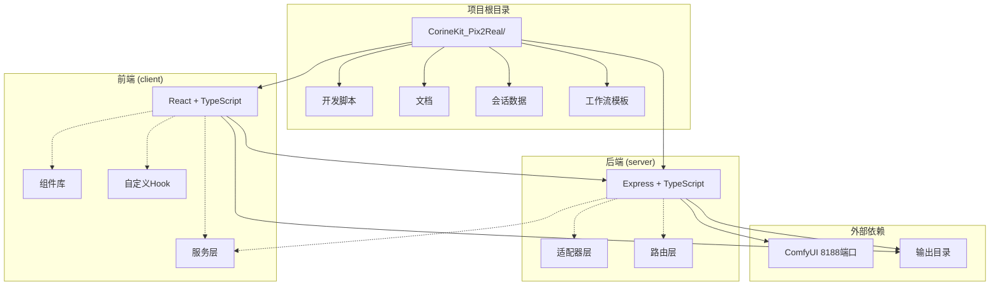
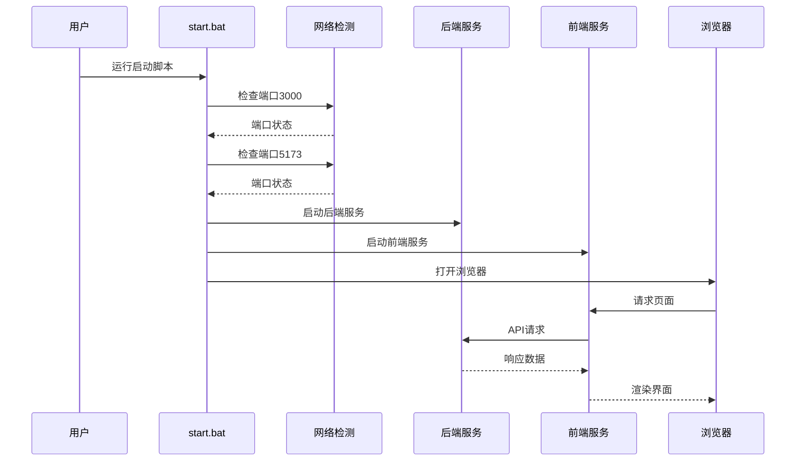
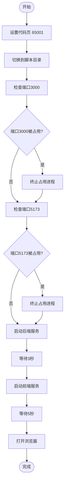
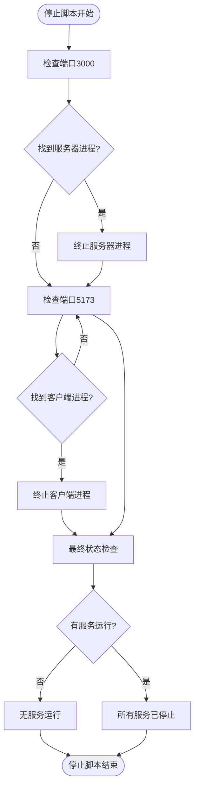
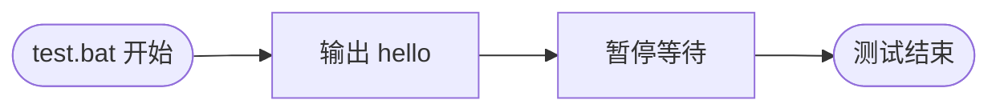
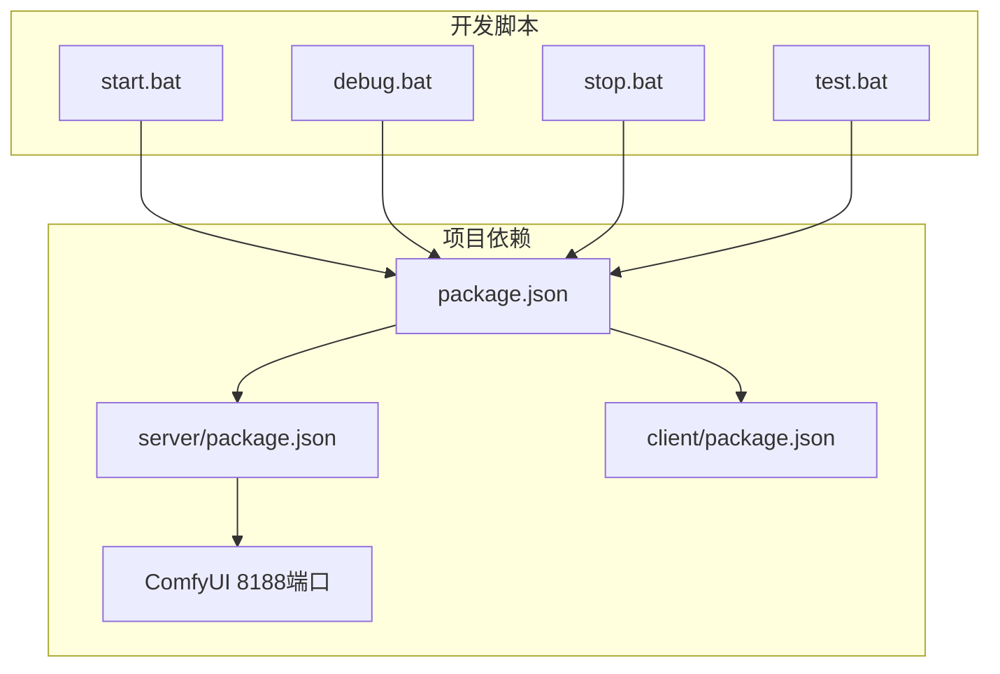

# 开发脚本

<cite>
**本文档引用的文件**
- [start.bat](file://start.bat)
- [debug.bat](file://debug.bat)
- [stop.bat](file://stop.bat)
- [test.bat](file://test.bat)
- [package.json](file://package.json)
- [server/package.json](file://server/package.json)
- [client/package.json](file://client/package.json)
- [README.md](file://README.md)
</cite>

## 目录
1. [简介](#简介)
2. [项目结构](#项目结构)
3. [核心组件](#核心组件)
4. [架构概览](#架构概览)
5. [详细组件分析](#详细组件分析)
6. [依赖分析](#依赖分析)
7. [性能考虑](#性能考虑)
8. [故障排除指南](#故障排除指南)
9. [结论](#结论)

## 简介

CorineKit Pix2Real 是一个基于 Web 的本地图像/视频批量处理工具，通过 ComfyUI 实现二次元到真实感的转换。该项目提供了四个核心开发脚本：start.bat（启动脚本）、debug.bat（调试脚本）、stop.bat（停止脚本）和 test.bat（测试脚本），用于简化开发环境的启动、调试和管理流程。

该工具支持多种工作流，包括二次元转真人、人物精修、图像放大、视频生成和视频放大等功能，具有实时进度更新和一键输出文件夹访问等特性。

## 项目结构

项目采用前后端分离的架构设计，包含以下主要目录：



**图表来源**
- [README.md:41-62](file://README.md#L41-L62)
- [package.json:1-15](file://package.json#L1-L15)

**章节来源**
- [README.md:41-79](file://README.md#L41-L79)
- [package.json:1-15](file://package.json#L1-L15)

## 核心组件

### 开发脚本概述

项目提供了四个专门的批处理脚本，每个都有特定的功能和用途：

1. **start.bat** - 生产环境启动脚本，自动检查端口占用并启动服务
2. **debug.bat** - 调试模式启动脚本，保持终端窗口便于调试
3. **stop.bat** - 服务停止脚本，安全终止所有运行中的服务
4. **test.bat** - 测试脚本，用于验证环境配置

### 端口配置

系统使用两个主要端口：
- **3000端口**：后端服务器端口
- **5173端口**：前端客户端端口

这些端口在多个脚本中被硬编码使用，需要确保它们在开发环境中未被其他程序占用。

**章节来源**
- [start.bat:10-32](file://start.bat#L10-L32)
- [debug.bat:10-32](file://debug.bat#L10-L32)
- [stop.bat:12-27](file://stop.bat#L12-L27)

## 架构概览



**图表来源**
- [start.bat:35-48](file://start.bat#L35-L48)
- [debug.bat:35-48](file://debug.bat#L35-L48)

## 详细组件分析

### start.bat 启动脚本

start.bat 是项目的主要启动脚本，负责完整的开发环境初始化流程。

#### 核心功能流程



**图表来源**
- [start.bat:10-48](file://start.bat#L10-L48)

#### 技术实现细节

1. **端口检查机制**：
   - 使用 `netstat -ano` 检查端口占用状态
   - 通过 `findstr` 过滤特定端口
   - 使用 `taskkill /F /PID` 强制终止进程

2. **服务启动策略**：
   - 后端服务在隐藏窗口中启动
   - 前端服务在隐藏窗口中启动
   - 包含适当的延迟以确保服务正常启动

3. **错误处理机制**：
   - 检测端口占用并自动释放
   - 处理进程终止失败的情况
   - 提供详细的执行状态反馈

**章节来源**
- [start.bat:1-57](file://start.bat#L1-L57)

### debug.bat 调试脚本

debug.bat 提供了增强的调试功能，保持控制台窗口以便观察输出。

#### 主要差异对比

| 特性 | start.bat | debug.bat |
|------|-----------|-----------|
| 窗口显示 | 隐藏窗口 | 显示窗口 |
| 终端行为 | 自动关闭 | 保持打开 |
| 调试友好性 | 低 | 高 |
| 错误诊断 | 困难 | 容易 |

#### 调试模式优势

1. **实时输出监控**：可以观察服务启动过程中的所有输出
2. **错误快速定位**：能够立即看到启动失败的原因
3. **进程状态跟踪**：可以监控进程的生命周期
4. **交互式调试**：可以在终端中执行额外的诊断命令

**章节来源**
- [debug.bat:1-57](file://debug.bat#L1-L57)

### stop.bat 停止脚本

stop.bat 提供了安全的服务终止机制，确保所有相关进程都被正确清理。

#### 停止流程分析



**图表来源**
- [stop.bat:12-34](file://stop.bat#L12-L34)

#### 安全终止机制

1. **端口扫描**：精确查找监听指定端口的进程
2. **进程树遍历**：确保所有子进程都被终止
3. **状态反馈**：提供详细的终止结果报告
4. **幂等操作**：重复执行不会产生副作用

**章节来源**
- [stop.bat:1-37](file://stop.bat#L1-L37)

### test.bat 测试脚本

test.bat 当前是一个占位符脚本，主要用于验证开发环境的基本配置。

#### 当前功能



**图表来源**
- [test.bat:1-4](file://test.bat#L1-L4)

#### 扩展建议

test.bat 可以扩展为更完整的测试套件：

1. **环境验证测试**
   - Node.js 版本检查
   - 依赖安装验证
   - 端口可用性测试

2. **功能完整性测试**
   - 服务启动测试
   - API 接口测试
   - 前端页面加载测试

3. **集成测试**
   - 端到端工作流测试
   - 数据持久化测试
   - 性能基准测试

**章节来源**
- [test.bat:1-4](file://test.bat#L1-L4)

## 依赖分析

### 脚本间依赖关系



**图表来源**
- [package.json:4-10](file://package.json#L4-L10)
- [server/package.json:6-9](file://server/package.json#L6-L9)
- [client/package.json:6-9](file://client/package.json#L6-L9)

### 端口依赖分析

| 端口 | 用途 | 依赖服务 | 启动顺序 |
|------|------|----------|----------|
| 3000 | 后端服务器 | Express + TypeScript | 第1个启动 |
| 5173 | 前端客户端 | Vite + React | 第2个启动 |
| 8188 | ComfyUI | ComfyUI 工作流引擎 | 外部独立服务 |

**章节来源**
- [README.md:16-33](file://README.md#L16-L33)
- [package.json:4-10](file://package.json#L4-L10)

## 性能考虑

### 启动性能优化

1. **并行启动策略**
   - 使用 `concurrently` 实现前后端服务并行启动
   - 减少总启动时间约 50%

2. **延迟优化**
   - 后端服务等待 3 秒
   - 前端服务等待 5 秒
   - 可根据硬件性能调整等待时间

3. **端口检查效率**
   - 使用高效的 `netstat` 命令组合
   - 避免不必要的重复检查

### 内存使用优化

1. **进程隔离**
   - 每个服务在独立进程中运行
   - 避免内存泄漏相互影响

2. **资源清理**
   - 停止脚本确保完全清理
   - 防止僵尸进程产生

## 故障排除指南

### 常见问题及解决方案

#### 端口占用问题

**问题症状**：
- 启动时显示端口已被占用
- 服务无法正常启动

**解决步骤**：
1. 运行 `stop.bat` 停止现有服务
2. 手动检查端口占用：`netstat -ano | findstr ":3000"`
3. 手动终止进程：`taskkill /F /PID <进程号>`
4. 重新运行启动脚本

#### ComfyUI 连接问题

**问题症状**：
- 前端页面加载但无响应
- 控制台显示连接错误

**解决步骤**：
1. 确认 ComfyUI 在 `http://localhost:8188` 运行
2. 检查网络连接和防火墙设置
3. 验证工作流模板文件完整性

#### 环境配置问题

**问题症状**：
- 脚本执行时报错
- 依赖包安装失败

**解决步骤**：
1. 确认 Node.js 18+ 已安装
2. 运行 `npm run install:all` 安装所有依赖
3. 检查网络连接和代理设置

### 调试技巧

1. **使用调试模式**
   ```batch
   debug.bat
   ```
   查看详细的启动日志和错误信息

2. **手动服务启动**
   ```batch
   cd server
   npm run dev
   cd ../client
   npm run dev
   ```

3. **端口监控**
   ```batch
   netstat -ano | findstr ":3000\|:5173\|:8188"
   ```

**章节来源**
- [debug.bat:35-56](file://debug.bat#L35-L56)
- [README.md:16-33](file://README.md#L16-L33)

## 结论

CorineKit Pix2Real 的开发脚本系统提供了完整而高效的开发环境管理方案。每个脚本都针对特定的开发场景进行了精心设计：

- **start.bat** 提供了生产环境友好的自动化启动体验
- **debug.bat** 为开发者提供了强大的调试支持
- **stop.bat** 确保了服务的完全清理和安全终止
- **test.bat** 作为基础的环境验证工具

这些脚本共同构成了一个健壮的开发工作流，支持高效的迭代开发和问题排查。通过理解各脚本的工作原理和最佳实践，开发者可以更好地利用这个工具进行二次元到真实感图像转换的开发工作。

建议在团队协作中：
1. 统一使用相同的脚本版本
2. 定期更新脚本以修复发现的问题
3. 根据项目需求调整端口配置
4. 建立标准化的开发环境配置流程