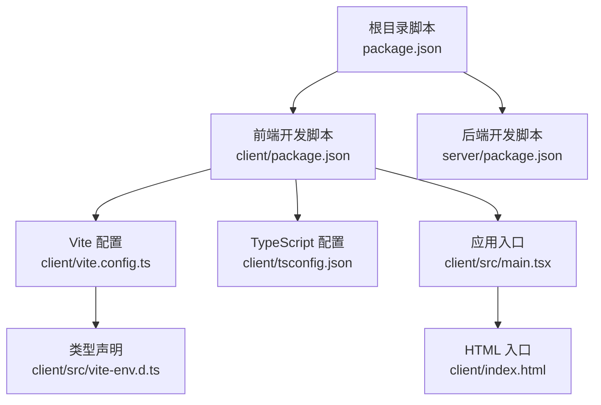
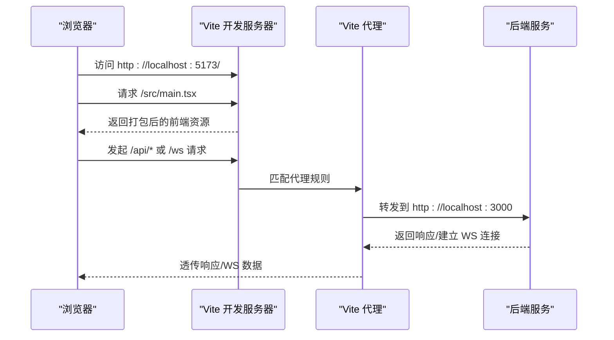
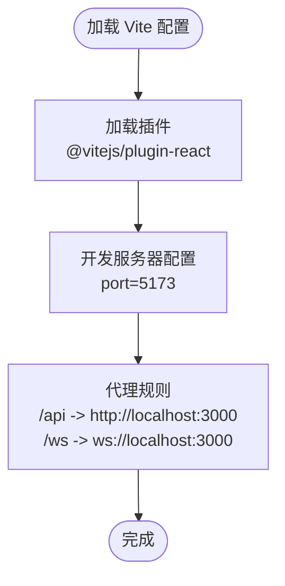
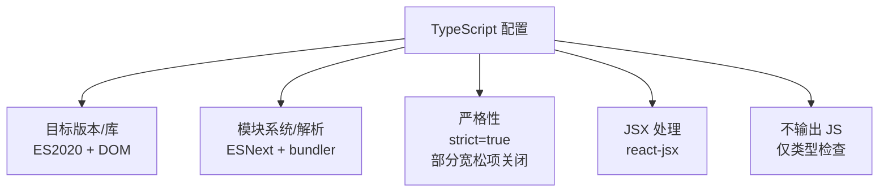
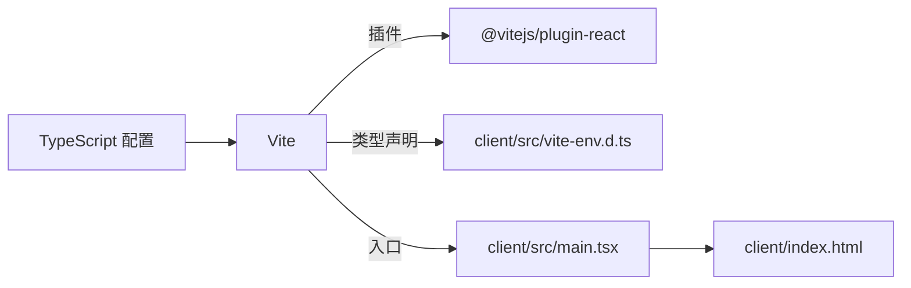

# 构建配置

<cite>
**本文引用的文件**
- [client/vite.config.ts](file://client/vite.config.ts)
- [client/tsconfig.json](file://client/tsconfig.json)
- [client/package.json](file://client/package.json)
- [package.json](file://package.json)
- [client/src/main.tsx](file://client/src/main.tsx)
- [client/index.html](file://client/index.html)
- [client/src/vite-env.d.ts](file://client/src/vite-env.d.ts)
- [server/package.json](file://server/package.json)
</cite>

## 目录
1. [简介](#简介)
2. [项目结构](#项目结构)
3. [核心组件](#核心组件)
4. [架构总览](#架构总览)
5. [详细组件分析](#详细组件分析)
6. [依赖分析](#依赖分析)
7. [性能考虑](#性能考虑)
8. [故障排查指南](#故障排查指南)
9. [结论](#结论)
10. [附录](#附录)

## 简介
本文件聚焦 CorineKit Pix2Real 前端（客户端）的构建配置与 TypeScript 编译配置，系统性说明 Vite 开发服务器与代理、插件、别名映射、构建优化等能力；解释 TypeScript 编译目标、模块解析、装饰器支持、严格模式等选项的作用与取舍；并提供面向不同开发环境（开发、测试、生产）的差异化配置策略与优化建议，涵盖性能优化、代码分割、资源处理、环境变量注入等最佳实践。

## 项目结构
客户端采用 Vite + React + TypeScript 技术栈，根目录通过聚合脚本统一启动前后端服务。前端入口由 HTML 指向模块入口，TypeScript 类型声明由 Vite 环境声明文件提供。

图表来源
- [package.json:1-15](file://package.json#L1-L15)
- [client/package.json:1-25](file://client/package.json#L1-L25)
- [client/vite.config.ts:1-20](file://client/vite.config.ts#L1-L20)
- [client/tsconfig.json:1-22](file://client/tsconfig.json#L1-L22)
- [client/src/main.tsx:1-11](file://client/src/main.tsx#L1-L11)
- [client/index.html:1-16](file://client/index.html#L1-L16)
- [client/src/vite-env.d.ts:1-2](file://client/src/vite-env.d.ts#L1-L2)

章节来源
- [package.json:1-15](file://package.json#L1-L15)
- [client/package.json:1-25](file://client/package.json#L1-L25)
- [client/vite.config.ts:1-20](file://client/vite.config.ts#L1-L20)
- [client/tsconfig.json:1-22](file://client/tsconfig.json#L1-L22)
- [client/src/main.tsx:1-11](file://client/src/main.tsx#L1-L11)
- [client/index.html:1-16](file://client/index.html#L1-L16)
- [client/src/vite-env.d.ts:1-2](file://client/src/vite-env.d.ts#L1-L2)

## 核心组件
- Vite 构建配置：定义开发服务器端口、HTTP/WebSocket 代理、React 插件等。
- TypeScript 编译配置：指定编译目标、模块解析策略、JSX 处理、严格模式等。
- 应用入口与 HTML：应用从 main.tsx 渲染到 index.html 的 root 容器。
- 聚合脚本：根目录脚本统一启动前后端开发服务。

章节来源
- [client/vite.config.ts:1-20](file://client/vite.config.ts#L1-L20)
- [client/tsconfig.json:1-22](file://client/tsconfig.json#L1-L22)
- [client/src/main.tsx:1-11](file://client/src/main.tsx#L1-L11)
- [client/index.html:1-16](file://client/index.html#L1-L16)
- [package.json:1-15](file://package.json#L1-L15)

## 架构总览
下图展示开发时的请求链路：浏览器访问 Vite 开发服务器，静态资源由 Vite 直接提供；对 /api 与 /ws 的请求通过代理转发至后端服务，实现跨域与本地联调。

图表来源
- [client/vite.config.ts:6-18](file://client/vite.config.ts#L6-L18)
- [client/index.html:13](file://client/index.html#L13)

章节来源
- [client/vite.config.ts:1-20](file://client/vite.config.ts#L1-L20)
- [client/index.html:1-16](file://client/index.html#L1-L16)

## 详细组件分析

### Vite 构建配置分析
- 插件体系
  - 使用 React 插件进行 JSX 转换与开发体验增强。
- 开发服务器
  - 端口固定为 5173，便于与其他服务共存。
  - 代理规则：
    - 将 /api 前缀转发到后端 HTTP 服务（localhost:3000），并启用变更源。
    - 将 /ws 前缀转发到后端 WebSocket 服务（ws://localhost:3000），支持 WebSocket 协议升级。
- 别名映射
  - 当前未配置自定义路径别名，遵循 Vite 默认解析行为。
- 构建优化
  - 未显式配置 rollupOptions 或插件以进行代码分割、压缩、产物分析等，属于默认优化。

图表来源
- [client/vite.config.ts:4-19](file://client/vite.config.ts#L4-L19)

章节来源
- [client/vite.config.ts:1-20](file://client/vite.config.ts#L1-L20)

### TypeScript 编译配置分析
- 编译目标与库
  - 目标：ES2020；库包含 ES2020、DOM、DOM.Iterable，适配现代浏览器与 DOM API。
- 模块系统与解析
  - 模块：ESNext；模块解析：bundler；允许 TS 扩展名导入；隔离模块；强制模块检测。
- 输出控制
  - 不 emit（仅类型检查），结合 Vite 的打包流程使用。
- JSX 与严格性
  - JSX：react-jsx；严格模式开启；未启用 noUnusedLocals/noUnusedParameters，减少严格约束。
- 其他
  - 无装饰器支持配置（如 emitDecoratorMetadata、experimentalDecorators）。

图表来源
- [client/tsconfig.json:2-19](file://client/tsconfig.json#L2-L19)

章节来源
- [client/tsconfig.json:1-22](file://client/tsconfig.json#L1-L22)

### 应用入口与类型声明
- HTML 入口
  - 在 body 中通过模块脚本引入前端入口文件，挂载到 id=root 的容器。
- 应用入口
  - main.tsx 导入 App 并渲染到 root 容器，启用 React 严格模式。
- 类型声明
  - vite-env.d.ts 引入 Vite 的客户端类型声明，提供 import.meta.env 等类型。

章节来源
- [client/index.html:1-16](file://client/index.html#L1-L16)
- [client/src/main.tsx:1-11](file://client/src/main.tsx#L1-L11)
- [client/src/vite-env.d.ts:1-2](file://client/src/vite-env.d.ts#L1-L2)

### 聚合脚本与多包协作
- 根目录脚本
  - 同时启动前端与后端开发服务，便于联调。
- 前端脚本
  - dev/build/preview 分别对应开发、构建、预览。
- 后端脚本
  - dev/build/start 对应开发、构建、运行。

章节来源
- [package.json:1-15](file://package.json#L1-L15)
- [client/package.json:1-25](file://client/package.json#L1-L25)
- [server/package.json:1-28](file://server/package.json#L1-L28)

## 依赖分析
- Vite 与 React 插件
  - Vite 作为构建工具与开发服务器；React 插件负责 JSX 转换与 HMR。
- TypeScript 与类型声明
  - tsconfig.json 控制编译行为；vite-env.d.ts 提供 Vite 环境变量类型。
- 应用入口与 HTML
  - main.tsx 与 index.html 形成标准 SPA 入口链路。

图表来源
- [client/vite.config.ts:1-2](file://client/vite.config.ts#L1-L2)
- [client/src/vite-env.d.ts:1](file://client/src/vite-env.d.ts#L1)
- [client/src/main.tsx:1-11](file://client/src/main.tsx#L1-L11)
- [client/index.html:13](file://client/index.html#L13)
- [client/tsconfig.json:1-22](file://client/tsconfig.json#L1-L22)

章节来源
- [client/vite.config.ts:1-20](file://client/vite.config.ts#L1-L20)
- [client/tsconfig.json:1-22](file://client/tsconfig.json#L1-L22)
- [client/src/main.tsx:1-11](file://client/src/main.tsx#L1-L11)
- [client/index.html:1-16](file://client/index.html#L1-L16)
- [client/src/vite-env.d.ts:1-2](file://client/src/vite-env.d.ts#L1-L2)

## 性能考虑
- 代码分割
  - 当前未配置自定义拆分策略；可考虑基于路由或动态导入进行懒加载，减少首屏体积。
- 资源处理
  - 图片、字体等静态资源由 Vite 默认处理；可配置预加载与预取以提升关键路径性能。
- 构建优化
  - 可引入压缩插件与产物分析工具，评估第三方库体积与重复依赖。
- 严格性与类型检查
  - 保持严格模式有助于早期发现潜在问题；如需更严格的约束，可逐步开启未启用的严格选项。
- 环境变量注入
  - 通过 Vite 环境变量机制注入只读配置，避免硬编码；注意仅暴露必要变量，防止敏感信息泄露。

[本节为通用指导，无需列出具体文件来源]

## 故障排查指南
- 代理无法转发
  - 确认后端服务监听地址与端口一致；检查代理前缀是否匹配请求路径。
- 端口冲突
  - 若 5173 端口被占用，可在配置中修改开发服务器端口。
- 类型错误或模块解析失败
  - 检查 tsconfig 的模块解析策略与路径映射；确保第三方库类型声明可用。
- 环境变量未生效
  - 确保变量名以特定前缀开头，并在运行时正确注入；区分开发与生产环境变量。

章节来源
- [client/vite.config.ts:6-18](file://client/vite.config.ts#L6-L18)
- [client/tsconfig.json:8-12](file://client/tsconfig.json#L8-L12)

## 结论
当前配置简洁高效，满足开发阶段的快速迭代需求：Vite 提供热更新与代理能力，TypeScript 以严格模式与现代目标版本保障类型安全与兼容性。建议在进入更大规模开发时，按需引入代码分割、产物分析与更严格的类型约束，并完善不同环境的差异化配置策略。

[本节为总结性内容，无需列出具体文件来源]

## 附录

### 不同环境的差异化配置策略
- 开发环境
  - 启用严格模式与 HMR；代理指向本地后端；可开启额外诊断日志。
- 测试环境
  - 使用独立的 tsconfig 与 Vite 配置文件，禁用或简化代理；确保测试覆盖率统计与断言清晰。
- 生产环境
  - 关闭开发服务器与代理；启用压缩与最小化；确保只注入必要的环境变量；校验产物体积与加载时间。

[本节为通用指导，无需列出具体文件来源]