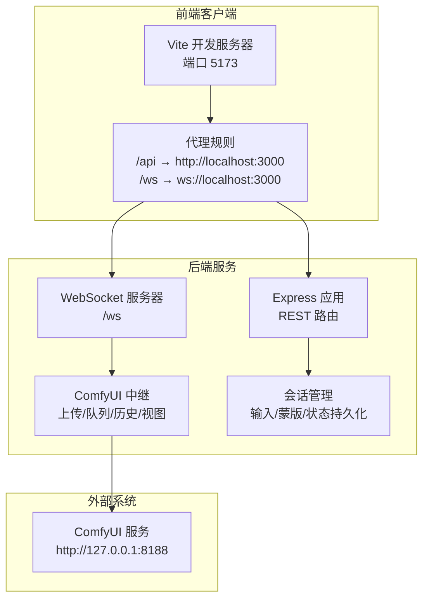
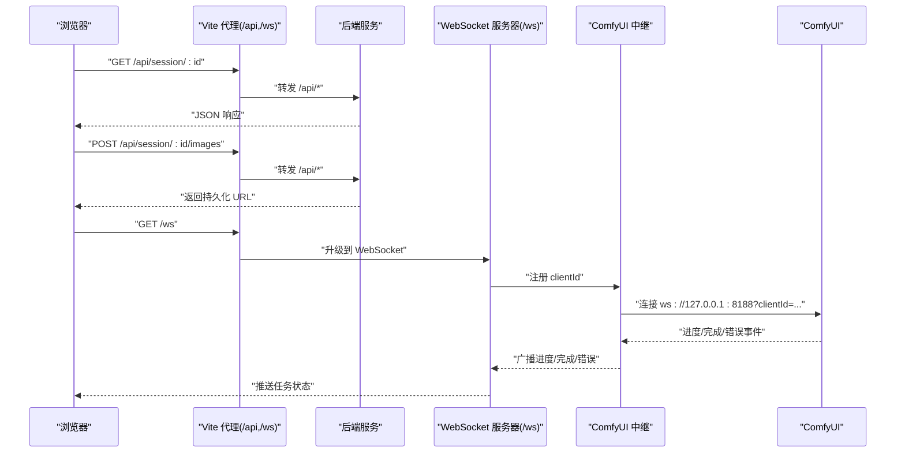
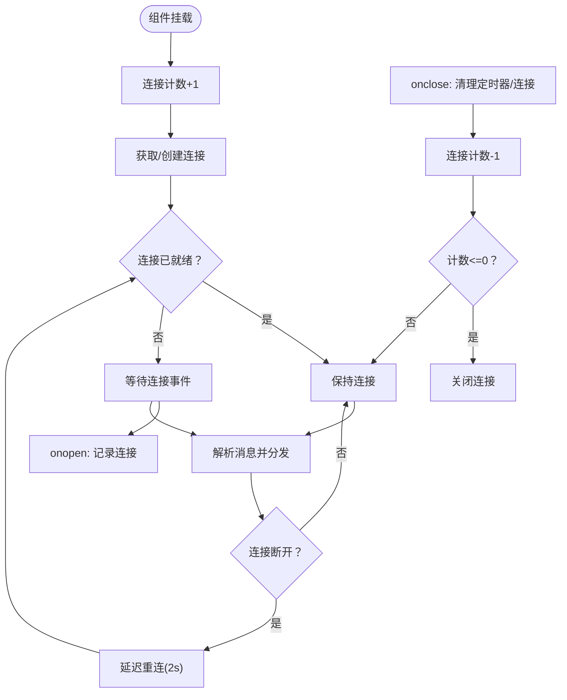
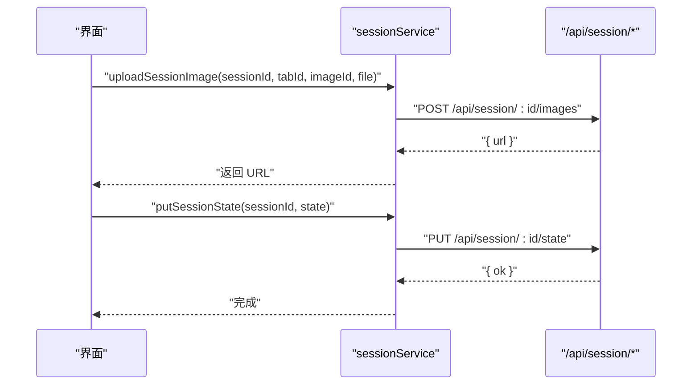
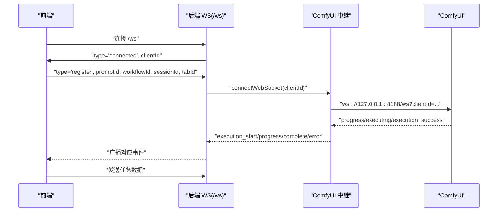
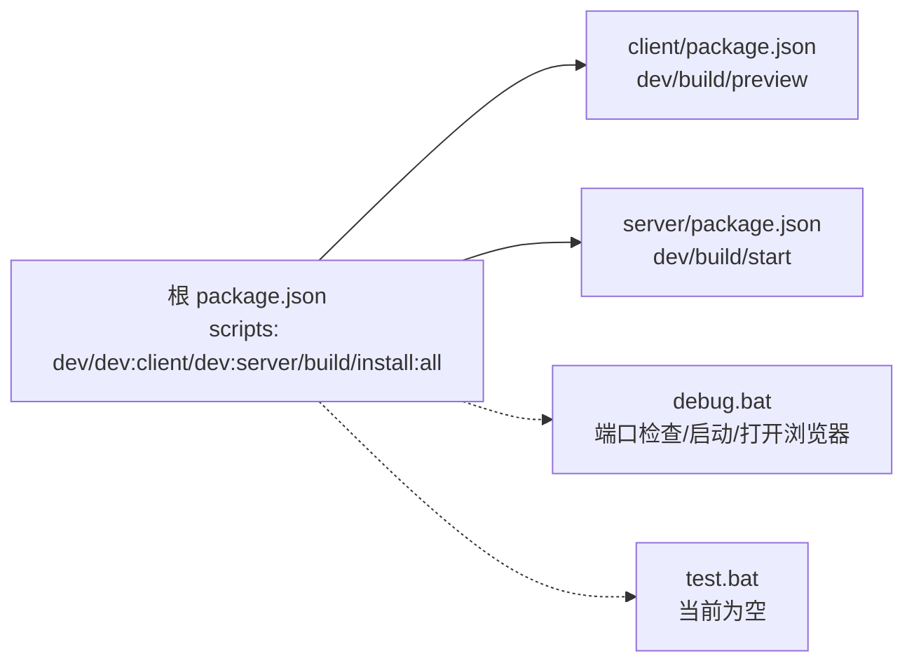

# 测试与调试

<cite>
**本文引用的文件**
- [test.bat](file://test.bat)
- [debug.bat](file://debug.bat)
- [package.json](file://package.json)
- [client/package.json](file://client/package.json)
- [server/package.json](file://server/package.json)
- [client/vite.config.ts](file://client/vite.config.ts)
- [client/src/hooks/useWebSocket.ts](file://client/src/hooks/useWebSocket.ts)
- [client/src/services/sessionService.ts](file://client/src/services/sessionService.ts)
- [server/src/index.ts](file://server/src/index.ts)
- [server/src/routes/session.ts](file://server/src/routes/session.ts)
- [server/src/services/comfyui.ts](file://server/src/services/comfyui.ts)
</cite>

## 目录
1. [简介](#简介)
2. [项目结构](#项目结构)
3. [核心组件](#核心组件)
4. [架构总览](#架构总览)
5. [详细组件分析](#详细组件分析)
6. [依赖关系分析](#依赖关系分析)
7. [性能考虑](#性能考虑)
8. [故障排查指南](#故障排查指南)
9. [结论](#结论)
10. [附录](#附录)

## 简介
本文件面向 CorineKit Pix2Real 的测试与调试实践，系统性梳理测试策略（单元测试、集成测试、端到端测试）与调试技巧（浏览器开发者工具、Node.js 调试器、WebSocket 调试、网络请求监控），并结合仓库现有脚本与源码，给出可操作的测试执行流程、覆盖率报告建议、自动化测试集成思路以及常见问题的诊断与修复路径。

## 项目结构
- 前端客户端位于 client/，基于 Vite + React 构建，开发服务器默认端口 5173，并通过代理将 /api 和 /ws 请求转发至后端服务。
- 后端服务位于 server/，基于 Express + ws 实现 REST 与 WebSocket，监听本地 3000 端口；同时作为 ComfyUI 的中继层，桥接任务进度、输出下载与会话持久化。
- 根目录提供多条启动与调试脚本：debug.bat 一键启动前后端并打开浏览器；test.bat 当前为空实现，可用于扩展测试流程；package.json 提供并发启动脚本。

图表来源
- [client/vite.config.ts:1-19](file://client/vite.config.ts#L1-L19)
- [server/src/index.ts:42-63](file://server/src/index.ts#L42-L63)
- [server/src/services/comfyui.ts:1-25](file://server/src/services/comfyui.ts#L1-L25)

章节来源
- [package.json:4-10](file://package.json#L4-L10)
- [client/vite.config.ts:1-19](file://client/vite.config.ts#L1-L19)
- [server/src/index.ts:42-63](file://server/src/index.ts#L42-L63)

## 核心组件
- WebSocket 客户端钩子：统一管理全局连接、消息分发、断线重连与发送消息，确保 UI 多处订阅共享同一连接实例。
- 会话服务：封装上传图片/蒙版、保存/加载/删除会话状态等 API，提供类型安全的请求与响应接口。
- 服务端入口：配置 CORS、静态资源、REST 路由与 WebSocket 服务器，负责将前端注册的任务映射转发给 ComfyUI 并回传进度与结果。
- 会话路由：处理会话级的文件上传与状态存取，支持多 Tab 数据与输入资源的持久化。
- ComfyUI 中继：封装上传图像/视频、入队、查询历史、拉取输出缓冲、系统统计、队列优先级调整等能力。

章节来源
- [client/src/hooks/useWebSocket.ts:1-99](file://client/src/hooks/useWebSocket.ts#L1-L99)
- [client/src/services/sessionService.ts:1-134](file://client/src/services/sessionService.ts#L1-L134)
- [server/src/index.ts:62-228](file://server/src/index.ts#L62-L228)
- [server/src/routes/session.ts:1-95](file://server/src/routes/session.ts#L1-L95)
- [server/src/services/comfyui.ts:1-285](file://server/src/services/comfyui.ts#L1-L285)

## 架构总览
下图展示从浏览器到后端再到 ComfyUI 的完整链路，包括 REST 与 WebSocket 的交互时序。

图表来源
- [client/vite.config.ts:8-17](file://client/vite.config.ts#L8-L17)
- [server/src/index.ts:62-228](file://server/src/index.ts#L62-L228)
- [server/src/services/comfyui.ts:127-188](file://server/src/services/comfyui.ts#L127-L188)

## 详细组件分析

### 组件一：WebSocket 客户端钩子（useWebSocket）
- 设计要点
  - 单例连接：全局维护一个 WebSocket 实例，避免重复连接与资源浪费。
  - 计数式生命周期：通过连接计数在组件卸载时关闭连接，防止泄漏。
  - 断线重连：在连接断开且存在活跃订阅时延迟重连，提升鲁棒性。
  - 消息分发：根据消息类型分派到工作流状态存储，驱动 UI 更新。
- 关键行为
  - onopen/onmessage/onclose/onerror 生命周期回调。
  - sendMessage 在连接就绪时发送 JSON 数据。
- 可测试点
  - 连接建立与断线重连逻辑。
  - 不同消息类型的分发正确性。
  - 多实例挂载/卸载对连接的影响。

图表来源
- [client/src/hooks/useWebSocket.ts:10-99](file://client/src/hooks/useWebSocket.ts#L10-L99)

章节来源
- [client/src/hooks/useWebSocket.ts:1-99](file://client/src/hooks/useWebSocket.ts#L1-L99)

### 组件二：会话服务（sessionService）
- 功能概览
  - 图像上传：multipart 表单上传，返回持久化 URL。
  - 蒙版上传：PNG 蒙版上传，按 Tab 与键名归档。
  - 状态读写：保存/加载/删除会话状态，支持 Beacon 场景的 POST 接口。
  - 列表与查询：列出最近会话、按 ID 查询。
- 错误处理
  - 对非 2xx 响应抛出错误，便于上层统一处理。
- 可测试点
  - 上传成功/失败分支。
  - 状态序列化/反序列化一致性。
  - 404 场景与空列表返回。

图表来源
- [client/src/services/sessionService.ts:71-113](file://client/src/services/sessionService.ts#L71-L113)
- [server/src/routes/session.ts:18-68](file://server/src/routes/session.ts#L18-L68)

章节来源
- [client/src/services/sessionService.ts:1-134](file://client/src/services/sessionService.ts#L1-L134)
- [server/src/routes/session.ts:1-95](file://server/src/routes/session.ts#L1-L95)

### 组件三：服务端入口与 WebSocket 中继
- 设计要点
  - CORS 配置允许前端地址访问。
  - 静态资源暴露输出与会话文件目录。
  - WebSocket 服务器接收前端连接，分配 clientId 并与 ComfyUI 建立连接。
  - 事件缓冲：在客户端注册前的进度事件进行缓冲，注册后重放。
  - 输出下载：完成后从 ComfyUI 拉取输出并保存到会话目录。
- 可测试点
  - CORS 与静态资源可达性。
  - WebSocket 注册与事件重放。
  - 完成事件触发与输出落盘。
  - 错误事件传播与清理。

图表来源
- [server/src/index.ts:73-219](file://server/src/index.ts#L73-L219)
- [server/src/services/comfyui.ts:127-188](file://server/src/services/comfyui.ts#L127-L188)

章节来源
- [server/src/index.ts:42-228](file://server/src/index.ts#L42-L228)
- [server/src/services/comfyui.ts:1-285](file://server/src/services/comfyui.ts#L1-L285)

### 组件四：会话路由（session.ts）
- 设计要点
  - 使用内存存储的 multer，支持大体积上传。
  - 图像/蒙版上传接口校验参数完整性。
  - 状态保存支持 PUT 与 POST（页面卸载场景）。
  - 会话列表与删除接口。
- 可测试点
  - 缺失字段的 400 场景。
  - 上传文件类型与命名规范。
  - 状态保存的数据结构一致性。

章节来源
- [server/src/routes/session.ts:1-95](file://server/src/routes/session.ts#L1-L95)

### 组件五：ComfyUI 中继（comfyui.ts）
- 设计要点
  - 封装上传图像/视频、入队、历史查询、输出视图、系统统计、队列优先级调整。
  - WebSocket 监听 progress/executing/execution_success/execution_error，去重与回调分发。
  - 队列重排：删除全部待处理项，先重新入队目标项，再按原顺序入队其余项。
- 可测试点
  - 上传/入队/历史/视图接口的 4xx/5xx 场景。
  - WebSocket 事件去重与回调顺序。
  - 队列优先级调整后的提示词 ID 映射。

章节来源
- [server/src/services/comfyui.ts:1-285](file://server/src/services/comfyui.ts#L1-L285)

## 依赖关系分析
- 前端依赖
  - Vite 提供开发服务器与代理；React 生态组件；Zustand 状态管理；lucide-react 图标。
- 后端依赖
  - Express 提供 REST；ws 提供 WebSocket；multer 处理上传；node-fetch 与 form-data 访问 ComfyUI。
- 根脚本
  - concurrently 并发启动前后端；debug.bat 自动释放端口、启动服务并打开浏览器；test.bat 当前为空，可扩展为测试入口。

图表来源
- [package.json:4-10](file://package.json#L4-L10)
- [client/package.json:6-9](file://client/package.json#L6-L9)
- [server/package.json:6-9](file://server/package.json#L6-L9)
- [debug.bat:1-57](file://debug.bat#L1-L57)
- [test.bat:1-4](file://test.bat#L1-L4)

章节来源
- [package.json:1-15](file://package.json#L1-L15)
- [client/package.json:1-25](file://client/package.json#L1-L25)
- [server/package.json:1-28](file://server/package.json#L1-L28)
- [debug.bat:1-57](file://debug.bat#L1-L57)
- [test.bat:1-4](file://test.bat#L1-L4)

## 性能考虑
- WebSocket 连接复用与断线重连
  - 使用单例连接减少握手与资源消耗；合理设置重连间隔，避免频繁重建。
- 事件缓冲与重放
  - 在客户端注册前缓冲进度事件，降低首屏延迟带来的信息丢失风险。
- 上传与下载
  - 使用内存存储 multer 适合开发环境；生产环境建议限制大小并采用流式处理。
- 队列优先级
  - 通过删除全部待处理项并重排，确保关键任务优先执行，减少等待时间。
- 前端代理
  - Vite 代理将 /api 与 /ws 转发至后端，减少跨域与代理复杂度。

章节来源
- [client/src/hooks/useWebSocket.ts:1-99](file://client/src/hooks/useWebSocket.ts#L1-L99)
- [server/src/index.ts:80-90](file://server/src/index.ts#L80-L90)
- [server/src/services/comfyui.ts:255-284](file://server/src/services/comfyui.ts#L255-L284)
- [client/vite.config.ts:8-17](file://client/vite.config.ts#L8-L17)

## 故障排查指南

### WebSocket 连接问题
- 症状
  - 页面无进度更新、断线后不自动重连。
- 排查步骤
  - 检查后端 WebSocket 是否正常监听与升级：确认 /ws 路径可用。
  - 查看前端日志：确认 onopen/onclose/onerror 触发情况。
  - 确认代理是否正确转发 /ws 至后端。
- 解决方案
  - 修正代理配置；确保后端端口未被占用；必要时重启服务。

章节来源
- [client/src/hooks/useWebSocket.ts:22-69](file://client/src/hooks/useWebSocket.ts#L22-L69)
- [client/vite.config.ts:13-16](file://client/vite.config.ts#L13-L16)
- [server/src/index.ts:62-63](file://server/src/index.ts#L62-L63)

### API 调用失败
- 症状
  - 上传图片/蒙版失败、会话状态保存异常。
- 排查步骤
  - 检查 /api/session/* 接口返回状态码与错误信息。
  - 确认 multipart 字段与参数完整性。
  - 校验会话目录权限与磁盘空间。
- 解决方案
  - 修复缺失字段；优化上传逻辑；增加错误提示与重试。

章节来源
- [client/src/services/sessionService.ts:71-113](file://client/src/services/sessionService.ts#L71-L113)
- [server/src/routes/session.ts:18-49](file://server/src/routes/session.ts#L18-L49)

### 性能瓶颈分析
- 症状
  - 任务执行缓慢、CPU/GPU 占用高。
- 排查步骤
  - 通过系统统计接口观察 VRAM/内存使用率。
  - 分析队列状态，识别阻塞项。
  - 检查输出下载耗时与磁盘 IO。
- 解决方案
  - 调整模型与采样参数；优先处理关键任务；优化输出保存策略。

章节来源
- [server/src/services/comfyui.ts:106-125](file://server/src/services/comfyui.ts#L106-L125)
- [server/src/services/comfyui.ts:202-221](file://server/src/services/comfyui.ts#L202-L221)

### 调试工具与技巧
- 浏览器开发者工具
  - Network：监控 /api 与 /ws 请求，查看响应体与状态码。
  - Console：关注 WebSocket 日志与错误信息。
  - Sources：断点调试前端状态更新逻辑。
- Node.js 调试器
  - 使用后端脚本中的 watch 模式启动，配合断点调试服务端逻辑。
- WebSocket 调试
  - 使用浏览器 WebSocket 工具或第三方客户端验证消息格式与事件顺序。
- 网络请求监控
  - 通过代理日志与后端控制台输出定位请求链路问题。

章节来源
- [client/src/hooks/useWebSocket.ts:22-69](file://client/src/hooks/useWebSocket.ts#L22-L69)
- [server/src/index.ts:223-227](file://server/src/index.ts#L223-L227)
- [server/src/services/comfyui.ts:183-185](file://server/src/services/comfyui.ts#L183-L185)

### 测试脚本使用指南
- debug.bat
  - 自动检测并释放 3000/5173 端口；分别启动后端与前端；等待后自动打开浏览器。
  - 建议在每次修改后端或前端代码后运行以快速验证。
- test.bat
  - 当前为空实现，建议扩展为：
    - 执行前端构建与测试（如 Vite/React 测试命令）。
    - 执行后端构建与测试（如 TS 编译 + 单元测试）。
    - 生成覆盖率报告（如 Istanbul 或 c8）。
    - 集成 E2E 测试（如 Playwright/Cypress）。
- 根脚本
  - 使用 concurrently 并发启动前后端，便于联调。

章节来源
- [debug.bat:1-57](file://debug.bat#L1-L57)
- [test.bat:1-4](file://test.bat#L1-L4)
- [package.json:4-10](file://package.json#L4-L10)

## 结论
本项目具备清晰的前后端分离架构与完善的代理与 WebSocket 机制。建议在现有基础上完善测试体系（单元/集成/E2E）与覆盖率报告，并持续优化 WebSocket 事件处理与队列优先级策略，以提升稳定性与用户体验。

## 附录

### 测试策略与方法
- 单元测试
  - 覆盖 useWebSocket 的连接/断线/重连逻辑与消息分发。
  - 覆盖 sessionService 的上传/保存/加载/删除流程。
  - 覆盖服务端路由的参数校验与错误处理。
- 集成测试
  - 覆盖 /api 与 /ws 的端到端链路，模拟任务提交、进度回传与输出落盘。
  - 验证 ComfyUI 中继的上传/入队/历史/视图与系统统计接口。
- 端到端测试
  - 使用真实浏览器与后端服务，覆盖典型工作流（如会话保存、图片上传、任务执行）。

### 自动化测试集成建议
- 前端
  - 使用 Vite 测试命令与 Jest/React Testing Library。
  - 集成覆盖率收集与 CI 报告。
- 后端
  - 使用 TS 编译 + Mocha/Chai/Jest。
  - 集成 OpenAPI/Swagger 文档驱动的契约测试。
- 脚本扩展
  - 在 test.bat 中串联前端构建/测试、后端构建/测试与覆盖率生成。
  - 在 CI 中调用 debug.bat 启动服务并执行 E2E 测试。