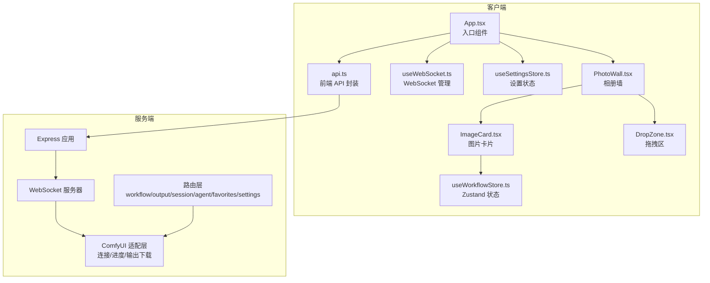
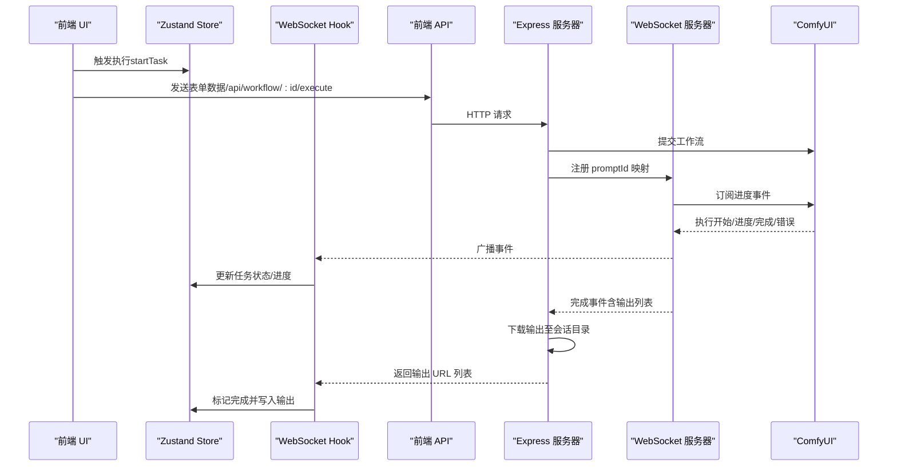
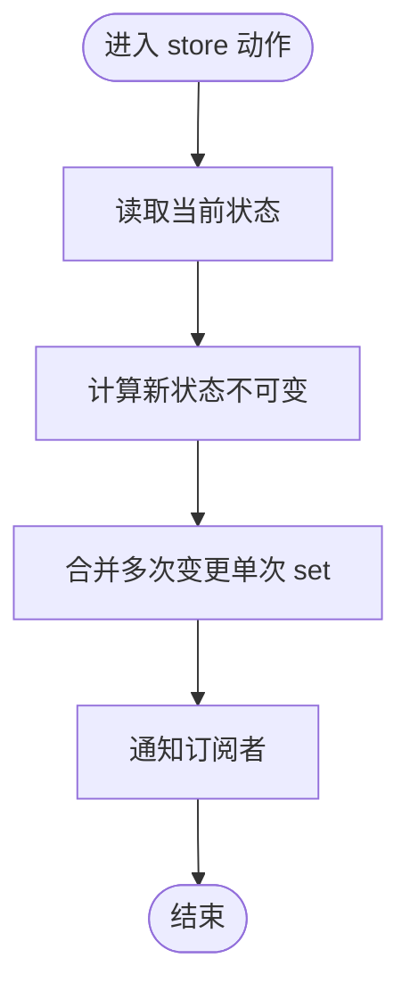
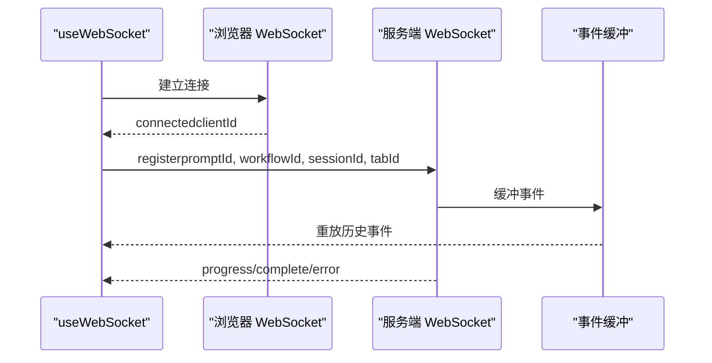
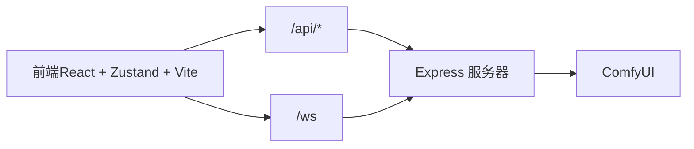

# 代码规范与最佳实践

<cite>
**本文引用的文件**
- [client/package.json](file://client/package.json)
- [server/package.json](file://server/package.json)
- [client/tsconfig.json](file://client/tsconfig.json)
- [server/tsconfig.json](file://server/tsconfig.json)
- [client/vite.config.ts](file://client/vite.config.ts)
- [README.md](file://README.md)
- [client/src/types/index.ts](file://client/src/types/index.ts)
- [client/src/hooks/useWorkflowStore.ts](file://client/src/hooks/useWorkflowStore.ts)
- [client/src/hooks/useSettingsStore.ts](file://client/src/hooks/useSettingsStore.ts)
- [client/src/hooks/usePromptAssistantStore.ts](file://client/src/hooks/usePromptAssistantStore.ts)
- [client/src/components/App.tsx](file://client/src/components/App.tsx)
- [client/src/main.tsx](file://client/src/main.tsx)
- [client/src/components/ImageCard.tsx](file://client/src/components/ImageCard.tsx)
- [client/src/components/DropZone.tsx](file://client/src/components/DropZone.tsx)
- [client/src/components/PhotoWall.tsx](file://client/src/components/PhotoWall.tsx)
- [client/src/hooks/useWebSocket.ts](file://client/src/hooks/useWebSocket.ts)
- [client/src/services/api.ts](file://client/src/services/api.ts)
- [server/src/index.ts](file://server/src/index.ts)
</cite>

## 目录
1. [简介](#简介)
2. [项目结构](#项目结构)
3. [核心组件](#核心组件)
4. [架构总览](#架构总览)
5. [详细组件分析](#详细组件分析)
6. [依赖关系分析](#依赖关系分析)
7. [性能考量](#性能考量)
8. [故障排查指南](#故障排查指南)
9. [结论](#结论)
10. [附录](#附录)

## 简介
本文件面向 CorineKit Pix2Real 项目，提供一套完整的 TypeScript 编码标准、React 组件设计原则、Zustand 状态管理最佳实践、文件组织与模块化设计规范，以及代码格式化、注释与文档编写标准。内容结合仓库现有实现，给出正反例对比与可视化流程，帮助团队统一风格、提升可维护性与性能表现。

## 项目结构
项目采用前后端分离架构，前端使用 Vite + React + TypeScript，后端使用 Express + ws + TypeScript。客户端通过代理访问后端 API，并通过 WebSocket 实时接收 ComfyUI 的进度事件。



图表来源
- [client/src/components/App.tsx:61-422](file://client/src/components/App.tsx#L61-L422)
- [client/src/components/PhotoWall.tsx:103-781](file://client/src/components/PhotoWall.tsx#L103-L781)
- [client/src/components/ImageCard.tsx:51-800](file://client/src/components/ImageCard.tsx#L51-L800)
- [client/src/components/DropZone.tsx:40-181](file://client/src/components/DropZone.tsx#L40-L181)
- [client/src/hooks/useWorkflowStore.ts:191-923](file://client/src/hooks/useWorkflowStore.ts#L191-L923)
- [client/src/hooks/useWebSocket.ts:29-278](file://client/src/hooks/useWebSocket.ts#L29-L278)
- [client/src/hooks/useSettingsStore.ts:54-177](file://client/src/hooks/useSettingsStore.ts#L54-L177)
- [client/src/services/api.ts:3-42](file://client/src/services/api.ts#L3-L42)
- [server/src/index.ts:118-516](file://server/src/index.ts#L118-L516)

章节来源
- [README.md: 项目结构与特性:41-79](file://README.md#L41-L79)
- [client/vite.config.ts: 开发代理配置:1-28](file://client/vite.config.ts#L1-L28)

## 核心组件
- 类型系统与接口设计
  - 使用明确的接口描述数据结构，如 ImageItem、TaskInfo、WSMessage 等，确保跨模块契约稳定。
  - 使用联合类型表达枚举值，如 TaskStatus、PromptMode 等，避免魔法字符串。
  - 对外暴露的类型尽量收敛在 types/index.ts，便于集中维护与导出。

- 状态管理（Zustand）
  - 将状态切分为多个独立 store（如 useWorkflowStore、useSettingsStore、usePromptAssistantStore），降低耦合与订阅成本。
  - 使用 create + 类型参数声明 StoreState，保证类型安全与自动补全。
  - 通过 selector 订阅（如 useShallow）减少不必要的重渲染。

- WebSocket 管理
  - 采用单例模式管理 WebSocket 连接，避免重复连接与资源浪费。
  - 通过消息注册机制（register）建立 promptId 与工作流/会话映射，确保进度事件正确分发。

- 组件设计
  - 以职责单一的函数组件为主，props 设计遵循“最小必要集”，避免过度注入。
  - 使用 memo 与 useMemo/useCallback 缓存昂贵计算与子组件，提升渲染性能。
  - 通过 Portal 或内联样式控制交互层（如遮罩、对话框），避免层级混乱。

章节来源
- [client/src/types/index.ts: 类型定义:1-76](file://client/src/types/index.ts#L1-L76)
- [client/src/hooks/useWorkflowStore.ts: 状态切分与动作:101-183](file://client/src/hooks/useWorkflowStore.ts#L101-L183)
- [client/src/hooks/useSettingsStore.ts: 设置状态:19-52](file://client/src/hooks/useSettingsStore.ts#L19-L52)
- [client/src/hooks/usePromptAssistantStore.ts: 提示词助理状态:5-13](file://client/src/hooks/usePromptAssistantStore.ts#L5-L13)
- [client/src/hooks/useWebSocket.ts: 单例连接与消息处理:9-278](file://client/src/hooks/useWebSocket.ts#L9-L278)

## 架构总览
下图展示从前端发起任务到后端 ComfyUI 执行、事件回传与输出落盘的完整链路。



图表来源
- [client/src/components/ImageCard.tsx: 执行流程:502-515](file://client/src/components/ImageCard.tsx#L502-L515)
- [client/src/hooks/useWebSocket.ts: 事件分发:45-159](file://client/src/hooks/useWebSocket.ts#L45-L159)
- [server/src/index.ts: WebSocket 事件处理与输出下载:273-464](file://server/src/index.ts#L273-L464)

## 详细组件分析

### Zustand 状态管理最佳实践
- 状态切分
  - 将业务状态拆分为多个 store，如 useWorkflowStore（工作流/任务/图片）、useSettingsStore（设置）、usePromptAssistantStore（提示词助理）等，避免全局状态臃肿。
- 动作设计
  - 将副作用封装在 store 内部（如异步请求、本地存储），对外只暴露稳定的动作签名。
  - 使用 selector 订阅（useShallow）精准订阅，减少无关重渲染。
- 状态更新策略
  - 优先使用不可变更新（展开对象/数组），避免直接修改共享引用。
  - 对批量更新使用单次 set 调用，减少订阅触发次数。
- 性能优化
  - 对高频计算使用 useMemo/useCallback 缓存。
  - 对大型集合使用索引映射（Record）替代数组查找，降低 O(n) 成本。



图表来源
- [client/src/hooks/useWorkflowStore.ts: 状态更新与批处理:297-360](file://client/src/hooks/useWorkflowStore.ts#L297-L360)
- [client/src/hooks/useSettingsStore.ts: 本地存储与状态同步:88-131](file://client/src/hooks/useSettingsStore.ts#L88-L131)

章节来源
- [client/src/hooks/useWorkflowStore.ts: 动作与状态结构:101-183](file://client/src/hooks/useWorkflowStore.ts#L101-L183)
- [client/src/hooks/useSettingsStore.ts: 状态与持久化:54-177](file://client/src/hooks/useSettingsStore.ts#L54-L177)

### WebSocket 管理与实时进度
- 单例连接
  - 通过全局变量与计数器管理连接生命周期，确保组件卸载后自动关闭，避免泄漏。
- 事件缓冲与重放
  - 对每个 promptId 维护事件缓冲，在客户端注册前将事件重放，保证首屏体验。
- 任务映射
  - 客户端发送 register 消息携带 promptId、workflowId、sessionId、tabId，服务端据此建立映射，用于输出下载与通知。



图表来源
- [client/src/hooks/useWebSocket.ts: 单例与消息处理:29-278](file://client/src/hooks/useWebSocket.ts#L29-L278)
- [server/src/index.ts: 事件缓冲与重放:178-185](file://server/src/index.ts#L178-L185)

章节来源
- [client/src/hooks/useWebSocket.ts: 单例与消息处理:9-278](file://client/src/hooks/useWebSocket.ts#L9-L278)
- [server/src/index.ts: 事件缓冲与重放:178-185](file://server/src/index.ts#L178-L185)

### React 组件设计原则
- 组件结构
  - 函数组件 + Hooks，避免类组件；将副作用集中在 hooks 中，保持 UI 纯函数特性。
  - 子组件通过 props 传递数据与回调，避免跨层级直接访问 store。
- Props 设计
  - 以“最小必要集”为原则，避免注入过多上下文；对复杂 props 使用组合对象（如配置对象）。
  - 对于可选属性，提供默认值或显式可选类型，避免运行时错误。
- 状态管理
  - 将与 UI 展示强相关的状态保留在组件内部（如 hover、焦点、动画），与业务状态分离。
  - 对全局状态使用 store，避免在多处重复维护同一份状态。
- 性能优化
  - 使用 memo 与 shallow 订阅，减少子组件重渲染。
  - 对长列表使用虚拟化或懒渲染（如 LazyCard），降低首屏压力。

```mermaid
classDiagram
class App {
+props : {}
+状态 : 主题/视图尺寸/侧栏宽度
+事件 : 拖拽/窗口大小变化
}
class PhotoWall {
+props : viewSize
+状态 : 选中项/批量操作
+事件 : 批量执行/删除/重命名
}
class ImageCard {
+props : image, isMultiSelectMode, isSelected
+状态 : 悬停/拖拽/进度
+事件 : 执行/删除/重命名/打开编辑器
}
App --> PhotoWall : "包含"
PhotoWall --> ImageCard : "渲染列表"
```

图表来源
- [client/src/components/App.tsx: 应用容器:61-422](file://client/src/components/App.tsx#L61-L422)
- [client/src/components/PhotoWall.tsx: 相册墙:103-781](file://client/src/components/PhotoWall.tsx#L103-L781)
- [client/src/components/ImageCard.tsx: 图片卡片:51-800](file://client/src/components/ImageCard.tsx#L51-L800)

章节来源
- [client/src/components/App.tsx: 应用容器与拖拽处理:61-422](file://client/src/components/App.tsx#L61-L422)
- [client/src/components/PhotoWall.tsx: 批量操作与懒渲染:103-781](file://client/src/components/PhotoWall.tsx#L103-L781)
- [client/src/components/ImageCard.tsx: 执行与进度覆盖层:502-800](file://client/src/components/ImageCard.tsx#L502-L800)

### 文件组织与模块化设计
- 目录划分
  - client/src/components：UI 组件（按功能分组）
  - client/src/hooks：自定义 hooks（按领域分组）
  - client/src/services：API 封装与工具
  - client/src/types：全局类型定义
  - server/src：后端源码（routes/services/adapters 等）
- 导入与依赖
  - 遵循“自上而下”的导入方向，避免循环依赖。
  - 对第三方库与内置模块分组，提升可读性。
- 配置与构建
  - 前端使用 Vite 代理到后端端口，开发体验良好。
  - TypeScript 严格模式开启，禁用未使用局部变量与参数，提升健壮性。

章节来源
- [client/package.json: 依赖与脚本:11-24](file://client/package.json#L11-L24)
- [server/package.json: 依赖与脚本:11-26](file://server/package.json#L11-L26)
- [client/tsconfig.json: 编译选项:2-18](file://client/tsconfig.json#L2-L18)
- [server/tsconfig.json: 编译选项:2-15](file://server/tsconfig.json#L2-L15)
- [client/vite.config.ts: 代理配置:6-26](file://client/vite.config.ts#L6-L26)

## 依赖关系分析
- 前端依赖
  - React 生态：react、react-dom、lucide-react
  - 状态管理：zustand
  - 构建与开发：@vitejs/plugin-react、vite、typescript
- 后端依赖
  - Web 服务：express、ws
  - 文件上传与下载：multer、node-fetch
  - 跨域与类型：cors、@types/*
- 关键耦合点
  - 前端通过 /api 与 /ws 与后端通信，需保持协议稳定。
  - WebSocket 注册消息承载 promptId/workflowId/sessionId，必须与后端映射一致。



图表来源
- [client/vite.config.ts: 代理规则:8-25](file://client/vite.config.ts#L8-L25)
- [server/src/index.ts: 路由与 WebSocket:118-158](file://server/src/index.ts#L118-L158)

章节来源
- [client/package.json: 依赖:11-24](file://client/package.json#L11-L24)
- [server/package.json: 依赖:11-26](file://server/package.json#L11-L26)
- [client/vite.config.ts: 代理:1-28](file://client/vite.config.ts#L1-L28)
- [server/src/index.ts: 路由与 WebSocket:118-158](file://server/src/index.ts#L118-L158)

## 性能考量
- 渲染性能
  - 使用 useShallow 与 memo 降低重渲染频率。
  - 长列表采用懒渲染（IntersectionObserver）与估算高度补偿，减少滚动抖动。
- 状态更新
  - 批量更新使用单次 set，避免多次订阅触发。
  - 对大型对象使用索引映射，减少 O(n) 查找。
- 网络与 I/O
  - WebSocket 单例连接，避免重复握手。
  - 输出下载在服务端完成，前端仅接收 URL 列表，减少传输体积。
- 资源管理
  - 及时清理定时器、事件监听与临时 URL（如 revokeObjectURL）。
  - 视频/画布等资源在组件卸载时释放。

章节来源
- [client/src/components/PhotoWall.tsx: 懒渲染与滚动补偿:21-97](file://client/src/components/PhotoWall.tsx#L21-L97)
- [client/src/hooks/useWorkflowStore.ts: 批量更新与清理:297-360](file://client/src/hooks/useWorkflowStore.ts#L297-L360)
- [client/src/hooks/useWebSocket.ts: 单例与清理:254-278](file://client/src/hooks/useWebSocket.ts#L254-L278)
- [server/src/index.ts: 输出下载与事件缓冲:373-420](file://server/src/index.ts#L373-L420)

## 故障排查指南
- WebSocket 无响应
  - 检查代理是否正确转发 /ws 到后端端口。
  - 确认客户端是否发送 register 消息，服务端是否建立 promptId 映射。
  - 查看服务端日志中是否有事件缓冲与重放记录。
- 任务完成但输出为空
  - 等待历史提交稳定（服务端有重试逻辑），确认输出目录权限与路径。
  - 检查 ComfyUI 输出节点类型是否为 output。
- 进度回退或停滞
  - 多轮节点（如 tiled sampler）使用 tick 计数推进，避免受 max 重置影响。
  - 检查节点权重配置与 totalWeight 是否合理。
- 前端卡顿
  - 检查是否存在深层订阅导致的频繁重渲染。
  - 确认懒渲染与估算高度补偿是否生效。

章节来源
- [client/src/hooks/useWebSocket.ts: 事件缓冲与重放:178-185](file://client/src/hooks/useWebSocket.ts#L178-L185)
- [server/src/index.ts: 历史重试与输出下载:350-420](file://server/src/index.ts#L350-L420)
- [server/src/index.ts: 多轮节点推进逻辑:325-333](file://server/src/index.ts#L325-L333)

## 结论
本规范以现有代码实现为基础，总结了 TypeScript 类型设计、React 组件结构、Zustand 状态管理与 WebSocket 实时通信的最佳实践。建议团队在后续迭代中：
- 严格遵守类型定义与接口契约，避免魔法字符串与隐式类型。
- 持续优化渲染性能，减少不必要重渲染。
- 保持前后端协议稳定，完善错误处理与可观测性。
- 在新增功能时遵循模块化与单一职责原则，提升可维护性。

## 附录

### TypeScript 编码标准
- 类型定义
  - 使用接口描述对象结构，使用联合类型表达枚举值。
  - 对外暴露的类型集中管理，避免分散定义。
- 命名约定
  - 接口以大驼峰命名（如 ImageItem），类型别名以大驼峰命名（如 TaskStatus）。
  - 常量使用全大写下划线（如 WORKFLOW_ID）。
- 泛型与类型断言
  - 优先使用泛型约束而非 any，谨慎使用类型断言。
- 导入与导出
  - 明确区分默认导出与具名导出，避免混用造成 IDE 提示问题。

章节来源
- [client/src/types/index.ts: 类型定义:1-76](file://client/src/types/index.ts#L1-L76)

### React 组件设计原则
- 组件结构
  - 函数组件 + Hooks，避免类组件。
  - 将副作用集中在 hooks，保持 UI 纯函数。
- Props 设计
  - 最小必要集，避免注入过多上下文。
  - 对可选属性提供默认值或显式可选类型。
- 状态管理
  - UI 展示状态保留在组件内部，业务状态放入 store。
  - 使用 shallow 订阅与 memo 降低重渲染。
- 错误处理
  - 对外部 API 调用进行 try/catch，提供降级与提示。
  - 对用户操作提供即时反馈（toast）。

章节来源
- [client/src/components/App.tsx: 组件结构与事件处理:61-422](file://client/src/components/App.tsx#L61-L422)
- [client/src/components/PhotoWall.tsx: 批量操作与懒渲染:103-781](file://client/src/components/PhotoWall.tsx#L103-L781)
- [client/src/components/ImageCard.tsx: 执行与进度覆盖层:502-800](file://client/src/components/ImageCard.tsx#L502-L800)

### Zustand 使用规范
- 状态切分
  - 按领域拆分 store，避免全局臃肿。
- 动作设计
  - 将副作用封装在 store 内部，暴露稳定动作签名。
- 状态更新
  - 不可变更新，单次 set 合并多次变更。
- 订阅优化
  - 使用 useShallow 与 memo，减少重渲染。

章节来源
- [client/src/hooks/useWorkflowStore.ts: 动作与状态结构:101-183](file://client/src/hooks/useWorkflowStore.ts#L101-L183)
- [client/src/hooks/useSettingsStore.ts: 状态与持久化:54-177](file://client/src/hooks/useSettingsStore.ts#L54-L177)

### 文件组织与模块化设计
- 目录划分
  - client/src/components、hooks、services、types
  - server/src/routes、services、adapters
- 导入与依赖
  - 遵循“自上而下”导入方向，避免循环依赖。
- 配置与构建
  - Vite 代理与 TypeScript 严格模式。

章节来源
- [client/package.json: 依赖与脚本:11-24](file://client/package.json#L11-L24)
- [server/package.json: 依赖与脚本:11-26](file://server/package.json#L11-L26)
- [client/tsconfig.json: 编译选项:2-18](file://client/tsconfig.json#L2-L18)
- [server/tsconfig.json: 编译选项:2-15](file://server/tsconfig.json#L2-L15)
- [client/vite.config.ts: 代理配置:1-28](file://client/vite.config.ts#L1-L28)

### 代码格式化与注释规范
- 格式化
  - 使用 TypeScript 严格模式，启用 noUnusedLocals/noUnusedParameters。
  - 统一使用分号与逗号结尾，保持一致的缩进与换行。
- 注释
  - 对公共 API 与复杂逻辑添加简要注释，说明意图与边界条件。
  - 对跨模块交互（如 WebSocket 注册）补充调用方与被调方的注意事项。
- 文档
  - README 中保留项目结构与架构说明，便于新成员快速上手。

章节来源
- [client/tsconfig.json: 编译选项:14-18](file://client/tsconfig.json#L14-L18)
- [server/tsconfig.json: 编译选项:14-15](file://server/tsconfig.json#L14-L15)
- [README.md: 项目结构与架构:41-79](file://README.md#L41-L79)