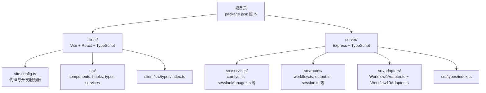
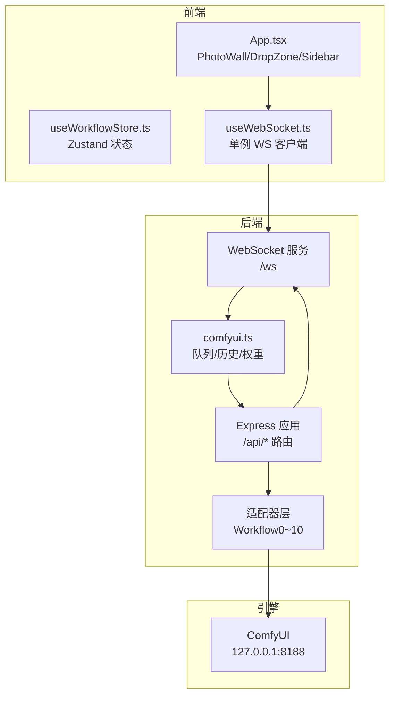
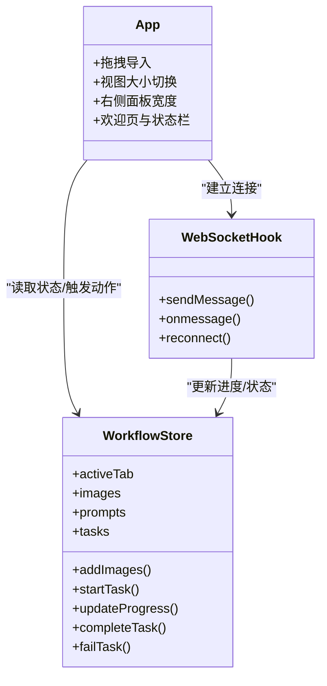
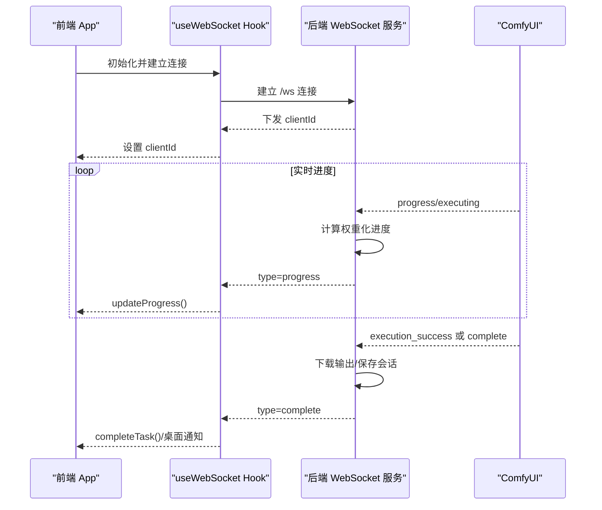
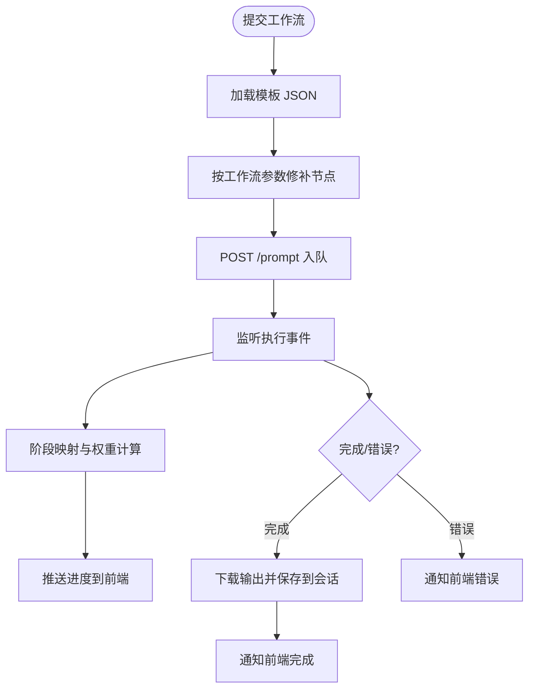
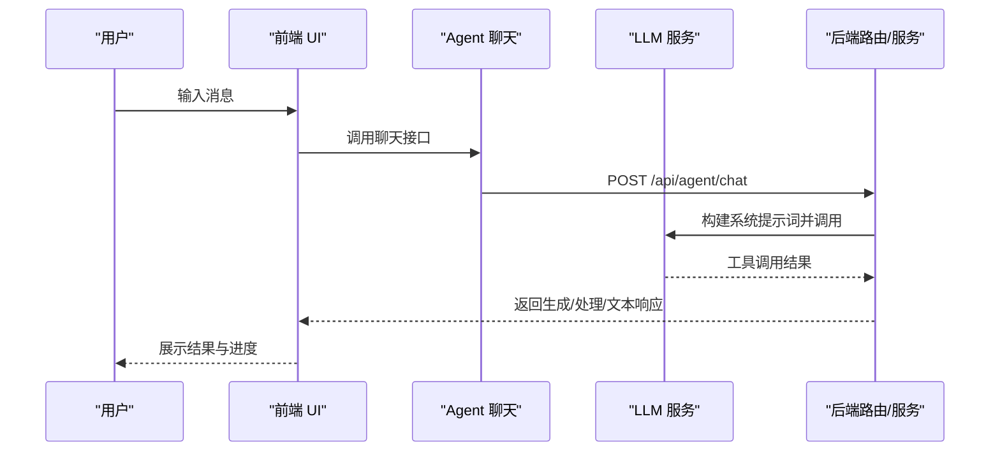
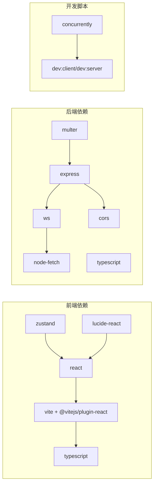

# 开发者指南

<cite>
**本文引用的文件**
- [README.md](file://README.md)
- [package.json](file://package.json)
- [client/package.json](file://client/package.json)
- [server/package.json](file://server/package.json)
- [client/tsconfig.json](file://client/tsconfig.json)
- [server/tsconfig.json](file://server/tsconfig.json)
- [client/vite.config.ts](file://client/vite.config.ts)
- [client/src/main.tsx](file://client/src/main.tsx)
- [client/src/components/App.tsx](file://client/src/components/App.tsx)
- [client/src/hooks/useWorkflowStore.ts](file://client/src/hooks/useWorkflowStore.ts)
- [client/src/hooks/useWebSocket.ts](file://client/src/hooks/useWebSocket.ts)
- [client/src/types/index.ts](file://client/src/types/index.ts)
- [server/src/index.ts](file://server/src/index.ts)
- [server/src/services/comfyui.ts](file://server/src/services/comfyui.ts)
- [server/src/types/index.ts](file://server/src/types/index.ts)
- [docs/LLM系统提示词汇总.md](file://docs/LLM系统提示词汇总.md)
- [docs/SystemPrompt.txt](file://docs/SystemPrompt.txt)
</cite>

## 目录
1. [简介](#简介)
2. [项目结构](#项目结构)
3. [核心组件](#核心组件)
4. [架构总览](#架构总览)
5. [详细组件分析](#详细组件分析)
6. [依赖关系分析](#依赖关系分析)
7. [性能考量](#性能考量)
8. [故障排查指南](#故障排查指南)
9. [结论](#结论)
10. [附录](#附录)

## 简介
CorineKit Pix2Real 是一个基于本地 Web UI 的批量图像/视频处理系统，通过 ComfyUI 实现工作流编排与实时进度反馈。它提供多种内置工作流（如二次元转真人、真人精修、视频生成与放大等），支持拖拽导入、批处理、实时进度与输出目录一键打开，并具备 VRAM 释放与深浅主题切换等实用特性。

- 项目目标：简化 AI 图像/视频生成的本地化使用体验，提供直观的 UI 与稳定的后端桥接。
- 技术栈：前端采用 Vite + React + TypeScript；后端采用 Express + TypeScript；WebSocket 实现实时进度转发；ComfyUI 作为工作流引擎。
- 关键特性：适配多工作流、权重化进度条、缓存节点跳过、多轮采样与 tiled 采样补偿、桌面通知、AI Agent 对话与提示词助手。

**章节来源**
- [README.md:1-79](file://README.md#L1-L79)

## 项目结构
项目采用前后端分离的双包管理方式，根目录提供统一的开发与构建脚本，分别进入 client 与 server 子目录执行各自构建流程。

**图表来源**
- [package.json:1-15](file://package.json#L1-L15)
- [client/vite.config.ts:1-28](file://client/vite.config.ts#L1-L28)
- [server/src/index.ts:1-516](file://server/src/index.ts#L1-L516)

**章节来源**
- [README.md:41-79](file://README.md#L41-L79)
- [package.json:4-10](file://package.json#L4-L10)

## 核心组件
- 前端应用入口与路由：App 组件负责布局、拖拽导入、侧边栏与状态栏渲染，以及 Agent 功能集成。
- 状态管理：useWorkflowStore 使用 Zustand 管理工作流卡片、任务进度、提示词与会话数据，支持跨标签页隔离与批量操作。
- WebSocket 管理：useWebSocket 以单例模式维护与后端的长连接，接收进度、完成与错误事件，驱动 UI 更新与桌面通知。
- 后端服务：Express 提供 REST API 与 WebSocket 服务，适配多工作流适配器，连接 ComfyUI 并进行权重化进度计算与输出下载。
- 类型定义：前后端共享的类型定义确保消息协议一致性，包括任务状态、进度事件与 ComfyUI 历史结构。

**章节来源**
- [client/src/components/App.tsx:1-422](file://client/src/components/App.tsx#L1-L422)
- [client/src/hooks/useWorkflowStore.ts:1-923](file://client/src/hooks/useWorkflowStore.ts#L1-L923)
- [client/src/hooks/useWebSocket.ts:1-278](file://client/src/hooks/useWebSocket.ts#L1-L278)
- [server/src/index.ts:1-516](file://server/src/index.ts#L1-L516)
- [client/src/types/index.ts:1-76](file://client/src/types/index.ts#L1-L76)
- [server/src/types/index.ts:1-52](file://server/src/types/index.ts#L1-L52)

## 架构总览
系统采用“前端 UI + 后端桥接 + ComfyUI 引擎”的三层架构。前端通过 WebSocket 与后端保持实时通信，后端将 ComfyUI 的进度事件转换为权重化进度并回传前端，同时在完成后下载输出文件并持久化到会话目录。

**图表来源**
- [client/src/components/App.tsx:1-422](file://client/src/components/App.tsx#L1-L422)
- [client/src/hooks/useWebSocket.ts:1-278](file://client/src/hooks/useWebSocket.ts#L1-L278)
- [server/src/index.ts:157-494](file://server/src/index.ts#L157-L494)
- [server/src/services/comfyui.ts:265-375](file://server/src/services/comfyui.ts#L265-L375)

## 详细组件分析

### 前端应用与状态管理
- App.tsx 负责页面布局、拖拽导入、视图大小切换、右侧面板宽度调整、欢迎页与状态栏渲染，并在挂载时初始化 WebSocket。
- useWorkflowStore 提供工作流卡片的增删改查、任务生命周期管理、进度更新、批量选择与输出管理，支持多标签页隔离与跨标签页任务状态同步。
- 类型定义确保前端与后端消息协议一致，包括进度、完成与错误事件。

**图表来源**
- [client/src/components/App.tsx:61-422](file://client/src/components/App.tsx#L61-L422)
- [client/src/hooks/useWorkflowStore.ts:101-183](file://client/src/hooks/useWorkflowStore.ts#L101-L183)
- [client/src/hooks/useWebSocket.ts:29-278](file://client/src/hooks/useWebSocket.ts#L29-L278)

**章节来源**
- [client/src/components/App.tsx:1-422](file://client/src/components/App.tsx#L1-L422)
- [client/src/hooks/useWorkflowStore.ts:1-923](file://client/src/hooks/useWorkflowStore.ts#L1-L923)
- [client/src/types/index.ts:1-76](file://client/src/types/index.ts#L1-L76)

### WebSocket 通信与进度计算
- 后端为每个客户端维护一个唯一的 clientId，并在连接建立时下发；前端使用单例模式确保全局仅有一个 WebSocket 连接。
- 后端根据 ComfyUI 的节点权重表与采样器步数，计算权重化进度百分比，并在节点切换、缓存命中、多轮采样与 tiled 采样场景下进行补偿。
- 完成事件包含输出文件列表，后端会异步下载并保存至会话目录，随后通过 WebSocket 返回给前端。

**图表来源**
- [server/src/index.ts:168-494](file://server/src/index.ts#L168-L494)
- [server/src/services/comfyui.ts:265-375](file://server/src/services/comfyui.ts#L265-L375)
- [client/src/hooks/useWebSocket.ts:45-163](file://client/src/hooks/useWebSocket.ts#L45-L163)

**章节来源**
- [server/src/index.ts:187-448](file://server/src/index.ts#L187-L448)
- [server/src/services/comfyui.ts:131-166](file://server/src/services/comfyui.ts#L131-L166)

### 后端适配器与工作流
- 适配器模式：每个工作流（0~10）对应一个适配器，负责加载模板 JSON 并按需替换节点参数（如图像名、提示词、种子等）。
- 节点权重与阶段映射：后端维护节点 class_type → 中文阶段名映射与静态权重表，结合采样器步数与 tiled 采样估算，生成权重化进度。
- 历史与输出：完成后从 ComfyUI 获取历史与输出，下载到会话目录并返回前端。

**图表来源**
- [server/src/index.ts:20-100](file://server/src/index.ts#L20-L100)
- [server/src/services/comfyui.ts:168-196](file://server/src/services/comfyui.ts#L168-L196)

**章节来源**
- [server/src/index.ts:20-100](file://server/src/index.ts#L20-L100)
- [server/src/services/comfyui.ts:168-196](file://server/src/services/comfyui.ts#L168-L196)

### AI Agent 与提示词助手
- AI Agent：后端通过 LLM 构建系统提示词，用于意图解析与工具调用，支持生成/处理/文本三类工具，并在批量生成场景下进行进度同步与桌面通知。
- 提示词助手：前端提供多种模式（自然语言→标签、标签→自然语言、创建变体、按需扩写、脑补后续、生成剧本），通过系统提示词实现严格的视觉化转换与扩展。

**图表来源**
- [docs/LLM系统提示词汇总.md:1-435](file://docs/LLM系统提示词汇总.md#L1-L435)

**章节来源**
- [docs/LLM系统提示词汇总.md:1-435](file://docs/LLM系统提示词汇总.md#L1-L435)
- [docs/SystemPrompt.txt:1-146](file://docs/SystemPrompt.txt#L1-L146)

## 依赖关系分析
- 前端依赖：React、Zustand、lucide-react、Vite 插件等；TypeScript 严格模式开启，启用 JSX React 渲染。
- 后端依赖：Express、ws、node-fetch、multer、cors 等；TS 编译严格模式，模块解析使用 bundler。
- 开发脚本：根目录使用 concurrently 并行启动前后端；前端通过 Vite 代理 /api 与 /ws 到后端。

**图表来源**
- [client/package.json:1-26](file://client/package.json#L1-L26)
- [server/package.json:1-28](file://server/package.json#L1-L28)
- [package.json:4-10](file://package.json#L4-L10)

**章节来源**
- [client/package.json:1-26](file://client/package.json#L1-L26)
- [server/package.json:1-28](file://server/package.json#L1-L28)
- [client/tsconfig.json:1-22](file://client/tsconfig.json#L1-L22)
- [server/tsconfig.json:1-19](file://server/tsconfig.json#L1-L19)

## 性能考量
- 进度计算优化：通过节点权重表与采样器步数估算，结合 tiled 采样与多轮采样的 tick 计数，避免进度回退与抖动。
- 缓存命中处理：对被缓存跳过的节点直接计入权重，减少 UI 等待时间。
- 历史与下载延迟：在完成事件后增加重试机制，确保 ComfyUI 历史落盘后再返回输出，避免“完成但空输出”的问题。
- 资源释放：提供 VRAM 释放接口，便于长时间运行时释放显存。
- 前端渲染：PhotoWall 支持小/中/大三种视图，减少空白间隙，提升批量卡片渲染效率。

**章节来源**
- [server/src/index.ts:240-271](file://server/src/index.ts#L240-L271)
- [server/src/index.ts:350-371](file://server/src/index.ts#L350-L371)
- [server/src/services/comfyui.ts:131-144](file://server/src/services/comfyui.ts#L131-L144)

## 故障排查指南
- ComfyUI 未运行：后端启动时尝试自动启动 ComfyUI，若失败需手动启动；可通过 /api/comfyui/status 查询状态。
- WebSocket 断连：单例 Hook 会在连接断开后自动重连，检查网络与防火墙设置。
- 输出为空：确认 ComfyUI 历史已提交，后端完成事件包含重试与降级处理；检查输出目录权限。
- 进度异常：关注节点切换与多轮采样场景，确保后端权重表与节点映射正确。
- 桌面通知：在设置中开启完成后通知，确保系统允许通知权限。

**章节来源**
- [server/src/index.ts:147-155](file://server/src/index.ts#L147-L155)
- [client/src/hooks/useWebSocket.ts:232-244](file://client/src/hooks/useWebSocket.ts#L232-L244)
- [server/src/index.ts:350-371](file://server/src/index.ts#L350-L371)

## 结论
CorineKit Pix2Real 通过清晰的前后端职责划分、适配器模式与权重化进度计算，提供了稳定高效的本地图像/视频处理体验。建议在扩展新工作流时遵循现有适配器与类型定义规范，保持 WebSocket 事件的一致性，并在前端使用 Zustand 管理状态与副作用，确保用户体验的连续性与可维护性。

## 附录

### 代码规范与最佳实践
- TypeScript 编码标准
  - 严格模式：启用 strict、noUnusedLocals、noUnusedParameters、noFallthroughCasesInSwitch。
  - 模块解析：前端使用 bundler，后端使用 bundler 并支持 JSON 模块。
  - JSX：使用 react-jsx，避免未使用的局部变量与参数。
- React 组件设计原则
  - 单一职责：每个组件聚焦单一功能，通过 props 传递状态与回调。
  - 状态下沉：将共享状态放入 Zustand store，避免跨组件层层传递。
  - 事件处理：统一在 App 中处理拖拽与导入，减少重复逻辑。
- 状态管理模式
  - 使用 create() 创建 store，集中管理任务、提示词、输出与会话。
  - 通过 sessionId 与 tabId 实现多标签页隔离与持久化恢复。
  - 进度更新采用全局广播，store 内部搜索匹配 promptId 的卡片进行更新。

**章节来源**
- [client/tsconfig.json:14-18](file://client/tsconfig.json#L14-L18)
- [server/tsconfig.json:2-15](file://server/tsconfig.json#L2-L15)
- [client/src/hooks/useWorkflowStore.ts:101-183](file://client/src/hooks/useWorkflowStore.ts#L101-L183)

### 调试技巧与工具
- 开发工具配置
  - 前端：Vite 代理 /api 与 /ws 到后端，便于联调。
  - 后端：Express 启用 CORS，允许前端 localhost:5173 访问。
- 断点调试
  - 前端：在 useWorkflowStore 与 useWebSocket 中设置断点，观察状态变更与事件流转。
  - 后端：在 comfyui.ts 的 queuePrompt 与 connectWebSocket 中断点，检查节点权重与进度事件。
- 性能分析
  - 使用浏览器性能面板观察 PhotoWall 渲染卡顿。
  - 使用 Node.js profiler 分析后端队列与历史查询耗时。

**章节来源**
- [client/vite.config.ts:6-27](file://client/vite.config.ts#L6-L27)
- [server/src/index.ts:121-125](file://server/src/index.ts#L121-L125)
- [server/src/services/comfyui.ts:168-196](file://server/src/services/comfyui.ts#L168-L196)

### 测试策略与方法
- 单元测试
  - 对状态管理函数（如进度更新、任务状态切换）编写测试，验证边界条件与错误处理。
  - 对 WebSocket 事件处理器进行模拟测试，覆盖连接、断开、重连与消息解析。
- 集成测试
  - 模拟后端与 ComfyUI 的交互，验证权重化进度与输出下载流程。
  - 验证多轮采样与 tiled 采样场景下的进度补偿逻辑。
- 端到端测试
  - 使用真实工作流模板，从拖拽导入到完成输出的全流程验证。
  - 验证 AI Agent 与提示词助手的系统提示词与工具调用链路。

**章节来源**
- [client/src/hooks/useWorkflowStore.ts:624-703](file://client/src/hooks/useWorkflowStore.ts#L624-L703)
- [client/src/hooks/useWebSocket.ts:45-163](file://client/src/hooks/useWebSocket.ts#L45-L163)
- [server/src/services/comfyui.ts:304-375](file://server/src/services/comfyui.ts#L304-L375)

### 贡献指南
- 代码提交规范
  - 提交信息使用清晰语义，描述变更目的与影响范围。
  - 每次提交聚焦单一功能，避免混杂改动。
- Pull Request 流程
  - fork 仓库 → 新建分支 → 提交 PR → 代码审查 → 合并主干。
- 代码审查标准
  - 类型安全：确保 TypeScript 严格模式下无未使用变量与参数。
  - 状态一致性：WebSocket 事件与 store 更新保持一致。
  - 可维护性：新增适配器与组件需遵循现有命名与结构规范。

**章节来源**
- [README.md:16-39](file://README.md#L16-L39)

### 扩展开发指导
- 新工作流添加
  - 在 server/src/adapters 下新增适配器，实现 buildPrompt 方法。
  - 在 server/src/index.ts 的适配器注册处加入新适配器。
  - 在 client/src/hooks/useWorkflowStore.ts 中注册工作流 ID 与名称。
- UI 组件开发
  - 在 client/src/components 下新增组件，遵循现有布局与样式规范。
  - 使用 lucide-react 图标库，保持视觉一致性。
- 后端服务扩展
  - 在 server/src/services 下新增服务模块，导出必要接口。
  - 在 server/src/routes 下新增路由，处理前端请求。
  - 在 server/src/types/index.ts 中补充类型定义，确保前后端一致。

**章节来源**
- [server/src/index.ts:129-145](file://server/src/index.ts#L129-L145)
- [client/src/hooks/useWorkflowStore.ts:71-83](file://client/src/hooks/useWorkflowStore.ts#L71-L83)

### 项目路线图与未来规划
- 短期目标
  - 完善 AI Agent 的多轮对话与批量生成体验，增强桌面通知与日志记录。
  - 优化提示词助手的系统提示词，提升标签与自然语言之间的转换精度。
- 中期目标
  - 扩展更多工作流适配器，支持更多节点类型与参数。
  - 增强 PhotoWall 的交互体验，支持更多视图与筛选功能。
- 长期目标
  - 提供插件化扩展机制，允许第三方开发者接入自定义工作流与 UI 组件。
  - 增加多用户会话与权限管理，支持团队协作场景。

**章节来源**
- [docs/LLM系统提示词汇总.md:1-435](file://docs/LLM系统提示词汇总.md#L1-L435)
- [docs/SystemPrompt.txt:1-146](file://docs/SystemPrompt.txt#L1-L146)