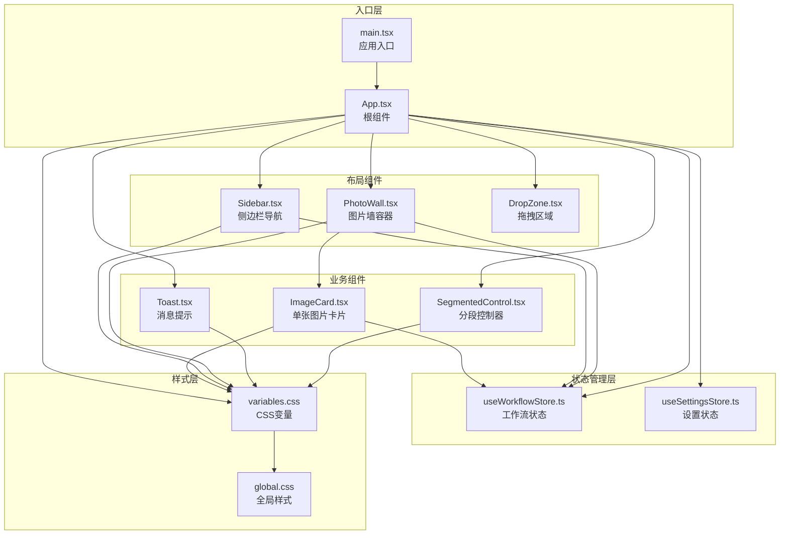
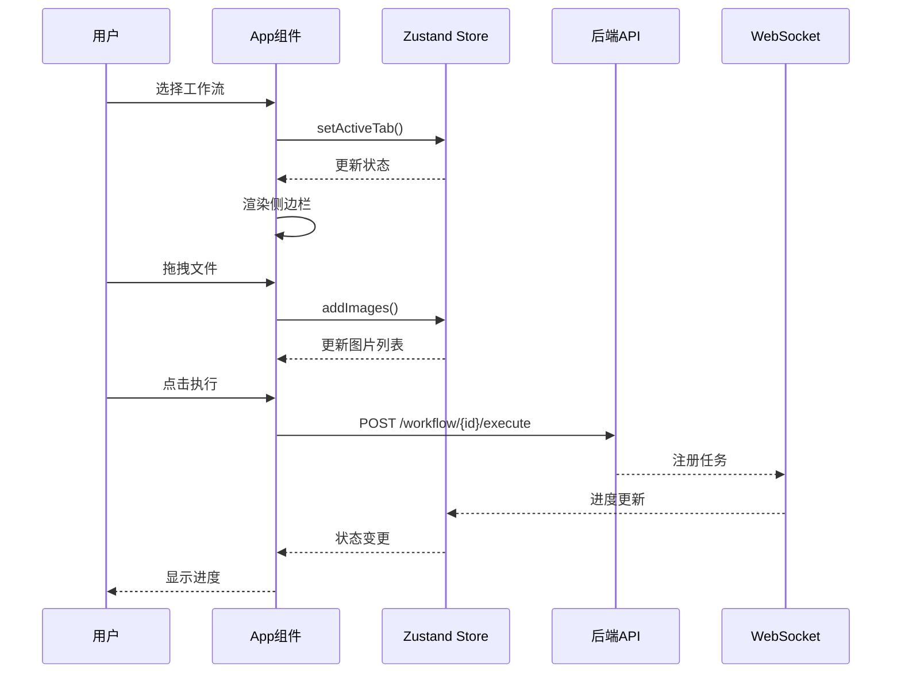
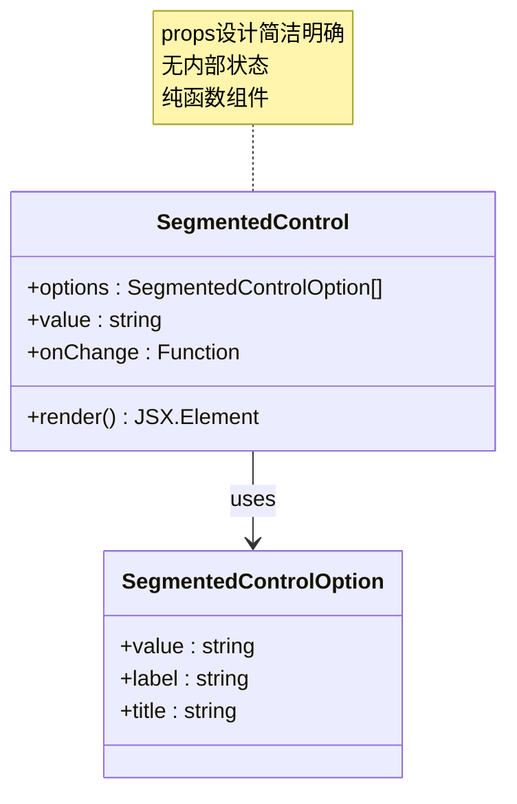
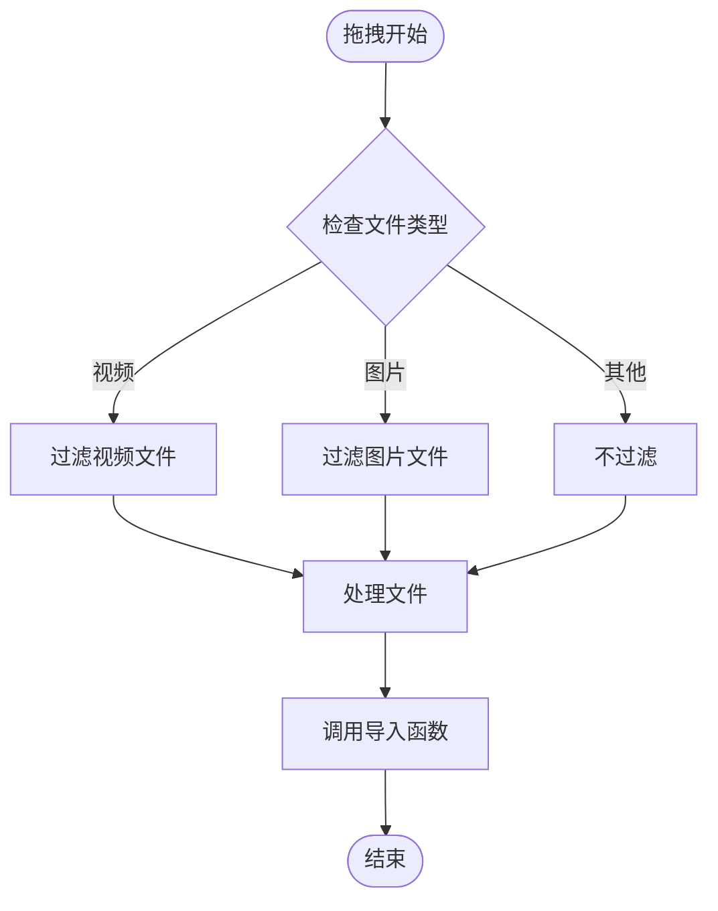
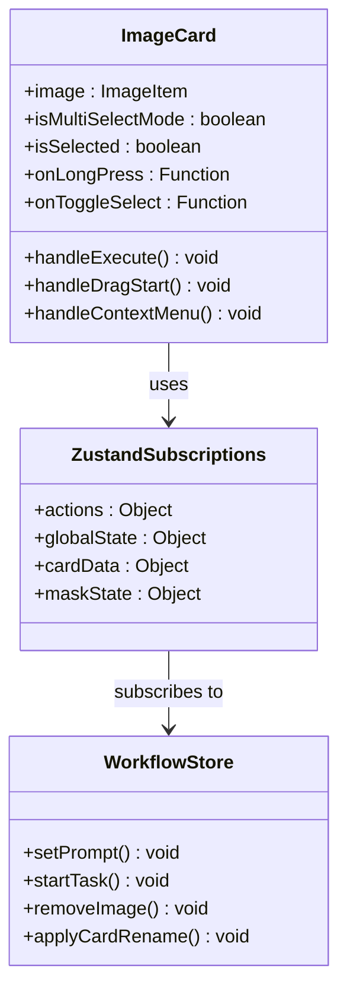
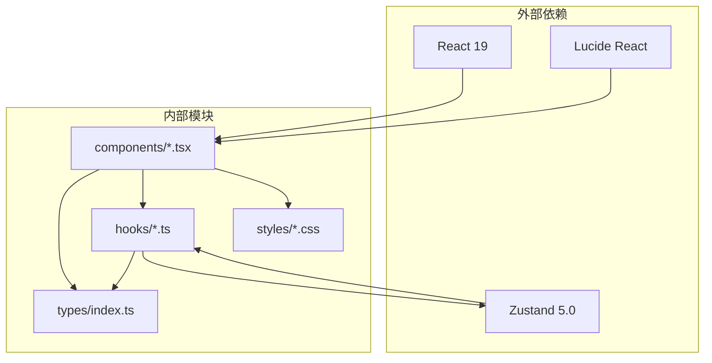

# UI 组件扩展开发

<cite>
**本文档引用的文件**
- [client/src/main.tsx](file://client/src/main.tsx)
- [client/src/components/App.tsx](file://client/src/components/App.tsx)
- [client/src/components/Sidebar.tsx](file://client/src/components/Sidebar.tsx)
- [client/src/components/PhotoWall.tsx](file://client/src/components/PhotoWall.tsx)
- [client/src/components/DropZone.tsx](file://client/src/components/DropZone.tsx)
- [client/src/components/ImageCard.tsx](file://client/src/components/ImageCard.tsx)
- [client/src/components/SegmentedControl.tsx](file://client/src/components/SegmentedControl.tsx)
- [client/src/components/Toast.tsx](file://client/src/components/Toast.tsx)
- [client/src/hooks/useWorkflowStore.ts](file://client/src/hooks/useWorkflowStore.ts)
- [client/src/hooks/useSettingsStore.ts](file://client/src/hooks/useSettingsStore.ts)
- [client/src/data/sidebarGroups.ts](file://client/src/data/sidebarGroups.ts)
- [client/src/types/index.ts](file://client/src/types/index.ts)
- [client/src/styles/global.css](file://client/src/styles/global.css)
- [client/src/styles/variables.css](file://client/src/styles/variables.css)
</cite>

## 目录
1. [简介](#简介)
2. [项目结构](#项目结构)
3. [核心组件](#核心组件)
4. [架构概览](#架构概览)
5. [详细组件分析](#详细组件分析)
6. [依赖关系分析](#依赖关系分析)
7. [性能考虑](#性能考虑)
8. [故障排除指南](#故障排除指南)
9. [结论](#结论)
10. [附录](#附录)

## 简介

本指南面向 CorineKit Pix2Real 项目的 UI 组件扩展开发，提供从简单按钮到复杂编辑器组件的完整开发流程和最佳实践。文档重点涵盖：

- 组件设计原则：架构、props 设计、状态管理
- 组件集成方法：路由配置、状态绑定、事件处理
- 样式系统扩展：CSS 变量、主题定制、响应式设计
- Hook 扩展开发：自定义 Hook 创建、状态管理集成、副作用处理
- 组件间通信模式：父子、兄弟、全局状态共享
- 实际扩展示例：从基础 SegmentedControl 到复杂 ImageCard 的完整实现

## 项目结构

Pix2Real 采用基于功能模块的组织方式，前端主要分为以下层次：

**图表来源**
- [client/src/main.tsx:1-11](file://client/src/main.tsx#L1-L11)
- [client/src/components/App.tsx:1-422](file://client/src/components/App.tsx#L1-L422)
- [client/src/components/Sidebar.tsx:1-434](file://client/src/components/Sidebar.tsx#L1-L434)
- [client/src/components/PhotoWall.tsx:1-781](file://client/src/components/PhotoWall.tsx#L1-L781)
- [client/src/components/DropZone.tsx:1-181](file://client/src/components/DropZone.tsx#L1-L181)
- [client/src/components/ImageCard.tsx:1-800](file://client/src/components/ImageCard.tsx#L1-L800)
- [client/src/components/SegmentedControl.tsx:1-50](file://client/src/components/SegmentedControl.tsx#L1-L50)
- [client/src/components/Toast.tsx:1-56](file://client/src/components/Toast.tsx#L1-L56)
- [client/src/hooks/useWorkflowStore.ts:1-923](file://client/src/hooks/useWorkflowStore.ts#L1-L923)
- [client/src/hooks/useSettingsStore.ts:1-177](file://client/src/hooks/useSettingsStore.ts#L1-L177)
- [client/src/styles/variables.css:1-31](file://client/src/styles/variables.css#L1-L31)
- [client/src/styles/global.css:1-300](file://client/src/styles/global.css#L1-L300)

**章节来源**
- [client/src/main.tsx:1-11](file://client/src/main.tsx#L1-L11)
- [client/src/components/App.tsx:1-422](file://client/src/components/App.tsx#L1-L422)

## 核心组件

### 应用根组件 (App)

App.tsx 是整个应用的根组件，负责：

- 状态管理：集成多个 zustand store
- 布局控制：根据活动标签页显示不同侧边栏
- 事件处理：拖拽文件导入、窗口大小调整
- 主题切换：支持明暗主题切换

关键特性：
- 使用 localStorage 存储视图尺寸和侧边栏宽度
- 动态计算右侧面板偏移量
- 支持多标签页工作流切换

**章节来源**
- [client/src/components/App.tsx:61-422](file://client/src/components/App.tsx#L61-L422)

### 图片墙容器 (PhotoWall)

PhotoWall.tsx 提供图片展示的核心容器：

- 支持三种视图尺寸：small、medium、large
- 实现虚拟滚动优化大量图片渲染
- 提供批量操作功能
- 集成拖拽删除区域

核心功能：
- LazyCard 组件实现 IntersectionObserver 优化
- 支持批量选择和操作
- 自动滚动到底部功能
- 蒙版数据集成

**章节来源**
- [client/src/components/PhotoWall.tsx:103-781](file://client/src/components/PhotoWall.tsx#L103-L781)

### 单张图片卡片 (ImageCard)

ImageCard.tsx 是最复杂的组件，承担以下职责：

- 多工作流支持：支持 11 种不同的工作流类型
- 状态管理：集成工作流状态、蒙版状态、设置状态
- 交互处理：拖拽、右键菜单、长按选择
- 输出管理：支持原图和多个输出版本
- 实时预览：视频工作流的实时播放

**章节来源**
- [client/src/components/ImageCard.tsx:51-800](file://client/src/components/ImageCard.tsx#L51-L800)

## 架构概览

**图表来源**
- [client/src/components/App.tsx:157-197](file://client/src/components/App.tsx#L157-L197)
- [client/src/hooks/useWorkflowStore.ts:560-599](file://client/src/hooks/useWorkflowStore.ts#L560-L599)

## 详细组件分析

### SegmentedControl 组件

SegmentedControl 是一个简单的分段控制器组件，展示了良好的组件设计原则：

**图表来源**
- [client/src/components/SegmentedControl.tsx:1-50](file://client/src/components/SegmentedControl.tsx#L1-L50)

设计特点：
- **props 设计**：使用接口定义清晰的属性结构
- **状态管理**：完全受控组件，无内部状态
- **样式系统**：使用 CSS 变量实现主题一致性
- **可复用性**：通用性强，适用于多种场景

**章节来源**
- [client/src/components/SegmentedControl.tsx:13-50](file://client/src/components/SegmentedControl.tsx#L13-L50)

### DropZone 组件

DropZone 展示了文件拖拽处理的最佳实践：

**图表来源**
- [client/src/components/DropZone.tsx:40-101](file://client/src/components/DropZone.tsx#L40-L101)

关键实现：
- 支持文件夹拖拽
- 类型过滤逻辑
- 本地存储文件输入
- 响应式样式适配

**章节来源**
- [client/src/components/DropZone.tsx:40-181](file://client/src/components/DropZone.tsx#L40-L181)

### ImageCard 组件

ImageCard 是最复杂的组件，集成了多种功能：

**图表来源**
- [client/src/components/ImageCard.tsx:51-100](file://client/src/components/ImageCard.tsx#L51-L100)

**章节来源**
- [client/src/components/ImageCard.tsx:51-800](file://client/src/components/ImageCard.tsx#L51-L800)

## 依赖关系分析

**图表来源**
- [client/package.json:11-25](file://client/package.json#L11-L25)
- [client/src/components/App.tsx:1-31](file://client/src/components/App.tsx#L1-L31)

**章节来源**
- [client/package.json:1-26](file://client/package.json#L1-L26)

## 性能考虑

### 虚拟滚动优化

PhotoWall 使用 LazyCard 实现 IntersectionObserver 优化：

- **异步根边距**：上 200px 下 1200px 减少内容位移
- **占位符机制**：避免高度变化导致的滚动跳变
- **观察器清理**：可见后停止观察防止闪烁

### 状态订阅优化

ImageCard 使用 useShallow 优化订阅：

- **分离订阅**：将频繁变化和稳定状态分离
- **稳定引用**：动作函数保持稳定引用
- **按需更新**：只在相关状态变化时重新渲染

### 样式性能

- **CSS 变量**：减少重排重绘
- **GPU 加速**：动画使用 transform 和 opacity
- **滚动锚定**：启用 CSS scroll anchoring

## 故障排除指南

### 常见问题及解决方案

**问题 1：拖拽功能失效**
- 检查浏览器兼容性
- 确认文件类型过滤逻辑
- 验证事件冒泡处理

**问题 2：状态不同步**
- 检查 zustand 订阅是否正确
- 确认状态更新函数引用
- 验证 store 初始化

**问题 3：样式主题异常**
- 检查 data-theme 属性
- 验证 CSS 变量定义
- 确认主题切换逻辑

**章节来源**
- [client/src/components/DropZone.tsx:157-181](file://client/src/components/DropZone.tsx#L157-L181)
- [client/src/components/App.tsx:131-137](file://client/src/components/App.tsx#L131-L137)

## 结论

本指南提供了 Pix2Real 项目 UI 组件扩展开发的完整框架。通过遵循以下原则可以确保高质量的组件扩展：

1. **组件设计原则**：保持单一职责、清晰的 props 接口、无内部状态的受控组件
2. **状态管理**：合理使用 zustand，优化订阅策略，避免不必要的重渲染
3. **样式系统**：统一使用 CSS 变量，支持主题切换，实现响应式设计
4. **性能优化**：采用虚拟滚动、GPU 加速、状态订阅优化等技术
5. **错误处理**：完善的错误边界和用户反馈机制

## 附录

### 组件开发最佳实践清单

- **Props 设计**：使用 TypeScript 接口定义，提供默认值
- **状态管理**：优先使用 zustand，避免深层嵌套状态
- **样式系统**：统一使用 CSS 变量，支持暗色模式
- **性能优化**：实现虚拟滚动，优化重渲染
- **测试覆盖**：编写单元测试和集成测试
- **文档完善**：提供详细的使用说明和 API 文档

### 扩展开发流程

1. **需求分析**：明确组件功能和使用场景
2. **设计规划**：定义 props 接口和状态结构
3. **实现开发**：按照最佳实践实现组件
4. **集成测试**：与现有系统集成测试
5. **性能优化**：进行性能基准测试和优化
6. **文档完善**：编写使用文档和 API 参考
7. **代码审查**：团队代码审查和质量保证