# 后端服务扩展开发

<cite>
**本文档引用的文件**
- [server/src/index.ts](file://server/src/index.ts)
- [server/src/route/workflow.ts](file://server/src/routes/workflow.ts)
- [server/src/services/comfyui.ts](file://server/src/services/comfyui.ts)
- [server/src/types/index.ts](file://server/src/types/index.ts)
- [server/src/adapters/index.ts](file://server/src/adapters/index.ts)
- [server/src/config/paths.ts](file://server/src/config/paths.ts)
- [server/src/services/sessionManager.ts](file://server/src/services/sessionManager.ts)
- [server/src/route/output.ts](file://server/src/routes/output.ts)
- [server/src/route/session.ts](file://server/src/routes/session.ts)
- [server/src/services/llmService.ts](file://server/src/services/llmService.ts)
- [server/src/route/modelMeta.ts](file://server/src/routes/modelMeta.ts)
- [server/src/route/agent.ts](file://server/src/routes/agent.ts)
- [server/src/route/favorites.ts](file://server/src/routes/favorites.ts)
- [server/package.json](file://server/package.json)
</cite>

## 目录
1. [简介](#简介)
2. [项目结构](#项目结构)
3. [核心组件](#核心组件)
4. [架构概览](#架构概览)
5. [详细组件分析](#详细组件分析)
6. [依赖关系分析](#依赖关系分析)
7. [性能考虑](#性能考虑)
8. [故障排除指南](#故障排除指南)
9. [结论](#结论)
10. [附录](#附录)

## 简介

CorineKit Pix2Real 是一个基于 ComfyUI 的 AI 图像生成平台，提供了从二次元转真人到图像处理的完整工作流解决方案。本文档专注于后端服务的扩展开发，涵盖了 API 路由开发、服务层扩展、WebSocket 服务、中间件开发、配置系统扩展等核心主题。

该项目采用 TypeScript 构建，使用 Express.js 作为 Web 服务器框架，结合 WebSocket 实现实时通信，通过 ComfyUI API 进行图像生成和处理。系统设计注重可扩展性和模块化，为开发者提供了清晰的扩展点和最佳实践指导。

## 项目结构

项目采用模块化的目录结构，主要分为以下几个核心部分：

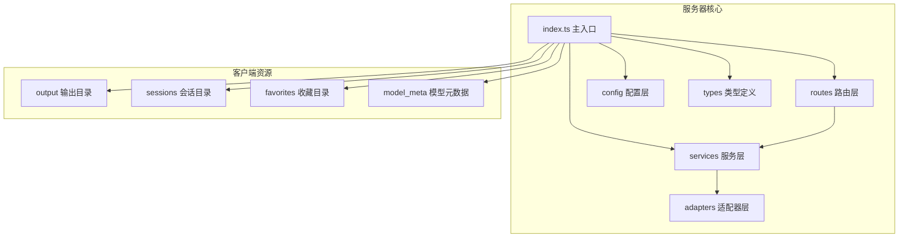

**图表来源**
- [server/src/index.ts:1-516](file://server/src/index.ts#L1-L516)
- [server/src/config/paths.ts:1-156](file://server/src/config/paths.ts#L1-L156)

**章节来源**
- [server/src/index.ts:1-516](file://server/src/index.ts#L1-L516)
- [server/package.json:1-28](file://server/package.json#L1-L28)

## 核心组件

### 服务器入口与初始化

主服务器入口负责初始化 Express 应用、配置中间件、设置路由和启动 WebSocket 服务。

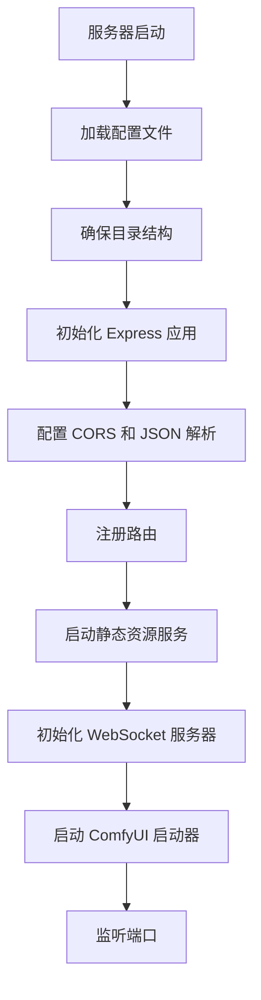

**图表来源**
- [server/src/index.ts:102-117](file://server/src/index.ts#L102-L117)
- [server/src/index.ts:118-145](file://server/src/index.ts#L118-L145)
- [server/src/index.ts:498-516](file://server/src/index.ts#L498-L516)

### 路由系统架构

系统采用模块化的路由设计，每个功能模块都有独立的路由文件：

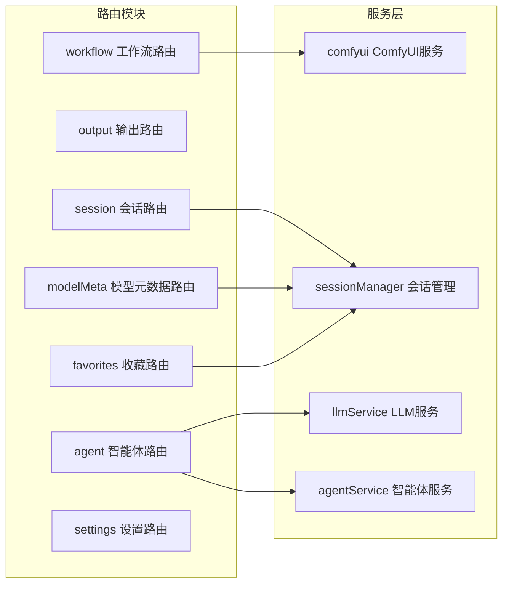

**图表来源**
- [server/src/index.ts:8-14](file://server/src/index.ts#L8-L14)
- [server/src/index.ts:129-145](file://server/src/index.ts#L129-L145)

**章节来源**
- [server/src/index.ts:1-516](file://server/src/index.ts#L1-L516)

## 架构概览

系统采用分层架构设计，确保关注点分离和代码的可维护性：

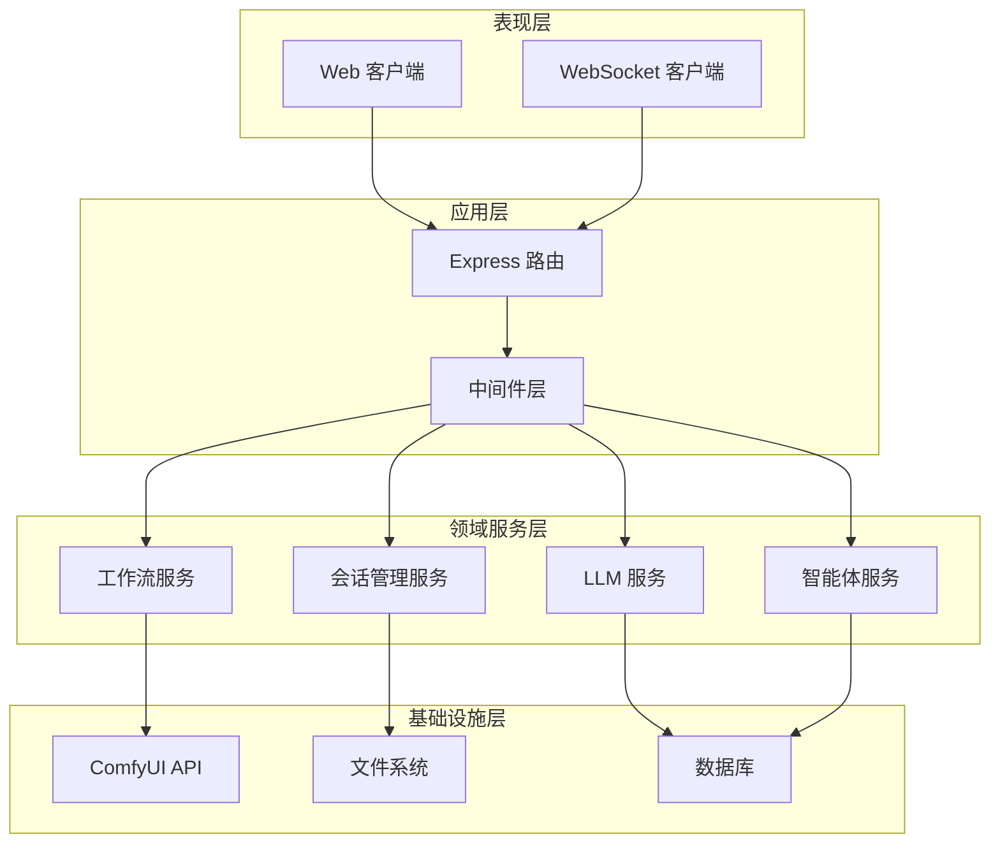

**图表来源**
- [server/src/index.ts:118-158](file://server/src/index.ts#L118-L158)
- [server/src/services/comfyui.ts:168-196](file://server/src/services/comfyui.ts#L168-L196)

## 详细组件分析

### API 路由开发

#### 工作流路由扩展

工作流路由是系统的核心，负责处理各种图像生成和处理请求：

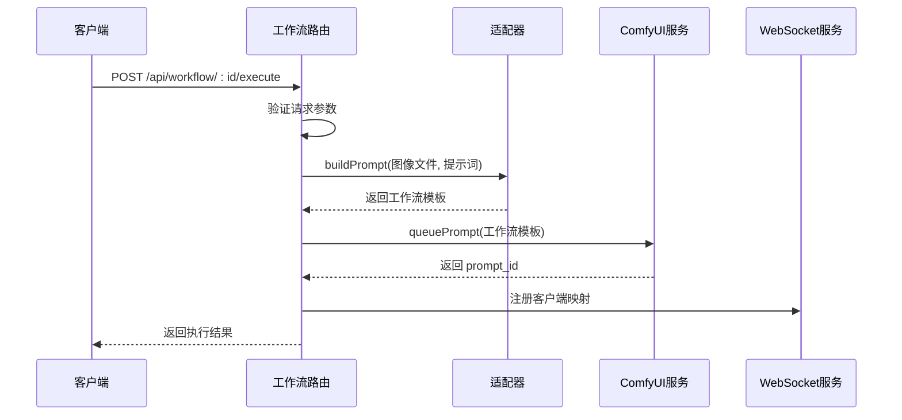

**图表来源**
- [server/src/routes/workflow.ts:750-799](file://server/src/routes/workflow.ts#L750-L799)
- [server/src/services/comfyui.ts:168-196](file://server/src/services/comfyui.ts#L168-L196)

##### 路由定义最佳实践

1. **参数验证**: 始终验证请求参数的有效性
2. **错误处理**: 提供用户友好的错误信息
3. **文件上传**: 使用 Multer 处理文件上传
4. **异步处理**: 使用 async/await 处理异步操作

**章节来源**
- [server/src/routes/workflow.ts:1-800](file://server/src/routes/workflow.ts#L1-L800)

#### 会话路由扩展

会话路由负责管理用户的工作会话和状态：

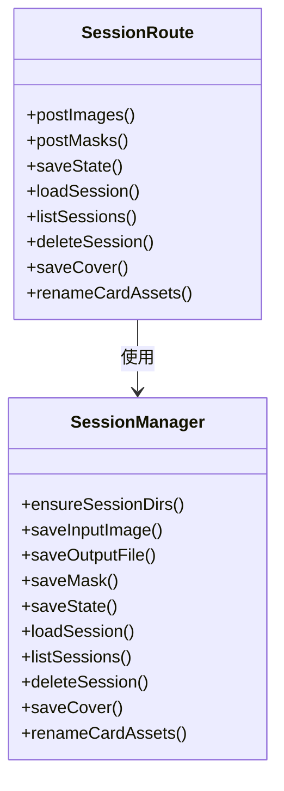

**图表来源**
- [server/src/routes/session.ts:1-163](file://server/src/routes/session.ts#L1-L163)
- [server/src/services/sessionManager.ts:11-539](file://server/src/services/sessionManager.ts#L11-L539)

**章节来源**
- [server/src/routes/session.ts:1-163](file://server/src/routes/session.ts#L1-L163)
- [server/src/services/sessionManager.ts:1-539](file://server/src/services/sessionManager.ts#L1-L539)

### 服务层扩展技术

#### ComfyUI 服务集成

ComfyUI 服务层提供了与 ComfyUI API 的完整集成：

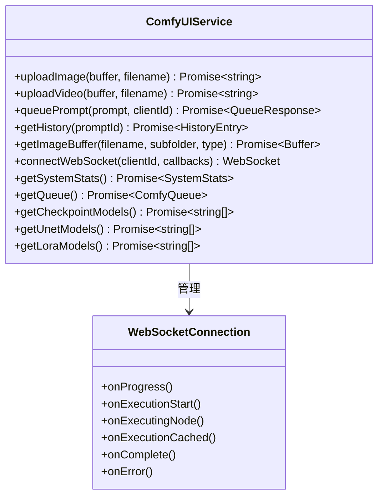

**图表来源**
- [server/src/services/comfyui.ts:1-472](file://server/src/services/comfyui.ts#L1-L472)

##### 业务逻辑封装

服务层实现了清晰的业务逻辑封装：

1. **文件上传处理**: 统一处理图像和视频文件上传
2. **工作流队列管理**: 管理 ComfyUI 的工作流队列
3. **进度跟踪**: 实现详细的进度跟踪和状态管理
4. **错误处理**: 提供健壮的错误处理机制

**章节来源**
- [server/src/services/comfyui.ts:1-472](file://server/src/services/comfyui.ts#L1-L472)

#### 适配器模式实现

系统使用适配器模式来处理不同类型的工作流：

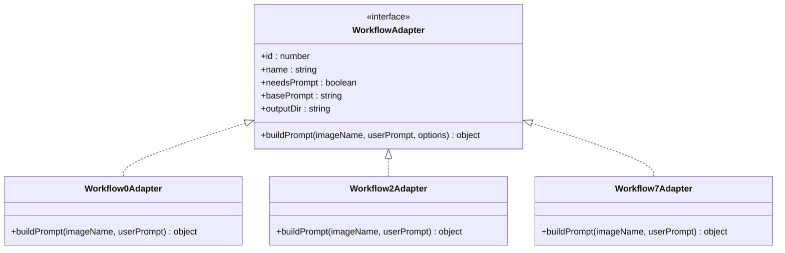

**图表来源**
- [server/src/types/index.ts:1-8](file://server/src/types/index.ts#L1-L8)
- [server/src/adapters/index.ts:14-33](file://server/src/adapters/index.ts#L14-L33)

**章节来源**
- [server/src/types/index.ts:1-52](file://server/src/types/index.ts#L1-L52)
- [server/src/adapters/index.ts:1-33](file://server/src/adapters/index.ts#L1-L33)

### WebSocket 服务扩展

#### 实时通信架构

WebSocket 服务实现了与 ComfyUI 的实时通信：

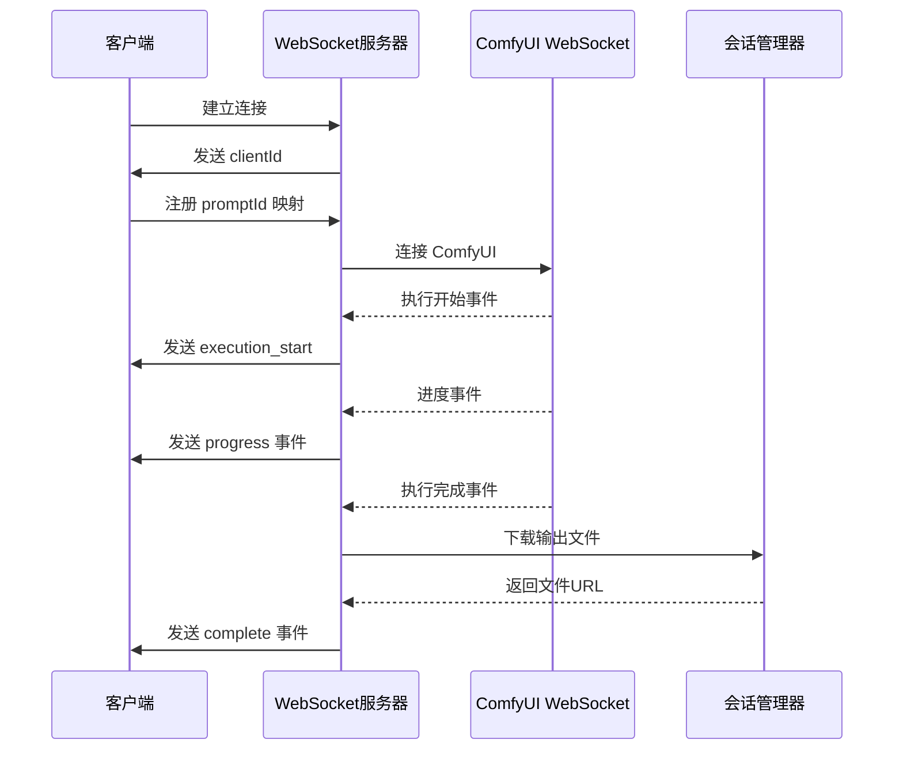

**图表来源**
- [server/src/index.ts:168-494](file://server/src/index.ts#L168-L494)

##### 事件处理机制

WebSocket 服务实现了完善的事件处理机制：

1. **连接管理**: 自动分配 clientId 和管理连接生命周期
2. **事件缓冲**: 缓冲事件以处理客户端延迟注册
3. **进度跟踪**: 实现精确的进度跟踪和百分比计算
4. **错误处理**: 提供全面的错误处理和恢复机制

**章节来源**
- [server/src/index.ts:157-494](file://server/src/index.ts#L157-L494)

### 中间件开发

#### CORS 中间件配置

系统使用 CORS 中间件来处理跨域请求：

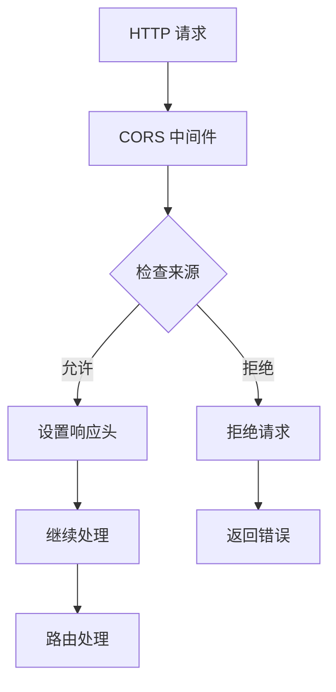

**图表来源**
- [server/src/index.ts:121-125](file://server/src/index.ts#L121-L125)

#### 请求解析中间件

系统配置了多种请求解析中间件：

1. **JSON 解析**: 处理 JSON 格式的请求体
2. **文件上传**: 使用 Multer 处理文件上传
3. **静态文件服务**: 提供静态资源服务

**章节来源**
- [server/src/index.ts:127-145](file://server/src/index.ts#L127-L145)

### 配置系统扩展

#### 路径配置管理

配置系统提供了灵活的路径管理机制：

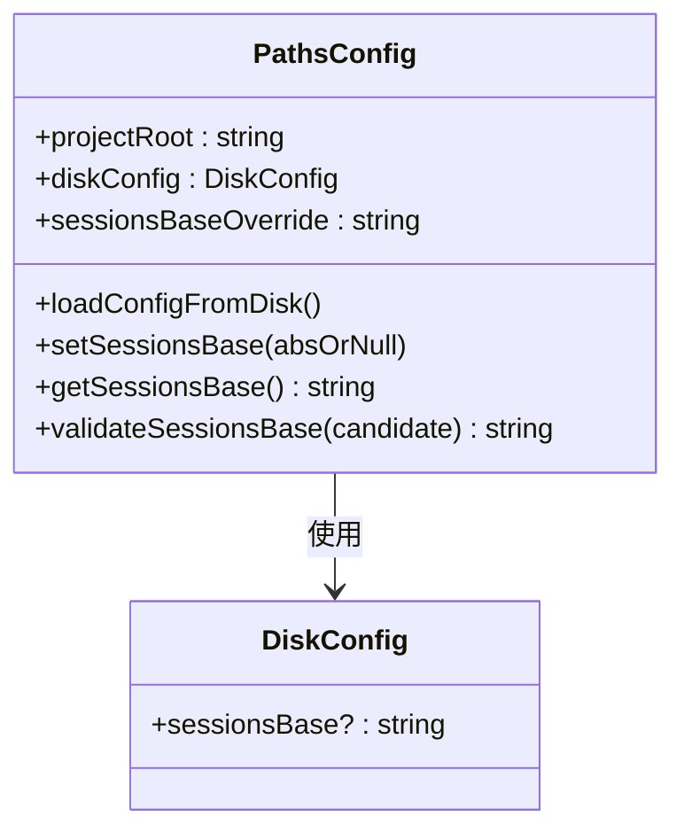

**图表来源**
- [server/src/config/paths.ts:24-100](file://server/src/config/paths.ts#L24-L100)

##### 配置验证机制

配置系统实现了严格的验证机制：

1. **路径验证**: 验证路径的合法性
2. **权限检查**: 确保目录具有写权限
3. **嵌套检查**: 防止路径嵌套在会话目录内
4. **持久化存储**: 将配置保存到 config.json 文件

**章节来源**
- [server/src/config/paths.ts:1-156](file://server/src/config/paths.ts#L1-L156)

## 依赖关系分析

系统采用模块化的依赖管理，确保组件间的松耦合：

```mermaid
graph TB
subgraph "核心依赖"
A[express] --> B[路由处理]
C[cors] --> D[跨域处理]
E[ws] --> F[WebSocket通信]
G[multer] --> H[文件上传]
end
subgraph "开发依赖"
I[typescript] --> J[类型安全]
K[@types/express] --> L[类型定义]
M[@types/ws] --> N[WebSocket类型]
end
subgraph "业务依赖"
O[node-fetch] --> P[HTTP请求]
Q[form-data] --> R[表单数据]
end
```

**图表来源**
- [server/package.json:11-26](file://server/package.json#L11-L26)

**章节来源**
- [server/package.json:1-28](file://server/package.json#L1-L28)

## 性能考虑

### 并发处理优化

系统采用了多种并发处理策略：

1. **异步操作**: 所有 I/O 操作都使用异步处理
2. **连接池**: WebSocket 连接采用连接池管理
3. **缓存机制**: 元数据使用缓存减少文件读取
4. **事件缓冲**: WebSocket 事件缓冲减少网络压力

### 内存管理

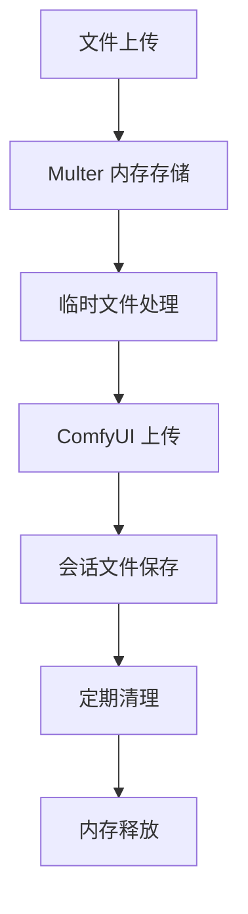

**图表来源**
- [server/src/routes/workflow.ts:30](file://server/src/routes/workflow.ts#L30)
- [server/src/services/sessionManager.ts:42-48](file://server/src/services/sessionManager.ts#L42-L48)

### 错误处理策略

系统实现了多层次的错误处理机制：

1. **请求级错误**: 验证请求参数和格式
2. **服务级错误**: 处理服务调用异常
3. **系统级错误**: 监控系统状态和资源使用
4. **用户友好错误**: 提供清晰的错误信息

## 故障排除指南

### 常见问题诊断

#### ComfyUI 连接问题

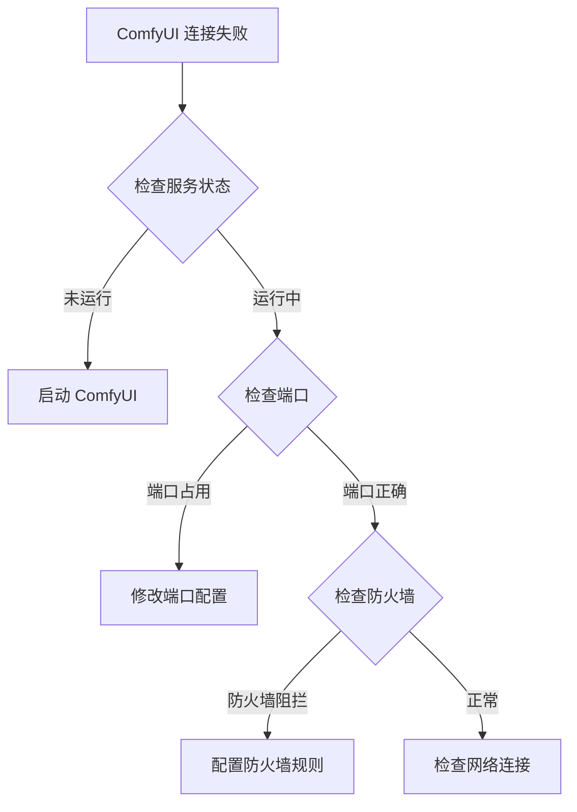

**图表来源**
- [server/src/index.ts:500-506](file://server/src/index.ts#L500-L506)

#### WebSocket 连接问题

1. **连接超时**: 检查客户端网络连接
2. **消息丢失**: 检查事件缓冲机制
3. **进度不准确**: 检查节点权重计算
4. **内存泄漏**: 监控连接数量和资源使用

**章节来源**
- [server/src/index.ts:498-516](file://server/src/index.ts#L498-L516)

### 日志记录

系统实现了全面的日志记录机制：

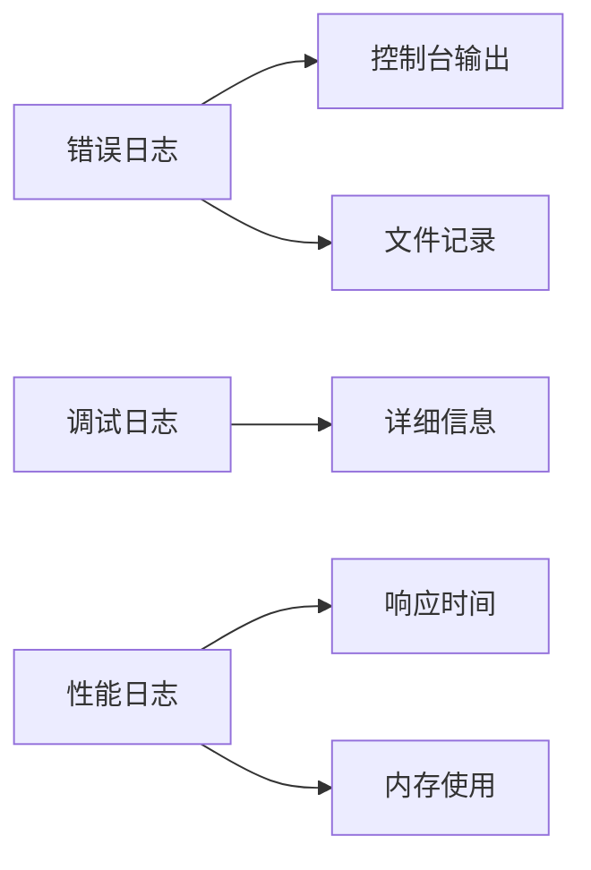

**图表来源**
- [server/src/index.ts:169-170](file://server/src/index.ts#L169-L170)

## 结论

CorineKit Pix2Real 提供了一个完整的后端服务扩展框架，具有以下特点：

1. **模块化设计**: 清晰的分层架构便于扩展和维护
2. **实时通信**: 基于 WebSocket 的实时反馈机制
3. **灵活配置**: 支持动态配置和路径管理
4. **健壮错误处理**: 多层次的错误处理和恢复机制
5. **性能优化**: 异步处理和缓存机制提升性能

开发者可以基于现有的架构模式快速扩展新的功能，包括新的工作流、服务接口、中间件和配置选项。

## 附录

### 扩展开发最佳实践

1. **遵循现有模式**: 使用现有的路由和服务模式
2. **参数验证**: 始终验证输入参数的有效性
3. **错误处理**: 提供用户友好的错误信息
4. **异步处理**: 使用 async/await 处理异步操作
5. **资源管理**: 及时释放文件句柄和连接
6. **日志记录**: 记录重要的操作和错误信息
7. **配置管理**: 使用配置系统管理可变参数
8. **测试覆盖**: 编写单元测试和集成测试

### 新功能开发步骤

1. **需求分析**: 明确功能需求和使用场景
2. **架构设计**: 设计路由、服务和数据模型
3. **实现开发**: 按照最佳实践实现功能
4. **测试验证**: 编写测试用例并验证功能
5. **文档编写**: 编写使用文档和技术文档
6. **部署集成**: 集成到现有系统并监控运行状态